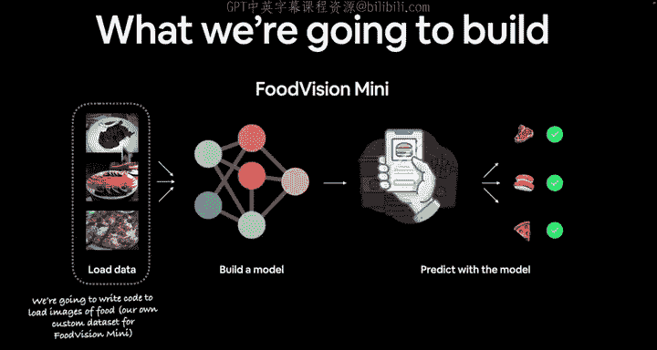
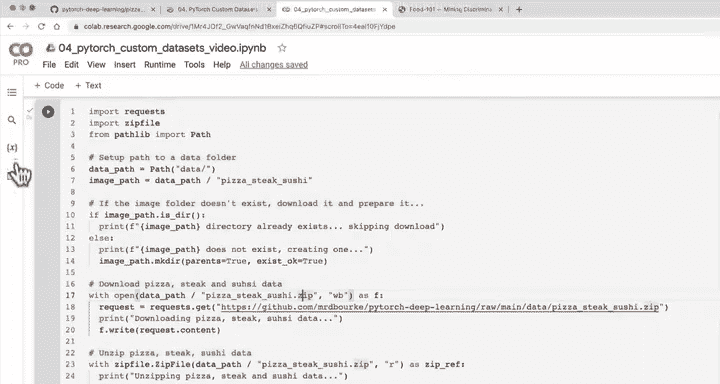

#  78：下载自定义披萨、牛排和寿司图像数据集 🍕🥩🍣




在本节课中，我们将学习如何下载一个自定义的图像数据集，该数据集包含披萨、牛排和寿司三类食物的图片。我们将编写代码从GitHub下载数据，并将其解压到本地目录中，为后续的PyTorch模型训练做好准备。

## 概述

上一节我们介绍了处理自定义数据集的基本概念。本节中，我们来看看如何实际操作，下载一个具体的食物图像数据集。我们将使用Python代码从网络获取数据，并准备好数据目录结构。

## 获取数据

正如上一节所述，没有数据就无法处理自定义数据集。因此，让我们获取一些数据，并明确我们要构建的目标：一个迷你版的“食物视觉”模型。我们需要获取一些食物图像。

TorchVision库内置了许多数据集，其中之一是Food 101数据集。Food 101数据集包含101个不同食物类别，共有101,000张图像，是一个颇具挑战性的数据集。每个类别提供250张经过人工审核的测试图像，以及750张训练图像。

虽然我们可以直接使用整个数据集，但为了练习，我创建了该数据集的一个较小子集。我建议你在处理自己的问题时也采用相同策略：从小规模开始，必要时再扩大。

我将类别数量减少到三个，图像数量减少到原数据集的10%。你可以任意缩减规模，但我认为从三个类别和10%的数据开始就足够了。如果模型运行良好，你可以自行扩大规模。

我创建这个数据子集时使用的笔记本位于`extras/04_custom_data_creation.ipynb`。你可以将其作为课外资料进行学习。该数据集采用图像分类的典型结构：顶层文件夹包含`pizza_steak_sushi`，其下是`train`和`test`目录，每个目录中又分别包含`pizza`、`steak`和`sushi`子文件夹。

现在，我们将编写代码来获取这个数据集。该数据集的较小版本位于PyTorch深度学习代码库的`data`目录下。

## 编写下载代码

我们的数据是Food 101数据集的子集。Food 101数据集始于101个不同的食物类别。我们当然可以为101个类别构建计算机视觉模型，但我们将从小规模开始。我们的数据集始于3个食物类别，并且只使用10%的图像。每个类别大约有75张训练图像和25张测试图像。

为什么要这样做？在开始机器学习项目时，先在小规模上尝试，必要时再扩大规模，这一点非常重要。这样做的核心目的是**加快实验速度**。如果一开始就尝试在10万张图像上训练，模型每次训练可能需要半小时。在项目初期，我们希望提高实验的迭代速率。

以下是下载数据的步骤：

首先，导入必要的库。我们将使用`requests`从GitHub下载文件，使用`zipfile`处理压缩文件，使用`pathlib`处理文件路径。

```python
import requests
import zipfile
from pathlib import Path
```

接下来，设置数据文件夹的路径。我通常喜欢创建一个名为`data`的文件夹来存储项目数据。

```python
# 设置数据路径
data_path = Path("data")
image_path = data_path / "pizza_steak_sushi"
```

然后，检查图像文件夹是否存在。如果不存在，则创建它。

```python
# 如果图像目录不存在，则创建它
if image_path.is_dir():
    print(f"{image_path} 目录已存在，跳过下载。")
else:
    print(f"{image_path} 不存在，正在创建...")
    image_path.mkdir(parents=True, exist_ok=True)
```

现在，下载披萨、牛排和寿司数据。我们将从GitHub的原始链接下载一个ZIP文件。

```python
# 下载数据
with open(data_path / "pizza_steak_sushi.zip", "wb") as f:
    request = requests.get("https://github.com/mrdbourke/pytorch-deep-learning/raw/main/data/pizza_steak_sushi.zip")
    print("正在下载披萨、牛排、寿司数据...")
    f.write(request.content)
```

下载完成后，解压ZIP文件到我们创建的图像目录。

```python
# 解压数据
with zipfile.ZipFile(data_path / "pizza_steak_sushi.zip", "r") as zip_ref:
    print("正在解压披萨、牛排、寿司数据...")
    zip_ref.extractall(image_path)
```

运行这段代码后，数据将被下载并解压到`data/pizza_steak_sushi`目录中。该目录下将包含`train`和`test`子文件夹，每个子文件夹中又包含`pizza`、`steak`和`sushi`的图片。

**重要提示**：在从GitHub下载文件时，必须使用“原始”(raw)文件的链接地址，而不是“blob”链接，否则文件可能无法正确解压。

## 数据探索

下载完成后，我们可以在`data/pizza_steak_sushi/test`或`train`目录中查看图像。例如，打开测试目录中的一张图片，你可能会看到一张披萨的图像。

请记住，我们正在专门处理一个针对披萨、牛排和寿司的计算机视觉问题。然而，整个过程的核心是：我们有一些自定义数据，我们希望将这些数据转换为张量。对于你自己的问题，过程将是相同的：加载目标数据集，然后编写代码将数据转换为PyTorch可用的张量格式。

## 总结



本节课中，我们一起学习了如何下载一个自定义的食物图像数据集。我们编写了Python代码，使用`requests`库从GitHub获取数据，使用`zipfile`库解压文件，并使用`pathlib`管理路径。我们成功地将披萨、牛排和寿司三类食物的图片下载并组织到了本地目录结构中，为下一步将图像数据加载到PyTorch中做好了准备。下一节，我们将探索刚刚下载的数据。