# 79：与数据融为一体 🍕🥩🍣


在本节课中，我们将学习如何探索和准备一个自定义的图像分类数据集。我们将通过编写代码来查看数据集的目录结构、随机可视化图像，并理解数据的标准格式，为后续将数据转换为PyTorch张量做好准备。


---


## 数据探索：目录结构

上一节我们编写了代码来下载一个自定义数据集。本节中，我们来看看如何探索这个数据集的目录结构。

以下是探索目录的辅助函数，它使用 `os.walk` 遍历指定路径下的所有目录和文件。

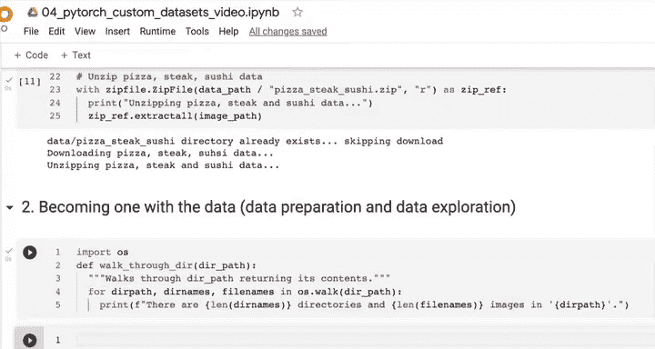

```python
import os

def walk_through_dir(dir_path):
    """
    遍历目录路径，返回其内容。
    """
    for dirpath, dirnames, filenames in os.walk(dir_path):
        print(f"在 `{dirpath}` 中有 {len(dirnames)} 个目录和 {len(filenames)} 张图片。")
```

运行这个函数来查看我们的数据目录。

```python
image_path = "data/pizza_steak_sushi"
walk_through_dir(image_path)
```

运行结果会显示数据集的整体结构。例如，顶层目录下有一个 `train` 文件夹和一个 `test` 文件夹。每个文件夹内又包含以类别命名的子文件夹（如 `pizza`, `steak`, `sushi`），里面存放着对应的图片。

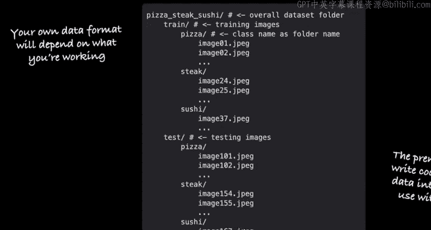

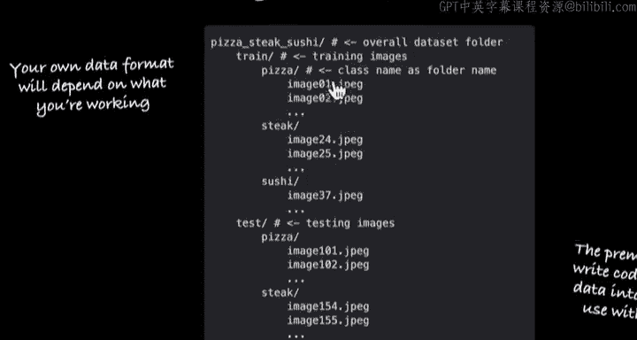

---

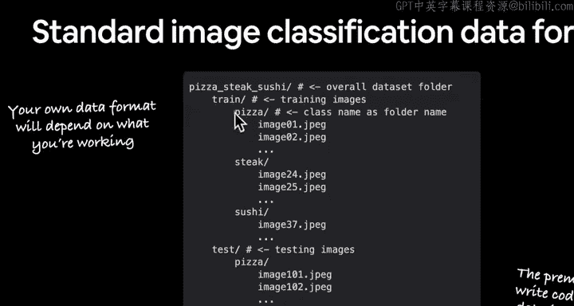

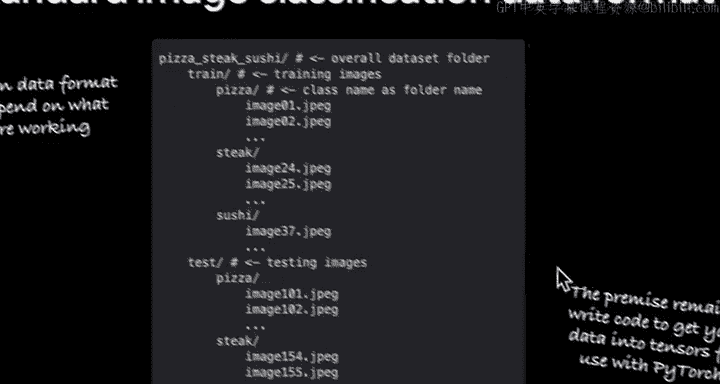

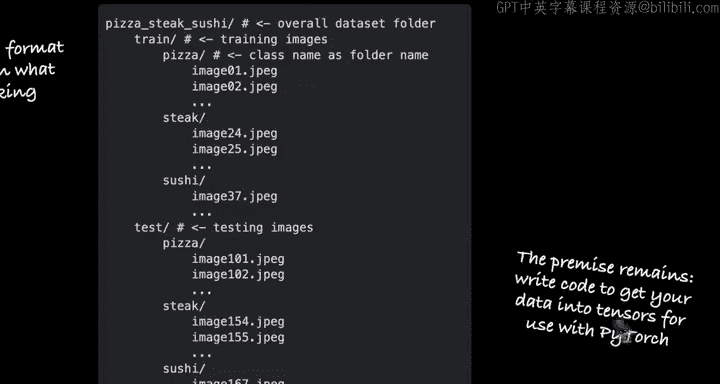


## 理解标准图像分类格式

从目录遍历的结果，我们可以理解标准图像分类数据集的格式。

我们设置训练和测试路径。

```python
train_dir = image_path + "/train"
test_dir = image_path + "/test"
print(f"训练目录: {train_dir}")
print(f"测试目录: {test_dir}")
```

这种格式的核心是：**图片的类别由其所在的文件夹名称决定**。例如，所有披萨图片都存放在 `train/pizza/` 目录下。这种结构被PyTorch的 `torchvision.datasets.ImageFolder` 等内置数据加载器所支持。

---

## 数据探索：随机可视化图像

仅仅知道目录结构还不够。对于视觉数据，我们需要直观地查看图片本身。本节中，我们通过编写代码来随机选择并显示一张图片。


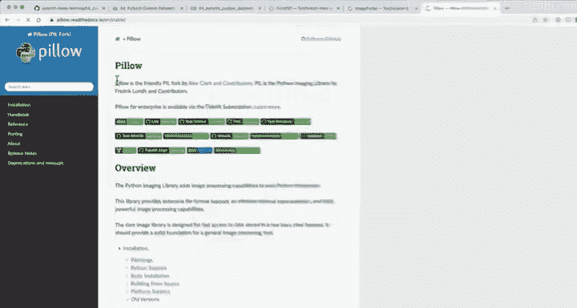

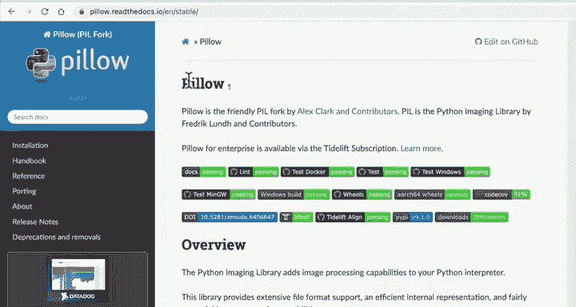

以下是实现随机可视化图像的步骤：

1.  获取所有图片的路径列表。
2.  随机选择一个图片路径。
3.  从路径中提取图片的类别（即父文件夹名）。
4.  使用PIL库打开图片。
5.  打印图片的元数据并显示。

```python
import random
from pathlib import Path
from PIL import Image

# 设置随机种子以确保结果可复现
random.seed(42)

# 1. 获取所有图片路径
image_path_list = list(Path(image_path).glob("*/*/*.jpg"))

# 2. 随机选择一个图片路径
random_image_path = random.choice(image_path_list)
print(f"随机选择的图片路径: {random_image_path}")

# 3. 获取图片类别
image_class = random_image_path.parent.stem
print(f"图片类别: {image_class}")

# 4. 打开图片
img = Image.open(random_image_path)

# 5. 打印元数据并显示图片
print(f"图片高度: {img.height}")
print(f"图片宽度: {img.width}")
img.show() # 这会使用系统默认图片查看器打开图片
```

多次运行这段代码，可以随机查看数据集中的不同图片，帮助我们了解数据的多样性和质量。

---

## 使用Matplotlib可视化图像


上一节我们使用PIL库显示了图片。本节中，我们来看看如何使用更常用的数据科学库Matplotlib来完成同样的任务，这需要我们将图片转换为NumPy数组。

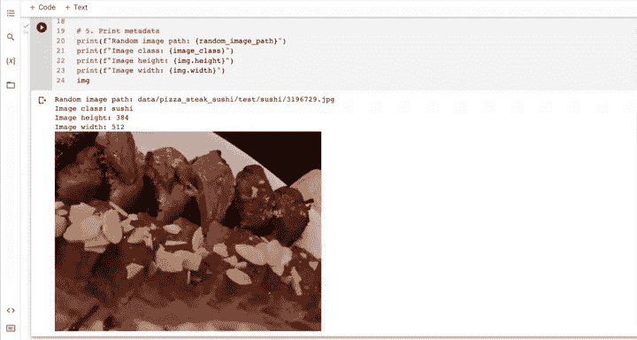

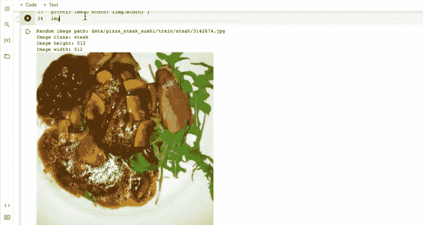

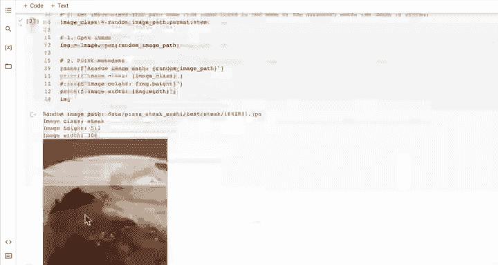


以下是使用Matplotlib显示图片的代码：

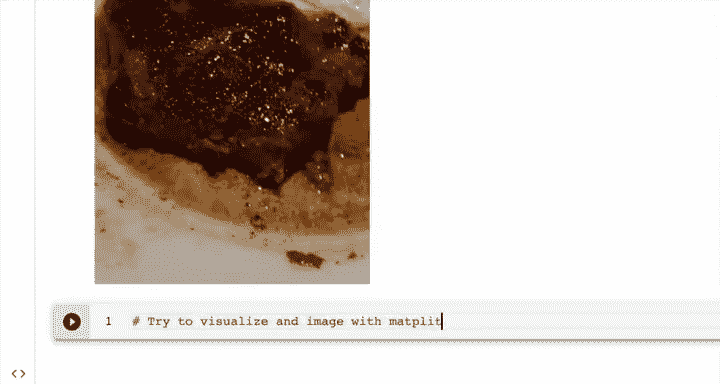

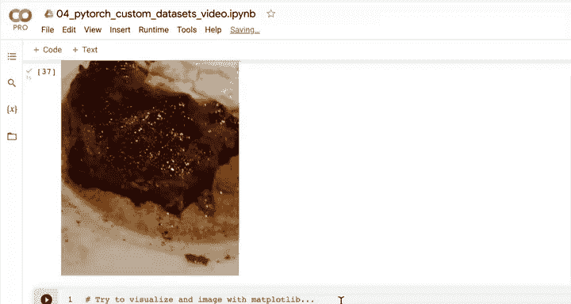

```python
import numpy as np
import matplotlib.pyplot as plt

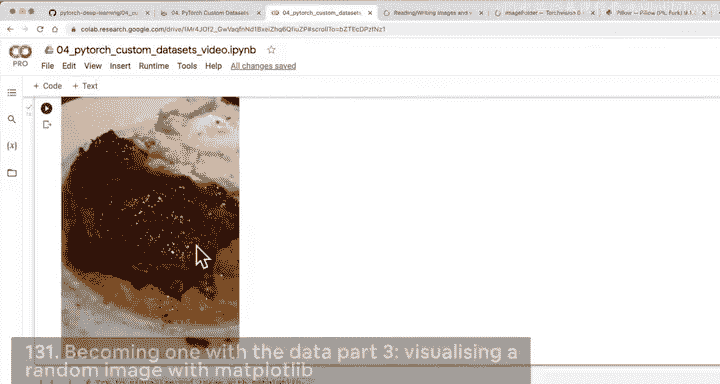

# 将PIL图像转换为NumPy数组
img_as_array = np.asarray(img)


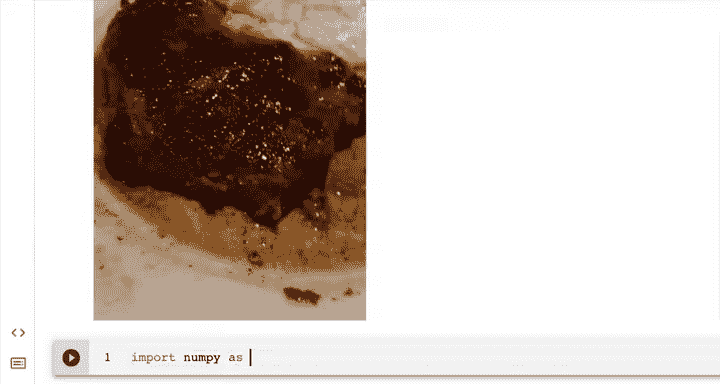

# 使用Matplotlib绘制图像
plt.figure(figsize=(10, 7))
plt.imshow(img_as_array)
plt.title(f"类别: {image_class} | 图像形状: {img_as_array.shape}")
plt.axis(False)
plt.show()
```

关键点在于理解图像的形状 `(高度, 宽度, 颜色通道)`。例如，`(512, 306, 3)` 表示图片高512像素，宽306像素，并有3个颜色通道（红、绿、蓝）。**注意**：PIL和Matplotlib默认使用“通道在后”的格式，而PyTorch通常使用“通道在前”的格式，这在后续数据转换时需要留意。

---

## 总结

本节课中我们一起学习了深度学习项目中至关重要的数据准备和探索阶段。

我们首先编写了遍历目录的函数来理解数据集的**标准图像分类格式**，即图片按类别存放在以类别命名的文件夹中。接着，我们通过编写代码**随机选择并可视化**数据集中的图片，这有助于我们直观感受数据。最后，我们使用Matplotlib库展示了图片，并理解了图像数据的**形状**（高度、宽度、颜色通道），这是后续构建模型时处理张量形状的基础。

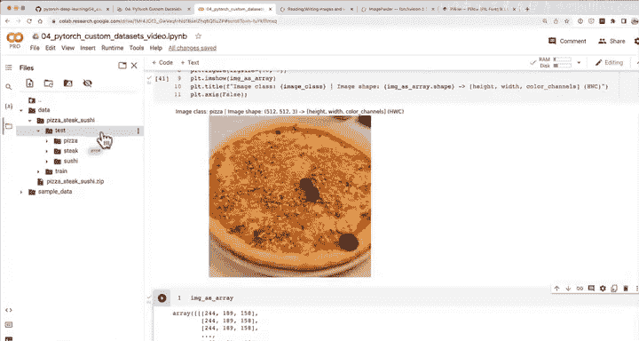

通过“与数据融为一体”，我们为下一步——将所有这些图像文件转换为PyTorch能够处理的张量——打下了坚实的基础。