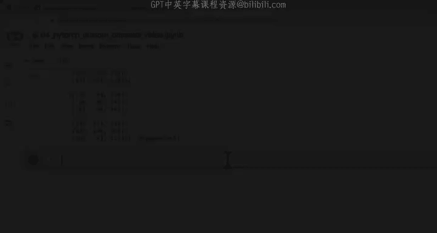
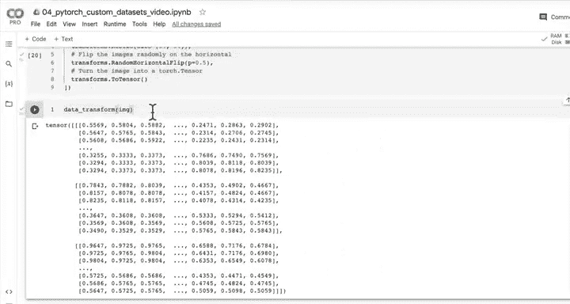
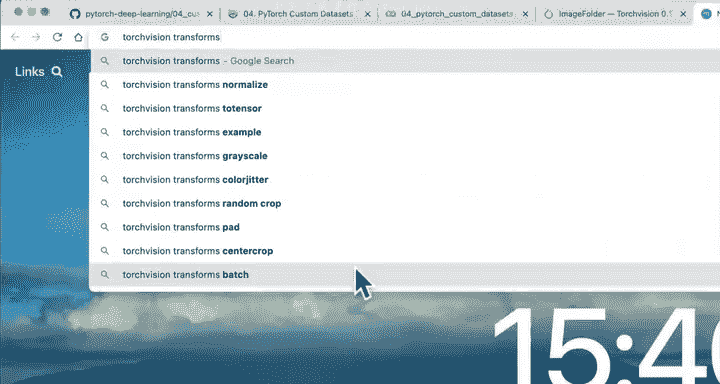
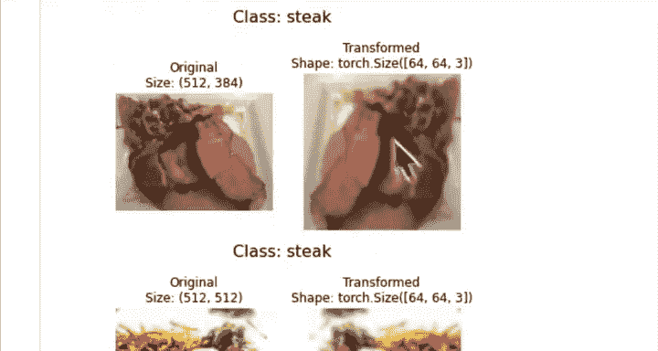
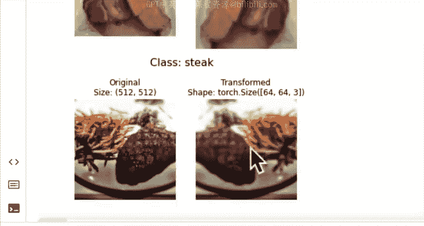
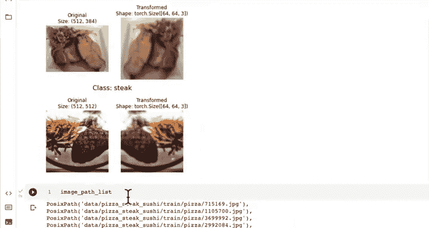
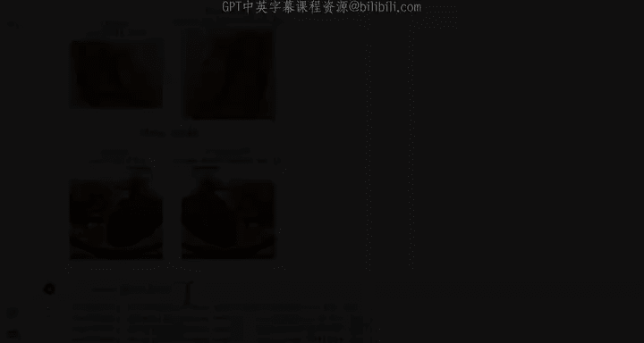
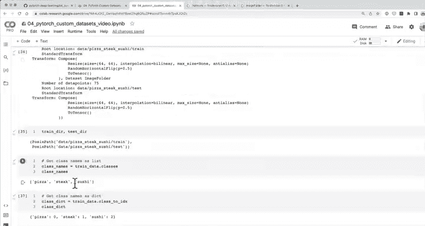
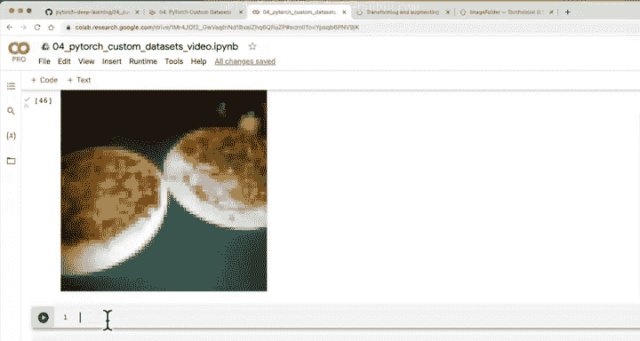

#  80：将图像转换为张量 🖼️➡️🔥



在本节课中，我们将学习如何将图像数据转换为PyTorch张量，这是使用PyTorch进行深度学习模型训练的第一步。我们将使用`torchvision.transforms`来构建一个数据处理流水线，并最终将整个数据集加载为可用于训练的张量格式。

---

## 数据转换

上一节我们介绍了如何将单张图像转换为NumPy数组。本节中，我们来看看如何将自定义数据集（如披萨、牛排、寿司图像）转换为PyTorch张量。

在使用PyTorch处理图像数据之前，我们需要完成两个关键步骤：
1.  将目标数据转换为张量。在我们的案例中，就是将图像转换为数值表示。
2.  将其转换为`torch.utils.data.Dataset`。

回顾之前的课程，我们使用`Dataset`来容纳所有张量格式的数据。随后，我们将PyTorch的`Dataset`转换为`torch.utils.data.DataLoader`。`DataLoader`会创建我们数据集的可迭代或批处理版本。简而言之，我们将它们称为**Dataset**和**DataLoader**。

正如之前讨论的，在PyTorch文档中（对于`torchvision`、`torcha`udio、`torchtext`等库类似），有不同的方法来创建此类数据集。我们可以进入`datasets`模块，找到内置的数据集以及自定义数据集的基类。

如果我们查看`ImageFolder`，会发现一个通用的参数——`transform`。`transform`参数允许我们在加载数据时对数据样本应用一些转换。通过实例来理解这一点比单纯描述更容易。

所以，让我们创建一个转换。主要的转换是将数据转换为张量。

---

### 3.1 使用 torchvision.transforms 转换数据

我们需要的核心转换是将JPEG图像转换为张量表示。





以下是创建转换的步骤：

```python
from torch.utils.data import DataLoader
from torchvision import datasets, transforms

# 创建图像转换流水线
data_transform = transforms.Compose([
    transforms.Resize((64, 64)),
    transforms.RandomHorizontalFlip(p=0.5),
    transforms.ToTensor()
])
```

我们来解释一下这个流水线中的每个转换：
*   `transforms.Resize((64, 64))`：将图像大小调整为64x64像素。我们这样做是为了与之前章节中使用的Tiny VGG架构兼容，该架构接受64x64大小的图像。
*   `transforms.RandomHorizontalFlip(p=0.5)`：以50%的概率随机水平翻转图像。这是一种数据增强技术，可以人为增加数据集的多样性。
*   `transforms.ToTensor()`：这是关键步骤。它将PIL图像或NumPy数组（值范围0-255）转换为一个形状为`[C, H, W]`、值范围在0到1之间的`torch.FloatTensor`。

现在，我们可以将单张图像通过这个转换流水线，观察其变化。

```python
# 假设 `image` 是一个PIL图像
transformed_image = data_transform(image)
print(transformed_image.shape)  # 输出: torch.Size([3, 64, 64])
print(transformed_image.dtype)  # 输出: torch.float32
```

现在，我们有了将图像转换为张量的方法。但我们目前只处理了单张图像。接下来，我们看看如何可视化这些转换效果。

---

## 可视化转换后的图像

遵循数据探索者的格言，让我们可视化转换后的图像。我们看到了单张图像通过数据转换后的样子。如果我们想了解更多关于`torchvision.transforms`的文档，可以查阅官方资料，其中包含许多可用的转换和增强方法。

现在，让我们编写代码来可视化多张转换后的图像，并与原始图像进行比较。

以下是创建可视化函数的步骤：

```python
import random
from pathlib import Path
import matplotlib.pyplot as plt
from PIL import Image
import torch

def plot_transformed_images(image_paths, transform, n=3, seed=None):
    """从图像路径列表中随机选择图像，加载/转换它们，然后绘制原始图像与转换后版本的对比图。"""
    if seed:
        random.seed(seed)
    random_image_paths = random.sample(image_paths, k=n)

    for image_path in random_image_paths:
        with Image.open(image_path) as f:
            fig, axs = plt.subplots(1, 2)
            # 绘制原始图像
            axs[0].imshow(f)
            axs[0].set_title(f"Original\nSize: {f.size}")
            axs[0].axis("off")

            # 转换并绘制目标图像
            transformed_image = transform(f)
            # 注意：Matplotlib期望颜色通道在最后 (H, W, C)，但ToTensor输出是 (C, H, W)
            # 我们需要调整维度顺序
            transformed_image_permuted = transformed_image.permute(1, 2, 0)
            axs[1].imshow(transformed_image_permuted)
            axs[1].set_title(f"Transformed\nShape: {transformed_image.shape}")
            axs[1].axis("off")

            # 从路径获取类别名作为标题
            class_name = Path(image_path).parent.stem
            fig.suptitle(f"Class: {class_name}", fontsize=16)

    plt.show()

# 使用示例
image_path_list = list(Path("data/pizza_steak_sushi/").glob("*/*.jpg"))
plot_transformed_images(image_path_list, transform=data_transform, n=3, seed=42)
```

运行上述代码，我们可以看到原始图像（如512x512）和转换后图像（64x64）的对比。转换后的图像虽然更像素化，但关键信息得以保留。调整图像大小可以加快模型计算速度，但可能会因信息损失而影响性能。图像大小是一个可以调整的超参数。





我们还可以看到`RandomHorizontalFlip`的效果，部分图像被水平翻转了。这就是`torch.transforms`的强大之处。`torchvision.transforms`库中还有许多其他转换（如裁剪、色彩抖动、灰度化等），鼓励大家进行探索。

现在我们已经可视化了转换效果，接下来将在加载整个数据集时使用这个`data_transform`。





---

## 选项一：使用 ImageFolder 加载图像数据

现在，我们使用`torchvision.datasets.ImageFolder`来加载所有自定义图像数据并转换为张量。`ImageFolder`类适用于标准图像分类格式的数据（每个类别的图像放在以类别命名的子文件夹中）。

这正是`transform`参数发挥作用的地方。我们可以在创建`ImageFolder`数据集时传入之前定义的转换流水线。

以下是加载训练和测试数据集的步骤：

```python
from torchvision import datasets

# 使用 ImageFolder 创建数据集，并应用转换
train_data = datasets.ImageFolder(root="data/pizza_steak_sushi/train/",
                                  transform=data_transform) # 对图像应用转换
test_data = datasets.ImageFolder(root="data/pizza_steak_sushi/test/",
                                 transform=data_transform) # 对测试集应用相同的转换

print(train_data)
print(test_data)
```

`ImageFolder`会自动从文件夹结构推断标签（例如，`pizza`文件夹内的图像标签为“pizza”）。`transform`参数确保加载的每张图像都经过我们的转换流水线（调整大小、随机翻转、转为张量）。

我们可以查看数据集的一些有用属性：

```python
# 获取类别名称列表
class_names = train_data.classes
print(class_names)  # 输出: ['pizza', 'steak', 'sushi']

# 获取类别到索引的映射字典
class_dict = train_data.class_to_idx
print(class_dict)   # 输出: {'pizza': 0, 'steak': 1, 'sushi': 2}

# 查看数据集长度
print(f"训练集样本数: {len(train_data)}")
print(f"测试集样本数: {len(test_data)}")

# 查看样本和标签
print(train_data.samples[:5]) # 前5个样本（路径，标签索引）
print(train_data.targets[:5]) # 前5个标签
```




现在，我们的自定义数据集已经兼容PyTorch模型了。让我们从数据集中可视化一个样本。

---

## 从数据集中可视化样本

我们可以像索引列表一样索引`Dataset`来获取单个图像张量和其标签。

```python
# 获取第一个样本（图像张量和标签）
img, label = train_data[0]
print(f"图像张量形状: {img.shape}")
print(f"标签: {label} -> {class_names[label]}")

# 检查数据类型
print(f"图像数据类型: {img.dtype}")
print(f"标签数据类型: {type(label)}")
```

为了用Matplotlib正确显示图像，我们需要将张量从PyTorch的`[C, H, W]`格式调整为Matplotlib期望的`[H, W, C]`格式。

```python
# 调整维度顺序以进行绘制
img_permuted = img.permute(1, 2, 0)
print(f"原始形状 [C, H, W]: {img.shape}")
print(f"调整后形状 [H, W, C]: {img_permuted.shape}")

# 绘制图像
plt.figure(figsize=(10, 7))
plt.imshow(img_permuted)
plt.axis("off")
plt.title(f"Class: {class_names[label]}", fontsize=14)
plt.show()
```

现在，我们已经成功将图像数据加载为张量格式的数据集。下一步，也是我们一开始设定的目标，是将这些`Dataset`转换为`DataLoader`，以便进行批处理和数据迭代。我鼓励你尝试自己完成这一步，我们将在下节课一起实现。

---



本节课中，我们一起学习了如何将图像文件通过`torchvision.transforms`转换为PyTorch张量，如何使用`ImageFolder`加载标准格式的图像数据集，以及如何可视化和检查转换后的数据。这是将自定义数据送入PyTorch模型进行训练的关键准备步骤。