# 81：136. 创建图像数据加载器 📂

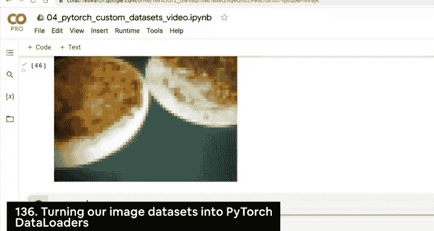


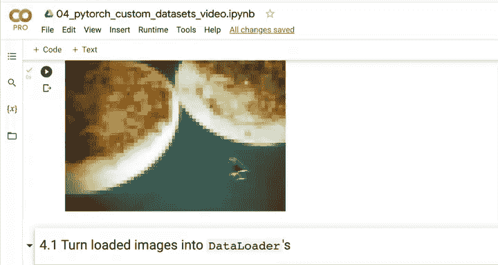

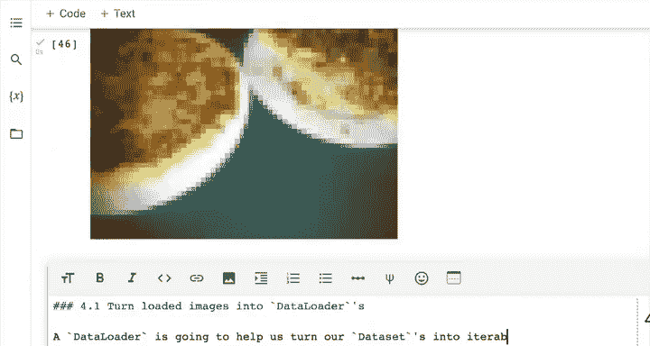

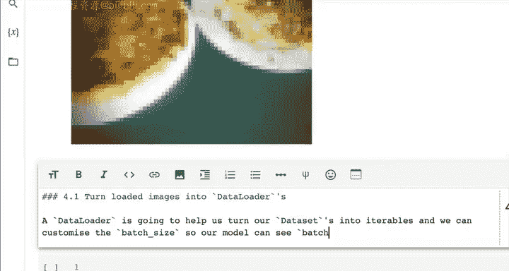

在本节课中，我们将学习如何将自定义数据集转换为PyTorch的`DataLoader`。这是PyTorch工作流程中的关键一步，它能让我们的数据变成可迭代的批次，便于模型高效训练。

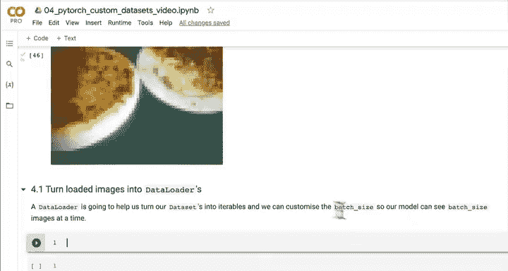

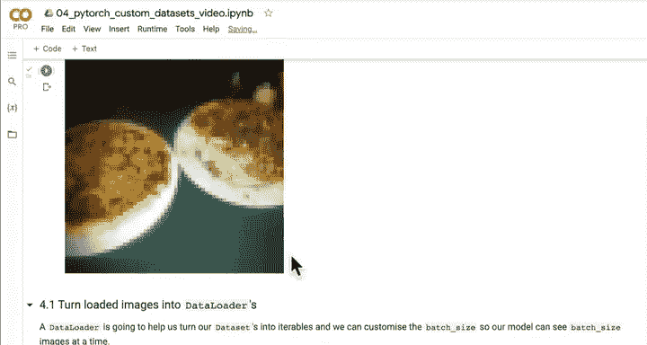

## 概述：从数据集到数据加载器

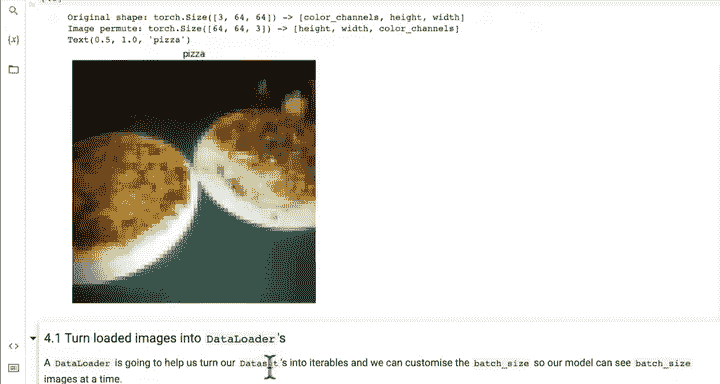

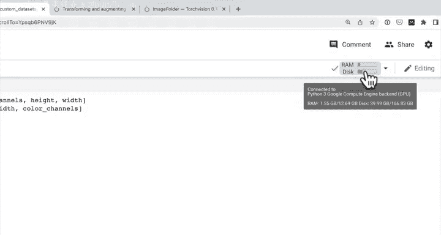

上一节我们介绍了如何将图像数据转换为`Dataset`。本节中，我们来看看如何将`Dataset`转换为`DataLoader`。`DataLoader`能帮助我们将数据集批量化，让模型一次处理一批数据，这对于管理内存和提升训练效率至关重要。

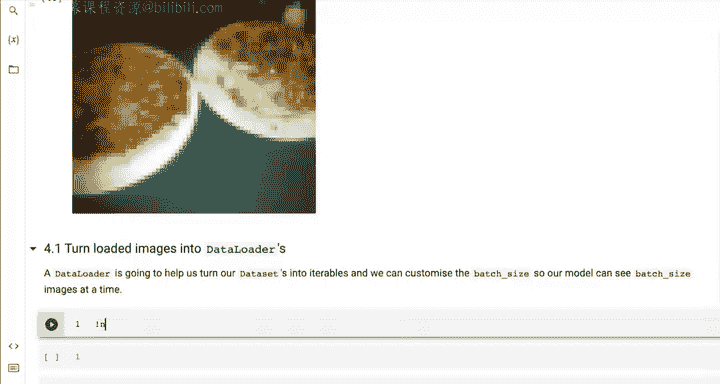

## 什么是DataLoader？

`DataLoader`的作用是将我们的数据集转换为可迭代对象。我们可以自定义批次大小，让模型一次看到`batch_size`张图像。这一点非常重要，尤其是在处理大规模数据集时。例如，Food101数据集有10万张图像，如果我们尝试一次性加载所有图像，硬件很可能会内存不足。通过批量化处理，我们可以让模型每次只处理一小批数据（如32张），从而有效利用内存。

以下是如何创建一个`DataLoader`的基本代码结构：
```python
from torch.utils.data import DataLoader

train_dataloader = DataLoader(dataset=train_data,
                              batch_size=32,
                              num_workers=1,
                              shuffle=True)
```

## 创建训练和测试数据加载器

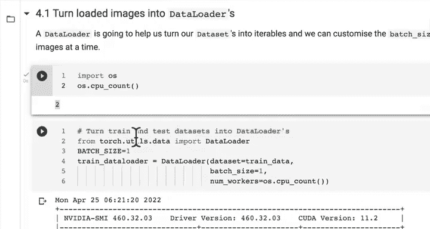

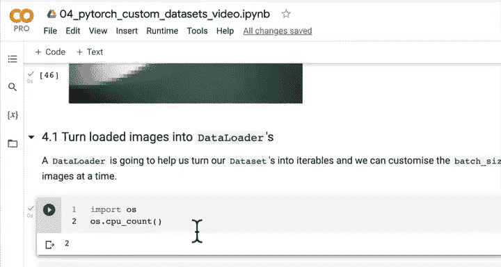

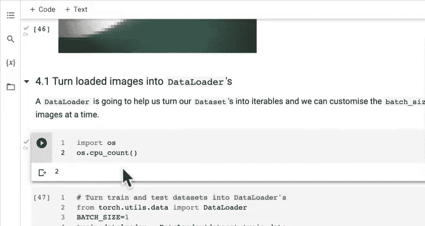

现在，让我们将训练和测试数据集转换为数据加载器。这个过程不仅适用于图像数据，也适用于文本、音频等各种类型的数据。

以下是创建数据加载器的具体步骤：

1.  **导入DataLoader**：首先从`torch.utils.data`导入`DataLoader`。
2.  **设置批次大小**：我们定义一个变量`BATCH_SIZE`。初始可以设置为1以便调试，后续可以调整为32或其他值。
3.  **设置工作进程数**：`num_workers`参数决定了使用多少个CPU核心来加载数据。通常越多越好，可以使用`os.cpu_count()`获取当前机器的CPU核心数。
4.  **是否打乱数据**：对于训练数据，我们通常设置`shuffle=True`，以防止模型学习到数据中的任何顺序。对于测试数据，我们设置`shuffle=False`，以确保评估结果的一致性。

以下是具体的实现代码：
```python
import os
from torch.utils.data import DataLoader

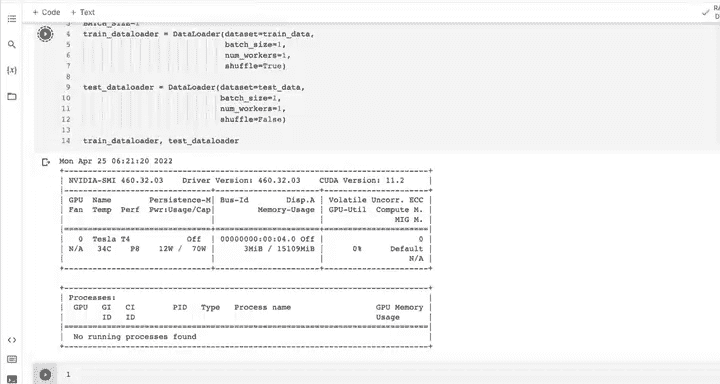

BATCH_SIZE = 1
NUM_WORKERS = 1

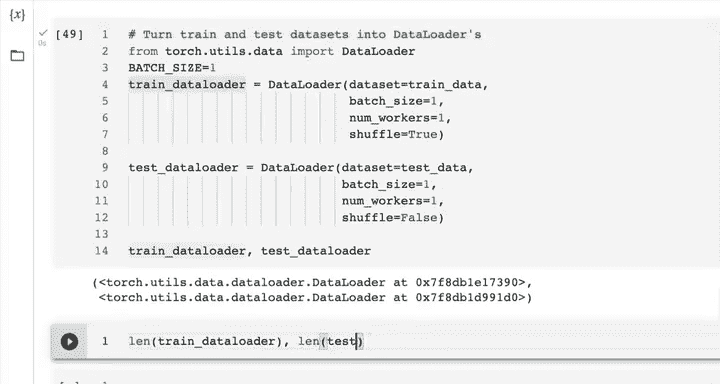

train_dataloader = DataLoader(dataset=train_data,
                              batch_size=BATCH_SIZE,
                              num_workers=NUM_WORKERS,
                              shuffle=True)

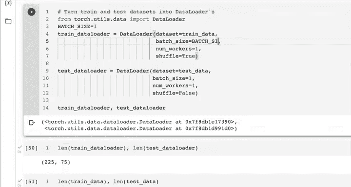

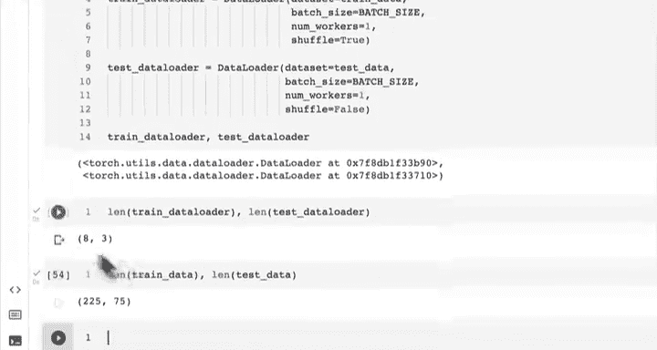

test_dataloader = DataLoader(dataset=test_data,
                             batch_size=BATCH_SIZE,
                             num_workers=NUM_WORKERS,
                             shuffle=False)
```

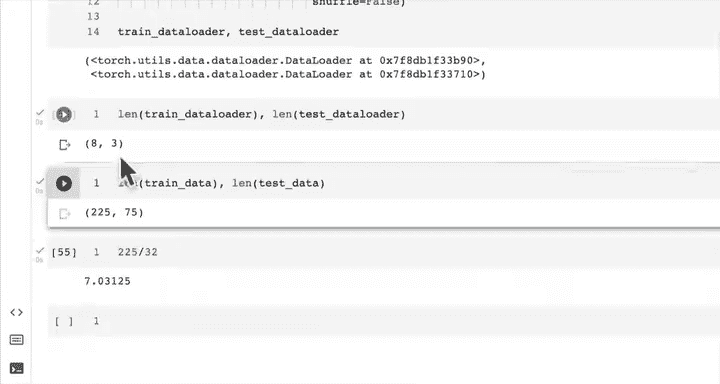

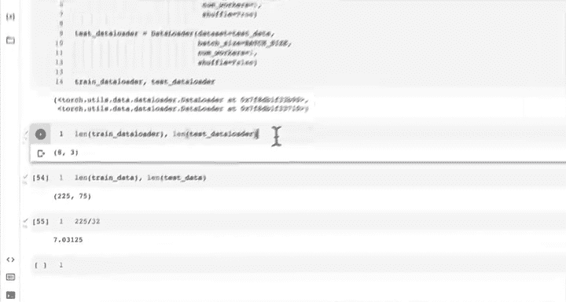

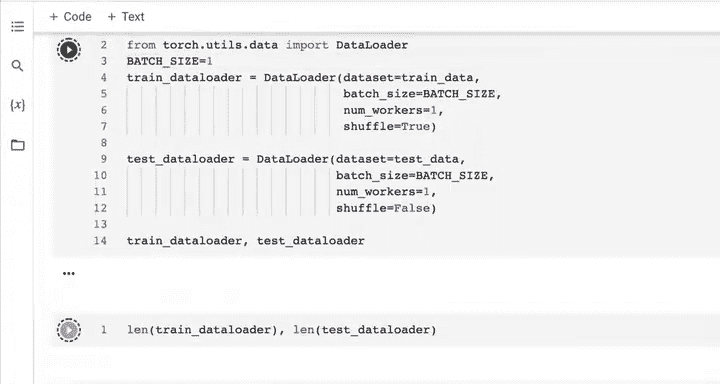

## 检查数据加载器

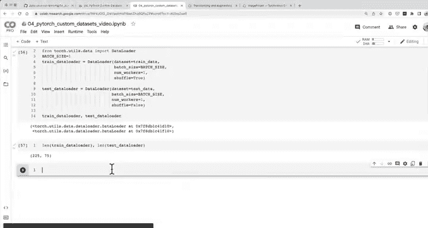

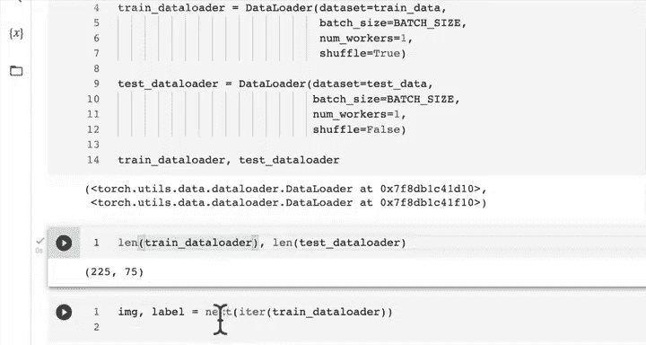

创建完成后，我们可以检查数据加载器的长度和其中数据的形状。

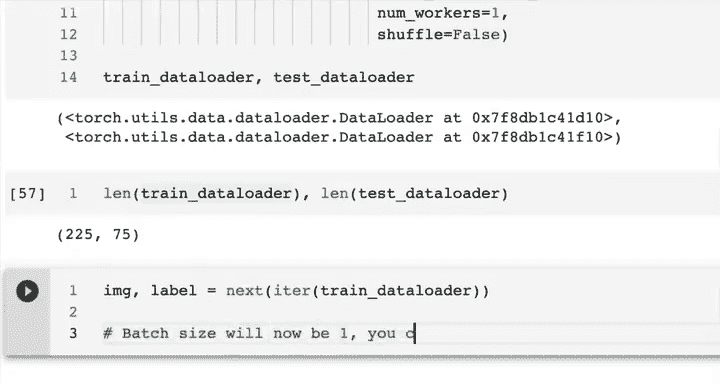

当我们使用`batch_size=1`时，数据加载器的长度与原始数据集相同。如果我们将`batch_size`改为32，长度会相应减少，因为数据被分成了多个批次。

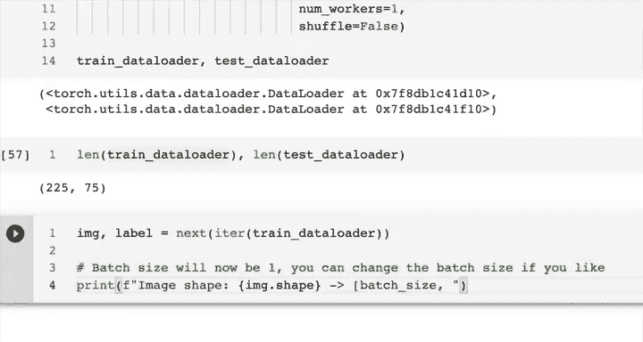

更重要的是，`DataLoader`会为数据添加一个批次维度。我们可以通过迭代数据加载器来查看数据的形状：

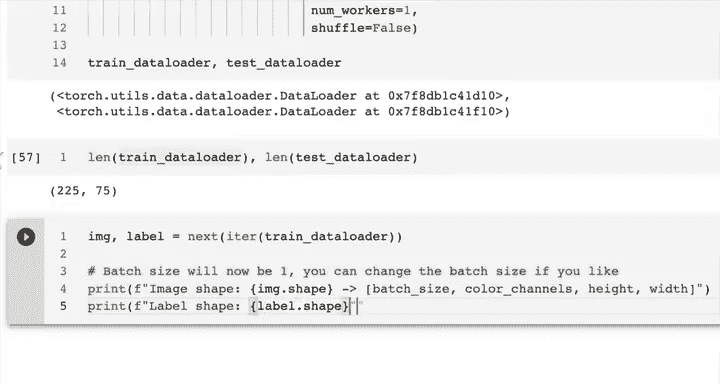

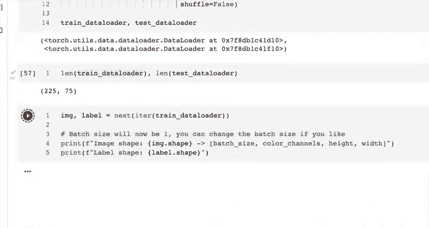

```python
# 从训练数据加载器中获取一个批次
image_batch, label_batch = next(iter(train_dataloader))

# 打印图像和标签的形状
print(f"图像形状: {image_batch.shape} -> [批次大小, 颜色通道数, 高度, 宽度]")
print(f"标签形状: {label_batch.shape} -> [批次大小]")
```

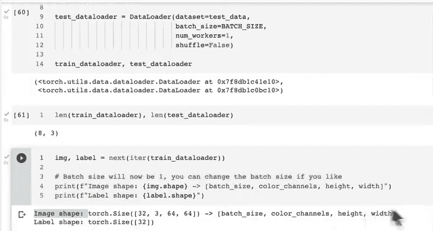

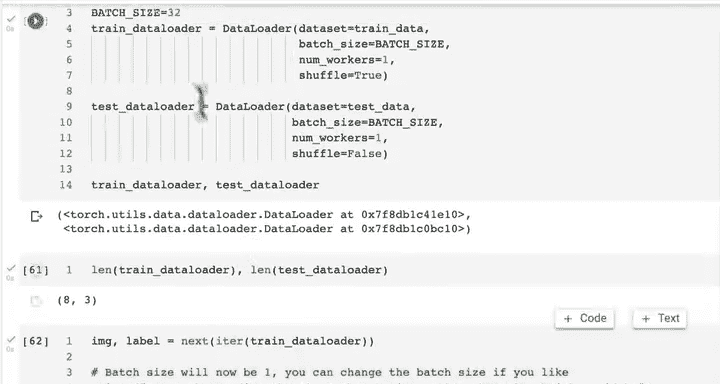

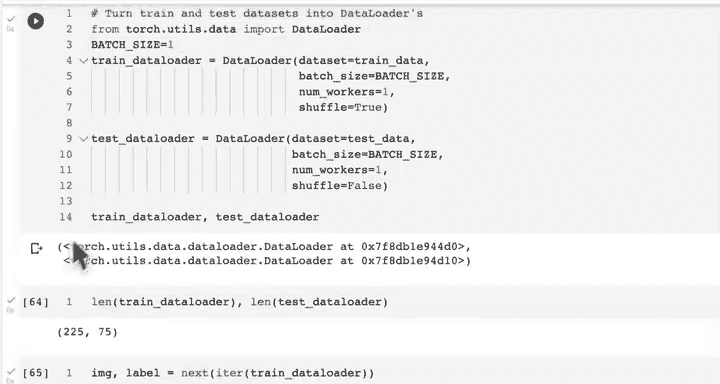

当`batch_size=1`时，输出形状为`[1, 3, 64, 64]`和`[1]`。当`batch_size=32`时，输出形状变为`[32, 3, 64, 64]`和`[32]`。这意味着每个批次包含32张图像和对应的32个标签。

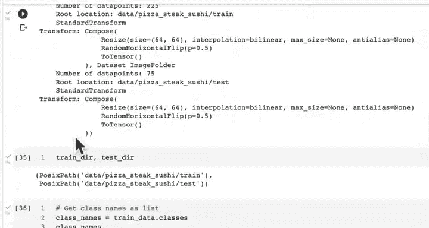

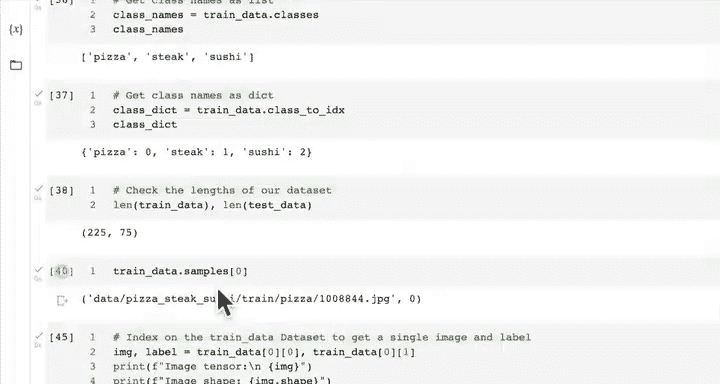

## 总结与展望

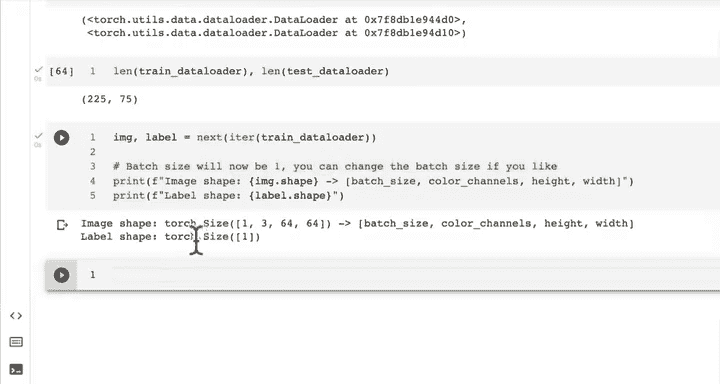

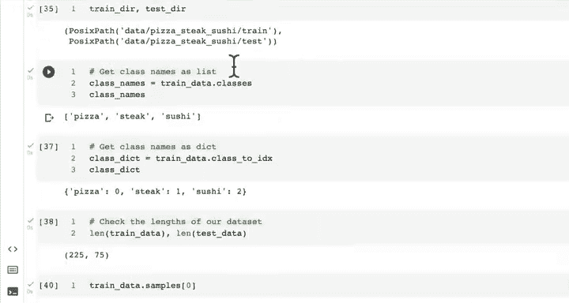

本节课中我们一起学习了如何创建图像`DataLoader`。我们回顾一下整个流程：首先下载自定义数据集，然后使用`ImageFolder`将其加载为`Dataset`，接着使用数据转换将其转为张量，最后使用`DataLoader`进行批量化处理。

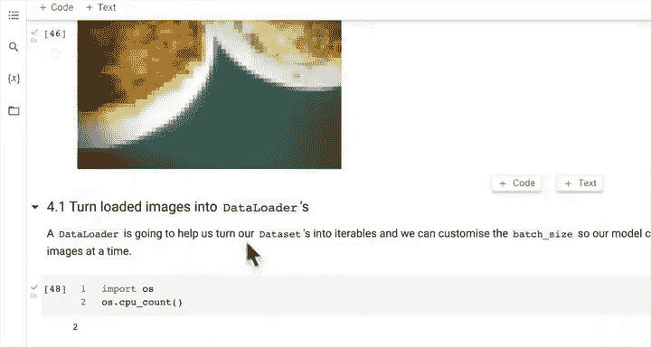

现在，我们已经拥有了可以用于训练卷积神经网络（CNN）的批量化数据。在下一节课中，我们将做一个有趣的假设：如果没有`torchvision.datasets.ImageFolder`这个现成的工具，我们该如何从头开始构建一个自定义的数据加载功能，使其与`DataLoader`兼容？这将帮助我们更深入地理解PyTorch数据加载的内部机制。

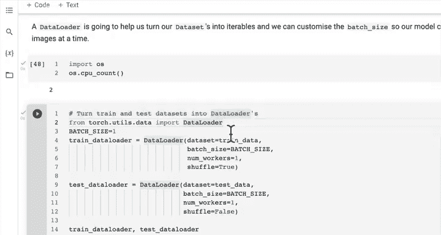

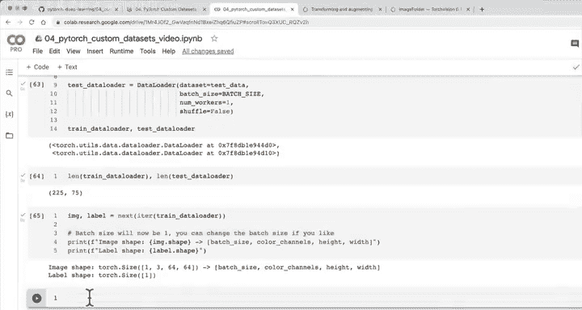

