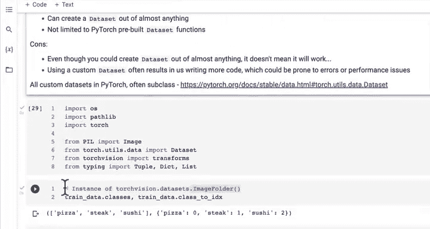
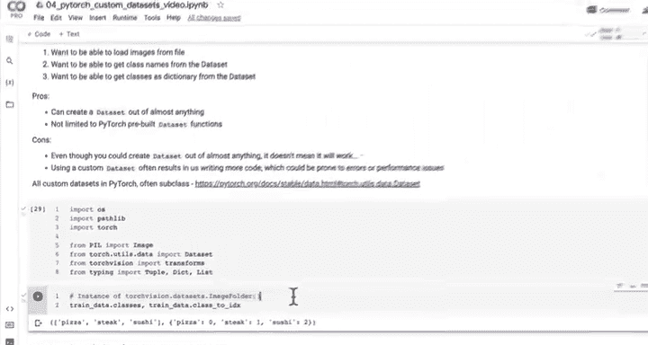

#  82：创建自定义数据集类（概述）📚


在本节课中，我们将学习如何创建一个自定义的 PyTorch 数据集类。我们将从零开始，编写代码来加载图像数据，并将其转换为可用于模型训练的 Tensor 格式。通过这个过程，你将理解 PyTorch 数据加载的核心机制，并掌握处理非标准数据格式的能力。

---

## 自定义数据集概述 🎯

在之前的课程中，我们学习了如何使用 `torchvision.datasets.ImageFolder` 这类预置函数来从文件夹（例如包含披萨、牛排和寿司图片的文件夹）中加载数据并转换为 Tensor 格式。

然而，如果 `ImageFolder` 不存在，或者你需要处理一种没有现成加载器的数据格式，该怎么办呢？本节课的目标就是通过创建我们自己的数据加载类，来复现 `ImageFolder` 的功能。

我们希望这个自定义类能做到以下几点：
*   能够从加载的数据中获取类别名称列表。
*   能够将类别名称转换为字典格式。

最终目标是编写一个类，能够将数据加载为 Tensor 格式，并能与 PyTorch 的 `DataLoader` 类配合使用。

让我们开始吧。我们将创建一个新章节，标题为“选项二：使用自定义数据集加载图像数据”。

### 自定义数据集的功能步骤

以下是我们的自定义数据集需要实现的核心功能：

1.  能够从文件加载图像。
2.  能够从数据集中获取类别名称。
3.  能够从数据集中获取类别字典。

### 创建自定义数据集的优缺点

在深入编码之前，我们先简要讨论一下创建自定义数据集的利弊。

**优点：**
*   你可以为几乎任何类型的数据创建数据集，只要编写正确的加载代码。
*   你不受限于 PyTorch 预置的数据集函数。

**缺点：**
*   即使理论上可以为任何数据创建数据集，但这并不意味着它能自动工作。你需要进行大量测试来验证数据是否按预期加载，模型是否能正常工作。
*   使用自定义数据集通常需要编写更多代码，这可能会引入更多错误或性能问题。

通常，被纳入 PyTorch 标准库或领域库的功能都经过了大量测试，可靠性较高。而我们自己编写的代码，虽然可以自行测试，但初始时可能不具备同等的健壮性。

尽管如此，了解如何创建自定义数据集仍然非常重要。

---

## 导入必要的库 🔧

首先，我们需要导入一些必要的 Python 库和模块。

```python
import os
from pathlib import Path
import torch
from PIL import Image
from torch.utils.data import Dataset
from torchvision import transforms
from typing import Tuple, Dict, List
```

我们来解释一下这些导入：
*   `os` 和 `pathlib`：用于处理文件系统和路径。
*   `torch`：PyTorch 核心库。
*   `PIL.Image`：用于打开和操作图像文件。
*   `torch.utils.data.Dataset`：这是所有 PyTorch 数据集的基类。我们自定义的类将继承（子类化）这个类。
*   `torchvision.transforms`：用于将图像转换为 Tensor 并进行其他预处理。
*   `typing`：用于为函数添加类型提示，使代码更清晰。

`Dataset` 是一个抽象基类。PyTorch 中所有预置的数据集函数都是它的子类。它要求子类必须重写 `__getitem__` 方法，并可选择性地重写 `__len__` 方法。我们将在后续课程中看到具体做法。




---

## 编写辅助函数 🛠️

上一节我们讨论了创建自定义数据集的整体概念，并了解到自定义数据集通常继承自 `torch.utils.data.Dataset`。

本节我们将专注于编写一个辅助函数，来复现 `ImageFolder` 中获取类别名称的功能。具体来说，我们希望有一个函数，当传入一个文件路径（如我们的 `data` 文件夹）时，它能返回类别名称列表以及一个将类别映射为索引的字典。

### 辅助函数的设计步骤

让我们规划一下这个辅助函数需要完成的步骤：

1.  使用 `os.scandir()` 遍历目标目录，获取类别名称。这要求目录结构是标准的图像分类格式（即每个类别的图片放在以该类命名的子文件夹中）。
2.  如果未找到任何类别名称，则引发错误，以提示目录结构可能有问题。
3.  将获取到的类别名称列表转换为字典并返回。

### 代码实现

首先，让我们设置目标目录并测试 `os.scandir()` 的功能。

```python
target_dir = “data/train” # 以训练文件夹为例
print(f“目标目录: {target_dir}”)

# 使用 os.scandir 获取目录下的条目
class_names = sorted(entry.name for entry in os.scandir(target_dir) if entry.is_dir())
print(f“找到的类别: {class_names}”)
```

运行这段代码，我们应该会得到 `[‘pizza‘， ‘steak‘， ‘sushi‘]`。很好，这证明了我们可以获取类别列表。

现在，让我们将这个逻辑封装成一个正式的、可重用的函数。

```python
def find_classes(directory: str) -> Tuple[List[str]， Dict[str， int]]:
    “””
    查找目标目录中的类别文件夹名称。
    参数:
        directory (str): 目标目录路径。
    返回:
        Tuple[List[str]， Dict[str， int]]: (类别列表， 类别->索引的字典)。
    “””
    # 1. 通过扫描目标目录获取类别
    classes = sorted(entry.name for entry in os.scandir(directory) if entry.is_dir())

    # 2. 如果未找到类别，则引发错误
    if not classes:
        raise FileNotFoundError(f“在目录 ‘{directory}‘ 中未找到任何类别。请检查文件结构。”)

    # 3. 创建索引标签字典
    class_to_idx = {cls_name: i for i， cls_name in enumerate(classes)}
    return classes， class_to_idx
```

让我们测试一下这个函数：

```python
class_names， class_to_idx = find_classes(“data/train”)
print(f“类别列表: {class_names}”)
print(f“类别字典: {class_to_idx}”)
```

输出应该类似于：
```
类别列表: [‘pizza‘， ‘steak‘， ‘sushi‘]
类别字典: {‘pizza‘: 0， ‘steak‘: 1， ‘sushi‘: 2}
```

完美！我们已经成功复现了 `ImageFolder` 获取类别信息的功能。这个辅助函数将在我们构建完整的自定义数据集类时发挥关键作用。

---

## 总结 📝

本节课中，我们一起学习了创建自定义 PyTorch 数据集类的初步知识。

我们首先概述了自定义数据集的目的：为了处理那些没有现成加载器的数据。接着，我们讨论了其优缺点，让你能权衡何时需要自己动手编写。

然后，我们导入了构建过程中所需的核心库，特别是 `torch.utils.data.Dataset` 这个基类。

最后，我们动手编写了一个关键的辅助函数 `find_classes`。这个函数能够遍历指定目录，自动提取类别名称并生成对应的索引字典，为下一步构建完整的数据集类打下了坚实的基础。



在下一节课中，我们将正式子类化 `Dataset` 基类，并利用这个辅助函数，完整地复现一个属于我们自己的 `ImageFolder`。