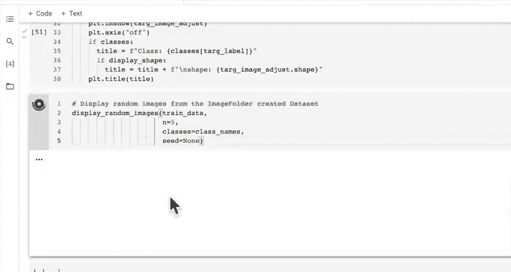

# 83：从零开始编写自定义数据集类 🧱


在本节课中，我们将学习如何通过继承PyTorch的基础类，从零开始构建一个自定义的数据集类。这将使我们能够灵活地加载和处理任何格式的数据，而不仅仅是PyTorch内置模块支持的标准格式。

## 概述

上一节我们介绍了如何编写一个名为`find_classes`的辅助函数，它接收一个目标目录并返回类别列表以及类别名到整数的映射字典。本节中，我们将在此基础上，创建一个自定义的数据集类来复现`torchvision.datasets.ImageFolder`的功能。

## 创建自定义数据集的步骤

根据PyTorch官方文档，所有代表从键到数据样本映射的数据集都应继承`torch.utils.data.Dataset`类。在创建自定义子类时，必须重写`__getitem__`方法以支持通过键（索引）获取数据样本，并可选地重写`__len__`方法以返回数据集的大小。

以下是构建我们自定义数据集类`ImageFolderCustom`的具体步骤：

1.  **继承基础类**：我们的类将继承`torch.utils.data.Dataset`。
2.  **初始化类**：在`__init__`方法中，接收目标目录和可选的图像变换函数。
3.  **创建类属性**：初始化路径、变换、类别列表和类别到索引的映射字典等属性。
4.  **创建图像加载函数**：编写一个函数，根据文件路径使用PIL库打开图像。
5.  **重写`__len__`方法**：返回数据集中样本的总数。
6.  **重写`__getitem__`方法**：这是核心方法，根据给定的索引返回一个样本（图像张量）和其对应的标签（整数）。

让我们开始编写代码。

### 1. 导入必要库并继承Dataset类

首先，我们需要导入必要的模块并定义我们的类。

```python
import torch
from torch.utils.data import Dataset
import pathlib
from PIL import Image

class ImageFolderCustom(Dataset):
    # 后续代码将写在这里
```

### 2. 初始化类 (`__init__`)

在初始化方法中，我们设置目标目录和变换，并调用辅助函数来获取类别信息。

```python
    def __init__(self, targ_dir: str, transform=None):
        # 获取所有图像文件的路径
        self.paths = list(pathlib.Path(targ_dir).glob("*/*.jpg"))
        # 设置变换
        self.transform = transform
        # 获取类别和映射
        self.classes, self.class_to_idx = find_classes(targ_dir)
```

### 3. 创建图像加载函数

这个函数根据索引从路径列表中加载对应的图像。

```python
    def load_image(self, index: int) -> Image.Image:
        """根据索引打开图像并返回PIL图像对象。"""
        image_path = self.paths[index]
        return Image.open(image_path)
```

### 4. 重写 `__len__` 方法

这个方法返回数据集中样本的数量。

```python
    def __len__(self) -> int:
        """返回数据集中样本的总数。"""
        return len(self.paths)
```

### 5. 重写 `__getitem__` 方法

这是最关键的方法。它根据索引`idx`加载图像和标签，并应用必要的变换。

```python
    def __getitem__(self, idx: int) -> Tuple[torch.Tensor, int]:
        """返回一个样本（图像张量）和其标签（整数）。"""
        # 加载图像
        img = self.load_image(idx)
        # 获取类别名（假设路径格式为：class_name/image.jpg）
        class_name = self.paths[idx].parent.name
        # 将类别名转换为整数标签
        class_idx = self.class_to_idx[class_name]

        # 如果定义了变换，则应用变换
        if self.transform:
            return self.transform(img), class_idx
        else:
            return img, class_idx
```

## 测试自定义数据集类

现在我们已经完成了自定义数据集类的编写，接下来让我们测试它是否能够正常工作。

### 创建数据变换

首先，我们为训练集和测试集定义数据变换管道。

```python
from torchvision import transforms

# 训练数据变换（包含数据增强）
train_transforms = transforms.Compose([
    transforms.Resize(size=(64, 64)),
    transforms.RandomHorizontalFlip(p=0.5),
    transforms.ToTensor()
])

# 测试数据变换（通常不进行数据增强）
test_transforms = transforms.Compose([
    transforms.Resize(size=(64, 64)),
    transforms.ToTensor()
])
```

### 实例化自定义数据集

使用我们编写的`ImageFolderCustom`类来创建训练和测试数据集对象。

```python
# 创建训练数据集
train_data_custom = ImageFolderCustom(targ_dir=train_dir,
                                      transform=train_transforms)

# 创建测试数据集
test_data_custom = ImageFolderCustom(targ_dir=test_dir,
                                     transform=test_transforms)
```

### 验证数据集属性

我们可以检查自定义数据集的一些属性，确保它们与使用原生`ImageFolder`创建的数据集一致。

```python
# 检查长度
print(f"Train data custom length: {len(train_data_custom)}")
print(f"Test data custom length: {len(test_data_custom)}")

# 检查类别
print(f"Train data custom classes: {train_data_custom.classes}")
print(f"Train data custom class_to_idx: {train_data_custom.class_to_idx}")

# 与原生ImageFolder创建的数据集进行比较
print(train_data_custom.classes == train_data.classes) # 应为 True
print(test_data_custom.classes == test_data.classes)   # 应为 True
```

## 可视化随机样本

为了更直观地验证我们的数据集，让我们编写一个辅助函数来显示数据集中的随机图像。

以下是该函数的核心步骤：

1.  **接收参数**：接收数据集、类别列表、要显示的图像数量`n`等。
2.  **限制显示数量**：为防止显示过多图像，将`n`的最大值限制为10。
3.  **设置随机种子**：为了结果可复现，可以设置随机种子。
4.  **获取随机索引**：从数据集中随机抽取`n`个样本的索引。
5.  **创建图形**：使用Matplotlib创建一个图形。
6.  **循环绘制**：遍历随机索引，获取对应的图像和标签并绘制。
7.  **调整维度**：将PyTorch的张量维度（C, H, W）调整为Matplotlib期望的维度（H, W, C）。

```python
import matplotlib.pyplot as plt
import random

def display_random_images(dataset: torch.utils.data.Dataset,
                          classes: List[str] = None,
                          n: int = 10,
                          display_shape: bool = True,
                          seed: int = None):
    # 1. 调整显示数量
    if n > 10:
        n = 10
        display_shape = False
        print(f"为便于显示，n不应大于10，已设置为10并关闭形状显示。")

    # 2. 设置随机种子
    if seed:
        random.seed(seed)

    # 3. 获取随机样本索引
    random_samples_idx = random.sample(range(len(dataset)), k=n)

    # 4. 创建绘图
    plt.figure(figsize=(16, 8))

    # 5. 循环遍历并绘制图像
    for i, targ_sample in enumerate(random_samples_idx):
        targ_image, targ_label = dataset[targ_sample]

        # 6. 调整张量维度以用于Matplotlib (C, H, W) -> (H, W, C)
        targ_image_adjust = targ_image.permute(1, 2, 0)

        # 绘制
        plt.subplot(1, n, i+1)
        plt.imshow(targ_image_adjust)
        plt.axis("off")
        if classes:
            title = f"Class: {classes[targ_label]}"
            if display_shape:
                title = title + f"\nshape: {targ_image_adjust.shape}"
            plt.title(title)

    plt.show()
```

现在，我们可以使用这个函数来可视化我们自定义数据集中的图像。

```python
# 显示原生ImageFolder数据集中的图像
display_random_images(dataset=train_data,
                      classes=class_names,
                      n=5,
                      seed=42)



# 显示自定义数据集中的图像
display_random_images(dataset=train_data_custom,
                      classes=class_names,
                      n=5,
                      seed=42)
```

如果一切正常，你将看到两组相似的随机食物图像被显示出来，这证明我们的自定义数据集类工作正常。

## 总结


本节课中我们一起学习了如何从零开始构建一个PyTorch自定义数据集类。我们通过继承`torch.utils.data.Dataset`类，并重写关键的`__init__`、`__len__`和`__getitem__`方法，成功复现了`ImageFolder`的功能。这个过程的核心在于理解如何将你的原始数据（如图像文件路径）组织、加载，并最终转换为PyTorch张量和整数标签的元组形式。掌握了这项技能，你将能够灵活地处理各种非标准格式的数据，为后续的模型训练做好准备。在下一节课中，我们将学习如何将创建好的数据集转换为数据加载器（DataLoader），以便进行高效的批量训练。