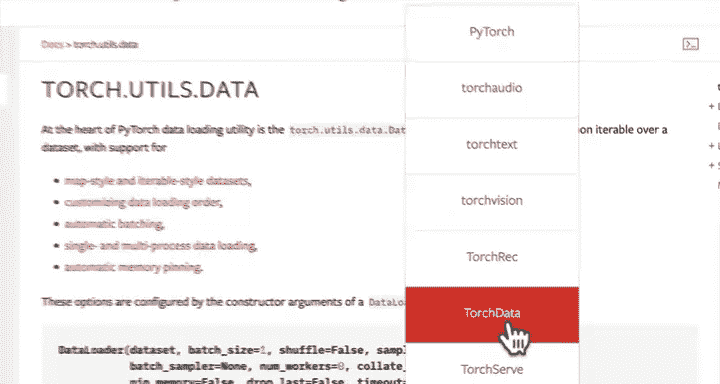

#  84：将自定义数据集转换为 DataLoader 🚀


在本节课中，我们将学习如何将自定义数据集转换为 PyTorch 的 DataLoader，以便能够以批量的形式高效地加载数据，供模型训练使用。


这些图像看起来很不错，更重要的是它们来自我们自己的自定义数据集。现在，我们还有最后一步：将我们的数据集转换为 DataLoader。换句话说，我们将把所有的图像进行批量化处理，以便模型能够使用。

在上一个视频中，我给大家布置了一个挑战，让大家自己尝试实现这一步。希望你已经尝试过了。现在，让我们看看具体在代码中如何实现。

## 导入 DataLoader

首先，我们需要从 PyTorch 的工具库中导入 DataLoader。

```python
from torch.utils.data import DataLoader
```

## 创建训练 DataLoader

接下来，我们将创建一个训练数据的 DataLoader。我们将设置一个全局的批处理大小参数。

```python
BATCH_SIZE = 32
train_dataloader_custom = DataLoader(dataset=train_data_custom,
                                      batch_size=BATCH_SIZE,
                                      num_workers=0,
                                      shuffle=True)
```

**参数说明：**
*   `dataset`：传入我们使用自定义数据集类创建的训练数据集 `train_data_custom`。
*   `batch_size`：批处理大小，这里我们设置为 32。这是一个可以调整的超参数，通常设置为 2 的幂次方（如 32、64）有助于计算效率。
*   `num_workers`：用于数据加载的子进程数量。默认值为 0。更高的值通常意味着更快的加载速度，但需要根据你的硬件和模型进行实验，找到最佳值。你可以将其设置为 `os.cpu_count()` 来使用所有可用的 CPU 核心。
*   `shuffle`：是否在每个训练周期（epoch）打乱数据顺序。对于训练数据，我们通常设置为 `True`，以防止模型学习到数据的顺序信息。

## 创建测试 DataLoader

同样地，我们为测试数据创建一个 DataLoader。

```python
test_dataloader_custom = DataLoader(dataset=test_data_custom,
                                     batch_size=BATCH_SIZE,
                                     num_workers=0,
                                     shuffle=False)
```

**注意：** 对于测试数据，我们通常不进行打乱 (`shuffle=False`)，以保证评估的一致性。

## 检查 DataLoader 的输出

现在，让我们从训练 DataLoader 中获取一个样本来验证图像形状和批处理大小是否正确。

```python
img_custom, label_custom = next(iter(train_dataloader_custom))
print(f"Image shape: {img_custom.shape}")
print(f"Label shape: {label_custom.shape}")
```

**输出示例：**
```
Image shape: torch.Size([32, 3, 64, 64])
Label shape: torch.Size([32])
```

**解释：**
*   `Image shape: [32, 3, 64, 64]`：这表示我们有一个包含 32 张图像的批次（`batch_size=32`），每张图像有 3 个颜色通道（RGB），高度和宽度都是 64 像素。这与我们之前定义的图像变换（`transform`）是一致的。
*   `Label shape: [32]`：这表示对应的 32 个标签。

如果你想改变批处理大小，只需修改 `BATCH_SIZE` 变量的值即可，例如改为 64 或 1。

## 自定义数据集的优势

虽然我们编写了相当多的代码来创建自定义数据集类，但你可以将其视为一次性的工作。一旦编写完成，只要你的数据保持相同的格式，你就可以在未来的项目中反复使用它。

一个很好的做法是将 `ImageFolderCustom` 这样的自定义类放入一个辅助函数文件（例如 `dataset_utils.py`）中，然后在需要时导入使用，而不是每次都重写。这正是 PyTorch 的 TorchVision 库中 `torchvision.datasets.ImageFolder` 类所做的事情。

## 核心要点总结

本节课中，我们一起学习了一个非常重要的技能：使用自定义数据集类加载你自己的数据。

**核心流程可以总结为以下公式：**
```
自定义数据集类 (继承自 `torch.utils.data.Dataset`)
    ↓
实例化数据集对象 (包含你的数据和标签)
    ↓
传递给 `torch.utils.data.DataLoader`
    ↓
得到可迭代的批量数据，供模型使用
```



通常，你可以使用 PyTorch 领域库（如 TorchVision、TorchAudio、TorchText）中现有的数据加载函数。但如果你的数据格式特殊，需要自定义加载逻辑，你可以通过子类化 `torch.utils.data.Dataset` 并实现必要的方法（如 `__len__` 和 `__getitem__`）来创建自己的数据集类。

---

在之前的内容中，我们简要提到了数据变换（Transforms）。你可能听我说过，TorchVision 的变换可以用于**数据增强（Data Augmentation）**。数据增强是指以某种方式（如旋转、裁剪、颜色抖动）操纵我们的图像，从而人为地增加训练数据集的多样性。这有助于模型学习到更鲁棒的特征，防止过拟合。我们将在下一个视频中更深入地探讨数据增强。

让我们继续前进！