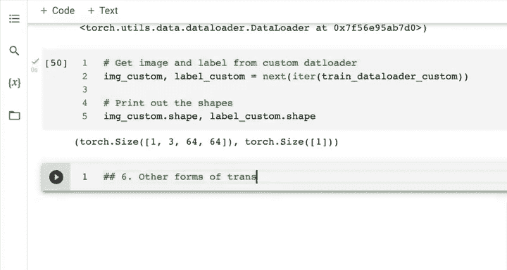
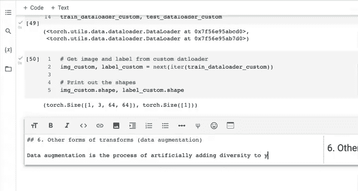
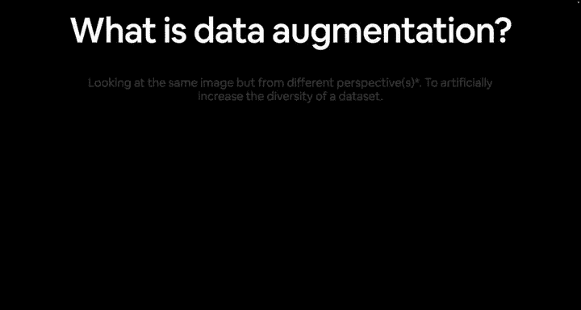
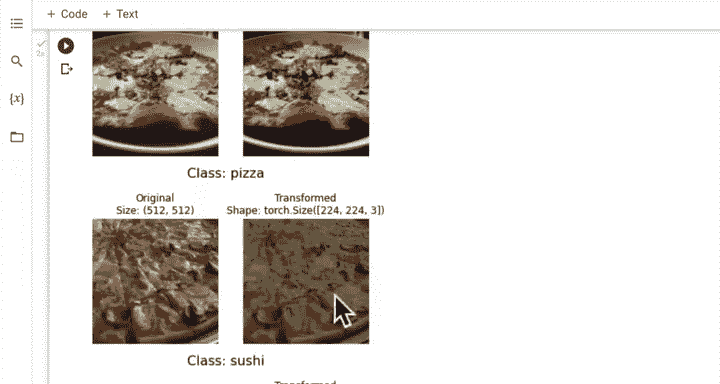
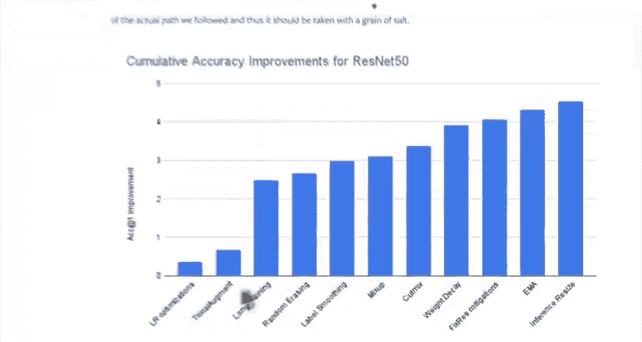

#  85：数据增强 🖼️➡️🔄


在本节课中，我们将学习数据增强的概念，了解它如何通过人工增加训练数据的多样性来提升深度学习模型的泛化能力。我们将重点介绍一种名为“TrivialAugment”的先进数据增强技术，并学习如何在PyTorch中实现它。

---

在之前的课程中，我们创建了函数和类来加载自定义数据。我们了解到，加载自定义数据最关键的一步是数据转换，特别是将目标数据转换为张量。

我们还简要了解了`torchvision.transforms`模块，发现其中包含多种转换数据的方法。

其中一种转换图像数据的方法就是**数据增强**。如果我们查看`transforms`的图示，可以看到许多不同的方式：调整大小、中心裁剪、五裁剪、灰度化、随机变换、高斯模糊、随机旋转、随机仿射、随机裁剪等等。事实上，我鼓励你亲自查看所有不同的选项。



但请注意，这里还有“自动增强”和“随机增强”。这正是我之前提到的**数据增强**。你注意到原始图像是如何以不同方式被增强的吗？图像被人工改变：这里被轻微旋转，那里被调暗或调亮，这里被上移，那里的颜色也发生了变化。这个过程就称为**数据增强**。


接下来，我们将创建第六部分：其他形式的转换。

---



## 什么是数据增强？🔍

那么，如何了解数据增强是什么呢？你可以搜索“what is data augmentation”，会找到很多资源。



维基百科的定义是：在数据分析中，数据增强是通过添加已有数据的略微修改副本或从现有数据新创建的合成数据来增加数据量的技术。

我将在这里写下定义：**数据增强是人工为训练数据增加多样性的过程**。

对于图像数据，这可能意味着对训练图像应用各种图像变换。我们在`torchvision.transforms`包中看到了许多这样的变换。

现在，让我们具体看一种数据增强类型：**TrivialAugment**。为了说明这一点，我准备了一张幻灯片。

幻灯片展示了什么是数据增强：从不同视角观察同一张图像。

我们这样做，正如我所说，是为了人工增加数据集的多样性。想象我们的原始图像在左边，如果我们想旋转它，可以应用旋转变换；如果想在垂直和水平轴上移动它，可以应用平移变换；如果想放大图像，可以应用缩放变换。

这里有许多不同类型的变换，正如我的笔记所示：裁剪、替换、剪切等。这张幻灯片只演示了少数几种，但我想强调另一种数据增强类型，它是最近用于将PyTorch视觉图像模型训练到最先进水平的一种方法。

---

## 为何使用数据增强？🎯

让我们看看一种特定类型的数据增强，它被用于将PyTorch视觉模型训练到最先进水平。

如果你不确定我们为什么要这样做，原因是我们希望增加训练数据的多样性，使图像对我们的模型来说更难学习，或者让模型有机会从不同视角观察同一图像。这样，当你在实践中使用图像分类模型时，它就已经见过许多不同角度的同类图像。

希望它能学习到可推广到这些不同角度的模式。因此，这种做法有望**得到一个对未见数据更具泛化能力的模型**。

---

## 实践：TrivialAugment 🛠️

如果我们访问PyTorch官网，有一篇最近的博客文章，名为“如何训练最先进的模型”，这正是我们想做的。“最先进”意味着业内最佳，通常缩写为SOTA。

这篇博客文章介绍了TorchVision的最新原语，这些原语是帮助我们训练高性能模型的函数。文章中提到了一系列改进方法。

如果我们滚动浏览，会发现一种数据增强类型。将所有他们使用的改进加起来，准确率从基线76%提升到了近81%，提升了近5%的准确率，这非常不错。

我们将要关注的是**TrivialAugment**。博客中提到了许多不同方法，如学习率优化、更长时间训练、随机擦除图像数据、标签平滑、MixUp和CutMix等。但我们将重点分解其中一种：**TrivialAugment**。

让我们看看它的实际效果。首先，我们需要导入必要的模块并创建训练变换。

以下是实现步骤：

```python
from torchvision import transforms

# 创建训练变换管道
train_transform = transforms.Compose([
    transforms.Resize(size=(224, 224)),  # 将图像大小调整为224x224
    transforms.TrivialAugmentWide(num_magnitude_bins=31),  # 应用TrivialAugment，强度设为31
    transforms.ToTensor()  # 将图像转换为张量
])
```

我们刚刚就实现了TrivialAugment。这来自PyTorch的`torchvision.transforms`库。`TrivialAugmentWide`被用于训练PyTorch视觉模型库中最新的最先进模型。

如果你想了解更多关于TrivialAugment的信息，可以搜索相关论文。它巧妙地利用了随机性的力量。不过，我更倾向于先在我们的数据上尝试并可视化它的效果。

---

## 测试增强管道 🧪

接下来，我们需要创建一个测试变换来对比。

```python
# 创建测试变换（通常不包含数据增强）
test_transform = transforms.Compose([
    transforms.Resize(size=(224, 224)),
    transforms.ToTensor()
])
```

你可能会问：我应该为我的数据使用哪些变换？这是一个价值百万美元的问题，就像问“我应该为我的数据使用哪种模型”一样。答案有很多，我的最佳建议是：尝试几种，看看哪些对其他人有效（就像我们发现TrivialAugment对PyTorch团队很有效一样），然后在你的问题上尝试。如果效果好，那就太好了；如果不好，你总是可以设置实验尝试其他方法。

让我们测试我们的增强管道。我们将获取所有图像路径，并利用之前创建的函数来绘制一些随机图像。

以下是可视化增强效果的代码思路：

```python
# 假设 image_path_list 是图像路径列表
# 使用之前定义的 plot_transformed_images 函数
plot_transformed_images(
    image_paths=image_path_list,
    transform=train_transform,  # 使用包含TrivialAugment的训练变换
    n=3,
    seed=None
)
```

观察输出：第一张是披萨类。TrivialAugment调整了它的大小，颜色可能被以某种方式操作了。第二张看起来颜色被改变了，第三张被调暗了。

我们再次运行，看看另外三张图像。TrivialAugment有效运行。正如我之前所说，它利用了随机性的力量：它从所有其他增强类型中随机选择，并以某种强度（0到31之间，因为我们设置了`num_magnitude_bins=31`）应用它们。



这张看起来这边被裁剪了一点，那张颜色又被改变了，另一张被调暗了。看到我们是如何人工为训练数据集增加多样性的吗？我们不是让所有图像都保持一个视角，而是添加了许多不同的角度，并告诉我们的模型：“即使图像被处理过，你仍然需要尝试学习这些模式。”

再试一次。看那张，它被处理得相当多，但它仍然是一张牛排的图像。这就是我们想让模型做到的：即使图像被稍微处理过，仍然能识别出它是牛排。

这会有效吗？可能会，也可能不会。这就是实验的本质。我鼓励你进入`transforms`文档，将`TrivialAugmentWide`替换为你能在文档中找到的另一种增强类型，看看它会对我们的随机图像产生什么效果。

我重点介绍TrivialAugment，是因为PyTorch团队在他们最近的博客文章中，将其用于训练最先进视觉模型的配方中。

---

## 总结 📝

本节课中，我们一起学习了数据增强的核心概念。我们了解到，数据增强是通过人工应用各种图像变换（如旋转、平移、缩放、颜色调整等）来增加训练数据多样性的过程。这有助于模型学习更泛化的模式，从而在面对新的、未见过的数据时表现更好。

我们重点介绍并实践了**TrivialAugment**，这是一种被用于训练最先进PyTorch视觉模型的强大增强技术。我们学习了如何在`transforms.Compose`管道中实现它，并通过可视化看到了它对图像的具体影响。



记住，选择哪种增强方式是一个需要根据具体任务进行实验的过程。现在，我们已经准备好使用经过增强的数据来构建和训练我们的第一个模型了。