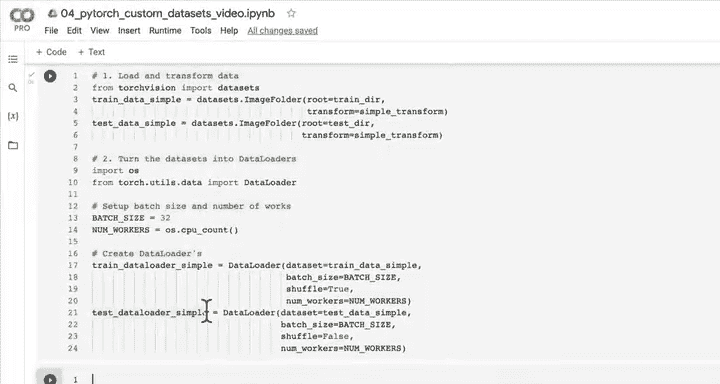
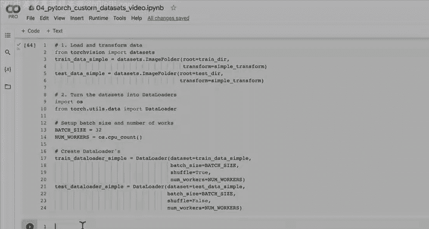
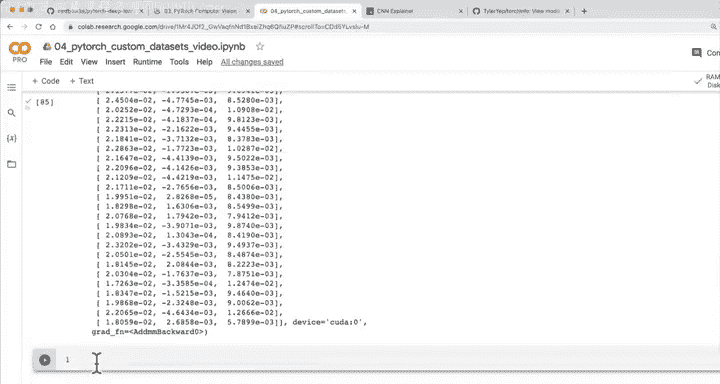

#  86：构建基线模型 🏗️


在本节课中，我们将学习如何为我们的自定义数据集构建第一个计算机视觉模型。我们将从创建一个不使用数据增强的基线模型开始，并逐步搭建一个名为 TinyVGG 的卷积神经网络架构。

---

## 概述

上一节我们介绍了 PyTorch 团队如何使用 TrivialAugment 这种先进的数据增强技术来训练其最新的计算机视觉模型。本节中，我们将亲自动手，为披萨、牛排和寿司图像数据集构建一个基线模型。我们将复用之前在计算机视觉部分介绍过的 TinyVGG 架构，但这次处理的是彩色图像。

---

## 7.1 创建数据转换器并加载数据

在训练模型之前，我们需要准备数据。以下是加载和转换数据的步骤。

首先，我们创建一个简单的数据转换管道，将图像调整为 64x64 像素并转换为张量。

```python
import torch
from torchvision import transforms

# 创建简单的转换器（无数据增强）
simple_transform = transforms.Compose([
    transforms.Resize((64, 64)),
    transforms.ToTensor()
])
```

接下来，我们使用 `ImageFolder` 类加载数据，并将其转换为 `DataLoader`，以便进行批处理。

```python
import os
from torchvision import datasets
from torch.utils.data import DataLoader

# 设置数据路径
train_dir = "data/pizza_steak_sushi/train"
test_dir = "data/pizza_steak_sushi/test"

# 加载训练和测试数据集
train_data_simple = datasets.ImageFolder(root=train_dir, transform=simple_transform)
test_data_simple = datasets.ImageFolder(root=test_dir, transform=simple_transform)





# 设置批处理大小和工作线程数
BATCH_SIZE = 32
NUM_WORKERS = os.cpu_count()

# 创建数据加载器
train_dataloader_simple = DataLoader(train_data_simple,
                                     batch_size=BATCH_SIZE,
                                     shuffle=True,
                                     num_workers=NUM_WORKERS)

test_dataloader_simple = DataLoader(test_data_simple,
                                    batch_size=BATCH_SIZE,
                                    shuffle=False,
                                    num_workers=NUM_WORKERS)
```

现在，我们的数据已经准备就绪，可以用于模型训练了。

---

## 7.2 构建 TinyVGG 模型类

上一节我们准备好了数据，本节中我们来看看如何构建模型。我们将复现 CNN Explainer 网站上的 TinyVGG 架构，但需要调整输入通道数以适应彩色图像（3个通道）。

以下是构建 TinyVGG 模型类的代码：

```python
import torch
from torch import nn

class TinyVGG(nn.Module):
    """
    复现 CNN Explainer 网站上的 TinyVGG 架构。
    """
    def __init__(self, input_shape: int, hidden_units: int, output_shape: int):
        super().__init__()
        # 第一个卷积块
        self.conv_block_1 = nn.Sequential(
            nn.Conv2d(in_channels=input_shape,
                      out_channels=hidden_units,
                      kernel_size=3,
                      stride=1,
                      padding=0),
            nn.ReLU(),
            nn.Conv2d(in_channels=hidden_units,
                      out_channels=hidden_units,
                      kernel_size=3,
                      stride=1,
                      padding=0),
            nn.ReLU(),
            nn.MaxPool2d(kernel_size=2, stride=2)
        )
        # 第二个卷积块
        self.conv_block_2 = nn.Sequential(
            nn.Conv2d(in_channels=hidden_units,
                      out_channels=hidden_units,
                      kernel_size=3,
                      stride=1,
                      padding=0),
            nn.ReLU(),
            nn.Conv2d(in_channels=hidden_units,
                      out_channels=hidden_units,
                      kernel_size=3,
                      stride=1,
                      padding=0),
            nn.ReLU(),
            nn.MaxPool2d(kernel_size=2, stride=2)
        )
        # 分类器层
        self.classifier = nn.Sequential(
            nn.Flatten(),
            nn.Linear(in_features=hidden_units*13*13, # 根据卷积输出形状计算
                      out_features=output_shape)
        )

    def forward(self, x):
        # 使用运算符融合进行前向传播（更高效）
        return self.classifier(self.conv_block_2(self.conv_block_1(x)))
```

现在，我们可以实例化模型并将其移动到 GPU 上。

```python
# 实例化模型
model_0 = TinyVGG(input_shape=3,          # 彩色图像有3个通道
                  hidden_units=10,        # 与 TinyVGG 架构一致
                  output_shape=len(class_names)) # 输出类别数（披萨、牛排、寿司）

# 将模型移动到 GPU（如果可用）
device = "cuda" if torch.cuda.is_available() else "cpu"
model_0.to(device)
```

---

## 7.3 测试模型前向传播

模型构建完成后，我们需要测试数据是否能正确通过模型。一个有效的方法是进行一次虚拟的前向传播，并检查各层的输入输出形状。

首先，我们从数据加载器中获取一个批次的图像。

```python
# 获取一个批次的图像和标签
image_batch, label_batch = next(iter(train_dataloader_simple))

# 检查批次形状
print(f"图像批次形状: {image_batch.shape}")
print(f"标签批次形状: {label_batch.shape}")
```

接下来，我们将图像批次传递给模型（确保数据也在正确的设备上）。

```python
# 将图像批次移动到与模型相同的设备
image_batch = image_batch.to(device)

# 进行前向传播（推理模式）
model_0.eval()
with torch.inference_mode():
    output = model_0(image_batch)

# 检查输出形状
print(f"模型输出形状: {output.shape}")
```

如果输出形状是 `[batch_size, num_classes]`（例如 `[32, 3]`），则说明数据流经模型的过程是正确的。此时的输出是随机的，因为模型尚未训练。

---

## 7.4 使用 Torchinfo 查看模型摘要

为了更清晰地了解模型的层结构和参数，我们可以使用 `torchinfo` 库来生成模型摘要。

首先，安装并导入 `torchinfo`。

```python
# 安装 torchinfo（如果尚未安装）
!pip install torchinfo

# 导入
from torchinfo import summary
```

然后，为我们的模型生成摘要。

```python
# 生成模型摘要
summary(model=model_0,
        input_size=(1, 3, 64, 64), # (批次大小, 通道数, 高度, 宽度)
        col_names=["input_size", "output_size", "num_params", "trainable"],
        col_width=20,
        row_settings=["var_names"])
```

这将输出一个表格，显示每一层的输入大小、输出大小、参数数量以及是否可训练。这是调试模型结构和验证参数数量的绝佳工具。

---

## 总结



本节课中我们一起学习了如何为自定义图像数据集构建一个基线卷积神经网络模型。我们首先创建了数据加载管道，然后复现了 TinyVGG 架构，并调整它以处理彩色图像。接着，我们通过虚拟前向传播测试了模型的数据流，并使用 `torchinfo` 查看了模型的详细摘要。这个基线模型为我们后续添加数据增强和进行模型训练与评估奠定了基础。