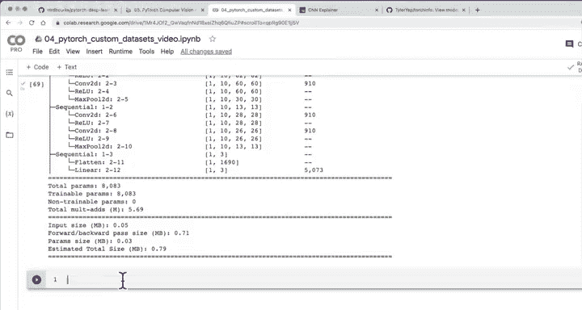

# 87：使用torchinfo获取模型摘要 📊


## 概述

在本节课中，我们将学习如何使用`torchinfo`库来获取PyTorch模型的详细摘要。我们将了解如何安装和使用这个工具，并解读它提供的模型层信息、参数数量和形状变化。

上一节我们通过单批次前向传播检查了模型，确认了前向方法工作正常且没有形状错误。本节中我们来看看如何更高效、更程序化地获取模型的内部信息。

## 安装与导入torchinfo

首先，我们需要安装`torchinfo`库。在Google Colab等环境中，它可能不是默认安装的。

以下是安装和导入`torchinfo`的步骤：

```python
# 尝试导入torchinfo，如果失败则安装
try:
    import torchinfo
except:
    !pip install torchinfo
    import torchinfo

# 从torchinfo导入summary函数
from torchinfo import summary
```

## 使用torchinfo获取模型摘要

`torchinfo`的核心功能是通过执行一次前向传播来收集模型各层的信息。我们需要为它提供一个示例输入尺寸。

以下是使用`summary`函数的方法：

```python
# 假设我们的模型名为model_0，输入为单张图像（批次大小为1，通道为3，高宽为64x64）
summary(model=model_0,
        input_size=(1, 3, 64, 64))
```

**注意**：输入尺寸`(1, 3, 64, 64)`代表一个批次（1张图像）、3个颜色通道、高度64像素、宽度64像素。如果输入尺寸与模型预期不符，`torchinfo`会报错，这有助于我们调试形状问题。

在使用`summary`之前，请确保模型前向传播方法中的调试打印语句已被注释掉，以避免输出混乱。

## 解读torchinfo输出

运行`summary`后，我们会得到一个结构清晰的输出，包含以下关键信息：

1.  **模型结构**：显示模型的类名（如`TinyVGG`）及其内部的`Sequential`块。
2.  **层详细信息**：列出每一层的类型（如`Conv2d`, `ReLU`, `MaxPool2d`, `Flatten`, `Linear`）及其输入/输出形状。
3.  **参数统计**：
    *   **总参数数**：模型中所有权重和偏置项的总和。我们的示例模型约有8000多个参数，这属于较小的模型。现代模型可能拥有数百万甚至数十亿参数。
    *   **可训练参数数**：在训练过程中会被优化的参数数量。
    *   **模型大小估计**：模型在存储中占用的估计空间。我们的模型小于1MB。模型越大、层数越多、参数越多，其尺寸也会越大，这在部署到存储受限的设备时需要特别注意。

输出清晰地展示了数据从输入层开始，经过各层卷积、激活和池化操作，形状如何一步步变化，最终到达分类层（展平层和线性层）的过程。我们可以将此与之前的CNN解释器或手动打印的结果进行对比验证。

## 核心价值与总结

本节课我们一起学习了`torchinfo`库的使用。

`torchinfo`是一个极佳的工具，它能以程序化的方式为你提供PyTorch模型各层的输入输出形状、参数数量等详细信息。它的主要价值在于：
*   **快速验证**：确保数据在模型中流动时形状正确。
*   **深入洞察**：了解模型的复杂度和大小。
*   **调试辅助**：通过提供错误的输入尺寸来触发错误，帮助定位形状不匹配的问题。



你可以将`torchinfo`应用于大多数PyTorch模型，只需确保传入正确的输入尺寸即可。

在下一节课中，我们将开始训练我们的TinyVGG模型，为此我们需要创建训练和测试函数。如果你希望提前练习，可以参考课程第6.2节关于函数化训练和测试循环的内容，并尝试为我们的自定义数据集构建类似的函数。