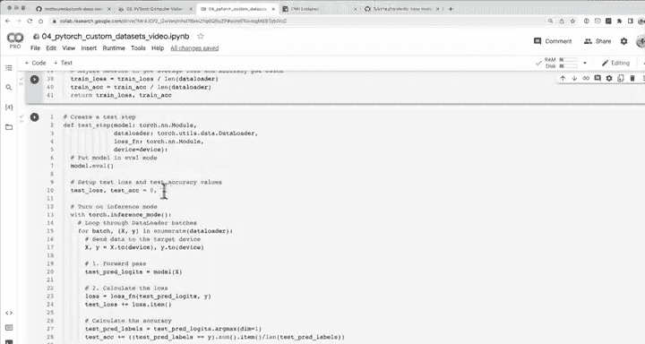
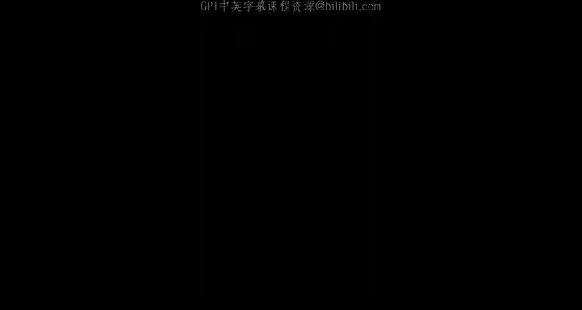
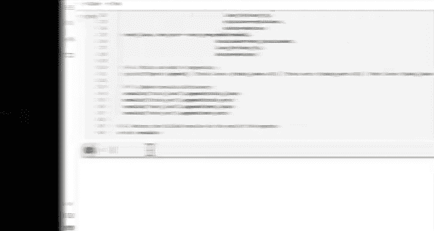
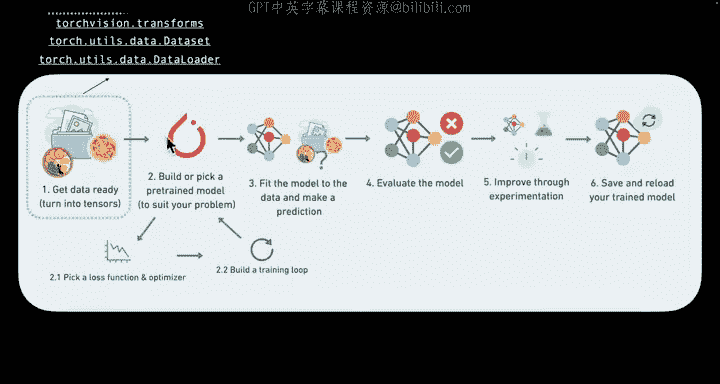
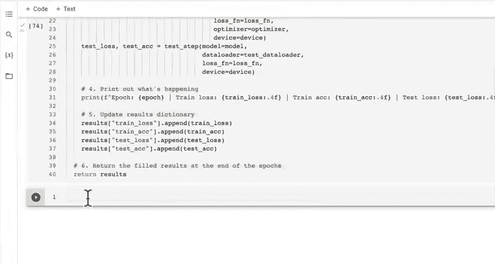
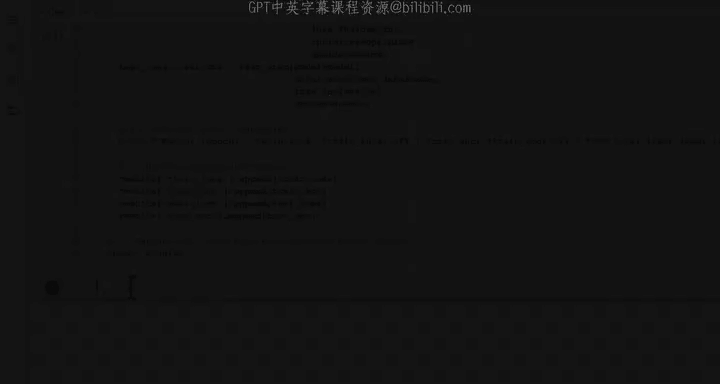
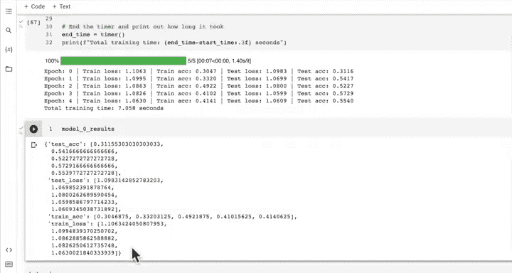

# 88：创建训练与测试循环函数 🚀

在本节课中，我们将学习如何创建通用的训练和测试循环函数。这些函数可以应用于几乎任何模型和数据加载器，从而帮助我们避免重复编写训练代码。

---

## 概述

我们将创建两个核心函数：`train_step` 和 `test_step`。`train_step` 函数负责使用训练数据加载器训练模型，而 `test_step` 函数则负责使用测试数据加载器评估模型性能。之后，我们会创建一个 `train` 函数，将这两个步骤整合起来，以便于进行多轮训练。

---

## 创建训练步骤函数

上一节我们介绍了训练循环的基本概念，本节中我们来看看如何将其封装成一个可复用的函数。

**函数定义：**
```python
def train_step(model: torch.nn.Module,
               data_loader: torch.utils.data.DataLoader,
               loss_fn: torch.nn.Module,
               optimizer: torch.optim.Optimizer,
               device: torch.device = device):
```

以下是 `train_step` 函数的具体步骤：

1.  将模型设置为训练模式：`model.train()`。
2.  初始化训练损失和准确率：`train_loss, train_acc = 0, 0`。
3.  遍历数据加载器中的每个批次：
    *   将数据发送到目标设备：`X, y = X.to(device), y.to(device)`。
    *   前向传播：`y_pred = model(X)`。
    *   计算损失：`loss = loss_fn(y_pred, y)`。
    *   优化器梯度归零：`optimizer.zero_grad()`。
    *   反向传播：`loss.backward()`。
    *   优化器步进：`optimizer.step()`。
    *   计算批次准确率并累加：
        ```python
        y_pred_class = torch.argmax(torch.softmax(y_pred, dim=1), dim=1)
        train_acc += (y_pred_class == y).sum().item() / len(y_pred)
        ```
    *   累加批次损失：`train_loss += loss.item()`。
4.  计算平均损失和准确率：
    ```python
    train_loss = train_loss / len(data_loader)
    train_acc = train_acc / len(data_loader)
    ```
5.  返回平均训练损失和准确率：`return train_loss, train_acc`。





---

## 创建测试步骤函数

现在我们已经有了训练函数，接下来创建一个对应的测试函数来评估模型。

**函数定义：**
```python
def test_step(model: torch.nn.Module,
              data_loader: torch.utils.data.DataLoader,
              loss_fn: torch.nn.Module,
              device: torch.device = device):
```

以下是 `test_step` 函数的具体步骤：

1.  将模型设置为评估模式：`model.eval()`。
2.  初始化测试损失和准确率：`test_loss, test_acc = 0, 0`。
3.  在推理模式下遍历数据加载器：
    ```python
    with torch.inference_mode():
        for batch, (X, y) in enumerate(data_loader):
    ```
    *   将数据发送到目标设备。
    *   前向传播：`test_pred_logits = model(X)`。
    *   计算损失：`loss = loss_fn(test_pred_logits, y)`。
    *   累加批次损失：`test_loss += loss.item()`。
    *   计算批次准确率并累加（可直接对 `logits` 使用 `argmax`）：
        ```python
        test_pred_labels = test_pred_logits.argmax(dim=1)
        test_acc += (test_pred_labels == y).sum().item() / len(test_pred_labels)
        ```
4.  计算平均损失和准确率：
    ```python
    test_loss = test_loss / len(data_loader)
    test_acc = test_acc / len(data_loader)
    ```
5.  返回平均测试损失和准确率：`return test_loss, test_acc`。

---

## 整合训练与测试循环

我们已经创建了独立的训练和测试步骤函数，现在需要将它们整合到一个主训练函数中，以便进行多轮训练并跟踪结果。

**函数定义：**
```python
def train(model: torch.nn.Module,
          train_dataloader: torch.utils.data.DataLoader,
          test_dataloader: torch.utils.data.DataLoader,
          optimizer: torch.optim.Optimizer,
          loss_fn: torch.nn.Module = nn.CrossEntropyLoss(),
          epochs: int = 5,
          device: torch.device = device):
```





以下是 `train` 函数的具体步骤：





1.  导入进度条库：`from tqdm.auto import tqdm`。
2.  创建结果字典以跟踪指标：
    ```python
    results = {"train_loss": [],
               "train_acc": [],
               "test_loss": [],
               "test_acc": []}
    ```
3.  循环指定的轮数：
    ```python
    for epoch in tqdm(range(epochs)):
    ```
    *   调用 `train_step` 函数进行训练，获取本轮训练损失和准确率。
    *   调用 `test_step` 函数进行评估，获取本轮测试损失和准确率。
    *   打印本轮结果。
    *   将结果更新到 `results` 字典中。
4.  函数返回记录所有轮次结果的 `results` 字典。

---

## 应用函数训练模型

最后，让我们应用创建好的函数来训练一个具体的模型（例如 TinyVGG）。

以下是训练模型的具体步骤：

1.  设置随机种子以确保结果可复现。
2.  实例化模型、损失函数和优化器。
3.  启动计时器。
4.  调用 `train` 函数，传入模型、数据加载器、优化器、损失函数等参数。
5.  结束计时并打印总训练时间。
6.  分析结果。例如，如果模型在三个类别上的准确率约为50%，而随机猜测的基线准确率为33%，则说明模型学到了一些特征，但仍有改进空间。

改进模型的常见方法包括：
*   增加网络层数或隐藏单元数。
*   延长训练时间。
*   调整学习率。
*   尝试不同的优化器或激活函数。

---

## 总结



本节课中我们一起学习了如何将 PyTorch 训练和测试循环封装成通用的函数。我们创建了 `train_step`、`test_step` 以及整合二者的 `train` 函数。这些函数提高了代码的复用性和整洁度，使我们能够更高效地训练和评估不同的模型。在下一课中，我们将利用这些函数训练模型，并绘制损失曲线以直观分析训练过程。