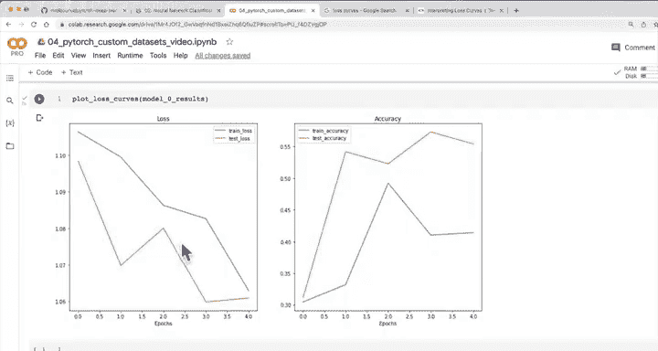

#  89：绘制模型0的损失曲线 📉


在本节课中，我们将学习如何绘制模型的损失曲线。损失曲线是评估模型训练过程的重要工具，它能直观地展示模型性能随时间的变化趋势。

在上一节中，我们训练了第一个卷积神经网络。虽然模型表现未达预期，但我们已识别出几个潜在的改进方向。本节中，我们将通过绘制损失曲线来可视化模型的训练结果。

## 什么是损失曲线？

损失曲线是一种追踪模型随时间进展的方法。它通常以训练步数（如周期或批次）为横轴，以损失值或准确率为纵轴。理想的损失曲线应随时间下降，而准确率曲线应随时间上升。

以下是绘制损失曲线的基本步骤：

1.  **获取结果数据**：从训练结果字典中提取训练和测试的损失值与准确率。
2.  **确定周期数**：根据结果列表的长度确定训练的周期数。
3.  **创建绘图函数**：编写一个函数，接收结果字典并生成损失和准确率曲线图。

## 绘制损失曲线的代码实现

我们将创建一个名为 `plot_loss_curves` 的函数来绘制损失曲线。该函数接收一个字典作为参数，字典的键是字符串，值是浮点数列表。

```python
def plot_loss_curves(results):
    """
    绘制结果字典的训练曲线。
    """
    # 获取损失值
    loss = results["train_loss"]
    test_loss = results["test_loss"]

    # 获取准确率
    accuracy = results["train_acc"]
    test_accuracy = results["test_acc"]

    # 确定周期数
    epochs = range(len(results["train_loss"]))

    # 设置图形
    plt.figure(figsize=(15, 7))

    # 绘制损失曲线
    plt.subplot(1, 2, 1)
    plt.plot(epochs, loss, label="train_loss")
    plt.plot(epochs, test_loss, label="test_loss")
    plt.title("Loss")
    plt.xlabel("Epochs")
    plt.legend()

    # 绘制准确率曲线
    plt.subplot(1, 2, 2)
    plt.plot(epochs, accuracy, label="train_accuracy")
    plt.plot(epochs, test_accuracy, label="test_accuracy")
    plt.title("Accuracy")
    plt.xlabel("Epochs")
    plt.legend()

    plt.show()
```

## 分析损失曲线

调用 `plot_loss_curves(model_0_results)` 后，我们可以观察到模型的训练趋势。理想情况下，损失曲线应从左上方向右下方下降，准确率曲线应随时间上升。如果模型训练不足，损失曲线可能下降缓慢；如果模型过拟合，训练损失可能持续下降，但测试损失开始上升。

## 总结



本节课中，我们一起学习了如何绘制和分析模型的损失曲线。通过可视化训练过程，我们可以更好地理解模型的性能趋势，并为后续的模型优化提供依据。在下一节中，我们将进一步探讨不同类型的损失曲线及其含义。