# 90：过拟合与欠拟合 📈📉

在本节课中，我们将学习深度学习模型训练中两个核心概念：**过拟合**和**欠拟合**。我们将通过分析**损失曲线**来诊断模型状态，并探讨应对这两种情况的策略。

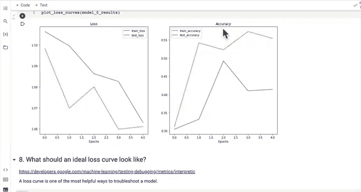


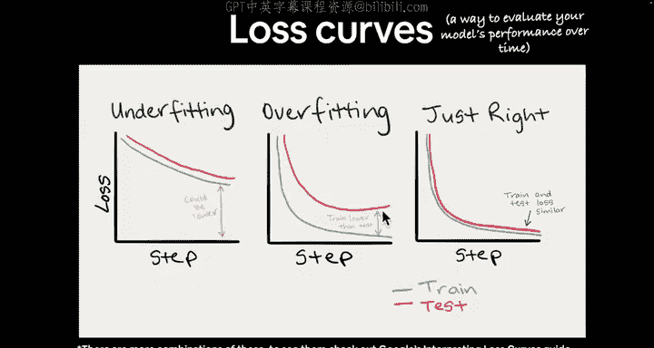

## 损失曲线：评估模型性能的工具

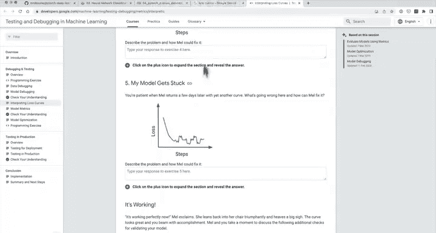


上一节我们介绍了模型评估指标，本节中我们来看看如何通过损失曲线来评估模型随时间（例如训练时长）的性能表现。

损失曲线是评估模型性能随时间变化的最有效方式之一。如果你搜索损失曲线的图片，会发现它们形态各异，解读方式也多种多样。

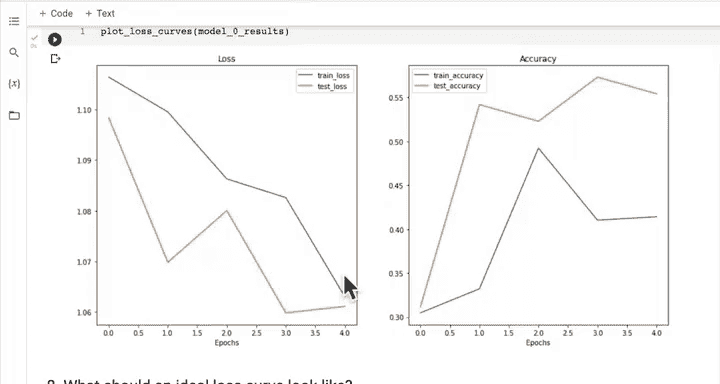

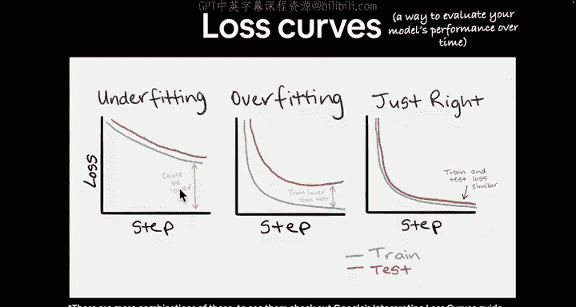

理想的损失曲线趋势是随时间下降。而像准确率这样的评估指标，其趋势通常是随时间上升。

以下是三种主要的损失曲线形态，但实际中你会遇到更多类型。

## 理解过拟合与欠拟合

现在，让我们深入探讨欠拟合、过拟合以及“刚刚好”的状态。

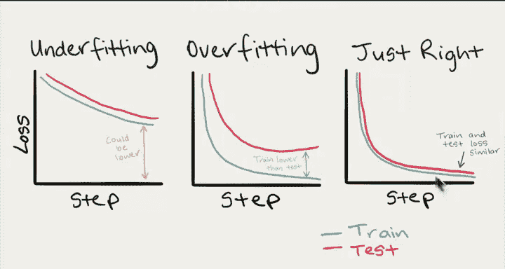

### 欠拟合 (Underfitting) 🤔

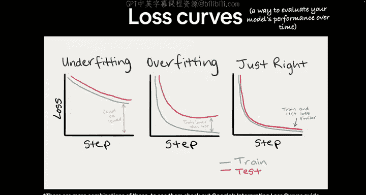

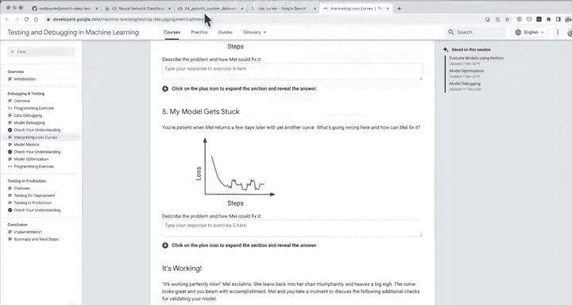

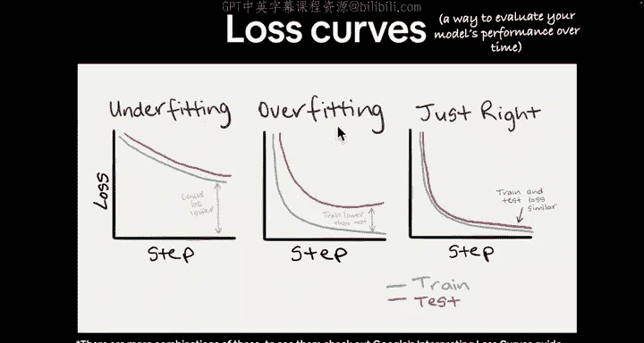

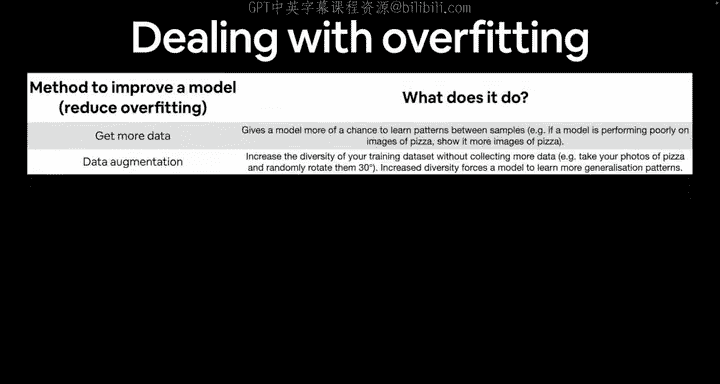

欠拟合是指模型在训练集和测试集上的损失**本可以更低**。从我们的损失曲线来看，模型似乎处于欠拟合状态。我们可能需要训练更长时间（例如10或20个轮次），观察损失是否持续下降，以改善欠拟合。

**核心概念**：模型未能充分学习数据中的模式。
**公式表示**：`训练损失 > 理想损失` 且 `测试损失 > 理想损失`

### 过拟合 (Overfitting) 🎭

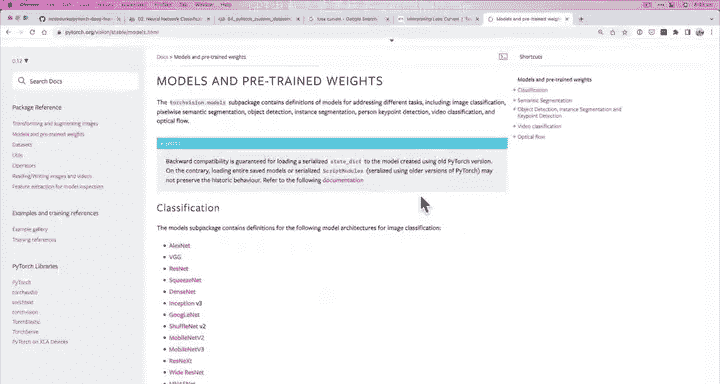

过拟合是欠拟合的反面，也是机器学习中最大的难题之一。过拟合发生时，**训练损失远低于测试损失**。

这意味着模型对训练数据学习“太好”，以至于记住了训练集中的特定模式，但这些模式无法很好地推广到未见过的测试数据上。这好比为了期末考试只死记硬背了课程材料，却无法将知识应用到新问题上。

**核心概念**：模型过度学习了训练数据的细节和噪声。
**公式表示**：`训练损失 << 测试损失`


### 刚刚好 (Just Right) ✅

理想情况下，我们希望训练损失和测试损失以相似的速率下降，并且最终值接近。通常训练损失会略低于测试损失，这是正常的，因为模型接触过训练数据但未见过测试数据。

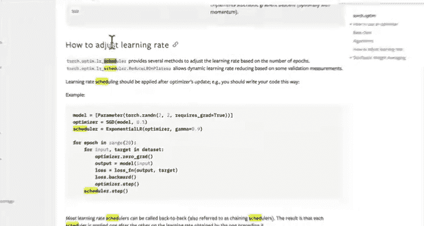


**核心概念**：模型在训练集和测试集上均表现良好，具有良好的泛化能力。

## 如何应对过拟合与欠拟合

以下是处理过拟合和欠拟合的一些常用方法。

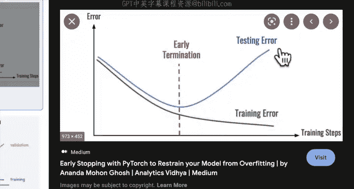

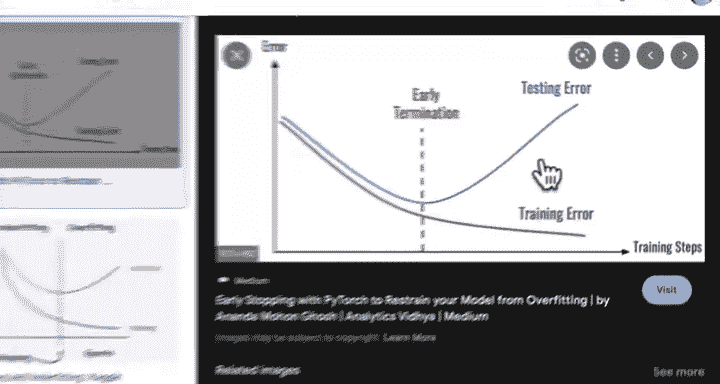

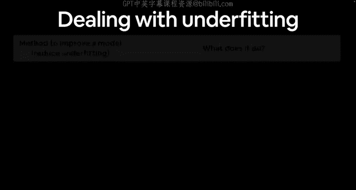

### 应对过拟合的策略

我们的目标是减少过拟合，即让模型在训练集和测试集上表现相当。

1.  **获取更多数据**：扩大训练集，让模型接触更多样本，从而学习更通用的模式。
2.  **使用数据增强**：通过对训练图像进行随机变换（如旋转、裁剪），人为增加数据多样性，使模型学习更鲁棒的特征。
3.  **使用更好的数据**：提升数据质量，帮助模型学习更通用的模式。
4.  **使用迁移学习**：利用在大型数据集（如ImageNet）上预训练好的模型，将其学到的模式调整应用于你自己的问题。
5.  **简化模型**：减少模型层数或隐藏单元数，降低模型复杂度，迫使它用有限的容量学习更通用的模式。
    ```python
    # 示例：简化模型，减少层数和隐藏单元
    # 原模型：10层，每层100个隐藏单元
    # 简化后：5层，每层50个隐藏单元
    ```
6.  **使用学习率衰减**：随着训练进行，逐渐降低学习率。初期可以使用较大的学习率快速下降，后期使用较小的学习率精细调整，避免在最优解附近震荡。
    ```python
    # PyTorch 中使用学习率调度器示例
    from torch.optim.lr_scheduler import StepLR
    scheduler = StepLR(optimizer, step_size=30, gamma=0.1)
    # 每个epoch后调用 scheduler.step()
    ```
7.  **使用早停**：监控模型在验证集上的性能。当验证集误差连续一段时间不再下降甚至开始上升时，停止训练，并回滚到验证误差最低的模型权重。

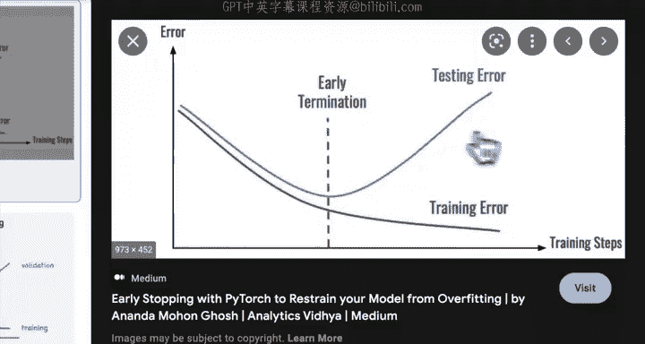

### 应对欠拟合的策略

欠拟合是指模型未能很好地拟合数据，损失还有下降空间。

1.  **为模型添加更多层或单元**：增加模型的容量和学习能力。
2.  **调整学习率**：学习率可能初始设置过高或过低，导致模型无法有效学习。
3.  **训练更长时间**：增加训练轮次，让模型有更多机会观察和学习数据中的模式。
4.  **使用迁移学习**：同样可以借助预训练模型的知识来改善欠拟合。
5.  **减少正则化**：正则化是为了防止过拟合。如果正则化过强，可能会限制模型能力导致欠拟合，可以适当减弱。

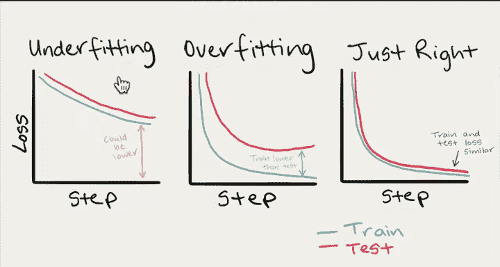

## 平衡的艺术 ⚖️


机器学习很大程度上是在**欠拟合**和**过拟合**之间寻找平衡。试图过度减少欠拟合可能导致过拟合，反之亦然。这个“舞蹈”将贯穿你的整个机器学习生涯。

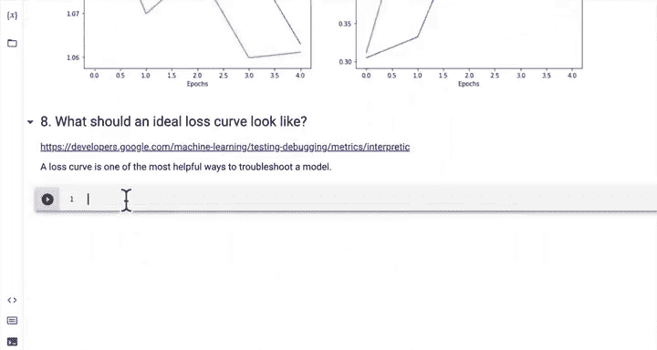


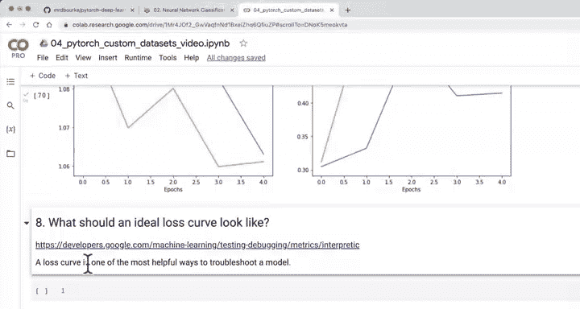

损失曲线是评估模型性能随时间变化的强大工具。我们分析损失曲线的主要目的，就是判断模型是处于欠拟合还是过拟合状态，并努力向“刚刚好”的理想曲线靠近。

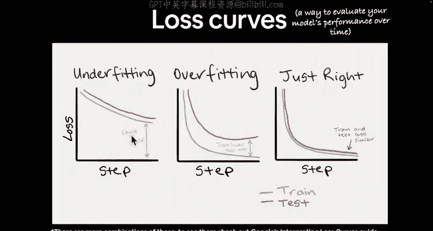

## 实验：使用数据增强构建新模型

根据我们刚才学到的知识，我们的基线模型看起来是欠拟合的。数据增强通常是应对**过拟合**的策略，但让我们通过实验来观察其效果。

我们将创建一个新的模型（Model 1），它使用与之前相同的TinyVGG架构，但这次对训练数据应用数据增强。

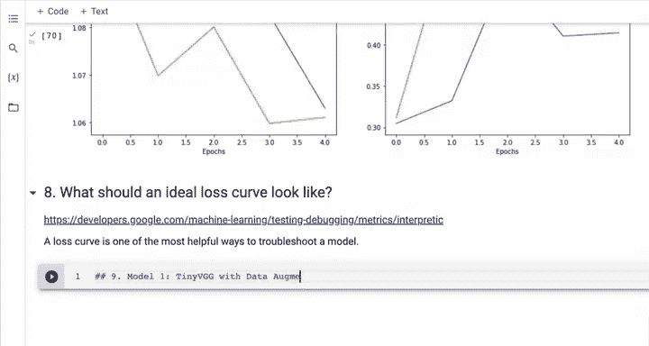

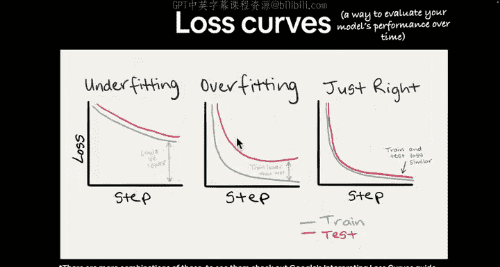

### 步骤1：创建带数据增强的变换

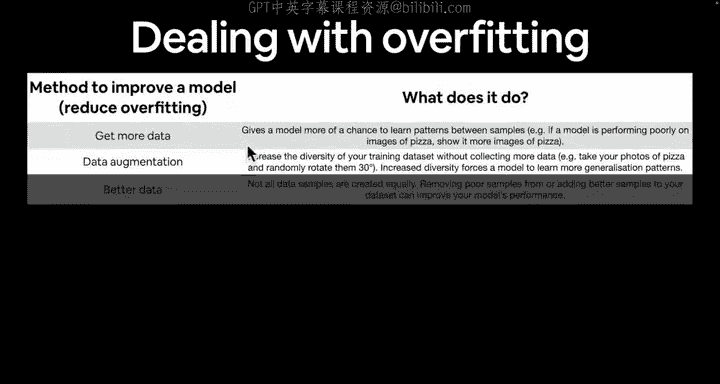

首先，我们需要为训练集和测试集创建不同的数据变换管道。

```python
from torchvision import transforms

# 训练集变换：包含数据增强
train_transform_trivial = transforms.Compose([
    transforms.Resize(size=(64, 64)),
    transforms.TrivialAugmentWide(num_magnitude_bins=31), # 数据增强
    transforms.ToTensor()
])

# 测试集变换：仅进行必要的预处理
test_transform_simple = transforms.Compose([
    transforms.Resize(size=(64, 64)),
    transforms.ToTensor()
])
```

### 步骤2：加载数据并创建DataLoader

接下来，使用这些变换来创建数据集和数据加载器。

```python
from torchvision import datasets
from torch.utils.data import DataLoader
import os

# 创建数据集
train_data_augmented = datasets.ImageFolder(root=train_dir,
                                            transform=train_transform_trivial)
test_data_simple = datasets.ImageFolder(root=test_dir,
                                        transform=test_transform_simple)

# 设置参数
BATCH_SIZE = 32
NUM_WORKERS = os.cpu_count()
torch.manual_seed(42)

# 创建数据加载器
train_dataloader_augmented = DataLoader(dataset=train_data_augmented,
                                         batch_size=BATCH_SIZE,
                                         shuffle=True,
                                         num_workers=NUM_WORKERS)
test_dataloader_simple = DataLoader(dataset=test_data_simple,
                                     batch_size=BATCH_SIZE,
                                     shuffle=False,
                                     num_workers=NUM_WORKERS)
```

### 步骤3：构建并训练模型

现在，使用我们之前定义的`TinyVGG`类和`train`函数来构建和训练模型。

```python
import torch
from torch import nn

# 设置随机种子和设备
torch.manual_seed(42)
torch.cuda.manual_seed(42) # 如果使用CUDA
device = "cuda" if torch.cuda.is_available() else "cpu"

# 创建模型实例并发送到设备
model_1 = TinyVGG(input_shape=3,
                  hidden_units=10,
                  output_shape=len(train_data_augmented.classes)).to(device)

# 设置损失函数和优化器
loss_fn = nn.CrossEntropyLoss()
optimizer = torch.optim.Adam(params=model_1.parameters(),
                             lr=0.001)

# 训练模型
NUM_EPOCHS = 5
from timeit import default_timer as timer
start_time = timer()

model_1_results = train(model=model_1,
                        train_dataloader=train_dataloader_augmented,
                        test_dataloader=test_dataloader_simple,
                        optimizer=optimizer,
                        loss_fn=loss_fn,
                        epochs=NUM_EPOCHS,
                        device=device)

end_time = timer()
print(f"Model 1 训练时间：{end_time - start_time:.3f} 秒")
```

### 步骤4：绘制并分析损失曲线

训练完成后，我们可以绘制损失曲线并与基线模型（Model 0）进行比较。

```python
# 假设我们有一个 plot_loss_curves 函数
plot_loss_curves(model_1_results)
```

在这个实验中，我们可能会发现，由于基线模型本就处于欠拟合状态，添加数据增强（一种主要针对过拟合的技术）可能不会带来性能提升，甚至可能因为增加了学习难度而略微降低性能。这验证了我们的分析：针对模型当前状态（欠拟合），更有效的策略可能是增加模型容量或训练更长时间。

---

本节课中我们一起学习了：
1.  **损失曲线**是评估模型训练过程的核心工具。
2.  **欠拟合**意味着模型能力不足或训练不充分，表现为训练和测试损失都较高。
3.  **过拟合**意味着模型过度记忆训练数据，表现为训练损失很低但测试损失很高。
4.  机器学习的目标是找到欠拟合和过拟合之间的**平衡点**，达到“刚刚好”的泛化状态。
5.  我们掌握了应对过拟合（如数据增强、简化模型、早停）和欠拟合（如增加模型复杂度、训练更久）的一系列策略。
6.  通过一个实验，我们实践了使用数据增强构建新模型，并理解了根据模型诊断结果选择正确改进方向的重要性。

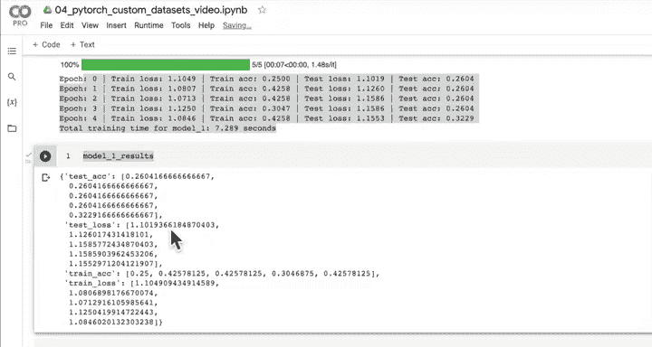

在接下来的课程中，我们将继续探索其他提升模型性能的方法。