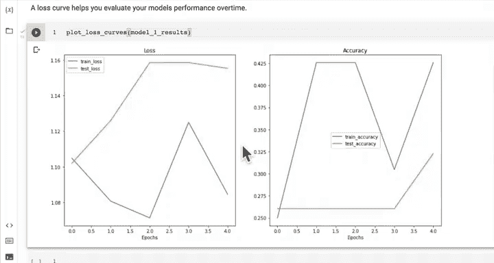
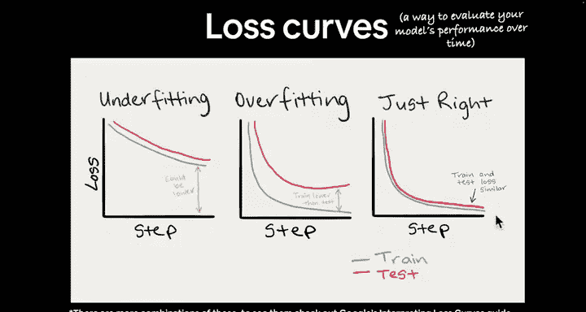
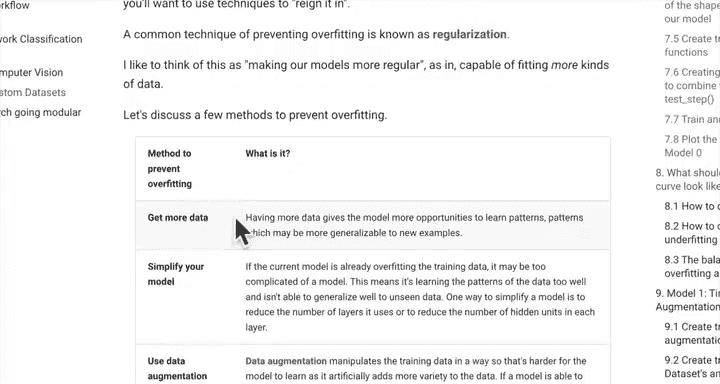
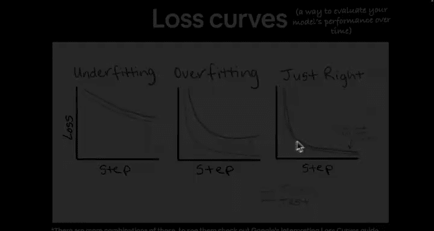
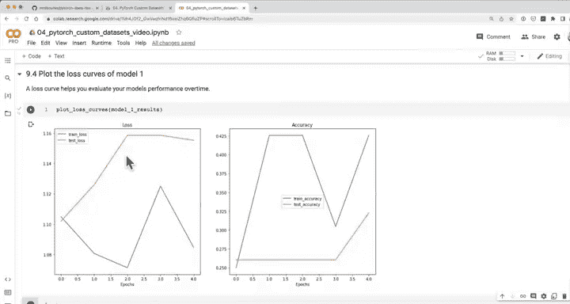

#  91：📊 绘制模型1的损失曲线

在本节课中，我们将学习如何通过绘制损失曲线来评估深度学习模型的性能。损失曲线能直观地展示模型在训练过程中的表现，帮助我们判断模型是否存在欠拟合或过拟合问题。

---

## 回顾与引入

上一节我们完成了使用数据增强技术训练第一个模型的激动人心的工作。然而，从量化指标来看，数据增强似乎并未带来显著的性能提升。因此，我们需要继续深入评估模型。

本节中，我们将重点介绍一种我最喜欢、同时也是最有效的模型评估方法——绘制损失曲线。

损失曲线 `loss_curve` 能帮助你评估模型随时间变化的性能。它提供了一种直观的视觉方式，让你能够清晰地判断模型是处于欠拟合还是过拟合状态。

---

## 绘制模型1的损失曲线

现在，让我们绘制模型1结果的损失曲线，并观察其表现。

我们使用之前创建的函数来绘制曲线。观察结果，我们的测试损失曲线似乎在上升。这符合我们的期望吗？

请记住，理想损失曲线的方向应该是随时间下降的，因为损失值衡量的是模型的错误程度。同时，准确率曲线看起来也波动不定，虽然总体呈上升趋势，但或许我们的训练时间不足以准确衡量这些指标。

因此，一个可行的实验是：将我们的模型0和模型1都训练更多轮次，观察这些损失曲线是否会趋于平缓。

---

## 分析模型状态：欠拟合还是过拟合？

我向你提出一个问题：我们的模型目前是欠拟合、过拟合，还是两者兼有？

如果我们观察损失曲线（注意，这里讨论的是损失值，而非准确率），理想的情况是损失值随时间下降。

在我看来，我们的模型存在欠拟合，因为其损失值本可以更低。但同时，它似乎也存在过拟合的迹象，因为测试损失远高于训练损失，这表明模型的泛化能力不佳，表现并不理想。

---

## 探索改进策略

如果我们回顾 Learn PyTorch 书籍的第4节，理想的损失曲线应该是什么样子？我希望你开始思考一些应对模型过拟合的方法。

以下是应对过拟合的一些潜在策略：
*   **获取更多数据**：增加训练数据量。
*   **简化模型**：降低模型复杂度。
*   **使用迁移学习**：我们将在后续课程中探讨这一点，但你可以提前查阅相关资料。

而对于欠拟合，我们可以尝试以下方法：
*   **增加网络层**：例如，添加另一个卷积块。
*   **增加每层隐藏单元数**：例如，将当前每层10个隐藏单元增加到64个。
*   **延长训练时间**：这可能是最直接的尝试，我们可以使用当前的训练函数将模型训练20个轮次。

请参考这些建议，尝试进行一些实验，看看能否使损失曲线更接近理想的形状。

---

## 后续内容预告

在下一节视频中，我们将继续推进。我们将并排比较我们模型的结果。目前我们已经完成了两个实验，现在是时候将它们放在一起对比了。我们已经分别查看了各个模型的结果，并且知道它们还有改进空间。而比较所有实验的一个好方法，就是将模型结果并排对比。这就是我们下一节要做的内容。

我们下一节见。