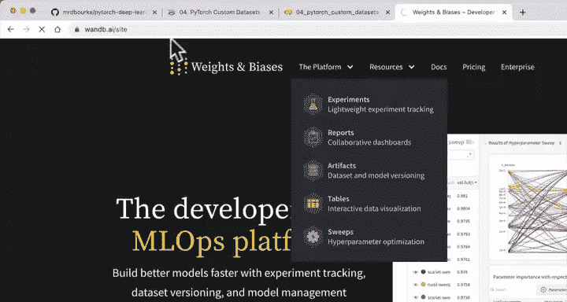
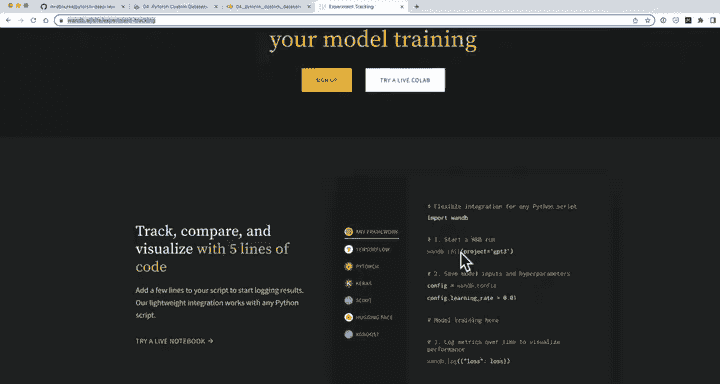
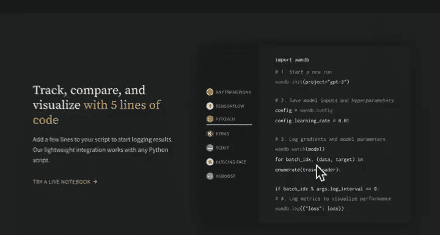
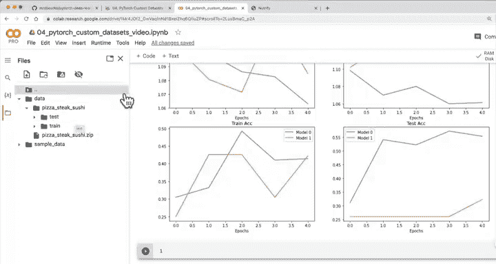

#  92：绘制所有损失曲线 📊


在本节课中，我们将学习如何比较不同模型的训练结果。我们将通过绘制损失和准确率曲线，直观地对比模型0和模型1的性能表现。

---

## 概述

上一节我们分别评估了各个模型的性能。本节中，我们将学习如何将不同模型的训练结果放在一起进行比较。通过可视化对比，我们可以更清晰地判断哪个模型表现更好，以及哪些调整是有效的。






有多种方法可以比较模型结果。以下是几种常见方式：

1.  **手动编码**：通过编写函数和辅助代码来手动绘制图表。
2.  **使用工具**：例如 PyTorch + TensorBoard、Weights & Biases 或 MLflow 等实验跟踪工具。

这些工具可以帮助自动追踪不同实验的参数和结果。本课程将专注于使用纯 PyTorch 进行手动编码，以理解其基本原理。



---

## 创建结果数据框

由于我们的模型结果以字典形式存储，我们可以将它们转换为数据框以便于处理。

```python
# 示例：创建模型0的结果数据框
model_0_df = pd.DataFrame(model_0_results)
```

手动为每个模型创建数据框在模型数量较多时会变得繁琐。这正是自动化工具的优势所在。

---

## 设置对比图表

我们将使用 Matplotlib 创建一个包含四个子图的图表，分别对比两个模型的训练损失、测试损失、训练准确率和测试准确率。

以下是设置图表的步骤：

1.  确定要绘制的轮次（epochs）范围。
2.  创建一个 2x2 的子图布局。
3.  在每个子图中，分别绘制两个模型对应的指标曲线。

```python
import matplotlib.pyplot as plt

# 获取轮次范围
epochs = range(len(model_0_df))

# 创建图表和子图
fig, axes = plt.subplots(nrows=2, ncols=2, figsize=(12, 10))

# 绘制训练损失对比
axes[0, 0].plot(epochs, model_0_df[‘train_loss’], label=‘Model 0’)
axes[0, 0].plot(epochs, model_1_df[‘train_loss’], label=‘Model 1’)
axes[0, 0].set_title(‘Training Loss’)
axes[0, 0].legend()

# 绘制测试损失对比
axes[0, 1].plot(epochs, model_0_df[‘test_loss’], label=‘Model 0’)
axes[0, 1].plot(epochs, model_1_df[‘test_loss’], label=‘Model 1’)
axes[0, 1].set_title(‘Test Loss’)
axes[0, 1].legend()

# 绘制训练准确率对比
axes[1, 0].plot(epochs, model_0_df[‘train_acc’], label=‘Model 0’)
axes[1, 0].plot(epochs, model_1_df[‘train_acc’], label=‘Model 1’)
axes[1, 0].set_title(‘Training Accuracy’)
axes[1, 0].legend()

# 绘制测试准确率对比
axes[1, 1].plot(epochs, model_0_df[‘test_acc’], label=‘Model 0’)
axes[1, 1].plot(epochs, model_1_df[‘test_acc’], label=‘Model 1’)
axes[1, 1].set_title(‘Test Accuracy’)
axes[1, 1].legend()

plt.tight_layout()
plt.show()
```

---

## 分析对比结果

通过观察图表，我们可以得出以下结论：

*   **训练损失**：两个模型的训练损失总体呈下降趋势，这是好的信号。
*   **测试损失**：模型0的测试损失持续下降，而模型1在某个轮次出现上升，表明其可能**过拟合**。这说明仅添加数据增强并不总能保证模型在未知数据上表现更好。
*   **准确率**：两个模型的训练准确率都在上升。然而，模型1的训练准确率提升并未完全转化到测试准确率上，这再次印证了过拟合的可能性。

理想的趋势是：损失曲线应从左上方向右下方移动，而准确率曲线应从左下方向右上方移动。模型0在损失方面目前表现更优。

---

## 总结

本节课中，我们一起学习了如何通过可视化方法对比不同深度学习模型的训练结果。我们手动创建了对比图表，分析了损失和准确率曲线，并认识到模型调整（如数据增强）并不总是带来预期的改进。

进行一系列建模实验时，不仅要单独评估每个模型，更要相互比较，这样才能回顾实验过程，明确哪些调整有效、哪些无效。对于当前的模型，可以尝试延长训练时间或增加隐藏单元来观察效果。



在下一课中，我们将学习如何使用训练好的模型对我们自己的自定义食物图像进行预测。