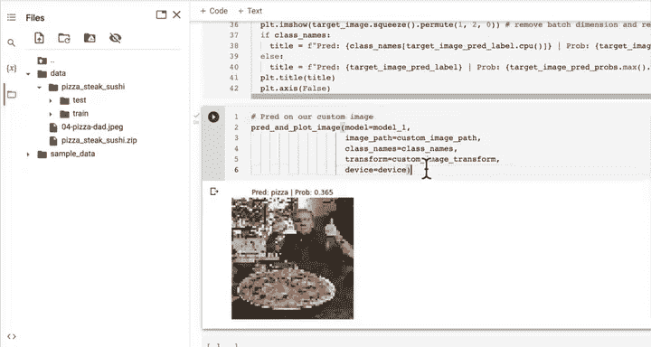
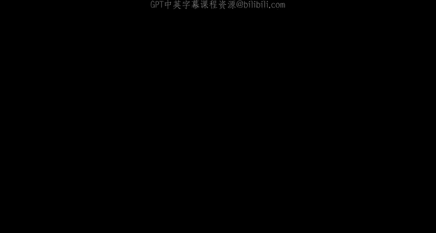
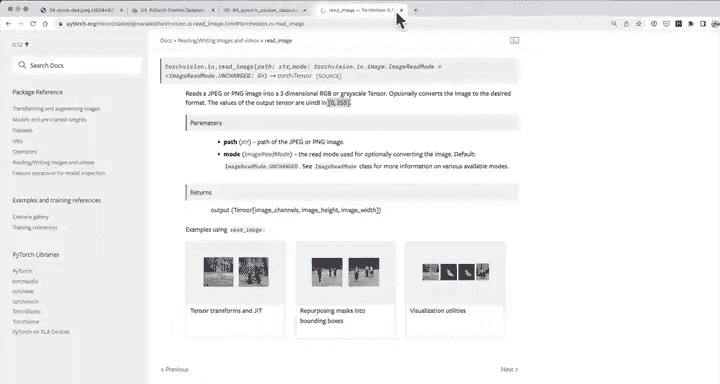
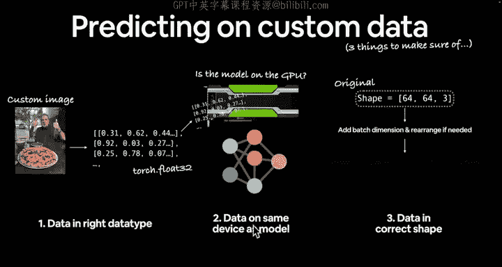
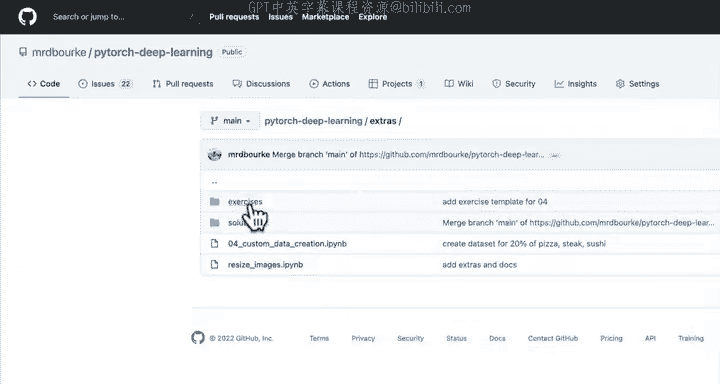
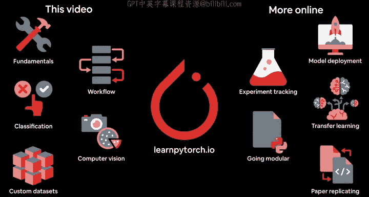

# 93：在自定义数据上进行预测 🍕📸

在本节课中，我们将学习如何使用训练好的PyTorch模型对我们自己的图像进行预测。我们将从下载一张自定义图片开始，逐步将其处理成模型可以接受的格式，并最终获得预测结果。

---

## 概述

上一节我们比较了不同的建模实验。本节中，我们将进入深度学习最令人兴奋的部分之一：对自定义图像进行预测。虽然我们已经用自定义数据训练了模型，但如何对不在训练集或测试集中的样本（例如一张新图片）进行预测呢？我们将模拟一个食物识别应用（例如Nutrify）的工作流程：上传一张披萨图片，让模型识别它。

## 下载自定义图像

首先，我们需要获取一张自定义图像。虽然可以在Google Colab中点击上传按钮，但我们将通过编程方式下载，以确保代码的可重复性。

以下是下载图像的步骤：

1.  检查图像是否已存在。
2.  如果不存在，则从指定URL下载。
3.  将图像保存到本地路径。

```python
import requests
from pathlib import Path

# 设置自定义图像路径
custom_image_path = Path("data/04-pizza-dad.jpg")

# 如果图像不存在，则下载
if not custom_image_path.is_file():
    # 图像的原始URL
    image_url = "https://raw.githubusercontent.com/mrdbourke/pytorch-deep-learning/main/images/04-pizza-dad.jpg"
    # 下载图像
    with open(custom_image_path, "wb") as f:
        request = requests.get(image_url)
        f.write(request.content)
    print(f"下载数据: {custom_image_path}")
else:
    print(f"{custom_image_path} 已存在，跳过下载。")
```

运行代码后，图像将保存在 `data/` 文件夹中。

## 使用PyTorch加载自定义图像

现在我们已经有了图像文件，下一步是将其加载到PyTorch中。我们需要确保自定义图像的格式与模型训练时使用的格式一致。

具体来说，图像需要是：
*   **数据类型**：`torch.float32`
*   **形状**：`[3, 64, 64]` （颜色通道在前，高度64像素，宽度64像素）
*   **设备**：与模型在同一设备上（例如GPU）

我们将使用 `torchvision.io.read_image` 来读取图像。

```python
import torch
import torchvision
import matplotlib.pyplot as plt

# 将图像作为张量读入（数值范围0-255）
custom_image_uint8 = torchvision.io.read_image(str(custom_image_path))

# 查看图像张量的信息
print(f"自定义图像张量:\n{custom_image_uint8}")
print(f"自定义图像形状: {custom_image_uint8.shape}")
print(f"自定义图像数据类型: {custom_image_uint8.dtype}")

# 尝试绘制图像（需要调整维度顺序以适配matplotlib）
plt.imshow(custom_image_uint8.permute(1, 2, 0))
plt.title("原始自定义图像")
plt.axis(False)
plt.show()
```

你会发现，我们下载的图像尺寸远大于 `64x64`，并且数据类型是 `torch.uint8`。在将其输入模型之前，我们需要解决这些问题。

## 对自定义图像进行预测

在上一节，我们加载了自定义图像并查看了其属性。本节中，我们将对其进行预处理，然后尝试用训练好的模型进行预测。

我们需要完成以下步骤：
1.  将数据类型转换为 `torch.float32`。
2.  将像素值从 `[0, 255]` 缩放到 `[0, 1]`。
3.  调整图像尺寸至 `64x64`。
4.  确保图像在正确的设备上（例如GPU）。
5.  为图像添加一个批次维度（batch dimension）。

让我们逐步实现：

```python
# 1. 转换数据类型并缩放像素值
custom_image = torchvision.io.read_image(str(custom_image_path)).type(torch.float32) / 255.

# 2. 创建转换管道以调整图像大小
from torchvision import transforms
custom_image_transform = transforms.Compose([
    transforms.Resize(size=(64, 64))
])

# 3. 应用转换
custom_image_transformed = custom_image_transform(custom_image)

# 打印转换前后的形状
print(f"原始形状: {custom_image.shape}")
print(f"转换后形状: {custom_image_transformed.shape}")

# 4. 将图像转移到模型所在的设备（例如GPU）
device = "cuda" if torch.cuda.is_available() else "cpu"
custom_image_transformed = custom_image_transformed.to(device)

# 5. 添加批次维度（模型期望的输入形状为 [batch_size, color_channels, height, width]）
custom_image_transformed_with_batch = custom_image_transformed.unsqueeze(dim=0)

print(f"最终图像形状（带批次维度）: {custom_image_transformed_with_batch.shape}")
```

现在，图像已经准备好，可以输入模型了。让我们尝试进行预测：

```python
# 加载之前训练好的模型（例如 model_1）
model_1.eval()
with torch.inference_mode():
    custom_image_pred = model_1(custom_image_transformed_with_batch)

print(f"原始模型输出（logits）: {custom_image_pred}")
```

如果一切顺利，你将得到一组logits值，分别对应披萨、牛排和寿司三个类别。

## 将模型输出转换为可读标签

上一节我们得到了模型的原始输出（logits）。本节中，我们将把这些logits转换为预测概率，并最终得到人类可读的标签。

以下是转换步骤：

1.  使用 `torch.softmax` 将logits转换为预测概率。
2.  使用 `torch.argmax` 获取概率最高的类别索引。
3.  使用类别名称列表将索引转换为文本标签。

```python
# 1. 将logits转换为预测概率
custom_image_pred_probs = torch.softmax(custom_image_pred, dim=1)
print(f"预测概率: {custom_image_pred_probs}")

# 2. 获取预测标签（索引）
custom_image_pred_label = torch.argmax(custom_image_pred_probs, dim=1)
print(f"预测标签（索引）: {custom_image_pred_label}")

# 3. 将索引转换为类别名称
class_names = ["pizza", "steak", "sushi"]
custom_image_pred_class = class_names[custom_image_pred_label.cpu()] # 注意将张量移至CPU
print(f"预测类别: {custom_image_pred_class}")
```

## 创建预测与绘图函数

我们已经编写了许多代码来对单张图像进行预测。为了使这个过程更简洁、可重用，让我们将所有步骤封装到一个函数中。



这个函数的目标是：传入一个图像路径和一个训练好的模型，函数将加载图像、进行预处理、运行预测，并绘制图像及其预测结果。



```python
def pred_and_plot_image(model: torch.nn.Module,
                        image_path: str,
                        class_names: list[str] = None,
                        transform=None,
                        device: torch.device = device):
    """
    使用训练好的模型对目标图像进行预测并绘图。

    参数:
        model: 训练好的PyTorch模型。
        image_path: 目标图像的文件路径。
        class_names: 可选的类别名称列表。
        transform: 可选的torchvision transforms以应用于图像。
        device: 目标设备（例如，“cuda”或“cpu”）。
    """
    # 1. 加载图像并转换数据类型
    target_image = torchvision.io.read_image(str(image_path)).type(torch.float32) / 255.

    # 2. 应用转换（如果提供）
    if transform:
        target_image = transform(target_image)

    # 3. 确保模型在目标设备上，并开启评估模式
    model.to(device)
    model.eval()
    with torch.inference_mode():
        # 4. 添加批次维度并将图像转移到设备
        target_image = target_image.unsqueeze(dim=0).to(device)
        # 5. 进行预测
        target_image_pred = model(target_image)
        # 6. 将logits转换为概率和标签
        target_image_pred_probs = torch.softmax(target_image_pred, dim=1)
        target_image_pred_label = torch.argmax(target_image_pred_probs, dim=1)

    # 7. 绘图
    plt.imshow(target_image.squeeze().permute(1, 2, 0).cpu()) # 移除批次维度，调整通道顺序，移至CPU
    if class_names:
        title = f"预测: {class_names[target_image_pred_label.cpu()]} | 概率: {target_image_pred_probs.max().cpu():.3f}"
    else:
        title = f"预测: {target_image_pred_label.cpu()} | 概率: {target_image_pred_probs.max().cpu():.3f}"
    plt.title(title)
    plt.axis(False)
    plt.show()
```





现在，我们可以用一行代码来预测我们的披萨爸爸图片了：

```python
# 使用函数进行预测和绘图
pred_and_plot_image(model=model_1,
                    image_path=custom_image_path,
                    class_names=class_names,
                    transform=custom_image_transform,
                    device=device)
```

运行代码，你将看到图像以及模型的预测结果和置信度。

## 总结与核心要点

本节课中，我们一起学习了如何使用训练好的PyTorch模型对我们自己的图像进行端到端的预测。

我们经历了以下关键步骤：
1.  **下载自定义图像**：以编程方式获取预测所需的图片。
2.  **加载与检查图像**：使用 `torchvision.io.read_image` 将图像读入为张量，并检查其形状和数据类型。
3.  **图像预处理**：这是最关键的一步，我们必须确保自定义数据的格式与模型训练时一致。这涉及：
    *   **数据类型转换**：转换为 `torch.float32`。
    *   **数值缩放**：将像素值从 `[0, 255]` 缩放到 `[0, 1]`。
    *   **尺寸调整**：使用 `transforms.Resize` 将图像调整为模型期望的尺寸（如 `64x64`）。
    *   **设备转移**：将图像张量移动到模型所在的设备（CPU或GPU）。
    *   **添加批次维度**：使用 `.unsqueeze(dim=0)` 为单张图像添加批次维度。
4.  **执行预测**：将处理好的图像输入模型，获得原始输出（logits）。
5.  **解释结果**：使用 `torch.softmax` 和 `torch.argmax` 将logits转换为预测概率和类别标签。
6.  **功能封装**：将整个流程封装进 `pred_and_plot_image` 函数，提高代码的复用性和整洁度。

**核心要点**：
在对自定义数据进行预测时，务必警惕以下三个最常见的PyTorch错误来源，无论是处理图像、文本还是音频数据：
*   **数据类型不匹配**：确保自定义数据与模型参数的数据类型一致（通常是 `torch.float32`）。
*   **张量形状不匹配**：确保输入数据的形状符合模型期望（包括批次维度、通道顺序等）。
*   **设备不匹配**：确保输入数据与模型位于同一计算设备上（CPU或GPU）。





通过本节课的实践，你已经掌握了将训练好的模型应用于现实世界自定义数据的基本工作流程。接下来，你可以尝试用自己的图片进行测试，并思考如何通过改进模型架构、调整超参数或使用更多数据来提升预测的准确性和可靠性。