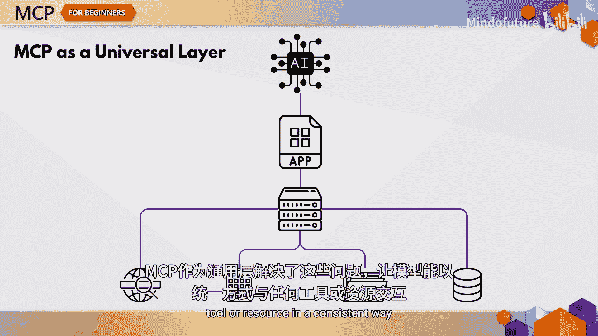
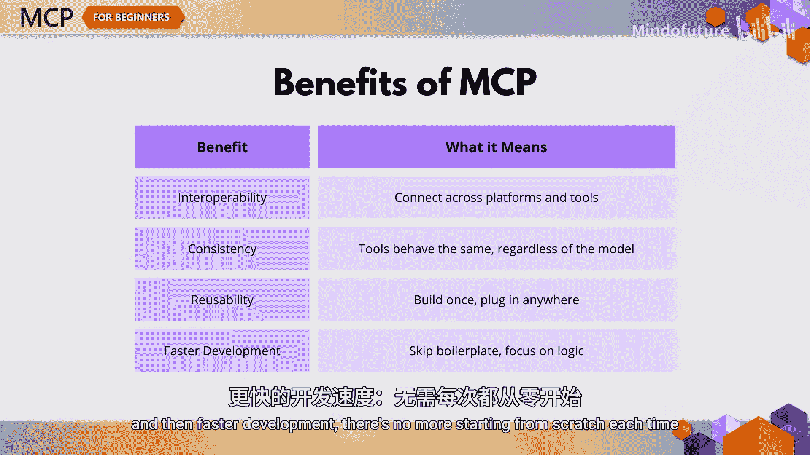
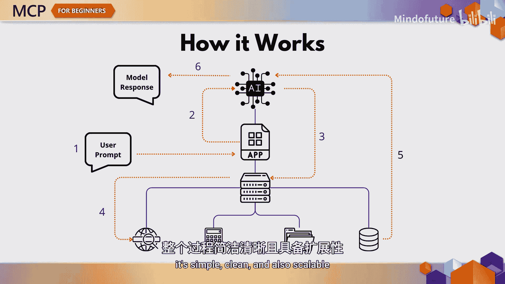
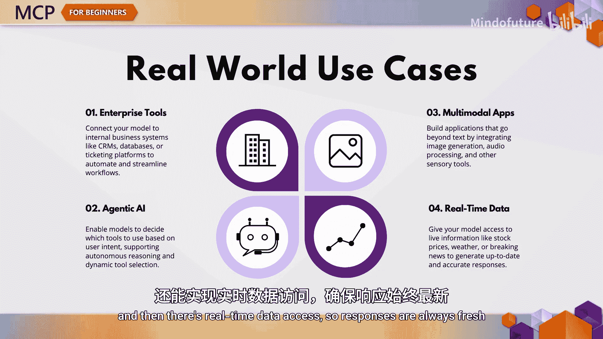
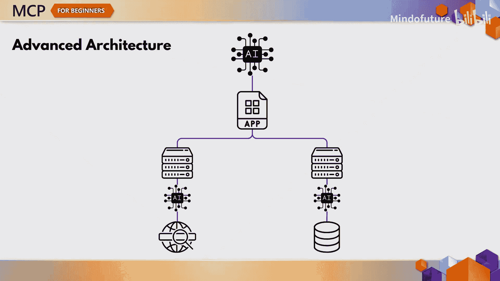
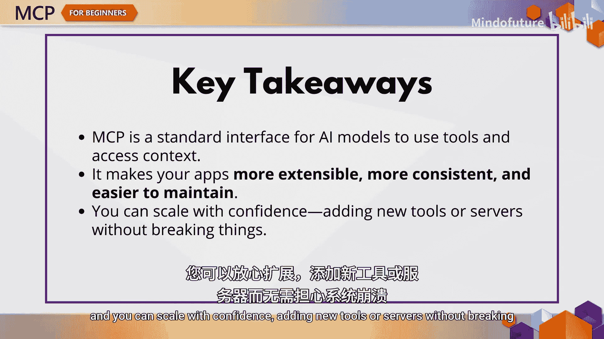

# 001：模型上下文协议(MCP)简介 🧠

在本节课中，我们将要学习模型上下文协议（Model Context Protocol，简称MCP）的基础知识。MCP是一个开放标准接口，旨在帮助大型语言模型等AI模型与外部世界进行通信和交互。通过本教程，你将理解MCP的核心价值、工作原理以及它能解决的实际问题。

如果你曾尝试构建一个超越简单聊天的生成式AI应用，可能会遇到一些挑战。例如，如何将其连接到实时数据，如何调用计算器或搜索引擎等工具，以及如何保持整个系统的可扩展性和可维护性。这正是MCP发挥作用的地方。

模型上下文协议是一个开放、标准化的接口，它帮助AI模型（如大型语言模型）与外部世界进行通信。你可以将其理解为连接模型与API、工具、数据源的统一架构，让它们能够协同工作。MCP使你的模型不仅能智能地响应，还能执行具体操作。

随着AI应用日益复杂，定制化的集成方案难以扩展。这通常会导致一次性解决方案、脆弱的流程管道，以及任何变更都可能引发故障的代码。MCP通过提供一个通用层来解决这个问题，使你的模型能够以一致的方式与任何工具或资源交互。

这种标准化真正令人兴奋之处在于，它为构建更智能、更具自主性的系统打开了大门。你可以一次性接入工具，然后在多个模型中复用它们。这使得后续的功能扩展也变得容易得多。

以下是MCP带来的一些关键优势：
*   **互操作性**：可以在不同的供应商和平台之间工作。
*   **一致性**：模型与任何工具交互时行为一致。
*   **可复用性**：构建一次工具，即可在任何地方使用。
*   **更快的开发**：无需每次都从头开始。

在高层架构上，MCP遵循客户端-服务器模型。它包括：
*   **MCP主机**：运行AI模型。
*   **MCP客户端**：你的应用程序，负责发送请求。
*   **MCP服务器**：提供模型可能需要的工具、资源和上下文。

MCP服务器负责管理诸如工具注册、身份验证以及格式化响应以便模型理解等事务。当模型需要帮助时，例如想要搜索网络或运行计算，它会与服务器通信，由服务器处理其余部分。

以下是其工作流程：
1.  客户端将用户提示发送给模型。
2.  模型意识到需要外部帮助。
3.  模型通过MCP向服务器发送请求。
4.  服务器执行工具并返回结果。
5.  模型完成其响应。

这个过程简单、清晰且可扩展。如果你准备亲自尝试，好消息是已有Java、JavaScript、Python和C#等语言的MCP服务器实现，你可以用自己熟悉的编程语言开始构建自己的MCP服务器。

MCP的应用场景令人兴奋，包括：
*   **企业数据集成**：将模型与内部工具和CRM系统连接。
*   **自主AI系统**：模型自主决定使用哪些工具。
*   **多模态应用**：结合文本、图像和音频工具。
*   **实时数据访问**：确保响应始终基于最新信息。

可以将MCP视为AI领域的“USB-C”——一个通用连接器。正如USB-C统一了设备充电标准，MCP统一了模型访问工具和数据的方式。一旦某个东西支持MCP，你的智能体无需定制指令即可使用它。

这也意味着你可以实现“一个模型，多个服务器”的扩展模式，每个服务器具备不同的能力。添加一个新服务器后，智能体会自动知道有哪些工具可用，无需额外配置。对于更高级的设置，客户端和服务器都可以拥有自己的大语言模型，从而实现更智能的功能协商和更丰富的交互。这类似于Visual Studio Code与其扩展之间协商能力的方式，MCP提供了这种级别的灵活性。

MCP不仅仅关乎构建更好的应用，更关乎构建面向未来的应用。通过它，你可以通过将模型基于真实数据来减少“幻觉”现象，可以保护敏感信息安全，还可以赋予模型其训练时从未具备的能力。

本节课中我们一起学习了模型上下文协议（MCP）的基础知识。总结来说，MCP是AI模型使用工具和访问上下文的标准接口。它使你的应用程序更具可扩展性、更一致且更易于维护。你可以充满信心地进行扩展，添加新工具或服务器而不会破坏现有功能。

思考一下你想要构建的AI应用，哪些工具或数据能增强它，以及MCP如何帮助你更可靠地接入这些资源。本章内容到此结束。在下一个视频中，我们将开始探索MCP的核心概念，剖析其运作机制和各部分如何协同工作。别忘了查看GitHub上的SDK，并开始构想你能用MCP构建什么。我们下个视频见。

