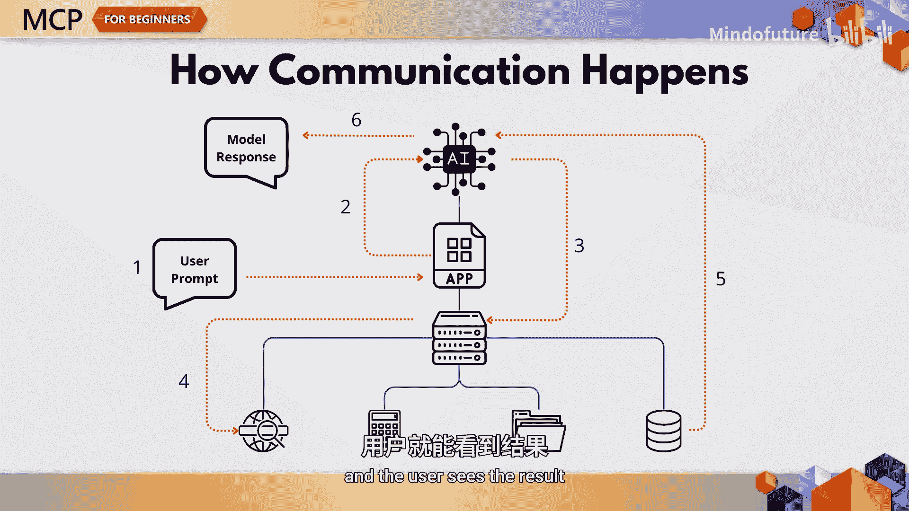
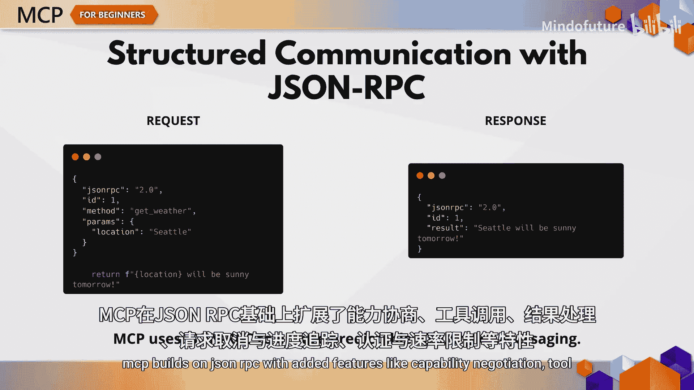
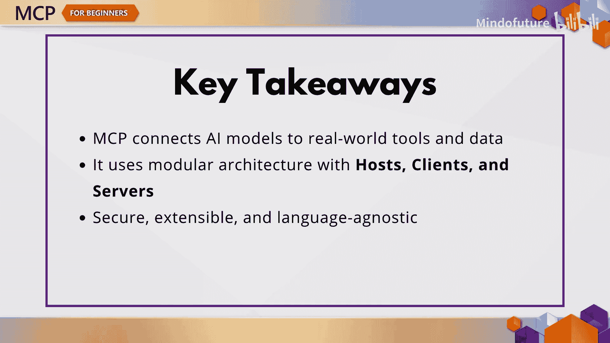
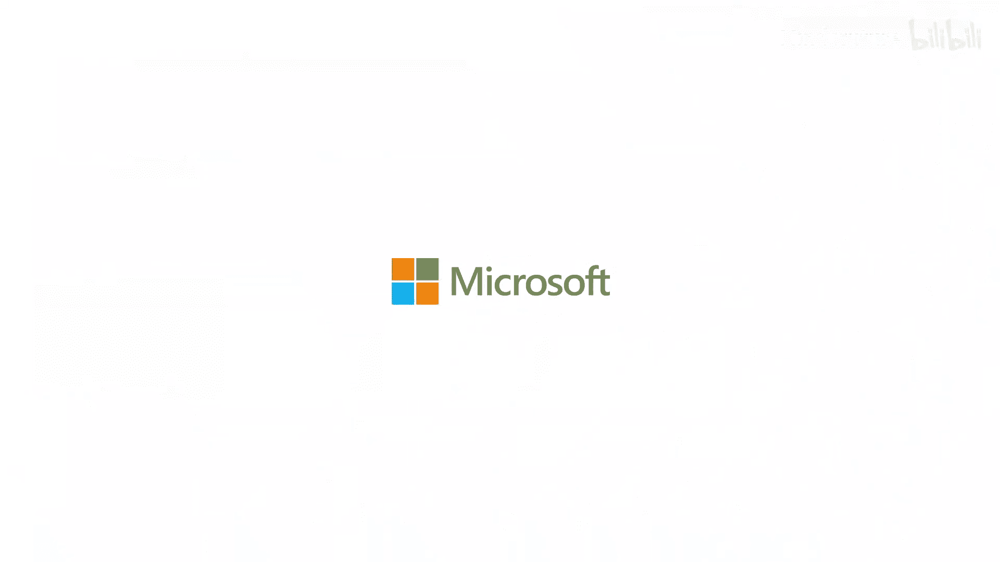

# 002：MCP核心概念 🧩


在本章节中，我们将深入探讨模型上下文协议（MCP）的核心。如果你曾好奇AI工具如何与外部API或数据库通信，那么你来对地方了。MCP正是实现这一功能并使其强大的关键。

MCP代表模型上下文协议。它是一种标准化的方式，让语言模型能够与工具、数据源和外部应用程序进行交互。你可以把它想象成你的AI模型与整个数字生态系统之间的翻译官。

MCP的独特之处在于其架构。它是模块化的、灵活的，并且设计成可以与任何编程语言协同工作，无论是Python、Java、JavaScript还是.NET。

## 工作原理：客户端-服务器架构

MCP采用客户端-服务器架构，包含三个主要角色。

*   **主机**：例如VS Code或云端桌面，是用户进行交互的地方。
*   **客户端**：位于主机内部，负责与服务器通信。
*   **服务器**：提供模型可以使用的工具、数据或提示。

如果你曾使用过能够查找文档、调用天气API或生成代码模板的AI智能体，那么它很可能在底层使用了类似MCP的技术。

以下是各角色的具体职责：

*   **主机**：用户提示的发起地。它管理用户界面、权限并连接到服务器。
*   **客户端**：处理通信。它将提示发送给服务器，并返回模型的响应。
*   **服务器**：通过暴露资源、工具和提示来执行实际工作。

## 服务器提供的功能

服务器可以提供三种主要功能。

*   **资源**：例如本地文件、数据库条目或外部API。
*   **提示**：指导AI行为的模板。
*   **工具**：模型可以调用的可执行函数，例如Git操作或获取天气。

这正是MCP真正大放异彩的地方。工具就像是AI的插件。你可以定义它们，控制它们的访问权限，并用它们让你的智能体变得更聪明、更有帮助。

以下是一个简单的Python工具定义示例：

```python
def get_weather(location):
    # 在实际应用中，这里会调用天气API
    return {"location": location, "forecast": "Sunny", "temperature": 22}
```

这个名为 `get_weather` 的工具接收一个地点参数，并返回一个模拟的天气预报。在现实世界中，它可能会调用天气API并将结构化的JSON数据返回给模型。

## 通信流程与协议



现在，让我们看看这些部分是如何通信的。当用户发出请求时，主机会发起连接。客户端和服务器会协商能力，确定有哪些工具或数据可用。模型可能会请求一个工具或资源，服务器执行它并返回结果。最后，客户端将所有内容整合到模型的响应中，用户就能看到结果。

所有这些通信都使用一种名为**JSON-RPC**的结构化消息格式。它确保了组件之间清晰、可预测的通信，无论你使用的是WebSocket、标准输入/输出还是服务与事件。

MCP在JSON-RPC的基础上，增加了以下关键特性：

*   能力协商
*   工具调用与结果处理
*   请求取消与进度跟踪
*   身份验证与速率限制
*   最重要的是：**用户同意与控制**

安全性是内置的。每一次工具调用、每一次数据访问都必须获得批准。这意味着用户可以控制共享什么、执行什么以及向模型暴露什么。

## 构建你自己的MCP服务器



如果你想构建自己的MCP服务器，我们的课程提供了.NET、Java、Python和JavaScript的示例。无论你使用哪种技术栈，你都可以定义工具、提供服务并参与到MCP生态系统中。

## 本章总结



总而言之，MCP是连接AI与你数字世界其余部分的桥梁。它是模块化的、安全的，专为现实世界的集成而构建。无论你是在VS Code中调试，还是在构建自定义智能体，MCP都能帮助你的模型作用于世界，而不仅仅是谈论它。

## 课后挑战

设计一个你希望用MCP构建的工具。它叫什么名字？需要什么输入？会返回什么输出？模型会如何使用它？



本章内容到此结束。在下一章中，我们将讨论安全性。我们将涵盖权限、工具安全以及如何保护你的数据。下节课见！