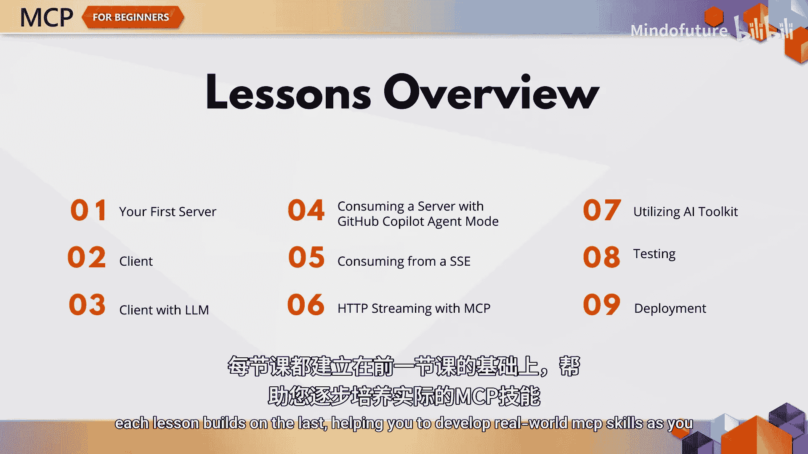
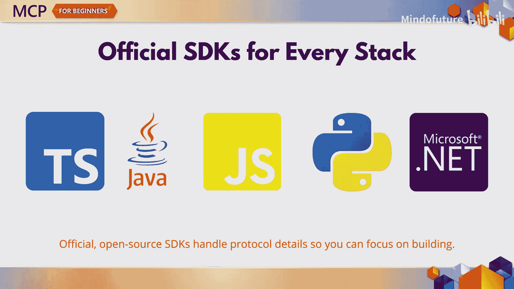
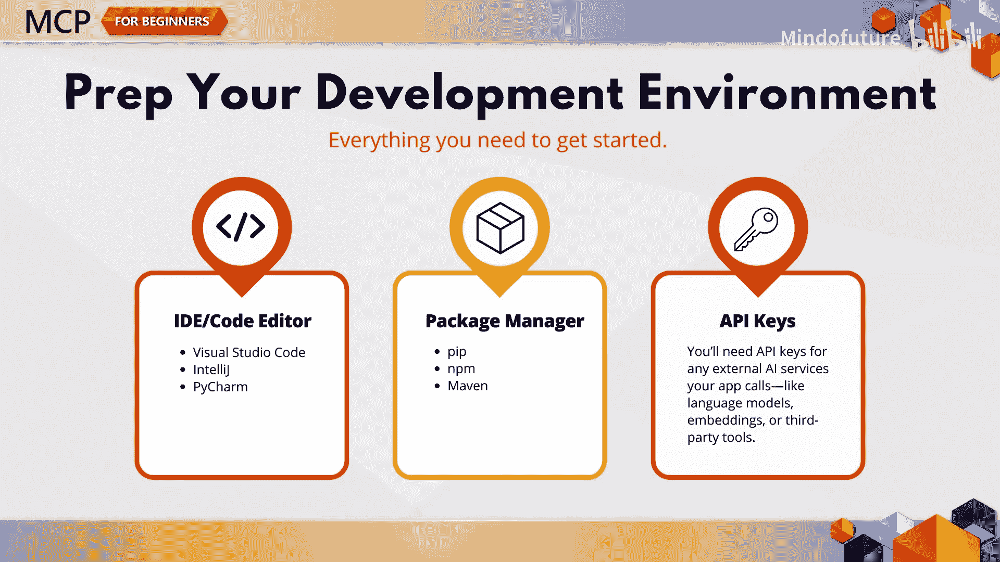
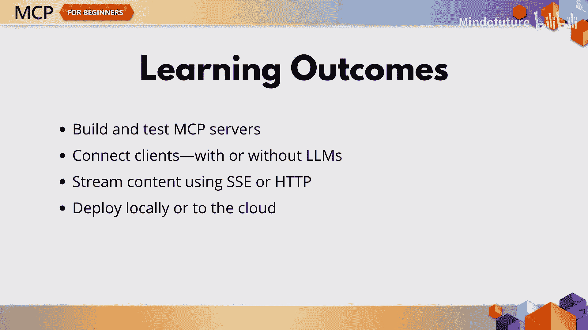
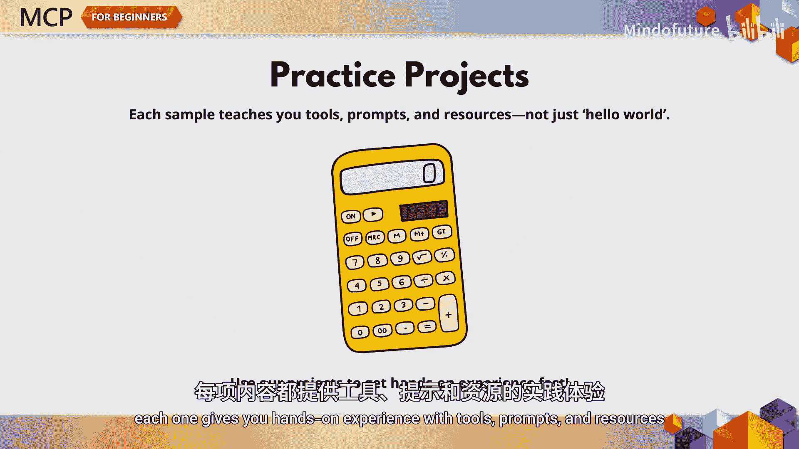
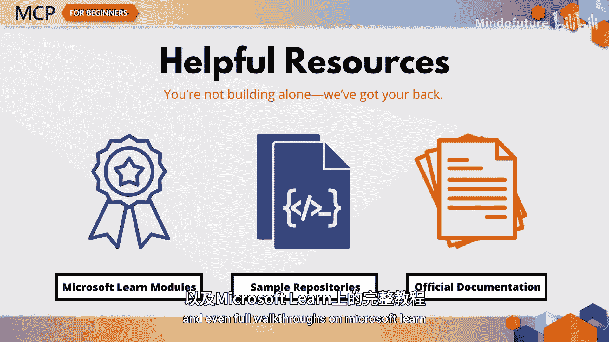

# 004：构建你的第一个MCP服务器 🚀

在本章节中，我们将从零开始构建你的第一个MCP项目。无论你是MCP的新手，还是希望提升技能的开发者，这里都是你旅程的起点。我们将学习如何搭建开发环境、创建代理、连接客户端以及实现实时响应流。通过本章的学习，你将掌握构建和部署基础MCP服务器的核心技能。

## 开发环境准备 🛠️

在开始编码之前，我们需要准备好开发环境。这是确保后续步骤顺利进行的基础。

以下是需要准备的事项：
*   一个集成开发环境或代码编辑器，例如 **VS Code**、**IntelliJ** 或 **PyCharm**。
*   与你所选编程语言对应的包管理器。
*   你的应用程序将要连接的AI服务所需的任何API密钥。

我们将全程提供链接和指导，帮助你顺利完成所有设置。

## 本章内容概览 📋

上一节我们介绍了环境准备，本节中我们来看看本章将要完成的具体任务。每一步都建立在前一步的基础上，帮助你逐步掌握实用的MCP技能。

以下是本章的学习路线：
1.  **创建并检查你的第一个MCP服务器**：你将构建首个MCP服务器，并使用内置的检查工具来查看其状态。
2.  **编写客户端连接服务器**：你将编写一个客户端程序，与刚创建的服务器建立连接。
3.  **集成LLM使客户端更智能**：你将为大语言模型添加功能，使客户端能够与服务器进行协商，而不仅仅是发送命令。
4.  **在VS Code中运行一切**：学习如何在VS Code环境中运行整个项目，包括使用GitHub Copilot的代理模式。
5.  **引入服务器发送事件流**：学习使用服务器发送事件来实现流式传输。
6.  **实现HTTP流式传输**：探索适用于可扩展实时应用程序的HTTP流式传输。
7.  **使用AI工具包进行测试**：利用Visual Studio Code的AI工具包来快速测试和迭代你的项目。
8.  **进行全面测试**：当然，我们会展示如何对一切进行彻底的测试。
9.  **部署你的MCP解决方案**：最后，你将学习如何在本地或云端部署你的MTP解决方案。

## 语言选择与官方SDK 💻

我们支持多种编程语言，你可以在**C#**、**Java**、**JavaScript**、**TypeScript**和**Python**中找到示例代码。你将使用每种语言对应的官方MCP SDK进行开发。

这些SDK由公式 `SDK = 协议抽象层 + 工具函数` 构成，它们处理了大量的繁重工作，使你能够专注于构建服务功能，而无需担心协议细节。是的，它们都是开源的。

## 实践项目与学习资源 📚

每种语言都附带一个简单的计算器代理示例帮助你练习。这些不仅仅是“Hello World”示例，每个都能让你亲身体验工具、提示和资源的使用。

如果你在学习过程中遇到困难，我们提供了丰富的资源，包括示例应用程序、官方文档，甚至在Microsoft Learn上的完整教程。

## 章节总结与展望 🎯

本节课中我们一起学习了构建第一个MCP服务器的完整路线图。到本章结束时，你将能够构建和测试自己的MCP服务器，连接带或不带LLM的客户端，实现从服务器到客户端的内容流式传输，并将项目部署到云端。内容很多，但这是后续所有学习的基础。

至此，你应该对MCP是什么、它的结构以及如何为成功做好准备有了清晰的认识。在下一章中，我们将从环境搭建转向实际应用，探讨MCP如何应用于实际场景，以及用它构建有用程序所需的知识。我们下一章见。