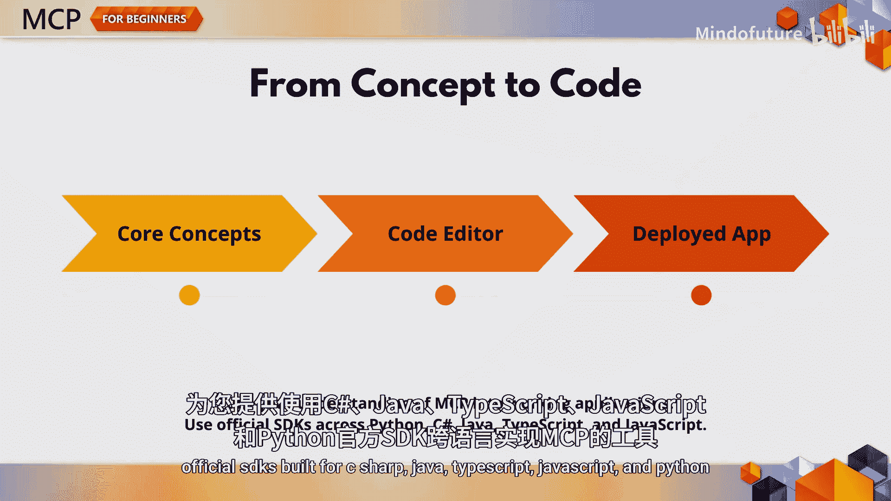
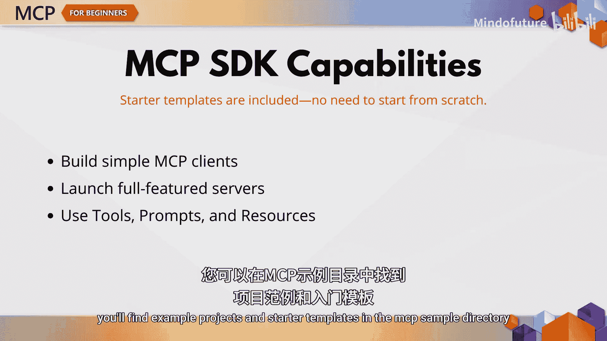
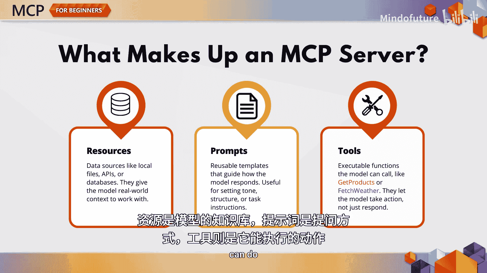
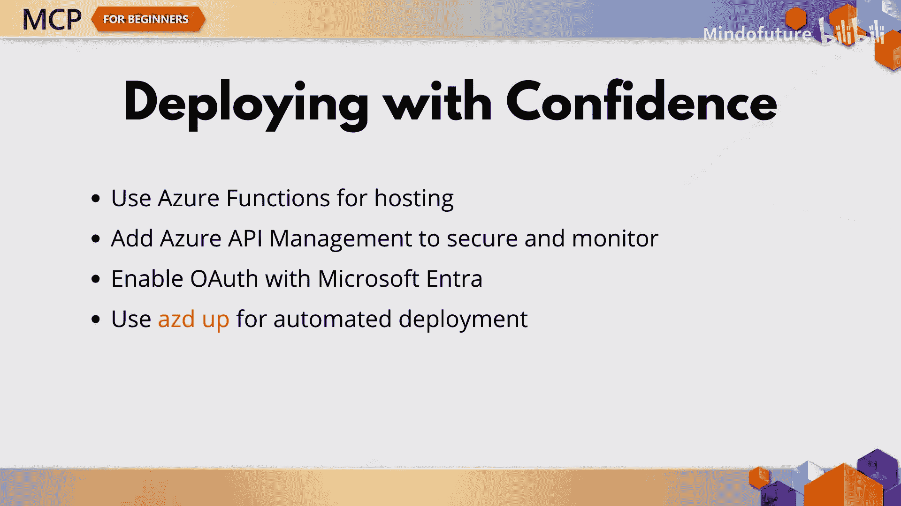
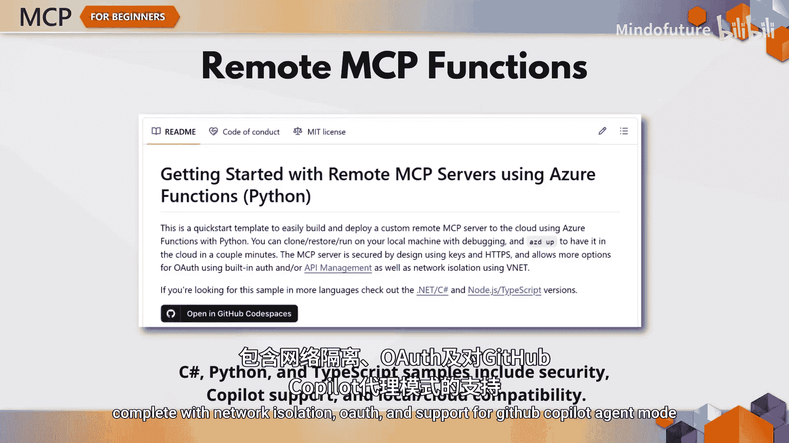
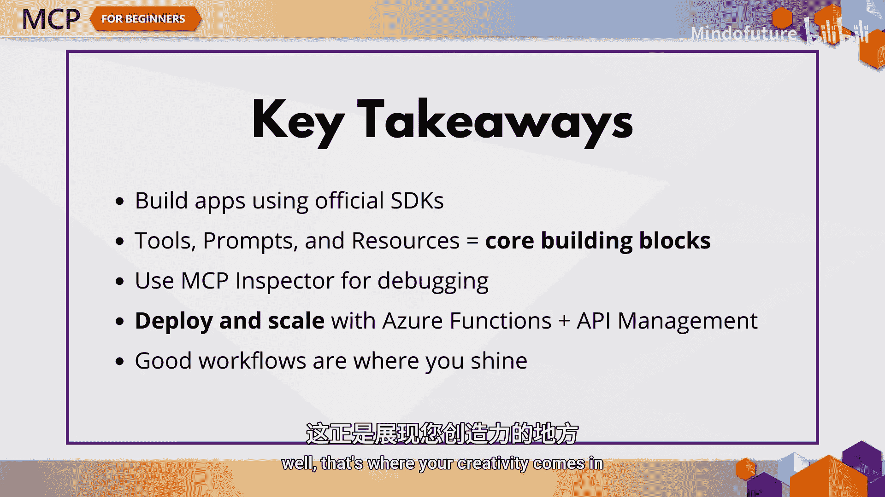

# 005：使用真实工具和工作流构建、测试、部署MCP应用程序

在本节课中，我们将学习如何将模型上下文协议的核心概念付诸实践。我们将探索如何在实际场景中构建、测试和部署MCP应用程序。无论你是希望将AI集成到工作流中的企业开发者，还是正在构建自己智能助手的个人开发者，本节内容都将提供实用的指导。

MCP的真正力量不仅在于理解其工作原理，更在于应用它。本章将弥合理论与实践之间的差距，为你提供在多编程语言中实现MCP的工具。

## 官方SDK与构建模块

上一节我们介绍了MCP的核心概念，本节中我们来看看如何利用官方工具进行开发。

MCP提供了针对多种编程语言的官方SDK，包括C#、Java、TypeScript、JavaScript和Python。每个SDK都提供了你所需的构建模块，例如简单的MCP客户端、功能齐全的服务器，以及对工具、提示词和资源等关键MCP特性的支持。

你可以在MCP示例目录中找到示例项目和入门模板，无需从零开始。

## MCP服务器的核心功能

现在，让我们谈谈你实际要构建的内容。每个MCP实现的核心都是服务器，服务器配备了三个核心功能：资源、提示词和工具。

以下是这三个核心功能的详细说明：

*   **资源**：提供上下文，例如文档、结构化数据或文件。可以将其视为模型所知道的内容。
*   **提示词**：塑造交互，通过模板或工作流引导模型。可以将其视为模型被提问的方式。
*   **工具**：让模型能够执行操作，例如调用函数、访问API或执行计算。可以将其视为模型能做的事情。

## 各语言SDK示例

MCP SDK仓库为你喜欢的语言提供了示例实现。

以下是各语言SDK的特点：

*   **C#**：包含基础和高级服务器设置，包括ASP.NET集成和工具模式。
*   **Java**：提供支持Spring框架的构建，包含响应式编程和类型安全的错误处理。
*   **JavaScript**：SDK同时支持Node.js和浏览器环境，内置WebSocket和流式传输支持。
*   **Python**：原生支持异步，可与FastAPI或Flask集成，并能自然地与机器学习工具结合。

## 测试、调试与部署

一旦你的服务器开始运行，下一步就是测试和调试。

**MCP Inspector** 是你检查服务器实时行为的首选工具。部署服务器后，只需通过API端点连接，列出可用工具并实时运行它们。它就像是你的智能体的实时控制台。

准备上线时，MCP服务器可以部署到Azure Functions上。更好的做法是，你可以在MCP服务器前添加Azure API管理，以处理速率限制和令牌授权、监控性能、平衡负载，并通过Microsoft Entra ID使用OAuth保护你的端点。

使用AZDU命令行工具，只需几条命令，你就可以自动部署所有内容，包括函数应用、API管理和所有依赖项。

如果你想知道是否可以在发布前进行本地测试，答案是肯定的。这些示例设计为既可在本地运行，也可在云端运行，因此你可以快速迭代，后续再扩展。

远程MCP函数示例展示了如何在C#、Python或TypeScript中实现安全、可用于生产的服务器，包括网络隔离、OAuth支持以及对GitHub Copilot代理模式的支持。

## 本章总结

在本节课中，我们一起学习了MCP应用的实践开发流程。

以下是几个关键要点：

*   官方SDK让你能够轻松使用你选择的语言构建MCP应用。
*   工具、提示词和资源是任何MCP服务器的构建模块。
*   MCP Inspector和Azure API管理帮助你测试和保护你的部署。
*   Azure Functions让你仅用几条CLI命令即可扩展你的解决方案。
*   设计优秀的工作流，这正是发挥你创造力的地方。

现在轮到你了。在本章的练习中，你需要勾勒出自己的工作流，选择所需的工具，并使用你选择的SDK实现其中一个工具。在下一章，我们将探索模型上下文协议实现中更高级的主题。