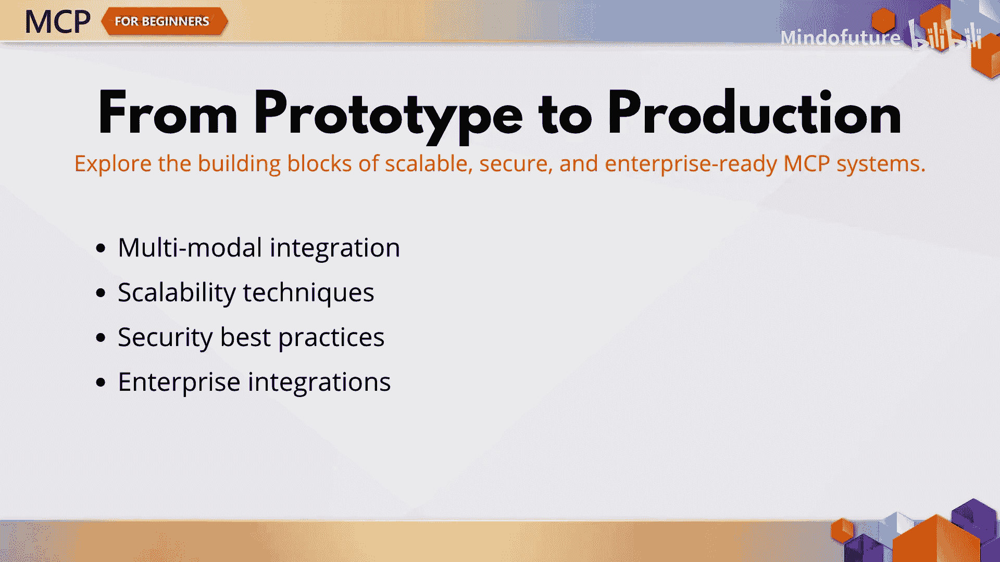
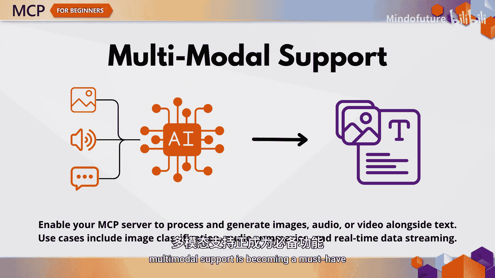
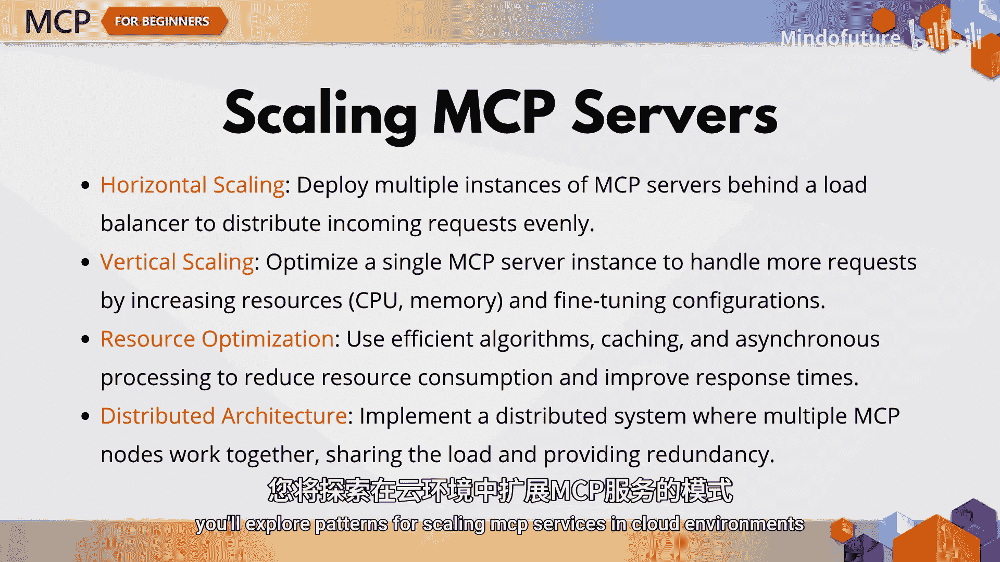
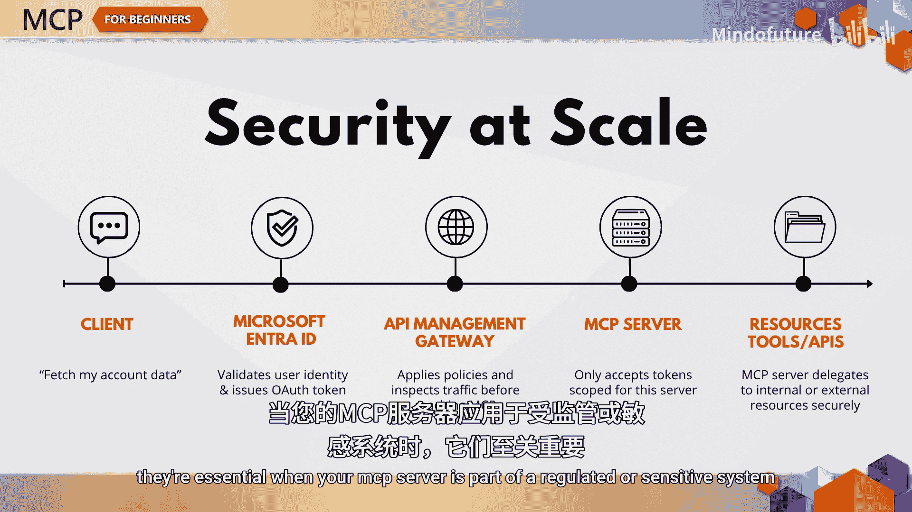
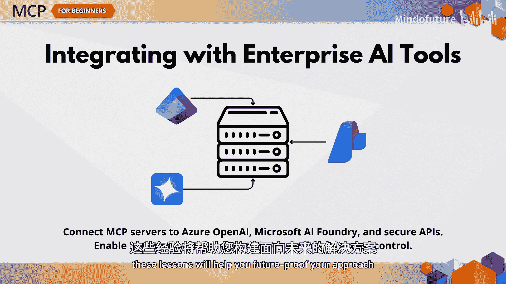
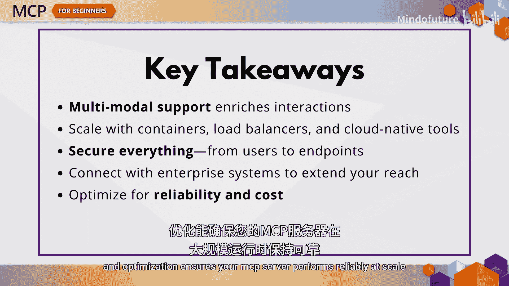

# 006：高级MCP - 安全、可扩展和多模态AI代理

在本章中，我们将学习如何将MCP项目提升至生产级别。我们将探讨多模态集成、可扩展性技术、安全最佳实践，以及如何与企业系统（如Azure和Microsoft AI Foundry）集成。这些知识对于构建能够在企业环境中大规模运行的健壮AI应用至关重要。

## 多模态能力集成 🖼️🎵

上一节我们介绍了MCP的基础，本节中我们来看看如何超越纯文本交互。当您希望MCP服务器能够理解图像、处理音频或生成视频摘要时，就需要集成多模态能力。

以下是多模态支持的核心价值：
*   实现更丰富的用户交互和更广泛的应用场景。
*   无论是集成SerERP API等工具，还是启用实时流式响应，多模态支持正成为必备功能。

## 构建可扩展的架构 📈

MCP服务器不仅用于本地测试，更需要部署在高需求环境中。这意味着您的架构必须支持水平扩展、容器编排和负载均衡策略。

以下是实现可扩展性的关键点：
*   探索在云环境中扩展MCP服务的模式。
*   学习如何针对性能和成本进行优化。

## 企业级安全实践 🔒

当然，随着规模的扩大，责任也随之而来，尤其是在保护MCP服务器安全方面。MCP协议本身内置了安全机制，但实际部署需要更多措施。

以下是本章涵盖的安全主题：
*   用于资源和授权服务器的OAuth 2.0流程。
*   保护端点并颁发安全令牌。
*   使用Microsoft Entra ID对用户进行身份验证。
*   与API管理层集成。

当您的MCP服务器是受监管或敏感系统的一部分时，这些不仅是建议，更是核心要求。

## 企业系统集成 🏢

企业集成是另一个重要主题。您将学习如何将MCP服务器与Azure OpenAI和Microsoft AI Foundry等企业级工具连接。

这些集成解锁了强大的功能：
*   工具编排。
*   实时网络搜索。
*   外部API连接。
*   强大的身份和访问管理。

如果您正在构建在企业生态系统中运行的智能体，这些课程将帮助您构建面向未来的方案。

## 实践与挑战 💻

本章包含大量实践示例，从路由和采样策略到实时流式传输，甚至与Azure容器应用集成。

如果您准备好迎接挑战，还有一个练习将引导您为特定用例设计一个企业级的MCP实现。这是应用所学所有知识的绝佳方式。

## 本章总结 📝

让我们总结一下本章的几个关键要点。

以下是构建高级MCP应用的核心收获：
*   **多模态MCP系统**允许更丰富的用户交互。
*   **可扩展性**需要周密的架构和资源管理。
*   在企业环境中，**安全性**不容忽视。
*   **企业集成**使MCP与现实世界的AI工作流程保持一致。
*   **优化**确保您的MCP服务器能够可靠地大规模运行。

本节课中我们一起学习了如何构建安全、可扩展且支持多模态的企业级MCP应用。无论您是在进行第一个企业项目，还是仅仅对MCP的可能性感到好奇，这些高级主题都将为您提供自信构建的工具。在下一章，我们将探讨如何参与MCP社区并为MCP生态系统做出贡献。