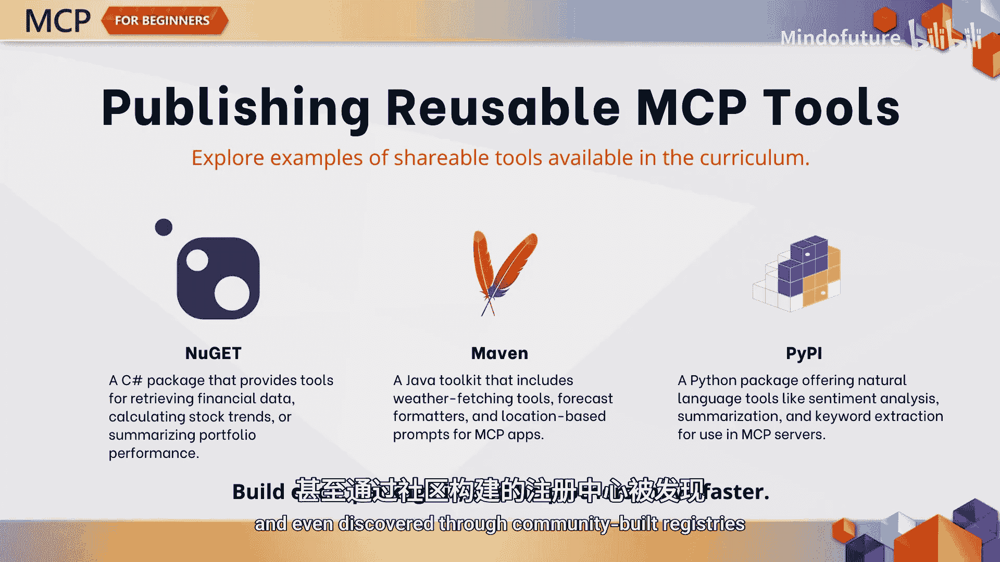
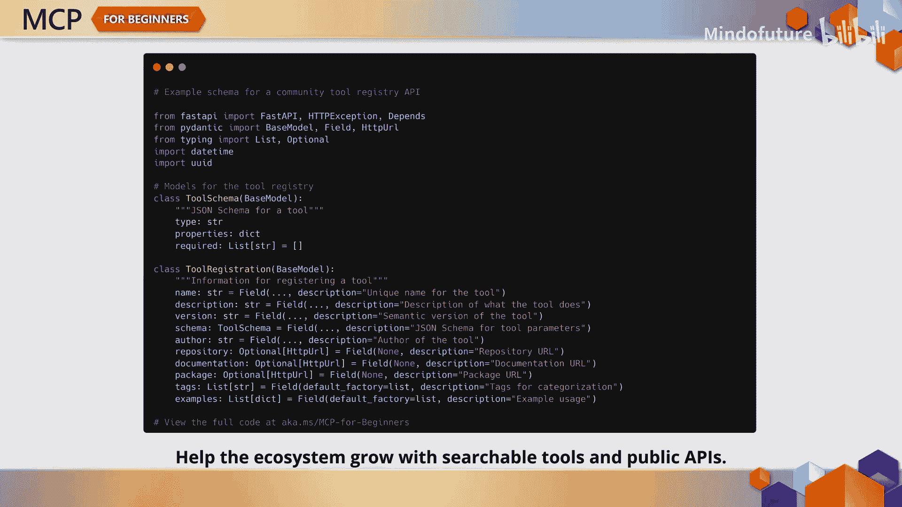
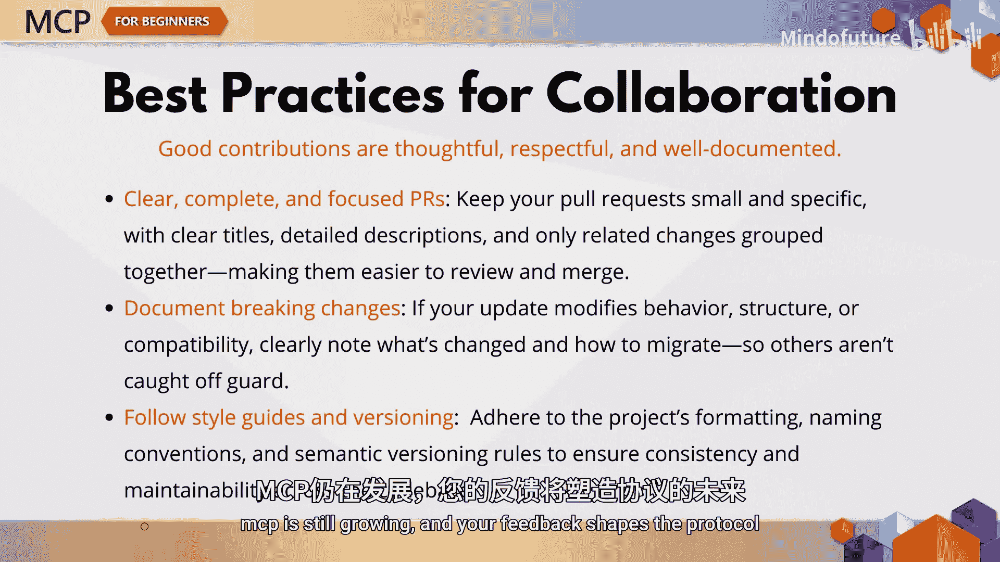

# 007：如何为MCP做出贡献

在本节课中，我们将要学习如何参与到Model Context Protocol的生态系统中。无论你是想修复第一个问题、分享自己的工具，还是成为核心贡献者，本章都将帮助你理解如何参与MCP社区，以及你的贡献为何重要。

MCP社区不仅仅是维护者和文档，它是一个由开发者、组织、工具构建者和用户共同组成的、不断壮大的网络。所有人都在共同努力，塑造智能应用程序如何与核心模型进行交互。在这个社区中，你会发现：
*   **核心协议维护者**：如微软等组织，负责演进协议规范。
*   **工具开发者**：创建可复用的软件包和实用程序。
*   **集成提供商**：使用MCP来增强自身平台的公司。
*   **终端用户**：构建由MCP驱动的应用程序的开发者。
*   **贡献者**：像你一样帮助改进生态系统的社区成员。

## 社区聚集地

上一节我们介绍了MCP社区的构成，本节中我们来看看社区聚集在哪些地方。官方社区主要活跃在以下几个关键平台：
*   **MCP GitHub组织**：这是核心的代码和协作中心。
*   **协议规范网站**：查阅官方文档和标准的地方。
*   **GitHub讨论区、议题和拉取请求**：进行具体问题讨论和代码贡献的场所。

此外，还有许多社区驱动的渠道，例如教程、博客文章、特定语言的SDK和开放论坛。如果你想分享见解或寻找合作者，这些都是很好的起点。

## 贡献的多种方式

了解了社区在哪里之后，你可能会问：具体如何为MCP做贡献呢？你不需要为了第一次尝试就编写一个全新的协议扩展。贡献有多种形式，无论是贡献文档、回答社区问题，还是修复漏洞。以下是几种常见的贡献路径：

*   **贡献核心协议代码**：例如，在C#中添加对二进制数据流的支持。这可能意味着定义新的接口、处理流元数据，并以一致且可测试的方式返回结果。
*   **提升后端可靠性**：例如，修复Java验证器中的一个错误，或改进嵌套模式的处理方式。
*   **构建实用工具**：如果你喜欢构建工具，Python是一个很好的起点。例如，可以创建一个类似`CSV Pro`的工具，它能根据模型的请求来过滤、转换和汇总数据。
*   **非代码类贡献**：即使你不是软件工程师也没关系。一些最有价值的贡献是文档、教程、翻译和测试。创建示例应用程序或改进错误信息，都能帮助整个社区成长。

## 创建并分享你的工具

假设你有一个很棒的工具创意，无论是获取股票报价、翻译文本还是获取天气预报，你都可以创建一个可复用的MCP工具。将其打包供他人使用，然后发布到软件包注册表，就像处理任何其他开源库一样。

以下是几种可能的实现方式：
*   在 **.NET** 中，可能是一个NuGet包，例如 `MCP.FinanceTools`。
*   在 **Java** 中，可能是一个Maven构件，例如 `MCP.WeatherTools`。
*   在 **Python** 中，可能是一个PyPI包，例如 `MCP.NLPTools`。

每个工具都定义了其名称、参数、模式和行为，并且可以被注册、复用，甚至通过社区构建的注册中心被发现。

## 构建社区基础设施

说到注册中心，想象一下为社区贡献一个完整的服务来帮助大家发现工具。这个基于FastAPI的MCP工具注册中心就是一个例子，展示了开发者们如何围绕协议构建基础设施，而不仅仅是在协议内部进行开发。

## 优秀贡献的准则

那么，什么样的贡献是好的贡献呢？它始于从小处着手：修复一个拼写错误、编写一个测试、回答一个GitHub讨论区的问题。在此基础上，遵循项目的风格指南，记录你的更改，并提交专注的拉取请求。

请记住，协作不仅仅是关于代码，更是关于沟通。无论你是开启一个拉取请求还是评审他人的请求，都应优先考虑清晰性、正确性和完整性。仔细考虑版本兼容性，并且**始终**记录破坏性变更。MCP仍在不断发展，你的反馈将塑造这个协议。

## 总结与行动号召

事实上，任何人都可以为MCP做出贡献，而当你这样做时，每个人都会受益。如果你已准备好留下自己的印记，请前往GitHub仓库，探索开放的议题，并找到一种既符合你的技能又符合你兴趣的参与方式。

在本节课中，我们一起学习了如何参与到MCP社区，了解了社区的构成、聚集地以及多种贡献方式，从代码开发到文档撰写。我们还探讨了如何创建和分享自己的工具，以及优秀贡献者应遵循的准则。MCP是一个充满活力的生态系统，你的参与对其成长至关重要。