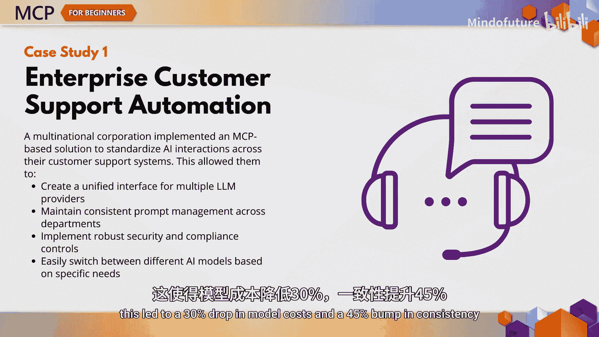
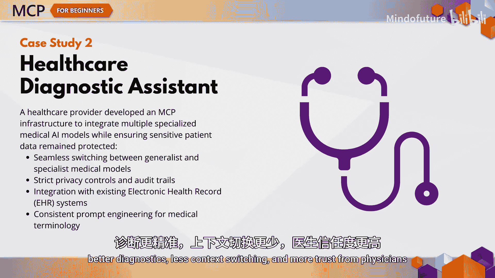
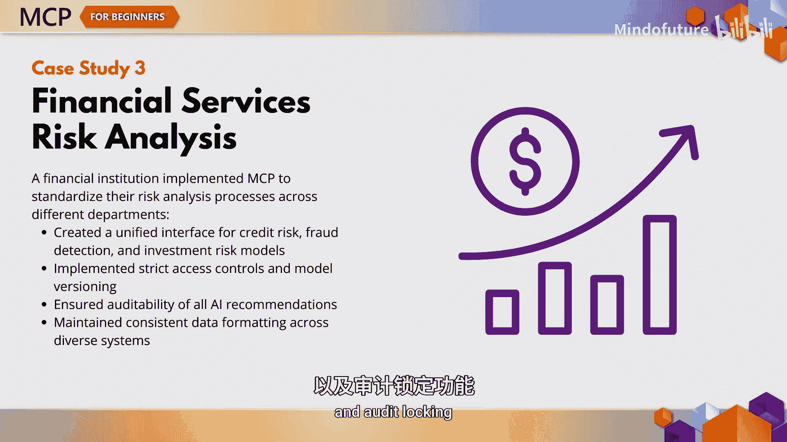
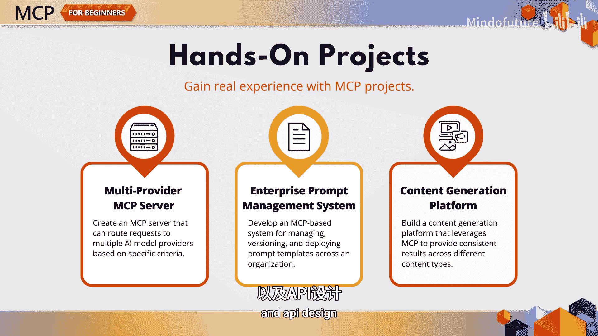
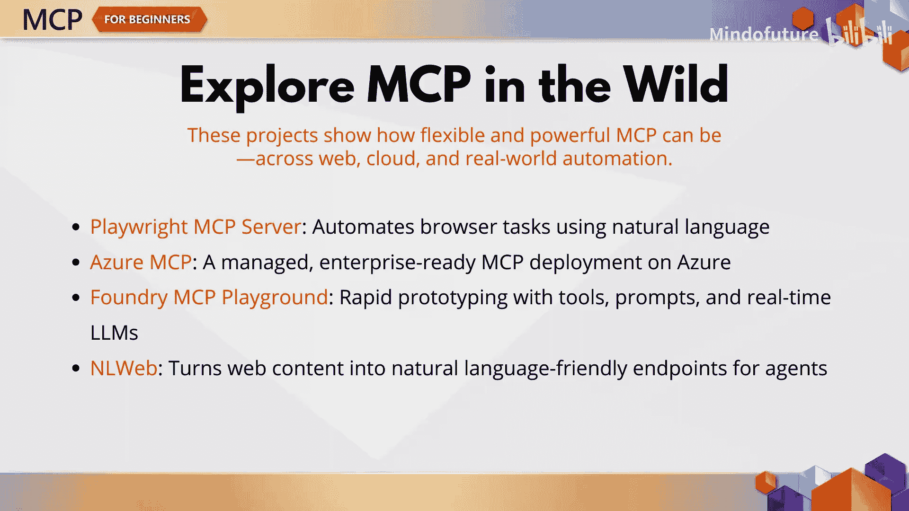

# 008：MCP早期采用者的经验教训 📖

在本章节中，我们将探讨早期采用者如何在现实世界中使用模型上下文协议。这已不仅仅是理论，MCP正在帮助解决金融、医疗保健、企业自动化乃至浏览器自动化等领域的实际问题。让我们一同了解那些将MCP投入生产的先行者们所获得的经验。

## 概述

在本节课中，我们将学习MCP协议在多个行业中的实际应用案例，了解其带来的具体效益。我们还将介绍几个可供动手实践的项目，并展望MCP的未来发展趋势。

## MCP的实际应用案例

上一节我们了解了MCP的基本概念，本节中我们来看看它在真实场景中如何发挥作用。从客户支持机器人到诊断辅助，企业正在使用MCP来标准化AI模型、工具和数据之间的协作方式。MCP创建了一个统一的接口，可以连接多个语言模型，统一安全策略，并在复杂系统中保持行为的一致性。

以下是几个具体的案例研究：

*   **全球企业的客户支持**：一家全球性企业使用MCP统一了其客户支持体验。他们构建了一个基于Python的MCP服务器来处理支持请求，该服务器具备资源注册、提示词管理和工单工具等功能。结果是：创建了连接多个LLM的单一接口、集中化的提示词模板以及强大的安全控制。这带来了**模型成本降低30%** 和**一致性提升45%** 的效果。
*   **医疗保健领域的诊断辅助**：一家医疗服务提供商利用MCP整合了通用模型和专科模型，同时完全符合HIPAA合规要求。他们使用一个C# MCP客户端，实施了严格的加密、审计以及与电子健康记录系统的无缝集成。结果是：获得了更好的诊断效果、减少了上下文切换，并赢得了医生更多的信任。
*   **金融机构的风险模型标准化**：一家金融机构使用MCP来标准化跨部门的风险模型。他们基于Java构建的服务器具备SOC合规的访问控制、版本控制、PII信息脱敏和审计日志功能。他们见证了**模型部署周期缩短了40%**。

## 动手实践项目

如果你在想：“很酷，但我该如何构建一个这样的系统呢？”不用担心，我们为你准备了一些可以立即尝试的实践项目。

以下是三个可以让你亲自动手体验MCP的途径：

1.  **多提供商MCP服务器**：构建一个根据元数据将请求路由到不同模型提供商的服务器。可以设想将OpenAI、Anthropic和本地模型全部整合在一个屋檐下。
2.  **企业提示词管理**：设计一个系统，用于在组织范围内对提示词模板进行版本控制、审批和部署。
3.  **内容生成平台**：使用MCP来生成风格一致的博客、社交媒体帖子和营销内容，并附带跟踪和审核工作流。

这些项目中的每一个都将教你关键的MCP技能，从路由逻辑、缓存到提示词版本控制和API设计。

## MCP的未来趋势

MCP正在快速发展，以下是它未来的方向：

*   **多模态支持**：支持图像、音频和视频。
*   **联邦式基础设施**：用于安全地共享模型。
*   **边缘计算支持**：以及用于模板和工具的市场。

这些趋势正在塑造MCP的未来，它将为从微型物联网设备到企业AI市场的所有领域提供动力。

## 开源项目与工具

有一个不断增长的开源项目列表可供探索：

*   **Playwright MCP Server**：让AI智能体能够控制浏览器。
*   **Azure MCP**：一个完全托管的企业级MCP服务器。
*   **Foundry MCP Playground**：非常适合原型设计和实验。
*   **NLweb**：这类工具可以将网站转化为AI助手的自然语言端点。

每一个项目都从不同角度展示了MCP的能力，以及它如何被用来推动创新。

## 总结

本节课中，我们一起学习了MCP早期采用者的实践经验。他们证明MCP不仅仅是一个协议，更是构建可扩展、安全且一致的AI系统的基础。如果你正在基于大语言模型进行构建，无需重复造轮子。MCP为你提供了正确的结构，而现在你也看到了其他人是如何做到这一点的。