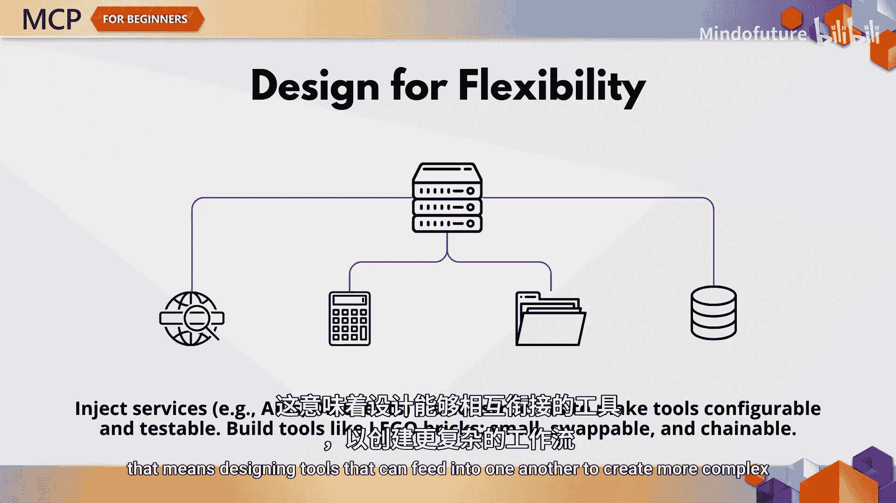
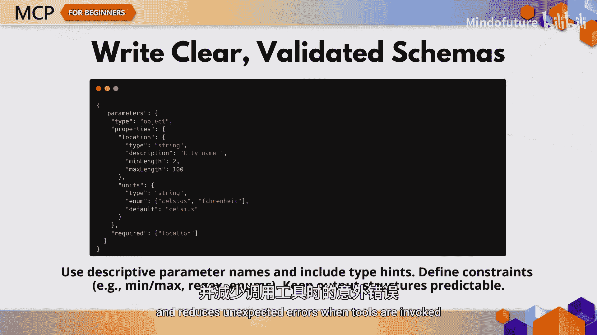
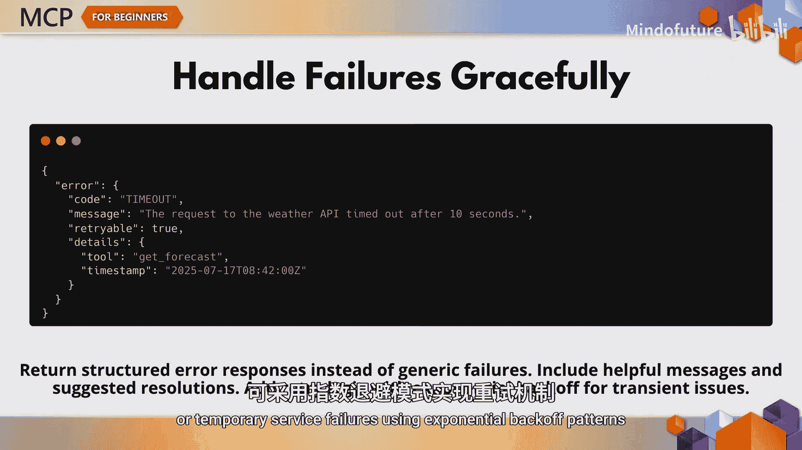
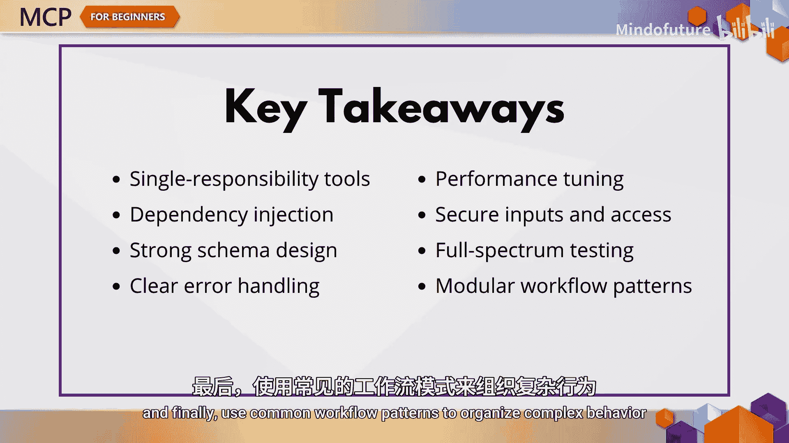

# 009：MCP开发最佳实践 🏗️

在本章节中，我们将探讨构建健壮、可扩展且可维护的MCP服务器的最佳实践。无论你是创建工具还是部署到生产环境，这些实践都能帮助你确保你的实现是可靠、安全且易于长期维护的。

## 架构设计原则

上一节我们介绍了MCP的基本概念，本节中我们来看看构建服务器时应该遵循的核心架构原则。

**单一职责原则**是其中最重要的原则之一。每个工具应专注于做好一件事。这能使你的代码更清晰、API更可预测，并且工具更易于测试和维护。

例如，与其创建一个试图处理天气预报、警报、历史记录等所有功能的“巨型”工具，不如将其拆分为多个专注的小型组件。这使你的工具更具模块化，并能跨工作流复用。

接下来，优先考虑**依赖注入**。工具应通过其构造函数接收服务，如数据库客户端、API或缓存。这使它们更易于测试，并能针对不同环境进行配置。

你还需要让你的工具具有**可组合性**。这意味着设计能够相互连接以创建更复杂工作流的工具，将它们视为服务器构建的“乐高积木”。

## 清晰的模式定义

一个设计良好的模式对于模型和用户都大有裨益。

以下是定义模式时的关键点：
*   始终为参数提供清晰的描述。
*   定义约束，如最小/最大值或允许的格式。
*   保持返回结构的一致性。

这有助于模型理解如何正确使用工具，并减少调用工具时出现意外错误的可能性。

## 错误处理

错误处理需要深思熟虑并分层进行。

在适当的层级捕获异常，并提供带有有意义错误信息的结构化响应。避免在第一个问题出现时就崩溃。清晰地说明出了什么问题，最好还能说明如何修复。

对于超时或临时服务故障等暂时性问题，你可以使用指数退避模式实现重试逻辑。

## 性能优化

性能在生产环境中至关重要。

使用缓存来避免重复的昂贵操作。对于输入/输出密集型任务，采用异步模式。对工具使用进行节流，以防止系统过载。这对于调用外部API或处理大型数据集的工具尤其关键。一点优化就能带来很大改善。

## 安全性

安全性不容妥协。

验证所有输入。检查空字符串，强制长度限制，并防范注入攻击。确保用户在访问受保护资源之前已获得授权。如果一个工具可能暴露敏感数据，默认情况下应进行脱敏处理，除非用户明确请求且已获得授权。

## 测试策略

现在，让我们谈谈测试。每个MCP服务器都应包含以下测试：

以下是推荐的测试类型：
*   针对每个工具和资源处理程序的**单元测试**。
*   针对完整请求-响应生命周期的**集成测试**。
*   模拟真实模型到工具工作流的**端到端测试**。
*   评估服务器在负载下行为的**性能测试**。

不要只测试“快乐路径”，还要测试边界情况、错误场景、速率限制等。

## 设计模式

在设计工具时，可以借鉴一些成熟的模式。

以下是几种有用的设计模式：
*   **工具链**：一个工具的输出作为下一个工具的输入。
*   **分发器**：将请求路由到专门的工具。
*   **并行处理**：同时运行多个工具以提高速度。
*   **错误恢复**：在主工具失败时尝试备用方案。
*   **组合**：将较小的工作流组合成更大的工作流。

这些模式增加了灵活性，帮助你构建能够优雅扩展和恢复的工作流。

## 总结

本节课中我们一起学习了MCP开发的核心最佳实践。让我们回顾一下要点：
*   设计每个工具时，遵循单一、专注的职责。
*   使用依赖注入来提高可测试性。
*   编写具有强验证的清晰模式。
*   优雅地处理错误并记录有意义的信息。
*   通过缓存、异步模式和节流来优化性能。
*   通过严格的验证和授权来保护你的工具。
*   进行所有层级的测试：单元、集成、端到端和负载测试。
*   最后，使用常见的工作流模式来组织复杂的行为。

正如你所看到的，遵循MCP最佳实践意味着需要从架构、安全性、性能、测试和用户体验等方面进行整体思考。在下一章，我们将探索真实世界的案例研究，展示MCP在各种企业场景中的实际应用。我们下章见。