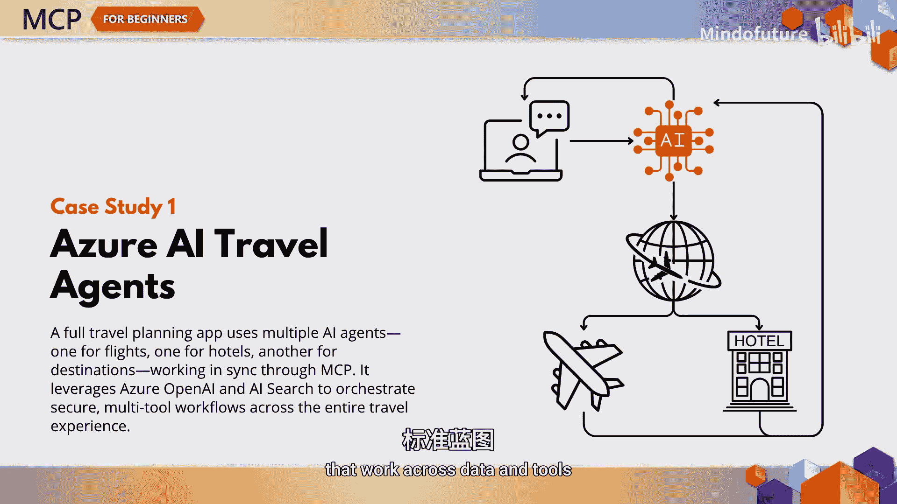
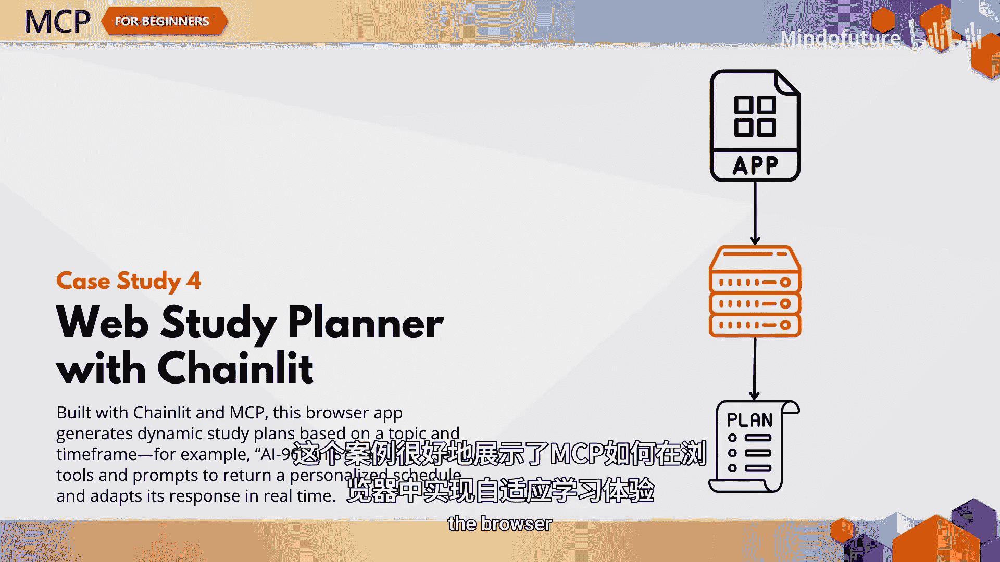
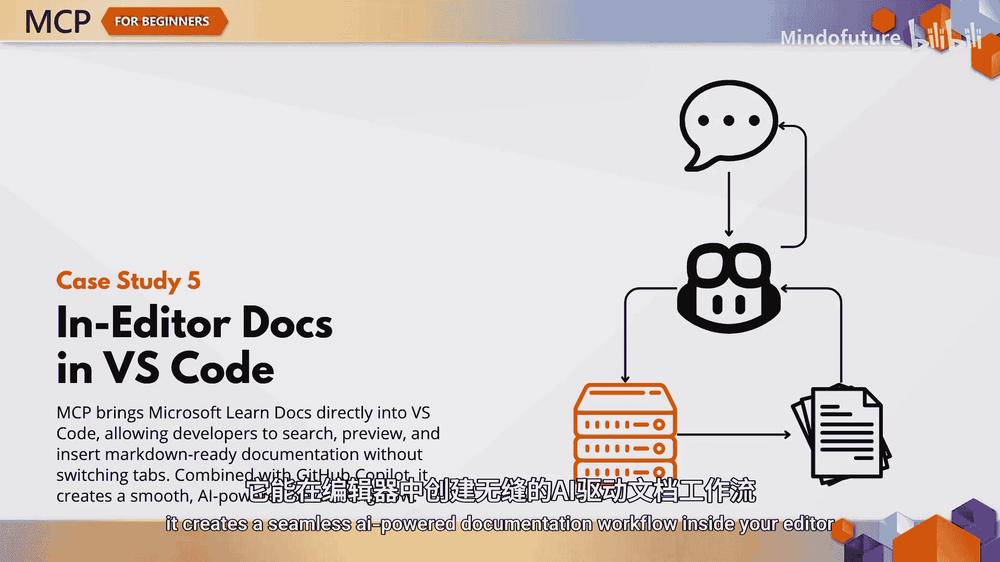
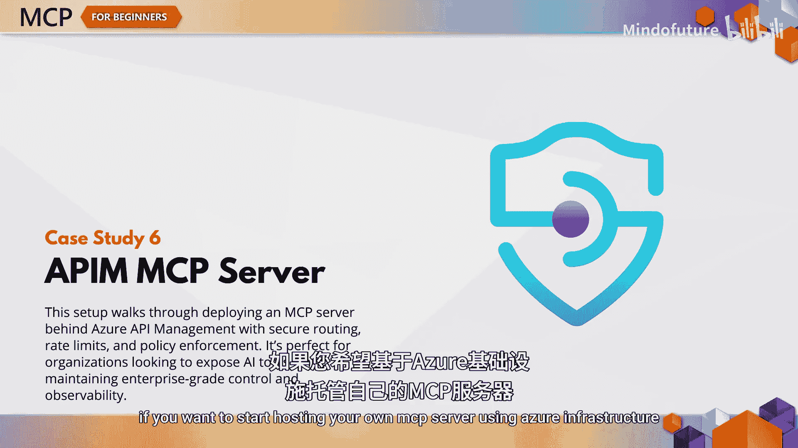
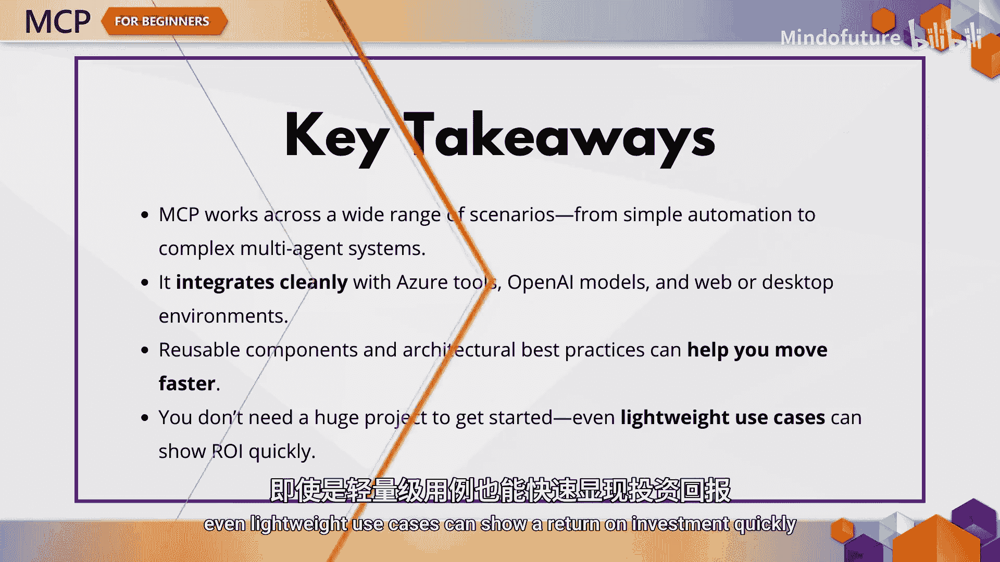

# 010：实际应用-真实世界案例研究 🧪

在本章中，我们将探讨一些不同的内容。我们不会引入新的概念或图表，而是将深入探究当MCP协议真正投入使用时会发生什么。本章汇集了多个真实世界的案例研究，旨在展示模型上下文协议在企业环境中的多功能性和强大能力。

那么，为什么要研究案例呢？因为理论只能带你走这么远。一旦你理解了MCP的基础知识，看看其他团队如何应用这些原则、解决实际业务问题、简化工作流程以及将AI连接到现实世界，将非常有帮助。

## Azure AI旅行助手参考实现 ✈️

让我们从Azure AI旅行助手参考实现开始。这个案例完全关于多智能体编排。它是一个完整的旅行规划应用程序，其中每个AI智能体扮演特定角色，例如搜索目的地、比较航班和推荐酒店。它结合了Azure OpenAI、Azure AI搜索和MCP，以创建一个安全、可扩展且企业级的体验。你可以将此视为构建跨数据和工具协同工作的协调AI系统的蓝图。

## 工作流自动化场景 🔄

接下来是一个工作流自动化场景：根据YouTube数据更新Azure DevOps工作项。这听起来简单，但功能强大。通过使用MCP，此设置可以从视频中提取元数据，并自动更新Azure DevOps中的工作项。关键启示是：即使是轻量级的MCP实现，也能消除重复性任务，并确保跨平台的数据一致性。

## 通过终端访问实时文档 📖

实时文档检索示例展示了Python客户端如何连接到MCP服务器，以在控制台中实时流式传输相关的Microsoft文档。这对于偏爱命令行、并希望在不离开开发环境的情况下获得上下文答案的开发者来说非常棒。

## 交互式Web学习计划器 📚

现在来看一个交互式案例：一个由Chainlit和MCP驱动的基于Web的学习计划器。用户输入一个主题和时间范围，例如“AI-900认证，八周内”，应用程序会实时构建个性化的每周学习计划，并提供对话式响应。这是一个很好的例子，展示了MCP如何在浏览器中实现自适应学习体验。

## VS Code编辑器内文档集成 💻

如果你是VS Code用户，你会喜欢这个案例。编辑器内文档案例研究展示了MCP如何将Microsoft Learn文档直接带入你的代码编辑器。你无需切换标签页，即可搜索、引用文档并将其插入Markdown。当与GitHub Copilot配对使用时，它能在你的编辑器内创建一个无缝的AI驱动文档工作流。

## API管理MCP服务器演练 🛠️

最后是API管理MCP服务器演练。这个案例研究展示了如何使用Azure API管理来构建和配置一个MCP服务器。你将看到如何将API作为MCP工具公开、设置速率限制、应用策略，甚至直接从VS Code测试你的设置。如果你想开始使用Azure基础设施托管自己的MCP服务器，这是一个很好的切入点。

## 案例总结与关键启示 🎯

那么，所有这些例子有什么共同点呢？它们证明了MCP不仅仅是一个框架，更是一个用于构建真实、可扩展AI解决方案的工具包。无论你是在创建多智能体旅行助手，还是将文档流式传输到你的终端，MCP都是连接你的模型、数据和工具的纽带。

这些案例研究旨在启发你，并帮助你识别可以应用于自己项目的模式。以下是关键启示：

*   MCP适用于广泛的场景，从简单的自动化到复杂的多智能体系统。
*   它能与Azure工具、OpenAI模型以及Web或桌面环境无缝集成。
*   可重用组件和架构最佳实践可以帮助你更快地推进项目。
*   最后，你不需要一个庞大的项目就可以开始，即使是轻量级的用例也能快速显示出投资回报。

## 本章总结

好了，既然你已经看到了MCP在现实世界中的应用，是时候再次动手实践了。下一章将向你介绍一个由四部分组成的实验，该实验将提供动手练习，指导你使用AI工具包将智能体连接到现有的或自定义的MCP服务器。我们下一章见。

在本节课中，我们一起学习了MCP协议在多个真实场景下的应用案例，包括多智能体编排、工作流自动化、文档检索、交互式Web应用、IDE集成以及服务器构建。这些案例展示了MCP如何作为连接AI模型、数据和工具的通用桥梁，为解决实际问题提供了强大而灵活的解决方案。