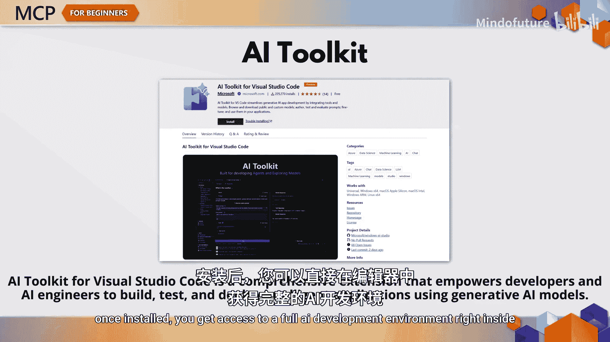
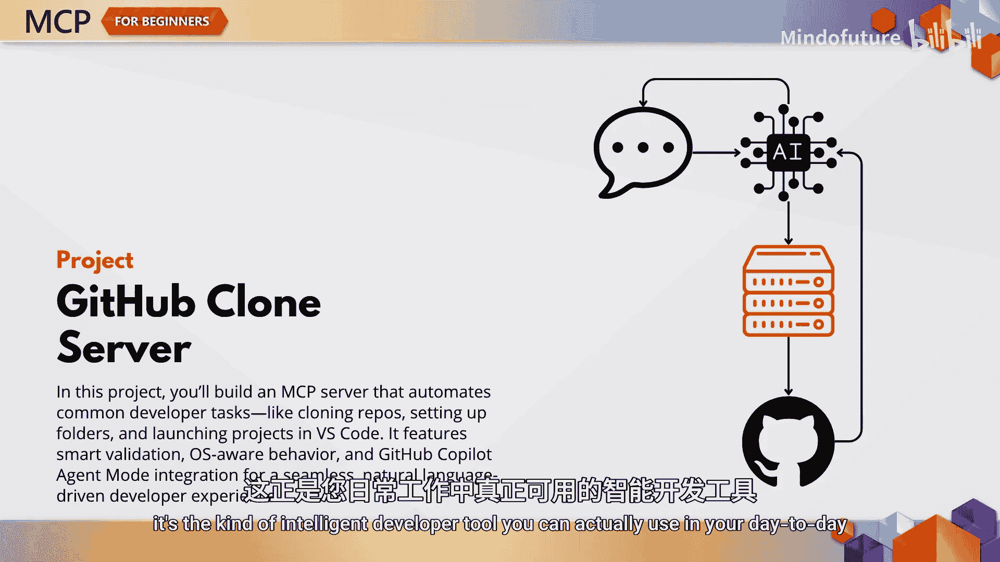

# 011：在VS Code中构建AI代理 - 4个结合MCP与AI工具包的实践实验

在本节课中，我们将学习如何在Visual Studio Code中，利用AI工具包扩展和模型上下文协议（MCP）来构建功能强大的AI代理。我们将通过四个循序渐进的模块，从熟悉工具到开发自定义MCP服务器，最终实现一个实用的自动化项目。

## 模块一：熟悉VS Code中的AI工具包扩展 🛠️

上一节我们介绍了课程概览，本节中我们来看看第一个模块。模块一的目标是让您熟悉VS Code中的AI工具包扩展。安装此扩展后，您可以直接在编辑器内访问一个完整的AI开发环境。

以下是您将开始探索的核心功能：

*   **模型目录**：您可以浏览超过100个模型，从OpenAI到GitHub托管的模型。无论是创意写作、代码生成还是数据分析，都有适合各种用例的模型。
*   **Playground**：这是您测试提示词和调整参数的地方。您可以修改如`temperature`、`Max tokens`和`top P`等参数，这有助于您理解不同模型的行为。
*   **代理构建器**：您将使用代理构建器来创建自己的自定义代理。您可以定义其角色、个性、参数，甚至是它可以使用的工具。

## 模块二：引入模型上下文协议（MCP） 🔌

掌握了基础知识后，模块二将引入模型上下文协议。您可以将MCP视为AI领域的“USB-C”接口。MCP允许您以标准化的方式将您的代理连接到外部工具和服务。

您将动手实践微软自己的MCP服务器生态系统，其中包括与Azure、Dataverse、Playwright等的集成。本模块的亮点是，您将构建一个由Playwright MCP服务器驱动的浏览器自动化代理。

以下是该代理可以执行的操作：

*   打开网页
*   点击按钮
*   提取内容
*   截取屏幕截图
*   仅通过描述您希望它做什么，就能运行完整的测试流程

您将直接从代理构建器中配置所有这些功能，从MCP目录中选择Playwright，分配工具能力，并设计驱动Web自动化任务的智能提示词。

## 模块三：开发自定义MCP服务器 🧑‍💻

现在您的代理已经可以使用外部工具，是时候提升一个等级了。模块三将深入探讨自定义MCP服务器开发的细节。

在模块三中，您将使用AI工具包的Python模板，从零开始构建自己的MCP服务器。您的项目是一个天气MCP服务器，它可以响应自然语言问题，例如“西雅图的天气怎么样？”。

以下是您将学习的关键开发步骤：

*   使用最新的MCP SDK。
*   使用MCP检查器配置高级调试。
*   在VS Code中让您的服务器与代理一起实时运行。
*   学习如何构建一个MCP服务器项目。
*   升级依赖项。
*   设置启动配置和后台任务。
*   使用代理构建器和检查器测试您的服务器。

这是一个专业级的开发工作流程，为您创建和调试代理可能需要的任何类型的自定义工具做好准备。

## 模块四：综合实践 - 构建GitHub克隆MCP服务器 🚀

最后，在模块四中，我们将通过一个真实世界的用例将所有知识融会贯通。您将构建一个GitHub克隆MCP服务器，它自动化了开发者经常需要手动执行的步骤。

这个项目包含以下特性：

*   **智能验证和错误处理**：确保操作的可靠性。
*   **操作系统逻辑**：用于启动VS Code或VS Code Insiders。
*   **与GitHub协作和代理模式的集成**：提升团队协作效率。
*   **完全通过自然语言提示驱动的简洁用户体验**：这是您在日常工作中真正可以使用的智能开发工具。

## 总结

本节课中，我们一起学习了如何利用VS Code的AI工具包和MCP协议构建智能代理。通过四个模块的实践，您从安装AI工具包开始，最终能够构建可用于生产环境的MCP服务器，从而使您的代理真正变得强大。我们期待看到您的创作成果。