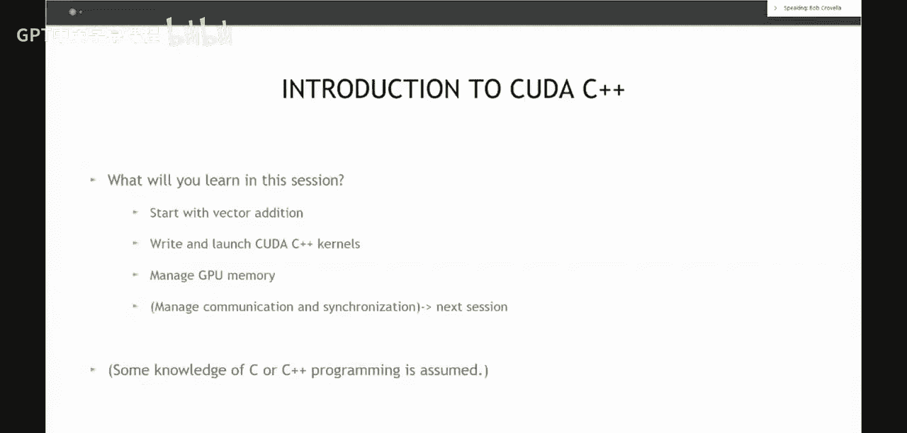

# 001：CUDA C++基础

## 概述

在本节课中，我们将开始学习如何编写语法正确的CUDA程序，并确保程序能给出正确的结果。这是任何编程学习的第一步，之后我们才会关注性能优化。

## 课程介绍

我是来自NVIDIA的Bob Corvello，是一名解决方案架构师。我的同事Robbie Srs（来自橡树岭国家实验室）和Max Cats（来自劳伦斯伯克利国家实验室）也参与了本次课程。

感谢橡树岭和伯克利实验室主办本次活动，并提供所有必要的技术支持。本系列课程计划包含九个模块，每个模块时长约一小时，并配有课后练习来巩固所学知识。

本系列课程的目标是为您提供一个广泛而基础的CUDA编程入门。CUDA编程是我们访问GPU进行通用计算或加速工作流程的方法之一。

需要说明的是，仅凭今天这一小时的课程，您可能无法完全掌握CUDA。完整的入门至少需要前三个模块的内容。

前三个模块将涵盖必要的语法和理解，使您能够编写语法正确且结果准确的CUDA程序。第三个模块将同时向您介绍GPU架构，并从中引出两个最重要的优化概念，帮助您编写能在GPU上高效运行的代码。

其余模块将更具专题性，涵盖特定主题以扩展您作为CUDA程序员的能力。我们强烈建议您参加前三个模块，以获得最连贯的CUDA编程入门。所有课程材料将被录制并提供，方便您补课或复习。

## 课后练习

每个模块都配有大约三个课后练习，旨在花费约一小时完成。这些练习可以在橡树岭或伯克利实验室的GPU加速集群上完成。练习的目的首先是巩固课堂所学知识，其次也会引入和扩展新的概念。

例如，今天的练习将巩固今天学到的概念，同时也会引入一些新概念，如**CUDA错误检查**。错误检查是学习CUDA编程旅程中非常重要但常被忽视的一部分，CUDA运行时提供的错误线索能帮助您快速定位问题。另一个例子是，今天的课程主要讨论一维处理，而练习会将部分概念扩展到二维，从而扩展您的知识。

我们鼓励您完成课后练习，相关材料已在GitHub上提供。

## 提问与答疑

在课程中如有疑问，您可以使用现场麦克风提问，或通过聊天功能留言。我会在讲解过程中适时暂停，查看并回答聊天区的问题。如果未能及时回答，我的同事Robert Crs和Max Cats也会提供帮助。

## 进入正题：CUDA C++ 基础

明确了目标后，让我们开始今天的学习。我们的目标是启动教学过程，教会您如何编写语法正确并能给出正确答案的CUDA程序。我认为，在理解如何确保代码正确之前，过分关注性能是没有太大意义的。

因此，今天我们将本着相对简单的原则介绍CUDA编程，重点学习语法和如何编写语法正确的程序。

## 什么是CUDA？

“CUDA”是一个含义丰富的术语。在NVIDIA，我们在多种不同场景下使用它。

*   **架构**：CUDA代表“统一计算设备架构”。这个术语是在2006-2007年间，我们向世界推出可编程通用GPU计算能力时创造的。我们当时做出的一个重要决定是标准化此架构，要求此后我们开发和制造的所有GPU都使用完全相同的可编程架构来提供GPU加速环境下的通用计算能力。
*   **编程环境**：我们也用CUDA来指代编程环境本身。
*   **工具包**：CUDA工具包是一个软件集合，您可以下载它来设置开发环境或运行CUDA程序。

## CUDA C++

今天我们将重点学习**CUDA C++**。虽然名义上是C++，但众所周知C++包含了C的许多特性，因此这两种语言有相当大的重叠。CUDA正式宣称符合某个有文档记录的C++标准。

在您的GPU学习之旅中，您可能还会遇到其他内容，例如CUDA Fortran、CUDA Python等，我将其统称为**语言绑定**。CUDA C/C++并非进入GPU编程的唯一途径，您同样可以从Python或Fortran等其他语言绑定开始。

然而，第一个推出的语言绑定就是C/C++绑定，它至今仍是我们向世界展示GPU可编程能力的核心。许多其他语言绑定本质上都是构建在CUDA C++所建立的架构和底层机制之上的。

因此，您今天学到的概念是普适且相关的。即使您决定未来的学习主要使用Python、Fortran或其他语言，这些知识依然有用。

## 总结

本节课我们一起了解了CUDA入门系列课程的整体安排、课后练习的重要性，并初步认识了CUDA的多重含义以及CUDA C++作为核心语言绑定的地位。下一节，我们将开始学习具体的CUDA C++编程语法。