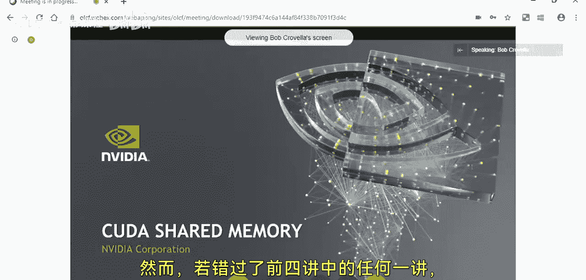
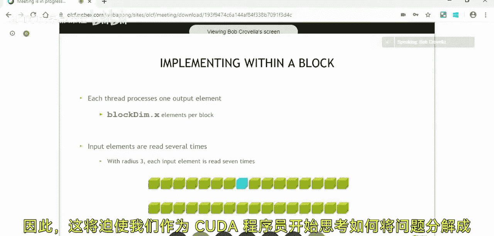

# 002：CUDA共享内存

## 概述

在本节课中，我们将学习CUDA编程中的线程协作与通信，特别是共享内存的使用。我们将通过一个名为“一维模板”的示例问题，来探索如何让线程在同一个线程块内高效地共享数据，并实现同步操作。

上一节我们介绍了CUDA的基本概念，如主机与设备、内核启动以及内存管理。本节中，我们将看看如何让线程之间进行协作。

## 课程内容

大家好，我是来自ULCF的Tom Papicuttor。今天，我们邀请到了英伟达的Bob Corbella来进行讲解。这是九部分CUDA培训系列的第二部分。

现场有来自橡树岭国家实验室的参与者，也有来自英伟达加州办公室的参与者，还有通过Webex远程加入的朋友。请大家在提问时说明自己所在的平台。

Bob在讲解过程中会定期暂停以回答问题。报告结束后，我们将进入实践环节。现场参与者可以获得帮助，远程参与者也可以通过Webex获得支持。实践练习和Bob的幻灯片都可以在课程注册页面找到。

由于第一节课的内容已在线发布，我将跳过大部分开场白。但我要感谢我的同事，以及橡树岭国家实验室和NurRS提供的所有支持和后勤保障。

如果你听了上个月的课程，就会知道前几节课的内容是紧密相连的。我建议尽可能跟上前三四节课，因为它们是CUDA编程的基础。随后的课程会更专题化。如果错过了前四节中的任何一节，可能会遗漏重要的基础知识。

希望你已经有机会学习了上个月的第一节课。在那节课中，我们通过一个“向量加法”的示例问题，介绍了多种概念。

我们学习了“主机”和“设备”的术语。我们学习了 `__global__` 关键字。主机和设备的术语实际上存在于CUDA语法中，用于泛指在CPU（主机）或GPU（设备）上进行的活动。`__global__` 关键字用于标识一个内核函数，这是我们作为CUDA程序员编写并启动在GPU上运行的代码的方式。

我们还学习了如何向运行的内核传递参数，特别是如何在GPU上进行内存管理。我们学习了如何在GPU内存中分配指针、释放这些指针，以及如何使用 `cudaMemcpy` API在主机内存和这些指针之间复制数据。我们还探索了启动并行内核，并学习了如何单独使用线程块和线程，以及如何将两者结合起来。

在上节课中，我提到还有更多内容需要学习。我们接下来要探讨的主题之一就是线程的协作与通信。我当时提到，我们需要一个新的示例来展开讲解。这就是我们现在要引入的内容。

我们将介绍今天课程要重点关注的下一问题。这个问题将帮助我们解析和探索一些新的CUDA语法和功能。

在深入探讨之前，我想说明，本月的课程可能会短很多。因此，我们预计会有更多时间用于提问。如果你在复习上个月课程或完成作业时产生了问题，今天无疑是提问的好时机。正如Tom提到的，你可以随时在聊天区提问。我会在讲解过程中暂停一两次查看聊天内容。我预计本小时的后半部分会有充足的时间回答听众的问题。所以，在我们学习本月材料时，请随时思考问题。

我们将引入的示例问题，我上个月提到过，叫做“一维模板”。模板操作的核心思想是，一个模板反映了一个数据窗口或范围，这个窗口被连续地应用于一个数据集以产生结果。我们称之为模板操作。我们将在讲解中看到一个一维模板的例子。

为了将一维模板应用于一维数组，我们首先需要理解模板本身的一些特性。

模板有一个宽度。宽度是窗口的整体宽度，或者说用于进行逐点计算的基础数据的宽度。在这个例子中，我们假设一个宽度为7的模板。我们还可以定义一个称为“半径”的术语。半径不过是模板中心点左侧或右侧的数据量。在本例中，半径为3，这给出了7的整体宽度。通常，在进行模板操作时，我们有模板中心的概念。因此，当我们讨论模板维度时，一维模板的宽度通常是奇数。如果我们有一个二维模板（也可以称为窗口操作），我们可能有两个维度都是奇数，这样会有一个明确定义的中心点，并且在中心点上下或左右的计算上具有对称性。这里我们有一个一维模板，所以我们只关注一维操作、一维模板、一维窗口上的计算。这些计算在本例中将聚焦于基础数据集的7个元素。

我们想象基础数据集比7个元素长得多。这里有一个可以被视为更长数据集的例子。我们可以把这些绿色块想象成像素（如果我这么说请见谅，但说“像素”比说“绿色块”更容易）。让我们想象它们是像素，或者是与一维数组相关联的数据。这些绿色数据被设想为同时存在于输入和输出数组中。因此，我们有一个一维操作，我们有一组数据将从输入转换为输出，输入和输出的大小相同或大致相同。我们将对此数据集应用模板操作以产生输出数据集，我们稍后会看到这具体意味着什么。

我们还可以想象，这张幻灯片上描绘的这组绿色像素或绿色块，实际上只是我整个数据集的一个子集。请记住，在CUDA中，我们有工作单元的分层分解概念，第一层层次是线程块。因此，我们可以想象一个内核启动包含大量线程，这些线程被分组到块中。正如我们稍后将看到的，在本节课中，我们将特别关注线程块级别的行为。因为我们将要引入的概念，即通信和同步，是在线程块级别工作的。这将迫使我们作为CUDA程序员，开始思考将问题分解为包含一组线程的块。

## 总结

本节课中，我们一起学习了CUDA线程协作与通信的基础，重点介绍了共享内存的概念。我们通过一维模板的示例，理解了如何在线程块内组织线程、共享数据并进行同步，这是构建更复杂并行算法的重要一步。