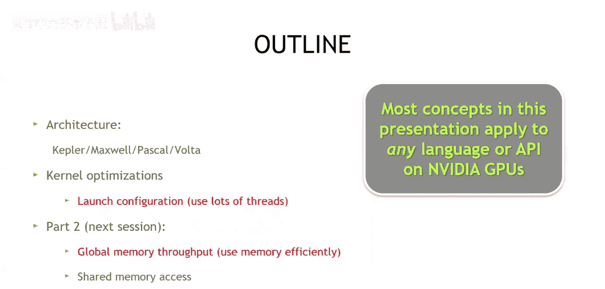
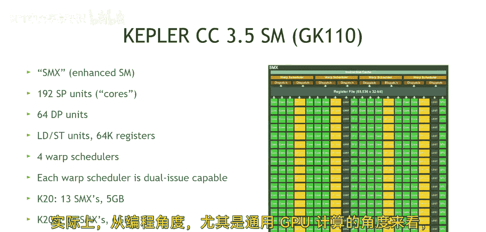

# 003：CUDA基础优化第一部分

在本节课中，我们将从关注编写语法正确的CUDA代码，转向探讨如何编写高性能的CUDA代码。我们将首先了解GPU架构的基本概念，并学习第一个核心优化目标：**暴露足够的并行性**。理解这一点将帮助你在编写代码时，就为GPU的高效运行打下基础。

## GPU架构概述

上一节我们介绍了编写CUDA程序的基本语法。本节中，我们来看看为什么性能优化需要了解GPU架构。在计算机科学中，代码的性能往往与运行它的机器架构密切相关。为了理解如何编写高性能CUDA代码，我们需要对GPU架构有一个基本的认识。

我们将简要回顾Kepler、Maxwell、Pascal和Volta这几代架构。对于本次课程的参与者而言，Summit超算上使用的Volta架构最为重要。不过，我们今天要讨论的“暴露足够并行性”这一核心概念，在所有GPU架构中都是普遍适用的。

## GPU如何执行：线程与线程块

为了理解“暴露足够并行性”的含义，我们需要了解GPU是如何组织和执行计算任务的。GPU的计算核心被组织成多个流式多处理器。

以下是一个简化的执行模型：
1.  **线程**：是CUDA中最基本的执行单元。
2.  **线程块**：一组线程被组织成一个线程块，在一个流式多处理器上执行。
3.  **网格**：所有线程块组成一个网格，在GPU上启动。

GPU的高性能来自于其能够同时管理并执行成千上万个线程。如果线程数量不足，GPU的众多计算核心就会处于闲置状态，无法充分发挥其计算能力。

## 核心优化目标：使用大量线程

因此，我们从架构分析中得出的第一个、也是最重要的优化优先级，可以转化为一个直接的编程建议：**使用大量线程**。

对于刚学完前两节语法课程的开发者来说，这是一个简单易懂的目标。你的算法应该能够启动并利用海量线程来执行。这是实现高性能CUDA程序的基础，其重要性超过我们今天要讨论内容的50%。

为了实现这个目标，我们需要关注内核的启动配置。启动配置决定了你创建了多少个线程块，以及每个线程块包含多少个线程。

以下是设计启动配置时需要考虑的几个关键点：
*   **总线程数**：应远大于你的数据量或任务量，以确保GPU被充分利用。
*   **线程块大小**：通常是32的倍数（即一个Warp的大小），例如128、256、512。
*   **网格大小**：通过总线程数除以线程块大小来计算，确保能覆盖所有需要处理的数据。

通过合理配置，你可以确保GPU获得足够多可以并行执行的工作，从而隐藏内存访问延迟，并让所有计算单元保持忙碌。

## 总结

本节课中，我们一起学习了CUDA性能优化的第一个核心理念。我们了解到，GPU的架构设计使其擅长海量并行计算，因此编写高性能CUDA代码的首要任务是**暴露足够的并行性**，即在程序中启动并使用**大量线程**。

我们探讨了GPU通过流式多处理器、线程块和线程来组织执行的基本模型，并明白了如果线程数量不足，GPU的强大算力将无法被有效利用。最后，我们将这一架构知识转化为具体的编程实践——精心设计内核的启动配置，以确保网格和线程块能提供远超GPU物理核心数量的线程。

在下一节课中，我们将深入GPU的另一个关键子系统：内存层次结构。我们将学习如何高效地利用全局内存、共享内存等，这是CUDA编程中第二个至关重要的优化方向。无论你使用CUDA C++、CUDA Python还是CUDA Fortran，本节课所学的“使用大量线程”这一原则都同样适用。