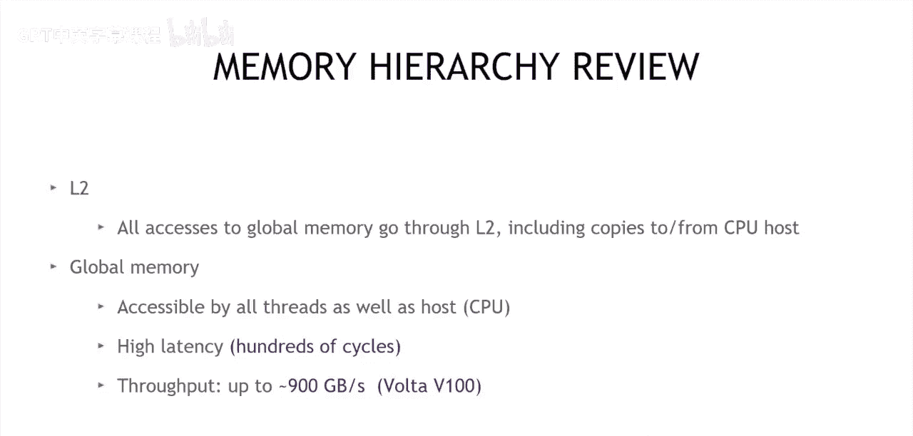

# 004：CUDA基础优化第二部分


## 概述

在本节课中，我们将学习CUDA编程中第二个至关重要的优化概念：如何高效利用内存子系统。我们将重点关注全局内存的吞吐量以及共享内存的有效使用。理解这些概念将帮助您编写出性能更佳的CUDA代码，而无需过度依赖性能分析工具。

上一节我们介绍了通过暴露大量并行性（即运行大量线程）来优化执行行为。本节中，我们来看看如何通过优化内存访问模式来进一步提升性能。

## 内存层次结构回顾

为了理解如何优化内存访问，我们首先需要回顾GPU的内存层次结构。GPU的内存系统从最靠近处理单元的高速存储到容量较大但速度较慢的存储，形成了一个层次结构。

以下是GPU内存层次结构的主要组成部分：

*   **寄存器**：这是每个线程私有的、速度最快的内存资源。几乎所有底层机器指令都从寄存器读取数据并将结果写回寄存器。寄存器使用主要由编译器管理，程序员通常无需直接干预。
*   **共享内存与L1缓存**：这两者都是位于GPU芯片上的资源，具有高带宽和低延迟的特点。
    *   **共享内存**：是一个可由程序员显式分配和使用的本地内存数组，用于数据的临时存储。每个线程块通常至少有48KB的共享内存可用。
    *   **L1缓存**：是一种硬件管理的缓存，旨在通过保留最近使用的数据来提升访问速度，对程序员基本透明。
*   **L2缓存**：这是一个设备范围的资源，所有进出全局内存的数据都需要经过L2缓存。与L1类似，它通过缓存频繁访问的数据来提升性能。
*   **全局内存**：这是GPU中容量最大，但访问延迟最高、带宽相对较低的内存。优化对全局内存的访问是本课的重点。

## 全局内存吞吐量优化

现在，让我们深入探讨如何优化全局内存的访问。全局内存的访问模式对性能有决定性影响。为了获得高带宽，关键是要实现**合并访问**。

### 合并访问原则

当GPU中的一个线程束（Warp，通常是32个线程）访问全局内存时，如果所有线程访问的内存地址是连续的，并且对齐到特定的边界（例如128字节），那么这些访问可以被合并成一个或少数几个内存事务。这种高效的访问模式称为“合并访问”。

反之，如果线程束中的线程访问分散的、不连续的内存地址，则会导致多个内存事务，严重降低有效带宽。这种低效的访问模式称为“非合并访问”或“分散访问”。

核心优化原则可以总结为以下公式：
**高效全局内存访问 ≈ 实现合并访问**

为了实现合并访问，在编写内核时应注意：
1.  确保同一线程束内的线程访问连续的全局内存地址。
2.  尽量使访问的起始地址对齐到缓存行边界。

## 共享内存的高效使用

在理解了全局内存优化后，我们接下来看看如何利用共享内存来进一步提升性能。共享内存的访问速度远高于全局内存，因此可以作为一种软件管理的缓存。

### 使用共享内存的模式

一个常见的使用模式是“平铺”（Tiling）算法。其基本思想是：
1.  将数据从全局内存分块（Tile）加载到共享内存中。
2.  让线程块内的线程协作处理共享内存中的这块数据。
3.  将结果写回全局内存。

这种模式能显著减少对全局内存的重复访问，尤其适用于存在数据重用的算法（如矩阵乘法、卷积等）。

以下是使用共享内存的一个简化代码框架示意：
```cpp
__global__ void kernel(float* input, float* output) {
    // 1. 声明共享内存数组
    __shared__ float tile[TILE_SIZE];

    // 2. 协作将全局内存数据加载到共享内存
    int idx = ...; // 计算全局索引
    tile[threadIdx.x] = input[idx];
    __syncthreads(); // 确保所有数据加载完成

    // 3. 从共享内存读取数据进行计算
    float data = tile[some_index];
    // ... 执行计算 ...

    // 4. 将结果写回全局内存
    output[idx] = result;
}
```
使用共享内存时，必须注意使用 `__syncthreads()` 来同步线程块内的线程，确保数据在共享内存中准备就绪后再被读取。

## 总结

本节课中我们一起学习了CUDA基础优化的第二个核心支柱：高效利用内存子系统。

我们首先回顾了GPU的内存层次结构，理解了从高速的寄存器、共享内存/L1缓存，到L2缓存，最后到全局内存的访问速度差异。接着，我们重点探讨了优化全局内存访问的关键——实现**合并访问**，以确保获得高内存带宽。最后，我们介绍了如何利用更快的**共享内存**作为软件管理的缓存，通过“平铺”等模式来减少对全局内存的访问，从而提升整体性能。



掌握这两个概念——优化全局内存访问模式与有效利用共享内存——是编写高性能CUDA代码的基石。在后续课程中，我们将学习更多基于性能分析驱动的优化技巧。