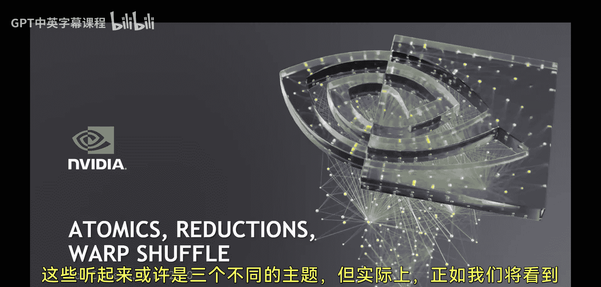
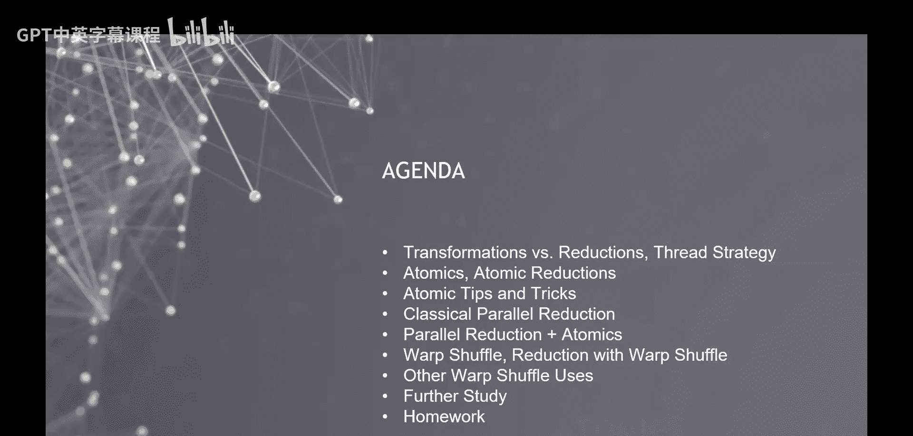
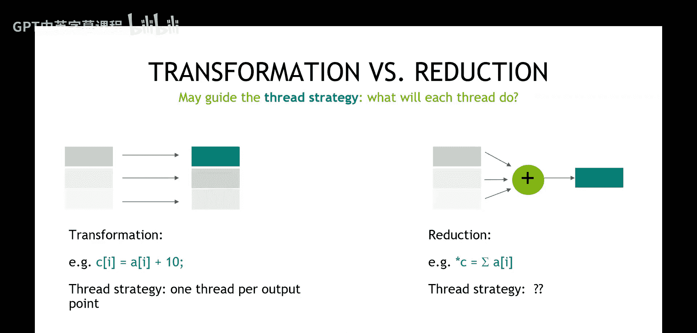

# 005：Atomics, Reductions, Warp Shuffle 🧮

在本节课中，我们将学习CUDA编程中的三个核心概念：原子操作、归约操作和Warp洗牌操作。这些技术对于解决需要线程间协作和数据共享的并行计算问题至关重要。

---

## 概述

大家好，我是来自NVIDIA的Bob Carbella。在今天的第五次CUDA培训课程中，我们将探讨原子操作、归约操作和Warp洗牌操作。虽然听起来像是三个独立的主题，但我们会发现它们之间存在紧密的联系，并且常常被用来解决同一类编程问题。

与之前的基础性课程不同，从本节课开始，我们将进入更具专题性的学习阶段。课程结构将分为两部分：第一部分是约一小时的讲解，第二部分是问答环节。此外，由于本次作业内容更为复杂，我们将在后续安排一次专门的作业讲解会。

---

## 从“变换”到“归约”

在之前的课程和作业中，我们处理的大多数问题都属于“变换”类问题。这类问题的特点是：输入数据集的大小与输出数据集的大小大致相同。例如，对数组中的每个元素进行某种运算，并生成一个大小相近的新数组。

然而，我们接下来要处理的问题有所不同。考虑一个简单的C语言示例：计算一个包含100，000个元素的数组的总和。



```c
int a[100000];
int sum = 0;
for (int i = 0; i < 100000; i++) {
    sum += a[i];
}
```

在这个例子中，输入是一个庞大的数组，但输出只是一个单一的值（`sum`）。这类问题被称为“归约”问题。将这类问题并行化，需要我们思考新的“线程策略”。

---

## 什么是线程策略？

线程策略是CUDA编程中的一个核心设计问题，它回答的是：“我应该让每个线程做什么？” 当我们编写一个CUDA核函数时，本质上是在编写单个线程要执行的代码。CUDA的并行化机制（如网格和线程块维度）会将这段代码复制到成千上万个线程上并行执行。

因此，在开始编写任何CUDA内核之前，我们必须首先确定线程策略。对于“变换”类问题，策略通常很直观：让每个线程处理一个（或几个）输入元素，并产生一个（或几个）输出元素。

但对于“归约”问题，情况就变得复杂了。所有线程都需要协作，将大量数据“归约”成一个或几个值。这引出了我们本节课要学习的三个关键技术。

---

## 原子操作

原子操作是解决多线程同时读写共享内存时数据竞争问题的关键工具。它确保了对某个内存位置的操作是“不可分割”的，即在该操作完成前，其他线程无法访问该位置。

以下是原子加操作的示例：

```cuda
// 所有线程都向全局内存中的同一个地址累加自己的值
atomicAdd(&global_sum, thread_value);
```



**核心概念**：`atomicAdd` 等原子函数保证了即使在成千上万个线程同时执行的情况下，对 `global_sum` 的累加操作也能正确、顺序地完成，而不会发生数据覆盖或丢失。

---

## 归约操作

归约操作是指将一组数据通过某种二元运算（如加法、求最大值）合并成单个值的过程。在CUDA中实现高效的归约需要巧妙的线程协作模式。

一个经典的并行归约策略是树形归约：

1.  每个线程块将其内部的数据归约成一个部分和。
2.  然后，这些部分和被进一步归约（可能通过另一个内核或原子操作）以得到最终结果。

这种策略极大地减少了直接使用原子操作带来的全局内存访问冲突和性能开销。

---

## Warp洗牌操作

Warp洗牌是CUDA提供的一种在同一个Warp（通常是32个线程）内进行线程间数据交换的机制。它比通过共享内存进行数据交换速度更快，延迟更低。

以下是使用Warp洗牌进行归约的示例：

```cuda
// 假设每个线程都有一个值 `val`
for (int offset = 16; offset > 0; offset /= 2) {
    val += __shfl_down_sync(0xffffffff, val, offset);
}
// 现在，Warp内第一个线程的 `val` 包含了该Warp所有线程值的和
```

**核心概念**：`__shfl_down_sync` 内在函数允许Warp内的线程直接从其他线程的寄存器中获取数据，无需经过共享内存，从而实现了极低开销的数据共享和归约。

---

## 总结

在本节课中，我们一起学习了CUDA中用于解决归约和线程协作问题的三个关键技术：

1.  **原子操作**：用于安全地在多线程环境下更新共享变量，是解决数据竞争的基础，但可能成为性能瓶颈。
2.  **归约操作**：通过树形结构等并行算法，高效地将大量数据合并为少数值，是许多科学计算的核心。
3.  **Warp洗牌操作**：在Warp级别实现高速、低延迟的线程间数据交换，是优化归约和特定计算模式的强大工具。



理解这些概念及其相互关系，是编写高效、正确CUDA并行程序，特别是处理非变换类问题的重要一步。在接下来的作业中，你将有机会亲自实践这些技术。