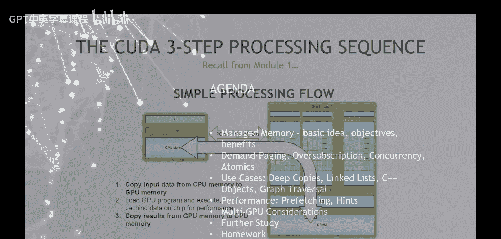
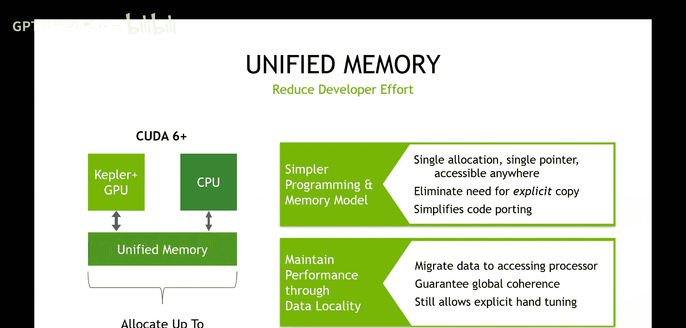

# 006：托管内存


在本节课中，我们将学习CUDA托管内存（也称为统一内存）的概念。这是一种旨在简化GPU编程中内存管理的技术。我们将探讨其基本原理、特性、典型用例，并重点讨论其性能表现。请注意，托管内存的主要目标是简化编程，而非直接提升性能。

## 什么是托管内存？

上一节我们介绍了GPU计算通常包含的三个步骤：数据复制到GPU、执行内核、结果复制回CPU。托管内存旨在简化这一流程。

托管内存的核心思想是**消除显式内存复制**的“样板代码”。它通过创建一个**单一指针**来实现，该指针在主机（CPU）代码和设备（GPU）代码中均可使用。从程序员视角看，数据似乎只有一份副本，无需手动管理主机和设备上的两个独立副本。

这项功能大约在CUDA 6时代（2012-2013年，与Kepler GPU同期）被引入CUDA编程模型。

## 托管内存的基本用法

要使用托管内存，您只需使用 `cudaMallocManaged` 函数来分配内存，而不是分别使用 `malloc`（主机）和 `cudaMalloc`（设备）。

以下是分配托管内存的基本代码示例：
```c
// 分配托管内存
int *data;
cudaMallocManaged(&data, N * sizeof(int));



// 现在，`data` 指针既可以在主机代码中使用，也可以在设备内核中使用
// ... 在主机上初始化数据 ...
// ... 启动内核处理 `data` ...
// ... 在主机上访问结果 ...

// 释放内存
cudaFree(data);
```
使用托管内存后，数据迁移（在主机和设备之间移动）由CUDA运行时系统自动管理，程序员无需编写显式的 `cudaMemcpy` 调用。

## 托管内存的关键特性

以下是托管内存的一些重要特性：

*   **按需分页**：数据并非在分配时立即全部传输。只有当CPU或GPU实际访问（读取或写入）内存的某个页面时，该页面才会被迁移到访问它的处理器上。
*   **内存超额订阅**：在支持它的系统上（如带有GPU的服务器），应用程序可以分配比GPU物理显存更大的托管内存。CUDA运行时会在需要时在主机内存和显存之间交换数据页面。
*   **一致性模型**：在计算能力6.0及以上的GPU上，托管内存提供系统范围的原子内存操作一致性。这意味着主机和设备可以同时对同一内存位置进行原子操作。
*   **简化代码移植**：对于原本为CPU编写的代码，将其指针改为指向托管内存，并添加内核启动，可能就足以让部分计算在GPU上运行，从而简化移植过程。

## 性能考量

现在，我们来看看托管内存的性能。重申一遍，托管内存的主要目标是**编程简化**，而非性能优化。

*   **基础性能**：由于存在按需分页和数据迁移的开销，使用托管内存的代码性能**可能低于**精心手动管理内存复制的代码。首次访问数据时可能会产生页面错误和迁移延迟。
*   **性能优化API**：CUDA提供了一些API来帮助管理托管内存的性能：
    *   `cudaMemPrefetchAsync`：此函数允许您将数据预取到特定设备（例如GPU）的内存中，以减少内核执行时的页面错误延迟。您可以在启动内核前，将所需数据预取到GPU。
    *   `cudaMemAdvise`：此函数允许您向运行时提供关于数据使用模式的建议（例如，`cudaMemAdviseSetPreferredLocation` 可以设置数据的首选存放位置），以帮助运行时做出更优的数据迁移决策。

## 总结



本节课我们一起学习了CUDA托管内存（统一内存）。我们了解到，它通过提供单一指针和自动数据迁移，显著简化了GPU编程中的内存管理。我们讨论了其按需分页、超额订阅等关键特性，并审视了其性能特点。重要的是要记住，托管内存是一种**生产力工具**，用于简化开发，通常需要配合 `cudaMemPrefetchAsync` 等API来优化性能，而非直接提供最高性能的解决方案。在决定是否使用托管内存时，应在编程便利性和性能要求之间进行权衡。