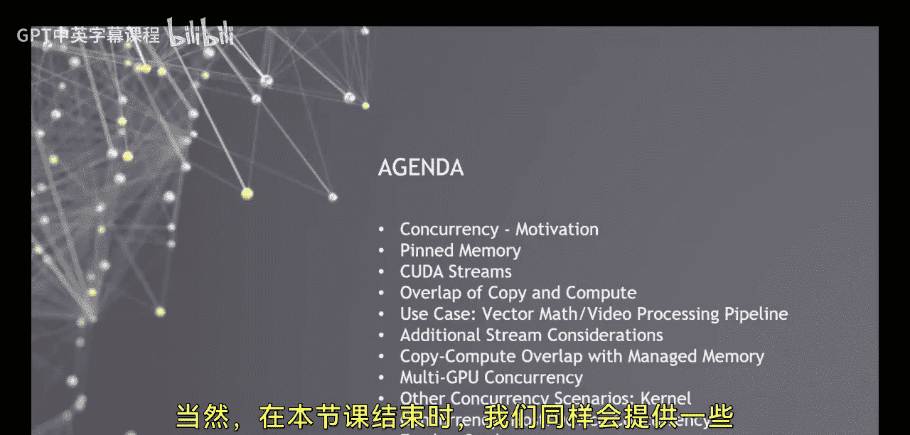
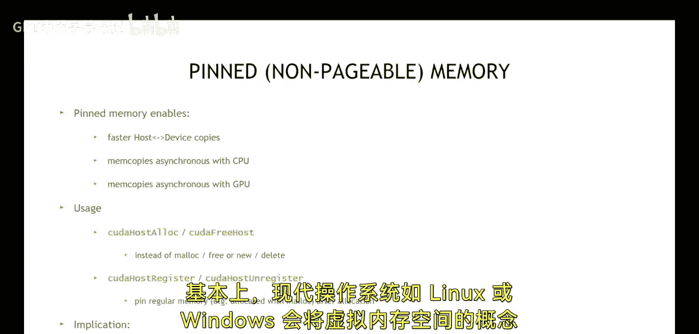

# 007：并发性

在本节课中，我们将要学习CUDA编程中的并发性概念。并发性是优化CUDA程序性能的关键技术之一，它允许我们同时执行多个操作，从而缩短程序的总体运行时间。我们将从动机开始，探讨为何需要并发性，然后介绍实现并发所需的基础知识，特别是“固定内存”的概念。最后，我们将学习实现并发的具体机制和不同使用场景。

## 动机：为何需要并发？

上一节我们介绍了CUDA的基本编程模型。现在，我们来看看如何通过并发性来优化这个模型。

在CUDA编程中，一个典型的三步序列是：将数据从主机复制到设备，执行内核，然后将结果从设备复制回主机。如果我们按照目前所学的方式编写代码，这些操作通常是串行执行的。这意味着内核执行必须等待数据复制完成，而结果复制也必须等待内核执行完成。

这种串行执行方式导致程序的总执行时间是各个操作时长的简单相加。然而，如果我们能够重叠这些操作，让数据复制和内核执行同时进行，就有可能显著缩短程序的总体运行时间。这正是并发性优化的核心目标——通过同时利用多个处理器来最大化系统性能。

## 固定内存：实现并发的基础

为了实现上述的并发操作，我们首先需要理解一个关键概念：固定内存。



现代操作系统（如Linux或Windows）的内存子系统具有一定的复杂性，可能对程序员并不完全透明。其核心思想是，操作系统将虚拟内存空间与物理内存（即系统RAM）分离开来。

固定内存是指被“锁定”在物理RAM中的主机内存页，操作系统不会将其交换到磁盘，并且其物理地址是固定的。这对于CUDA的异步内存传输至关重要，因为GPU的DMA引擎需要知道稳定的物理地址才能高效地直接访问主机内存。

以下是使用固定内存的代码示例：
```c
cudaMallocHost(&pinned_host_ptr, size); // 分配固定内存
// ... 使用 pinned_host_ptr 进行异步操作
cudaFreeHost(pinned_host_ptr); // 释放固定内存
```

## 并发机制与使用场景

理解了固定内存后，我们现在可以探讨CUDA中实现并发的具体机制。

CUDA提供了多种机制来实现不同层面的并发。以下是几种主要的并发使用场景：

1.  **内核执行与内存拷贝的重叠**：这是最常见的并发优化。通过使用流和异步内存拷贝，可以让一个流中的内核执行与另一个流中的数据拷贝同时进行。
2.  **多个内核的并发执行**：如果设备有足够的资源，可以同时启动多个内核，让它们并行执行。
3.  **主机与设备的并发执行**：主机CPU可以在GPU执行内核的同时，进行自己的计算任务，实现CPU-GPU的协同工作。

为了实现这些并发场景，我们需要使用CUDA流。流是一系列按顺序执行的命令序列。不同流中的命令可以并发执行。以下是创建和使用流的示例：
```c
cudaStream_t stream;
cudaStreamCreate(&stream); // 创建流
cudaMemcpyAsync(dev_ptr, host_ptr, size, cudaMemcpyHostToDevice, stream); // 在指定流中进行异步拷贝
myKernel<<<grid, block, 0, stream>>>(...); // 在指定流中启动内核
cudaStreamSynchronize(stream); // 等待流中所有操作完成
cudaStreamDestroy(stream); // 销毁流
```

## 总结



本节课中我们一起学习了CUDA中的并发性。我们从优化程序执行时间的动机出发，认识到重叠数据拷贝和内核执行的重要性。为了实现这种并发，我们首先学习了固定内存的概念及其作用。最后，我们探讨了使用CUDA流来实现内核执行与内存拷贝重叠等并发场景的具体方法。掌握这些并发技术是进行CUDA程序高级性能优化的关键步骤。