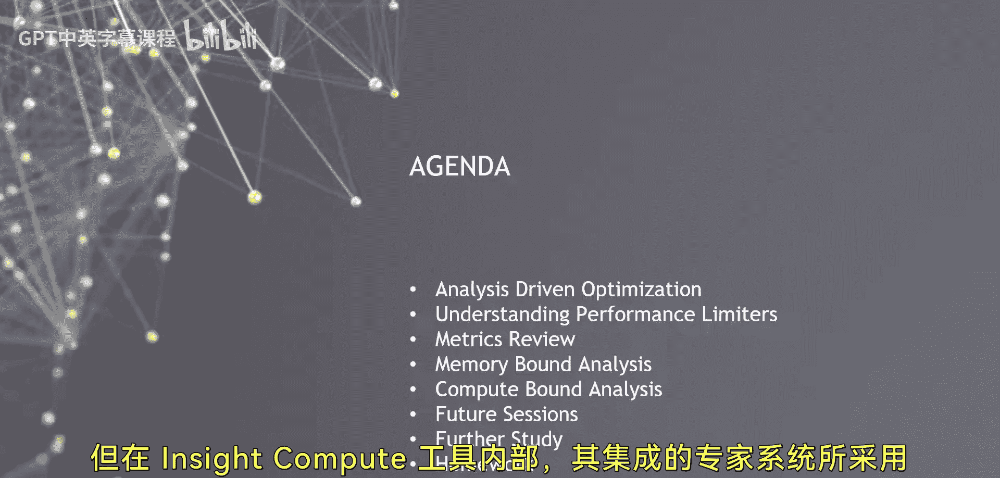

# 008：GPU性能分析 🚀

在本节课中，我们将学习GPU性能分析的核心方法论——分析驱动优化。我们将了解如何系统性地使用性能分析工具来识别代码瓶颈，并基于数据而非猜测来指导优化工作。课程将涵盖关键的性能限制因素，如内存带宽、计算吞吐量和延迟，并介绍如何使用NVIDIA Nsight工具进行实践分析。

## 分析驱动优化方法论 💡

上一节我们概述了课程目标，本节中我们来深入探讨分析驱动优化的核心思想。

分析驱动优化是一种系统性的性能提升方法。其核心在于：**让性能分析工具的数据指导优化方向，而非依赖直觉或未经证实的假设**。

许多开发者常会陷入针对特定概念（如“消除线程束分化”）进行盲目优化的误区。然而，在没有数据支持的情况下，这类优化往往收效甚微，甚至可能完全无关紧要。分析驱动优化要求我们遵循一个可重复、有逻辑的流程：

1.  使用性能分析工具收集数据。
2.  识别最主要的性能瓶颈。
3.  针对该瓶颈进行代码重构或优化。
4.  验证优化效果，并重复此过程。

这种方法论是长期实践积累的成果，具有普适性和可靠性。无论工具或代码如何变化，这套方法论都能持续生效。

## 关键性能分析路径 🛣️

理解了方法论后，我们来看看分析过程中可能遇到的几种主要性能限制类型。根据初始分析结果，我们通常会沿着以下几条关键路径进行深入探索：

*   **内存带宽限制**：当数据在GPU显存与计算单元之间的传输速度成为瓶颈时。
*   **计算吞吐量限制**：当GPU的计算单元（如CUDA核心）利用率不足，无法跟上指令发射速度时。
*   **延迟限制**：当线程因等待数据（如全局内存访问）或同步而长时间空闲时。

沿着不同路径前进，我们需要关注不同的性能指标和分析重点。接下来，我们将引入**性能指标**的概念，用于量化和确定具体是哪种因素在限制性能。

## 现代分析工具：Nsight Systems & Nsight Compute 🛠️

上一节我们介绍了性能限制的类型，本节中我们来看看帮助我们识别这些限制的现代工具。

一个理想的智能工具能够封装专家经验，为用户提供最直接、最有用的优化指南。NVIDIA的Nsight Systems和Nsight Compute正是这样的工具。它们在近几年推出，并集成了开发者社区多年积累的智能分析能力。

Nsight Systems提供系统级的性能分析，适用于观察应用程序的整体行为、CPU-GPU交互以及多GPU/多流活动。Nsight Compute则专注于GPU内核的微观性能分析，提供详细的硬件计数器数据和优化建议。

在本次演示的后半部分，我们将主要跟随Nsight Compute工具提供的“线索”进行分析。该工具内置的专家系统，其底层逻辑正是基于我们前面讨论的分析驱动优化方法论。

---

本节课中，我们一起学习了GPU性能分析的核心——分析驱动优化方法论，了解了内存带宽、计算吞吐量和延迟等关键性能限制路径，并认识了Nsight Systems和Nsight Compute这两款强大的现代性能分析工具。记住，让数据而非猜测来指导你的优化工作，是持续提升代码性能的关键。