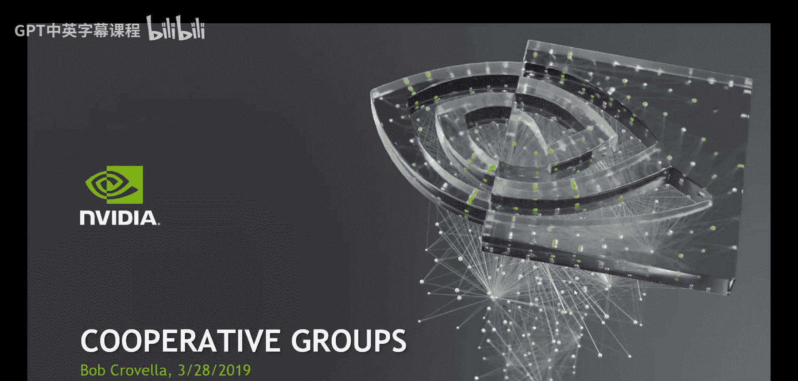
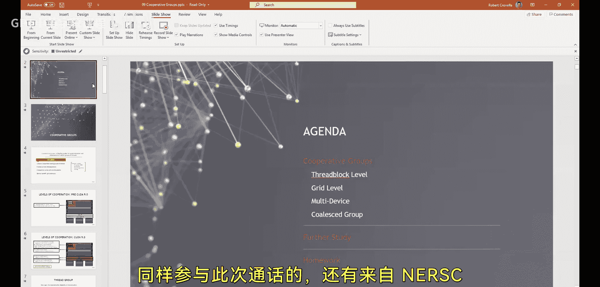
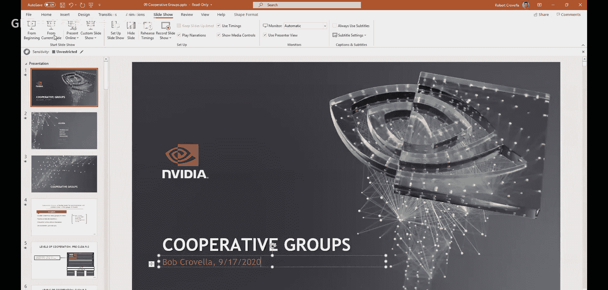
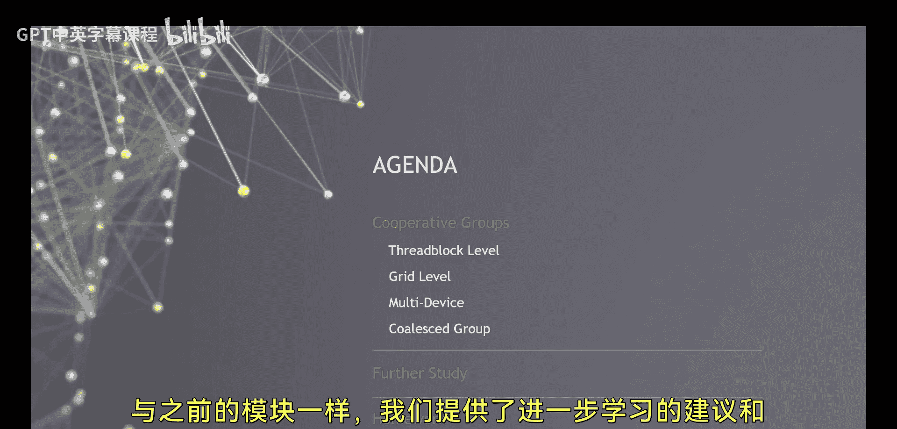
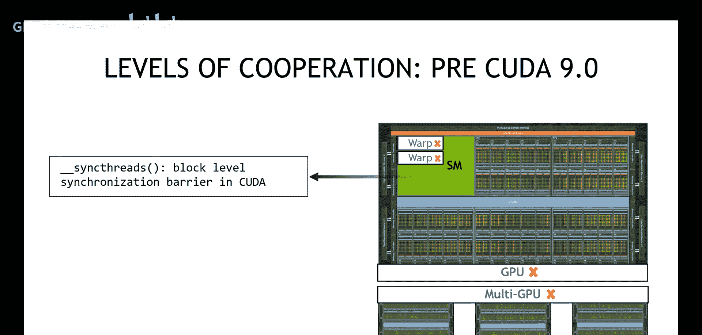

# 009：Cooperative Groups 🚀



在本节课中，我们将学习CUDA编程模型中的一个重要扩展——Cooperative Groups（协作组）。我们将探讨如何创建和管理不同规模的线程组，以实现更灵活的线程间协作与同步。课程内容涵盖线程块级、网格级、多设备级协作组以及集合操作。通过本课的学习，您将掌握使用协作组编写高效、可组合CUDA代码的方法。



---



## 课程概述 📋

协作组功能旨在为线程组之间的协作提供支持。在CUDA编程中，线程协作主要涉及两个基本概念：**同步**（如执行屏障）和**线程间通信**（数据共享）。协作组扩展了这些概念，允许我们创建灵活大小的线程组，并设计能够处理这些可变大小组的算法。

上一节我们介绍了CUDA编程的基础概念，本节中我们来看看如何利用协作组实现更高级的线程协作。

---

## 协作组的动机 💡

协作组子系统主要促进线程组之间的合作。在之前的课程中，我们学习了线程协作的含义，包括 `__syncthreads()` 和共享内存的使用。协作组在此基础上，允许我们：

1.  创建灵活的并行分解，将大组细分为小组。
2.  设计能够处理可变大小线程组的算法。
3.  编写可跨软件边界组合的代码。

其中一个最引人注目的概念是**网格级同步**（grid-wide sync）。在传统的CUDA编程模型中，实现整个网格的同步是困难且受限的。协作组引入的网格级同步功能，为许多算法问题提供了强大的解决方案。

---

## 传统CUDA的协作机制 ⚙️

在CUDA 9引入协作组之前，程序员可用的线程协作机制相对有限。主要依赖于线程块内的固有协作原语。

以下是传统CUDA中线程协作的核心机制：

*   **线程块内同步**：使用 `__syncthreads()` 函数。
*   **线程间通信**：通过共享内存（`__shared__` 变量）实现。

这些机制虽然强大，但缺乏在不同规模线程组（尤其是跨线程块或整个网格）上进行灵活协作和同步的直接支持。

---


## 协作组的核心概念 🧠

协作组扩展了CUDA模型，引入了“组”作为一等公民。一个组可以包含任意数量的线程，从几个线程到整个网格的所有线程。

核心操作包括：
1.  **创建组**：从现有线程集合中定义一个新的协作组。
2.  **组内同步**：确保组内所有线程到达同步点后再继续执行。
3.  **组间通信**：在组内或特定模式的线程间交换数据。

---



## 不同级别的协作组 📊

协作组功能支持多个级别，每种服务于不同的目的。

以下是主要的协作组类型：

1.  **线程块级协作组 (Thread Block Level)**
    *   用于线程块内部的协作。
    *   可以细分为更小的小组（如经线组Warp、线程块瓦片Tile）。

2.  **网格级协作组 (Grid Level)**
    *   允许跨线程块的线程进行协作。
    *   实现了之前难以达成的**网格级同步**。

3.  **多设备协作组 (Multi-Device Groups)**
    *   扩展协作范围到多个GPU设备。
    *   用于复杂的多GPU算法。

4.  **集合操作组 (Collectives Groups)**
    *   专为集合通信模式设计（如规约、扫描）。
    *   提供优化的原语。

---

## 网格级同步的重要性 ⚡

网格级同步是协作组带来的一个关键能力。在早期CUDA模型中，除了在内核启动之间隐式同步外，没有安全的方法让网格中所有线程在同一个执行点汇合。

网格级同步使得以下操作成为可能：
*   实现需要全局屏障的算法。
*   在网格范围内协调对全局内存的访问。
*   编写更清晰、更易于推理的多阶段内核。

其基本用法如下：
```cpp
// 创建包含网格中所有线程的组
auto grid_group = cooperative_groups::this_grid();
// 执行网格级同步
grid_group.sync();
```

---

## 示例与应用场景 🛠️

协作组适用于多种并行模式。

以下是一些典型的应用场景：

*   **并行规约 (Parallel Reduction)**：可以动态地将参与规约的线程组织成不同大小的组，实现更灵活的规约树。
*   **扫描/前缀和 (Scan/Prefix Sum)**：协作组有助于管理扫描操作中的依赖关系。
*   **生产者-消费者模式 (Producer-Consumer Patterns)**：网格中的线程组可以协作处理任务队列。
*   **迭代求解器 (Iterative Solvers)**：需要在每次迭代后进行全局同步的算法。

---

## 总结与回顾 🎯

本节课中我们一起学习了CUDA Cooperative Groups的核心概念与应用。我们了解到，协作组功能填补了传统CUDA模型在灵活线程协作方面的空白，特别是引入了强大的网格级同步能力。通过创建和管理不同规模的线程组，我们可以设计出更高效、更模块化且可组合的CUDA内核。

关键要点包括：
1.  协作组将“线程组”作为编程模型中的显式实体。
2.  它支持从经线到整个网格乃至多设备级别的协作。
3.  **网格级同步**解锁了新的算法设计可能性。
4.  使用协作组可以编写出更清晰、更易于维护的并行代码。



建议您通过官方文档和练习进一步巩固对这些概念的理解，并将其应用到实际的CUDA项目中去。