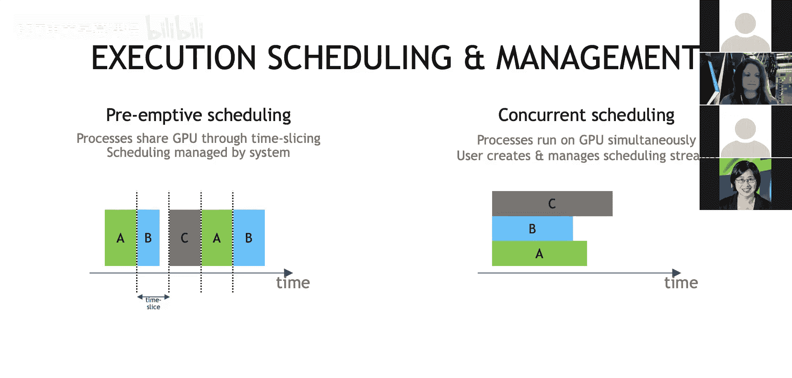
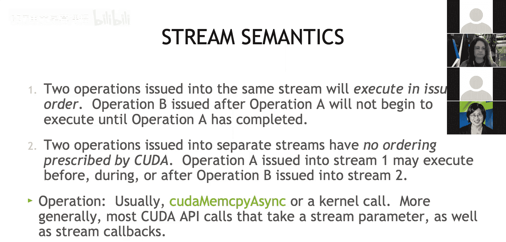
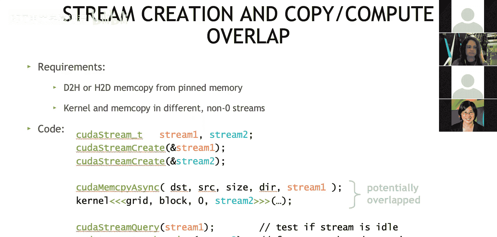
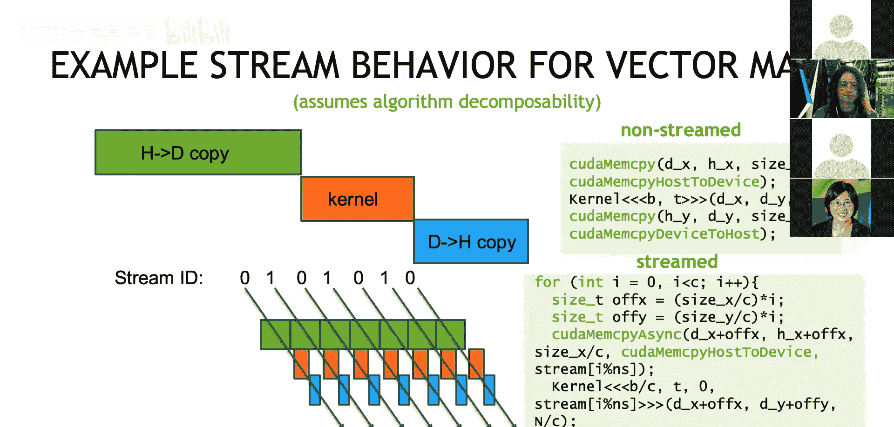
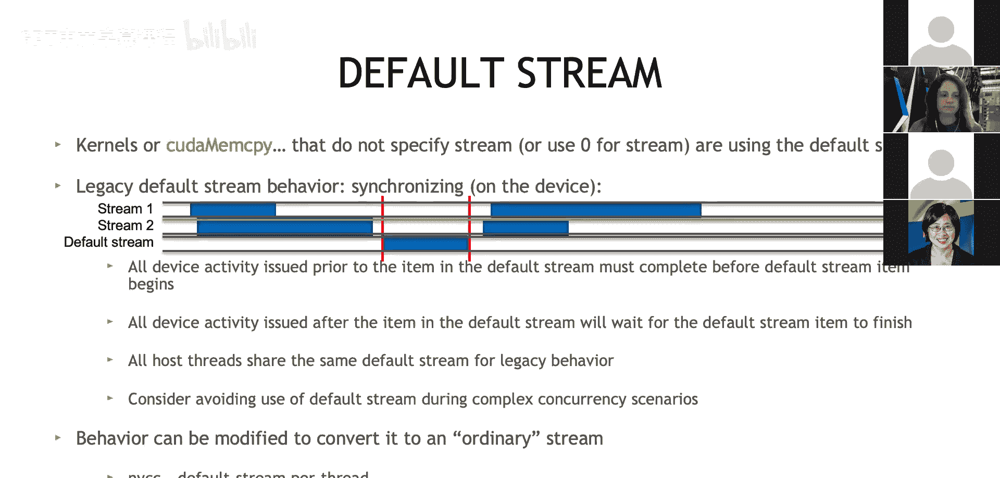
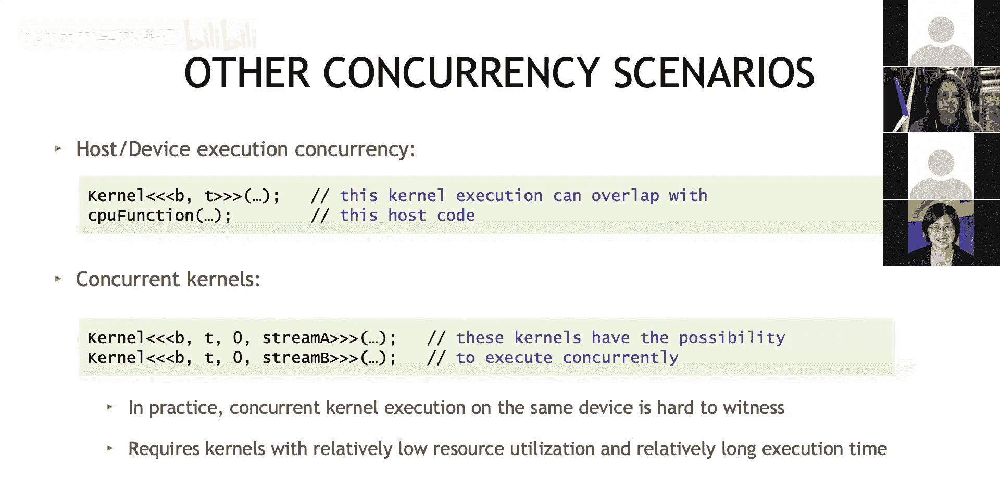

# 010：多线程与CUDA并发 🚀

在本节课中，我们将要学习如何在多线程环境中使用CUDA流来实现并发执行。我们将探讨CUDA流的基本概念、默认流的行为，以及如何通过流来重叠计算和数据传输，从而提升GPU的利用率和应用程序的性能。

---



上一节我们介绍了CUDA并发的基本概念，本节中我们来看看CUDA流的具体语义和行为。

CUDA流是CUDA中用于管理操作执行顺序的抽象。以下是关于CUDA流的一些基本语义：

*   在**同一个流**中发出的两个操作，将按照**发出顺序**执行。这意味着，如果操作A和操作B被依次提交到同一个流中，操作B必须等待操作A完成后才能开始执行。
*   在**不同流**中发出的操作，CUDA**不保证**它们之间的执行顺序。这意味着，操作A可能在操作B之前、期间或之后执行。

通常，一个“操作”指的是内存拷贝（如`cudaMemcpyAsync`）或内核函数调用。更广泛地说，任何接受流参数的CUDA API调用（如流回调）都属于此类操作。对于您自己编写的内核，调用时也可以指定一个可选的流参数。



---

理解了流的基本语义后，我们来看一个具体的代码示例，它展示了如何创建流并实现计算与拷贝的重叠。

```cpp
// 创建两个CUDA流
cudaStream_t stream1, stream2;
cudaStreamCreate(&stream1);
cudaStreamCreate(&stream2);

// 在流1上异步拷贝数据到设备
cudaMemcpyAsync(dst, src, size, cudaMemcpyHostToDevice, stream1);



// 在流2上启动一个内核
myKernel<<<grid, block, 0, stream2>>>(...);

// 让CPU线程等待流2上的所有操作完成
cudaStreamSynchronize(stream2);
```

在这个例子中，内存拷贝操作在`stream1`上执行，而内核启动在`stream2`上。由于这两个操作在不同的流中，它们**可能**会并发执行。`cudaStreamSynchronize(stream2)`调用会阻塞CPU线程，直到`stream2`上的内核执行完毕。需要注意的是，如果内存拷贝的数据是内核计算所必需的，那么这种安排就是不安全的，因为CUDA不保证跨流操作的顺序。

---

为了更清晰地说明如何利用流进行任务分块和重叠，我们来看一个向量运算的例子。

这个例子类似于我们作业中的代码，它将一个大型数组分成多个块，并使用多个流来重叠主机到设备的数据拷贝、内核计算以及设备到主机的回拷。



以下是其执行逻辑的简化描述：
*   在`stream0`上：执行第一块数据的 **H2D拷贝 -> 内核计算 -> D2H回拷**。
*   在`stream1`上：执行第二块数据的 **H2D拷贝 -> 内核计算 -> D2H回拷**。

在每个流内部，操作严格按照提交顺序执行。但是，`stream0`和`stream1`之间的操作没有顺序约束，因此它们可以并发执行。关键在于，必须确保在每个流内部，数据拷贝在内核启动之前完成。这种模式不仅适用于分块处理单一数组，也适用于准备和处理多个独立的数据集。

---

在深入多线程之前，我们必须理解默认流的行为，因为它常常是并发编程中的陷阱。

如果您从未指定过流，那么您的所有操作都使用了**默认流**。传统默认流的行为是：它会阻塞整个GPU设备。这意味着，即使您在其他流中提交了任务，一旦向默认流提交工作，它会等待**所有其他流**上的任务完成后才开始执行。在此期间及默认流执行过程中，其他流上的任务也无法开始。

所有主机线程共享同一个默认流。在复杂的并发场景中，应避免使用传统默认流。一个常见的误解是，先启动一个任务（使用默认流），再为第二个任务创建一个新流，期望它们并发。实际上，第一个任务仍在默认流中，会阻塞第二个任务，无法实现并发。



您可以通过在编译时使用`--default-stream per-thread`标志来修改这一行为。启用后，每个主机线程将拥有自己独立的“普通”默认流，它不再阻塞整个设备。

---

掌握了流的基础知识后，我们现在可以探讨CUDA并发的几种典型用例。

CUDA并发主要有以下两种应用场景：

1.  **主机-设备执行并发**：启动一个内核后，如果CPU端暂时不需要其结果，我们可以不等待（不调用`cudaStreamSynchronize`），而是让CPU代码继续执行其他任务。
2.  **并发内核执行**：在不同的流中启动多个内核，它们**有可能**并发执行。这里需要强调“有可能”，因为实际并发取决于GPU硬件资源的利用率。如果两个内核各自都能高效利用大部分GPU资源（如SM、寄存器等），那么当它们被同时提交时，很可能一个会先占用所有资源执行，另一个则需等待资源释放，导致只有很少的重叠执行时间。要观察到真正的内核并发，通常需要那些**资源占用率低但执行时间长**的内核。

---



本节课中我们一起学习了CUDA流在多线程并发编程中的核心作用。我们明确了流的语义，即同流顺序、异流无序。通过代码示例，我们学习了如何创建和使用流来重叠计算与数据传输。我们特别指出了传统默认流对设备全局的阻塞特性，并给出了解决方案。最后，我们探讨了主机-设备并发及内核并发两种模式，并理解了实现真正内核并发所需的资源条件。合理利用CUDA流是优化GPU应用程序性能的关键技术之一。