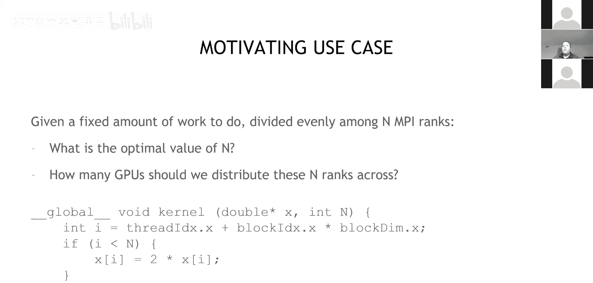
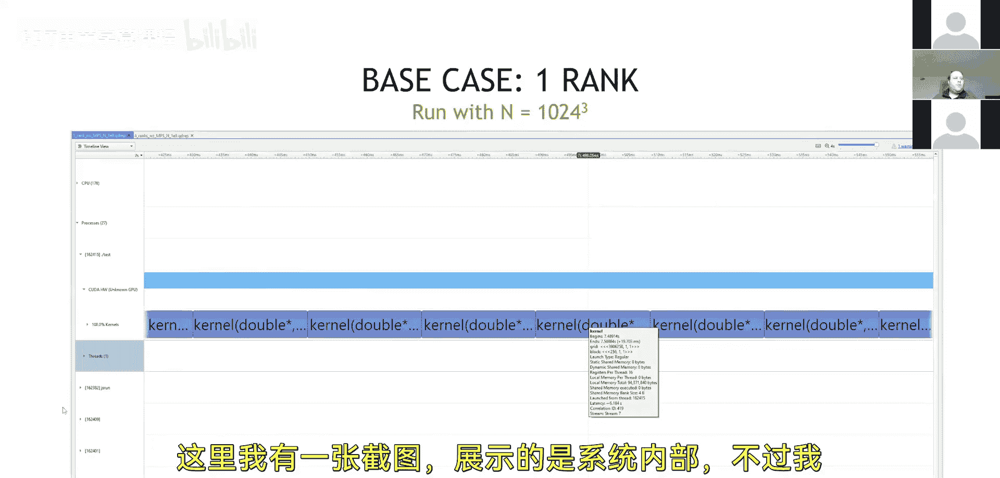
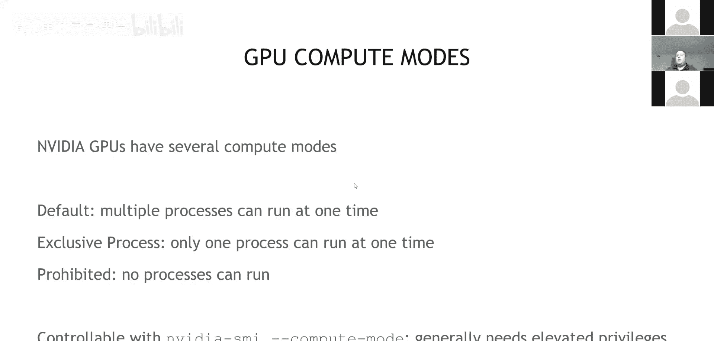

# 011：CUDA多进程服务 (MPS) 🚀

在本节课中，我们将学习CUDA多进程服务。我们将探讨当多个进程共享同一GPU时会发生什么，理解默认行为，并介绍MPS如何帮助提升此类场景的性能。

## 概述

在开始之前，我们先思考一个高性能计算中的常见问题：假设我有一个固定量的工作需要完成，我可以选择将其分配到N个MPI进程中。那么，如何确定最优的进程数N？以及，应该将这些进程分配到多少个GPU上？通常，我们会为每个进程分配一个GPU，并尽可能多地增加GPU数量以缩短求解时间，或者尽可能大地利用每个GPU的内存来处理问题。

## 一个简单的用例

为了具体分析，我们来看一个简单的CUDA C内核。这个内核的功能非常简单：它接收一个数组并将其中的每个元素加倍。这是一个典型的内存密集型工作负载。



```c
__global__ void double_array(double *array, int n) {
    int idx = blockIdx.x * blockDim.x + threadIdx.x;
    if (idx < n) {
        array[idx] = 2.0 * array[idx];
    }
}
```

这个工作负载的大小与数组长度`n`成正比。我们假设`n`为1024的三次方，即大约10亿个元素。对于一个双精度数组（每个元素8字节），这大约占用8GB内存，这已经接近现代GPU的显存容量。



在单个GPU上运行此内核（连续启动1000次）时，每次内核执行大约需要19.7毫秒。那么，一个自然的问题是：**我能否通过使用更多的MPI进程来加快速度？**

## 多进程与单GPU

上一节我们介绍了在单个GPU上运行单个进程的情况。本节中我们来看看，如果我们在同一个GPU上运行多个MPI进程，会发生什么。

NVIDIA GPU有几种计算模式，这些模式决定了GPU如何与同时运行的多个进程交互。

*   **默认模式**：这是GPU出厂时的设置。在此模式下，多个进程可以同时在一个GPU上运行。
*   **独占进程模式**：在此模式下，一个GPU一次只能被一个进程使用。这在共享工作站环境中很有用，可以防止用户相互干扰。

需要明确的是，在现代NVIDIA GPU上，**多个进程共享一个GPU在默认模式下是可行的**。MPS（多进程服务）旨在增强这种场景的性能，但并非引入了全新的功能。


不同的计算中心可能配置不同的默认模式。例如，在Summit超算上，默认分配的是独占进程模式，用户需要通过特定的作业标志来启用多进程共享。

## 性能分析实验

现在，让我们回到最初的问题：将同一个问题分解到多个MPI进程中，并在单个GPU上运行，性能会如何变化？

我进行了一个实验：将总问题大小（1024^3）平均分配给每个MPI进程，然后在单个GPU上运行不同数量的进程。

以下是测量结果（运行时间相对于单进程情况的比值）：

*   **1个进程**：基准，相对运行时间为1.0。
*   **2个进程**：相对运行时间约为1.10-1.12。
*   **3到约20个进程**：相对运行时间保持在大约1.10-1.12，没有显著恶化。

实验表明，当使用超过1个进程时，会产生大约10-12%的额外运行时间开销。但超过2个进程后，继续增加进程数（直到约20个），总运行时间基本保持稳定。



## 为什么需要考虑多进程？

既然没有让问题解决得更快，为什么我们还要考虑这种多进程共享GPU的场景呢？

原因在于实际的应用程序往往很复杂。许多遗留应用并未完全移植到GPU上运行，可能只有部分计算在GPU上执行，其余部分仍在CPU上。在这种情况下，你可能希望将CPU部分的工作分配到尽可能多的MPI进程中，以充分利用CPU资源，同时仍然让所有进程都能访问GPU进行计算。

默认的CUDA多进程支持使得这种混合计算模式成为可能，尽管会带来一些性能开销。

## 总结


本节课中我们一起学习了CUDA多进程服务的基础。我们了解到，默认情况下多个进程可以共享一个GPU，但这会引入约10%的性能开销。MPS服务的目的是优化这种多进程场景，减少开销。我们探讨了这种模式的应用场景，特别是在处理部分GPU化、部分CPU化的混合应用时，它提供了灵活的资源配置方式。