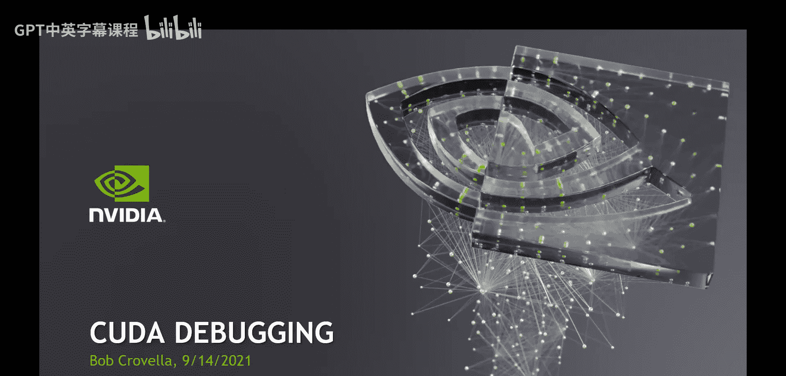
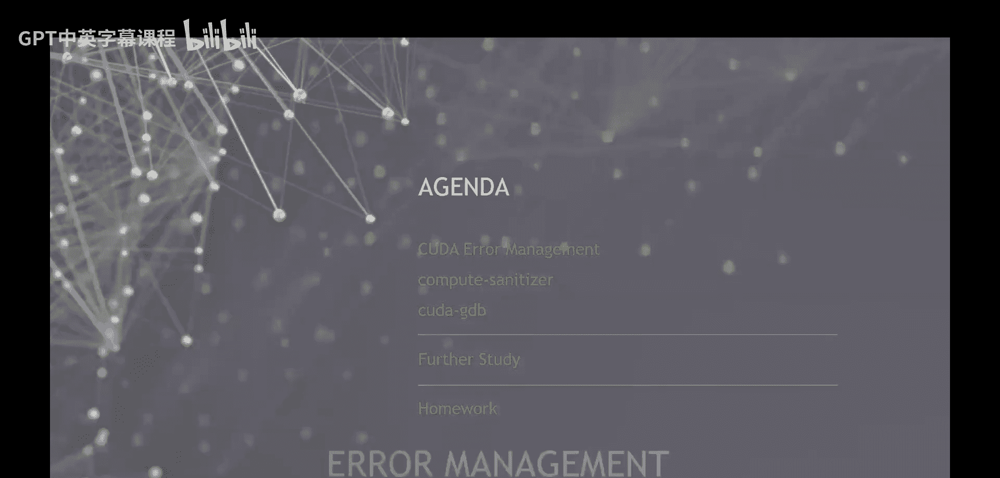
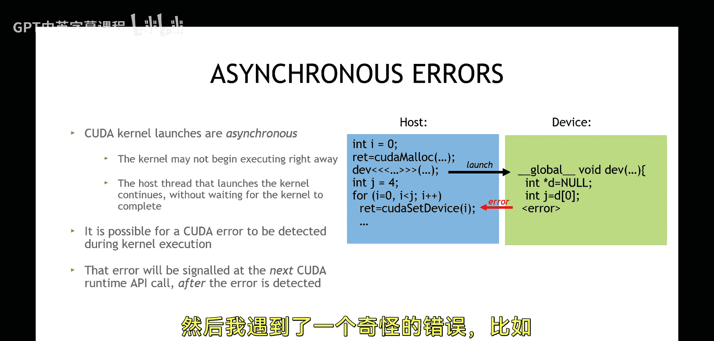

# 012：CUDA调试

## 概述
在本节课中，我们将学习如何调试CUDA程序。我们将从基础的CUDA错误管理开始，然后介绍两个重要的调试工具：Compute Sanitizer和CUDA-GDB。通过掌握这些知识和工具，你将能够更有效地识别和解决CUDA程序中的问题。

---

## CUDA错误管理

上一节我们介绍了课程的整体目标，本节中我们来看看调试的第一步：CUDA错误管理。

所有CUDA运行时API调用都会返回一个错误码。例如，`cudaSetDevice`就是一个CUDA运行时API调用。任何以“CUDA”开头、且非用户自定义的函数，几乎都属于CUDA运行时API。

这些API调用返回的错误码类型是一个枚举类型，称为`cudaError_t`。然而，在开发中，我们经常看到开发者忽略这个错误码，例如直接调用`cudaSetDevice`而不检查其返回值。这是一种不严谨的做法。

如果你在CUDA代码中遇到问题，首要建议就是确保你进行了严谨的错误检查。严谨意味着捕获每一个CUDA运行时API调用的错误码，并进行适当的处理。如果返回的错误码不是`cudaSuccess`这个枚举值，至少应该打印出错误信息。

CUDA运行时API还提供了一个内置函数`cudaGetErrorString`。这个函数接收一个`cudaError_t`类型的值，并将其转换为人类可读的英文文本字符串。因此，最佳实践是始终检查这些错误码，并通过`cudaGetErrorString`打印出可读的错误信息。

---

## 内核错误检查

上一节我们介绍了如何检查CUDA运行时API的错误，本节中我们来看看如何检查内核启动的错误。

首先需要明确，CUDA内核启动是异步的。这意味着内核从主机线程（CPU代码）启动后，会与CPU线程并发执行。CPU线程不会自动获得内核何时完成执行的明确指示。

更重要的是，如果内核代码在执行过程中遇到错误，这个错误会在CPU代码后续某个不确定的时间点被报告。这可能导致一个看似无关的CUDA运行时API调用（例如`cudaSetDevice`）返回一个奇怪的错误，例如“misaligned address”或“illegal address”。这实际上是之前内核执行失败所遗留的错误状态。

因此，我们需要一种方法来检查内核执行是否出错。由于内核启动本身不返回错误码，我们需要使用`cudaGetLastError`函数。这个函数会获取上一次内核启动或CUDA运行时API调用产生的错误状态。

以下是检查内核错误的推荐方法：
1.  在内核启动后，立即调用`cudaGetLastError`来捕获启动阶段的错误（例如参数配置错误）。
2.  在内核执行完成后（通常通过`cudaDeviceSynchronize`或流同步来确保），再次调用`cudaGetLastError`来捕获内核执行过程中的错误。

通过这种方式，我们可以将错误定位到具体的操作步骤。

---

## 调试工具：Compute Sanitizer

上一节我们学习了如何通过代码进行错误检查，本节中我们来看看第一个自动化调试工具：Compute Sanitizer。

Compute Sanitizer 是一个功能强大的工具集，用于检测CUDA应用程序中的多种内存访问和同步错误。它类似于CPU上的Valgrind或AddressSanitizer工具。

以下是Compute Sanitizer提供的主要检查功能：
*   **内存访问错误**：检测越界访问、使用未初始化内存等。
*   **竞争条件**：检测多个线程对共享内存的不安全访问。
*   **初始化错误**：检测设备全局内存的初始化问题。
*   **同步错误**：检测死锁等同步问题。

使用Compute Sanitizer的基本方法是在编译时添加`-lineinfo`选项以保留行号信息，然后在运行时通过环境变量或命令行参数来启用特定的检查器。例如，使用`compute-sanitizer --tool memcheck ./my_cuda_app`来运行内存检查。

该工具会生成详细的报告，指出错误类型、发生位置（源代码文件和行号）以及相关的调用栈信息，极大地简化了内存和并发错误的调试过程。

---

## 调试工具：CUDA-GDB

上一节我们介绍了用于自动化错误检测的Compute Sanitizer，本节中我们来看看另一个强大的交互式调试工具：CUDA-GDB。

CUDA-GDB是GNU调试器（GDB）的扩展版本，专门用于调试CUDA应用程序。它允许开发者像调试CPU代码一样，交互式地调试运行在GPU上的内核代码。

以下是CUDA-GDB的一些核心功能：
*   **设置断点**：可以在主机代码或设备内核代码中设置断点。
*   **单步执行**：可以逐行执行内核代码。
*   **检查变量**：可以查看主机和设备上的变量值。
*   **线程检查**：可以检查和切换当前聚焦的CUDA线程（blockIdx, threadIdx）。
*   **检查GPU状态**：可以查询GPU的寄存器、共享内存、本地内存状态。

使用CUDA-GDB进行调试通常遵循以下流程：
1.  使用`-g -G`标志编译CUDA代码（`-g`用于主机代码调试信息，`-G`用于设备代码调试信息）。
2.  在终端启动CUDA-GDB：`cuda-gdb ./my_cuda_app`。
3.  在GDB提示符下，使用标准的GDB命令（如`break`, `run`, `next`, `print`）以及CUDA扩展命令（如`cuda thread`, `cuda block`）进行调试。

通过CUDA-GDB，开发者可以深入内核内部，观察每一步的执行状态，这对于理解复杂的数据流和定位逻辑错误至关重要。

---

## 总结
本节课中我们一起学习了CUDA程序调试的核心知识。我们从基础的CUDA错误管理开始，强调了检查所有CUDA运行时API调用和内核执行状态的重要性。接着，我们介绍了两个强大的工具：Compute Sanitizer用于自动化检测内存和并发错误，CUDA-GDB用于交互式地调试内核代码逻辑。掌握这些方法和工具，将帮助你更高效地开发和排除CUDA应用程序中的故障。