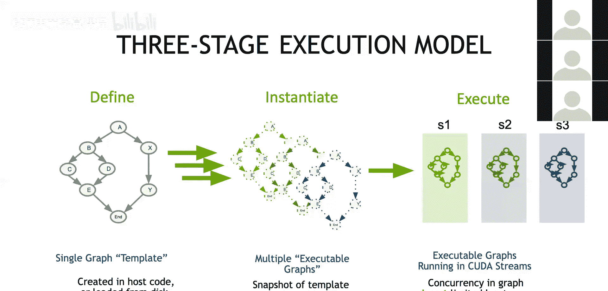

# 013：CUDA Graphs 🚀

在本节课中，我们将要学习CUDA Graphs，这是CUDA中一项用于提升性能的特性。我们将专注于其核心概念，帮助初学者理解如何利用CUDA Graphs来优化程序执行。

---

## 概述

CUDA Graphs是一种将一系列CUDA操作（如内核启动、内存拷贝）及其依赖关系定义为独立于执行过程的结构。通过一次性定义并重复执行这个“图”，可以显著减少CPU的启动开销，从而提升整体性能，尤其是在执行大量短时内核时。

---

## 什么是CUDA Graphs？

CUDA Graphs是一系列由依赖关系连接的操作节点，其定义与执行过程是分离的。所有传统的CUDA工作流本质上都隐式地形成了一个执行图。

例如，一个包含三个内核启动的基本CUDA代码，在默认流中会形成一个线性的、由流顺序隐式定义依赖关系的图。

从左侧的传统流式执行，到右侧的图表示，我们可以看到CUDA Graphs是如何将工作流抽象为节点和依赖关系的。

---

## 图的节点与依赖

构成CUDA Graph的节点可以是任何异步CUDA操作。

以下是节点类型的示例：
*   内核启动（Kernel Launch）
*   内存拷贝（Memory Copy）
*   事件（Events）
*   CUDA回调函数（Callback Functions）

节点之间的依赖关系可以通过两种方式建立：
*   隐式依赖：由流中操作的顺序执行决定。
*   显式依赖：通过`cudaStreamWaitEvent`和事件信号来明确指定。

此外，图还可以包含子图，这增加了构建复杂工作流的灵活性。

---

## 图的优势：定义一次，重复执行

CUDA Graphs的核心优势在于，它可以被定义一次，然后重复执行多次。

这意味着我们只需支付一次图的构建成本，之后仅需一个简单的执行操作即可启动整个可能非常复杂的图。相比之下，传统的流式工作流需要逐个启动操作，并且每次想重新运行整个工作流时都需要重新提交所有命令。

当需要多次重复执行相同的工作流时，这种模式能有效回收CPU时间，实现延迟隐藏。

---

## 性能对比：流 vs. 图

下面的图示对比了两种执行模式。

在流式执行（上方）中，CPU需要忙碌地逐个启动内核，而GPU可能在等待下一个启动指令时处于空闲状态。

在图执行（下方）中，通过一次`cudaGraphLaunch`调用，整个图被隐式地提交执行，从而释放了CPU去处理其他任务，减少了GPU的空闲等待时间。

当内核执行时间非常短（接近甚至小于启动开销）时，使用图来减少累积的启动延迟尤为重要。启动开销通常在几微秒量级。

需要明确的是，使用CUDA Graphs并不会改变内核在GPU上的纯运行性能，其主要目标是降低程序的综合启动成本。

---

## CUDA Graphs的三阶段执行模型

CUDA Graphs的执行遵循一个清晰的三阶段模型：

1.  **定义（Define）**：在此阶段，我们构建图的结构。我们指定节点（操作）、参数、依赖关系、目标GPU和启动流等信息。
2.  **实例化（Instantiate）**：将定义好的图转换为一个可执行的“图实例”。此过程会固定图的参数，为执行做准备。
3.  **执行（Execute）**：将实例化的图启动到指定的CUDA流中运行。

---

## 总结

本节课我们一起学习了CUDA Graphs的基础知识。我们了解到，CUDA Graphs通过将一系列操作及其依赖预定义为图，实现了“定义一次，重复执行”的模式。这能有效减少CPU的启动开销，尤其有利于优化由大量短时内核构成的工作流，从而提升应用程序的整体性能。其核心的三阶段模型（定义、实例化、执行）为管理复杂的GPU操作提供了清晰的框架。