# 001：NVIDIA CUDA中的HelloWorld程序写法 🚀

在本节课中，我们将学习如何编写和运行CUDA程序。我们将从最简单的“Hello World”程序开始，逐步探索其不同变体，并了解如何执行多线程程序以及如何在GPU上分配内存。

---

## 概述

本节课是CUDA编程的入门。我们将首先了解一个基本的CUDA程序结构，然后分析其执行流程。接着，我们会探讨如何通过多线程来并行执行任务，并学习如何管理CPU与GPU之间的异步执行和数据传输。课程的核心目标是理解CUDA内核（Kernel）的启动机制以及线程层次结构。

---

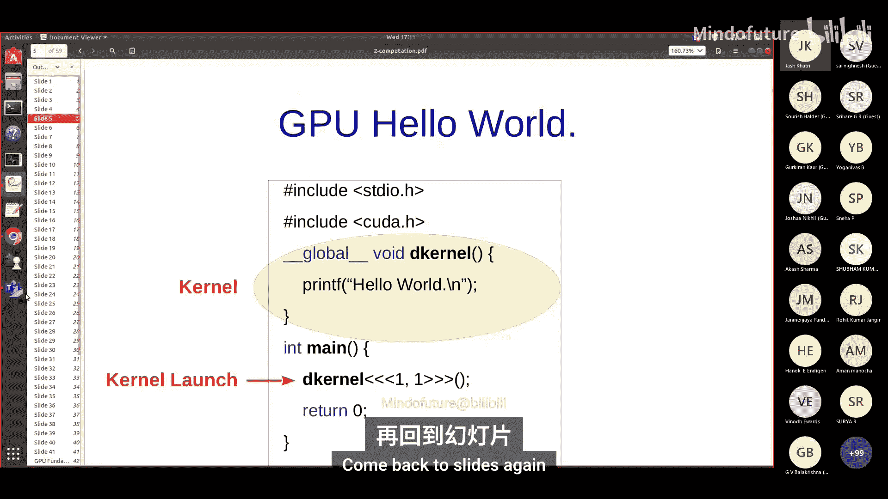

## CPU上的Hello World程序

首先，我们来看一个用C语言编写的标准“Hello World”程序。这个程序与CUDA无关，完全在CPU上运行。

```c
#include <stdio.h>

int main() {
    printf("Hello World\n");
    return 0;
}
```

使用GCC编译器编译并运行此程序，会在屏幕上输出“Hello World”。

```
gcc hello_world.c -o hello_world
./hello_world
```

---

## 第一个CUDA Hello World程序


现在，我们来看一个在GPU上运行的“Hello World”程序。它与CPU版本有三个关键区别。

```c
#include <stdio.h>
#include <cuda_runtime.h> // 区别1：包含CUDA头文件

// 区别2：使用 __global__ 关键字声明GPU内核函数
__global__ void d_kernel() {
    printf("Hello World\n");
}

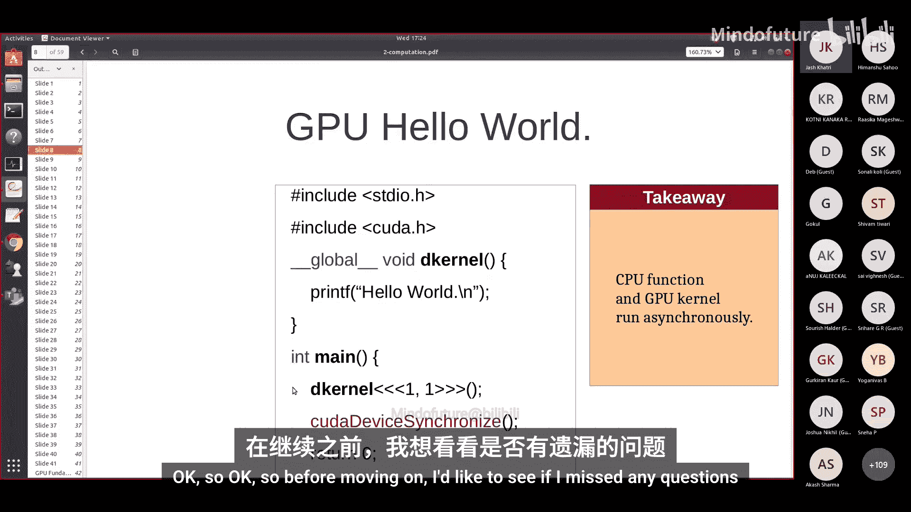

int main() {
    // 区别3：使用特殊语法启动内核，<<<1, 1>>> 表示用1个线程块，每个块1个线程
    d_kernel<<<1, 1>>>();
    cudaDeviceSynchronize(); // 等待GPU内核执行完成
    return 0;
}
```

### 关键概念解析

1.  **头文件**：`#include <cuda_runtime.h>` 是编写CUDA代码所必需的，它包含了CUDA相关的函数和类型定义。
2.  **内核函数**：`__global__` 关键字告诉编译器，`d_kernel` 是一个GPU内核函数，它将在GPU上执行，而不是在CPU上。
3.  **内核启动**：`d_kernel<<<1, 1>>>()` 是启动内核的语法。`<<<1, 1>>>` 中的两个参数定义了线程的配置：
    *   第一个 `1` 表示线程块（Block）的数量。
    *   第二个 `1` 表示每个线程块中的线程（Thread）数量。
    *   因此，`<<<1, 1>>>` 表示启动一个包含1个线程的线程块，即总共只有1个线程执行该内核。

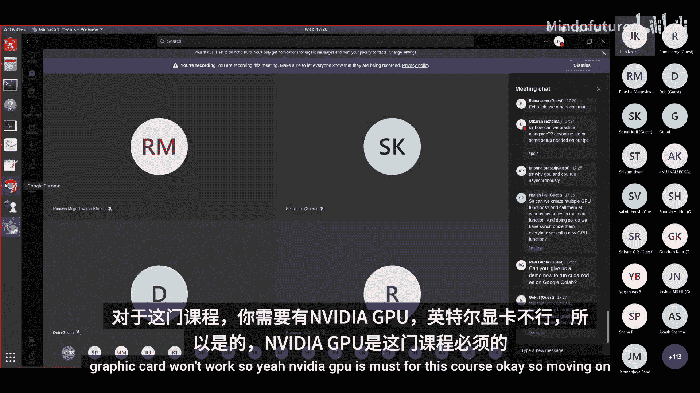

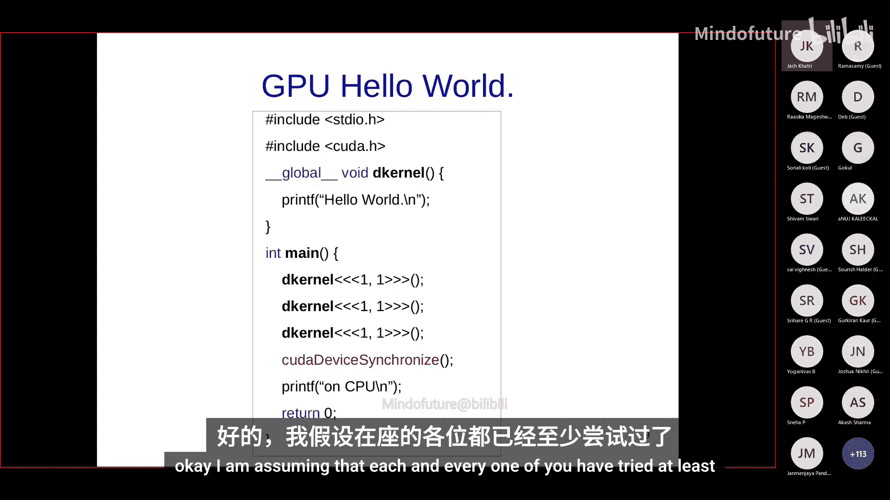

**注意**：如果省略 `cudaDeviceSynchronize()`，程序可能不会输出任何内容。这是因为CPU在启动内核后不会等待GPU完成，而是继续执行并可能提前结束程序。`cudaDeviceSynchronize()` 的作用是让CPU等待所有GPU线程执行完毕。


---

## 多个内核的调用顺序

上一节我们介绍了单个内核的启动。本节中我们来看看当程序中有多个内核调用时，它们的执行顺序是怎样的。

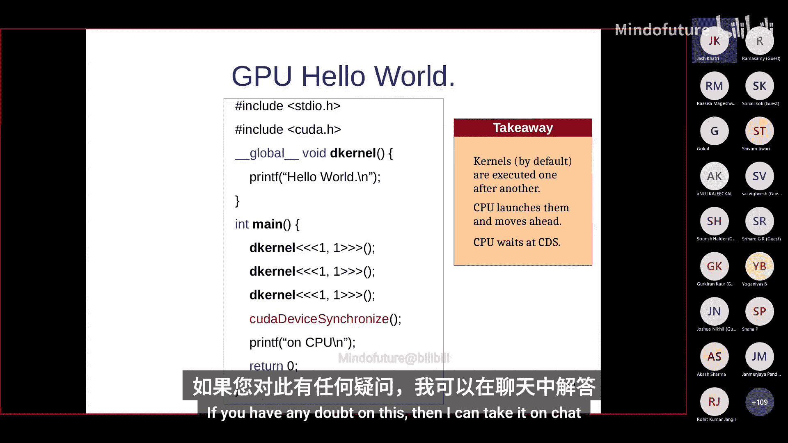

```c
__global__ void d_kernel() {
    printf("Hello World\n");
}

int main() {
    d_kernel<<<1, 1>>>();
    d_kernel<<<1, 1>>>();
    d_kernel<<<1, 1>>>();
    cudaDeviceSynchronize();
    printf("on CPU\n");
    return 0;
}
```


### 执行流程分析

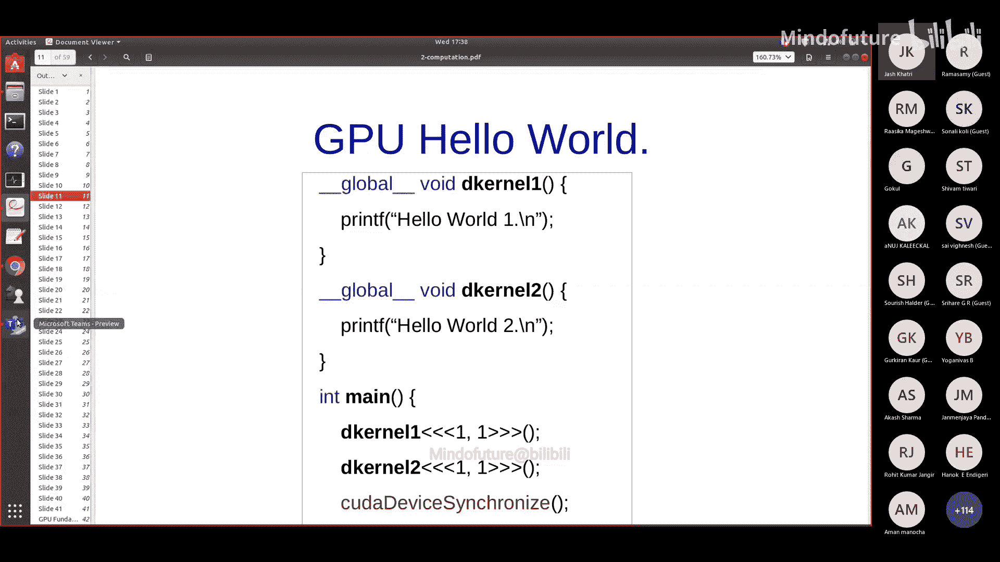

1.  CPU按顺序将三个内核调用放入一个默认的队列（称为“流”，Stream）中。
2.  GPU从这个队列中按先进先出（FIFO）的顺序取出并执行内核。
3.  `cudaDeviceSynchronize()` 确保CPU等待队列中所有内核执行完毕。
4.  最后，CPU执行 `printf(“on CPU\n”)`。

因此，输出结果是确定性的：三行“Hello World”，然后是一行“on CPU”。内核的执行是串行的（一个接一个），但这是GPU内部的串行，CPU在启动它们后就去等待了。

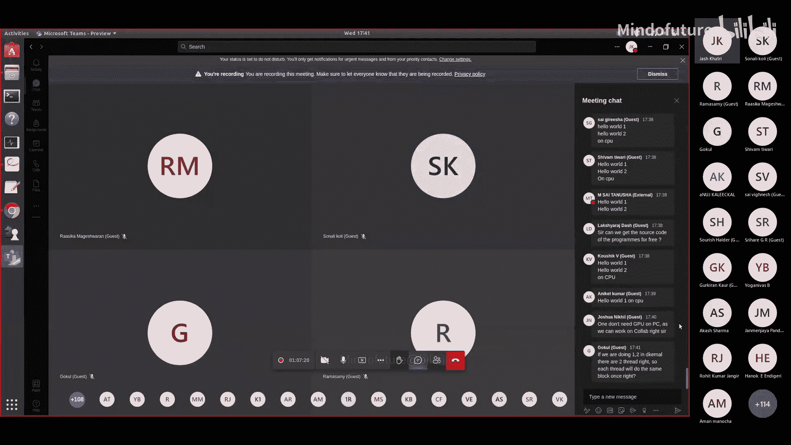

---

## CPU与GPU的异步执行

我们调整一下代码顺序，观察CPU和GPU异步执行的影响。

```c
int main() {
    d_kernel<<<1, 1>>>();
    d_kernel<<<1, 1>>>();
    printf("on CPU\n");
    cudaDeviceSynchronize(); // 注意：同步调用放到了打印语句之后
    return 0;
}
```

### 可能的输出结果

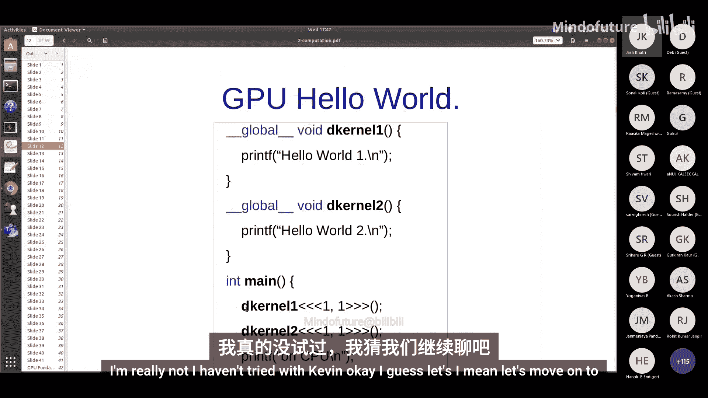

由于CPU和GPU是异步执行的，输出顺序变得不确定。以下是几种可能的情况：


1.  `on CPU` -> `Hello World` -> `Hello World`
2.  `Hello World` -> `on CPU` -> `Hello World`
3.  `Hello World` -> `Hello World` -> `on CPU`

**关键点**：
*   CPU启动内核后立即继续执行后面的 `printf` 语句。
*   两个内核在默认流中仍按顺序执行（`Hello World` 总是先于第二个 `Hello World` 打印）。
*   `cudaDeviceSynchronize()` 保证了两个内核最终都会执行完毕，但无法控制它相对于CPU `printf` 的执行时机。

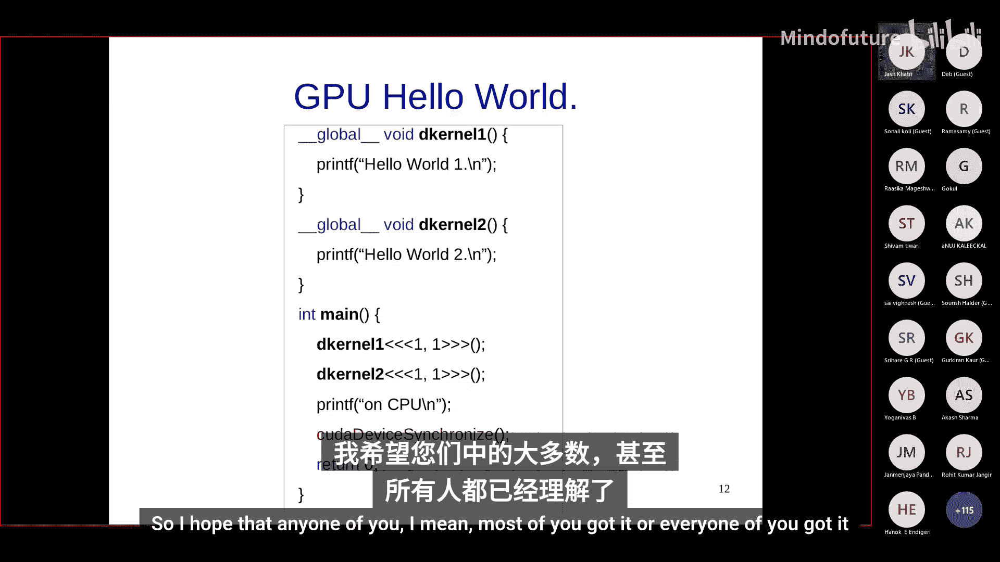

---

## 混合CPU与GPU打印任务

让我们看一个更复杂的例子，其中混合了CPU和GPU的打印任务。


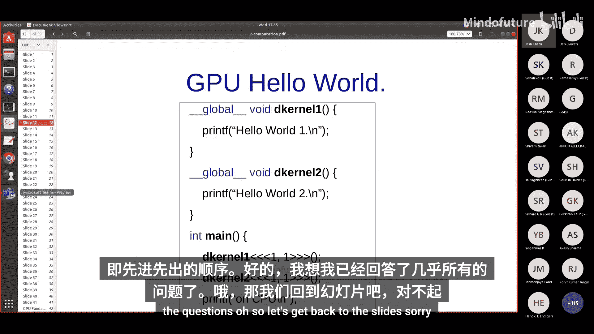

```c
int main() {
    d_kernel<<<1, 1>>>();
    printf("CPU1\n");
    d_kernel<<<1, 1>>>();
    printf("CPU2\n");
    d_kernel<<<1, 1>>>();
    printf("CPU3\n");
    cudaDeviceSynchronize();
    printf("on CPU\n");
    return 0;
}
```

### 并行性分析

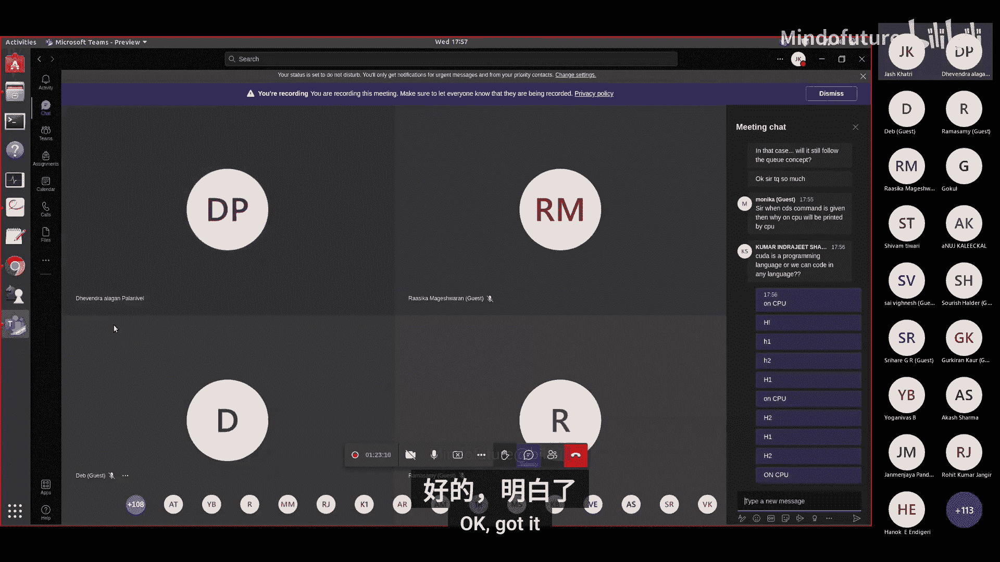

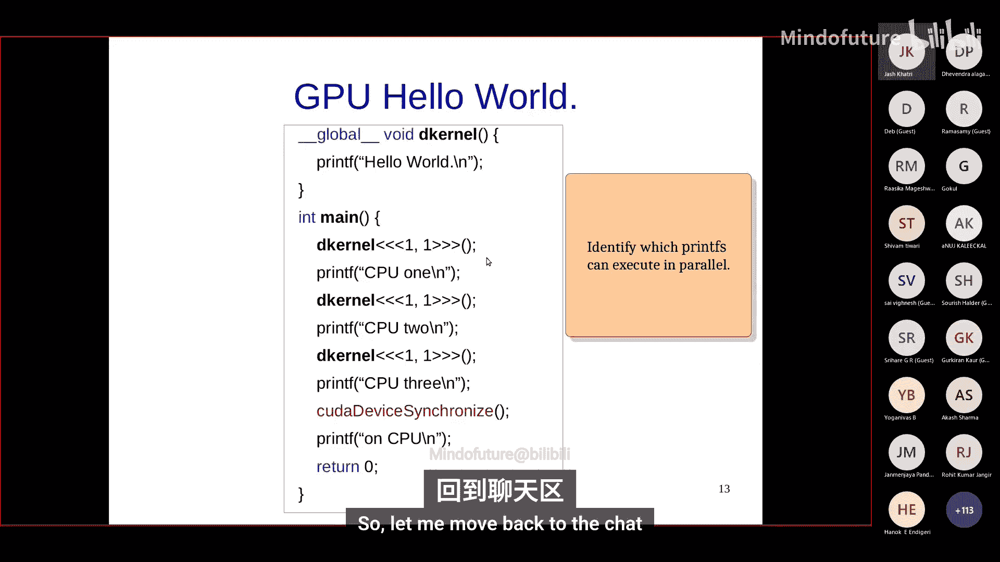

在这个例子中，以下操作可以并行执行：
*   GPU执行三个 `d_kernel` 打印“Hello World”。
*   CPU执行三个 `printf` 打印“CPU1”、“CPU2”、“CPU3”。

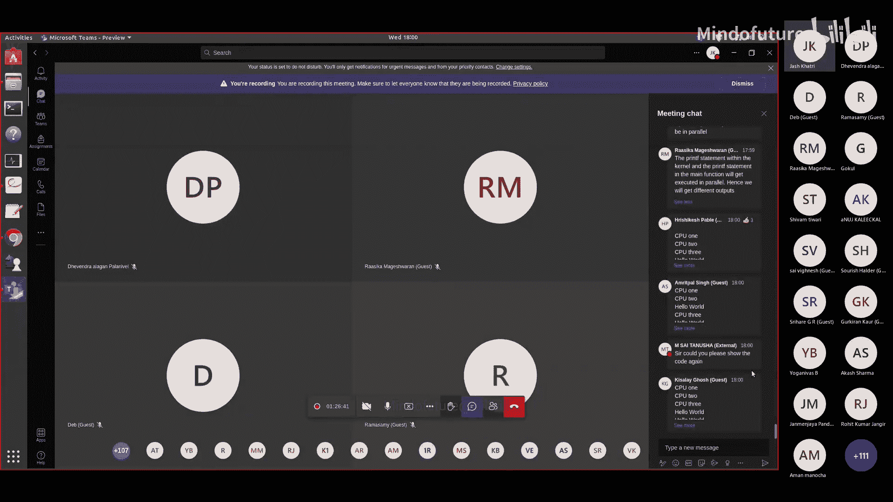

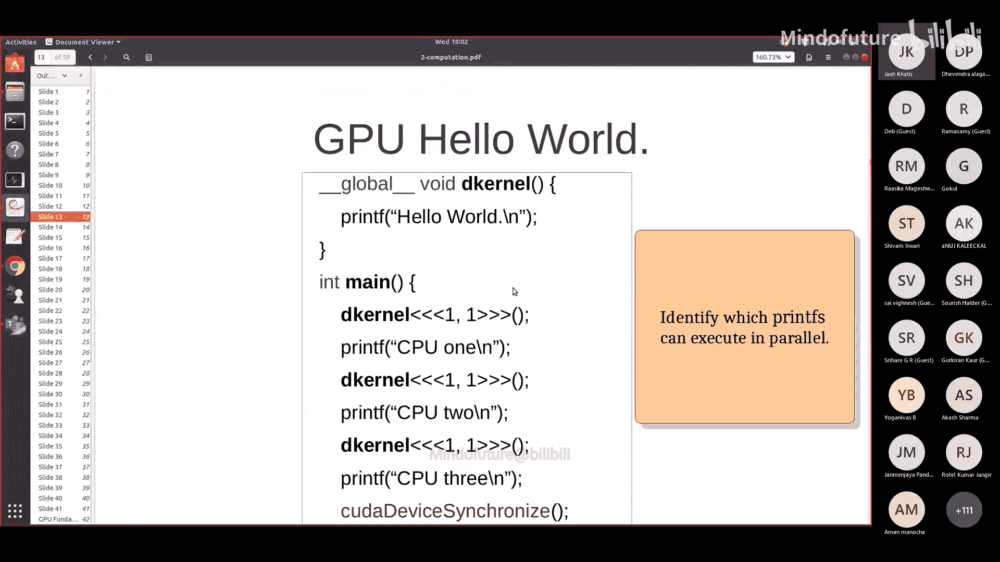

因此，你可能会看到“CPU1/2/3”与“Hello World”交错打印的输出。然而，由于 `cudaDeviceSynchronize()` 的存在，最后的 `”on CPU”` 一定会在所有GPU内核执行完毕后才打印。

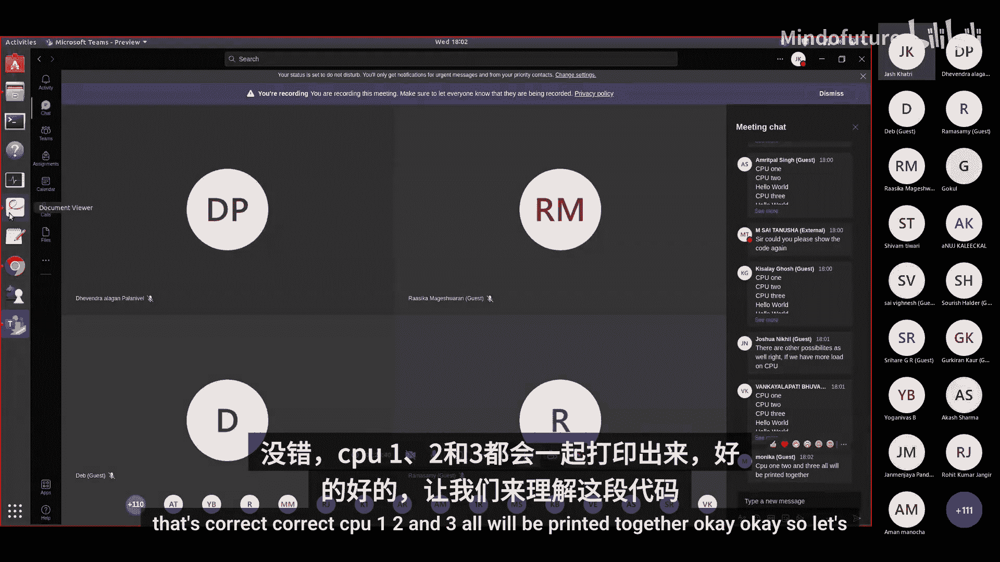

一个常见的输出顺序是：`CPU1 CPU2 CPU3` -> 三个 `Hello World` -> `on CPU`。这是因为CPU执行速度通常很快，在GPU完成大量工作前就可能完成了自己的打印任务。

---

## 使用多线程并行打印

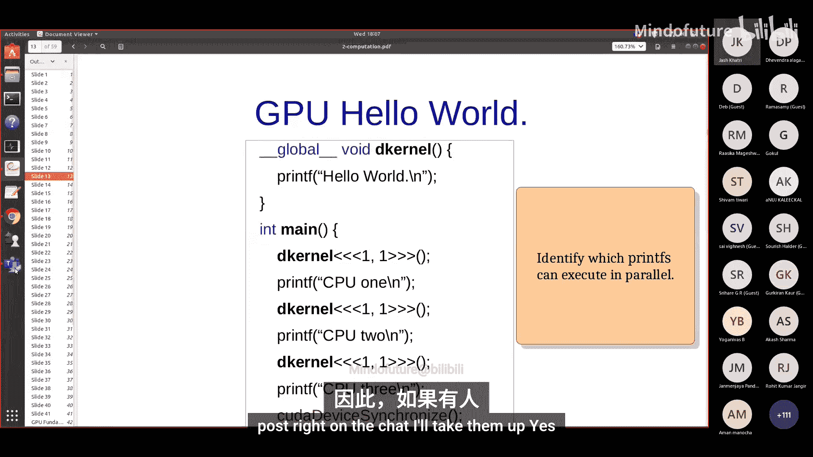

前面的例子每个内核只使用一个线程。CUDA的强大之处在于大规模并行。以下是如何用多个线程打印“Hello World”。


```c
__global__ void d_kernel() {
    printf("Hello World\n");
}

int main() {
    // 启动1个线程块，该块中包含32个线程
    d_kernel<<<1, 32>>>();
    cudaDeviceSynchronize();
    return 0;
}
```

编译并运行此程序，将会看到“Hello World”被打印了32次，每个线程执行一次 `printf` 语句。

**线程配置公式**：`<<<NumBlocks, ThreadsPerBlock>>>`
*   `NumBlocks`：线程网格（Grid）中线程块的数量。
*   `ThreadsPerBlock`：每个线程块中的线程数量。
*   总线程数 = `NumBlocks * ThreadsPerBlock`

---

## 并行计算示例：打印平方数

上一节我们介绍了如何用多线程执行相同任务。本节中我们来看看如何让每个线程处理不同的数据。假设我们想并行计算并打印0到99的平方。

### 思路分析

目标是让线程i计算并打印 i * i。我们需要一种方法让每个线程知道自己独特的索引（ID）。

```c
__global__ void square_kernel() {
    int tid = threadIdx.x; // 获取当前线程在线程块内的索引（0到ThreadsPerBlock-1）
    printf(“Square of %d is %d\n”, tid, tid * tid);
}

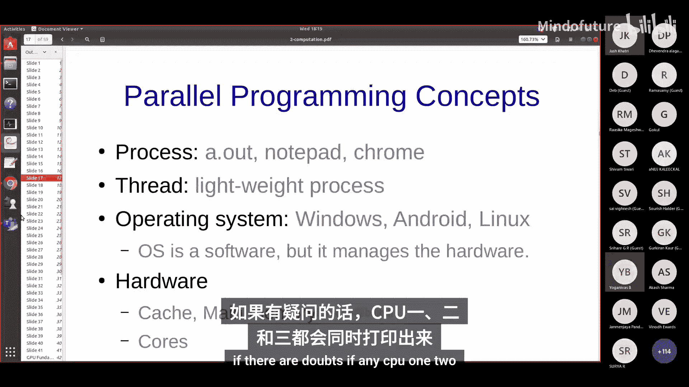

int main() {
    int n = 100;
    // 启动1个线程块，包含100个线程
    square_kernel<<<1, n>>>();
    cudaDeviceSynchronize();
    printf(“on CPU\n”);
    return 0;
}
```

**代码解释**：
*   `threadIdx.x` 是一个内置变量，表示线程在其所属线程块中的x维度索引。
*   由于我们只使用了一个线程块（`<<<1, n>>>`），`threadIdx.x` 的范围是0到n-1。
*   每个线程根据自己独有的 `tid` 计算平方并打印。

**注意**：由于所有线程是并行执行的，打印输出的顺序可能是混乱的（即非从0到99的顺序）。这是并行编程中常见的现象，如果需要顺序输出，则需要额外的同步或排序操作。

---


## 核心概念回顾

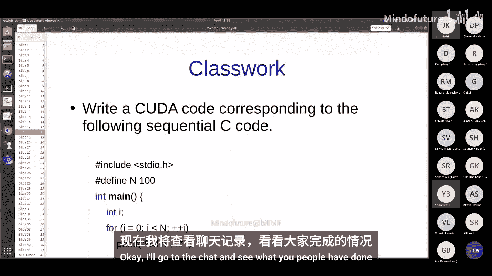

在深入代码之前，我们先简要回顾一些核心的计算机系统概念，这有助于理解CUDA的线程模型。

1.  **进程（Process）**：正在执行的程序实例。它拥有独立的地址空间，包含代码、数据、堆栈等资源。例如，打开的Word应用程序就是一个进程。
2.  **线程（Thread）**：进程内的一个执行流。它是“轻量级进程”，与同进程的其他线程共享代码和全局数据，但拥有独立的栈和寄存器。例如，Word中的拼写检查功能可以是一个独立的线程。
3.  **操作系统（OS）**：管理硬件资源和为用户程序提供服务的软件。例如，Linux， Windows。
4.  **硬件组件**：
    *   **缓存（Cache）**：靠近处理器的小容量高速内存，用于加速数据访问。
    *   **主存（RAM）**：容量更大的内存，用于存储正在运行的程序和数据。
    *   **核心（Core）**：执行线程的物理处理单元。一个核心同一时刻只能执行一个线程。线程可能会在不同的核心之间调度（“跳跃”）。

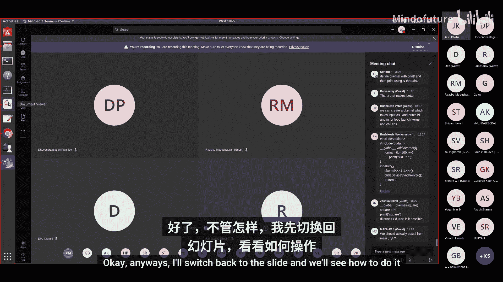

在CUDA中，我们创建成千上万个线程，它们被组织成线程块和网格，在GPU的众多核心上并行执行。

---

## 总结

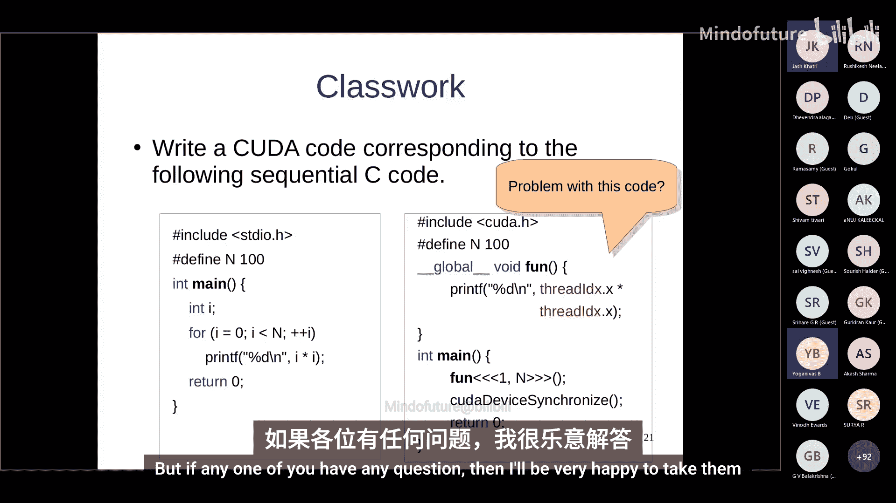

本节课我们一起学习了CUDA并行编程的基础。我们从最简单的“Hello World”程序出发，理解了CUDA内核函数（用 `__global__` 修饰）的概念以及如何用 `<<<…>>>` 语法启动内核。我们探讨了CPU与GPU的异步执行特性，并学习了使用 `cudaDeviceSynchronize()` 进行同步。通过示例，我们看到了如何配置多线程（`<<<NumBlocks, ThreadsPerBlock>>>`）来并行执行任务，以及如何利用 `threadIdx.x` 让每个线程处理不同的数据。这些概念是构建更复杂、高性能CUDA应用程序的基石。