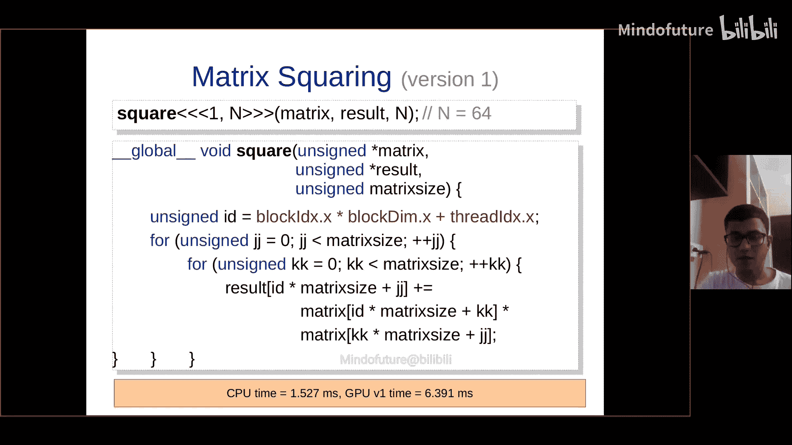
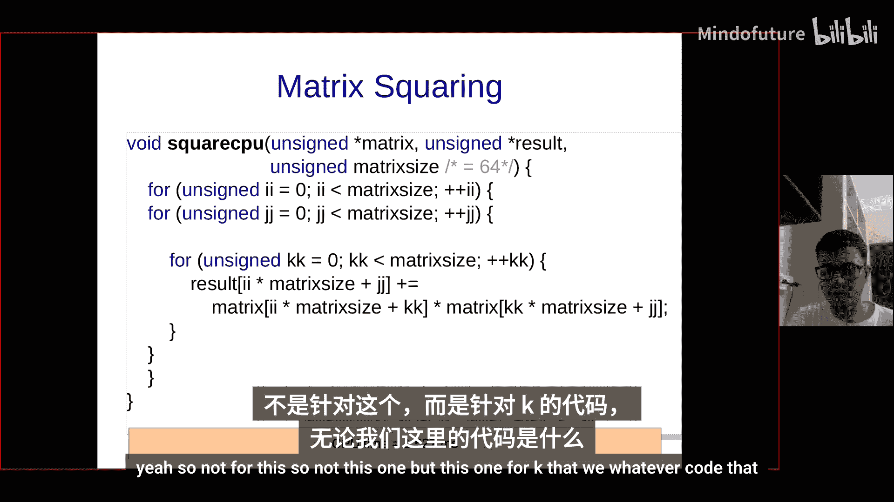
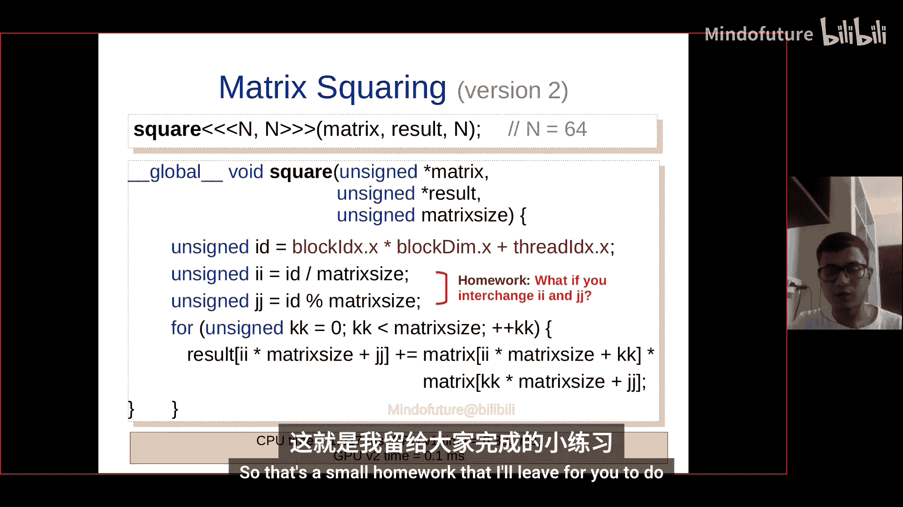
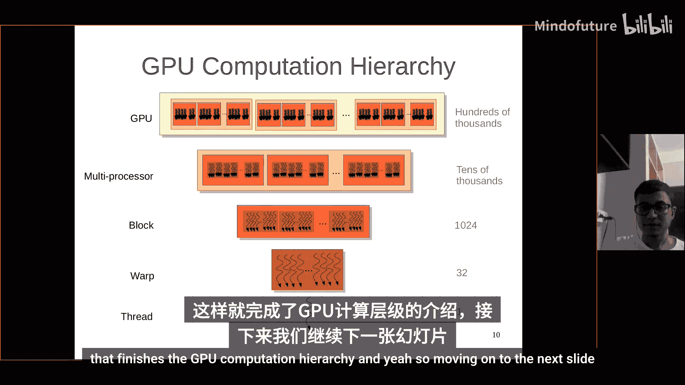
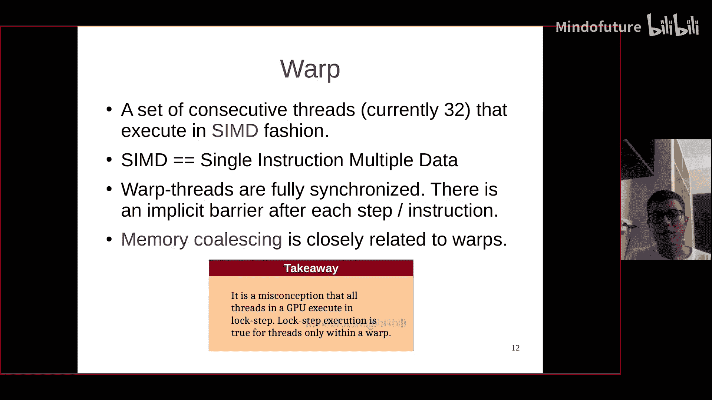
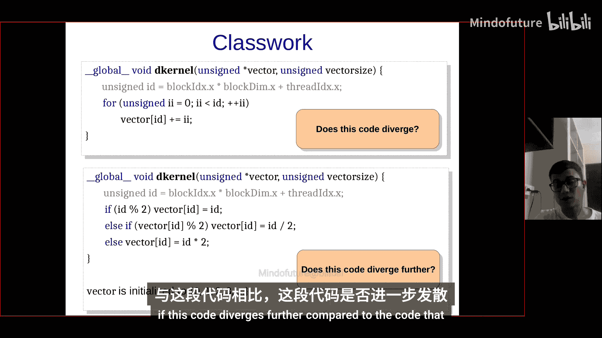
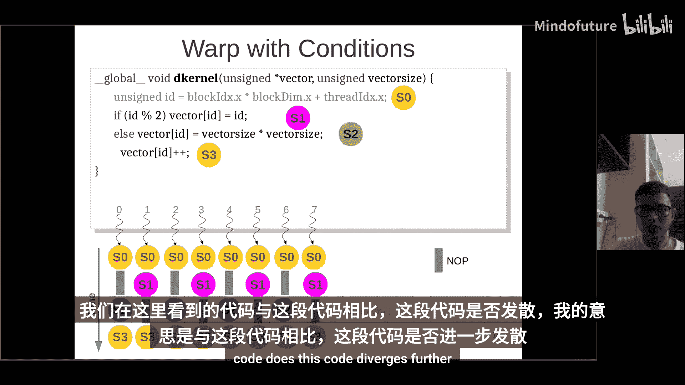
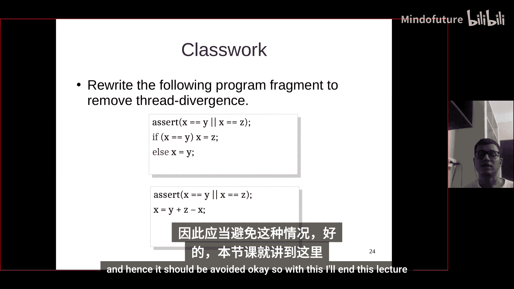
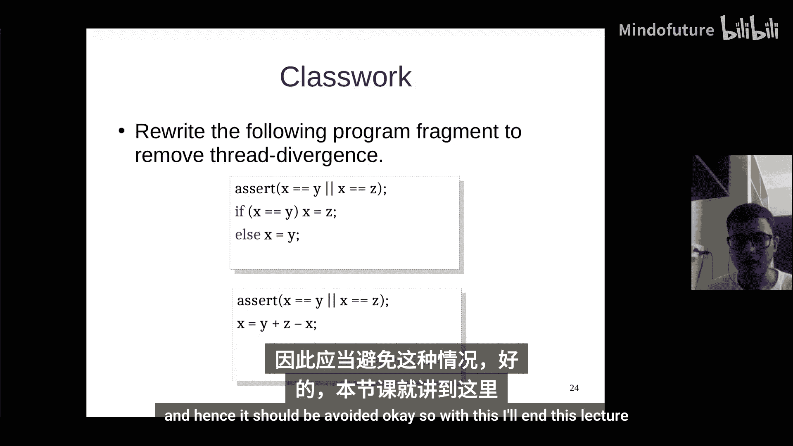

# 004：GPU计算层次与线程发散

在本节课中，我们将学习如何为大规模数据启动CUDA内核，深入理解GPU的计算层次结构，并探讨线程发散问题及其对性能的影响。

## 概述

上一节我们介绍了线程在GPU上的组织方式，包括网格、线程块以及线程ID的计算。本节中，我们将看看如何为大规模数据启动内核，理解GPU的底层执行单元——线程束，并分析条件分支如何导致线程发散，从而影响性能。

## 为大规模数据启动内核

当数据规模巨大时，我们需要计算合适的线程块数量来启动内核。以下是一个示例，展示了如何根据用户指定的数据大小动态计算所需的线程块数量。

```c
#include <stdio.h>
#include <cuda.h>

#define BLOCK_SIZE 1024

__global__ void initVectorKernel(unsigned int *vector, unsigned int vector_size) {
    unsigned int id = blockIdx.x * blockDim.x + threadIdx.x;
    if (id < vector_size) {
        vector[id] = id;
    }
}

int main(int argc, char *argv[]) {
    unsigned int n = atoi(argv[1]);
    unsigned int *d_vector, *h_vector;

    cudaMalloc(&d_vector, n * sizeof(unsigned int));
    h_vector = (unsigned int*)malloc(n * sizeof(unsigned int));

    unsigned int num_blocks = (n + BLOCK_SIZE - 1) / BLOCK_SIZE;
    printf("Number of blocks: %u\n", num_blocks);

    initVectorKernel<<<num_blocks, BLOCK_SIZE>>>(d_vector, n);
    cudaMemcpy(h_vector, d_vector, n * sizeof(unsigned int), cudaMemcpyDeviceToHost);

    for (int i = 0; i < n; i++) {
        printf("%u ", h_vector[i]);
    }
    printf("\n");

    free(h_vector);
    cudaFree(d_vector);
    return 0;
}
```

以下是代码中需要解决的两个关键问题及其解决方案：

1.  **整数除法问题**：使用 `(n + BLOCK_SIZE - 1) / BLOCK_SIZE` 代替 `n / BLOCK_SIZE`，确保当 `n` 不能被 `BLOCK_SIZE` 整除时，能分配足够的线程块。
2.  **内存越界访问**：在内核函数中添加条件判断 `if (id < vector_size)`，确保只有有效的线程ID才会执行内存写入操作，防止访问非法内存地址。

## 矩阵平方应用：从CPU到GPU的并行化

我们以一个矩阵平方运算为例，展示如何逐步将其从CPU版本并行化到GPU上，并分析性能变化。

### CPU版本

CPU版本的矩阵平方使用三层嵌套循环，时间复杂度为 **O(n³)**。

```c
void matrixSquareCPU(float *matrix, float *result, int n) {
    for (int i = 0; i < n; i++) {
        for (int j = 0; j < n; j++) {
            float sum = 0.0f;
            for (int k = 0; k < n; k++) {
                sum += matrix[i * n + k] * matrix[k * n + j];
            }
            result[i * n + j] = sum;
        }
    }
}
```
对于一个64x64的矩阵，CPU执行时间约为 **1.52毫秒**。

### GPU版本1：仅并行化外层循环





在第一个GPU版本中，我们仅并行化了最外层的 `i` 循环。每个线程负责计算结果矩阵的一整行。

```c
__global__ void matrixSquareGPUv1(float *matrix, float *result, int n) {
    int i = blockIdx.x * blockDim.x + threadIdx.x;
    if (i < n) {
        for (int j = 0; j < n; j++) {
            float sum = 0.0f;
            for (int k = 0; k < n; k++) {
                sum += matrix[i * n + k] * matrix[k * n + j];
            }
            result[i * n + j] = sum;
        }
    }
}
// 内核启动: <<<1, n>>>
```
这个版本存在两个问题：
1.  每个线程内部仍有大量串行工作（`j` 和 `k` 循环）。
2.  并行度仅为 `n`（例如64），远未充分利用GPU的数千个核心。
因此，其执行时间（**6.39毫秒**）甚至比CPU版本更慢。

### GPU版本2：并行化两个外层循环



为了提升并行度，我们同时并行化 `i` 和 `j` 循环。每个线程负责计算结果矩阵中的一个单独元素。

```c
__global__ void matrixSquareGPUv2(float *matrix, float *result, int n) {
    int id = blockIdx.x * blockDim.x + threadIdx.x;
    int i = id / n;
    int j = id % n;
    if (i < n && j < n) {
        float sum = 0.0f;
        for (int k = 0; k < n; k++) {
            sum += matrix[i * n + k] * matrix[k * n + j];
        }
        result[i * n + j] = sum;
    }
}
// 内核启动: <<<(n*n + BLOCK_SIZE -1)/BLOCK_SIZE, BLOCK_SIZE>>>
```
这个版本取得了显著改进：
*   **并行度**：提升到 `n * n`（例如4096）。
*   **串行工作**：每个线程仅剩一个 `k` 循环。
其执行时间大幅降低至 **0.1毫秒**，优于CPU版本。

**注意**：最内层的 `k` 循环涉及对同一内存位置（`sum`）的累加，如果直接并行化会导致**数据竞争**，需要同步机制，这将在后续课程中讨论。

## GPU计算层次结构



理解GPU的硬件执行模型对编写高效CUDA程序至关重要。其计算层次从高到低如下：

1.  **线程**：最小的执行单元，类似于一个“工人”。
2.  **线程束**：由 **32个线程** 组成的基本执行单元。线程束内的所有线程以 **SIMD** 方式执行，即**单指令，多数据**。它们步调一致地执行相同的指令，但操作不同的数据。
3.  **线程块**：由多个线程束组成。一个线程块最多可包含1024个线程。
    *   **块内同步**：线程块内的线程可以通过 `__syncthreads()` 函数进行同步。
    *   **共享内存**：线程块拥有一个高速的、块内线程可共享的片上内存（Shared Memory），能显著减少全局内存访问延迟。
4.  **流式多处理器**：GPU上的一个处理单元，可同时管理多个线程块（通常1-8个）。一个SM包含大量核心（例如128个）。
5.  **GPU设备**：由多个SM组成，可同时运行数万甚至数十万个线程。

**关键点**：锁步执行仅发生在**线程束内部**。不同线程束之间的执行是异步的。



## 线程发散

线程发散是GPU编程中一个重要的性能考量因素。它发生在一个线程束内的线程需要执行不同的指令路径时。

### 发散的原因与影响

由于线程束以SIMD方式执行，当遇到条件分支（如 `if-else`）时，如果线程束内有些线程满足条件，有些不满足，GPU会先执行满足条件分支的线程，其他线程等待（执行空操作）；然后再执行另一分支的线程。这导致了**串行化执行**，降低了效率。

```c
__global__ void divergentKernel(int *data) {
    int id = threadIdx.x;
    if (id % 2 == 0) {
        data[id] *= 2; // 偶数线程执行
    } else {
        data[id] += 1; // 奇数线程执行
    }
}
```
在上面的内核中，一个线程束内的奇偶线程将分两批执行，造成发散。

### 何时会发生发散？



导致发散的关键不是条件语句本身，而是**条件在同一个线程束内是否对所有线程评估出相同的结果**。



*   **不会发散的例子**：`if (threadIdx.x < 32)`。对于一个线程束（0-31），条件对所有线程都为真，因此没有发散。
*   **会发散的例子**：循环次数依赖于线程ID，`for(int i=0; i<threadIdx.x; i++)`。线程束内不同线程的循环次数不同，最后一个线程（迭代31次）将决定整个线程束的执行时间，导致其他线程等待，引发发散。

### 避免发散的一个技巧

在某些特定情况下，可以重写代码来消除条件分支。

**原始代码（可能发散）**：
```c
if (x == y) {
    x = z;
} else if (x == z) {
    x = y;
}
```
**优化后代码（无分支）**：
```c
x = (x == y) * z + (x == z) * y;
// 或者更通用的： x = z * (x == y) + y * (x == z);
```
优化后的代码通过逻辑运算和算术运算替代了条件判断，使得线程束内所有线程执行相同的指令流，从而避免了发散。但这种方法并非在所有情况下都适用。

## 总结

本节课中我们一起学习了：
1.  如何为大规模数据计算并启动合适数量的线程块，并注意处理整数除法和内存越界问题。
2.  通过矩阵平方的例子，实践了将CPU代码并行化到GPU的逐步优化过程，认识到提高并行度和减少线程内串行工作的重要性。
3.  深入理解了GPU的计算层次结构，特别是**线程束**的SIMD执行模式。
4.  分析了**线程发散**问题的成因、影响以及避免方法。核心在于意识到：**线程束内执行路径的分化是性能杀手**，编写代码时应尽量让同一个线程束内的线程执行相同的指令流。





掌握这些概念是编写高效CUDA程序的基础。下一节课，我们将探讨GPU的内存模型。