# 005：CUDA中的线程发散（续）与内存模型概述


在本节课中，我们将深入学习CUDA编程中的线程发散问题，并通过具体示例探讨如何优化代码以减少发散。随后，我们将从计算部分转向内存部分，初步了解GPU的内存层次结构。

## 回顾与概述

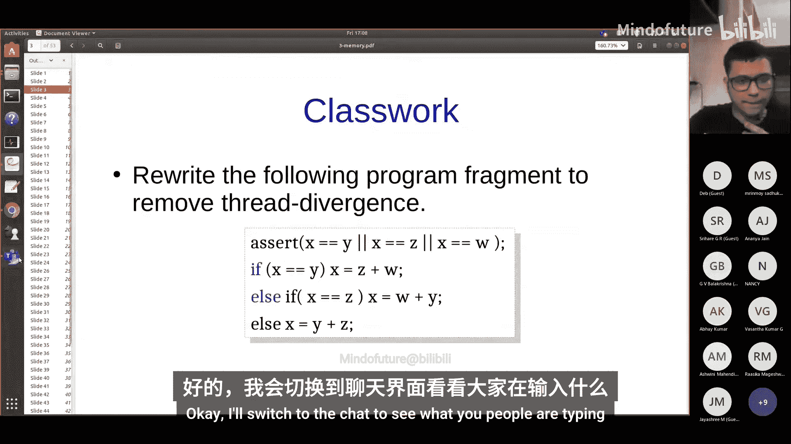

上一节我们介绍了GPU的计算层次结构、典型的矩阵平方应用并行化方法，以及处理大规模数据时内核启动的常见问题。我们还深入探讨了线程束（Warp）的概念、执行方式（锁步、SIMD），并初步了解了线程发散（Thread Divergence）问题。


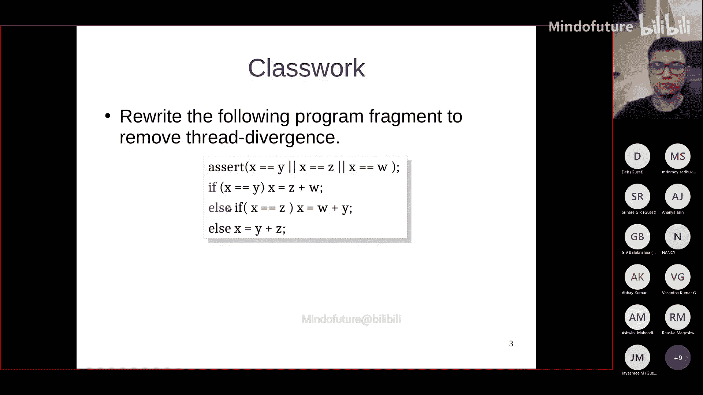


本节我们将继续深入线程发散问题，通过更多示例学习如何识别和缓解发散。最后，我们将开始新的主题——GPU内存，了解其基本组织方式。

## 线程发散深入分析

### 示例一：多分支条件语句

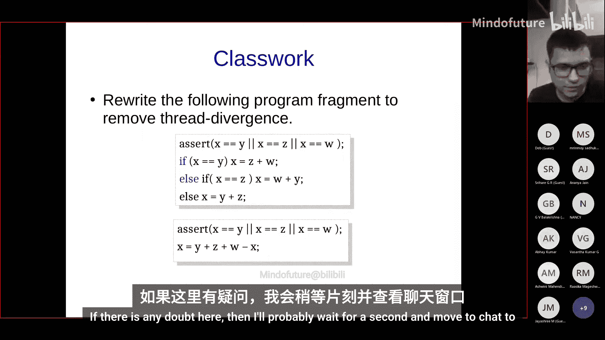


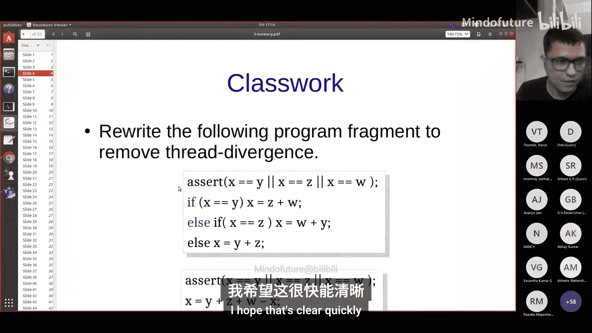

首先，我们回顾上节课结束时的一个简单示例。以下内核启动了一个包含32个线程（即一个线程束）的核函数：


```c
__global__ void D_kernel(float* vector, int vector_size) {
    int id = threadIdx.x + blockIdx.x * blockDim.x;
    if (id < vector_size) {
        if (id % 2 == 1) {
            // 语句 S1 (奇数ID线程执行)
        } else {
            // 语句 S2 (偶数ID线程执行)
        }
        // 语句 S3 (所有线程执行)
    }
}
```

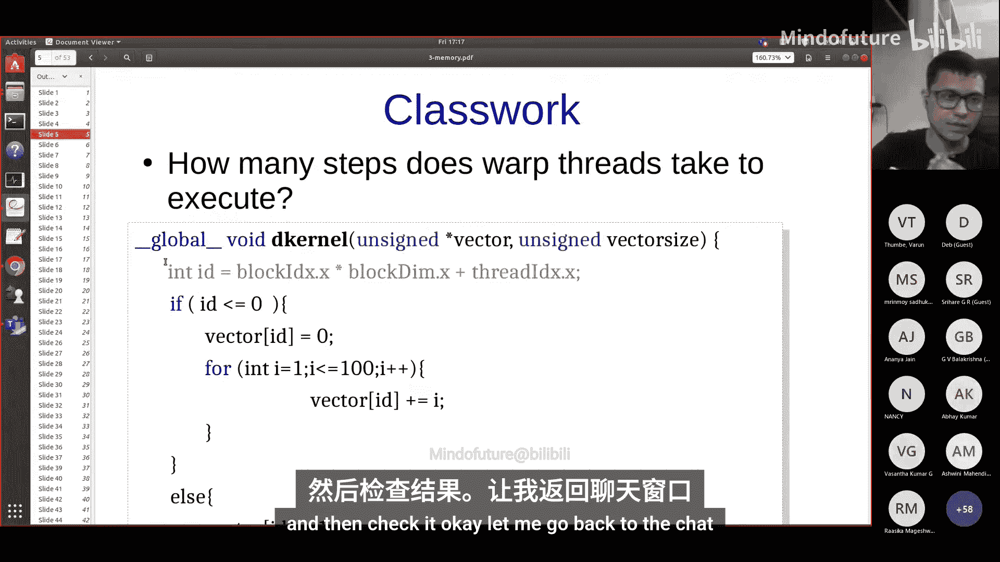


**关键观察点**：对于这个 `if-else` 结构，无论线程ID是奇数还是偶数，线程束执行它都需要 **2步**。第一步，一部分线程执行 `S1`，另一部分闲置；第二步，另一部分线程执行 `S2`，之前执行的线程闲置。虽然存在发散，但执行步数是固定的。

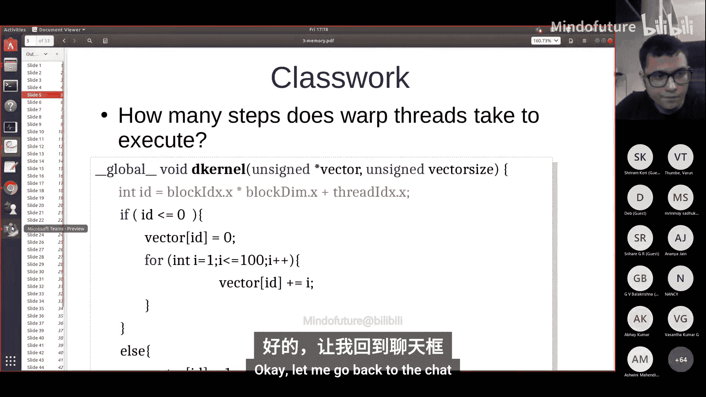


### 练习：复杂条件分支

现在考虑一个更复杂的条件分支：

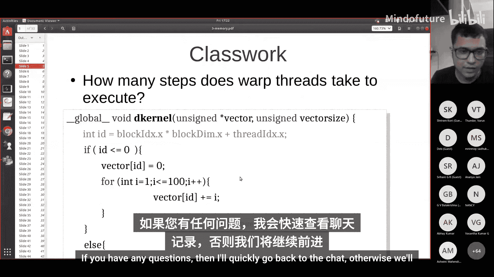


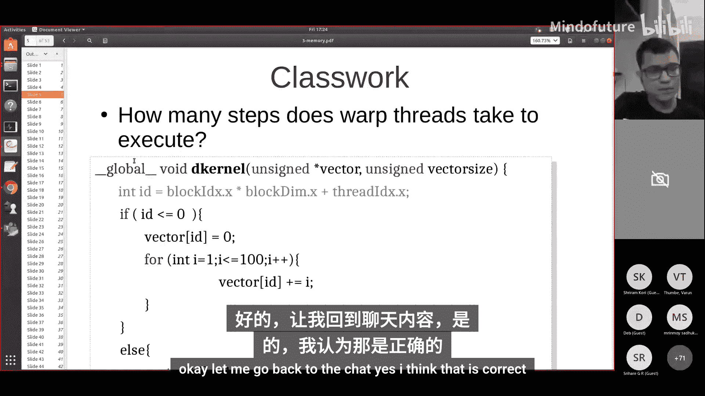

```c
if (x == y) {
    a = z + w;
} else if (x == z) {
    a = y + w;
} else {
    a = y + z;
}
```


**问题**：
1.  线程束执行此 `if-else-if` 结构最多需要多少步？
2.  如何消除此处的线程发散？

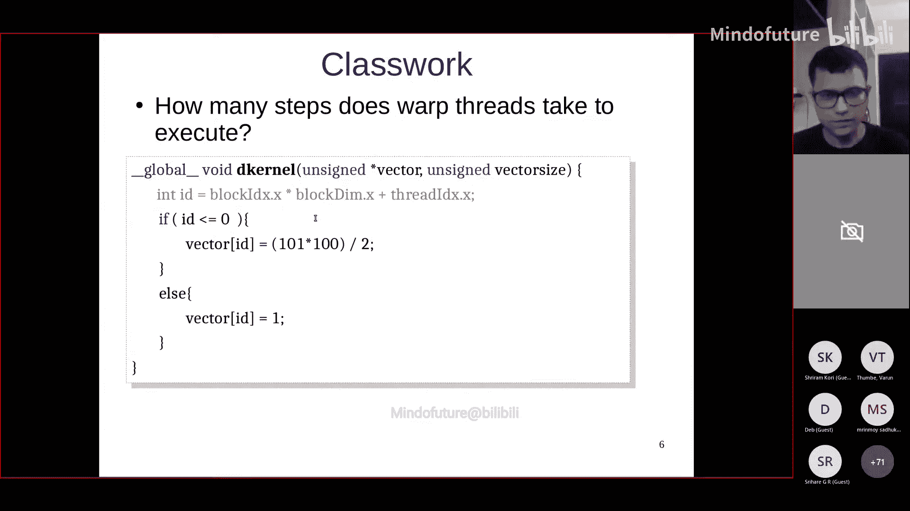

**分析与解答**：
1.  **执行步数**：在最坏情况下，线程束中的线程可能分别进入三个不同的条件分支。因此，线程束需要按顺序让进入每个分支的线程组依次执行，总共需要 **3步**。
2.  **消除发散**：我们可以利用数学等价替换，将条件分支转换为一个无分支的表达式，从而让所有线程执行相同的操作：
    `a = (x == y) * (z + w) + (x == z) * (y + w) + (x == w) * (y + z);`
    但更优雅的解法是利用这个公式：`a = (y * (x == z) + z * (x == y) + w * (x == w)) / ((x == y) + (x == z) + (x == w));`
    当`x`等于`y`、`z`或`w`时，此公式能正确计算出对应的`a`值，且所有线程执行相同的计算，**只需1步**，彻底消除了发散。


### 示例二：包含循环的昂贵分支

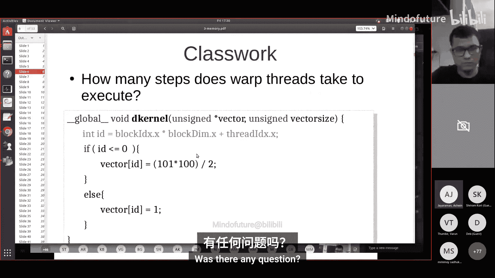


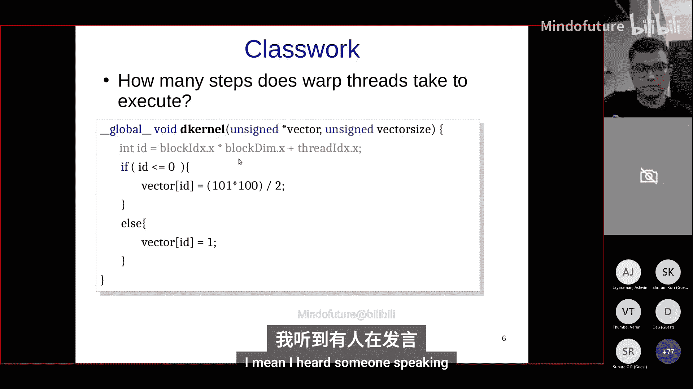

考虑以下内核，它同样由32个线程（一个线程束）执行：

```c
__global__ void T_kernel(float* vector, int vector_size) {
    int id = threadIdx.x + blockIdx.x * blockDim.x;
    if (id <= 0) { // 仅线程ID为0满足条件
        vector[0] = 0;
        for(int i = 1; i <= 100; i++) {
            vector[0] += i; // 计算1到100的和
        }
    } else {
        vector[id] = 1;
    }
}
```


**问题**：线程束执行这个 `if-else` 结构需要多少步？

**分析与解答**：
*   只有 `id=0` 的线程会进入 `if` 分支，执行 `vector[0] = 0;`（1步）和100次循环（100步），共101步。
*   其余31个线程 (`id=1` 到 `31`) 在 `if` 阶段闲置。
*   然后，这31个线程进入 `else` 分支，执行 `vector[id] = 1;`（1步），而 `id=0` 的线程在此阶段闲置。
*   因此，线程束总共需要 **101 + 1 = 102步** 来执行此结构。性能瓶颈在于 `id=0` 线程的昂贵循环。

**优化**：我们可以将循环计算（求和）替换为闭合公式（等差数列求和公式）：
`if (id <= 0) { vector[0] = 100 * 101 / 2; }`
这样，`if` 分支的耗时从101步降为1步。优化后，线程束执行整个 `if-else` 结构只需要 **2步**（`if`分支1步，`else`分支1步）。

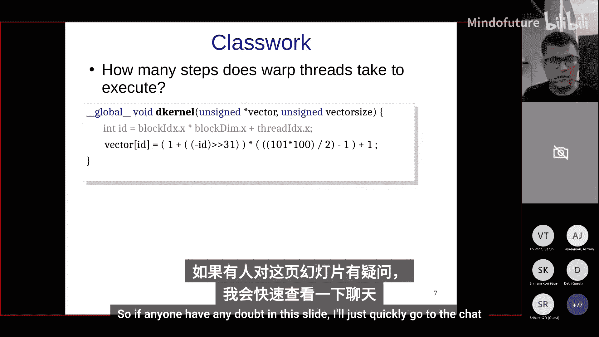

**进一步优化以消除发散**：虽然步数减为2，但线程依然发散（一部分执行`if`，另一部分执行`else`）。我们可以利用整数运算技巧，将其合并为单一步骤：
`vector[id] = 1 + ( ( -(id >> 31) ) & (100*101/2 - 1) );`
这个表达式利用了整数右移和位操作，使得当 `id=0` 时，结果为 `100*101/2`；当 `id>0` 时，结果为 `1`。**所有线程执行相同的指令序列，仅需1步，完全消除了发散。**

### 示例三：Switch-Case 语句


考虑以下使用 `switch-case` 的内核：

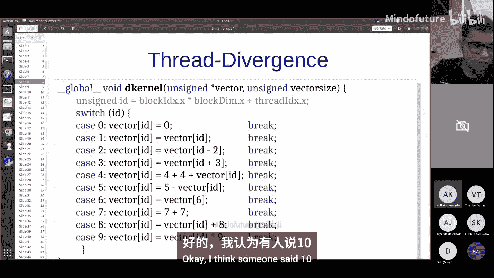


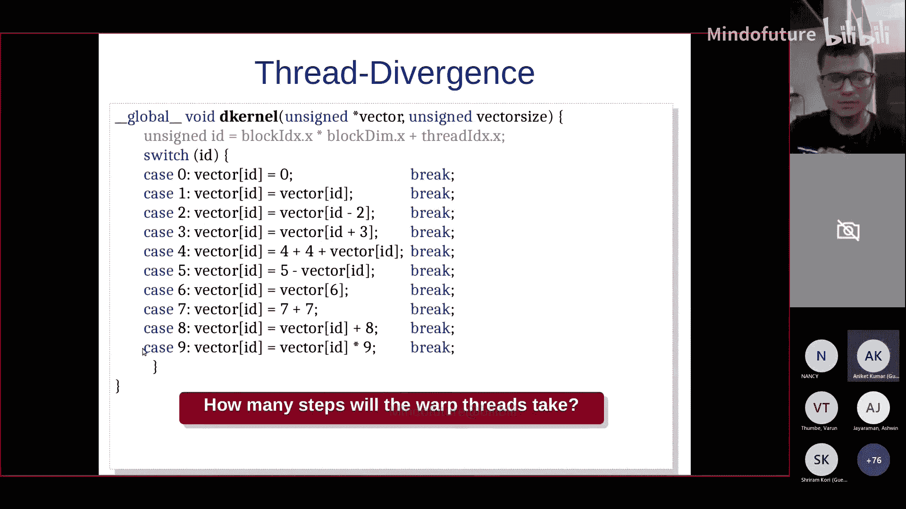

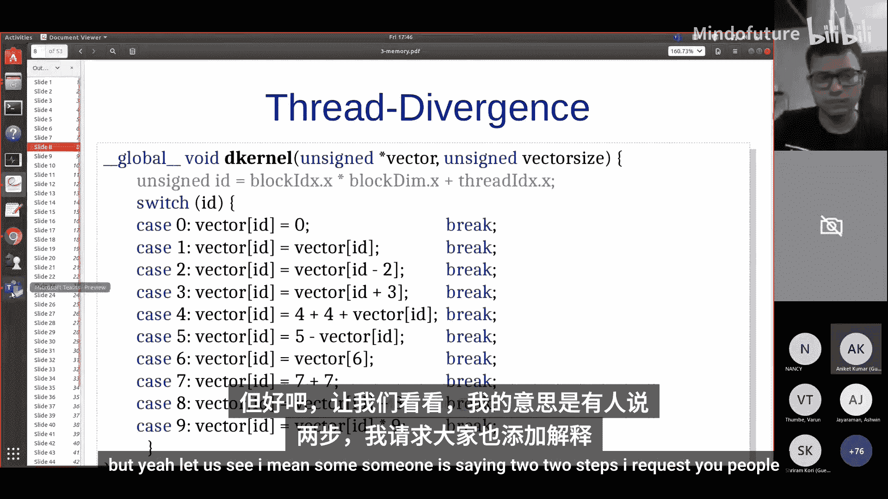

```c
__global__ void D_kernel(float* vector, int vector_size) {
    int id = threadIdx.x + blockIdx.x * blockDim.x;
    switch(id) {
        case 0: vector[0] = 0; break;
        case 1: vector[1] = vector[0]; break;
        case 2: vector[2] = vector[id-2]; break;
        case 3: vector[3] = vector[6]; break;
        case 4: vector[4] = vector[5] + 4; break;
        case 5: vector[5] = vector[4] - 4; break;
        case 6: vector[6] = vector[3]; break;
        case 7: vector[7] = vector[7] * 2; break;
        case 8: vector[8] = vector[4] + id; break;
        case 9: vector[9] = 9; break;
    }
}
```


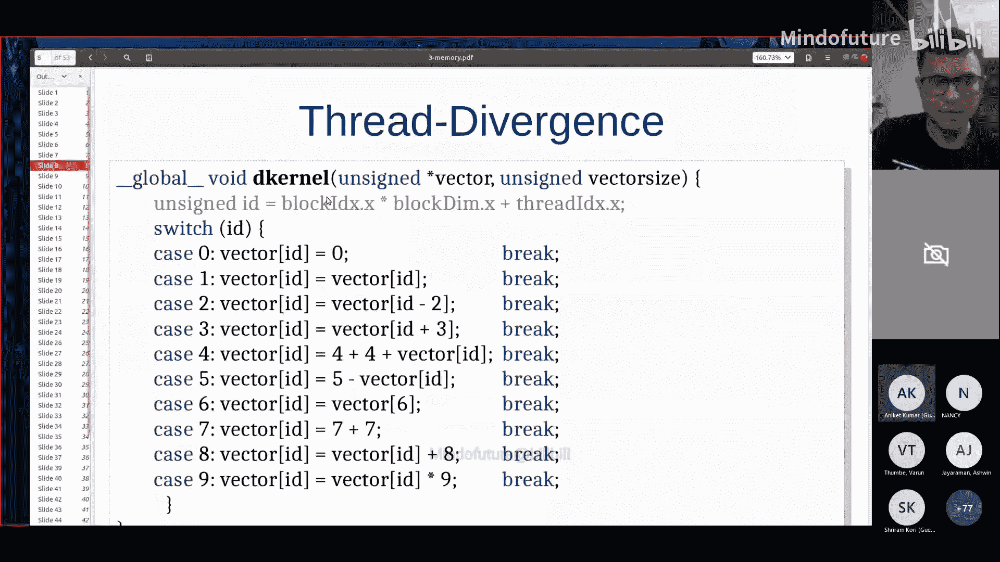

**问题**：线程束执行此 `switch` 结构需要多少步？

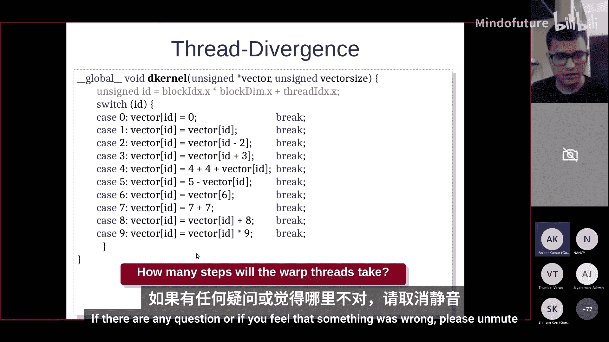

**分析与解答**：
`switch` 语句在逻辑上等价于一系列的 `if-else if` 判断。线程束需要让进入每个 `case` 的线程组依次执行。因为有10个 `case`，所以在最坏情况下需要 **10步**。


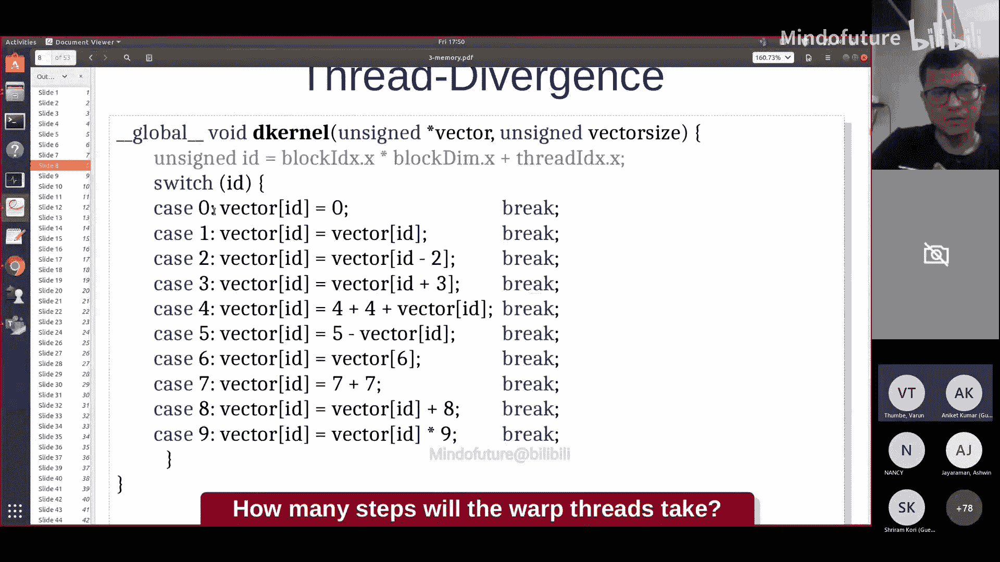

**优化**：通过观察，我们可以合并一些执行相同或等价操作的 `case`，从而减少步数：
*   `case 0` 和 `case 2`：由于线程锁步执行，当 `id=2` 执行 `vector[2] = vector[0];` 时，`vector[0]` 已被 `id=0` 的线程初始化为0。因此两者效果可合并（将`vector`对应位置赋0）。
*   `case 3` 和 `case 6`：都执行 `vector[3] = vector[6];` 和 `vector[6] = vector[3];`（具体值取决于执行顺序，但操作对称）。
*   `case 4` 和 `case 8`：`case 8` 执行 `vector[8] = vector[4] + 8;`，这与 `case 4` 的 `vector[4] = vector[5] + 4;` 在数据流上相关，在某些条件下可考虑合并逻辑。
通过合并，可以将执行步数从10步减少到7步或更少。

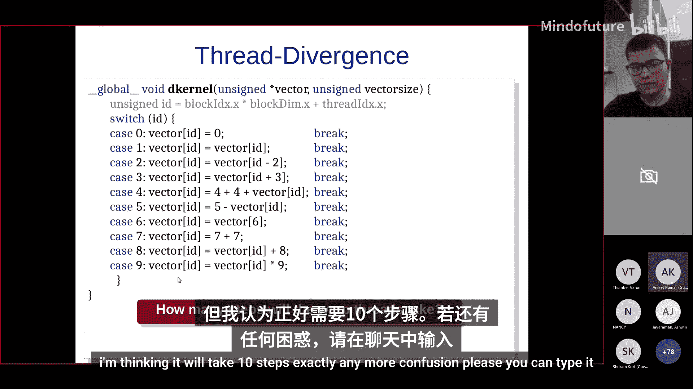

### 示例四：屏障同步与死锁


考虑以下包含全局屏障的内核：

```c
__global__ void example_kernel() {
    int id = threadIdx.x + blockIdx.x * blockDim.x;
    if (id < 16) {
        printf("Inside if\n");
        __syncthreads(); // 全局屏障
    } else {
        printf("Inside else\n");
    }
}
```

**问题**：这个程序的输出是什么？会发生什么？

**分析与解答**：
*   假设内核启动了一个包含32个线程的线程束。
*   前16个线程 (`id=0` 到 `15`) 进入 `if` 分支，打印 “Inside if”，然后到达 `__syncthreads()` 屏障并等待。
*   后16个线程 (`id=16` 到 `31`) 进入 `else` 分支，打印 “Inside else”，**但永远不会到达 `__syncthreads()` 屏障**。
*   因此，先到达屏障的16个线程将无限期等待另外16个线程到达屏障，而这是永远不会发生的。这就导致了 **死锁（Deadlock）**。

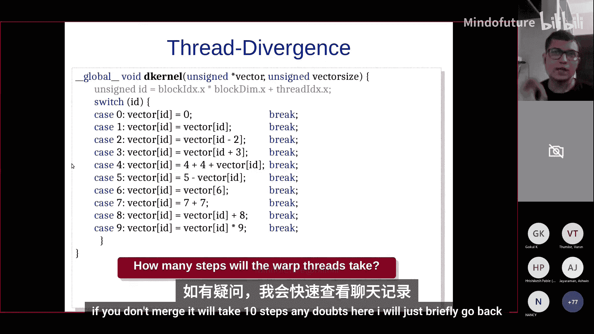


**关键点**：线程束内的线程如果因为条件分支而无法全部到达同步点，就会导致死锁。这是编写CUDA代码时需要特别注意的问题。

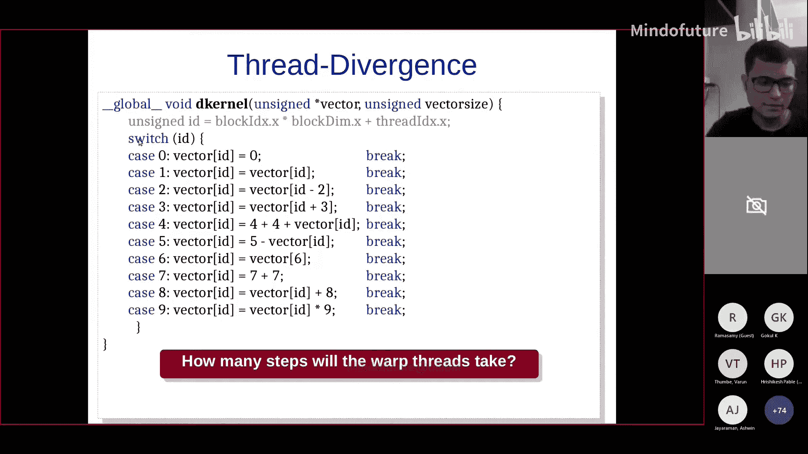

## GPU内存模型概述


前面我们主要关注了GPU的计算方面。现在，让我们开始了解GPU的另一个核心方面——内存。

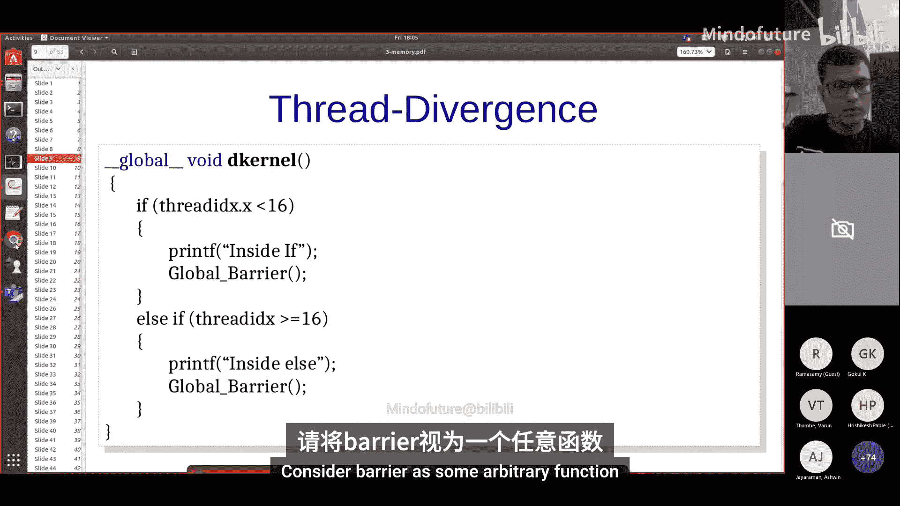


GPU拥有复杂的内存层次结构，设计目标是隐藏全局内存的高延迟并提高数据访问带宽。以下是其主要的层次：

```
线程 (Thread) -> 寄存器 (Registers) [最快，每个线程私有]
        |
        V
线程块 (Block) -> 共享内存 (Shared Memory) [较快，块内线程共享]
        |
        V
全局内存 (Global Memory) / 设备内存 (Device Memory) [较慢，所有线程可访问]
        |
        V
纹理内存 (Texture Memory) 和 常量内存 (Constant Memory) [特殊用途，只读]
```

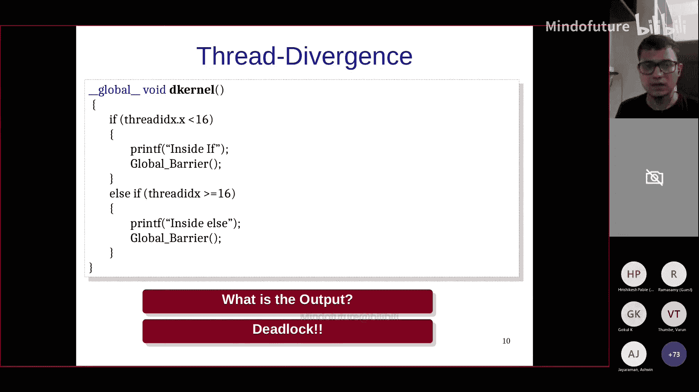


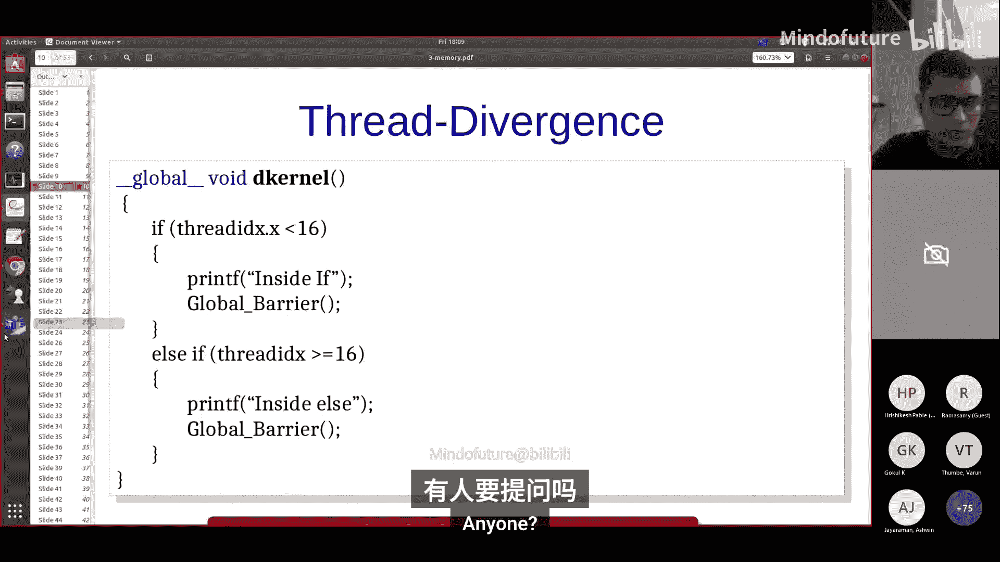


### 各级内存详解

1.  **寄存器 (Registers)**
    *   **位置与速度**：位于芯片上，是速度最快的内存。
    *   **作用域**：每个线程私有。编译器会尽可能将局部变量分配到寄存器中。
    *   **容量**：数量有限。如果寄存器不足，变量会“溢出”到更慢的本地或全局内存。

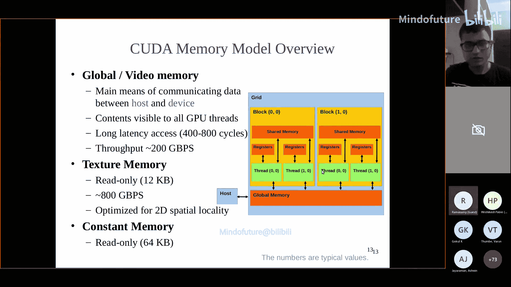


2.  **共享内存 (Shared Memory)**
    *   **位置与速度**：位于芯片上，速度仅次于寄存器，但远快于全局内存。
    *   **作用域**：同一个线程块内的所有线程共享。是块内线程通信和协作的主要桥梁。
    *   **用途**：常用于存储需要被块内线程频繁访问的数据片段，例如矩阵乘法中的瓦片（Tile）。

3.  **全局内存 (Global Memory)**
    *   **位置与速度**：即GPU的板载DRAM（设备内存）。容量大（数GB），但**延迟非常高**（数百个时钟周期）。
    *   **作用域**：对所有网格中的所有线程可见。是主机（CPU）与设备（GPU）之间传输数据的主要区域，也是不同线程块之间通信的媒介（尽管不直接同步）。
    *   **带宽**：现代GPU的全局内存带宽很高（可达数百GB/s），但高延迟仍是主要性能瓶颈。

4.  **纹理内存 (Texture Memory) 和 常量内存 (Constant Memory)**
    *   **特性**：它们是全局内存中经过特殊优化、具有独立缓存的空间。
    *   **只读性**：内核通常只能读取它们的内容。
    *   **纹理内存**：针对具有**空间局部性**的访问模式（如图像处理中的邻近像素访问）进行了优化。
    *   **常量内存**：适合存储所有线程都需要读取的常量数据。当所有线程读取相同地址时，性能极高（广播机制）。
    *   **容量**：很小（常量内存通常64KB，纹理内存缓存也有限）。

### 性能启示

编程时应遵循以下原则以提升性能：
*   **优先使用寄存器**：尽量使用局部变量。
*   **合理利用共享内存**：将需要重复访问的数据从全局内存缓存到共享内存。
*   **优化全局内存访问**：通过合并访问（Coalesced Access）来最大化内存带宽利用率（后续课程详述）。
*   **善用常量与纹理内存**：将只读的常量或具有空间局部性的数据放置于此。

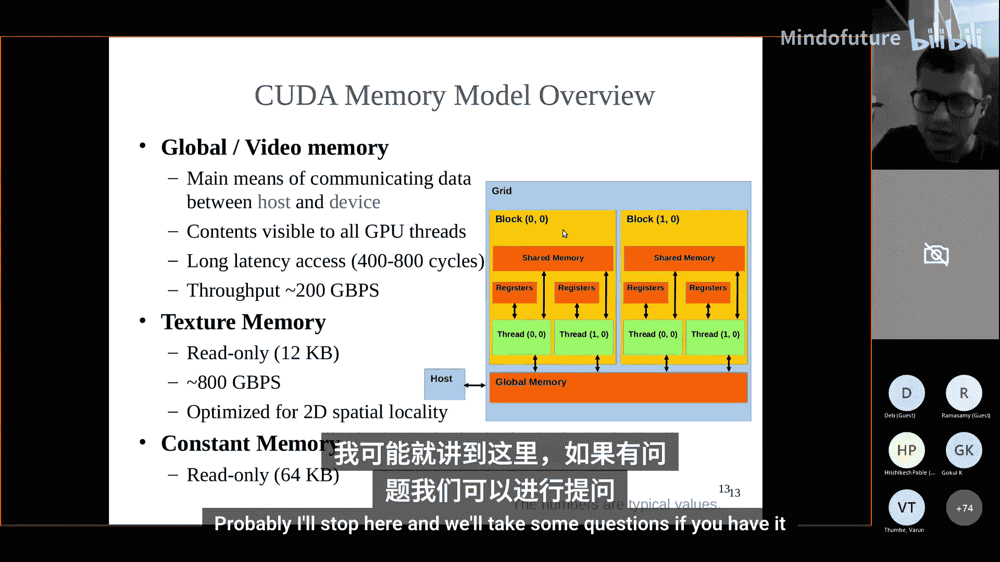

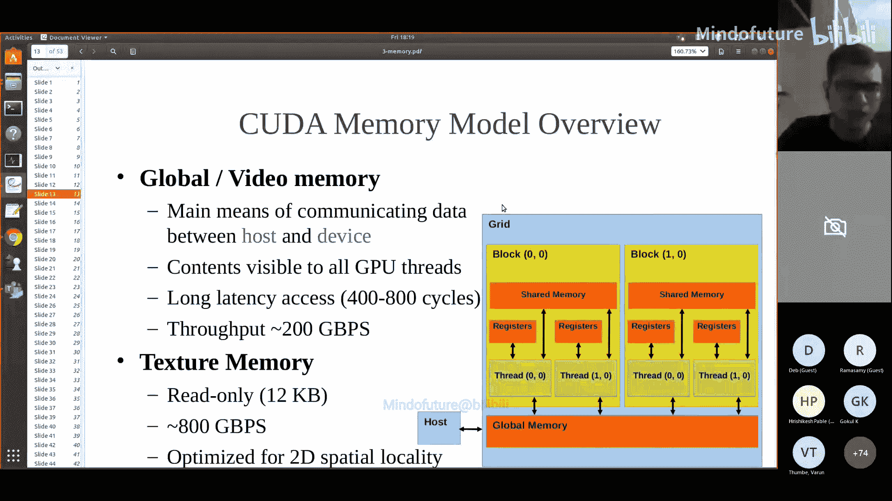


## 总结

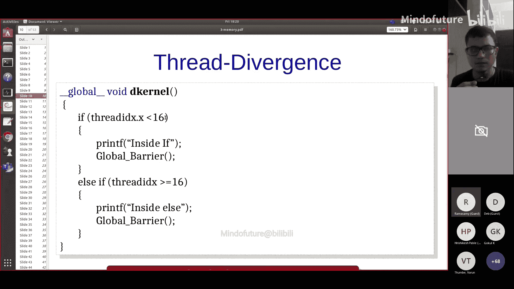


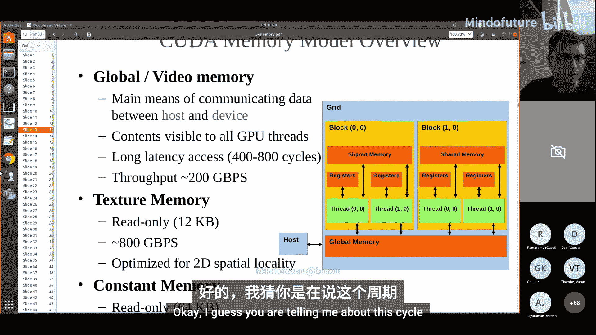

本节课我们深入探讨了CUDA中的线程发散问题。通过多个示例，我们学习了：
1.  如何分析条件分支、循环和`switch`语句导致的线程束执行步数。
2.  如何运用数学等价变换和位操作等技巧，将发散代码重构为无分支代码，从而显著提升性能，甚至完全消除发散。
3.  线程发散在同步点（如`__syncthreads()`）可能引发死锁，需要谨慎处理。


最后，我们开启了GPU内存主题的学习，概述了GPU的内存层次结构，包括寄存器、共享内存、全局内存、纹理内存和常量内存的特性与用途。理解这个层次结构对于编写高性能CUDA程序至关重要。


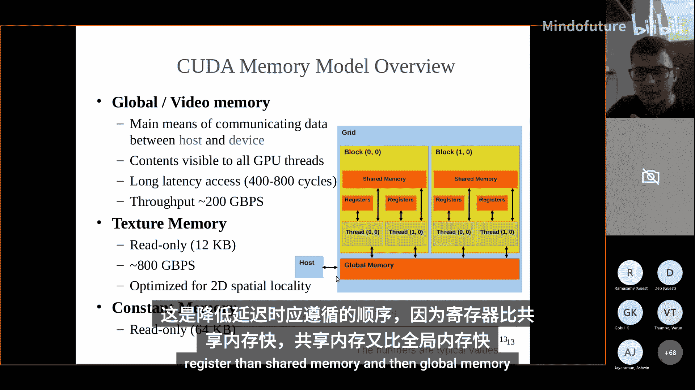

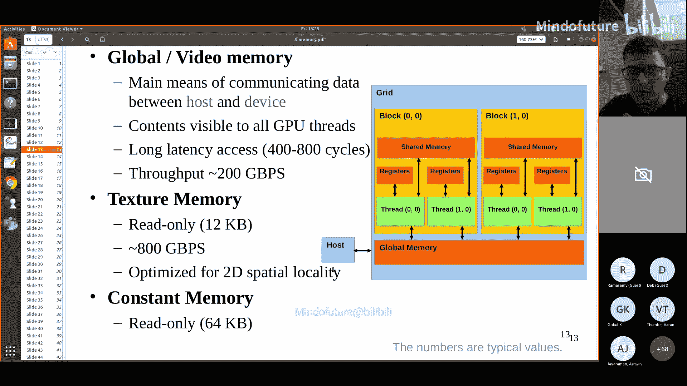


在接下来的课程中，我们将更深入地研究内存访问模式、共享内存的使用以及如何实现高效的内存访问。