# 015：屏障、归约与CUDA中的前缀和 🚀


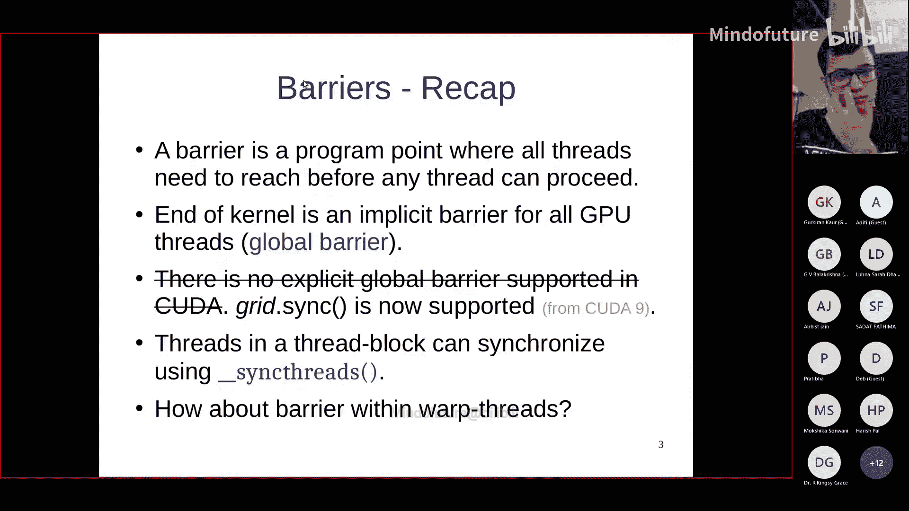


## 概述
在本节课中，我们将要学习CUDA编程中的三个核心概念：屏障（Barrier）、归约（Reduction）和前缀和（Prefix Sum）。我们将了解屏障如何实现线程间的同步，如何利用归约高效地计算数组的总和，以及如何实现和应用前缀和算法。

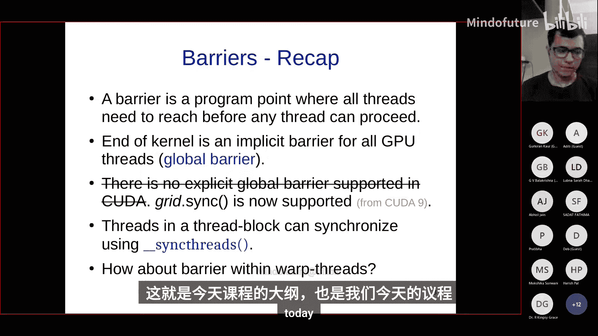


---

## 屏障（Barrier）回顾与深入

上一节我们介绍了原子操作，本节我们继续探讨屏障这一同步机制。

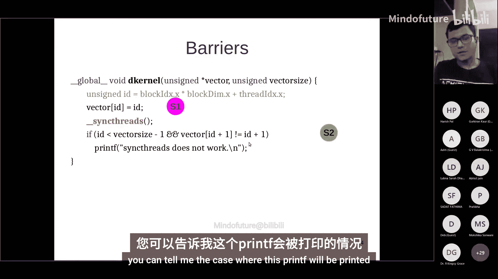

屏障是一个程序点，要求**所有线程**都必须到达该点后，**任何线程**才能继续执行后续指令。在CUDA中，内核（Kernel）的结束处对所有GPU线程来说是一个隐式的全局屏障。从CUDA 9开始，`grid.sync()`函数可以作为跨GPU所有线程的全局屏障。而`__syncthreads()`函数则充当线程块（Thread Block）内所有线程的屏障。


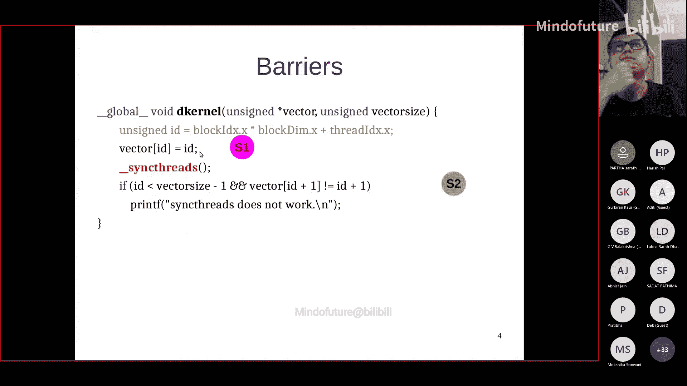


### 屏障示例分析

以下是使用`__syncthreads()`的一个示例代码：

```cuda
__global__ void kernel(unsigned int* vector, unsigned int vector_size) {
    unsigned int id = threadIdx.x;
    vector[id] = id; // 每个线程根据其ID初始化数组元素
    __syncthreads(); // 线程块内屏障
    if (id < vector_size - 1 && vector[id + 1] != id + 1) {
        printf("__syncthreads doesn't work\n");
    }
}
```

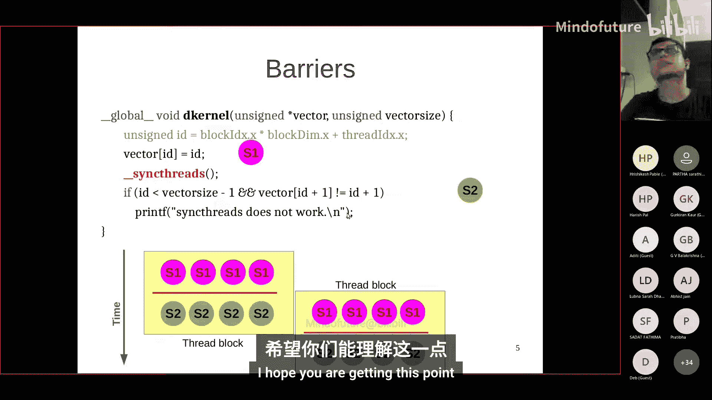

以下是代码逻辑的逐步分析：
1.  每个线程根据其`threadIdx.x`（即ID）为数组`vector`的对应位置赋值。
2.  调用`__syncthreads()`，确保线程块内所有线程都完成了初始化操作。
3.  每个线程（除了最后一个）检查其下一个元素的值是否等于`id + 1`。


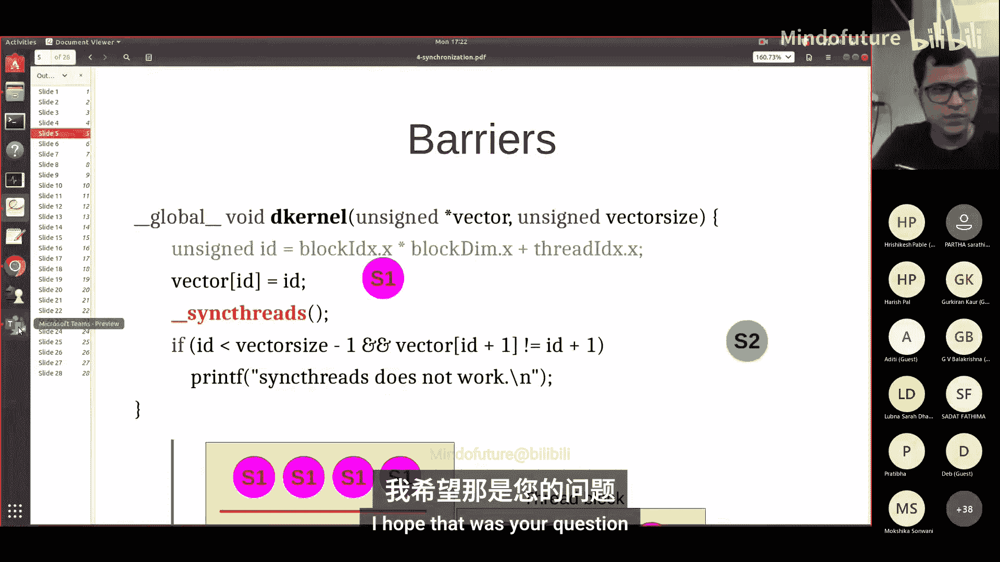

**潜在问题**：如果数组大小`vector_size`超过了一个线程块的最大线程数（例如1024），则需要启动多个线程块。`__syncthreads()`**仅同步同一个线程块内的线程**。因此，可能出现以下情况：
*   第一个线程块（线程ID 0-1023）的线程完成了初始化，并通过了屏障。
*   第二个线程块（线程ID 1024-2047）的线程仍在执行初始化。
*   此时，第一个线程块中ID为1023的线程执行检查：它试图访问`vector[1024]`（即`id+1`），但这个位置的值尚未被第二个线程块的线程初始化。这可能导致检查条件成立，从而打印错误信息。

**解决方案**：如果使用`grid.sync()`替代`__syncthreads()`，则可以确保所有GPU线程（跨所有线程块）都完成初始化后才进行检查，从而避免此问题。

### 屏障的数据同步作用


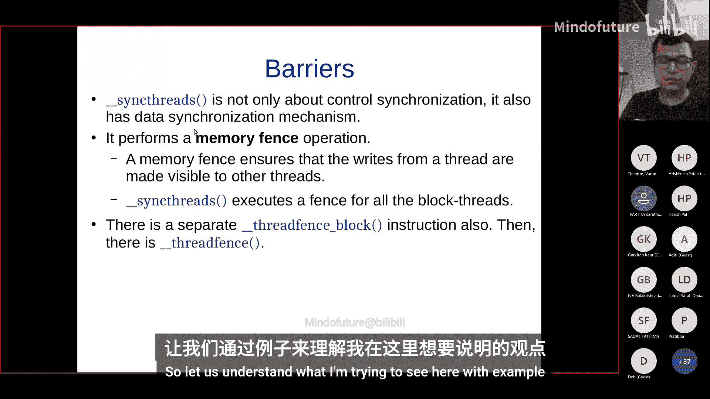


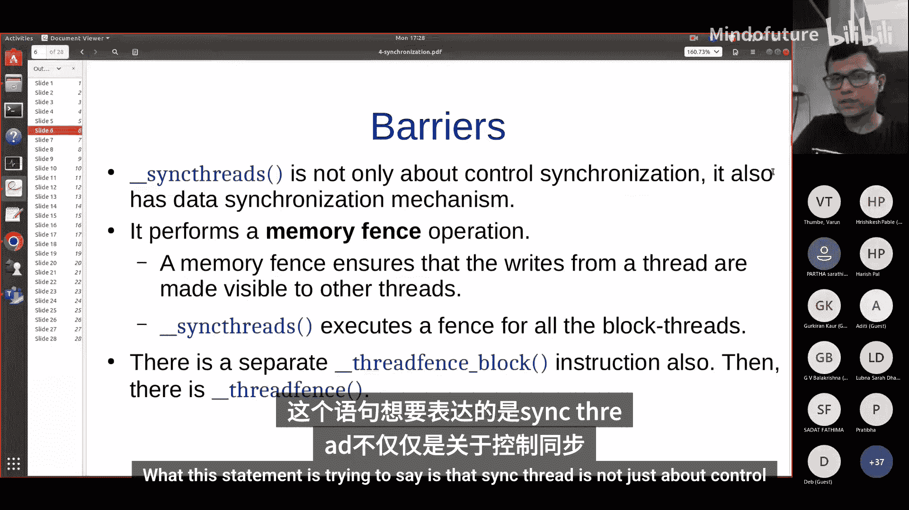

`__syncthreads()`不仅提供**控制流同步**（所有线程到达后才继续），还提供**数据同步**。它确保在屏障点之前，线程块内所有线程对内存的写入操作，对屏障点之后所有线程的读取操作是可见的。


这是通过**内存栅栏（Memory Fence）** 操作实现的。内存栅栏强制将线程的写入刷新到主内存，并确保后续读取从主内存获取最新值，从而保证内存操作的顺序性和可见性。

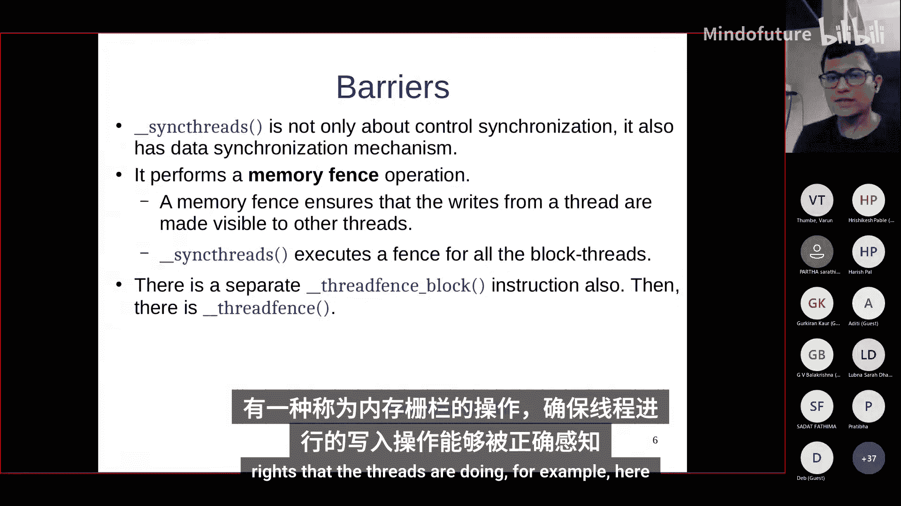


*   `__threadfence_block()`: 在`__syncthreads()`内部隐式调用，确保线程块内的数据同步。
*   `__threadfence()`: 确保GPU内所有线程的数据同步。

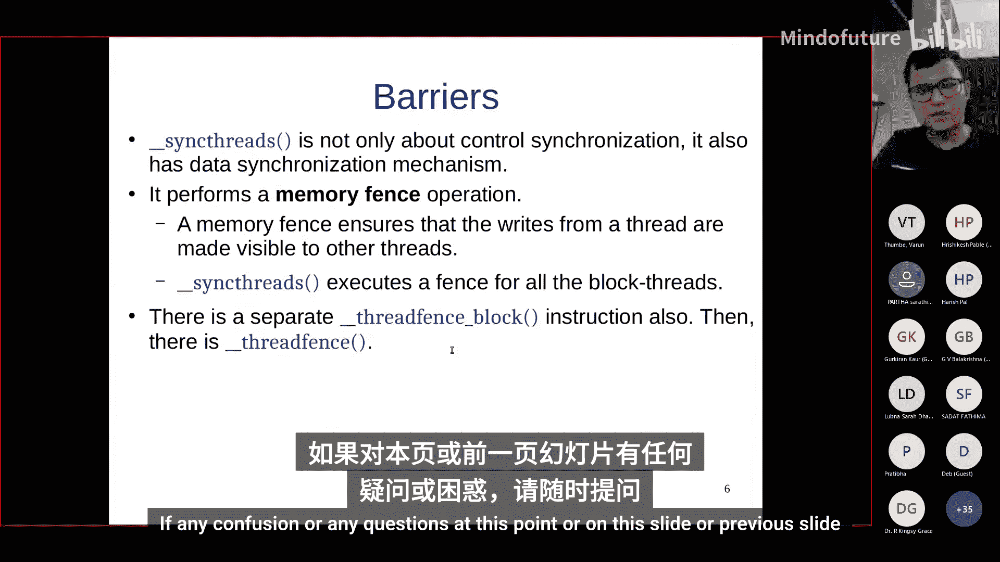


---

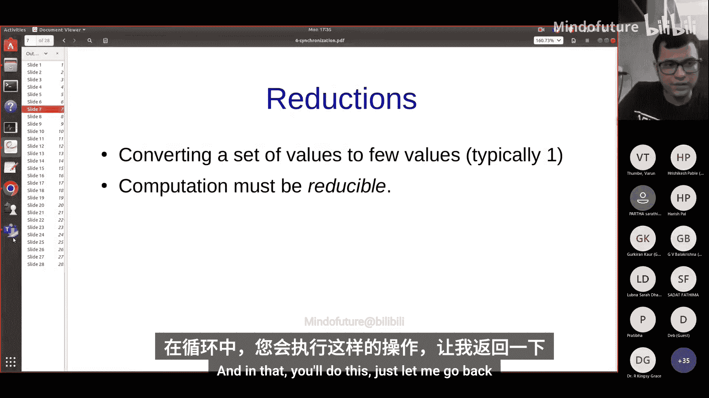

## 归约（Reduction）

上一节我们介绍了屏障，本节中我们来看看归约。归约是一种将一组数据（例如一个数组）聚合为单个值或少量值的操作，例如计算总和、最大值、最小值等。


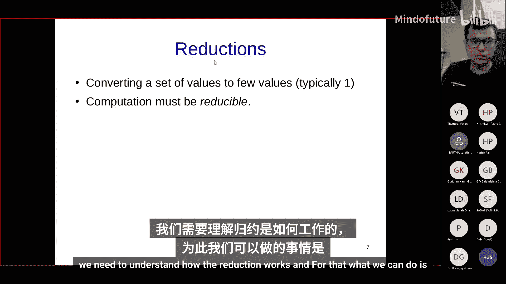

### 为什么需要归约？


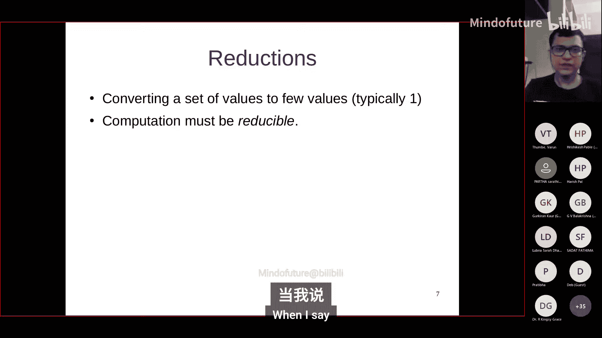


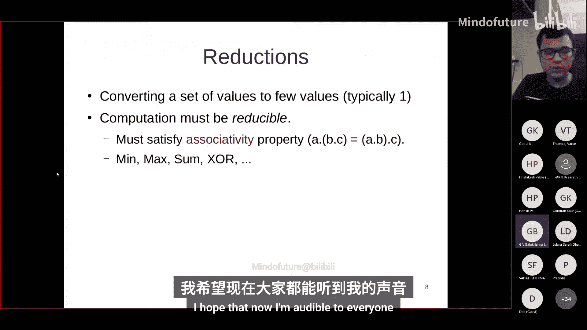

考虑计算一个包含N个元素的数组的总和。一种简单的方法是使用原子操作：


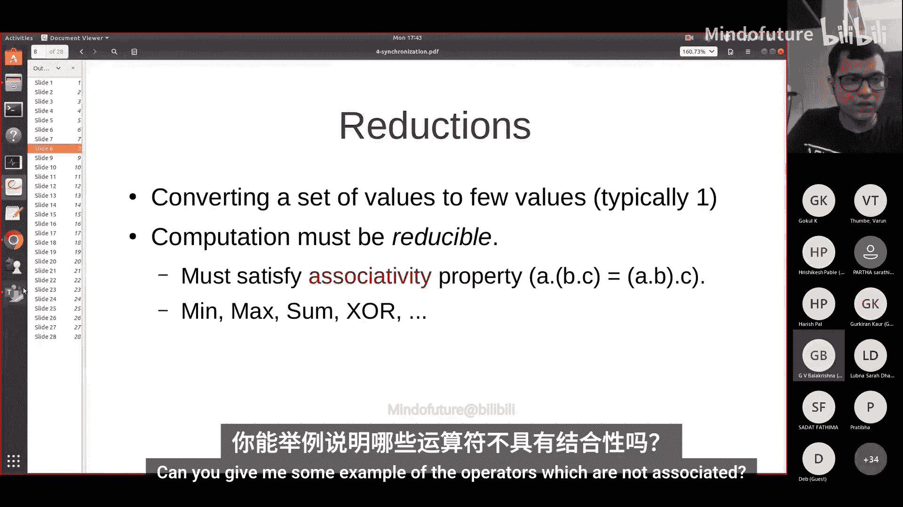


```cuda
__global__ void atomic_sum(int* array, int* sum, int n) {
    int id = threadIdx.x;
    if (id < n) {
        atomicAdd(sum, array[id]); // 原子加法
    }
}
```

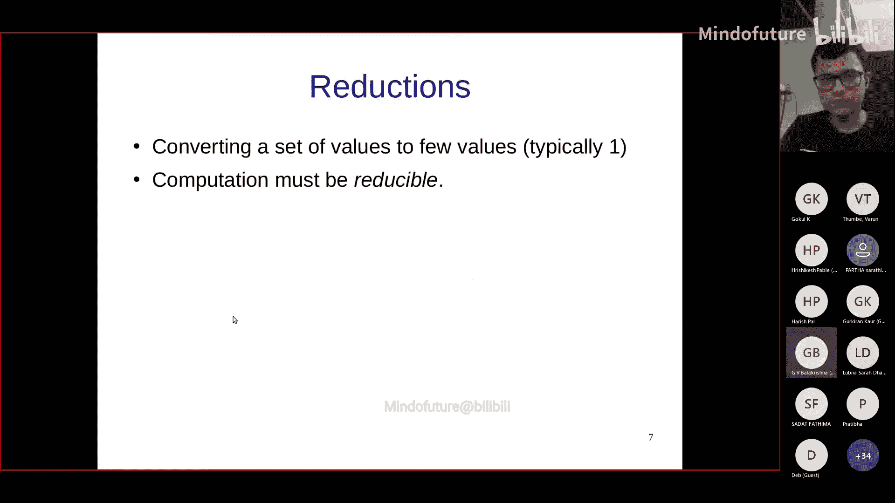


这种方法的问题是**严重的顺序性**：尽管有多个线程，但`atomicAdd`操作是串行的，同一时刻只有一个线程能成功更新`sum`。这无法充分利用GPU的并行能力，性能甚至可能差于CPU串行代码。

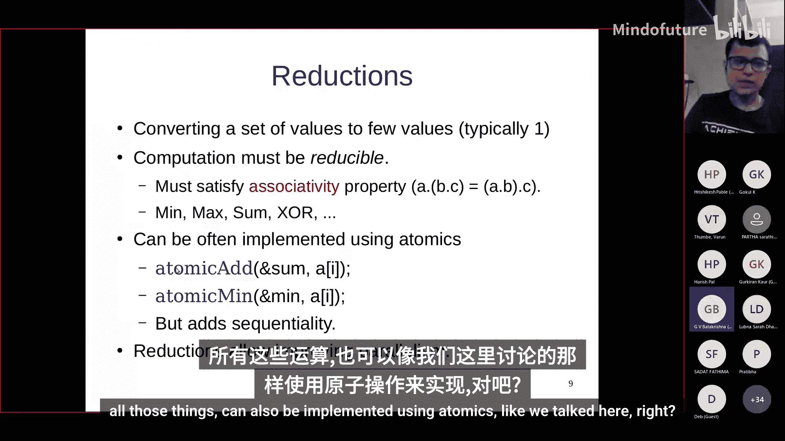


### 归约的基本思想

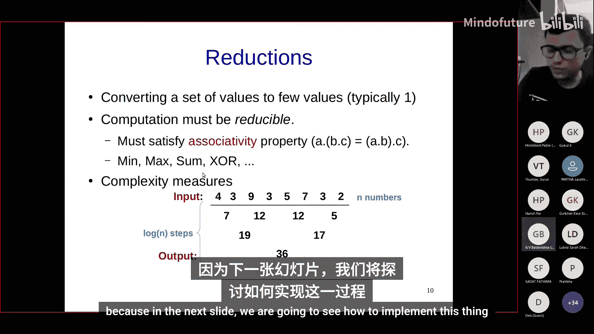

归约通过**树形结构**并行地合并数据。其核心思想是：在每一步，将数据两两分组进行合并，使数据量减半，经过 **log₂N** 步后得到最终结果。

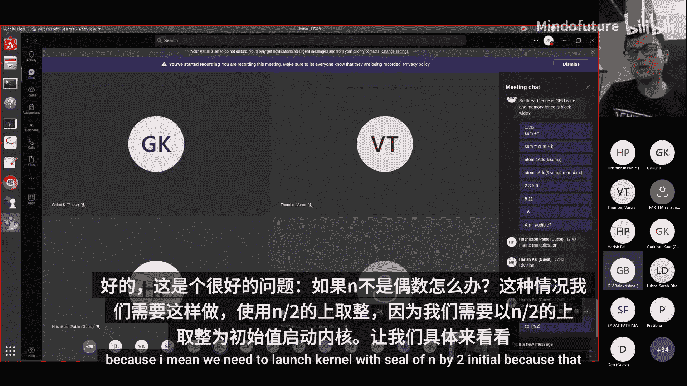

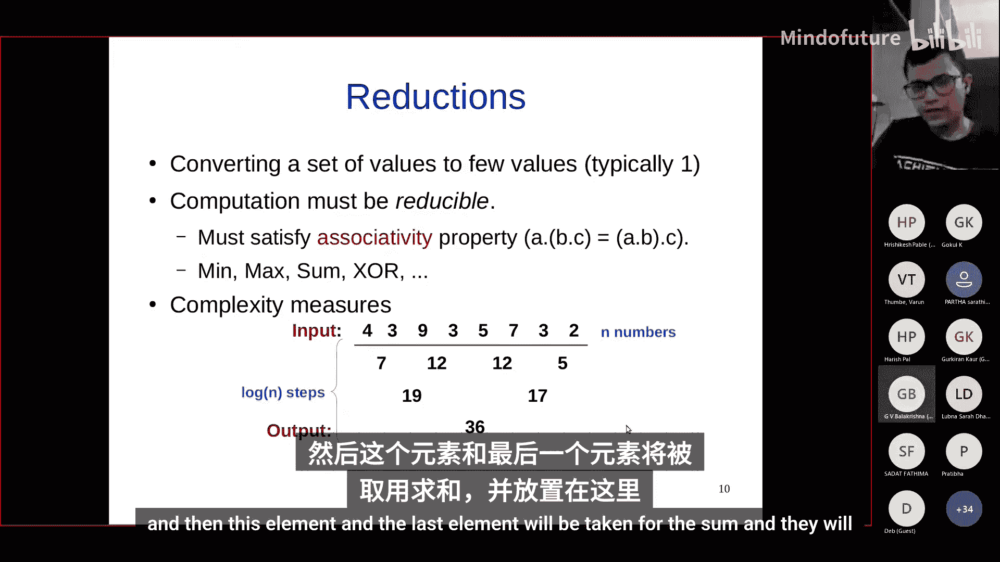


**操作前提**：归约操作（如加法、求最大值）必须是**可结合（Associative）** 的。即 `(a ⊕ b) ⊕ c = a ⊕ (b ⊕ c)`。加法、乘法、求最大值、最小值、按位与/或/异或等操作满足结合律。而减法、除法则不满足。

### 归约算法实现

以下是一种常见的归约实现方式（假设数组大小为2的幂，且只使用一个线程块）：

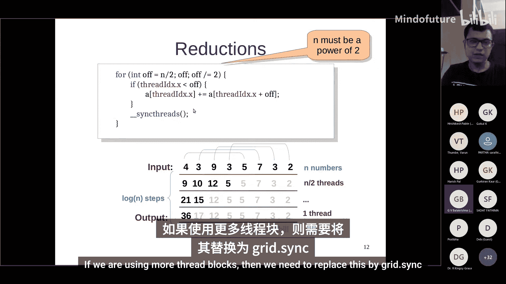


```cuda
__global__ void reduction_sum(int* input, int* output, int n) {
    // 假设input数组已在GPU上，且n为2的幂
    // 使用共享内存或全局内存进行原地操作
    for (int offset = n / 2; offset > 0; offset >>= 1) {
        int id = threadIdx.x;
        if (id < offset) {
            input[id] += input[id + offset]; // 将相隔offset的元素相加
        }
        __syncthreads(); // 每一步都需要同步
    }
    if (threadIdx.x == 0) {
        *output = input[0]; // 最终结果在input[0]
    }
}
```

**算法步骤**：
1.  初始时，有N个元素，使用 N/2 个线程。
2.  每个线程将位置`id`的元素与位置`id + offset`的元素相加，结果存回`id`位置。`offset`初始为N/2。
3.  调用`__syncthreads()`确保本步所有加法完成。
4.  `offset`减半（`offset >>= 1`），重复步骤2-3，直到`offset`为0。
5.  此时，`input[0]`中存储的就是所有元素的总和。

**图解**：对于数组 `[2, 3, 5, 6, 1, 9, 4, 7]`
*   **第1步** (`offset=4`): `[2+1, 3+9, 5+4, 6+7, 1, 9, 4, 7]` -> `[3, 12, 9, 13, ...]`
*   **第2步** (`offset=2`): `[3+9, 12+13, 9, 13, ...]` -> `[12, 25, ...]`
*   **第3步** (`offset=1`): `[12+25, ...]` -> `[37, ...]`
结果37即为总和。

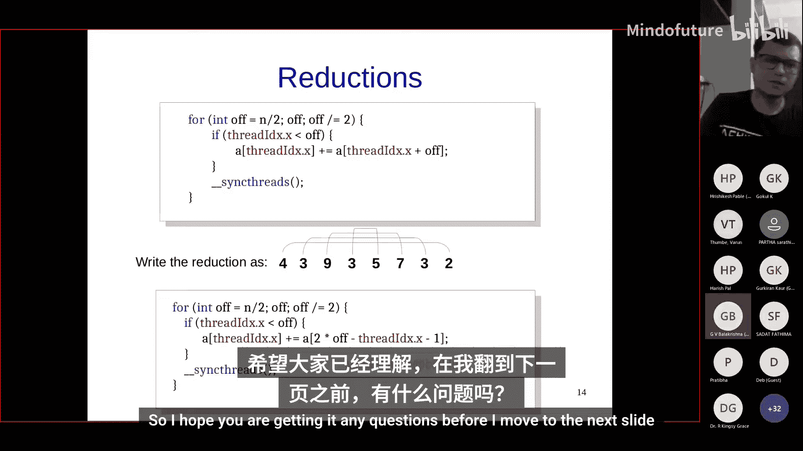

**优势**：
*   **并行度高**：每一步都使用大量线程。
*   **步数少**：仅需 **log₂N** 步，而非串行的 N 步。
*   **无需原子操作**：通过巧妙的索引计算和同步避免数据竞争。


**注意事项**：
*   需要处理数组大小非2的幂的情况（例如，在数组末尾填充0）。
*   当使用多个线程块时，需要先在各块内进行归约，然后再对块的结果进行归约，并可能使用`grid.sync()`或启动多个内核。

---

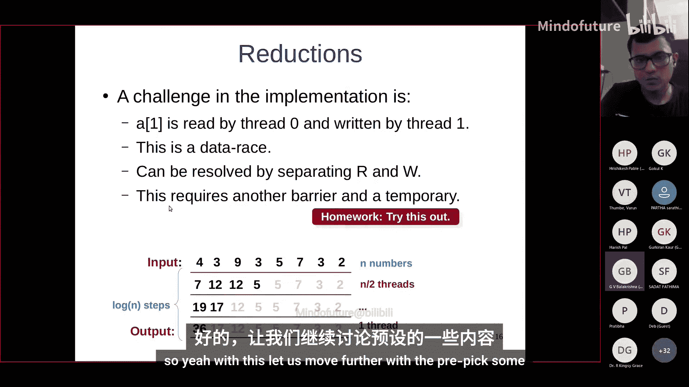


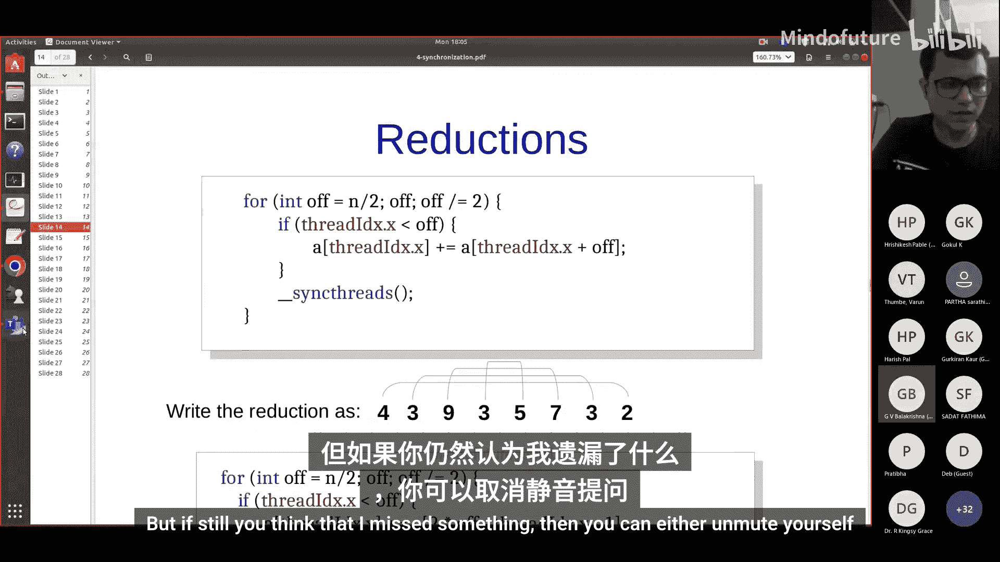

## 前缀和（Prefix Sum）


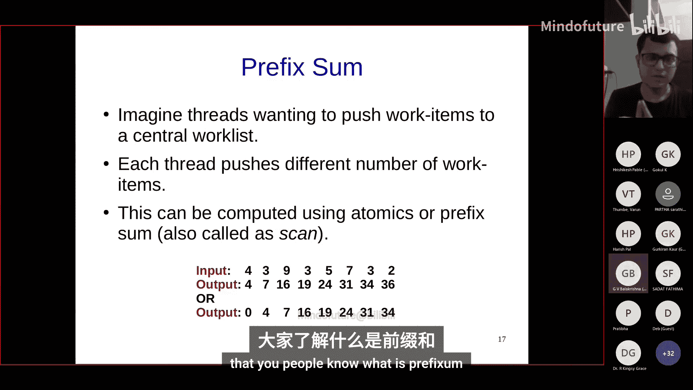

在学习了归约之后，我们来看一个与之相关但功能不同的算法——前缀和，也称为扫描（Scan）。


### 什么是前缀和？

对于一个输入数组 `[x₀, x₁, x₂, ..., xₙ₋₁]`，其前缀和输出数组 `[y₀, y₁, y₂, ..., yₙ₋₁]` 定义为：
*   `y₀ = x₀`
*   `y₁ = x₀ + x₁`
*   `y₂ = x₀ + x₁ + x₂`
*   ...
*   `yₙ₋₁ = x₀ + x₁ + ... + xₙ₋₁`

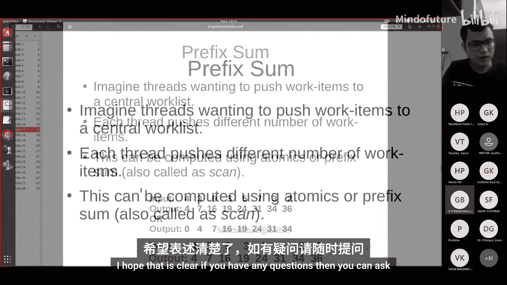


即，输出数组的每个元素是输入数组从起始到当前位置的累积和。

### 前缀和的应用

一个典型应用是**工作项分配**。假设有多个线程，每个线程需要向一个全局工作列表（数组）中推送不同数量的数据项。我们想知道每个线程推送的数据在全局数组中的起始和结束索引。

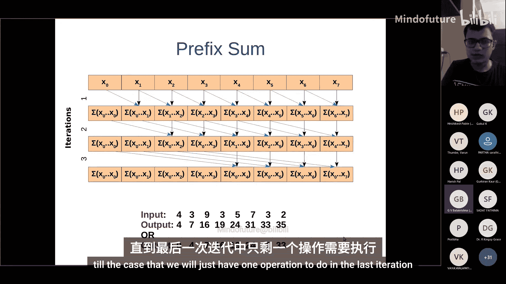


**例如**：
*   线程0推送4个项。
*   线程1推送3个项。
*   线程2推送9个项。
*   线程3推送5个项。

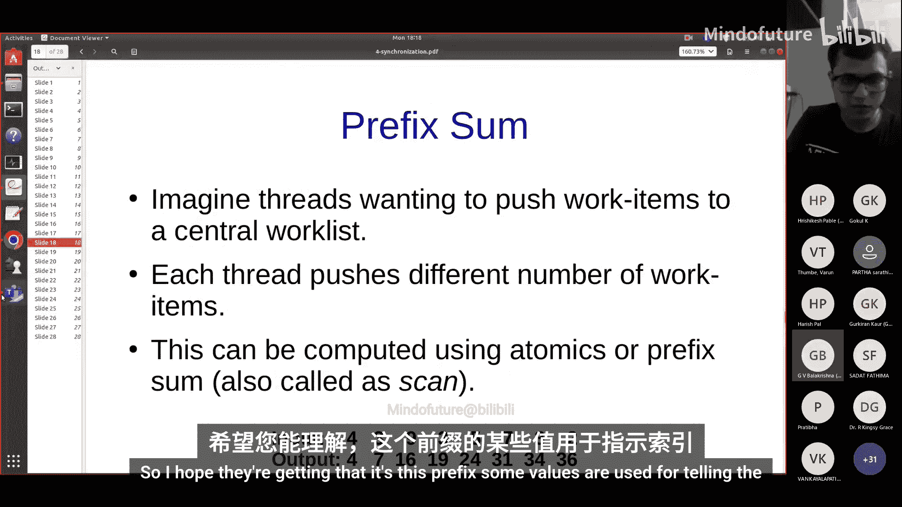


我们可以构建一个计数数组 `counts = [4, 3, 9, 5]`。计算其前缀和（从0开始）得到 `prefix = [0, 4, 7, 16]`。
*   线程0的项位于索引 `prefix[0]` 到 `prefix[1]-1`，即 `[0, 3]`。
*   线程1的项位于索引 `prefix[1]` 到 `prefix[2]-1`，即 `[4, 6]`。
*   以此类推。前缀和提供了每个线程数据在全局数组中的“偏移量”。

### 前缀和算法实现（Blelloch Scan）

以下是一种高效的前缀和并行算法实现（上行扫描）：

```cuda
__global__ void prefix_sum(int* data, int n) {
    // 假设 data 是全局数组，n 为2的幂，且只使用一个线程块
    // 上行（Reduce）阶段：构建求和树
    for (int offset = 1; offset < n; offset <<= 1) {
        int id = threadIdx.x;
        int temp = 0;
        if (id >= offset) {
            temp = data[id - offset]; // 读取前一个偏移量的值
        }
        __syncthreads(); // 分离读和写，避免数据竞争
        if (id >= offset) {
            data[id] += temp; // 累加到当前位置
        }
        __syncthreads(); // 同步本次迭代
    }
    // 此时 data 数组的最后一个元素 data[n-1] 是总和
    // 下行（Downsweep）阶段（此处省略）：将部分和分散，得到最终前缀和
    // ... (需要额外的步骤将 exclusive scan 转换为 inclusive scan，或反之)
}
```

**算法逻辑（以上行阶段为例）**：
1.  `offset` 从1开始，每次迭代翻倍（1, 2, 4, ...）。
2.  对于每个`offset`，每个线程（除了前`offset`个）读取当前位置向前`offset`步的值。
3.  使用`__syncthreads()`**确保所有读取操作在写入开始前完成**，这是避免数据竞争的关键。
4.  将读取的值累加到当前元素。
5.  再次同步，确保本步所有计算完成，再进行下一步。

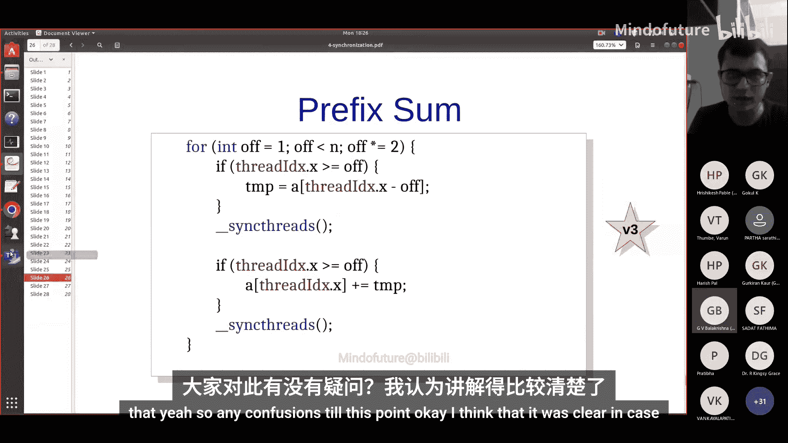


**图解**（简化上行阶段）：
初始: `[1, 2, 3, 4, 5, 6, 7, 8]`
`offset=1`: `[1, 1+2, 2+3, 3+4, 4+5, 5+6, 6+7, 7+8]` -> `[1, 3, 5, 7, 9, 11, 13, 15]`
`offset=2`: `[1, 3, 1+5, 3+7, 5+9, 7+11, 9+13, 11+15]` -> `[1, 3, 6, 10, 14, 18, 22, 26]`
`offset=4`: `[1, 3, 6, 10, 1+14, 3+18, 6+22, 10+26]` -> `[1, 3, 6, 10, 15, 21, 28, 36]`
最终`data[7]=36`是总和。要得到完整的前缀和数组`[1,3,6,10,15,21,28,36]`，还需要一个下行阶段。

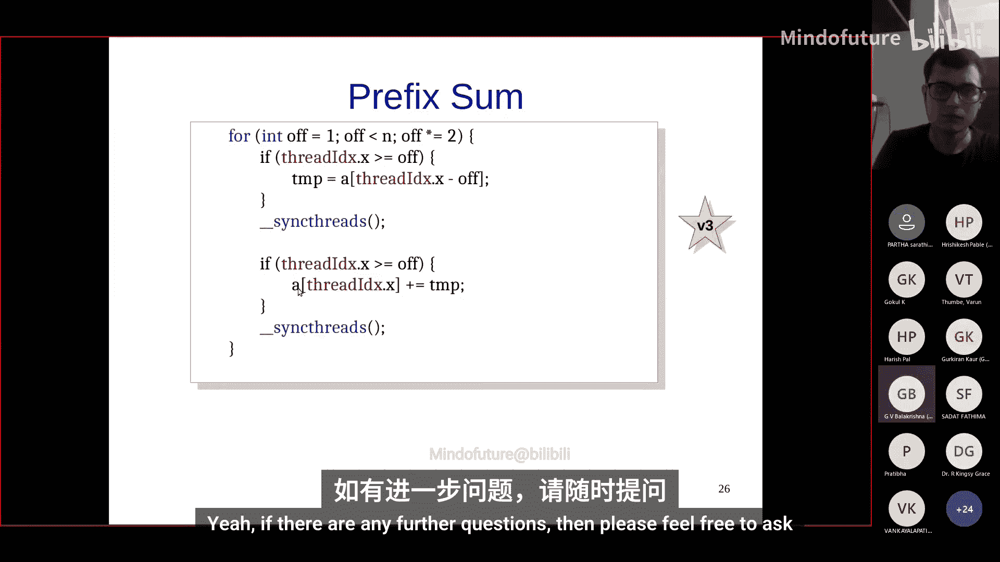


**关键点**：
*   **数据竞争**：在读取`data[id - offset]`和写入`data[id]`时，必须用屏障分离，防止其他线程同时修改正在读取的数据。
*   **屏障位置**：代码中使用了两个`__syncthreads()`。第一个确保“读”在“写”之前完成；第二个确保本步所有计算完成，属于迭代间的控制同步。
*   **复杂度**：同样为 **O(log N)** 步。

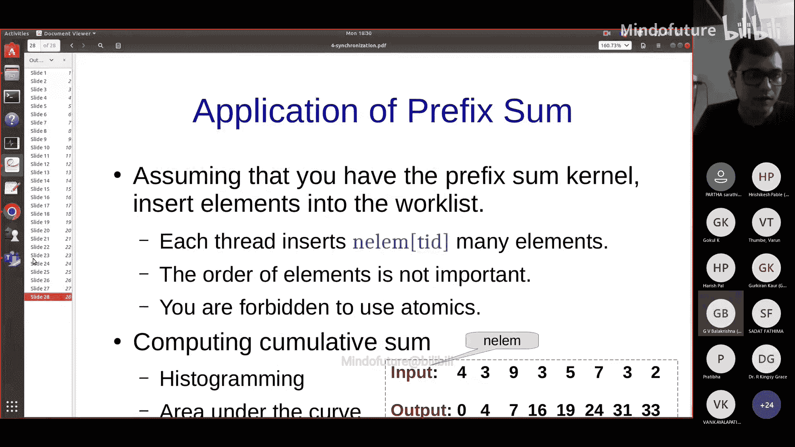

### 其他应用
前缀和不仅用于上述偏移计算，还广泛应用于：
*   流压缩（Stream Compaction）：过滤数组中的有效元素。
*   基数排序（Radix Sort）的关键步骤。
*   构建数据结构，如芬威克树（Fenwick Tree）。
*   计算直方图（Histogram）的累积分布。


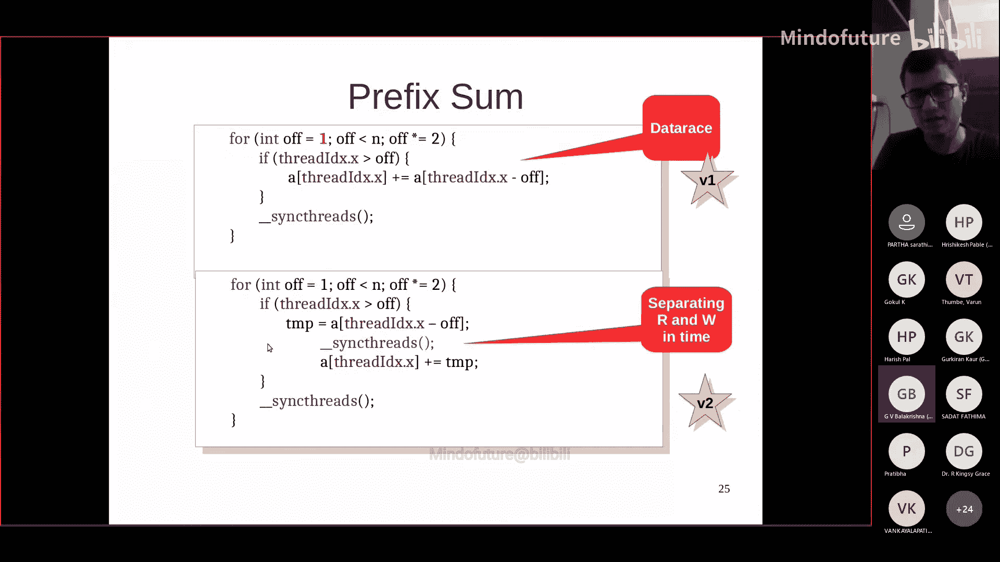


---

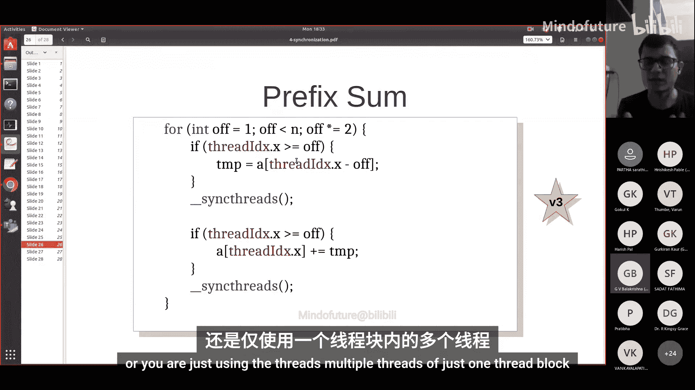


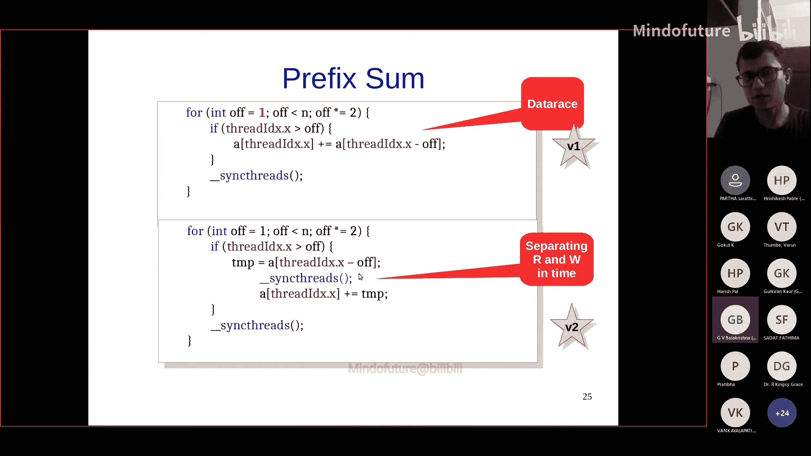

## 总结


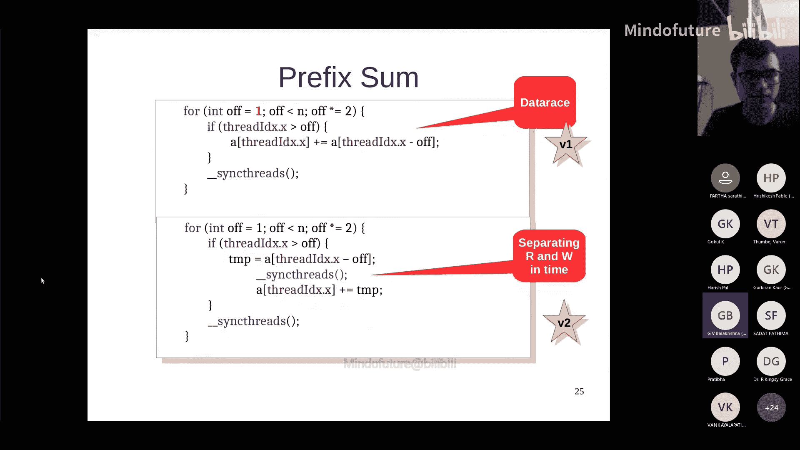


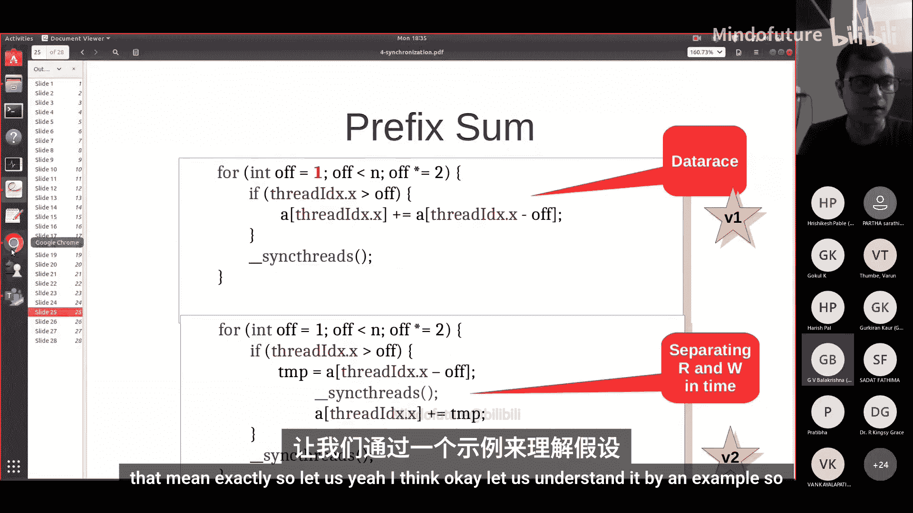

本节课中我们一起学习了CUDA编程中三个重要的高级主题：
1.  **屏障**：深入理解了`__syncthreads()`和`grid.sync()`的同步范围，并通过例子认识到屏障选择不当可能导致逻辑错误。同时，明白了屏障兼具控制同步和数据同步（通过内存栅栏）的功能。
2.  **归约**：掌握了将大规模数据并行聚合为单一值的高效方法。理解了归约的树形结构思想，学习了其并行实现代码，并认识到其相对于原子操作的巨大性能优势。
3.  **前缀和**：学习了前缀和的概念及其在并行计算中的关键应用（如工作分配）。分析了一种并行前缀和算法的实现，特别注意了其中使用屏障来避免数据竞争的技巧。


这些算法是许多并行计算应用的基础构件，理解它们对于编写高效、正确的CUDA程序至关重要。