# 003：CUDA - New Features and Beyond

## 概述

在本节课中，我们将跟随英伟达杰出软件架构师Steven Jones的视角，探讨CUDA并行计算平台的最新进展与未来方向。课程将围绕一个核心主题展开：在当今能源受限的计算世界中，如何通过硬件与软件的协同创新，在提升性能的同时，实现更高的能效。我们将从计算与数据移动这两个主要的能耗来源入手，深入分析低精度计算、张量核心、即时编译、Python生态集成、大规模系统编程以及Grace Hopper统一内存架构等关键技术如何共同塑造高效能计算的未来。

---

## 能源：计算的终极约束 🚀

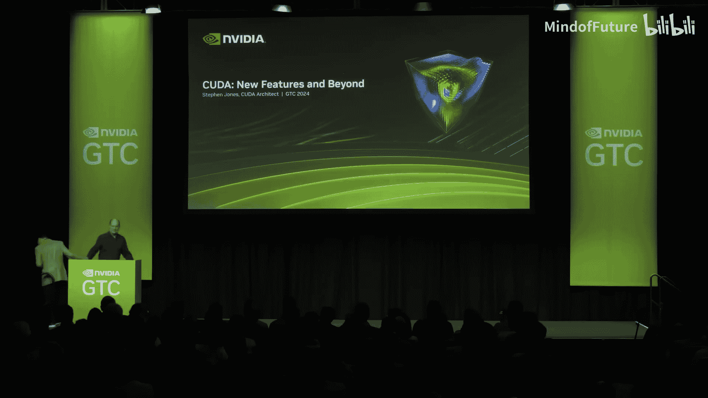

现在，让我们开始今天上午的课程。我很荣幸地向大家介绍Steven Jones。

Steven是英伟达的杰出软件架构师，他将为我们展示CUDA并行计算平台最新、最伟大的成果。

他在英伟达工作超过14年，最初是一名软件工程师。

2008年，他成为CUDA团队的高级软件工程师。期间，他曾在SpaceX短暂工作，并见过埃隆·马斯克，他可能会分享一些相关经历。

但那段时间对他而言是一次很好的“分心”和“转向”。今天，他将结合他在剑桥大学获得的航空与航天工程硕士学位经验进行分享。

接下来，我将把时间交给Steven，请他谈谈CUDA。

非常感谢各位的到来。这真是太棒了。我确信每个人都这么说。

但我还没参加过一场演讲。能真正与人交谈，而不是对着屏幕上的摄像头录制演讲，这种感觉真的很棒。

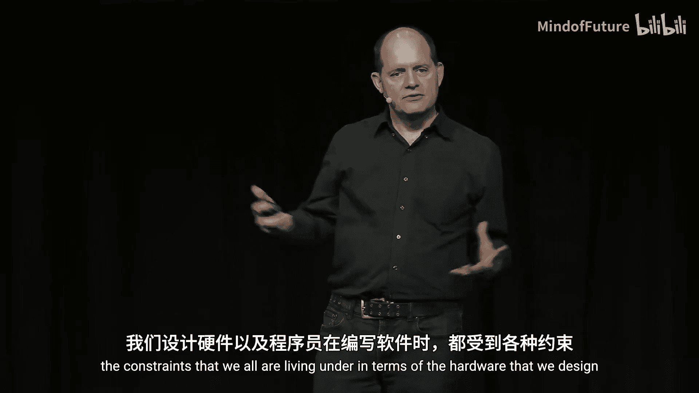

所以，非常感谢大家来到这里。我是CUDA的架构师之一。

因此，我的时间都花在思考CUDA平台、语言以及与之相关的所有系统和组件上。同时，我也与硬件团队紧密合作。

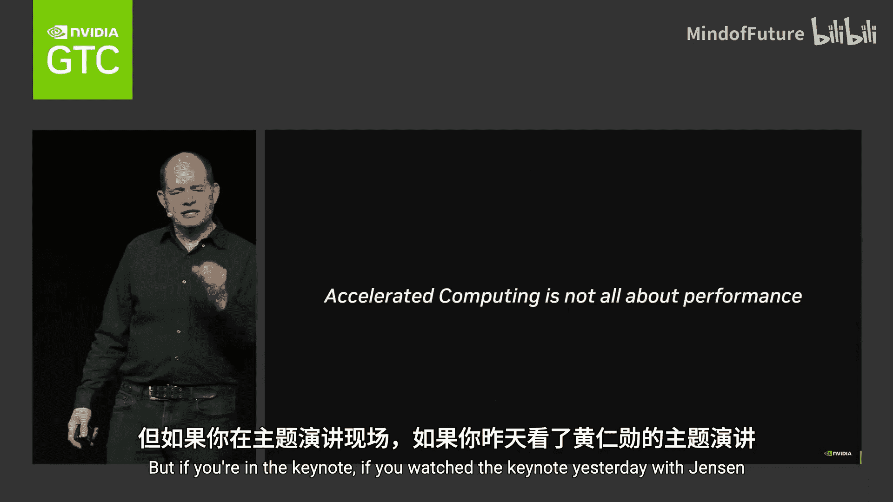

尽管我是软件工程师，但我大约一半的时间都在与硬件团队一起工作，研究我们下一代以及下下代GPU将会是什么样子。

因为我们有幸能够将硬件和软件结合起来，从而构建我们想要的编程模型，并为我们构建的硬件进行编程。

现在，我将从我在与硬件团队合作中学到的一些东西开始今天的分享。

我认为这确实驱动了我今天要谈论的许多事情的思考方式，也影响了我对硬件如何受物理定律以及我们在设计硬件和编写软件时所面临约束的理解。

在英伟达的加速计算大会上说这个可能有些争议，但加速计算并非只关乎性能。

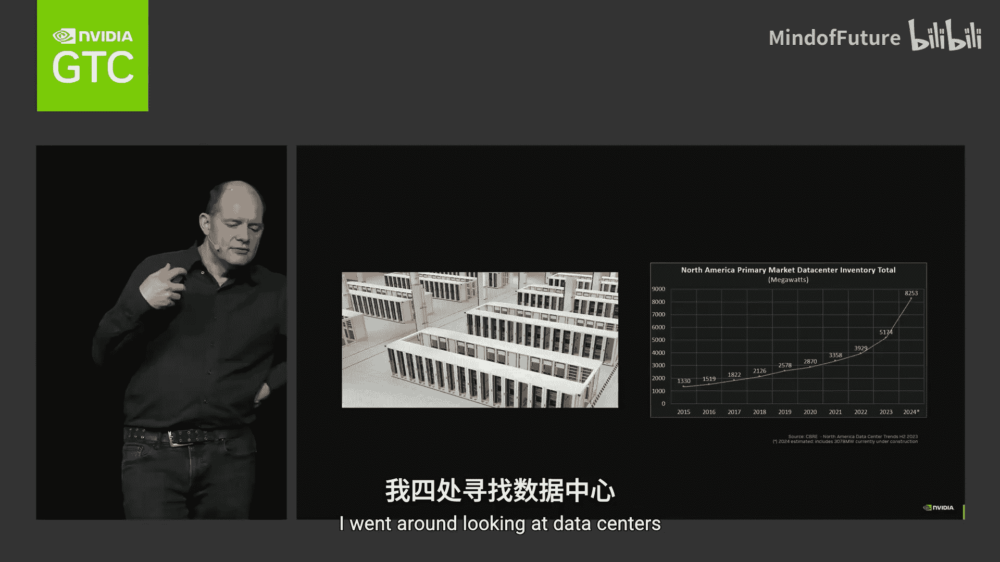

如果你参加了昨天的主题演讲，或者观看了Jensen的演讲，他真正谈论的是能效。

没错，这不仅仅是性能。它关乎每瓦性能。因为最终，你必须为这些设备供电。

你必须为机器提供能量。因此，效率才是你必须关注的关键指标。是的，你希望提升性能，但你也必须在提升效率的同时进行扩展。

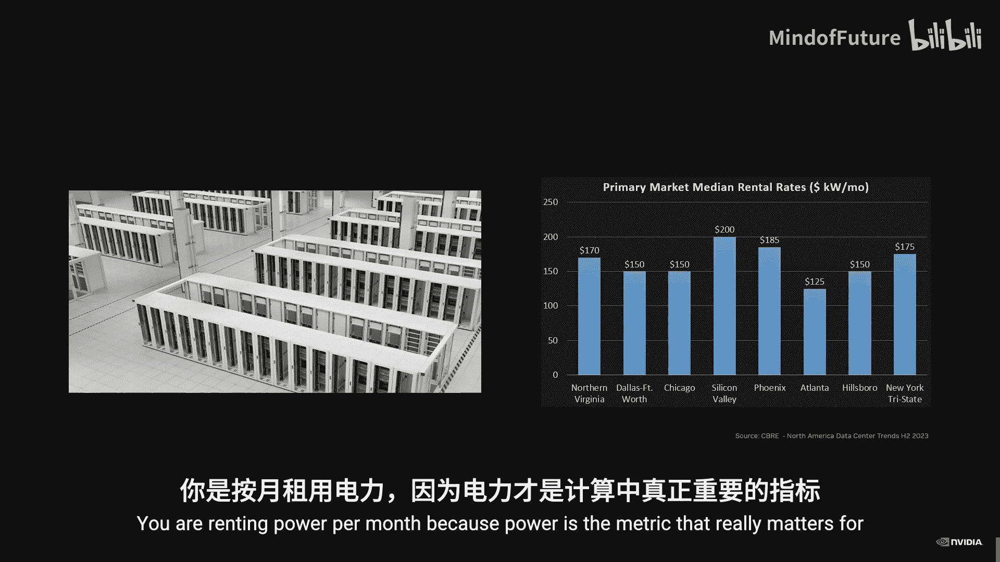

为了准备这次演讲的开场，我做了一些研究，并找到了一个明显的例子。我查看了数据中心的情况。

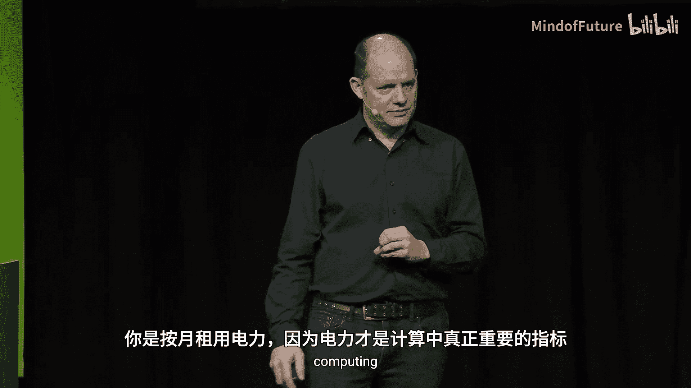

全球正在以惊人的速度建设数据中心。他们每天大约要建成并启用6到7个数据中心。

但我试图查找他们建设的数据中心数量时，发现没有人按数量列出数据中心。他们按兆瓦列出数据中心。

因为功率是数据中心中真正重要的东西。目前北美有总计5吉瓦的数据中心。

明年还将有另外3吉瓦的数据中心投入使用。当你去租用数据中心时，你是按每月千瓦来付费的。

没有人关心你租用了多少台服务器。没有人关心你租用了多少数据中心，你是按每月租用功率来付费的，因为功率才是计算中真正重要的指标。

一个中等规模的数据中心通常运行在20兆瓦左右。这是因为我有一个大型建筑，接入了一个巨大的电力连接器，这个连接器提供20兆瓦的电力。

所以，如果我制造出一款速度翻倍的新芯片，但它的功耗也翻倍，我无法神奇地向这个房间注入更多电力。

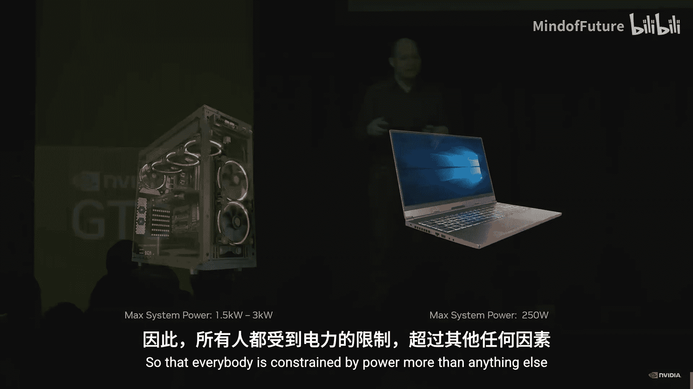

我最终只能安装一半数量的芯片。我有20兆瓦。问题是，我能用这20兆瓦做什么？

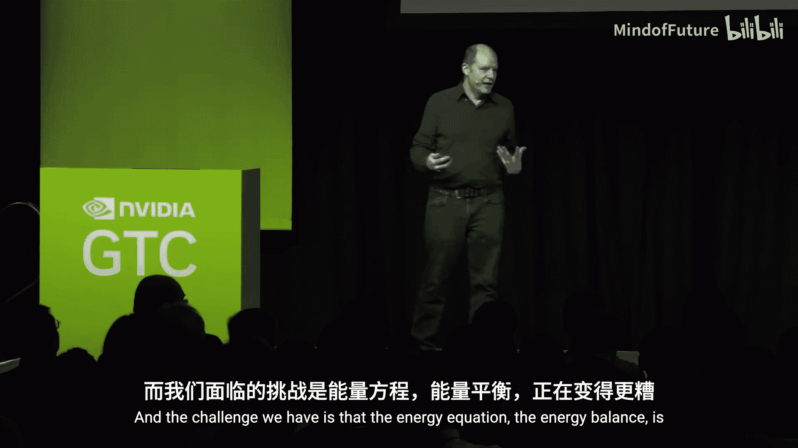

同样，如果你观看了Jensen关于Blackwell的主题演讲，他谈了很多关于能效和功率效率的问题。这是一个非常重要的焦点。

在硬件方面，这是他们都在思考的问题。每一个晶体管都至关重要。

但这不仅仅是在数据中心。在我自己家里也是如此。我的台式机从墙上获取电力。

我不能给它接入10吉瓦的电力。如果我在美国，我的最大系统功率是1.5千瓦；如果我在英国，则是3千瓦。

我的笔记本电脑功率甚至更小。因此，每个人都受到功率的限制，这比其他任何因素都更重要。

所以，这确实完全关乎能源。

我们面临的挑战是，能源平衡方程正在恶化。

左边的图表是众所周知的摩尔定律图表。它展示了一系列数字，追溯了自摩尔在1970年左右提出其定律以来的晶体管密度。

它几乎一直呈指数增长。左边是对数坐标图。

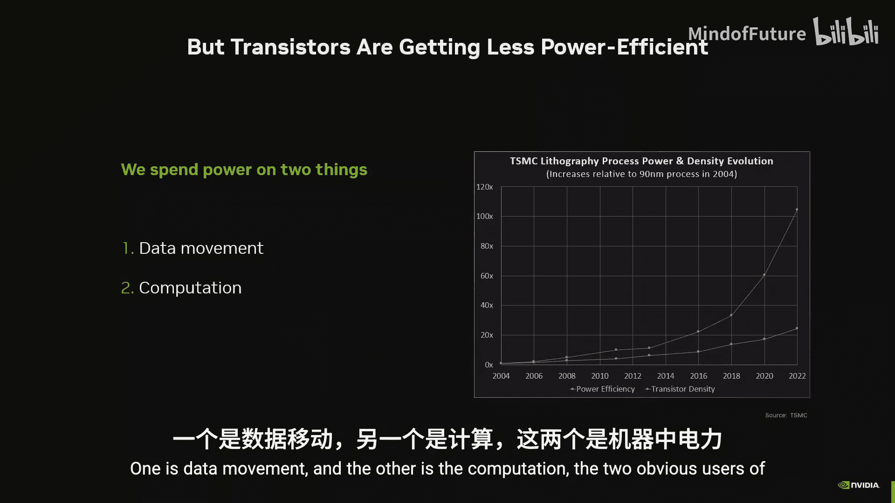

在右边，我去了台积电的网站，提取了他们不同芯片及其晶体管密度的所有信息。

那条橙色的线当然也在呈指数增长。但当你仔细查看这些数据时，你会发现另一个现象。

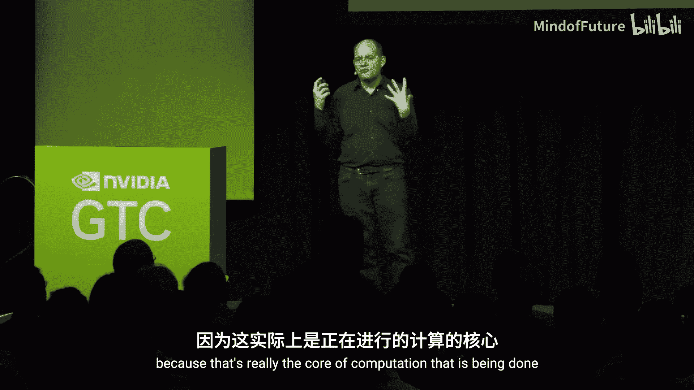

那就是功率效率的缩放比例。当我缩小晶体管时，开启它们所需的电子更少，因此功耗更低。

但功率的下降速度跟不上晶体管数量的增长。

在一个能源受限的世界里，这是一个问题，因为当我不断增加晶体管时，我必须解决功率问题。

显然，我们非常关注硬件的效率。这至关重要。当然，我这么说是因为我是软件工程师。

但从软件效率的角度来看待这个问题也同样至关重要。

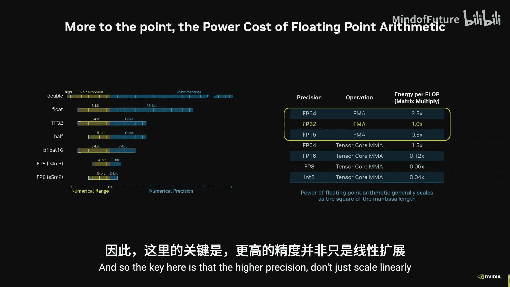

因此，我将讨论几个关键的能耗来源。一个是数据移动，另一个是计算。

这两者是这些机器中电力和能量的明显消耗者。

---

## 计算效率：精度与张量核心的博弈 ⚖️

上一节我们讨论了能源是计算的终极约束。本节中，我们来看看计算本身如何影响能效。

从计算开始，让我们先谈谈浮点运算，因为这是正在进行的计算的核心。

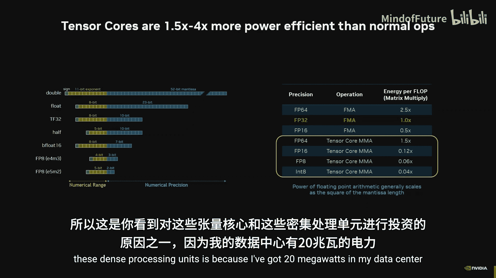

事实上，大多数运行GPU的数据中心，其绝大部分浮点运算和功耗可能都花在了矩阵乘法这类操作上。

因此，我查阅并整理了一个小表格。

左边列出了英伟达提供的各种不同精度。这有很多原因，但现在我将特别关注其中一个与功率相关的方面。

在右边，我可以将其分解为执行不同精度乘法所需的能量。

FMA是融合乘加运算，它是计算机中算术运算的基本单位。

如果你看顶部，标准的单精度32位浮点运算，我已将所有数据归一化到大约1倍。

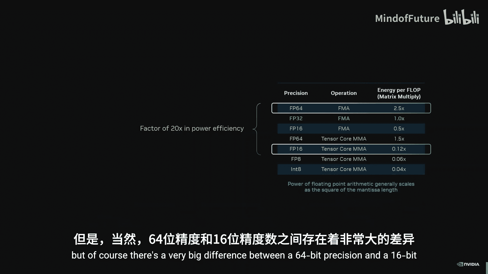

双精度大约是2.5倍的功耗，半精度大约是0.5倍的功耗。

这里的关键在于，更高精度的功耗并非线性增长。浮点乘法运算的功耗与尾数长度的平方成正比。

这就是左边图表中的蓝色部分。所以，我的数字越长，计算它所需的功耗就越大，因为我有更多的小数位，有更多的比特需要移动。

然后你看看张量核心。张量核心完全不同。它将单个操作组合在一起。

通过规模经济，你可以看到每浮点运算能耗的显著变化和改进。

因此，你在这些张量核心、这些密集处理单元上看到这些投资的原因之一就是：我的数据中心有20兆瓦，我想尽可能多地塞入浮点运算能力。

这正是这种改进的来源所在。

因此，你可以看到这些有趣的平衡。双精度FP64张量核心，这里看的是Hopper H100的数据，比单独的乘加运算更高效。这就是我所说的规模经济。

但如果你看看16位精度的差异，它的效率不是高1.5倍，而是高4倍，因为同样是尾数比特数的平方效应为我赢得了功耗优势。

但我要看一个我认为更有趣的东西，那就是这些64位运算与这些低精度张量核心之间的差异。

64位运算是单精度功耗的2.5倍，而低精度张量核心的能效则高出约20倍。

当然，64位精度数和16位精度数之间存在巨大差异。

事实证明，差异并没有你想象的那么大。这并非新研究，但最近有很多相关工作。

我真的很想告诉你们这个，因为我认为这对我来说，是我们应对功耗挑战的一种非常令人兴奋的方式。

几年前，我介绍过我同事Asm Haar的一些工作，下面有论文引用。他们使用张量核心进行LU分解矩阵求解，其中繁重的计算在16位精度下完成。

然后通过一个迭代过程，即VMS过程，将你的16位结果逐步提升回64位精度值。

在论文中，他们研究了这一点。这张图底部显示了迭代次数。

我使用16位张量核心，它们实际上输出32位结果。然后我迭代大约34次。

中间那条线是FP64的精度水平。我可以越来越接近最终结果。最终，我超过了原生64位数的完美精度。

因此，这在结果上没有任何妥协。这与你会得到的结果在比特级别上完全一致，只是我使用了能效高得多的张量核心来完成繁重的计算。

这真是一件大事。这里有一张图表，是我这周末请人帮忙运行的。

运行的是一个LU分解求解，就是前面流程图中的那个。绿线是GH200的顶部，两者都是200，绿线是16位加64位迭代。

图表中间的蓝线是纯原生的双精度值。

所以你可以看到，你不仅获得了底部巨大的功耗优势，每瓦浮点运算性能提升了近6倍，这令人难以置信。

现在，使用这种技术，我可以在功率受限的数据中心中，比使用原生双精度数获得完全相同结果时，多做6倍的浮点运算。

同时，我的速度也快了近4倍。所以，我更快，也更高效。这太棒了，意义重大。

这个算法实际上已经在Cusolver库中实现。但我看到，这种技术正在扩展到所有领域。

如果我能更快、更高效地完成工作，这就是我们应对即将到来的功耗墙的一种方法。

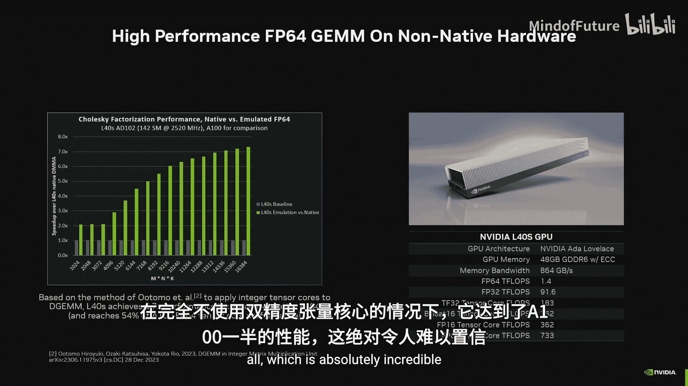

不仅仅是Asm的工作，其他人也在研究。我的老朋友，东京大学的Rio Yocottta，他和一些同事写了一篇论文，研究了一种完全不同的方法。

但同样使用了低精度，在他的案例中是整数张量核心来进行矩阵乘法。

我们英伟达的一些天才工程师实现了它。他们所做的不是使用像GH200这样的高功耗芯片，而是使用了L40或L40S。

这是功耗较低的数据中心部件，它本身就没有原生的双精度张量核心。

利用L40S中的16位张量核心，他们能够运行矩阵乘法，性能提升了6到7倍。

甚至在没有适当的高性能双精度单元的情况下，他们将其与A100进行了比较，我没有放在图表上，但性能达到了A100的一半。

这绝对令人难以置信。这为功耗低得多的部件打开了大门，使其能够实现A100 50%的性能，这太不可思议了。

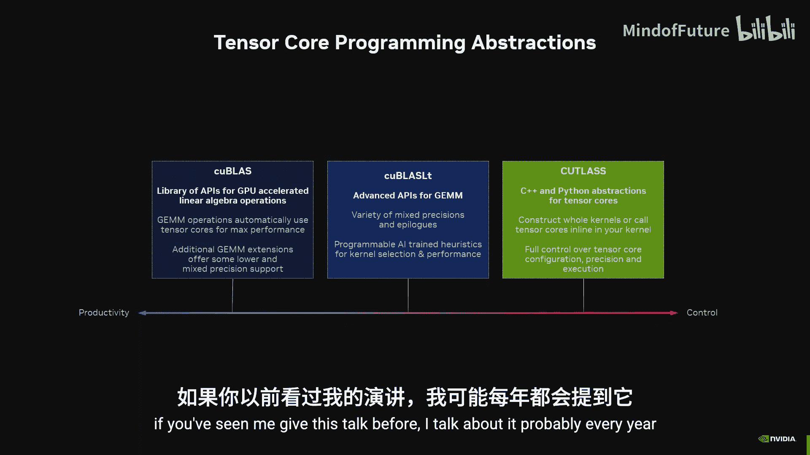

不仅如此，功耗节省也同样显著。在性能提升6到7倍的同时，每瓦性能也提升了7到8倍。

所以这意义重大。这让我着迷。我很幸运能做这个演讲，我可以找到公司里正在发生的所有这些很酷的事情并告诉你们，因为我觉得它们很有趣。

我认为这真的很吸引人，因为我们可以用这类技术做很多事情。

---

## 编程张量核心：从库到内核融合 🔧

上一节我们探讨了低精度计算和张量核心带来的能效革命。本节中，我们来看看如何实际编程和使用这些强大的张量核心。

现在，张量核心本身。很多人来问我，如何编程张量核心？

张量核心是一个复杂的系统，它们有所有这些不同的精度和不同的使用方式。

但你访问张量核心的三种主要方式是：首先通过cuBLAS数学库。

这是自CUDA诞生以来就存在的基本工具，它是线性代数库。你调用一个矩阵乘法，它会自动通过张量核心执行。

cuBLAS实际上调用的是中间那个叫做cuBLASLt的库。cuBLASLt你也可以自己访问，它是一个公共库。

它提供了这些高级API，让你可以真正控制张量核心的更多方面。张量核心有很多不同的配置和模式，你可以真正访问它们。

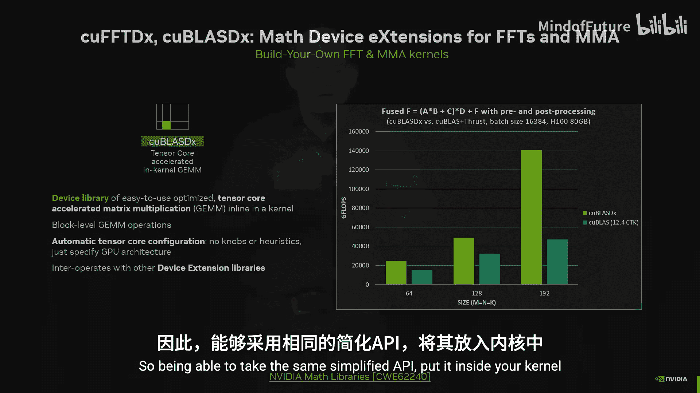

在右边，我们有叫做CUTLASS的东西，如果你以前听过我的演讲，我可能每年都会谈到它，因为它确实是程序员使用张量核心的方式。

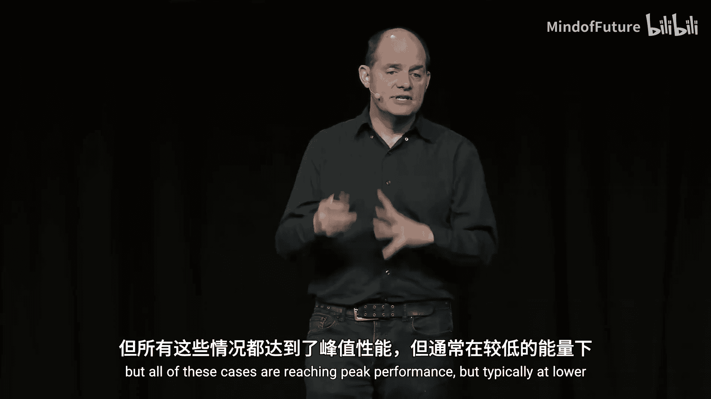

它让你在自己的内核中编写张量核心代码，并访问所有不同的旋钮和配置。

因此，我以另一种方式画出了这个图，因为实际上有几个不同的维度。

左边是cuBLAS的生产力维度，我调用一个API，就能获得峰值加速。

右边是控制维度，如果我真正想开始调整它，并将其与我的数据合并和融合。

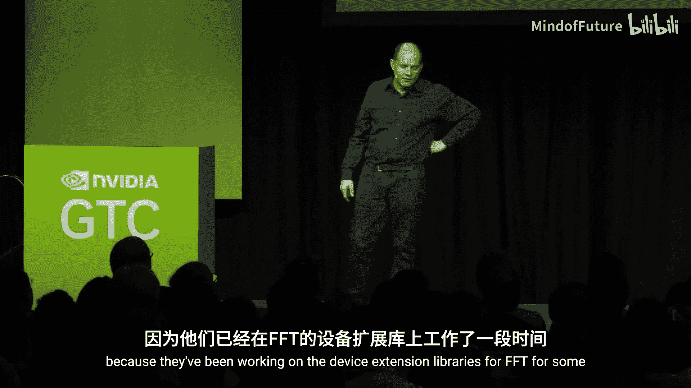

数学库团队所做的工作之一就是开发了设备扩展库，叫做cuBLAS设备扩展库。

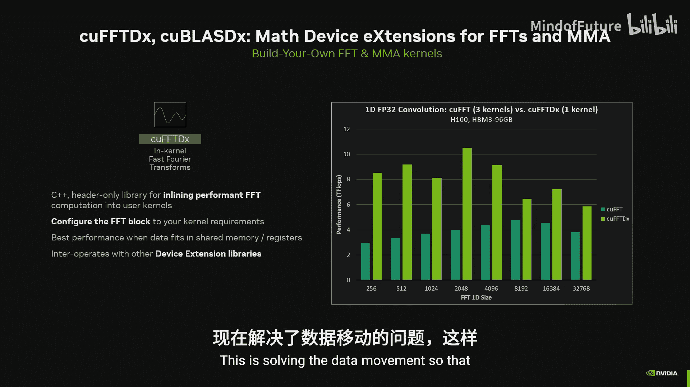

这将左边cuBLAS的生产力路径带入了你的设备内核。

因此，虽然CUTLASS是一系列层次化的C++类，提供了极其精细的控制，但cuBLAS DX侧则采用了完全不同的方法。

其理念是，你可以通过一个简单的`gemm`调用在你的内核中激活张量核心，就像你在CPU上使用cuBLAS一样。

那么，你为什么要这样做呢？因为有时你不仅仅想要一个矩阵乘法。

你还想对结果进行一些操作。这就是我们所说的融合。你获取一些数据，以某种方式处理它，进行一些大型矩阵操作，然后以某种方式使用结果。

通过将所有这些东西融合在一起，在这个图表中，通过将预处理步骤、两个矩阵乘法融合在一起以及后处理步骤全部放在一个内核中，与使用thrust和cuBLAS进行一系列调用的方式相比，性能提升了三倍。

因此，能够将相同的简化API放入你的内核中，并按你想要的方式定制它，也能带来性能提升。

同样，在这些案例中我没有展示每瓦性能，但所有这些案例都达到了峰值性能，而且通常能耗更低。

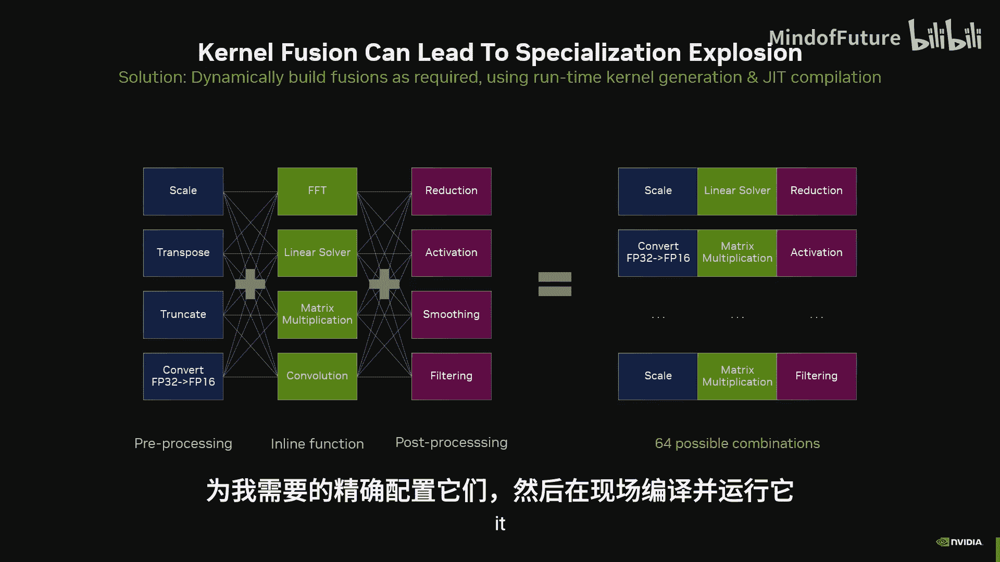

对于FFT也是如此。我去年实际上展示过这个，因为FFT的设备扩展库已经开发了一段时间。

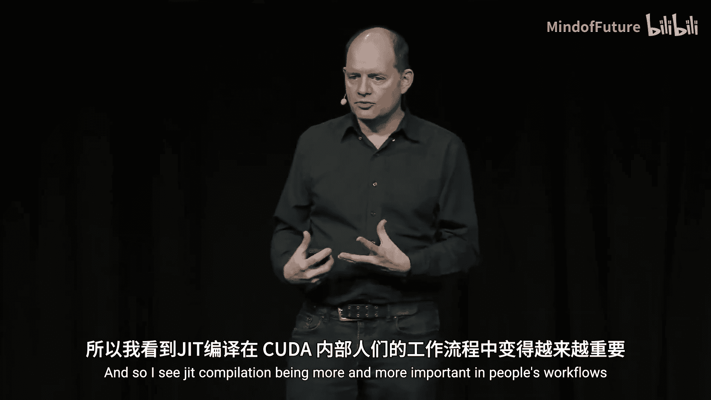

FFT同样，将FFT与你其余的操作融合。在这个案例中，我将三个内核融合为一个。

同样，你看到了这些速度提升。这很大程度上来自于融合，我以能够将大量工作串联在一起的方式真正定制了我的内核。

我只加载一次数据。如果你还记得，我说过功耗成本有两个原因：一个是数据移动，另一个是计算。

这解决了数据移动问题，使得我的计算能够密集地应用其上，而无需在中间进行数据移动。

那么这是如何工作的呢？通过基本的内核融合。可能现在在座的许多人都知道这个。

如果我通常有一系列操作，也许我会进行一些精度转换，进行矩阵乘法，然后在其上运行一个激活函数，比如ReLU或其他类似的东西。

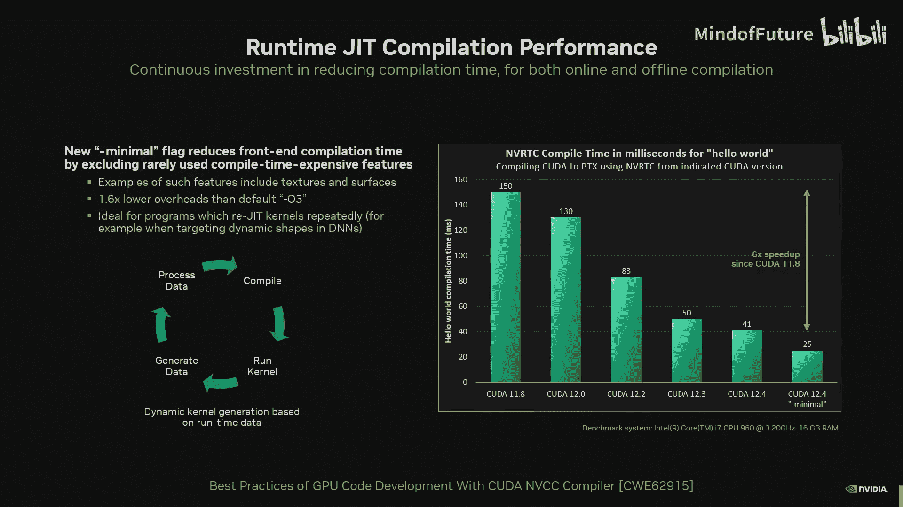

这是一些非常标准的操作序列。这就是刚才那些图表所展示的。

通过将它们融合在一起，你只加载一次数据，对其进行多次操作，然后在另一端存储数据。最终得到这些单一的融合内核。

这是一个好主意，如果可能的话，每个人都应该这样做。挑战在于，我不只做一件事，我可能要做100种不同类型的事情。

所以我在这张幻灯片上只画了四个，因为这是我所能容纳的。但即使只有四个，我也有64种可能的组合。

我不可能提前构建每一个。如果每一行有100个，我就有100万种不同的组合。这根本不可行。

所以我看到的是，当人们构建这些融合代码时，他们也越来越多地转向即时编译、运行时编译。

你说我的程序需要这个和那个，然后精确地为我所需配置它们，当场编译并运行。

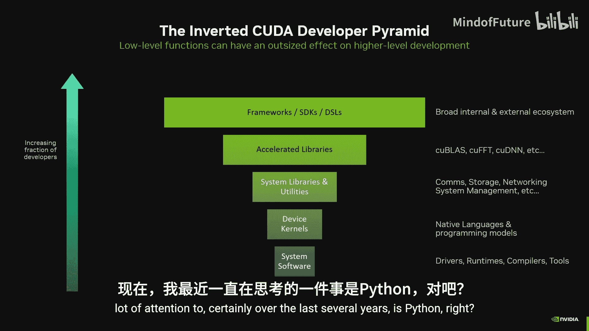

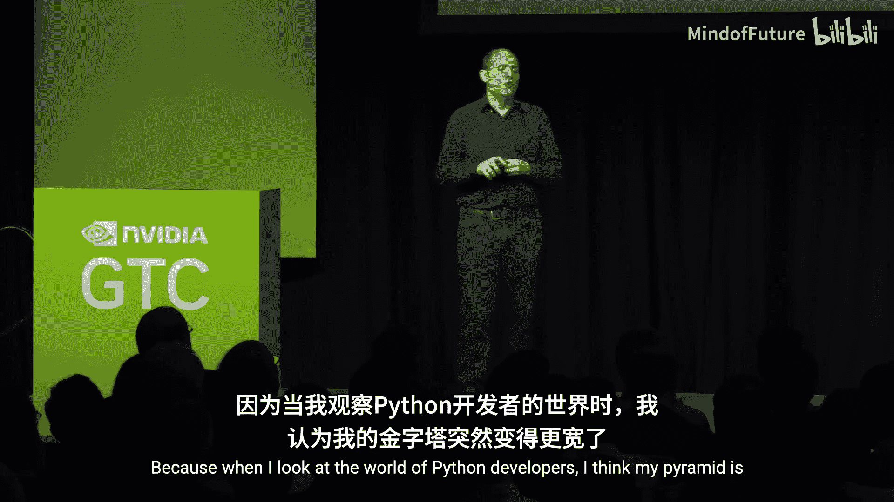

因此，我看到即时编译在CUDA内部的工作流程中变得越来越重要。

我们的编译器团队付出了努力。这张图表涵盖了大约18个月的时间，从CUDA 11.8开始。

他们持续降低了即时编译的性能开销，因为正如我在左下角所示，你经常有这种迭代循环。

你构建一个融合内核，运行它，获取一些数据，查看下一步要做什么，构建下一个内核，如此循环。

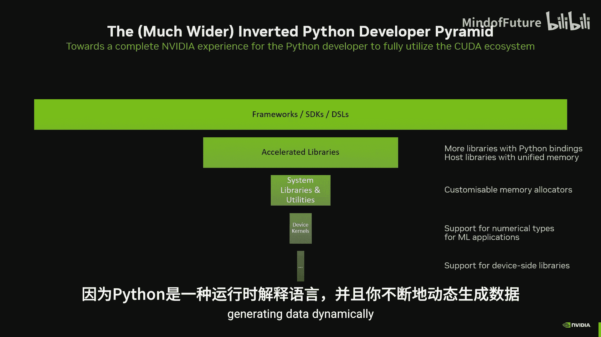

编译时间成为你主程序循环的一部分。因此他们非常努力地工作，将编译时间降低了。

这只是显示了“Hello World”的编译时间，所以基本上只是开销。“Hello World”是你能写的最简单的程序。

因此，即时编译的开销在过去18个月里下降了6倍。所以，重点确实在于我能以多快的速度操作，能以多快的速度编译，因为即时编译无处不在。

现在，即时编译。这些编译工具。我经常谈论，如果你看过我的演讲，当我思考CUDA时，我总是考虑整个平台。

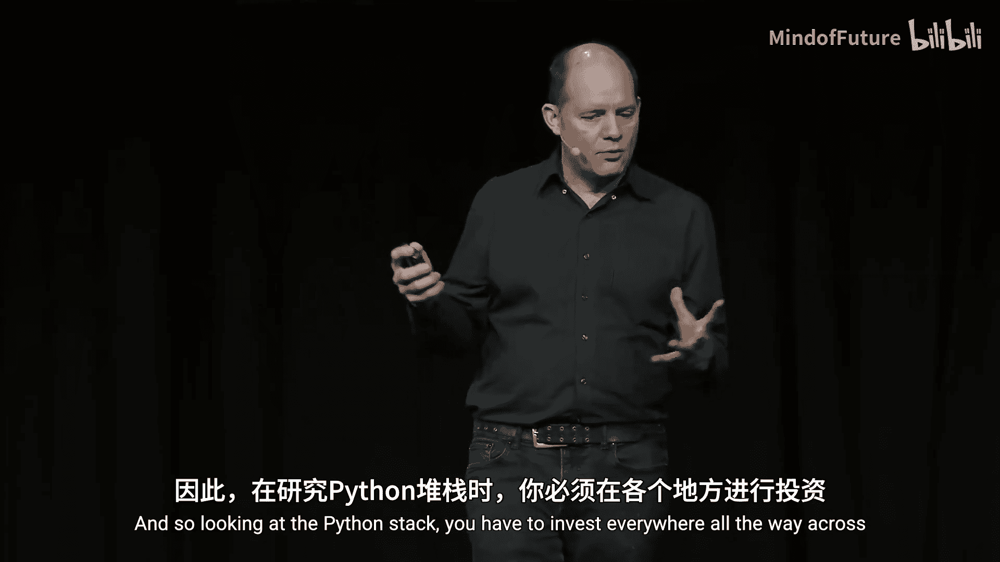

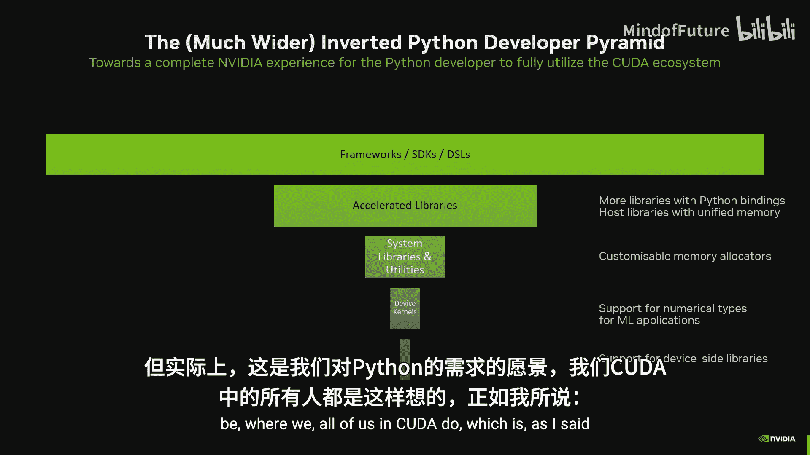

我作为CUDA架构师之一的工作就是思考所有这些事情如何协同工作。但没有什么是孤立存在的。

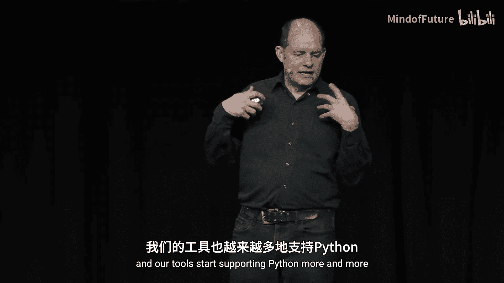

这里有一个倒金字塔。编写编译器的人非常少。有一些你们这样的人，我们爱你们，我们绝对支持你们，我们有LLVM和所有其他你们可以瞄准的目标。

但基本上，真正坐下来开始编写编译器的人数可能两只手就能数过来。在这之上，有内核库、主机端库。

然后是最顶层的框架和SDK的庞大宇宙。

---

## Python生态：拓宽CUDA的疆界 🐍

上一节我们讨论了即时编译和CUDA平台的层次结构。本节中，我们来看看Python如何成为连接底层硬件与庞大开发者群体的关键桥梁。

现在，这些天我思考很多并密切关注的事情之一就是Python。

因为当我观察Python开发者的世界时，我认为我的金字塔突然变得宽得多。

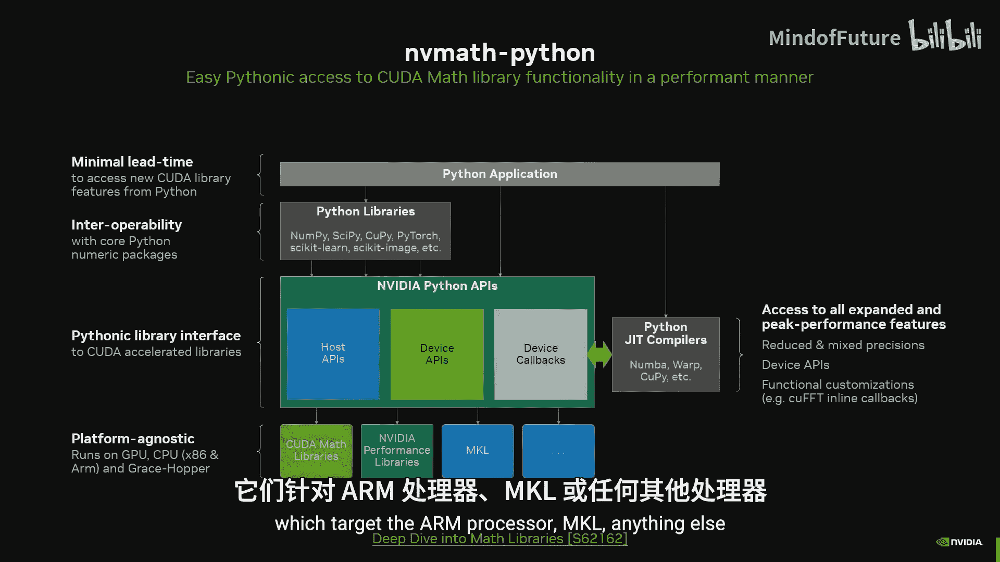

在顶层，我不是有100万用户，而是有1000万用户。

因此，你在底层构建的东西与它在顶层产生的影响之间的差距甚至更大了。

所以，对编译器进行更改，比如即时编译，在Python中极其重要，因为Python是一种非常运行时解释的语言。

你不断地动态生成数据。因此，编译在循环中是完全正常的。事实上，Python解释器基本上就是其中之一。

所以我们在最底层所做的这些改变影响了极其广泛的人群。

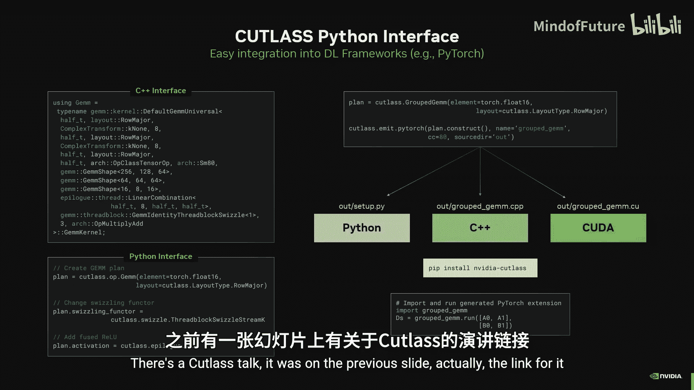

因此，审视Python技术栈，你必须在所有层面进行投资。我在这里列出了一些我们真正关注的领域。

但我们的目标，我把它作为这张幻灯片的副标题，但确实是我们对Python发展方向的愿景，也是我们所有CUDA人的愿景。

正如我所说，为Python开发者提供完整的英伟达体验，整个CUDA生态系统对Python编程可用且可访问。

其中一个方面是，你看到我们的库和工具开始越来越多地支持Python。

数学库团队投入了大量工作来生成符合Python习惯的接口，它原生且自然地连接Python应用程序到这些加速库。

我认为从根本上说，库是人们访问GPU加速的最常见方式。

顺便说一下，通过许多这些幻灯片，我附上了其他人演讲的链接。这是我朋友Artie和Harin的演讲链接，他们谈论了很多关于库的一切，这是一个重要的部分。

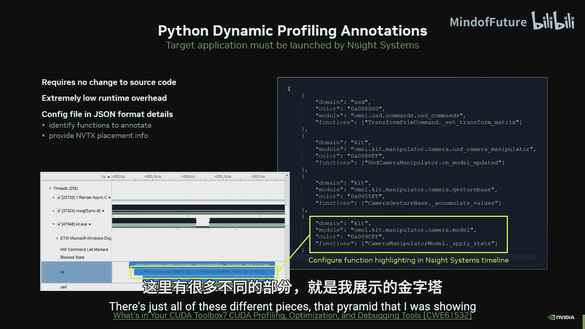

所以，如果你想了解更多，最后有一个索引列表，你可以去查看并了解我在本演讲中引用的所有不同演讲。

但Python库是一个完整的栈，它从你的应用程序开始，通过即时编译，经过不同的API，包括CPU端和GPU端，一直到底层库、GPU加速库、英伟达性能库，它们针对ARM处理器、MKL等。

所以，这是一个用于加速库的通用前端。

我之前谈到的张量核心的另一个方面是CUTLASS，它为你提供了对张量核心的详细配置控制。

CUTLASS也有一个Python接口。在左边这里，我只有几个框，一个显示C++接口的样子，下面显示等效的Python接口。

你可以去安装它，可以找到文档等等。在右边，他们将其与Python的PyTorch扩展集成。

因此，你可以从CUTLASS生成PyTorch。你可以自动将CUTLASS扩展的张量核心自定义内核带入PyTorch。

上一张幻灯片有CUTLASS的链接。去看看CUTLASS，它会告诉你更多关于这类事情如何工作的信息。

正如我所说，我们不仅在库上投资，也在工具上投资。

因此，CUDA平台的开发者工具团队，Insight团队，一直在努力将CPU代码和Python代码的输出组合在同一时间线中。

所以在右边，我有一个这样做的例子。同样，代码注释，我们称之为NVTx，它允许你通过注释来标识代码区域。

因此，你可以有一个绿色区域、蓝色区域，这样在复杂的性能分析和跟踪中更容易找到你想要的区域。

所有这些都可以通过JSON文件配置，并且都能很好地与Python程序配合工作。

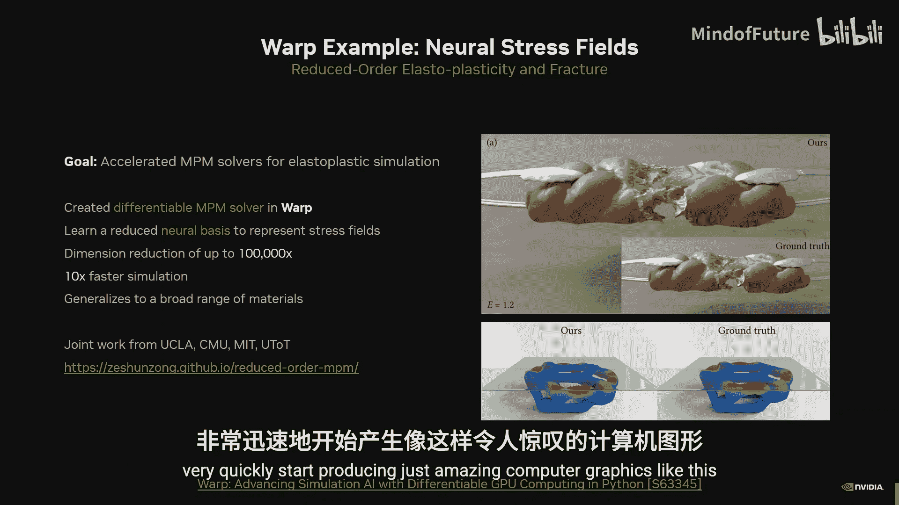

所有这些不同的部分，我展示的金字塔，你必须开始在所有不同的地方放置构建模块，这样最终你才能得到一个上下贯通、全面工作的生态系统。

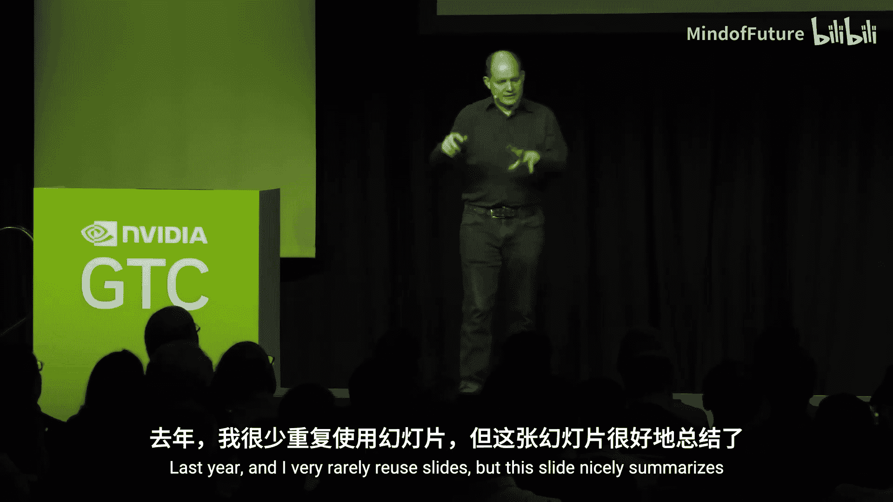

正如我所说，我四处寻找，发现了这些人们正在做的令人惊叹的事情。其中一件真正吸引我眼球的事情是Warp。

我的朋友Miles Macklin，他通常在新西兰，但他这周来这里做一个关于Warp的演讲。

他领导一个团队，构建了这个叫做Warp的东西。它是一个非常特别的东西。它让你用Python编写GPU内核，但这些内核是可微分的。

它原生且自动地获取你编写的内核，并通过即时编译，自动生成你的流程的反向模式微分版本。

因此，你可以有一个前向传递。它记录下来，你可以将其作为后向传递回放。

所以你可以构建模拟代码、物理代码、计算代码。在内核中，GPU加速，直接编译到GPU上运行，获得完整的编译后GPU性能。

但同时，这个可微分的反向管道也可用。你可以用它做的事情令人难以置信。

这里有一个完整的编译器链，接收Python代码，将其转换为PTX，并在GPU上运行。

但它让你能做这些事情，这些令人惊叹的模拟事情。他的演讲链接在下面，去看看吧。

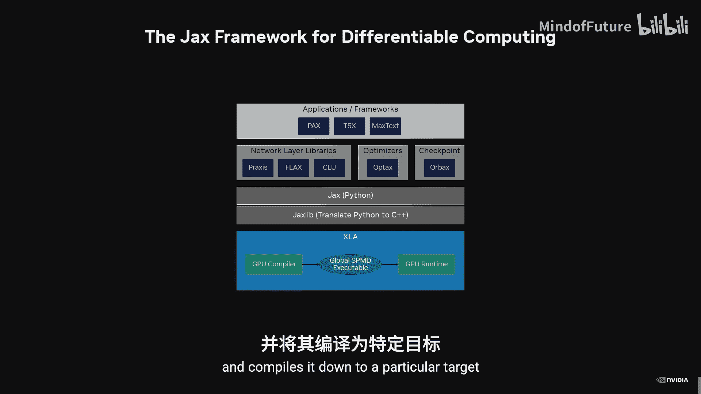

首先，这是令人难以置信的技术。其次，他在计算机图形学领域做这个，所以他有漂亮的视频和视觉效果。

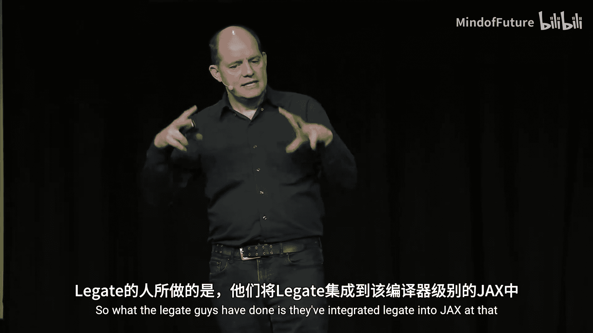

但这是一个例子，模拟像撕开面包这样的塑料系统这样极其复杂的东西。

大的那个是模拟，地面实况看起来几乎一模一样。能够做到这一点，并教会一个神经网络模型遵循像这样的塑性变形函数并正确工作。

通过自动微分，你可以直接运行模拟。反向微分传递用于训练模型。

然后模型可以非常快速地开始产生像这样令人惊叹的计算机图形和像这样的模拟结果。去看看他的演讲吧。

---

## 大规模系统：从单机到千卡集群 🌐

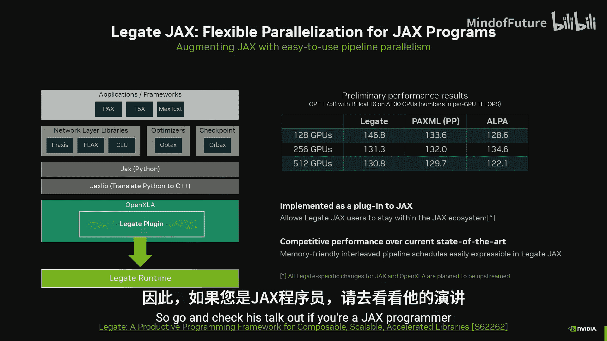

上一节我们聚焦于Python生态和单设备编程。本节中，我们将视野扩展到大规模分布式系统，看看CUDA如何助力跨越数千个GPU的超级计算。

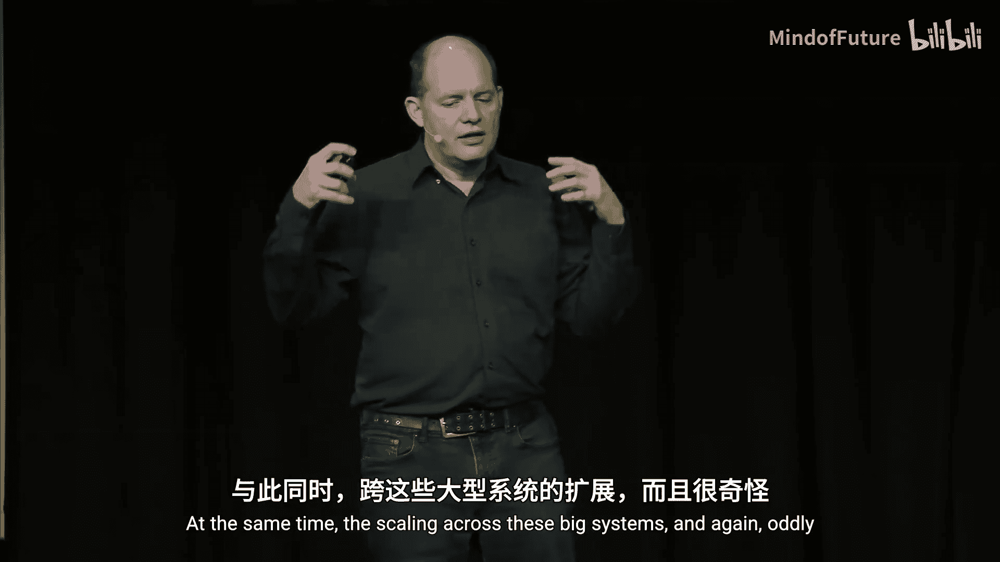

去年，我很少重复使用幻灯片，但这一张很好地总结了我告诉过你们的一个叫做Legate的东西。

我想再告诉你们一些，因为它再次契合了我一直在谈论的许多内容。

Legate是一个框架，它获取你的基本单线程代码，并将其非常广泛地分布到大量机器上。

这些机器变得越来越大，处理越来越多的数据，编程这些东西变得越来越困难，这就是像Legate这样的东西的用途。

它是一个栈，顶层有库，中间有运行时，它运行在加速库之上，跨越你的整个机器。

最后，我展示了一个使用NumPy的基本模板基准测试，它可以与这个我们称为cunumeric的东西通信，cunumeric是一个基于Legate的NumPy实现。

它自动将你的NumPy程序扩展到1000个GPU上。这是一个相当简单的计算，但它是一个非常强大的工具。

因此，他们所做的是将Legate应用到JAX框架上。JAX是另一个用于可微分计算的框架，你们很多人可能听说过。

JAX框架当然在机器学习、AI中大量使用，但它实际上是一个可以运行几乎任意模拟的框架，是另一个可微分计算的东西，类似于我刚才展示的Python中的Warp。

JAX基于XLA编译器，XLA接收JAX的所有不同层，并将其编译到特定目标。

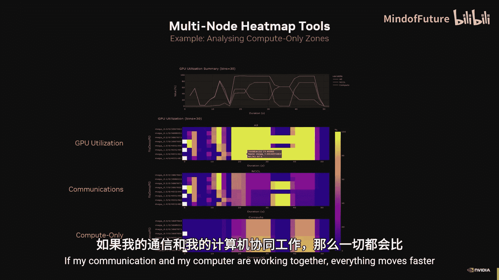

因此，团队所做的是在编译器级别，在XLA级别将Legate集成到JAX中。

所以你的JAX程序结构不变。你的JAX程序结构相同。你标记一些东西，用装饰器和配置来指示程序的流水线阶段，我认为他们将来能够将其放入编译器中。

然后这个插件进入XLA，JAX的编译器。然后处理你的代码，将其匹配到整个Legate运行时，并允许其扩展。

因此，他们用这个做了什么，我的朋友Wan Chan有一个关于这个的演讲，他会深入更多细节，因为我只能在每个话题上给你两三张幻灯片。

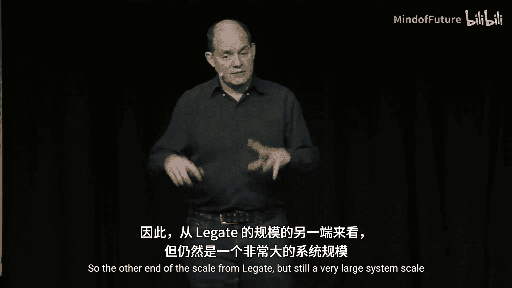

运行它，与PJIT和Al等JAX内部常见的分布式框架进行比较，扩展性和易用性令人印象深刻。

所以，如果你是JAX程序员，去看看他的演讲，因为扩展能力确实是一件非常强大的事情。

同时，跨越这些大型系统的扩展。再次，奇怪地重复使用去年的另一张幻灯片，只因为它是一个很好的描述。

Insight系统团队投入了巨大的努力来开发他们的分布式系统分析工具。

在GPU上设置断点已经够难了，因为有25万个线程。弄清楚如何制作一个工具来中断25万个线程并告诉我有用的信息是极其困难的。

现在我将这个扩展到数千台机器。这根本不可能。所以你需要新工具，他们真的在这些新工具上进行了投资。

我之前给你们展示过一些。我会再展示一张快速图片。但他们所做的一个关键部分是，他们不仅将这些大型分布式工具、多节点工具嵌入到Insight系统的主视图中，还可以嵌入到你的Jupyter笔记本中。

因此，你的工具在你编写代码的地方就可用了。同样，这都是关于在技术栈上下各处放置构建模块。

这太棒了。他们处理海量数据，并能将其提炼成一张图片。在这个案例中，我有一张热图，显示计算利用率和通信是否重叠，这样我就能找到只有计算的机会区域，可以进行异步通信。

再次，都是关于能源。我的通信和计算协同工作。一切都比我一前一后做它们移动得更快。

然后我以高功率运行了两倍长的时间。

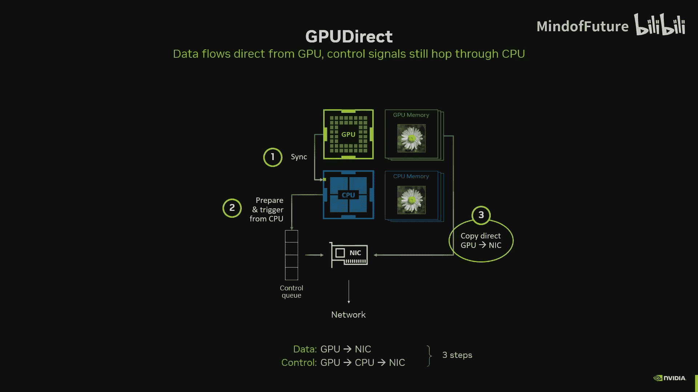

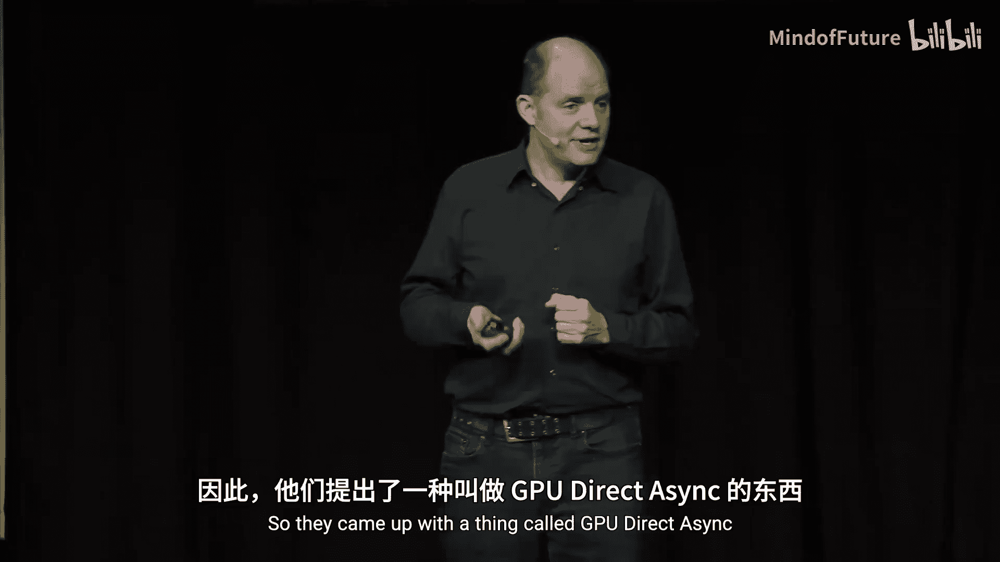

所以，在规模的一端是Legate，但另一端仍然是一个非常大规模的系统，叫做NCCL。

这个东西我们已经有一段时间了。NCCL已经存在好几年了，它不断演进，一直有很多新东西加入。

我朋友Jerry有一个完整的演讲，他谈论所有与多GPU编程相关的事情。他是我认识的最好的演讲者之一，他的演讲绝对值得一看。

但NCCL所做的是，它为你提供低延迟、细粒度的控制，以重叠计算和通信。

这是很多你使用的东西的基础，而你甚至没有真正意识到你在使用它。

但我要告诉你们的是实际上位于其下的东西。因为它真的很有趣。你知道，这些NCCL之类的东西在我的金字塔中位于底层。

这是可能只有100人使用的东西，但通过不同的层影响了一百万人。其中一项技术，深深嵌入其中的，叫做GPU Direct。

我以前告诉过你们关于GPU Direct的事情。我会快速解释一下它是什么，因为当我有GPU产生的数据需要发送到网络，而网络历史上是连接到CPU的外设时。

在过去，在我有GPU Direct之前，我的GPU生成数据，我必须经过四个不同的步骤才能将这些数据发送到我的网络上。

我必须同步，复制几次，触发一些东西。所以要通过这四个跳转才能将数据从GPU发送到网络。

因此GPU Direct出现了，并说，这太荒谬了，尤其对于我要移动的数据量。让我们直接把数据移动到网络设备。

所以我消除了第四个跳转。现在，直接的单一路径复制，GPU Direct允许我生成数据，然后直接从GPU发送到网卡。

这非常强大。但它仍然让CPU参与循环。所以他们想出了一个叫做GPU Direct Async的东西。

这是多年来随着他们改进这些技术而发生的演进。所以现在我有了一个大约两步半的过程。

GPU Direct Async所做的是，CPU可以进行设置，但让GPU触发它。

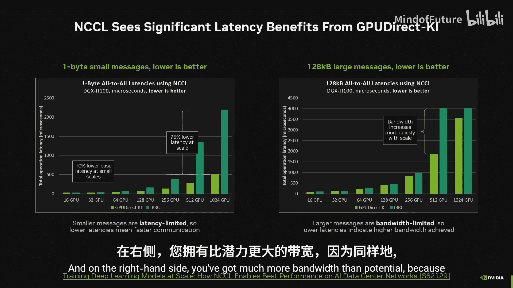

因此数据自动直接移动。有一些CPU代理处理触发。但现在完全由GPU控制。

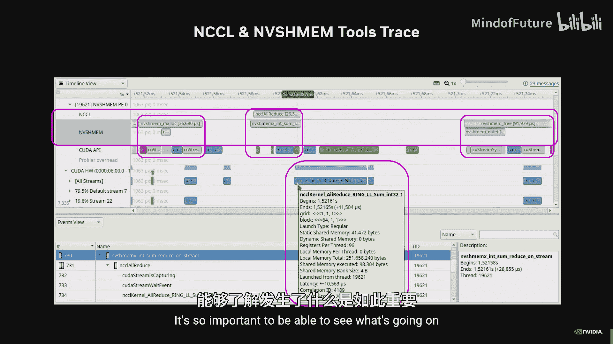

所以GPU程序不必停止以便发送数据。它可以继续运行，只是发出信号：现在发送，现在发送，现在发送下一个。

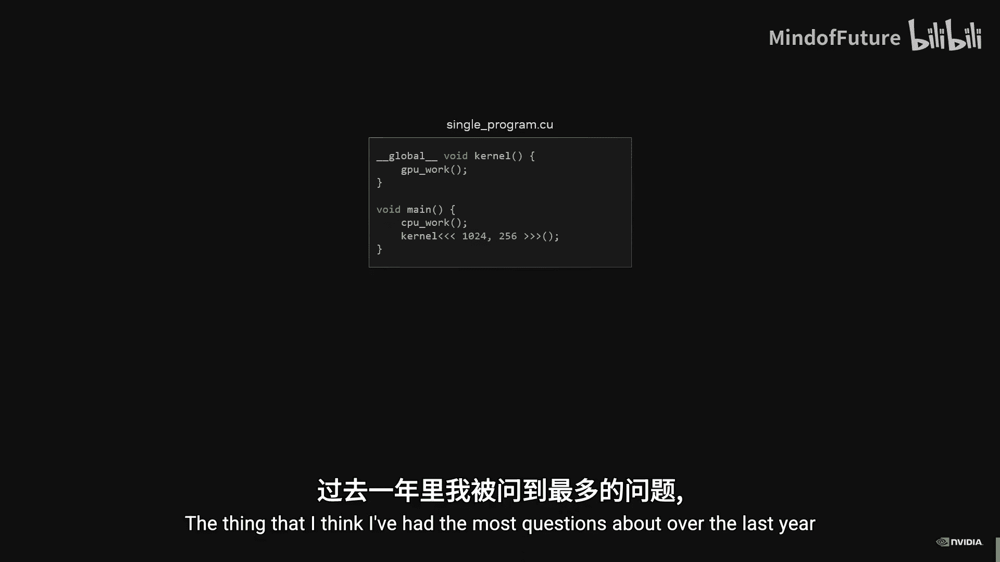

最后，他们有了这个叫做GPU Direct Kernel Initiated的东西。这是你将CPU完全排除在画面之外的地方。

这是一个真正的两跳过程。你不可能少于两跳。你必须首先准备网络，告诉它数据要来了。

第二件事是将所有数据流式传输到网络上。两跳是这里能达到的最低数字。

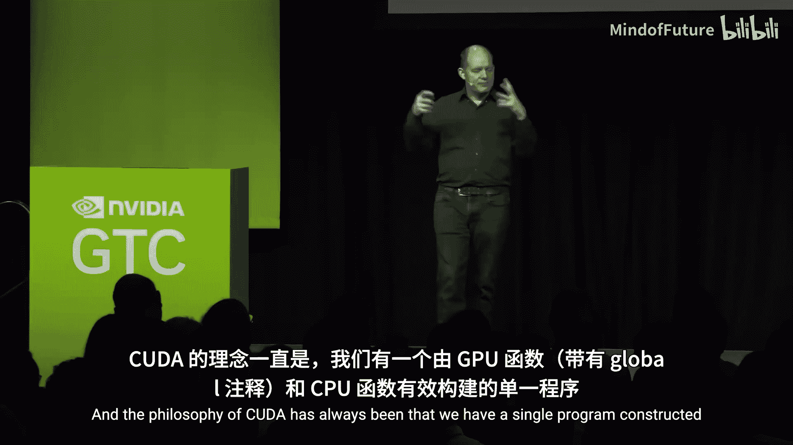

所以我们从4跳到了3跳，到了2.5跳，到了2跳。这将所有东西完全嵌入到内核中。

结果令人难以置信。这是一个图神经网络训练的运行结果，我稍后会详细解释。

中间那条线是那个两步半的过程。所以两步半的过程仍然比普通的非GPU Direct过程快20%。

但一旦你将所有东西都放在GPU上，并将CPU排除在画面之外，我不再有CPU线程等待、轮询和尝试协调一切，所有东西都直接从产生数据和发送数据的GPU出来。

在这个特定的训练运行中，端到端速度提升了两倍。就传输、特征传输、你关心的数据移动而言，你看到的速度提升大约是一个数量级。

因此，使通信更流畅、更自主的能力，其潜力是巨大的。

这些东西静静地、默默地插入像NCCL这样的东西。它们插入像NCCL这样的东西。NCCL建立在这个之上。

对于NCCL，在左边，小消息是最难的。一字节的消息极其困难，因为你为少量数据发送了大量开销。

在这里，这大大降低了你的延迟。在右边，你获得了更大的带宽和潜力，因为同样，你削减了开销，可以更高效地进行通信。

再次，工具集成无处不在。能够看到正在发生的事情非常重要。我们已将NCCL跟踪集成到工具中。

---

## Grace Hopper：统一内存架构的威力 🧠

上一节我们探讨了大规模分布式通信的优化。本节中，我们来看看另一种革命性的架构——Grace Hopper，它通过统一内存从根本上改变了CPU与GPU的协作方式。

所以，我想谈谈我认为过去一年我被问得最多的事情，那就是Grace Hopper及其编程模型，以及你如何为这些机器编程。

CUDA的哲学一直是，我们有一个单一的程序，由本质上用`__global__`标注的GPU函数和一个CPU函数构成。

它都在一个程序中。它是一个异构程序，不是两个独立的东西。它是一个程序，函数在两个不同的地方运行。

这关联到Jensen几周前对我说的一些话。他说，你不是用并行工作取代串行工作，而是扩展它。你需要两者，并且你想同时做两者。

所以理念是CPU代码在CPU上运行，GPU代码在GPU上运行。在它们之间，历史上我们有这个PCI总线。

所以即使你有这些非常高速的内存，PCI总线历史上一直是一个瓶颈。

因此，我们与Grace Hopper芯片一起做的显而易见的事情，我们去年讨论过，就是你可以用这个叫做NVLink C2C的连接将它们组合在一起，它比PCI快很多很多倍。

所以我的数据传输变得好得多。这被称为Grace Hopper。这就是这台机器。

但它不仅仅是一个具有非常快速互连的设备。事实上，它可以是这样，但我认为这真的错过了重点。

我喜欢这个东西的原因是，你真正拥有的是一个具有两种特性的处理器，原生地做两种不同的事情。

我有两个内存系统，各自为其处理器优化。但一个针对延迟系统优化，我的CPU是一个延迟处理器。它有深度缓存。它关心线性操作，非常快。

我的GPU是一个吞吐机器。它有这些非常高带宽的内存和非常高带宽的缓存。

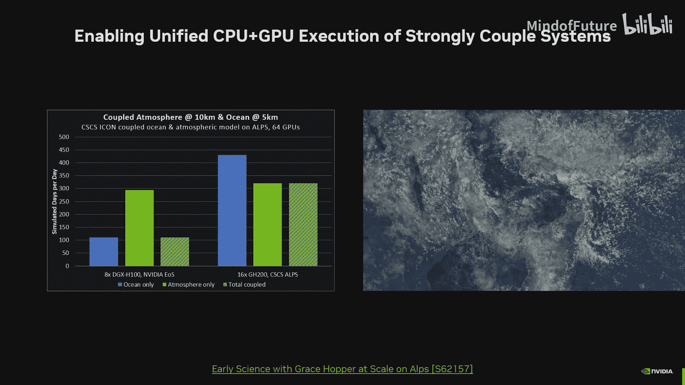

你对待这些东西的方式不同，因为这些东西运行代码的方式不同。因此，在一台Grace Hopper机器上，它是一个单一的统一内存系统，有两种不同的执行方式。

如果我有一个链表，在CPU上运行它更好。如果我有一个并行归约，在GPU上运行它。这就是它的用途。

我可以选择，就像我的程序是两种东西的混合体，我可以字面上在任何我想要的地方运行任何我想要的东西，因为这两个系统通过一个地址空间统一起来。

所以它不仅仅是快速链接。更重要的是GPU可以看到、修改和接触CPU内存，这样做我们可以检测到，并可以将其移动到GPU。

因此GPU可以获得其非常高带宽缓存的好处，性能提升可能高达10倍，如果你一直在接触那些数据。

因此，结合单一地址空间，同时智能地在处理时移动东西的能力，其力量难以置信。

这让我能够将计算和数据放在需要的地方。同时，当然，迁移不影响CPU。它仍然可以访问、接触和看到那些数据。

当然，有一点额外的延迟，因为它要经过总线。但真的，它是一台机器。这就是我想要表达的观点。

这是一些来自Thomas Schultter演讲的结果，我很慷慨地能够展示。他是CCS的主任，负责在瑞士新启动的Alps机器（一台Grace Hopper机器）上运行ICON代码。

这正是一个绝佳的例子，说明了我刚才谈论的内容。这里有一个模拟，你在CPU代码上纯粹运行海洋模拟，在GPU上运行大气模拟（绿色部分），耦合极其紧密。

所以你移动大量数据。因此历史上，你或多或少受限于CPU代码的性能。

但当你迁移到像GPU这样的东西时，你真的能够同时运行这两样东西。CPU代码在CPU上，GPU代码在GPU上，数据交换紧密且自动。

结果是，你知道，速度提升了三倍。这令人难以置信。这是在64个GPU的规模上。

你知道，这是那种将影响我能预测天气预报的天数以及诸如此类真正重要事情的事情，这些事影响着每个人。

同时，其他很好的例子，我的同事Matt有一个关于这个的演讲，只是看语言模型的微调。

一个语言模型是一系列Transformer层。当你处理这些并进行前向传递训练时，你生成这些中间张量。

可能有很多层，因此有大量数据。通常我们做的是丢弃数据。然后在反向过程中，我们重新计算它。

所以我们加倍了计算量，以节省一些内存。但有了Grace Hopper设备，我实际上可以缓存一些。

我不会丢弃一些，我会保留一些在GPU上，小的东西不值得丢弃，蓝色的东西。

相反，我会缓存它们并保存在Grace内存中，因为记住，内存只是一个巨大的内存系统。

然后在我的反向过程中，我可以从GPU内存中召回它。所以我不必做那个重新计算。

结果是在这个特定例子中速度提升了20%。这是一个100亿参数的混合专家模型。

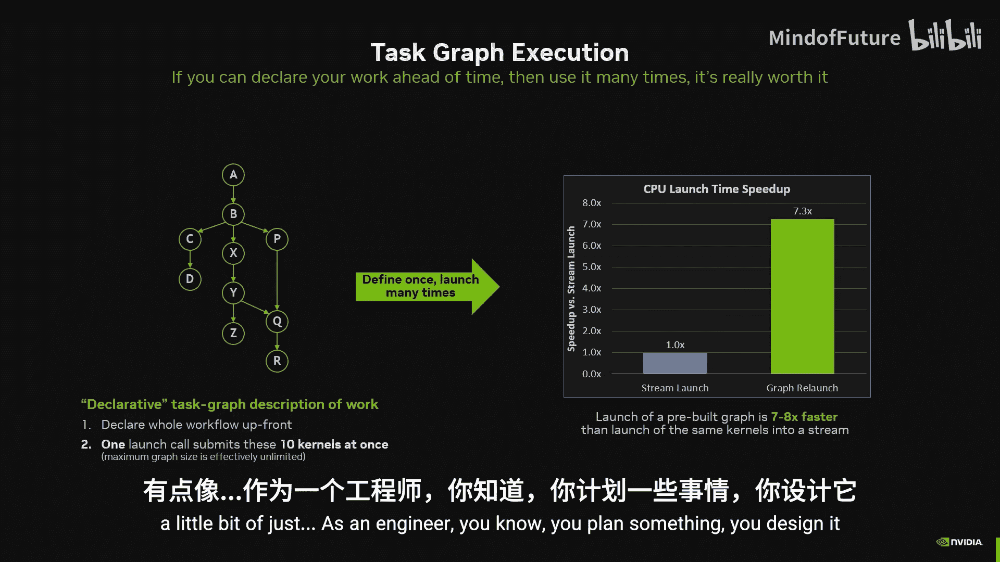

你可以看到左边，浅绿色是卸载，深绿色是重新计算。重新计算时间当然两者相同。

但如果我在Grace Hopper上做，如果我做数据卸载而不是重新计算，我在时间上获得了收益，因为我有了这个非常紧密耦合的内存系统让我这样做。

另一个例子，这些天我看到很多，是图神经网络。

图神经网络是那种金融机构用来分析你的信用卡是否被欺诈使用的东西，诸如此类，信息的大规模、大规模、大规模互连。

GraphSAGE模型是使用神经网络解决图问题的主要模型。所以这是一个简单的工作原理概述。

我的朋友Joe Eaton有一个关于这个的完整演讲。所以再次，他是专家，我只是信使。

但基本上，采样你的邻居。你有这些在所有不同类型节点上运行的批量卷积网络。

图网络的挑战在于，它不仅仅是我正在操作的单一数据集合。我的整个宇宙可能被图中任意两个节点之间的边所触及。

所以我有一大堆数据，完全是随机访问的。我可能在任何一次迭代中只访问其中的10%，我不知道是哪10%，而且每次迭代都会不同。

所以我需要的是一大池非常快的内存，这样我就可以在遍历GraphSAGE模型流程时随机访问和接触它。

将其放在Grace Hopper上带来了令人难以置信的性能提升，以前我花了很多时间获取数据，将东西移入移出GPU。

现在有了这个统一的内存池，你看到速度再次提升了两倍。这些是巨大的提升，两倍的速度提升在大多数代码中就像一代人的速度提升。

你会花很长时间，整个博士学位，才能在某事上获得20%的速度提升。这是两倍，因为现在你有了可以做事的新架构。

---

## CUDA图：动态工作流的未来 🎯

上一节我们领略了Grace Hopper统一内存架构带来的性能飞跃。本节中，我们来看看CUDA图的演进，它如何将动态控制流引入GPU，进一步减少CPU干预。

最后，从一种图到另一种图。我必须承认，这有点像是，作为一个工程师，你知道，你计划某事，设计它。

CUDA图是我几年前开始设计的东西。你有很多想法，而到达你想去的地方花费的时间比你想象的要长得多。

因此，CUDA图的想法，我已经谈过几次，希望你们知道，其理念是你预先定义你的工作流。

然后我可以发出一个单一的启动操作来启动任意数量的工作。所以它可以是一种将工作放到GPU上的快速方式。

我可以看到启动速度的显著提升。但它远不止是一种快速启动工作的方式。

所以我实际上回去找到了我2018年的幻灯片。这是为GTC与开发者的对话准备的，只是问，这对你有用吗？

我只是想抓取一些当时的幻灯片，因为看到我当时的想法和它最终的发展方向是如此有趣。

所以，你知道，对任务图的快速描述，你有这些节点，它们可以是不同的东西。这基本上是我们构建的。

我有一个序列，你说，你知道，任务图的属性。它们是可重用的。我可以一遍又一遍地启动它们。

我只需要定义一次，然后运行多次。但是循环，我想要一个图不仅仅是直接的依赖流。

为什么不能跳回开头？为什么不能有一个动态图，一个节点B可以基于它产生的某些数据决定是去C还是D？

数据依赖的动态控制流。最后是层次结构，这是任何图系统的关键部分。

但这些字面上是我关于图的最早的幻灯片，说，这就是我想要的。最终，六七年之后，我们构建了它，已经过了多久。

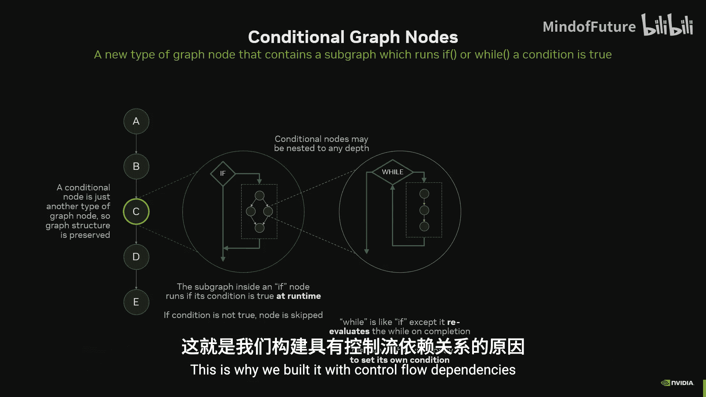

所以让我告诉你们我们构建的这个东西，因为它真的，它是我脑海中关于这些东西如何被使用的一切。

我认为它打开了很多潜力的大门。所以左边这里是我称之为共轭梯度的东西的极其简化的版本。

它就像一种梯度下降类型的东西。它是求解线性方程组的一种非常、非常标准的方式。

左边只是伪代码。但关键部分在于有一个迭代循环。有一个主循环，我在其中做一些事情。

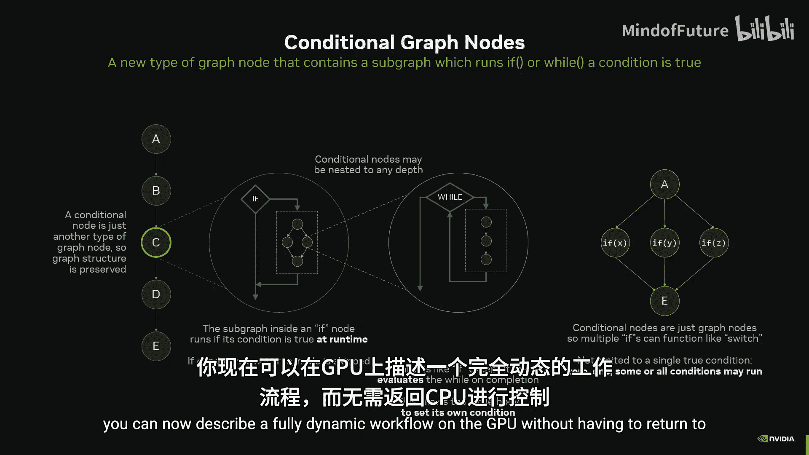

我一遍又一遍地运行那个主循环，直到得到解。循环体，传统上，对于CUDA图，我的循环体的想法是，我将把那个体变成一个图。

然后我将多次运行那个图。所以我的程序看起来非常简单。我不必做所有这些不同的事情，我只有一个启动调用。

这很棒。这就是人们今天使用图的方式。它非常高效地加速了事情。但挑战在于，数据依赖的执行非常常见。

迭代直到收敛，这几乎是普遍模式。迭代需要读回结果并决定是否要再次执行while循环。

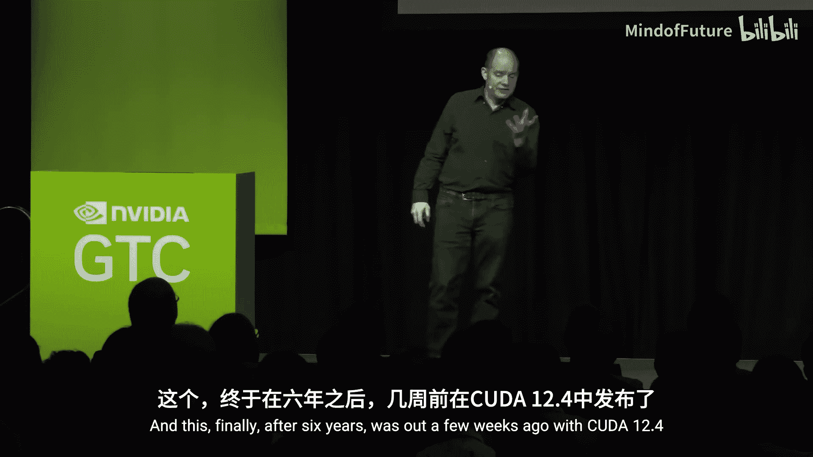

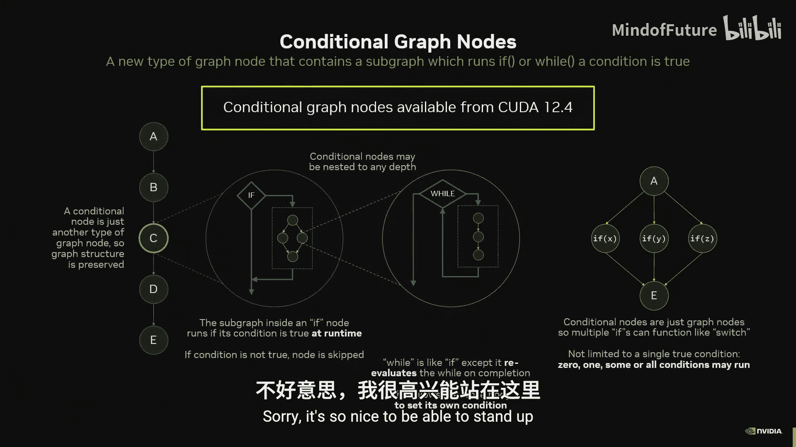

所以我必须不断停止我的程序，复制数据回来，以便评估我的残差是否大于epsilon。

然后我可以回去做另一个启动。现在，我们将数据依赖的执行移动到GPU上。

所以我获取主循环，现在我用这些新节点创建一个图。我们创建了两种新节点类型。

我稍后会告诉你们它们。一个if节点和一个while节点。现在我可以将while放在GPU上。

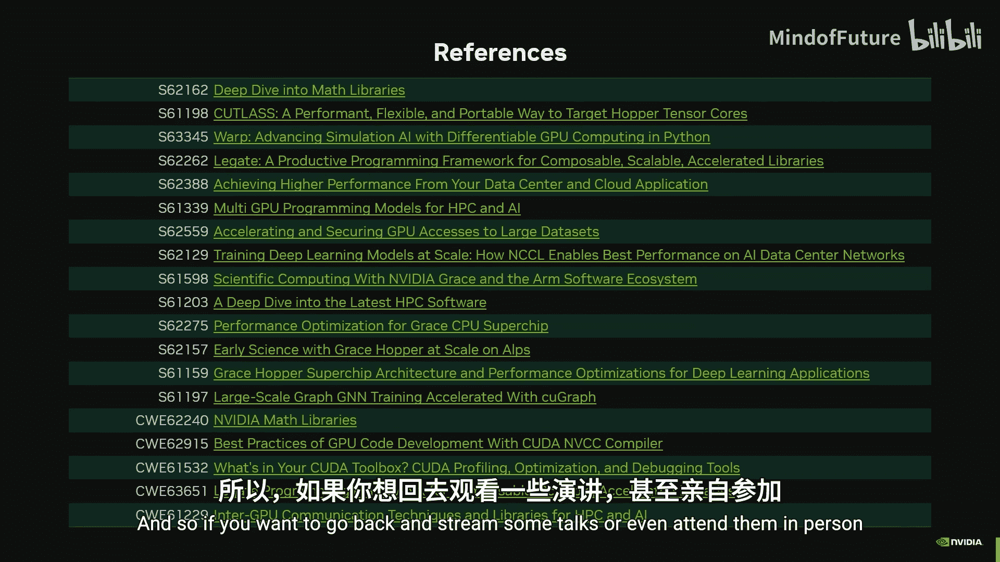

所以收敛检查、while检查是在不需要回到CPU的情况下完成的。我的程序完全不再有主循环。

主循环现在完全动态地移动到了GPU上。我可以只启动一个条件图，如果你想这么叫它的话。

我的程序简单多了。所以现在CPU不在画面中了。我可以同时独立运行10个这样的程序，因为我不再需要CPU线程来管理它们。

它的工作方式是我们采用了这些条件节点之一。它只是另一种图节点，但它是一个要么是if要么是while的图节点。

在图的条件节点内部，我可以评估条件。它要么运行一个子图，要么不运行。记住图是层次化的。

这是我最早幻灯片上的事情之一。所以我有这些条件节点，它们封装了条件为真时要做什么。

因为图是层次化的，你可以嵌套这些。我可以有一个条件节点在另一个条件节点内部。所以我想要任何深度都可以。

所以我可以有一个while节点。我可以有一个if节点，如果某事发生，就去运行这个，而这个包含一个while，它持续迭代。

所有这些都可以100%地在我的任务图中描述。很多人问我，为什么你用控制依赖而不是数据依赖来构建图？

这就是原因。这就是为什么我们用控制流依赖来构建它。因为你想能够说像while和if这样的东西，这是数据流不允许你做的。

还有其他结构。你可以在右边做像switch这样的事情。就像多个if。如果X，如果Y，如果LED，那就像一个带有case的switch。

所有这些类型的东西。if和while是关键的基本构建块。也许我们以后会自己优化switch，使其更高效。

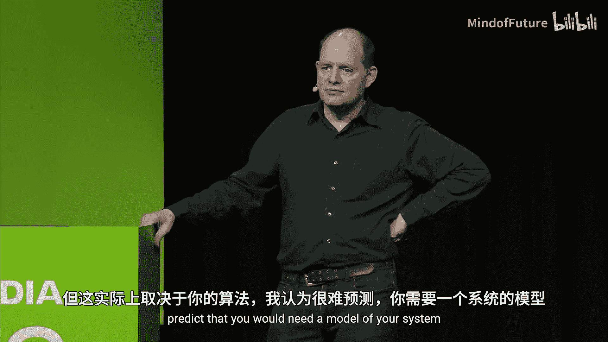

但你知道，基本上，你现在可以在GPU上描述一个完全