# 004：与Google DeepMind的Vincent Vanhoucke一起探索 🤖

在本节课中，我们将跟随Google DeepMind机器人学高级总监Vincent Vanhoucke的演讲，探索生成式AI（特别是大语言模型）如何深刻改变机器人学的研究范式。我们将看到，从规划、感知到控制，机器人学的各个核心模块正在被重新定义。

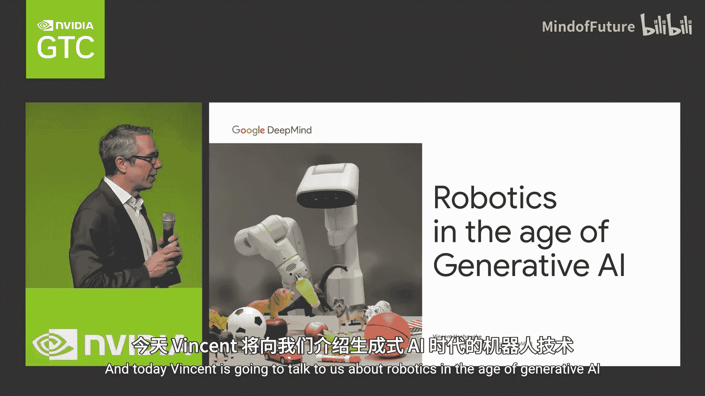

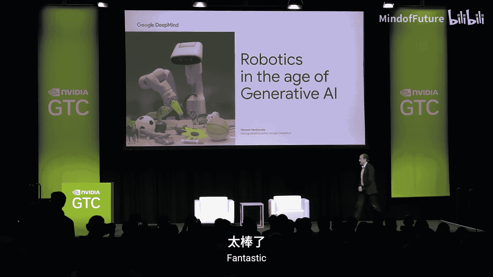

大家好，欢迎来到本次会议。我是Peter Fox，本次会议的主持人。我非常荣幸地向大家介绍Vincent Vanhoucke。Vincent是Google DeepMind的杰出科学家和机器人学高级总监。他早在多年前就发起了Google Brain的机器人研究，他的团队一直处于机器人深度学习的**最前沿**。Vincent在2017年发起了机器人学习会议CoRL，该会议现已成为机器人学习领域的**关键会议**。Vincent的团队是**第一个**展示大规模训练机器人可能性的团队，例如你可能听说过的Google机器人农场。他们也是**第一个**真正展示如何将大语言模型、生成式模型用于机器人推理甚至规划的团队。最近，一些人可能听说过RT-X或RT-2模型，这是**第一个**真正展示可以训练从视觉和语言**直接到机器人控制层**的非常大型的模型。当然，这是结合了多种模态概念并直接输出机器人控制的大型预训练模型的**圣杯**。今天，Vincent将与我们探讨生成式AI时代的机器人学。

---

感谢介绍。大家能听清楚吗？好的，太好了。感谢欢迎。对我来说，能来到GTC是一种特别的荣幸。在我开始从事机器人研究之前，我是Google最早一批获得大量GPU的研究员之一。当时我们组装了一台GPU机器，开始训练神经网络。这在当时是非常秘密的，并不流行。我们不得不把机器藏在复印机后面，以免晚上被人关掉。最终，我们推出了我认为是**第一个**在生产环境中大规模在GPU上训练的深度神经网络，用于Google语音搜索。我们还努力游说Google在数据中心部署大量GPU。所以，Jensen，如果你听到这个，我接受现金、信用卡、Wemo、Paypal。无论如何，让我们谈谈机器人。

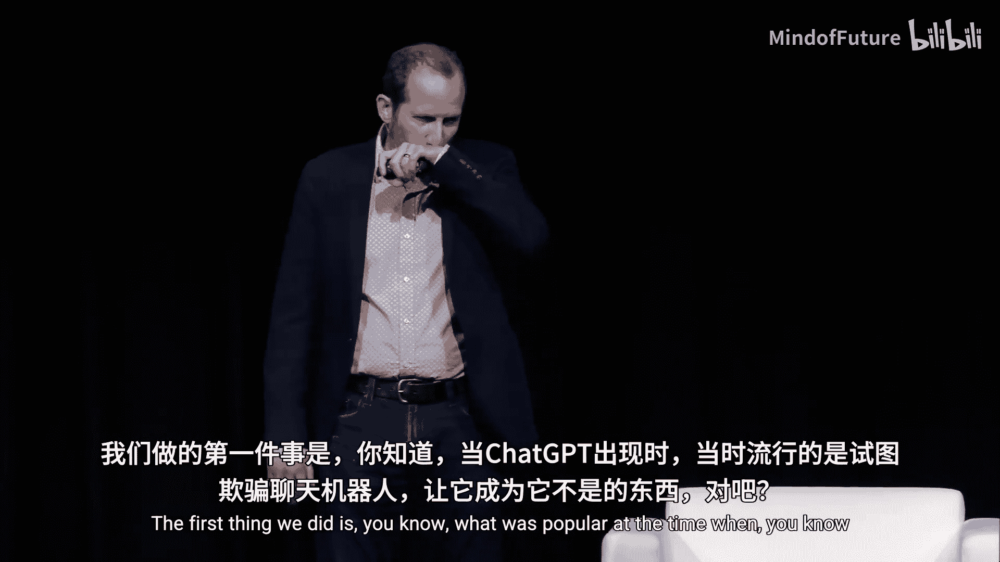

大约两到三年前，如果你没有与世隔绝，你可能看到AI世界发生了一场**大革命**，即大语言模型的出现。我们突然拥有了像常识推理或对世界的理解这样的能力，这在过去是**无法获得**的。对于我们这些从事机器人和具身AI研究的人来说，这**是一场灾难**。我们本应是下一代AGI，我们本应是将AI带入现实世界的人。因此，机器人学界产生了一种潜在的**错失恐惧症**，人们有点嫉妒语言建模社区突然占据了所有聚光灯。当然，打不过就加入。我们开始探索大语言模型与机器人学、具身AI之间可能存在的联系。

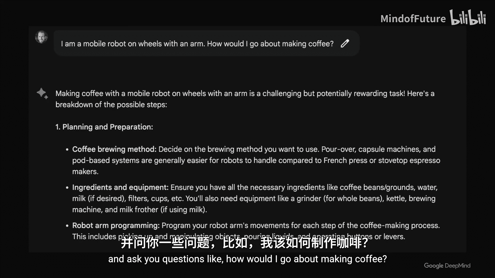

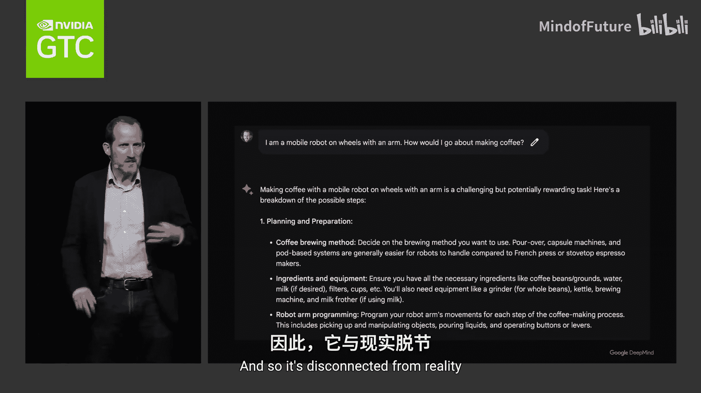

这原本可能只是一种非常肤浅的探索。表面上，语言和机器人学之间的联系充其量是**非常薄弱**的。你可以想象与你的机器人对话，或者让机器人讲故事、作诗。但发生的事情可能是我整个职业生涯中**最大的惊喜**。这些联系被证明是**极其深刻**的。事实上，它们深刻到迫使我们重新思考机器人学和AI的所有基础。我今天想讲述这个故事，因为我认为这是一个关于颠覆或对构建了整个领域的基本概念进行非常不同思考的**迷人故事**。我并不是说这将是机器人学未来发展的最终故事，但它是一条**不同的道路**，一条与我们三年前所走的道路几乎无法辨认的道路，它开辟了许多进行新研究的**全新领域**。

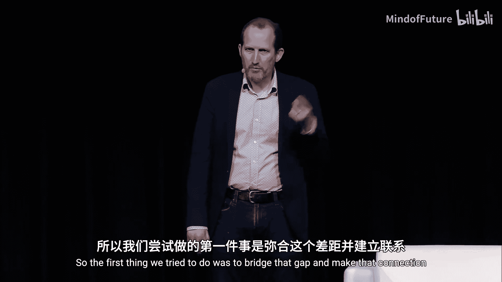

我们做的第一件事，是在ChatGPT出现时流行的做法，即试图“欺骗”聊天机器人扮演它本不是的角色。我们假装它是一个机器人，用非常粗略的术语描述它应该是哪种机器人，然后问诸如“我该如何煮咖啡？”这样的问题。有趣的是，这既奇妙又不完美。聊天机器人确实能理解煮咖啡意味着什么，它具备关于煮咖啡所需常识的良好理解，对机器人或智能体如何煮咖啡有一些概念，知道要问正确的问题。缺点是它对环境**一无所知**，对机器人的任何能力**一无所知**，因此它与现实**脱节**。

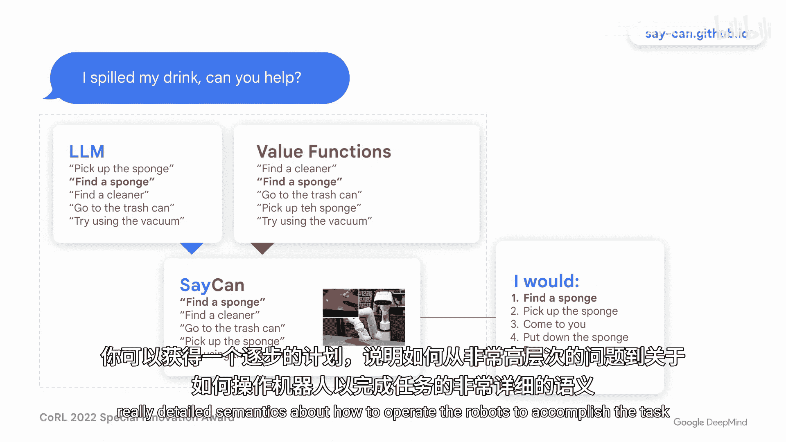

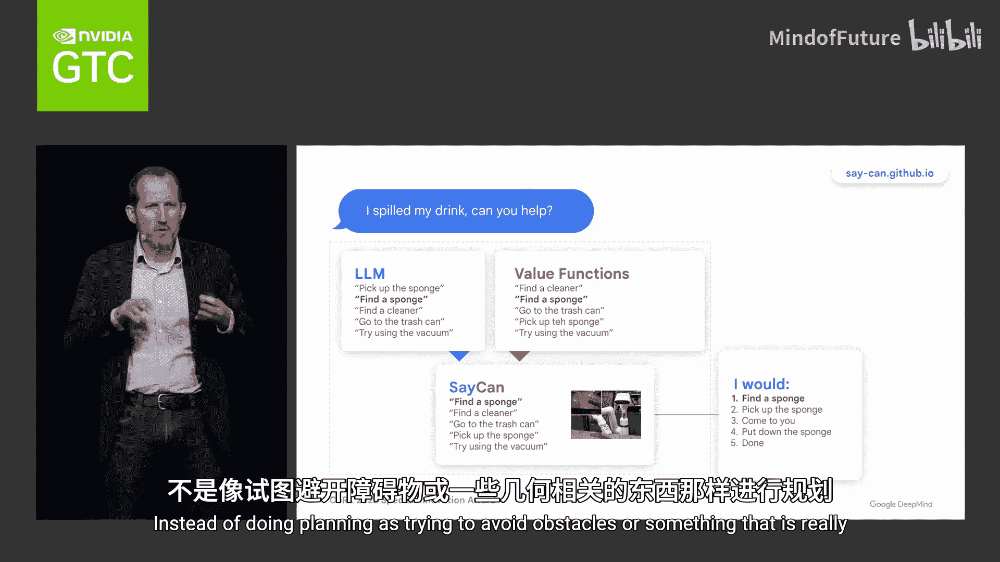

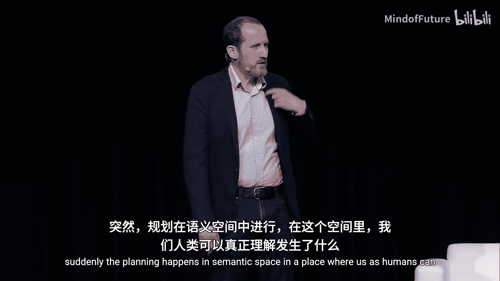

因此，我们尝试的第一件事是弥合这个鸿沟，建立这种联系。这项工作叫做**SayCan**。其背后的理念是，我们让一个大语言模型为复杂的规划问题提出解决方案。然后，因为我们使用强化学习训练机器人，机器人内部有一个模型，能够根据其当前观察到的环境，对向机器人提出的任何查询进行评分，评估其在当前上下文中的**可操作性**。这被称为**价值函数**。价值函数可以对LLM提供的所有不同假设进行排序。我们会决定如何重新排序，然后将其转化为计划。当你递归地这样做时，你可以得到一个关于如何从非常高级的问题到关于如何操作机器人以完成任务的具体语义的**逐步计划**。

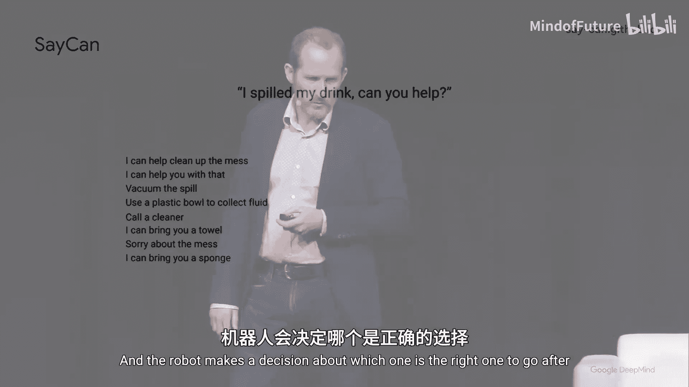

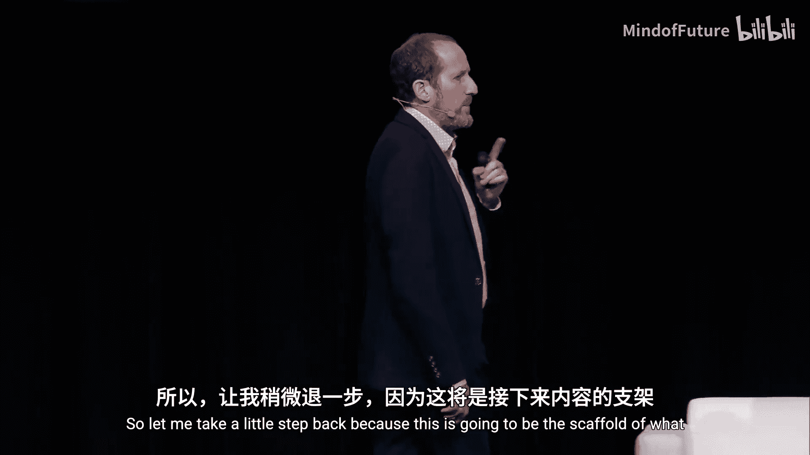

这里有趣的一点是，这真正将规划问题提升到了**语义世界**。规划不再仅仅是几何上的避障，而是突然发生在**语义空间**中，发生在一个我们人类真正能够理解的地方。

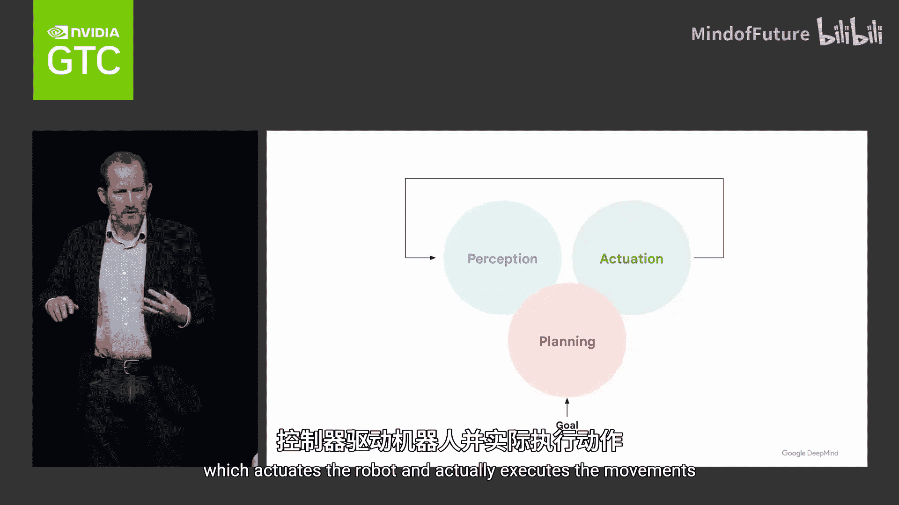

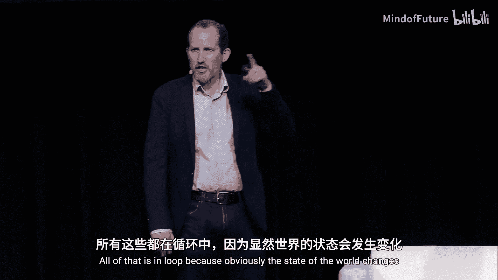

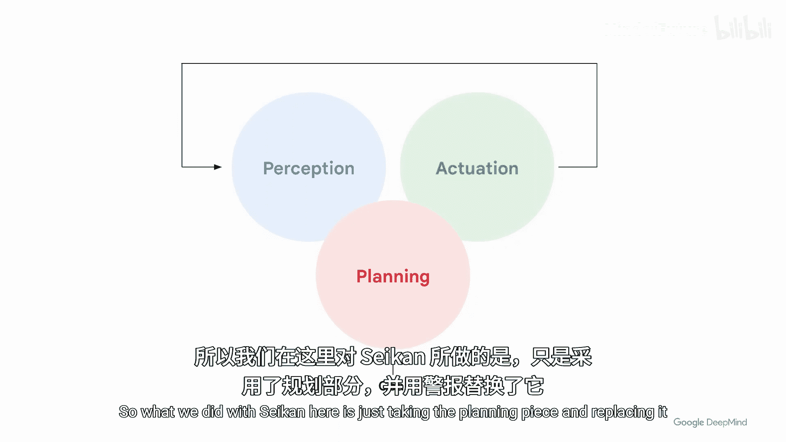

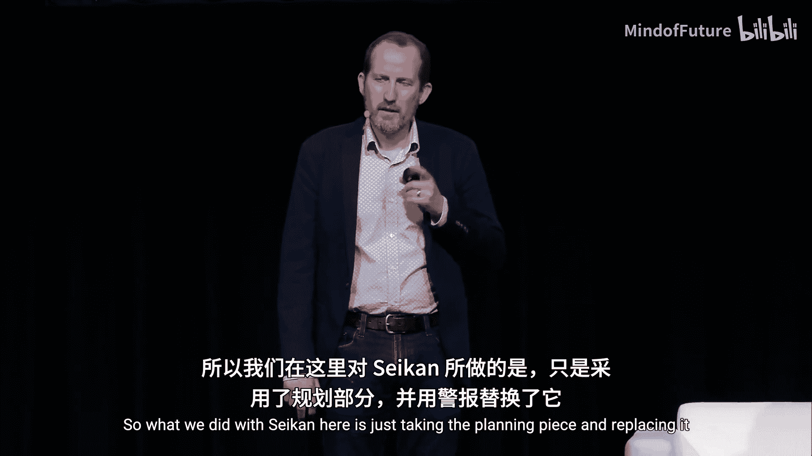

最终看起来是这样的：你有一个机器人，你问它一个问题。它具备感知能力，使其能够对周围看到的东西进行评分。它可以拾取物体，知道可以找到物体，可以放置物体。这些都是机器人具备的**可操作性**。机器人会决定哪个是下一步要执行的正确动作。

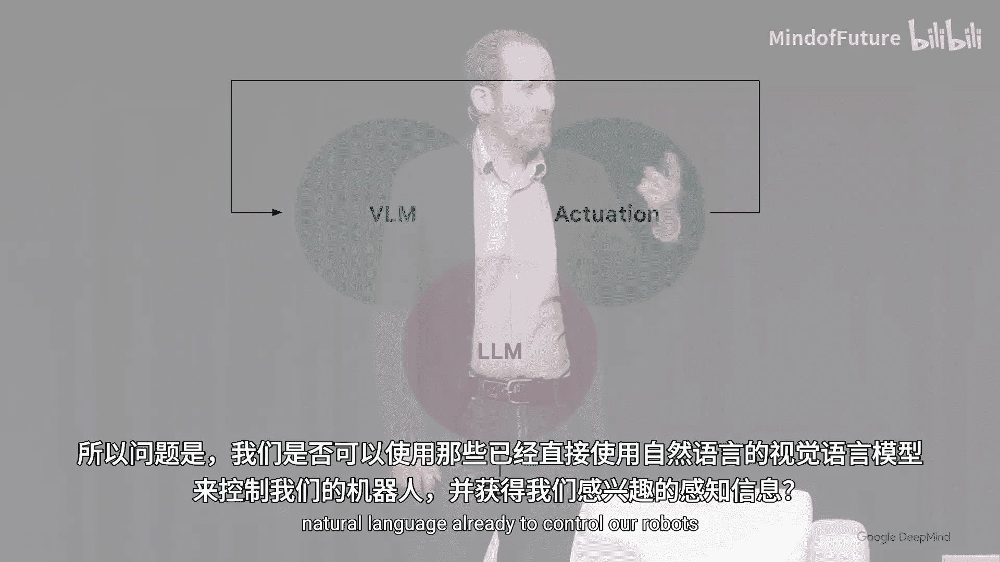

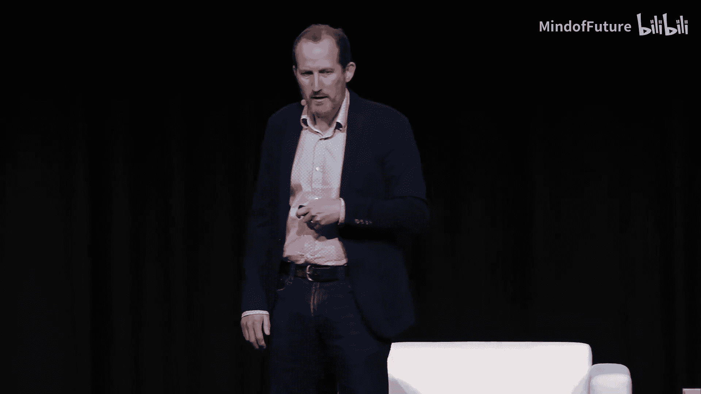

让我稍微退一步，因为这将成为接下来内容的**框架**。我的机器人学朋友们可能会翻白眼，因为我要给你们一个关于机器人如何工作的非常粗略的介绍。实际情况要复杂得多，但这个模型足以满足我们这里的目的。粗略地说，机器人有一个循环：你**感知**世界，提取世界的**状态**。你将这个状态传递给一个**规划器**，规划器根据你要实现的目标决定下一步做什么。一旦你有了机器人应该做什么的计划，你就把它传递给一个**控制器**，控制器驱动机器人并实际执行动作。所有这些都在一个循环中，因为显然世界状态会变化。所以你重新感知、重新规划、重新驱动，并以相对较高的频率持续进行，以适应世界的变化。

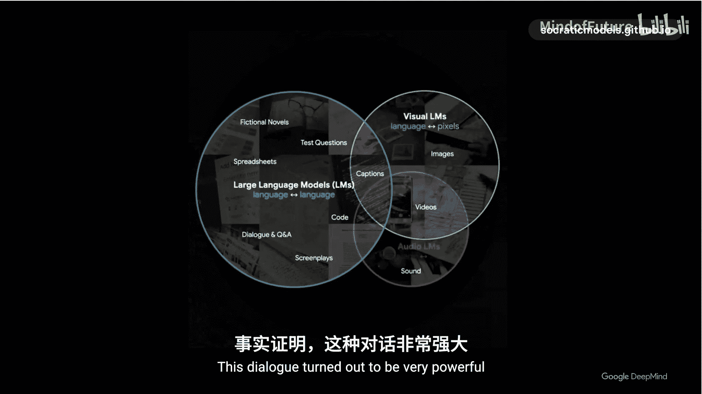

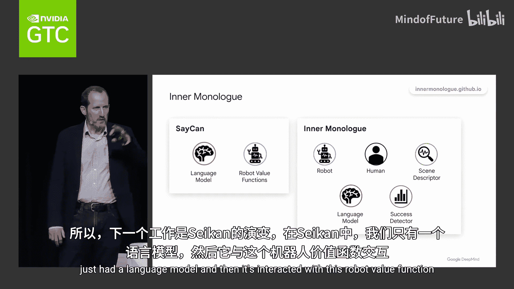

我们在SayCan中所做的，只是用LLM**替换**了规划部分。这带来了有趣的后果，因为突然之间，这个规划器**使用自然语言**。你的规划器与感知和执行器之间不再有代码API。其后果是，将自然语言作为机器人内部的API，我们可以进一步利用和使用。

当时开始发展的另一件事是使用视觉语言模型进行感知，这些模型变得**非常出色**。这些模型相对于专门的视觉模型的性能变得**非常好**。因此问题是，我们能否使用这些已经直接说自然语言的视觉语言模型来控制我们的机器人，并获取有趣的感知信息？

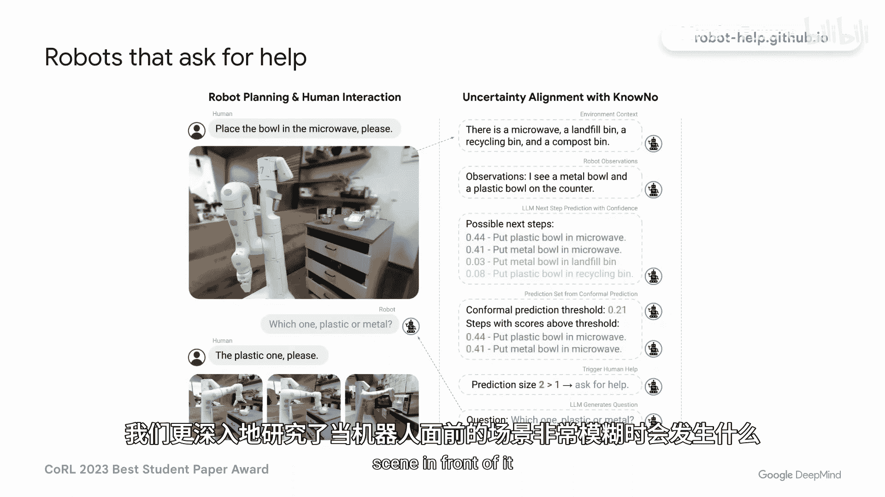

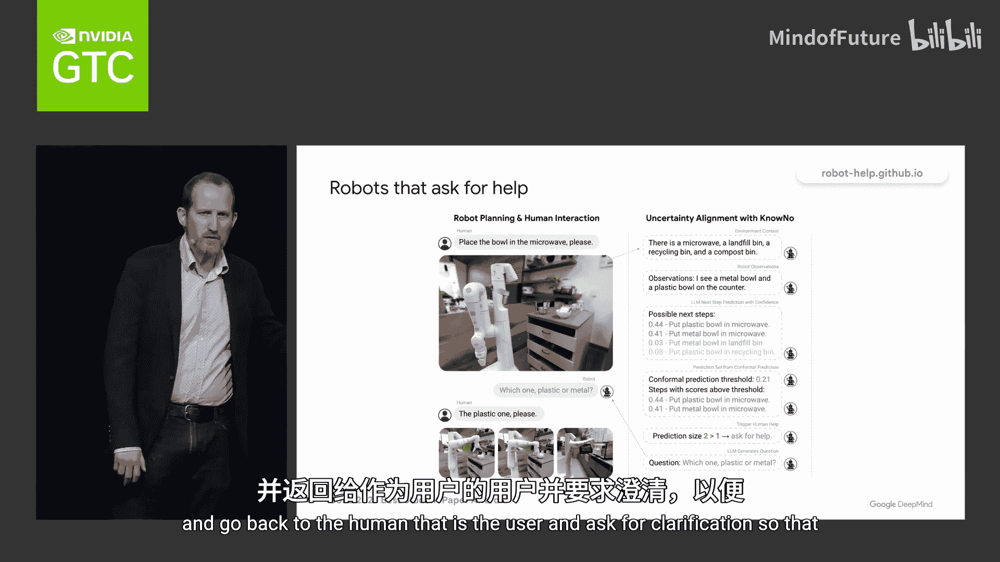

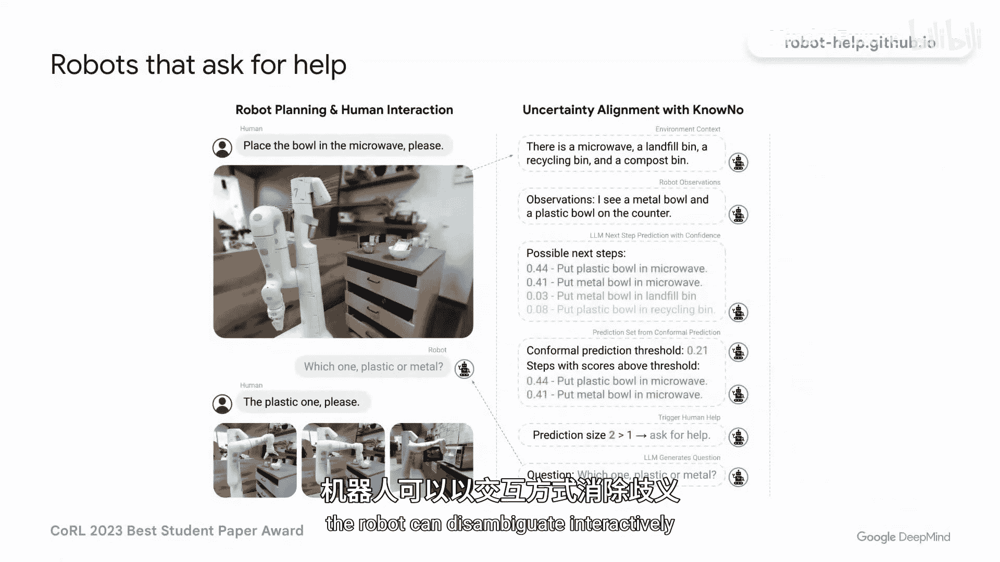

这是我们开始研究的东西，后来发展成了**苏格拉底模型**的概念。这个想法是，你可以有多个模型，一些具有专门功能，如视觉模型或音频模型，然后是一个负责规划的大语言模型，你可以让它们基本上**相互对话**，从而就世界状态、下一步行动、要问什么问题达成共识。规划器实际上可以向视觉语言模型**提问**，以获取其对环境中特定部分更精细的感知信息。这种对话被证明**非常强大**。因此，我们有很多后续工作真正利用了在机器人内部建立一个所有模型可以相互交流的“聊天室”这一概念。

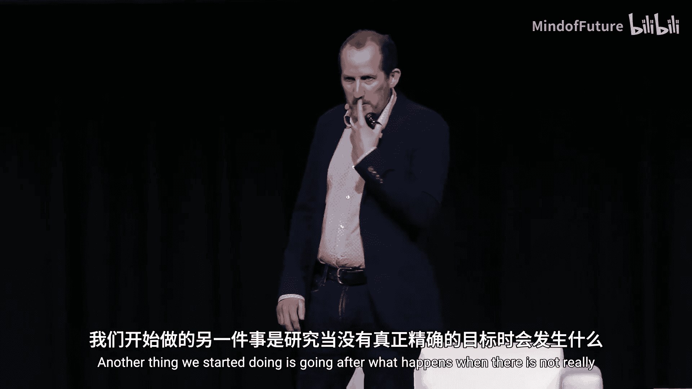

下一个工作是SayCan的一种演进。在SayCan中，我们只有一个语言模型，然后它与机器人的价值函数（内部独白）交互。在这个聊天室中，人类为机器人提供一个目标。语言模型会质疑执行该计划需要什么。视觉组件会描述场景并判断任务是否成功。这看起来就像是机器人上的一个日志，记录了查询、机器人尝试采取的动作、对干扰世界状态的反应。机器人失败了，它可以观察到失败，可以对失败做出反应，可以改变计划。你要求拿苏打水，突然苏打水不见了。那么房间里还有其他苏打水吗？我可以去找吗？完全重新规划，完全改变。这样做的好处是它**完全可读**，非常以人为本，因为你可以跟随机器人内部的对话，真正理解机器人正在思考什么、它的计划是什么，以及其感知或能力可能存在什么问题。

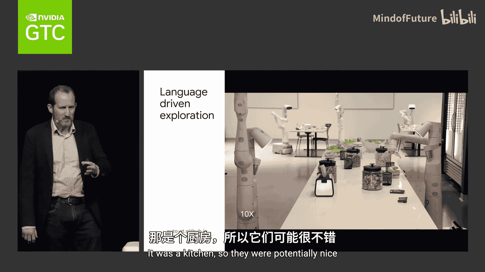

我们更进一步，研究了当机器人面对一个非常**模糊**的场景时会发生什么。在这种情况下，我们要求机器人把一个球放进微波炉。有两个球，机器人没有好的方法决定该怎么做。你可以使用**共形预测**来确定计划中存在高度模糊性，然后返回给用户（人类）请求澄清，以便机器人可以**交互式地消除歧义**。

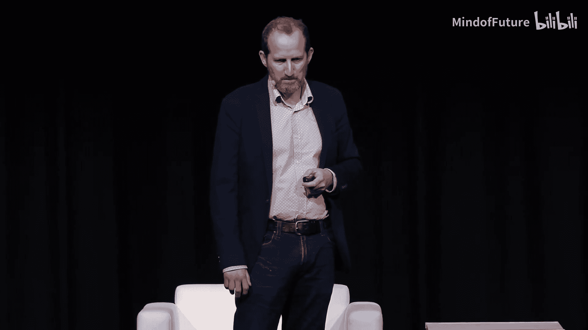

我们开始做的另一件事是，当没有精确目标时，我们不是精确地告诉机器人做什么，而是让语言模型**决定目标**。这是在数据收集工作的背景下进行的，我们试图真正扩展机器人获得的体验多样性。我们基本上告诉运行在这些机器人上的语言模型：去探索，尝试做事情，做有趣的事情，做你不知道是否能做的事情，尝试并失败，甚至做你可能做不到的事情，然后你需要呼叫远程操作员来实际完成任务或帮助你完成任务。这真正有趣的是，突然之间你有了一个**自己定义目标**的机器人。因此你必须真正考虑**安全性**。这些机器人最初很喜欢拾取和操作笔记本电脑，因为它们能很好地感知笔记本电脑。这很令人兴奋，“我要去拿你的笔记本电脑”。所以我们不得不在提示中告诉它们：不要拾取电器，不要拾取尖锐物体。那是一个厨房，所以可能有刀，我们把刀移走了。但有趣的是，我们突然有了一种方法，可以从非常高级的安全概念（例如，不要打扰人类）这些非常宽泛、可以用自然语言解释的参数，一直延伸到实际让机器人行为与之**匹配**。这有点像用于引导聊天机器人走向安全行为的**宪法AI**概念。我们可以将其一直应用到实际遵循一般安全原则的机器人上，并增加另一层安全性。这些机器人内部有很多安全层，你可以在语义层面再增加一层，以增强机器人的整体安全性。

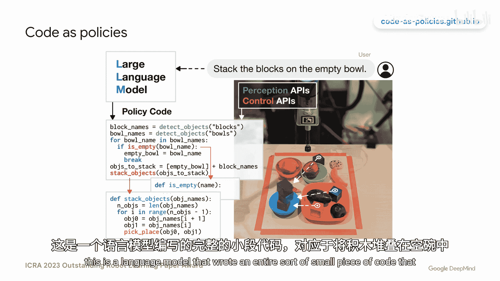

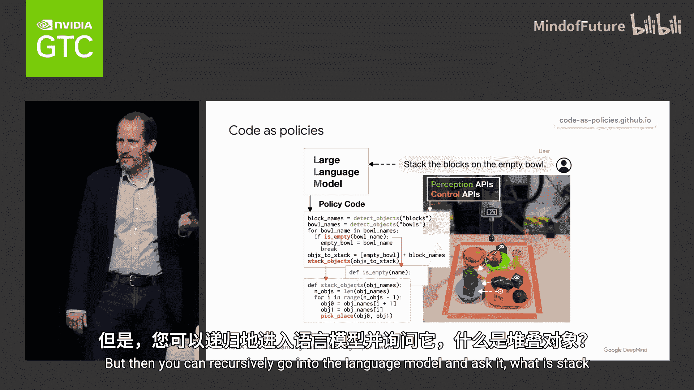

好的，我们已经用LLM“化”了规划器，用LLM“化”了视觉。现在，显然，接下来我们要尝试对**驱动部分**进行同样的处理。控制器实际上是控制机器人的一段代码。而编写代码是大语言模型**非常擅长**的事情。因此，我们尝试使用**代码生成**作为描述控制器的方式。

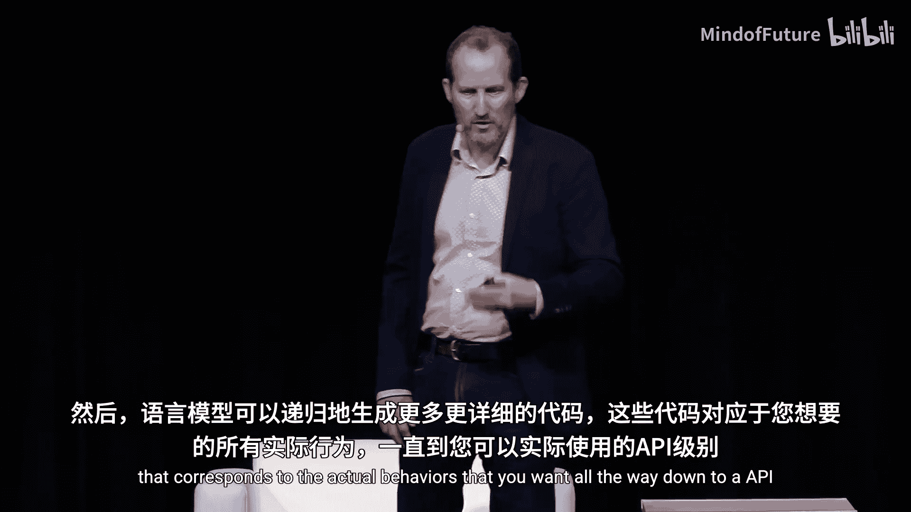

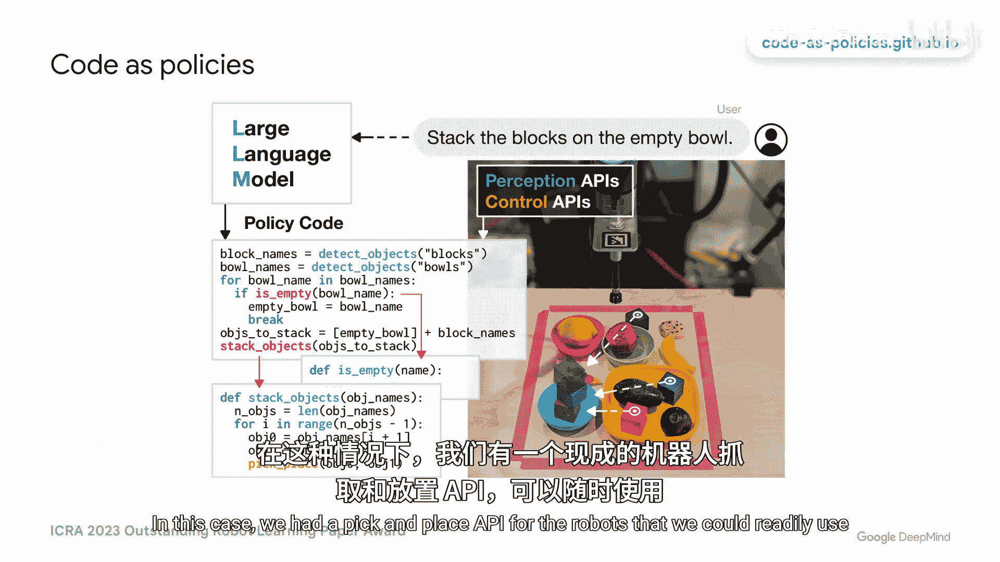

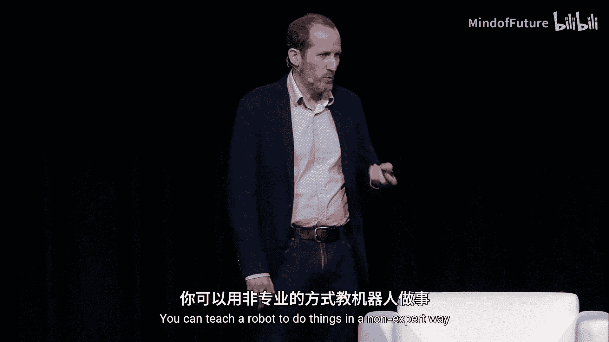

朝这个方向迈出的第一步是我们称之为**代码即策略**的工作。这个想法是，你向一个大语言模型提供提示，其中包含感知API和控制API，让它根据你提出的自然语言查询决定如何使用它们。这可以非常强大。例如，这是一个语言模型，它编写了一小段代码，对应于“将积木堆叠到空碗里”。你会注意到它使用了几个感知API（绿色部分），在这个例子中主要是玩具示例。但它也产生了一些我们**没有API**的函数（红色部分），它完全**幻觉**出了这些函数。它认为有一个“堆叠物体”函数会很有趣。然后你可以递归地进入语言模型，问它“堆叠物体是什么？”。然后语言模型可以递归地产生越来越详细的代码，一直下降到你可以实际使用的API级别。在这个例子中，我们有一个拾取放置API可以立即使用。

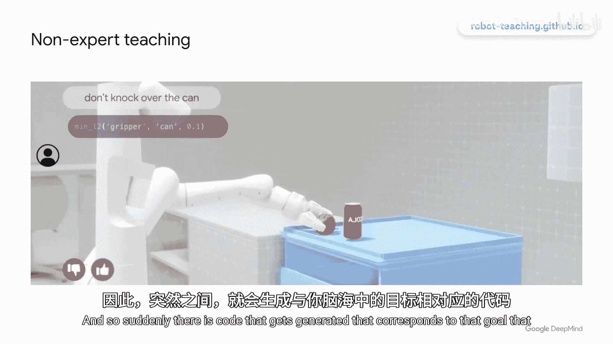

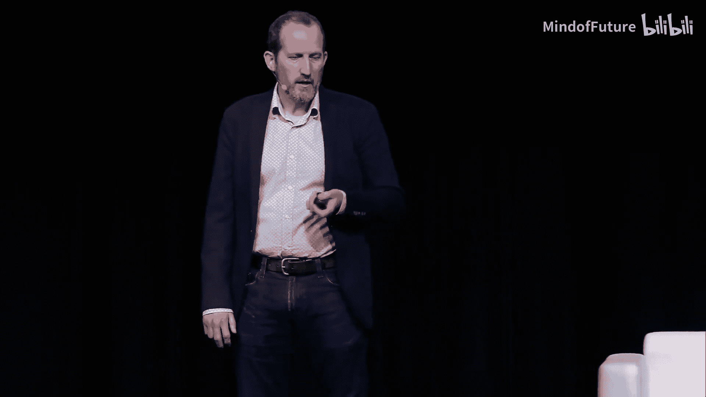

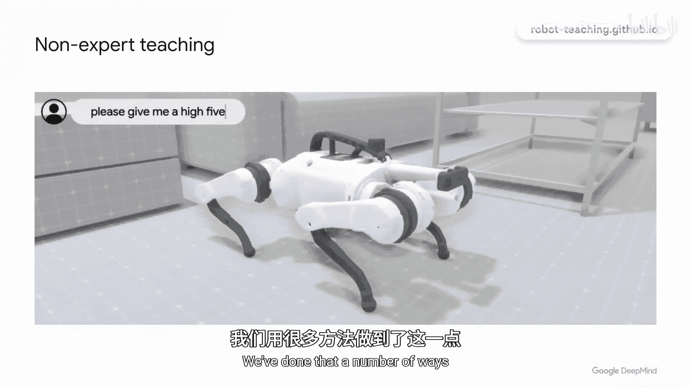

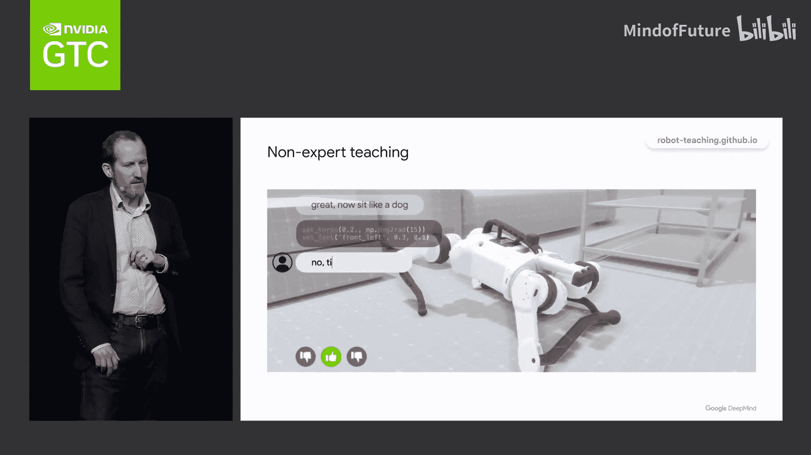

这种递归应用代码生成的方法在桥接不同抽象层次、一直到“底层”方面**非常强大**。这也开启了这样一种可能性：既然你有一个可以一直延伸到驱动的自然语言查询，你就可以以**非专家**的方式教机器人做事。这是一个例子：简单地“把苹果移到立方体旁边”。生成了代码，然后机器人直接撞上了东西。用户可以说：“嗯，那不好。请不要撞到罐子。”于是突然生成了对应于你心中目标的代码。这是你添加到整个奖励系统中的奖励函数，机器人学会了更好的行为。我们以多种方式做到了这一点。这是我们的小型四足机器人，我们想教它击掌。它做得不太好。你要求它把爪子举高一点。嗯，这样好。现在让它坐着做。嗯，那不算真的坐着。换个方向试试。这段代码并不明显，除非你真的知道自己在做什么，你必须是个专家才能做到。但现在，非专家可以直接在机器人上编码所有这些行为。我认为这是一个非常重要的部分，从高级语义一直到代码，确实带来了新的东西。

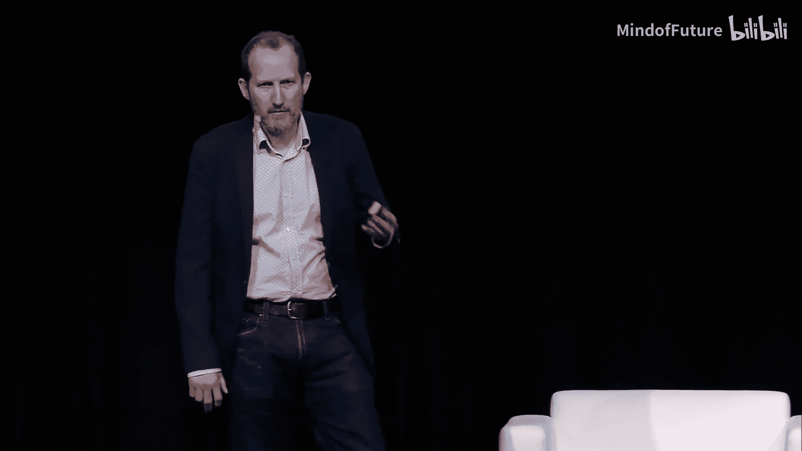

我喜欢这项工作的另一点是，你可以将你与机器人进行的对话（包括点赞和点踩）用于微调你的模型，显然，可以直接获得期望的行为，而无需再次教机器人。你可以将其**融入模型**。当你这样做时，你会得到一个更好的模型，这很明显。你还会得到一个**学习能力更强**的模型，因为你不仅输入对话的输出，还输入了整个对话，包括你的反应是错误还是正确的时候。结果，模型变得更好，基本上成为了一个更好的学习者。我们甚至在训练中未见过的各种任务上也看到了这一点，模型最终成为了更好的学习者，可以用更少的轮次教机器人做新行为。

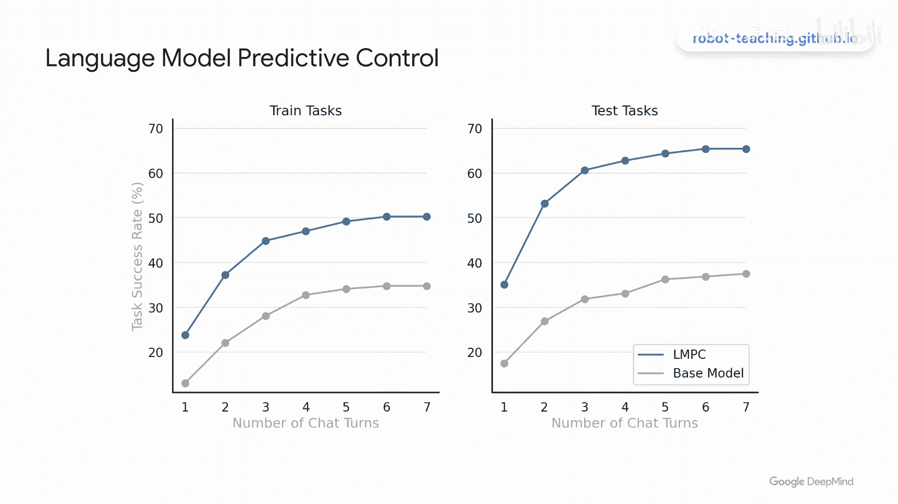

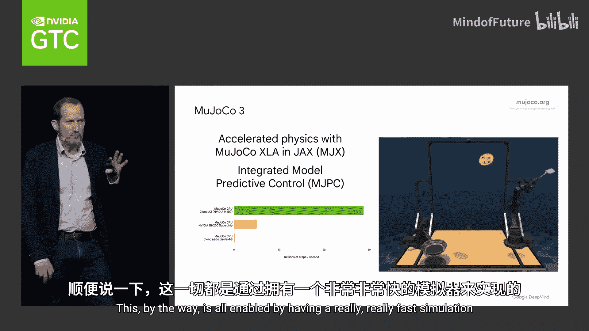

顺便说一下，这一切都得益于拥有一个**非常快速**的模拟器。我们有一个名为**MuJoCo**的开源模拟器。我们最近发布了第三个版本。特别相关的是，我们有一个在GPU上并行运行、可以非常快速地执行各种行为广泛扫描的JAX实现。我们还在模拟器中集成了**MPC**实现，使你能够基于奖励非常快速地合成行为，并实时实验奖励塑形和观察结果。这是一个非常强大的范式，可以在开发技能和行为时拥有一个模拟器在循环中。

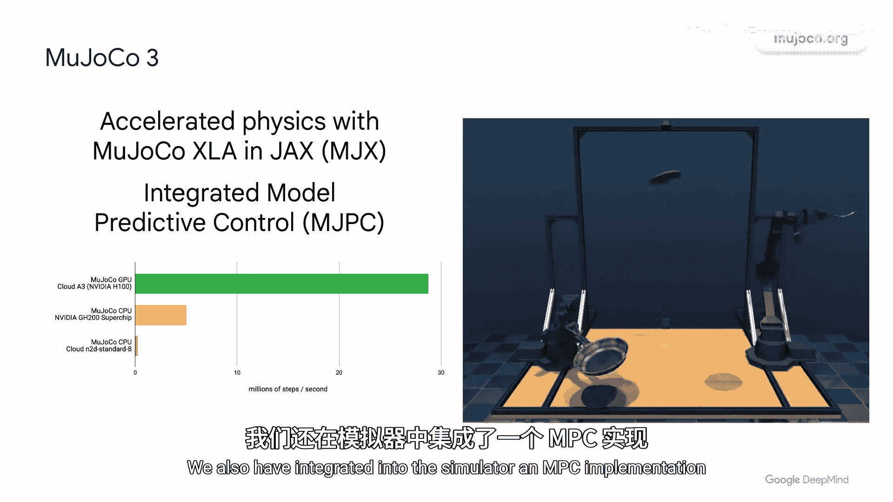

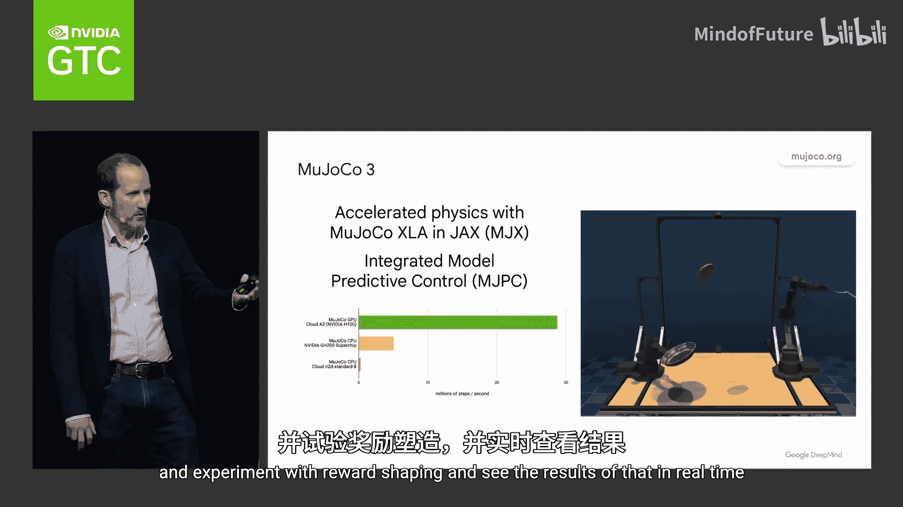

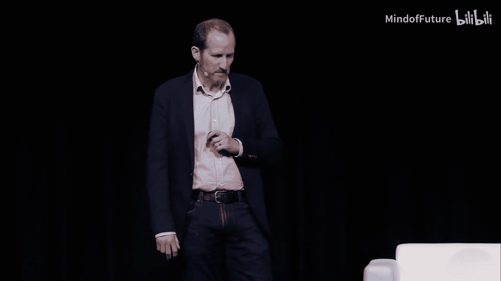

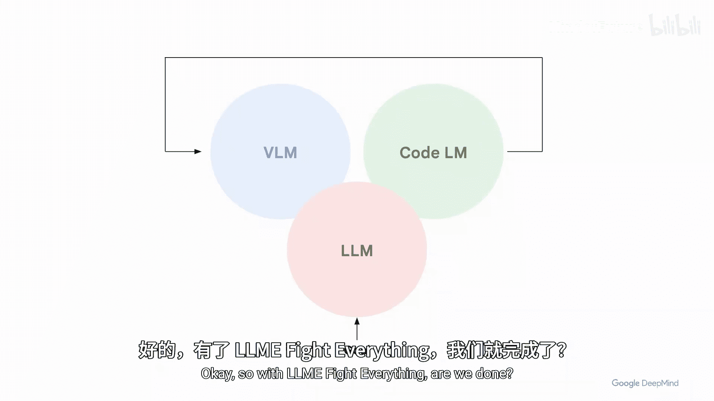

好的，那么，用LLM“化”一切。我们完成了吗？这个模型有一些**弱点**。拥有一个可解释的组件作为机器人的核心，你可以在其中进行对话并真正看到机器人的状态，这很好。但也有一些限制。有时你可能希望在规划器和感知之间建立**更高带宽**的连接。你并不总是确切地知道用语言总结视觉上下文可能非常复杂，并不适合精确工作。所以我们接下来尝试的是：嘿，都是语言模型，都是大型神经网络。让我们试着看看能否**融合**它们。

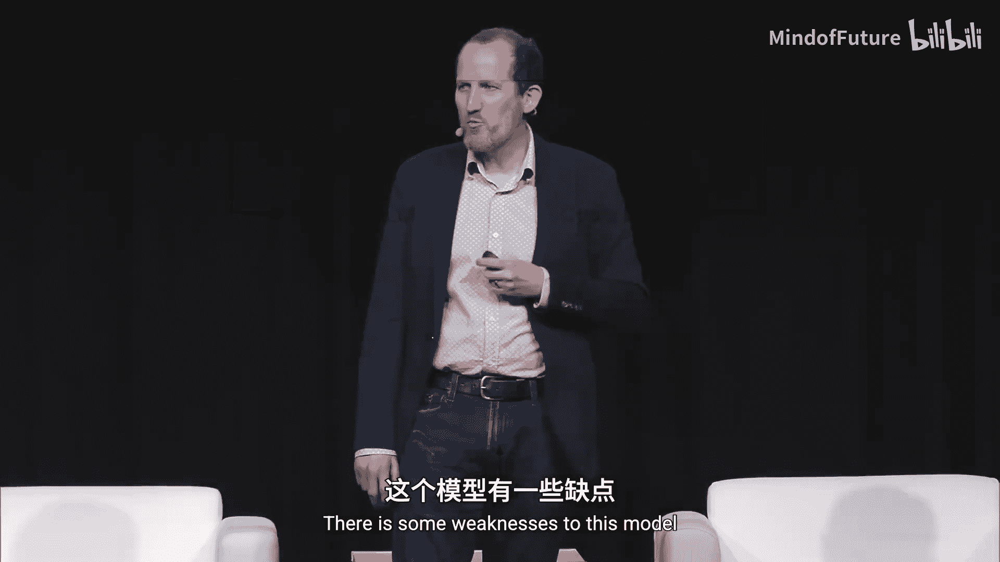

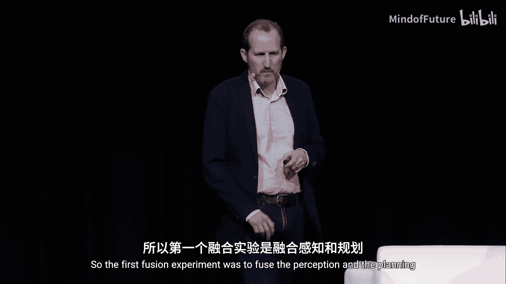

第一个融合实验是融合**感知和规划**。这项工作我们称之为**PaLM-E**。现在多模态语言模型很常见，但这是早期进行此类实验的工作之一。我们以PaLM作为语言模型，在其中添加了一个视觉编码器，以便可以一起训练它们，从而可以在输入序列中无缝地包含图像标记或嵌入，并在各种数据（如视觉问答和机器人控制任务）上一起训练。具体来说，我们曾为类似于SayCan的机器人控制计划训练这样做。这效果很好。我们看到可以直接从视觉到计划执行**非常多**的任务。同样，这个模型的输出都是自然语言，因此非常可解释。但现在语言模型有了“眼睛”，可以真正看到它所操作视觉场景的细节。

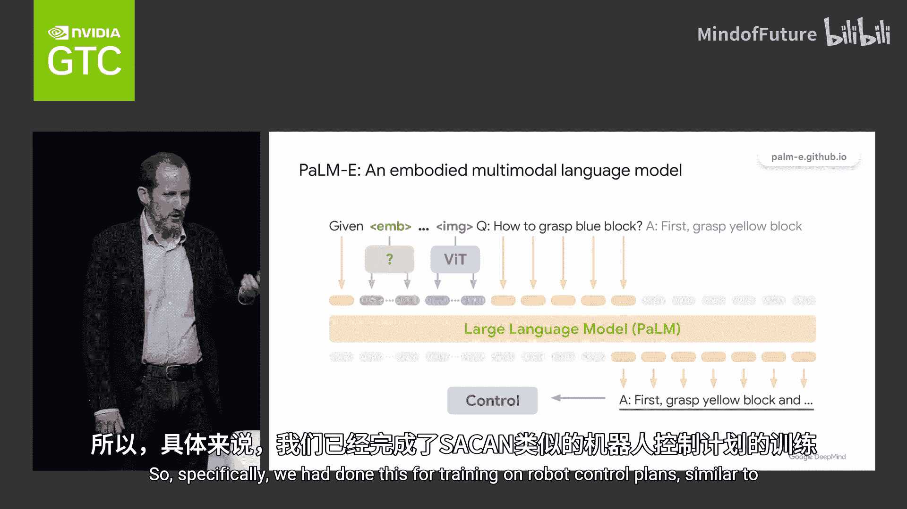

PaLM-E有趣的一点是，这是我们**第一次**看到一个真正为机器人训练，但在所有你能想象的多模态模型任务上仍然表现**极好**的模型。它可以做视觉问答、图像描述，在推理方面没有损失任何性能。事实上，这个模型后来被另一个团队在医学数据上微调，成为了当时最先进的**Med-PaLM M**多模态医学模型。我不知道现在是否还是，但你可以将一个机器人模型转变为最先进的医学识别模型，这种能力我认为非常有趣。这种大型模型能够被重新定向的能力确实很有趣。

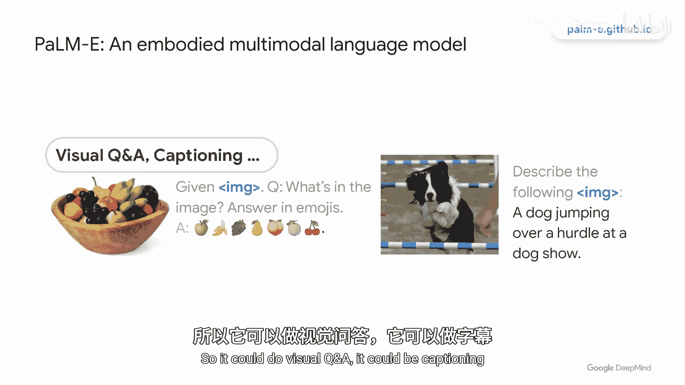

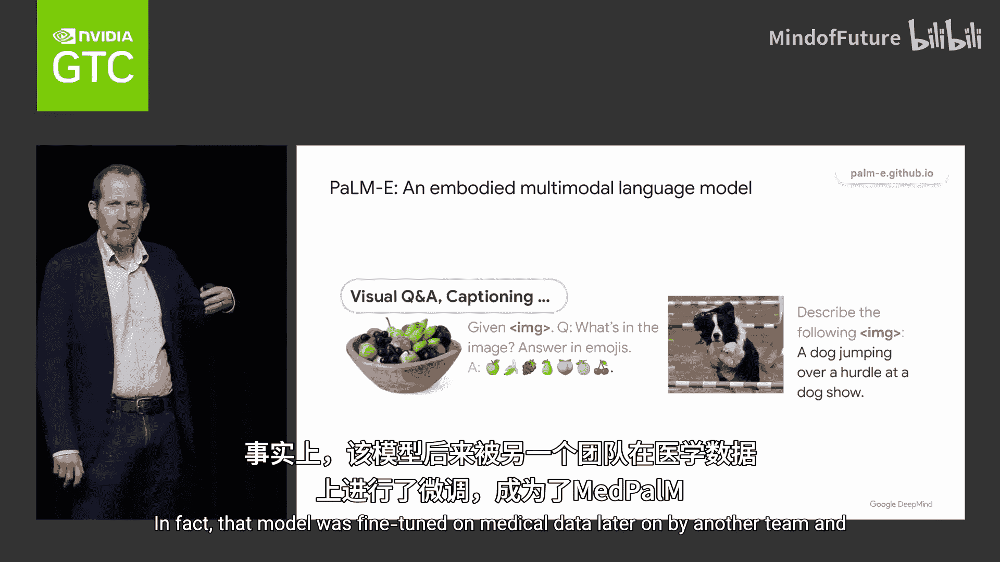

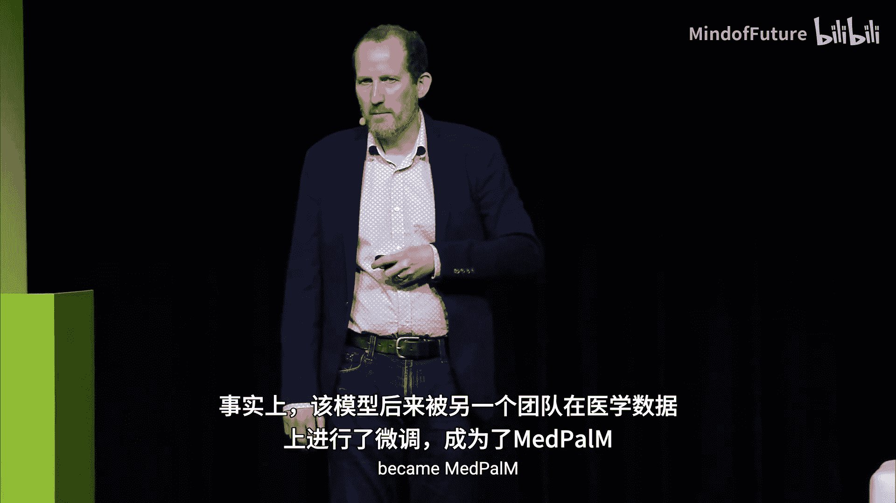

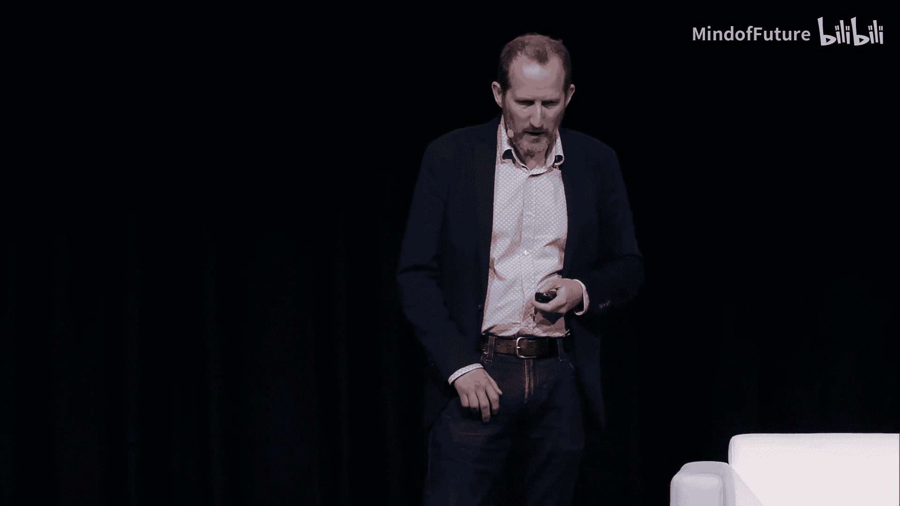

PaLM-E带来的另一个新事物是，我们**第一次**看到了**跨机器人的正向迁移**。这值得稍作解释。通常，你有不同的机器人、不同的动作空间、不同的视角，你会认为当你训练一个模型时，你希望在你最终要部署模型的具身上进行微调，而这种微调会给你最好的结果。我们在PaLM-E上看到的是，实际上在我们拥有的所有机器人数据上训练，即使是非常不同的数据，即使是像视觉问答这样几乎不像机器人的数据，当你把它们放在一起时，你最终会得到一个**工作得更好**的模型。这在过去我们在机器人学中并不多见。确实存在一个通用模型比专门模型更好的情况，这一点很重要，我们稍后会看到更多相关内容，这非常值得追求。

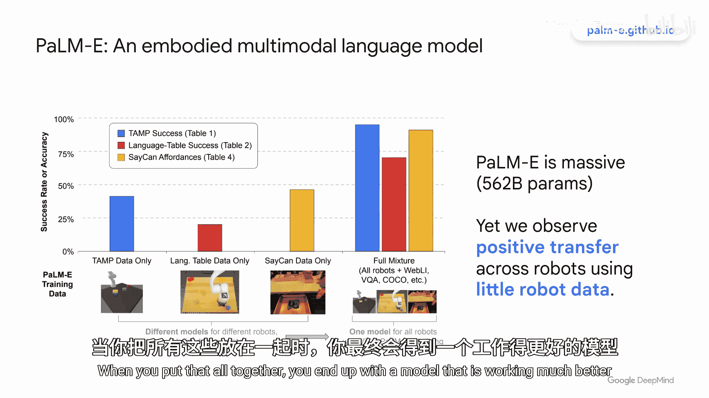

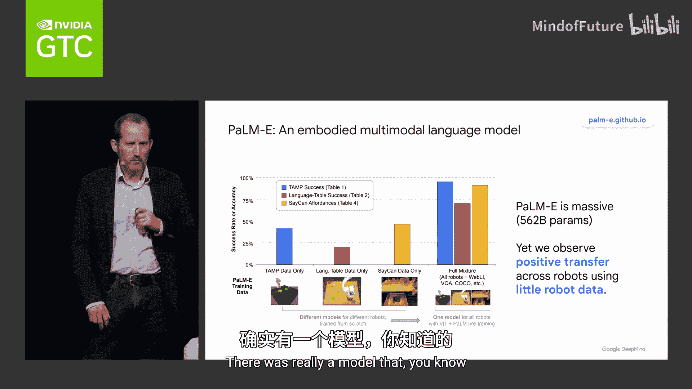

一旦你有了一个视觉语言模型，你可以做很多有趣的事情。这是一个我想强调的例子，因为我认为这在未来会很重要。这是一个使用也能生成视频的视觉语言模型的早期实验。你可以想象使用视频生成作为一种**梦想可能未来**的方式。在这个例子中，我们有一个规划器，当它面对多个可以采取的行动时，不是当场评估它们，而是实际生成一个小视频片段，展示如果我采取那个行动，环境会发生什么。然后我们对输出进行评分，并问自己：那个小视频片段的输出是否更接近目标？我们就这样选择要采取的行动。我认为这种基于世界模型的方法进行规划和驱动，随着视频模型在物理和几何等方面保真度变得更好，很可能会发展起来。所以我对这项工作的总体方向感到非常兴奋。


好的，我们已经连接了视觉和语言。我们能直接做**像素到动作**吗？这是另一条工作线，我们基本上想要拥有使用Transformer等现代工具包的像素到动作模型。我们在这个方向上的第一个工作是**RT-1**。


RT-1基本上是一个**序列到序列**模型，它接收指令、将其标记化，接收图像、将其标记化，将所有内容输入一个大型Transformer进行序列到序列训练，并输出机器人可以直接执行的动作控制。这是一个大模型，但我们可以以大约3Hz的频率运行它，所以对于我们关心的拾取放置等任务来说，实际上是可以管理的。


RT-1效果很好。这对我们来说是一个重要的顿悟时刻。因为过去，即使是简单的通用拾取放置任务，我们也无法真正在训练任务上达到饱和——我们可以投入尽可能多的数据到使用行为克隆训练的模型上，但永远无法达到100%的性能。**第一次**，通过RT-1，我们真正在训练任务上饱和了性能。这很重要，因为如果你处于数据丰富的理想状态，你应该能够完全掌握你所关注的训练设置。此外，我们获得了更好的泛化能力，对未见过的任务、干扰物和背景的泛化能力更好。所以这是构建的良好基础。


我们从RT-1实验中学到的另一件事是，并非所有数据都是**平等的**。我们做的一个简单消融实验是，从训练集中取出少量数据，总量大致相同，但我们取出了**最多样化**的数据，即与其他所有数据最不同的数据，结果性能**急剧下降**。重要的是，如果数据多样性确实是这类动作模型的关键，那么我们就做错了——如果你想想机器人实验室的研究生是如何工作的，他们通常专注于解决一个问题，收集该任务的数据，并为该任务训练更好的架构。我们在这里说的是，也许只考虑单一任务已经是在**自缚手脚**，你应该真正在拥有一个非常大的多任务模型的背景下思考，在这种背景下思考架构真的会改变游戏规则，影响这些模型的性能。所以我认为这对整个社区来说是一些有趣的教训：多任务不仅仅是一个子问题，它**就是问题本身**，而且可能是我们总体上解决更好模型的一种方式。


好的，现在你可以想象接下来会怎样了。我们已经融合了两个部分，使用了另外两个部分。我们要试试看，只用一个**巨型模型**能做什么。这项工作就是**RT-2**。


RT-2基本上是一个非常大的视觉语言模型，具备所有大型LLM的能力。所以它可以进行推理，也可以做视觉问答等。我们处理这个问题的方式是真正将**机器人动作视为另一种语言**。VLM是多语言的，它们可以说所有训练过的语言。我们只是要**再添加一种语言**，而这种语言恰好对应于机器人动作，并如此对待它。


架构与RT-1非常相似，只是它是一个**大得多的模型**。你输入标记化的语言标记，输入图像标记，然后输出对应于机器人动作的标记（可以说是“机器人语”）。当你这样做时，有趣的事情发生了。你突然有了一个**端到端**的模型，从语义和视觉识别一直延伸到动作。所以你可以表达非常丰富的命令。你可以说：“捡起那个快要掉下来的袋子。”你可以说：“捡起不同的物体。”所有这些关于“不同”意味着什么、“快要掉下来”意味着什么的微妙高级理解都融入了VLM，并传递到实际驱动中。


我想给你两个我真的很喜欢的这类行为的例子。我们要求机器人“把可乐移到泰勒·斯威夫特那里”。我们的机器人见过很多可乐，可乐是我们喜欢操纵的常用物体。但我们的机器人**从未见过**泰勒·斯威夫特，不知道泰勒·斯威夫特长什么样。我们没有任何对应于泰勒·斯威夫特的机器人数据。但VLM知道。因此，机器人能够理解泰勒·斯威夫特的概念，并将可乐移到泰勒·斯威夫特的图片旁。


我也可以用推理来做这个。“把香蕉移到2加3的和那里。”这意味着机器人需要理解3在视觉上是什么样子，需要进行基本计算，2加3。这是LLM希望知道如何做的事情。但我们从未真正教过机器人如何做加法。这都是整个模型的一部分。所以你看到了语义、视觉和动作之间的**迁移**，它们共同协作产生了一些东西。我知道“涌现”这个词有点被过度使用，但这感觉是涌现的，因为所有这些事物以一种统一的方式融合在一起。


我们在RT-2上看到的另一件事是，我们才刚刚开始让事情运转起来。如果你想想语言模型的缩放定律，机器人基础模型也有类似的缩放定律。随着我们获得更大更好的模型，事情会变得好得多。我认为我们离基于当前规模饱和性能还**很远**。这在某些方面是有问题的，这些大模型真的很慢。所以以这种速度运行控制器并使用大模型推理并不容易，但至少有一条路径可以让我们扩大规模并变得更好。


另一种形式的缩放是**跨机器人缩放**。记得我谈到PaLM-E时，我说我们看到了机器人之间的正向迁移。我们做了其他实验，比如这个**RoboCat**，我们训练了联合模型。这是一个RT-1风格的模型，但在上面加了一些强化学习，我们在不同机器人、不同动作空间、不同自由度、非常不同的设置上训练了一个联合模型。再次，我们看到即使是动作模型，我们也可以通过训练联合模型获得**好得多的性能**。这有点像说不同的机器人只是说着不同方言的“机器人语”，本质上它们没有根本性的不同，只是通过具身表达了非常**共同的概念**，通过将数据加在一起，我们实际上可以更好地理解控制机器人的物理意义。


我们试图将这一点推向**极致**。我们与34个不同的研究实验室合作，要求每个人汇集他们的数据。显然，世界各地的机器人学习研究存在巨大的多样性。你有大量不同的具身、不同的任务、不同的数据集。我们只是把所有东西汇集在一起，甚至没有尝试规范化任何数据。举个例子，这是一些数据的样子。它看起来**完全随机**。你会想，我们怎么能从这种多样化的数据中学到东西？结果证明我们可以。这也是一个有趣的学习。


我们基本上汇集了所有数据，训练了一个大型RT-1模型，将其分发给我们在大学的所有合作伙伴，他们能够使用这个模型**零样本**改进他们的基线。这是一个尽可能公平的实验，因为我们只是把权重发给他们，让他们自己运行实验。所以我们没有插手实验。


这非常令人兴奋。我认为跨具身确实有效，并且有效到极端程度，这开启了真正为每个人构建模型的可能性，也使模型不会被锁定在特定的形态和具身中，这对人们如何看待在机器人学中共享数据、利用社区并集体构建更大、更有影响力的东西具有**深远影响**。


我们还训练了一个RT-2版本的模型，也看到我们之前讨论的那些涌现技能在添加更多这种多样化数据时变得**更好**。所以确实有一个强烈的信号表明，这种用于机器人学的大型基础模型可以**显著**提高技术水平。


所以我想退一步，反思一下我们目前处于什么位置。我们有了这种统一的模型，它以视觉为输入，使用语言模型进行推理，产生对应于动作的代码。归根结底，它只是一个**大型多模态模型**。在这方面，它并没有真正特定于机器人学。我们在一些机器人数据上训练它，数据量不大，不是互联网规模的数据量。很多繁重的工作是由来自网络的文本数据和图像数据完成的。我们采取的动作是一种语言形式，它们只是“机器人语”的方言。


这张图对我们机器人学界来说真的**非常奇怪**。如果你在三年前问我，机器人学会变成这样，或者机器人学可能的未来会是这样，我会说你疯了。回到三年前，我们真的专注于强化学习，专注于针对特定机器人的学习方法，使用大量数据。所以事情的形式真的**发生了实质性的改变**。

这仍然是研究。所以我们还没有在现实世界中完全验证这一点，但这是机器人学一个**全新的、潜在的**新道路。令人兴奋的是，它确实使机器人学能够**乘上我们正在经历的AI浪潮**。任何对大语言模型的改进，对多模态模型、视频生成的改进，都将能够在机器人学中使用和利用。所以我们不再是孤立的AI小岛，我们真正成为了整个AI社区的一部分，我们可以真正受益于世界上发生的所有进步的总和。

---


好的，说到这里，我要感谢所有为这项研究做出贡献的人。这是一个由非常多才华横溢的人组成的庞大团队的努力。我很感激能成为其中的一小部分。感谢在座的各位。

---


非常感谢这场引人入胜的演讲。我们有一些时间提问，如果人们想走到过道上的麦克风那里。请开始。

（提问环节略）

---


本节课中，我们一起学习了生成式AI，特别是大语言模型，如何为机器人学带来范式转变。我们从最初的简单结合（如SayCan将LLM用于规划），探索了多模型对话（苏格拉底模型）、代码生成控制（代码即策略），到最终融合视觉、语言和动作为一体的端到端模型（RT-1， RT-2）。我们看到，将机器人动作视为另一种“语言”，利用大规模多模态预训练模型的强大能力，可以实现语义理解、常识推理与物理控制的直接连接。这种新范式不仅提高了性能，还带来了更好的泛化能力、跨机器人正向迁移以及更自然的人机交互方式。它使机器人学能够融入更广阔的AI发展浪潮，为未来机器人的通用性和易用性开辟了全新的可能性。