# 005：在现实世界中部署人工智能

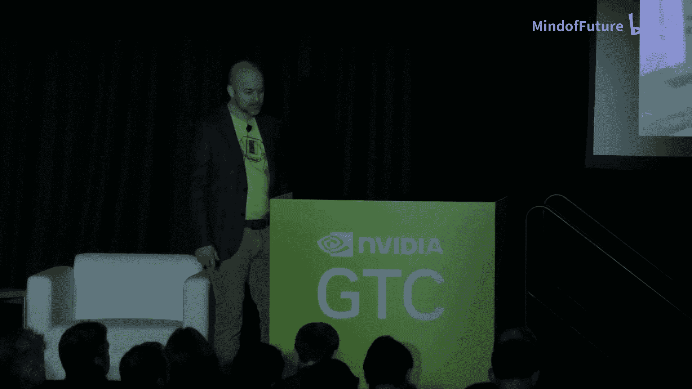

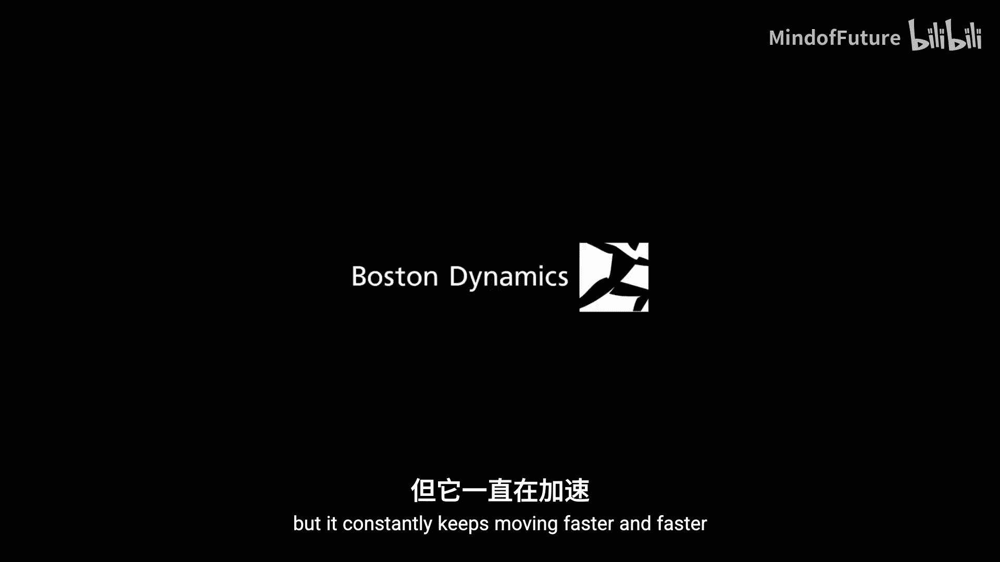

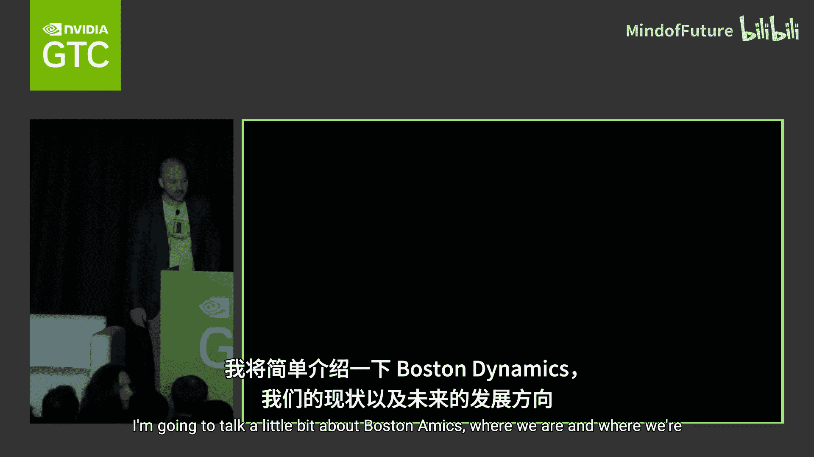

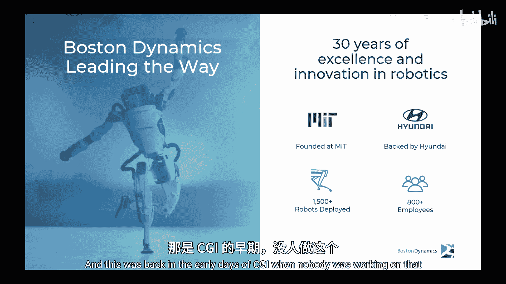

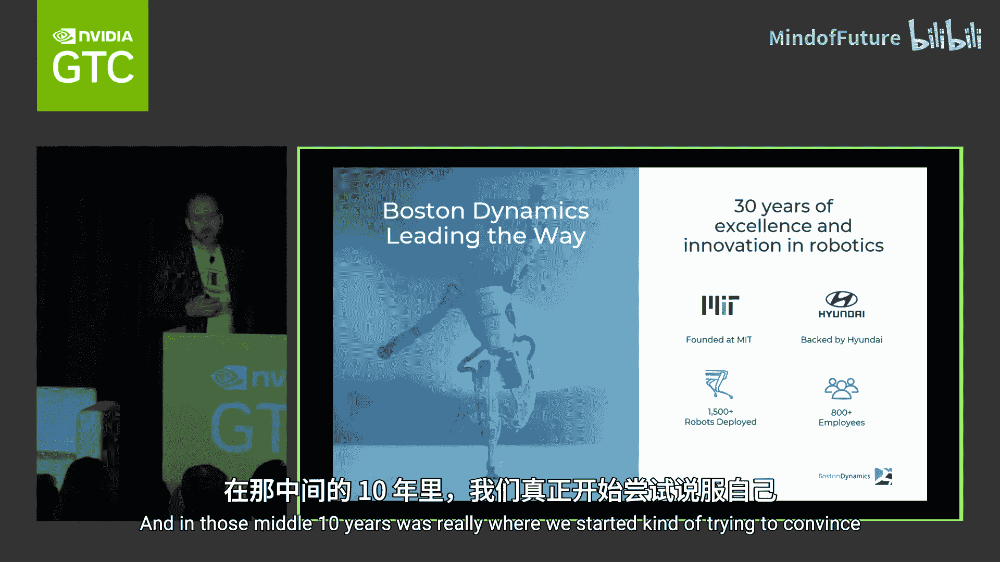

在本节课中，我们将跟随波士顿动力公司首席技术官Aaron Saunders的分享，了解他们如何将人工智能，特别是强化学习，应用于现实世界的机器人产品中。我们将探讨其技术演进、核心方法以及最新发布的研究工具包。

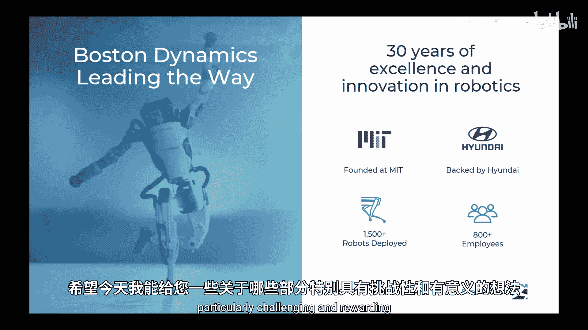

## 概述：波士顿动力的三十年征程

波士顿动力是一家拥有30年历史的“初创公司”，其发展历程大致可分为三个十年阶段。

第一个十年与机器人无关，公司创始人Marc Raibert最初专注于基于物理的仿真技术，为早期CGI行业做出了贡献。随后，他将仿真领域的专业知识应用到了机器人技术中。

在第二个十年，公司开始致力于证明机器人技术的可行性，并让世界相信机器人是真实存在的。如今，机器人已广泛应用于各个领域，这与20年前的情况截然不同。

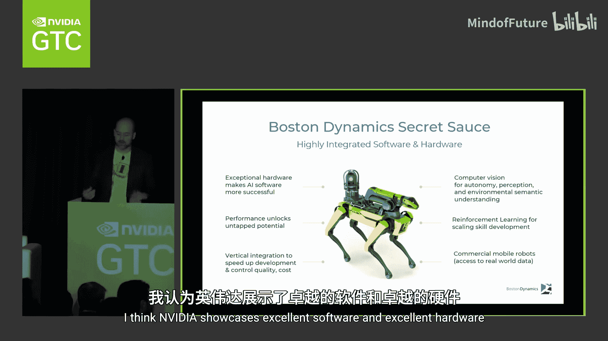

目前，公司正处于第三个十年，专注于将机器人技术商业化并大规模部署。公司现有约800名员工，已向真实世界部署了约1500台机器人。虽然这个数字与汽车制造等行业的规模相比很小，但在现实世界中部署数千台机器人本身就是一个巨大的挑战和成就。

## 核心产品线与“秘密配方”

波士顿动力的努力主要围绕三条产品线展开。

**Spot** 是公司首款商用移动机器人产品。目前有数千台Spot机器人在世界各地行走，它们不仅仅用于演示，而是在实际工业场景中创造价值，例如在半导体工厂检查设备、进入核退役等危险区域进行勘察。

**Stretch** 是用于搬运纸箱的移动机器人。它部署约一年，已移动了约300万个箱子。这项技术旨在替代枯燥、繁重的人力劳动。

**Atlas** 长期以来一直是公司的研究平台。其使命不仅是研究，更是推动最终能应用于所有产品的尖端技术。

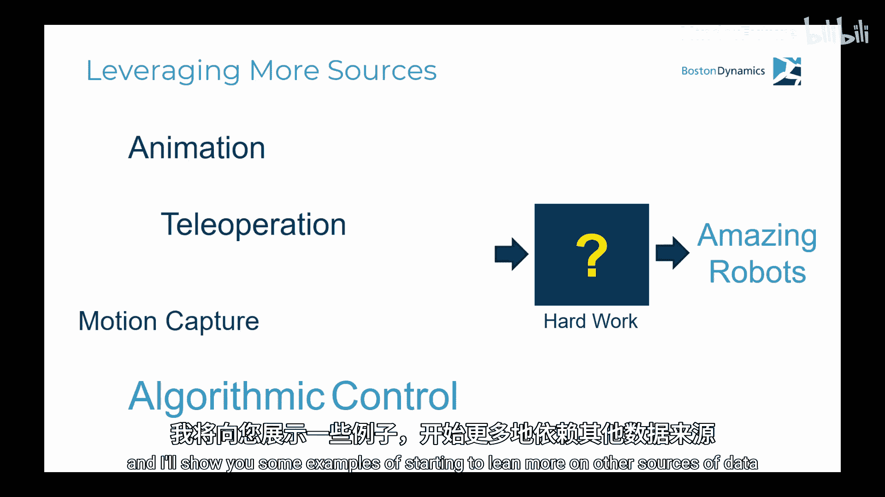

关于波士顿动力的“秘密配方”，并非单一因素，而是多个方面的结合：
*   **高度集成的硬件与软件**：优秀的硬件能更成功地部署AI。仿真与现实的差距因此被大大缩小，控制算法能快速从仿真迁移到实体机器人。
*   **追求性能**：高性能的机器允许探索其运动学和应用的极限，无论是在非结构化地形行走还是进行复杂操作。
*   **垂直整合**：在现代汽车集团的支持下，公司实现了垂直整合，加快了开发周期，能够快速制造和修改机器人。
*   **视觉驱动的自主性**：机器人通过视觉感知世界、理解环境和上下文，从而决定如何与之交互。
*   **强化学习**：这是该领域新兴的产品化能力。
*   **商业化导向**：商业使命提供了明确的焦点，确保所解决的问题具有实际价值并能持续发展。

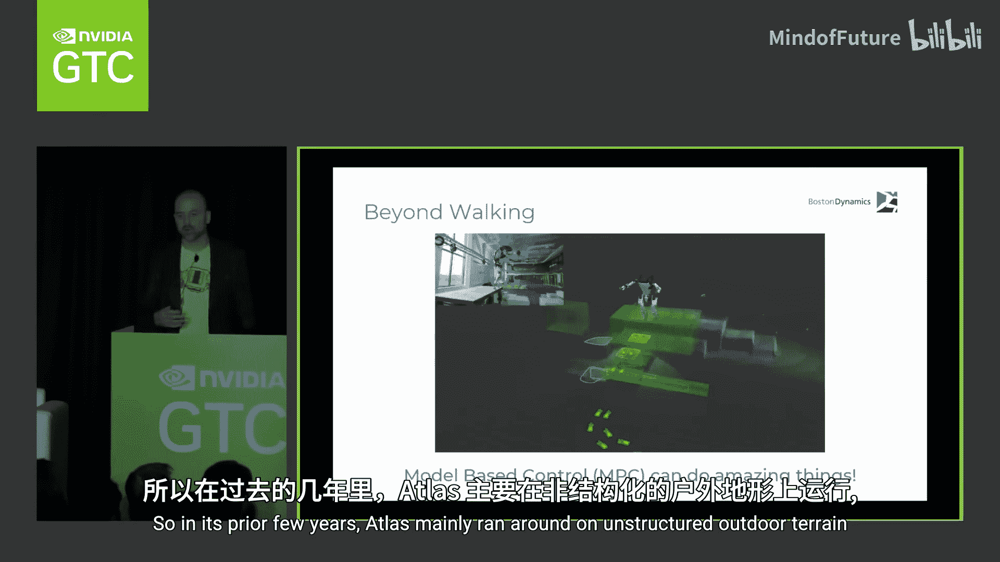

## 技术加速：从算法控制到数据驱动

过去，为Atlas开发一个新动作（如跳跃）可能需要数月到数年的时间，从简单模型到部署调优的控制系统，过程非常艰难。

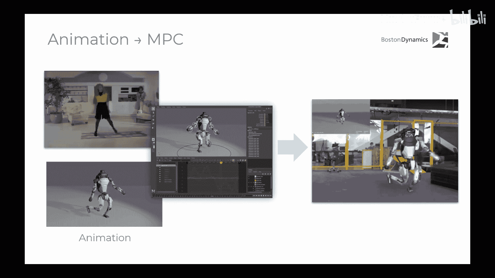

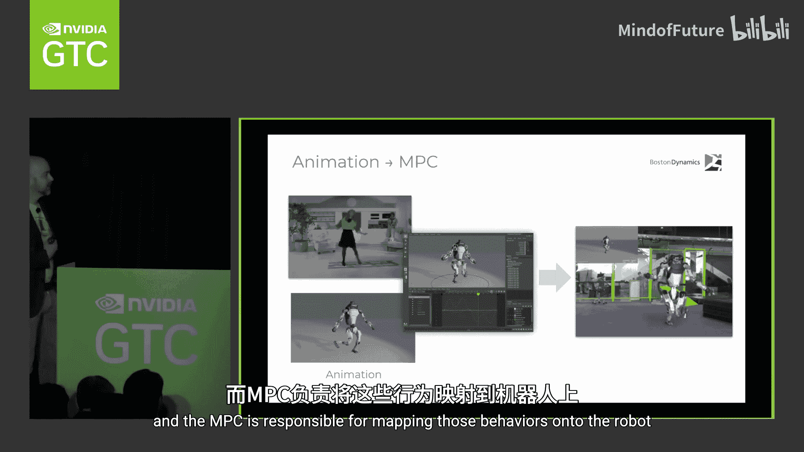

为了更快地构建机器人技能，公司开始探索利用更多数据源，而不仅仅是算法控制。这些数据源包括**动画参考轨迹**、**遥操作**、**动作捕捉**、**合成数据**和**视频**。最终目标是利用互联网规模的数据并将其应用于机器人。

其方法的核心是建立一个良性循环：利用数据生成参考轨迹，通过离线和在线计算，由模型预测控制器可靠地执行。然后，系统会不断泛化和扩展这些能力，从而生成更多数据，推动循环继续。

上一节我们介绍了技术加速的总体思路，本节我们来看看Atlas的具体应用。

### Atlas的演进：从模型预测控制到多源数据融合

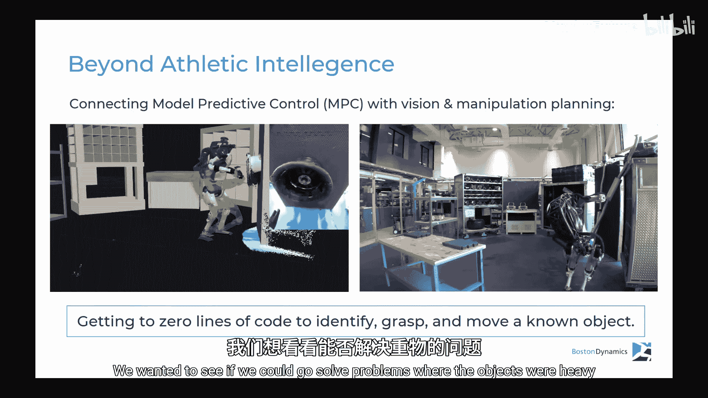

最初，Atlas的控制器采用级联两步优化：先针对一个简化质点模型进行轨迹优化，再将其映射到机器人的运动学上。这实现了从行走到跳跃、奔跑的跨越，但环境是结构化且已知的，感知智能有限。

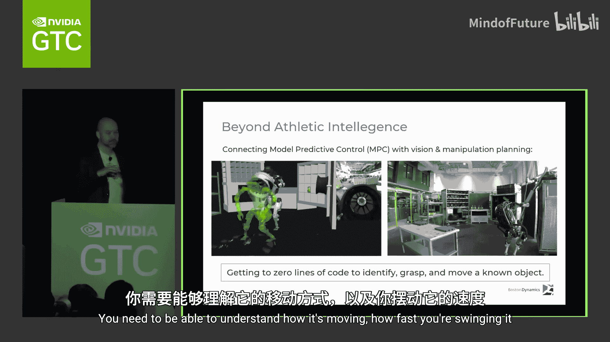

为了引入新的能力，团队尝试了不同的数据源。例如，为了让Atlas跳舞，他们与动画师合作，将生成的动画作为参考轨迹输入给模型预测控制器，由控制器将其映射到机器人身上。

同样，也可以使用动作捕捉数据或从视频中提取运动学轨迹作为参考。这些都是可以借鉴的丰富数据源。

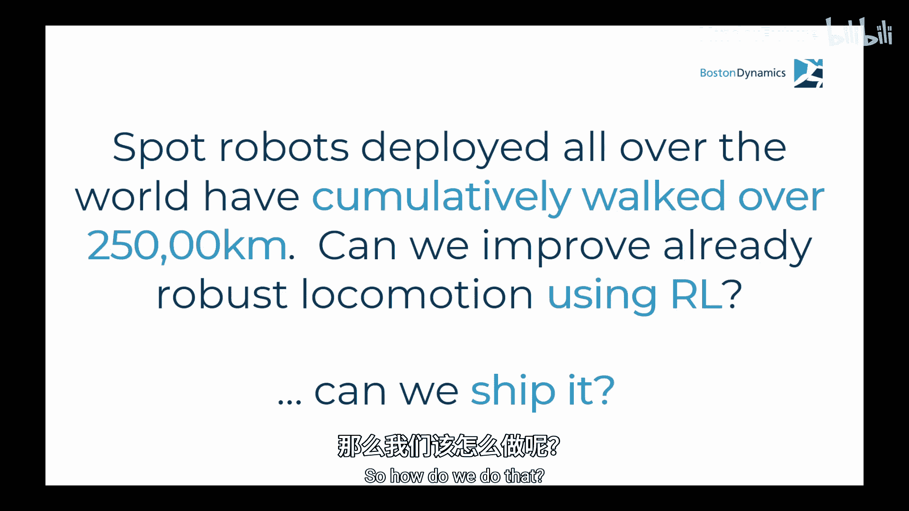

随着技术的发展，团队将原先级联的两步优化问题整合为一个大型优化问题，能够同时求解全身动力学。这使得机器人能够自主利用身体（如收拢手臂）来调整惯性，完成更复杂的动作，例如在平地上完成后空翻。这种能力对于应对意外碰撞或失稳至关重要。

目前，团队正将相同的工具链应用于**操作任务**。早期的成果显示，Atlas能够自主操作重型汽车部件。机器人通过训练好的模型识别物体、分割场景、确定抓取点，并在操作过程中推理环境几何约束。这展示了模型预测控制工具在复杂操作任务上的潜力。

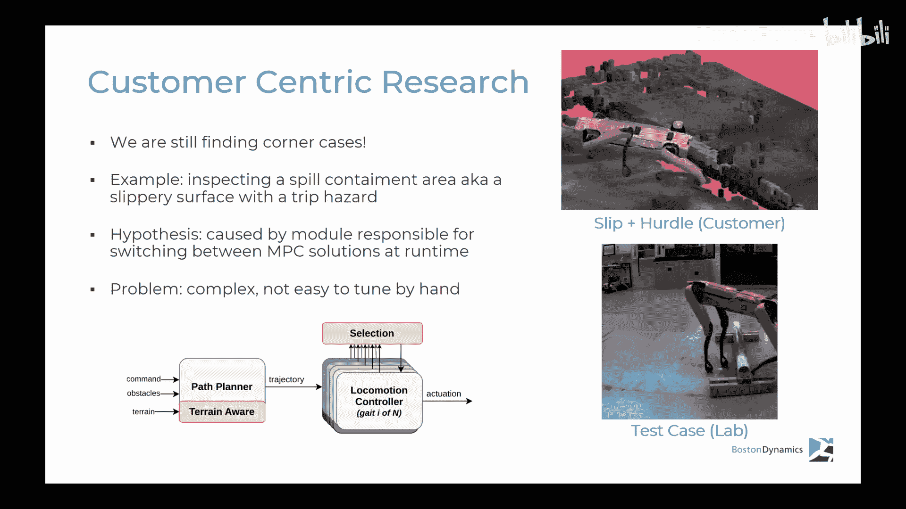

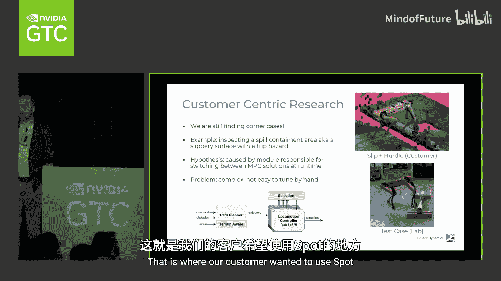

这些系统充满了AI技术，但并非端到端的AI模型。其优势在于，高性能的机器人能够生成大量有意义的真实数据，为未来更多数据驱动的解决方案奠定了基础。

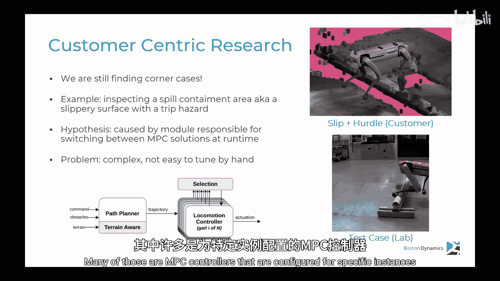

## 强化学习在产品中的部署：以Spot为例

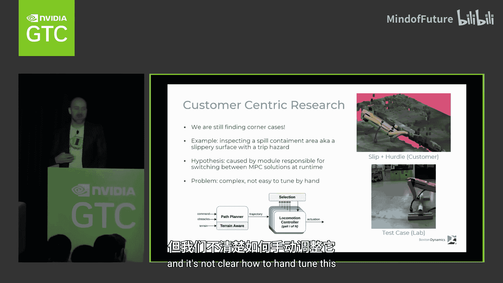

接下来，我们聚焦于如何将数据驱动的解决方案，特别是强化学习，部署到商用产品Spot上。

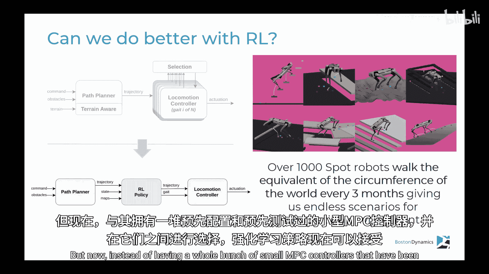

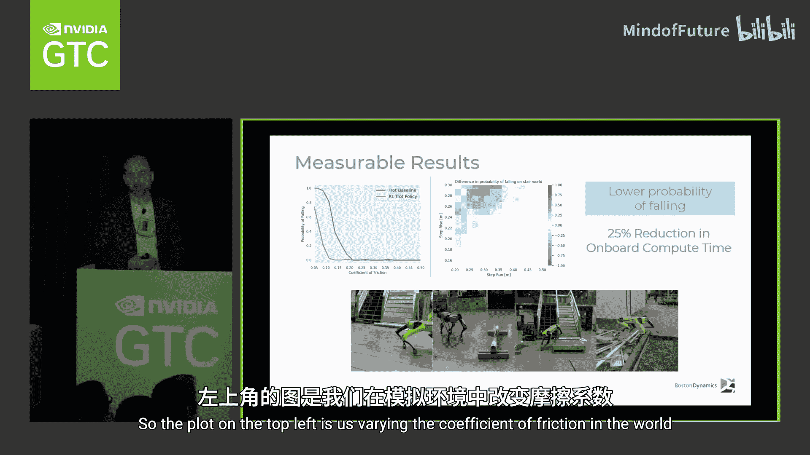

Spot机器狗群已累计行走25万公里，每三个月就能绕地球一周。尽管表现卓越，团队仍在不断寻找改进的方法，尤其是需要解决客户遇到的实际问题。

例如，有客户报告Spot在跨越一个小障碍后，在光滑地面上滑倒。原因是该环境需要机器人进出防溢围堰区域，即需要先后应对突起障碍和肥皂水覆盖的光滑地面。

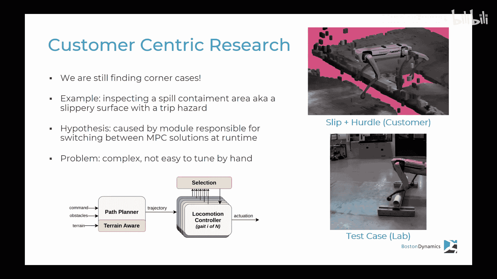

Spot原有的控制器包含一个由启发式算法选择的模型预测控制器库。该算法根据感知数据、力数据等实时选择步态。但在跨越障碍后立即遇到光滑地面的复合场景下，步态选择模块难以高效切换到适合光滑地面的理想步态，且手动调整启发式规则可能引发其他问题。

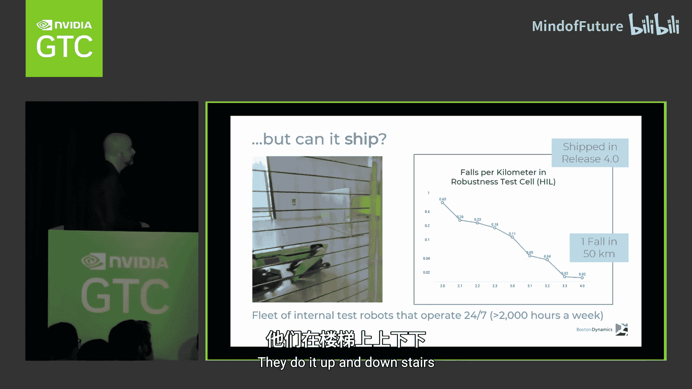

这正是应用强化学习的良机。团队训练了一个RL策略，其职责是动态调整单个模型预测控制器的参数，而不是在不同预配置的控制器间切换。这使得策略能更精细地适应复杂环境。

成功的关键在于能够基于真实场景创建高质量的仿真环境。拥有数千台在外运行的机器人，为复现问题场景提供了基础。

开发出初步策略后，还需进行大量测试以确保其普遍改进。团队在仿真中测试了不同摩擦系数、不同高度落差的地形，确认了新策略在多种关键场景下都能降低摔倒概率。

最终成果是：机器人摔倒概率降低，同时该部分软件栈的计算负载减少了25%。这对于需要携带计算设备和电池的移动机器人意义重大，节省出的算力可用于更高级的感知任务。

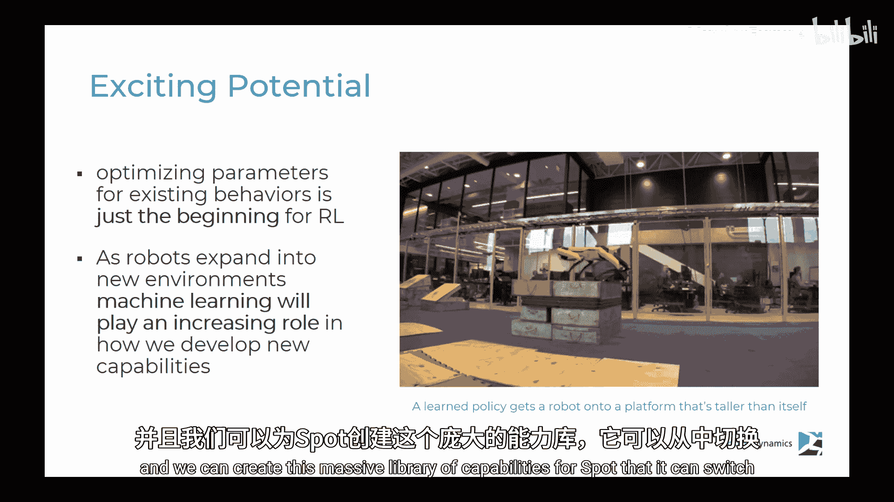

## 从研发到发布：质量保证与持续改进

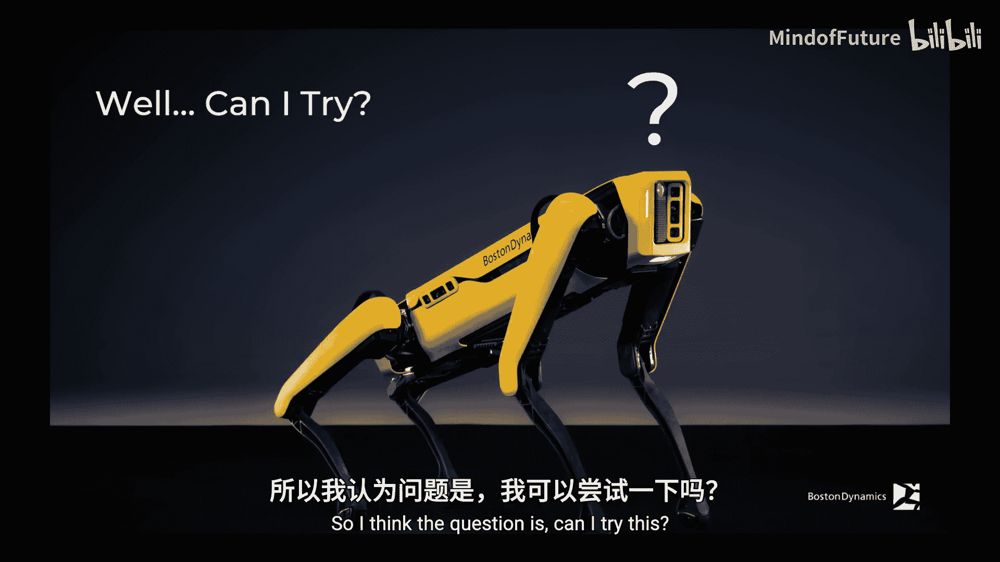

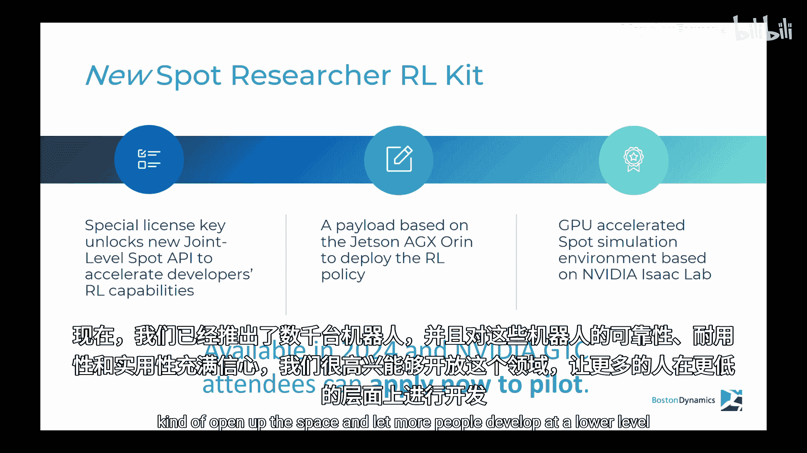

将新技术部署到客户手中需要严谨的流程。无论是RL策略还是传统算法控制器，都需经过相同的测试流程：近乎无限的仿真测试，加上大量的实体机器人测试。

波士顿动力通过庞大的测试车队进行7x24小时硬件在环测试，模拟各种客户环境和极端条件。这是将新兴技术转化为可靠产品的关键。

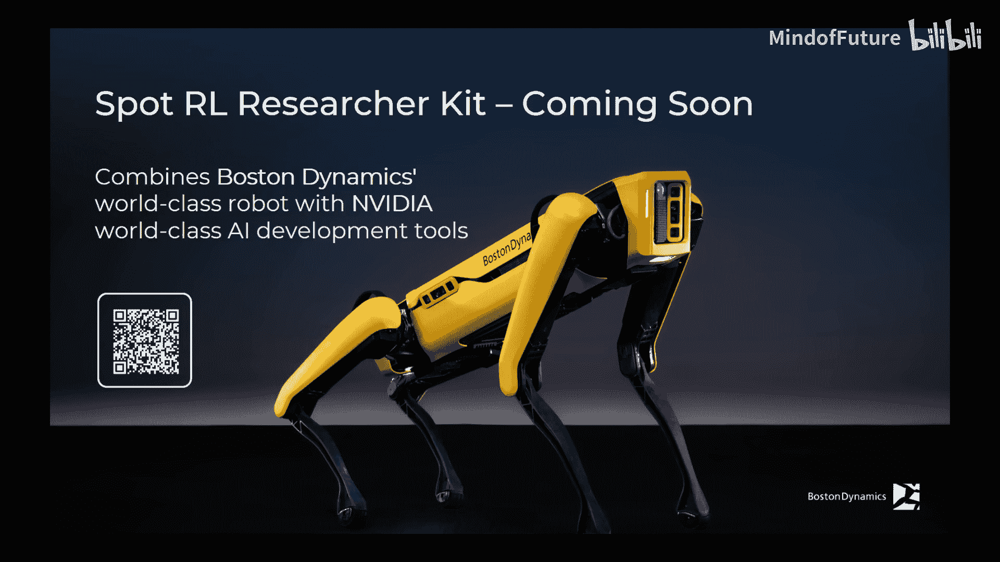

通过持续改进硬件和软件，Spot的故障率已从早期的每公里0.6次跌倒，显著降低到约每50公里1次跌倒。在部署了RL控制器后，软件质量保持稳定，所有Spot机器人都能通过软件更新获得性能提升，实现了“越用越好”的体验。

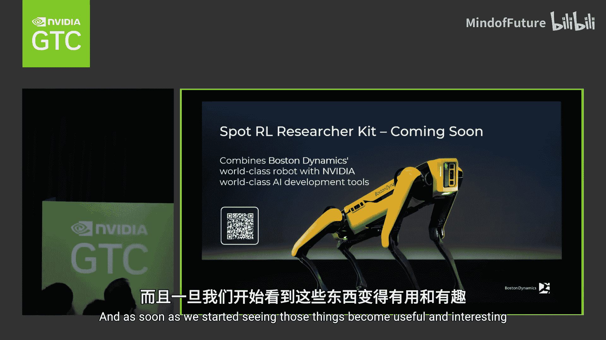

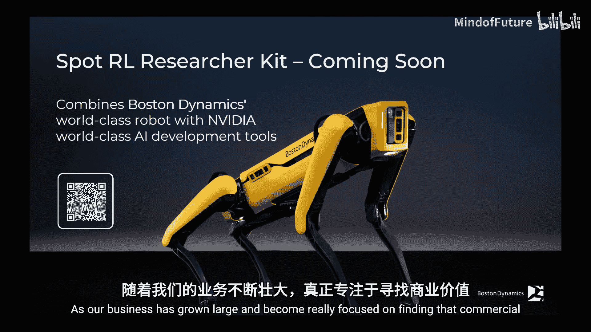

除了调整参数，RL还能用于从头学习全新的策略，例如让Spot跳上比自身还高的平台。这种特定技能的策略可以与参数调整策略一同纳入Spot的技能库中。

## 新工具发布：Spot研究工具包

为了让更广泛的研究社区能够利用这些能力，波士顿动力与英伟达合作，发布了新的Spot研究工具包。

该工具包主要包含三部分：
1.  **底层API**：解锁了对Spot前所未有的控制能力。
2.  **NVIDIA Jetson AGX Orin**：提供强大且功耗优异的移动计算平台。
3.  **英伟达AI开发工具套件支持**：帮助研究者更快地取得成果。

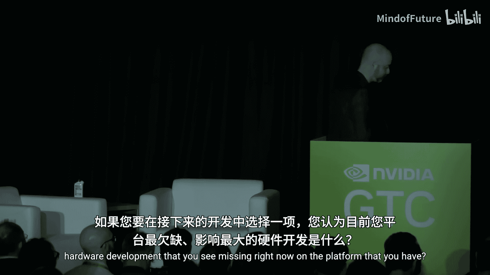

波士顿AI研究所作为首批测试用户，利用该工具包快速实现了从像素到动作的端到端行为生成，并将在发布后提供开源示例。

## 总结与展望

本节课我们一起学习了波士顿动力如何将AI部署于现实世界的机器人中。我们回顾了其技术演进路径，从高度集成的硬件软件、模型预测控制，到利用多源数据加速开发。我们重点探讨了强化学习在解决Spot实际客户问题中的具体应用，包括问题识别、仿真训练、测试验证到最终产品部署的全过程。最后，我们了解了新发布的Spot研究工具包，它将世界级的机器人平台与顶尖的AI开发工具相结合，旨在赋能更广泛的研究与创新。

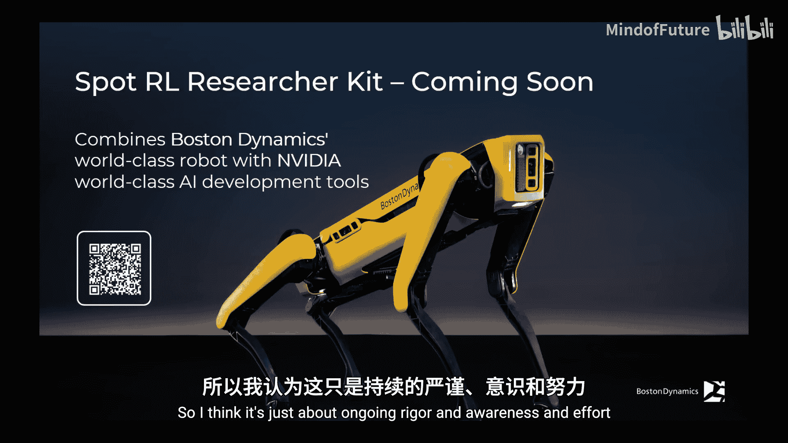

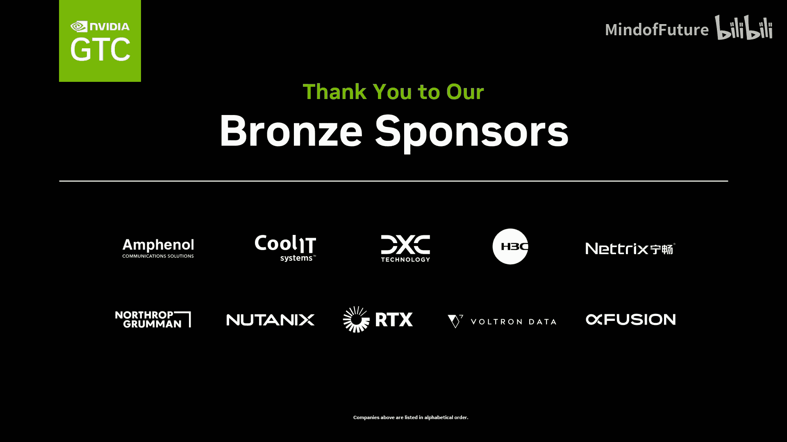

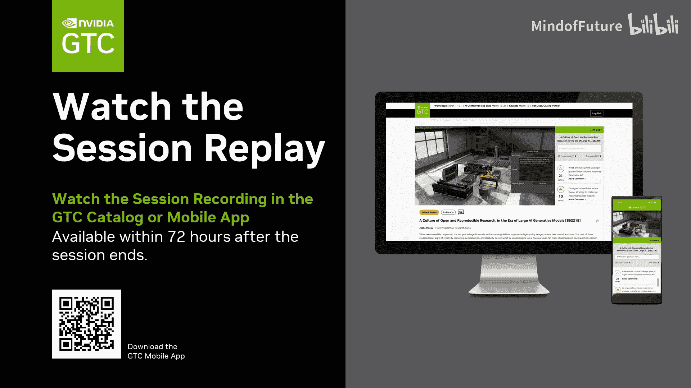

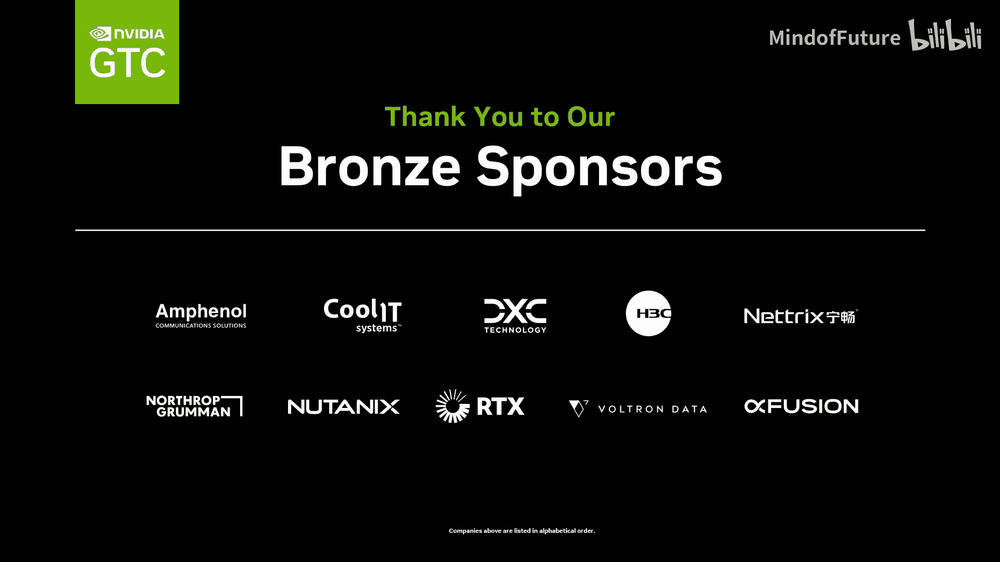

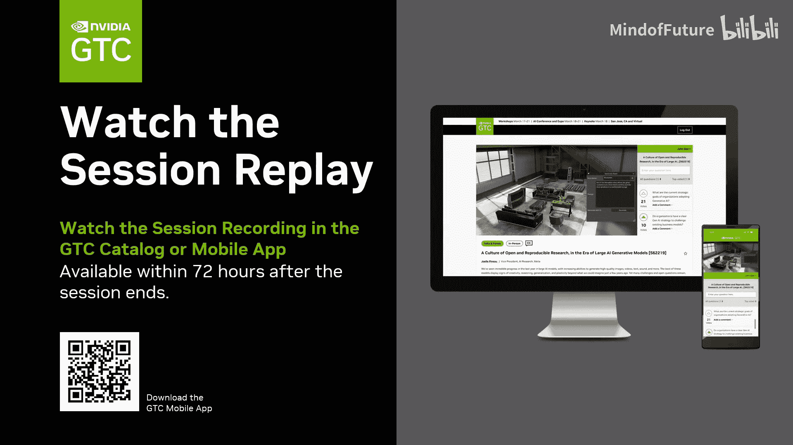

未来，与英伟达在Omniverse数字孪生等领域的合作，将通过合成数据加速仿真与训练过程。尽管面临电池续航、网络安全等持续挑战，但机器人通过软件更新不断进化、创造价值的能力，正推动着整个行业向前发展。