# 006：David Luan与Bryan Catanzaro的对话

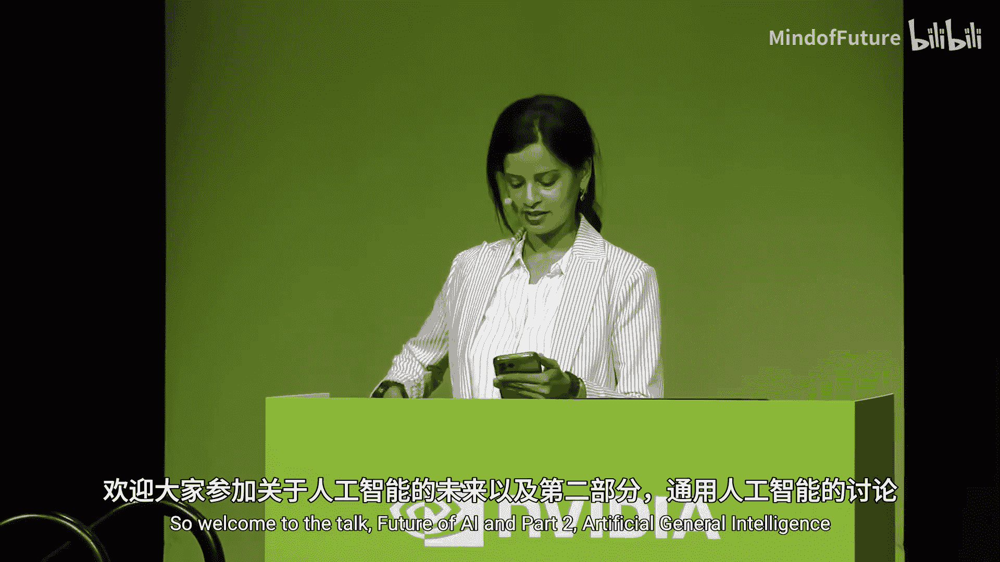

在本节课中，我们将一起学习英伟达GTC 2024大会上，Adept公司CEO David Luan与英伟达应用深度学习研究副总裁Bryan Catanzaro关于人工智能未来与通用人工智能发展路径的深度对话。我们将探讨AI的规模化发展、数据挑战、智能体应用以及未来的研究方向。

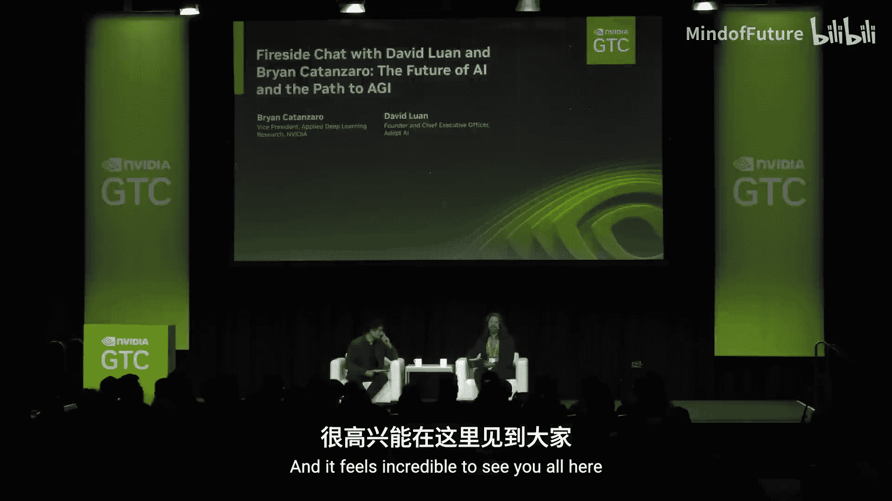

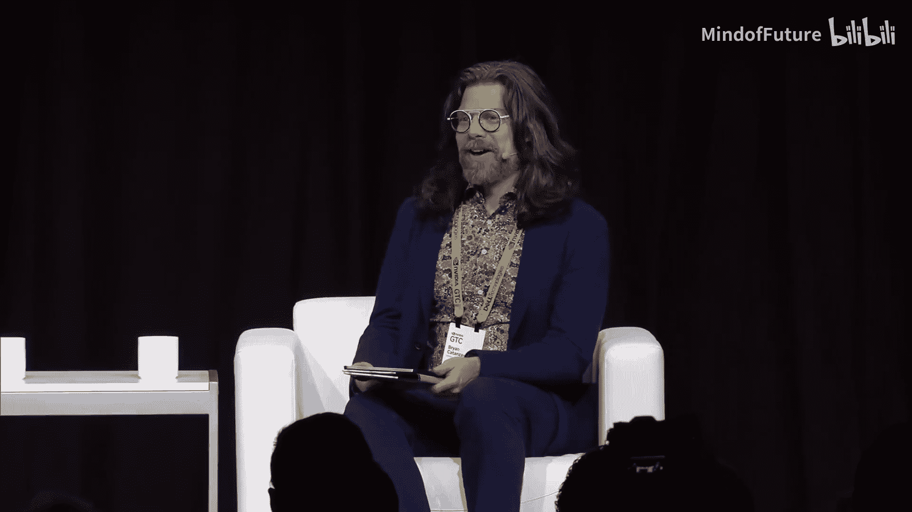

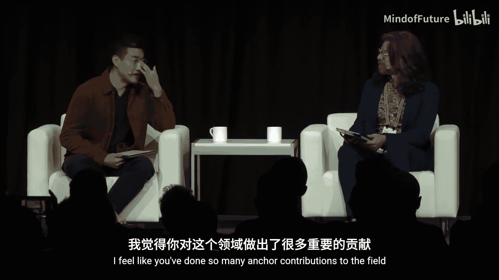

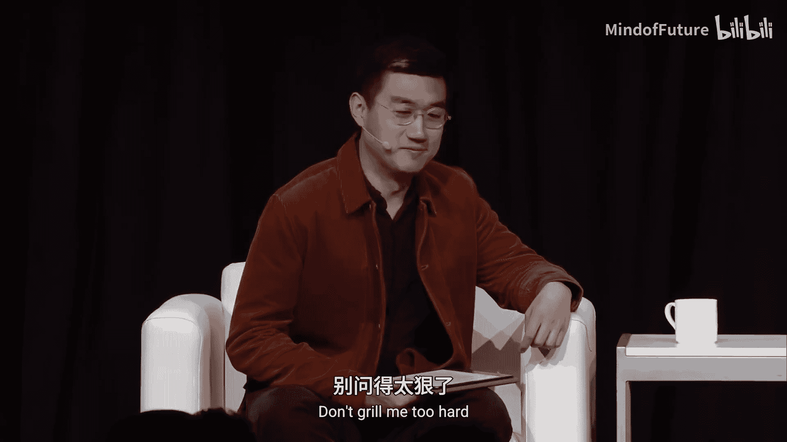

## 开场与嘉宾介绍

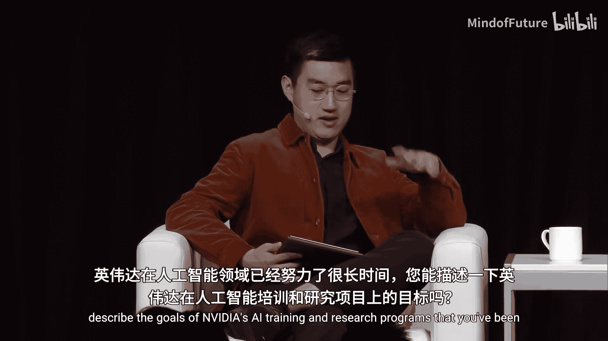

欢迎来到本次关于AI未来与通用人工智能的讨论。本次对话由两位我非常欣赏的人士——Bryan Catanzaro和David Luan带来。

首先介绍David Luan，他是Adept公司的联合创始人兼CEO。他的公司正在构建用于知识工作的AI智能体。此前，他曾是OpenAI的工程副总裁，负责语言、超级计算、强化学习、安全与政策方面的研究。更早之前，他在Google Brain领导团队，推出了GPT、CLIP和DALL-E等项目。欢迎David。

Bryan是英伟达应用深度学习研究团队的副总裁。他的团队致力于多模态语言建模、芯片设计、音频、语音、图形与视觉研究，并持续为英伟达的产品和工作流程寻找实用的AI新方法。在英伟达，Bryan帮助创建了PhysX、HD、DLSS、Megatron、cuDNN、Pascal、WaveGlow和Deep Speech等项目。欢迎Bryan。

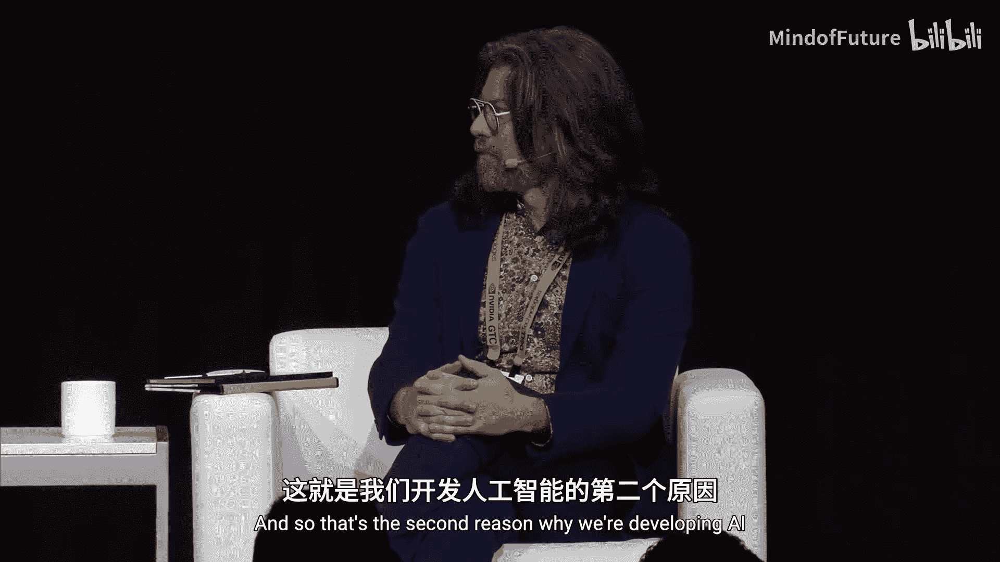

很高兴看到大家。欢迎来到GTC。距离上次线下大会已经有一段时间了，能在这里见到大家感觉非常棒。感谢各位的到来。希望我们今天能进行一次有趣的讨论。David和我是朋友，我们将主要聊聊我们正在做的工作以及我们认为AI的发展方向。希望在最后能留出一些时间进行问答。

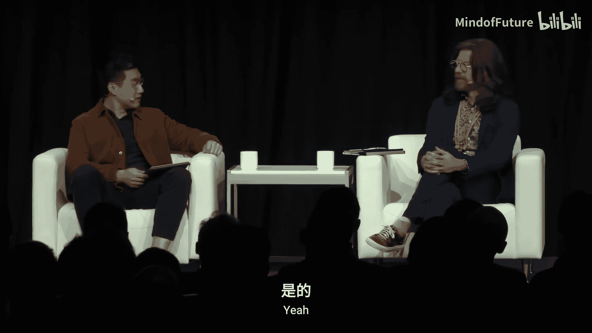

## 英伟达的AI目标

首先，我想问Bryan，你推动英伟达的AI工作已有相当长的时间。我很好奇，你如何描述你所监督的英伟达AI训练和研究项目的目标？

英伟达正在推进自己的AI计划，这让我非常兴奋，并希望它能持续发展。我认为英伟达构建自己的AI有两个重要的战略原因。

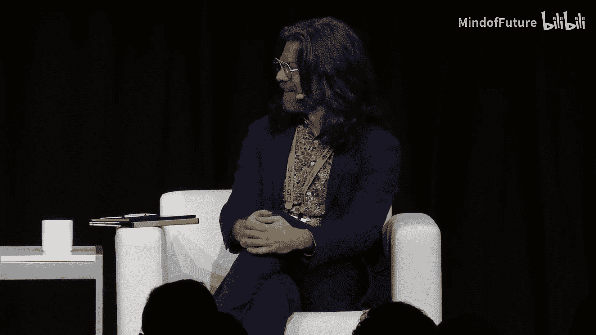

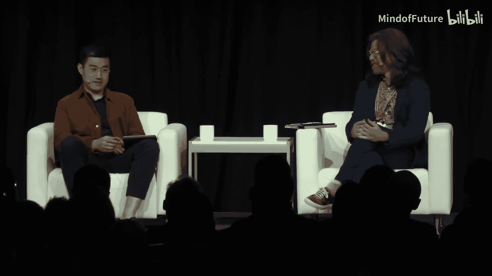

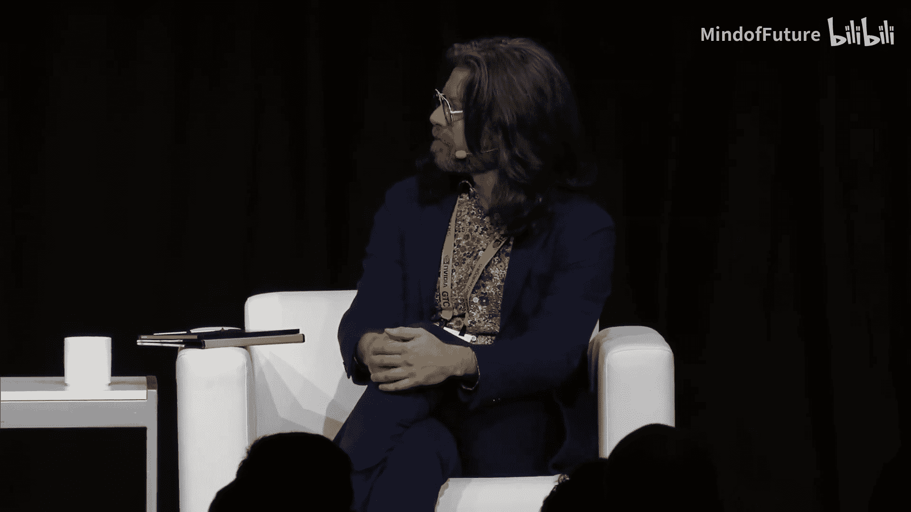

第一个原因与加速计算的本质有关。英伟达在销售AI系统时提供的价值在于**速度**。要将这种速度交付给全球正在创造AI的工程师和研究人员，需要我们非常深入地理解创造AI的过程。这涉及到网络结构、如何使用低精度算术、稀疏性、如何处理网络以及各种软件栈、编译器、库、框架、通信等诸多方面。在网络中，像Grace Hopper这样的系统以新的方式将CPU与GPU耦合。所有这些方面都有太多选择。作为一家加速计算公司，英伟达工作的核心就是做出这些选择，但这要求我们真正深入地理解正在被加速的对象。我常开玩笑说，加速计算实际上意味着对几乎所有事物进行“减速计算”。原因是，如果你只是说“我要造一台更快的电脑”，这并没有太多意义，因为所有电脑都试图更快。加速计算的不同之处在于它是**专业化**的，而“我们为哪些领域进行专业化”这个问题变得至关重要。我们构建未来系统的唯一途径就是自己构建AI，以便我们理解正在构建什么。这是第一个原因。

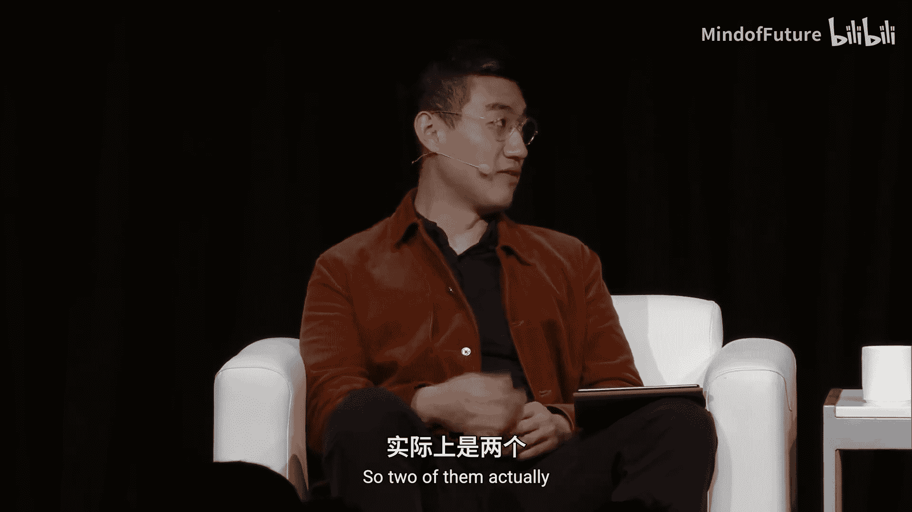

第二个原因与AI在全球发展所带来的机遇有关。我相信AI将影响世界经济的每个领域、每家公司。但它将如何做到这一点？因为构建AI需要发展许多专业技能，并且需要投入大量的计算能力、数据和资源。并非每家公司都能进行这样的投资。当我思考英伟达及其支持全球企业的业务时，英伟达能够与各行各业、无论规模大小的公司合作，无论是金融、消费品还是科技领域。我们能够帮助每家公司将技术融入其业务的核心，同时保持其独特性，并利用其独特的想法和市场地位来改变世界。我认为，在AI改变一切的时代，让AI成为英伟达平台的一部分是合理的。这就是我们开发AI的第二个原因。

## 规模化定律与AI发展

你基本上亲眼见证了近年来仅因模型规模扩大而带来的巨大收益。我很好奇，对于观众来说，很多人可能熟悉这个概念。你如何看待**规模化定律**？它们对AI意味着什么？你认为这种趋势会持续下去吗？

我在规模化AI上已经押注了20年，这是一个不错的赌注。我们是最早的GPU程序员之一。很久以前，当我在伯克利读研究生时，我就在GPU上进行机器学习，并在2008年的ICLR上发表了一篇关于使用GPU训练模型以实现规模化的论文。当时，ICLR机器学习会议上的一些人回应说：“你在这里做什么？我们在这里所做的一切都是机器学习的新数学公式，允许研究生在笔记本电脑上运行新的实验。”当时人们使用的数据集可能只有几百个数据点，维度也很小。那是一个小规模机器学习的时代，但仍然发生了许多有趣的事情。我相信，数据和计算能力的规模化将改变世界。现在回顾起来，我认为这一点已经很清楚了。但对于许多从事AI工作的人来说，这个想法——即你只需要数据和计算能力——也让人有些失望，因为我们更愿意相信我们需要的是更多概率论博士，因为这真的很有趣。但显然，我们需要两者。我热爱概率论博士，但我觉得过去几十年来推动AI向前发展的基础一直是**规模化**。我认为我们还没有看到它的尽头。

我完全同意。我经常做一个演讲，大致勾勒出深度学习的各个不同领域。2012年之前的一切，我大致将其归为“史前时期”。然后从2012年到2017年，基本上是你和你的三个最好的朋友写一篇改变世界的研究论文。但在2017年之后，在Transformer出现之后，在我们学会如何将这些架构高效地映射到硬件上之后，这个领域就真正变成了数据和规模的游戏。有时人们问我，是否应该离开去攻读博士学位，或者思考如何取得新的算法进步。我肯定认为有些人应该继续考虑这类事情。但总的来说，即使你回顾最初的AlexNet论文，人们认为那是一个真正的思想转变，但实际上更像是Alex Krizhevsky坐在角落里，研究如何将卷积神经网络高效地映射到两块GTX 580 GPU上。他非常具有开创性，他专门为他拥有的系统（有两块GPU）构建了一个神经网络，必须以一种非常奇怪的方式进行分区。系统底层的工作支撑了他得到的结果。我认为，许多重大成果都是如此。例如，当我在OpenAI时，我们做了GPT-2，当Alec Radford和我写那篇论文时，我们用了很长的篇幅来讨论所有的评估，用很短的篇幅讨论我们如何将所有任务统一为预测下一个token。但建模部分只有一段话，比如“我们使用了普通的仅解码器Transformer，配置了这些参数”，我们当时就在想，学术界会抨击我们，因为他们会说这没有新意。我一次又一次地看到这种情况发生，即人们为了在AI领域真正取得进步而需要玩的新游戏，往往会被当前的既得利益者所嘲笑。我认为我们在这个时代再次看到了这一点。

这与你们所做的一些更广泛的平台工作略有不同。但至少对我们Adept来说，我们真正相信的是，AI的下一个时代实际上将是关于**把产品做对**，以及进行产品与研究目标的正确协同设计，并让许多新的研究想法从客户那里行不通的地方涌现出来。我觉得这实际上是从我过去在OpenAI或Google Research团队思考问题的方式上的另一个转变。

## Adept公司的使命与AI智能体

是的，我们能稍微回溯一下，解释一下Adept是什么，以及它在做什么吗？

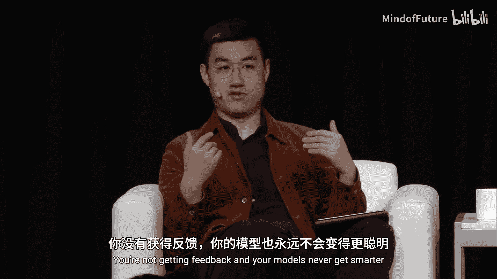

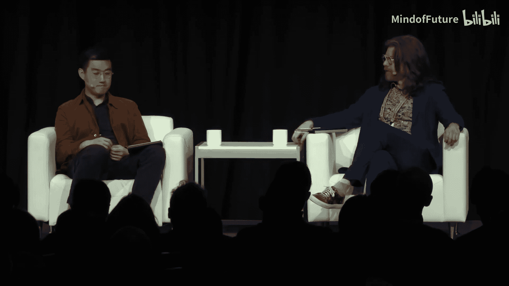

Adept是一家有趣的公司，我们的配置与大家熟知的其他初创实验室（如OpenAI、Anthropic、Mistral等）略有不同。我们所做的是，我们有一个更广泛的北极星目标，它既是产品目标也是研究目标。这个目标是：**我们能否训练一个AI智能体，让它能在计算机上完成人类能做的任何事情？** 我们如何构建不仅能读写文本或理解图像，还能利用它们来接收自然语言指令，在你工作使用的现有软件上，通过任何必要的步骤在你的机器上实现该目标的模型？例如，像“把这封出现在我邮箱里的发票录入QuickBooks”，或者“为我的团队这次特定出行找出六种不同的规划方式”，并让模型像人类一样实际操控你的机器去完成这些事情。

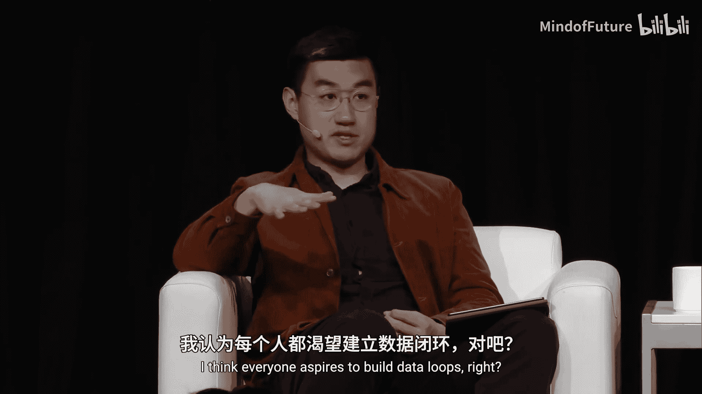

我们看到很多情况是，当企业采用这些大语言模型时，人们总是将它们用于摘要和文本生成，这些功能似乎有效。一旦这些功能在公司中开始发挥作用，他们就会想：“太好了，我如何将整个工作流程从我的团队移交给模型，以便他们得到增强？”这基本上就是我们一直试图解决的问题。为了解决工作流程问题，你需要能够解决看起来更像**智能体**的问题，这让我非常兴奋。因为如果你开始研究智能体，你突然就可以利用更广泛的强化学习文献中的所有丰富成果，以及DeepMind在2010年代中期围绕在围棋等游戏中击败人类所做的所有工作。你可以将这些成果带入LLM时代，这真的很酷。

## 人类与智能体的共存

我觉得你所阐述的是一个人类被这些模型增强的未来，这些模型的目标是帮助人们完成任务。你如何看待人类和智能体将如何共存？

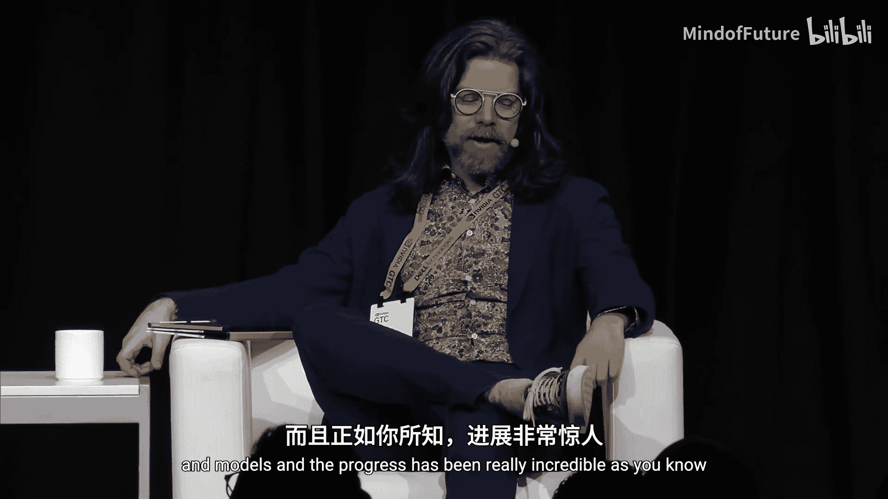

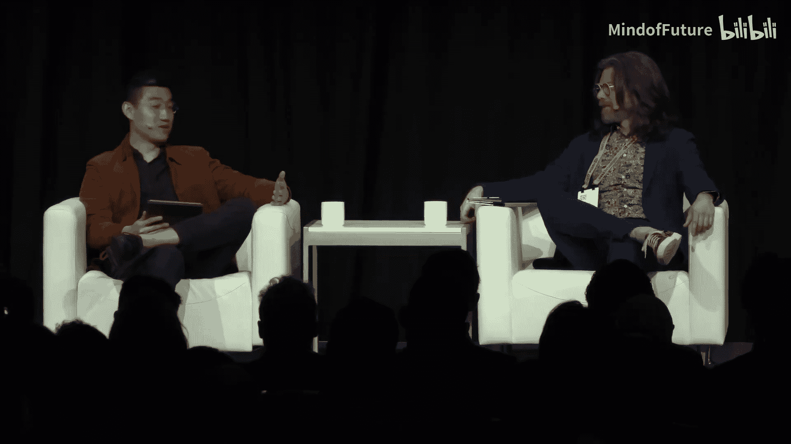

从使命的角度来看，这是我非常坚信的一个核心部分。你可以将这一领域的工作框架设定为“我如何超越人类并在任务中取代他们”，但我坚信，对我们来说，更有趣且更正确的关注路径正是Bryan所说的：**如何构建真正旨在增强人类的AI系统？** 我认为其中的界限在于，我们实现这一目标的方式是，我们有意地处理那些模型可以完成80%的任务，这样你就可以获得20%的人类监督，他们监督模型的行为。例如，我们的一家客户是一家物流公司，他们使用Adept来处理集装箱的整个生命周期。他们团队的人员登录到他们的平台，有几十个或几百个需要跟踪的集装箱，需要弄清楚它们如何清关等等，所有这些现在都是完全手工完成的。但现在他们使用Adept的方式是，Adept在后台访问所有需要了解这些集装箱位置的不同软件工具，然后为人类团队提供一个非常简单的方式来监督Adept是否在这批集装箱上做得很好。通过这样做，我们基本上改变了角色，使人类能够解决更困难的问题，比如“这个东西没有清关，我们需要去解决它”，同时也给我们的模型提供了反馈，告诉它下次如何做得更好。因此，我认为，通过将产品端与实际的人工智能研发端结合起来，构建这些**数据飞轮**和**数据循环**，可以帮助你的模型变得更好，因为仅仅在纯粹的替代世界中工作，根据定义，是一个“熄灯”的自动化过程。你得不到反馈，你的模型也永远不会变得更聪明。所以我认为这也是获得更强能力的更好方式。

## 数据挑战与私有数据的作用

当然。但我想，在这方面，一个巨大的挑战始终是，我认为每个人都渴望构建数据循环，因为随着时间的推移，随着人们继续扩展这些大型模型，他们将大量的计算能力投入到这些基础LLM中，模型变得更聪明。但仍然存在一个巨大的缺失部分，那就是**什么对你、你的公司和你的客户是特定的**。所以我们一直在讨论，如何在实际中处理隐私和私有数据等问题。我知道你对此思考了很多。我很好奇，你认为这在未来几年将如何发展？

我认为，我们现在正处在大语言模型一个时代的末期，即**易于获取的token资源即将耗尽**的时代。训练一个这样的大语言模型需要大约数万亿个文本token。事实证明，这大约是人类所写下的、至少是我们在互联网上可以获取到的所有语言（包括编程语言）的token数量。这是一个绝对惊人的数据量。我们基本上是在训练这些模型去阅读人类智力成果的全部记录输出。然后我们希望模型在阅读了所有这些之后，能记住其中一些，并能用它来推理和解决问题。这在某些方面确实有效，这有点令人惊讶，但也非常令人兴奋。你知道，有时候我早上醒来，会掐自己一下，心想：“哇，我不敢相信我们作为计算机科学家尝试做的这件疯狂的事情——找到人类写过的所有文本，然后训练一个模型——竟然真的能产生一个可以帮助人们解决问题的东西，前提是它以正确的方式进行微调和监督。”所以，过去几年，我们一直在推动这个方向，我想是从GPT-2真正开启了寻找越来越大的数据集和模型的进程。你知道，进展确实非常惊人。但就是没有更多的文本来阅读了，对吧？就是没有了。但我们知道我们的模型实际上还没有完成。现在我们的模型根本无法解决的许多问题。我很喜欢你提到的清关例子。让某物通过海关在智力上似乎并不非常困难。但实际上，你需要理解这些不同系统如何运作，这其中有很多复杂性。规则是以模糊的方式写成的，而且存在谈判，不同公司有不同的规则。所以，没有一个放之四海而皆准的程序来完成这件事。

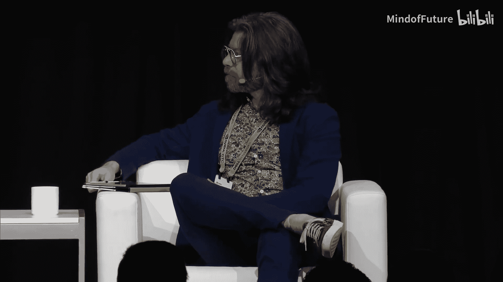

因此，对我来说，这些模型的未来更多地与用于训练模型或监督、微调模型的数据类型有关。我们需要教模型非常具体的东西，而不是“阅读整个互联网”这种一般性的东西。然后，我们将通过人类反馈强化学习或监督微调，进行一些关于相当基本的问题解决类型的反馈，这需要转向更专业化、更深入的东西。我认为很明显，数据的质量和数据的目的在未来将比过去重要得多。今天，我认为世界上最有价值的数据也是世界上受保护最严密的数据。例如，想想我个人有价值的数据，我们都有想要保护的东西，比如我的短信，我不希望它们公开，或者我的医疗记录，或者我与家人朋友的电话。然而，如果一个模型能如此详细地了解我的生活，它可能会成为我的一个非常棒的助手。所以，对我来说最有价值的token，也是保护最严密的token。我认为对企业来说也是如此。所以，我个人的信念是，每家公司都建立在一个**秘密**之上。这通常是那种你可以像黄仁勋那样在屋顶上喊30年的秘密，比如“加速计算是个好东西”，但世界并不理解。一个好的秘密的特点在于，即使你解释了它，它仍然有独特之处，你对世界有独特的思考方式，你可以解释它，但它仍然是你的。而其他人通常认为你疯了，他们不理解这怎么会重要。但我相信每家公司，不仅仅是科技公司，都有其独特之处，某种秘密，这通常是公司的核心目的、使命、市场地位、解决问题的方式，或者可能是文化上的“公司如何凝聚在一起”。这些都是极其有价值的，但它们永远不可能公开。所以，将你最秘密的数据导出，基本上是将你业务的核心暴露给一个智能体，这实际上需要大量的数据溯源和安全保障，因为这些模型从这些非常有价值的数据中学习后，会变得非常强大。但问题是，我们将如何使用它们来增强我们正在做的工作？所以对我来说，这意味着我们将进入一个**专业化程度提高**的时代，在这个时代里，实体、公司、个人将能够使用他们自己非常有价值但受到严密保护的数据，并将这些数据与这些模型结合起来，制造出实际上超级有用的智能体。

## 行为克隆与数据质量

我认为这肯定是未来的发展方向。基于我对过去几年在这个特定领域如何发展的看法，我想补充一点。我记得大概在2018年左右，我在Noe Valley的一个酒吧里，和发明了变分自编码器的Diederik Kingma聊天。他是个很酷的家伙。我们当时正在聊研究现状。他刚刚离开OpenAI去了Google Research。他说：“David，我觉得这整个行为克隆的事情还有很长的路要走，而且可能最终效果会很好。”我说：“你是什么意思？”他说：“也许通往通用智能的关键路径并不是你需要去解决整个疯狂的强化学习问题，让模拟智能体在虚拟环境中从头开始学习每一种可能的行为，包括语言。也许正确的答案是，你只需要克隆人们在生活中所做的一切，然后把所有这些行为的权重都放到一个模型里。”这正是我们现在用LLM所做的，我们只是对文本这样做；用多模态模型，我们对图像和文本这样做；或者对音频和文本，或者YouTube和文本，我们训练这些模型，只是简单地预测给定上下文，人类在类似情况下最可能做什么。所以，这能行得通真的很酷。但我认为有几个推论：首先，这些模型**只和其训练集中最聪明的数据一样聪明**。它有一些泛化能力，但在我们当前的训练目标下，任何真正的新知识发现实际上都会受到模型的惩罚，因为它与你输入的训练分布中的任何东西都不匹配。其次，这些模型最终基本上是学习如何压缩你输入的所有文本或图像等。所以，如果你有一堆糟糕的数据，模型只是在浪费很多参数来学习那种东西。

我对此有个笑话。大概五年前，我们在训练一个模型，模型发散了，我们找不到原因。结果发现，我们下载了一些网页，上面有人用ASCII艺术和表情符号画画。我们把这些token像英语token一样输入到模型中。我们的模型当时不够大，无法理解这是一种不同的语言，一种ASCII艺术的语言。所以它就崩溃了。这只是一个例子，说明当时（五年前）的模型无法同时学习如何画ASCII艺术和学习英语语言。这很有趣。我想我们都积累了这样的“战斗伤疤”，比如把愚蠢的大量数据扔给这些模型。我记得有一个GPT版本，结果发现语料库的一部分是连续好多页的佳能打印机序列号，我们没有做好过滤工作。这真的没完没了。所以，这实际上就是为什么，回到私有数据的问题上，Adept的部分目标是，我们训练这些智能体在你的计算机上工作。我们需要从尽可能聪明的人类那里学习，学习他们执行最困难任务的过程，因为如果你没有那种数据（它不是公开数据，不在互联网上），那么真的很难推动你的基础模型的能力提升。所以我认为，在这个控制计算机的智能体领域，现在有很多有趣的工作可以应用，这有助于你稍微避开一些困难，因为在通常的文本LLM领域，你并没有一个模拟器，因为你没有模拟器，你就不能做那么多有趣的工作。例如，我们花了很多时间思考的一件事是**自我对弈**：如何训练一个既能使用你的计算机，又能审视自己决策的模型，让你花计算机的后训练时间来收集关于你如何在机器上做事的新经验，并选取成功的经验进行训练，构建这样的循环。除了用私有数据解决这些专业化模型的问题之外，我真正兴奋的另一组问题是，我认为在未来一两年内，我们将在**后训练步骤**中看到AI能力的巨大提升，而不仅仅是在人们今天熟知和喜爱的预训练步骤中。

## 通用智能与专业化

是的，我确实认为后训练步骤已经被证明极其重要。如果我们只拿一个原始的语言模型，不进行监督微调、人类反馈强化学习来使其与人类偏好对齐并赋予它一些解决问题的能力，结果发现这个语言模型实际上并没有那么有帮助。所以我认为，当我们弄清楚如何制造一个总体上很聪明的东西，然后我们将其专业化以尝试做一件有帮助的事情时，我们看到了很多进展。那么问题是，你认为这些问题的解决方式主要是通过**通用智能**，还是主要通过**专业化**？或者这是一个愚蠢的二分法，我们不应该问这个问题？

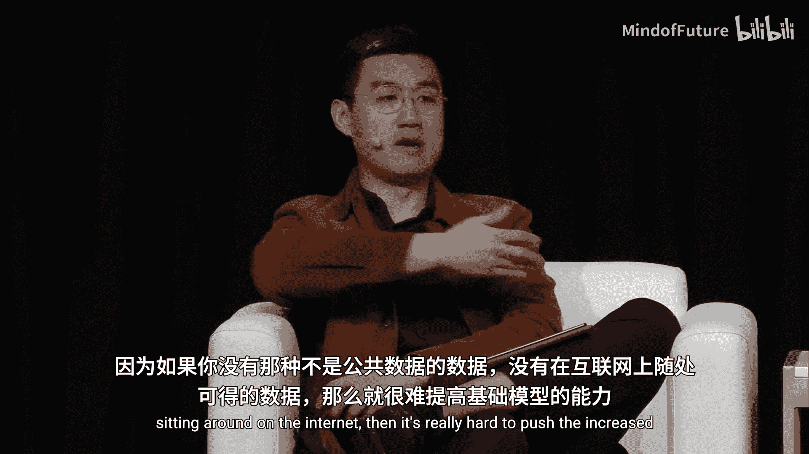

我认为这是个好问题。至少根据我的经验，原始预训练模型的质量基本上设定了你可能看到的行为和智能的上限，无论你在之后做什么。你基本上希望在预训练阶段确保你的训练分布支持你下游关心的大多数潜在行为。然后我认为之后发生的一切，实际上就像是教授专门的规则、专门的知识，比如“在时间步X，我可以做N件事中的一件，因为在训练步骤中，人们以不同的方式做了这件事”，到“在我的公司，我以这种特定方式做这件事，所以根据那种特定方式提高下一步的可能性”。我觉得这就是后训练阶段一切工作的真正作用。所以我认为未来几年，要获得最先进的能力（不一定是快速的本地能力），每个组织都需要结合以下几点：首先，能够访问少数几个真正的**前沿模型**之一，这些模型具有最高水平的智能；其次，拥有私有数据，用于教授该模型对你和你的任务来说特殊的东西。所以可能是一个组合。

我一般同意。我真正喜欢思考的一件事是智能的**多维性**。例如，我不知道你们中有多少人喜欢碧昂斯。显然，她是一位标志性的艺术家。我相信她有一种特殊的智能。这是一种非常罕见的智能，她能够理解他人和文化趋势，然后结合自己的生活经验，将其综合成一种吸引全球数亿人注意力并因此赚取大量金钱的东西。这种智能非常罕见，也很有用，至少我们人类能与之产生共鸣。我们的很多文化都是由这种超级独特形式的智能驱动的。我几乎想说，不是说我们中间有外星人，但肯定有一些人拥有特殊技能，他们是我们的偶像。我不知道碧昂斯的SAT分数是多少，我也不太感兴趣，这与她如此有趣、她的作品如此有价值的原因没有直接关系。现在，我确实认为，正如你所说，拥有更通用、更聪明的智能，确实在能力上设定了一个上限。如果你的模型不够通用，知道的不多，就很难让它在任何事情上都非常出色。所以我确实相信通用智能是有用的，我们将继续推动这个前沿。但我的信念是，因为智能是如此多维，我认为可能有80亿种不同的智能维度，因为地球上有80亿人。我相信，我几乎可以从所有人那里学到一些东西。我认为，当我们部署AI来解决世界各地的各种问题时，我们会发现，为了解决这些问题，我们将构建出如此多不同形式的智能。我认为这将非常令人兴奋。但这其中的一个含义，我认为与你在Adept所做的工作相符，那就是**取代人类实际上并不那么有趣**，因为如果你有这样一个多维且复杂的东西，制造一个突然能做所有事情的通用东西，我不认为那是我们要走的方向，因为我认为问题远比那复杂。

## 作为认知工具的AI

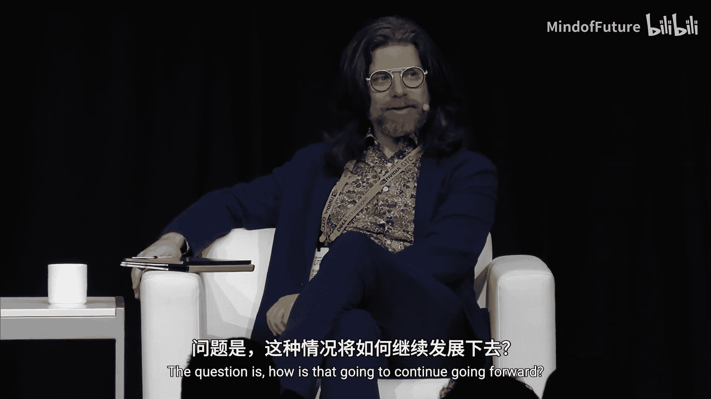

我认为要复杂得多。我的一个同事对此有一个很好的类比：构建真正擅长增强人类的AI的最佳方式，是将其更多地视为一种**认知工具**和**认知技术**，而不是一个机器人。就像我们的大脑在我们发明文字时进化了，在我们发明数学时进化了，在我们能够将大部分事实卸载到手机上、学会使用计算器时进化了一样。我认为同样的事情会发生，随着我们构建这些日益复杂的AI智能体，你将拥有另一组你实际上不需要做的事情。所以你可以用自己有限的表现能力去学习如何做别的事情，与这些变得越来越聪明的模型共同进化这种联合思考的方式。我认为这可能就是未来的发展方式。我认为大多数人还没有这样想，他们把所有时间都花在思考如何用我们今天拥有的类比来套用这个世界，就像早期触摸设备出现时那样。当你有越来越聪明的AI智能体时，你真正需要做的是重新审视那些交互原则。

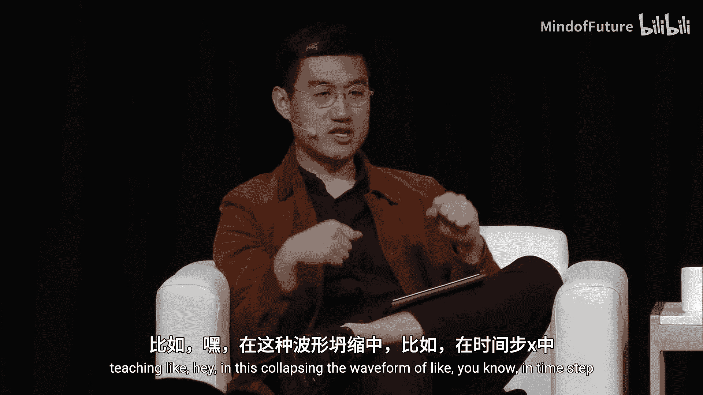

我完全同意。这实际上是我继续对英伟达所说的Omniverse或广义上的虚拟世界感到兴奋的原因之一。我认为人们将用AI解决问题的许多最有趣的方式将发生在虚拟世界中，而不是发生在今天与手机交互或今天工作的那种拟物化方式中。所以，如何构建能够弥合这一差距的智能体，我认为非常有趣。

## 未来的研究挑战

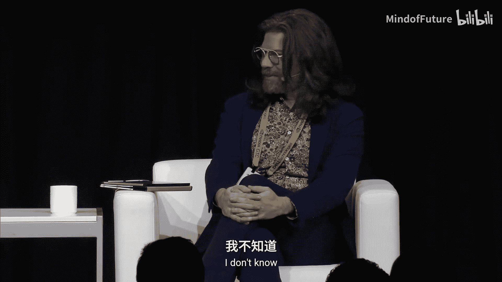

换个方向。Bryan，我很好奇你的看法。如果你看看这个更广泛的北极星目标，无论是通用AI智能体，还是我们想称之为AGI的东西，你认为还有哪些重大的开放性研究问题？那些不仅仅是“更多地扩展这些东西，投入更多数据”的问题。你认为还有什么遗留问题吗？

我认为有。从根本上说，我们今天进行推理的方式并不允许我们进行所需的那种问题解决，因为它是相当线性的。大多数时候，当这些模型实际部署时，你问它们一个问题，它们提供一个答案。但也许我有点拟人化了。回想我上学考试的时候，有些问题的答案你直接写下来就行，但其他问题的答案可能需要多思考一千倍。目前，在推理时，我们的模型很难分配计算资源，即使是自适应计算。是的，似乎我们需要这些模型能够对其生成的输出进行更多的内省。这涉及到以不同的方式分配计算资源。如果你需要花费一千倍甚至一百万倍的计算量来生成一个token而不是其他token，那么我们应该弄清楚如何做到这一点。你觉得像思维链提示之类的技巧是近似实现这一点的方法吗？我认为这是一个开始。但你知道，这些方法目前还没有广泛部署。我认为一个原因是它们太昂贵了。所以，回到我们一开始谈到的“苦涩教训”，我认为我们还没有真正看到“苦涩教训”如何应用于推理，就像应用于训练一样。大多数时候，当我们谈论“苦涩教训”时，我们谈论的是如何构建前沿模型，并向它们投入疯狂数量的训练。但我认为实际上，在部署阶段也会有类似的情况。这方面的研究，我认为还处于起步阶段。

有趣。所以当你说部署阶段的“苦涩教训”时，意思是像在推理时摆脱手工技巧，让基础模型在推理时已经学会了做正确的事情，还是别的什么？

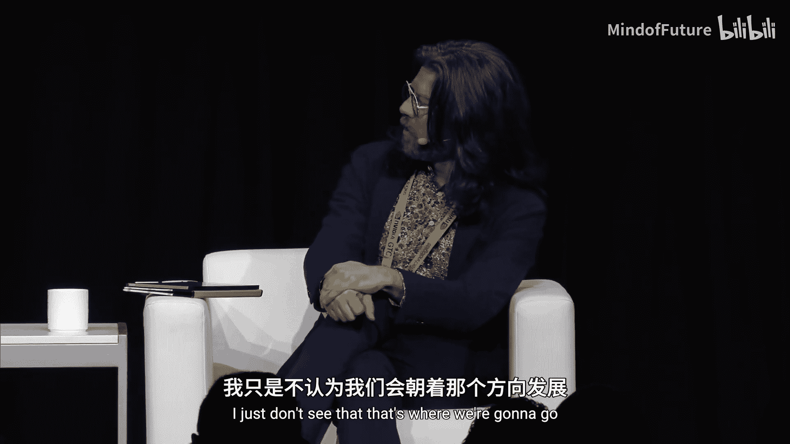

我的意思是，我认为在推理上我们能投入的计算量与我们产生的模型的智能程度之间会有某种联系。我认为这就是我所说的潜在含义。至于我们如何实际实现这一点，我认为这就是研究需要去探索的方向。现在有很多关于这类主题的论文，但我认为还没有人完全破解它。我认为我们将看到一些相当惊人的成果，来自更**计算密集型的推理**。

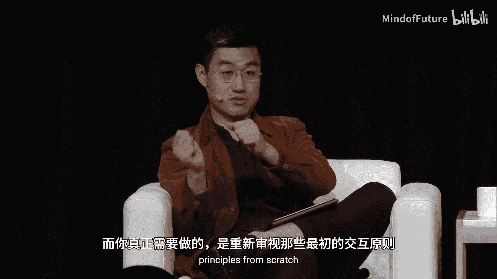

我完全同意。当我思考后训练时，你知道，一方面是如何让模型在推理时变得更聪明。但另一方面，在你完成预训练之后，如何利用你刚刚创建的成果在实际部署之前改进模型本身。我认为第二类工作将是巨大的。我觉得这不一定是强化学习，而是将这些在预训练阶段磨练出许多本能的基础模型，与你实际试图解决的任务的奖励信号理解结合起来，然后能够花费计算资源来提高该特定奖励信号的数值。我们在像人类反馈强化学习这样的事情上看到了早期迹象。但这就像我们只是触及了这条特定路径上可能的研究范围和成果的表面。我认为在未来一两年内，我们将看到——实际上已经在论文中看到——当你能将强化学习和/或搜索与这些基础模型在各种不同环境中结合时，会出现真正的**不连续增益**。即使在你的计算机上的智能体领域内思考，这是一个例子，还有围绕通用机器人基础模型的所有兴奋点，这是另一个很好的例子，说明我们现在正在为那个领域进行预训练阶段。但之后有一个非常明显的第二步，在你完成预训练之后，使这些模型成为各种机器人任务的出色控制器和规划器。我认为那会非常酷。

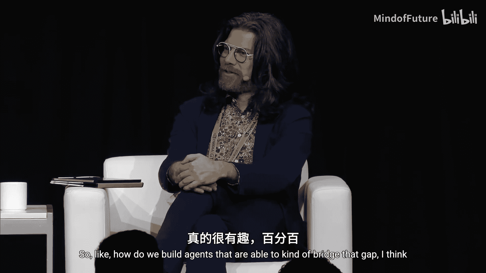

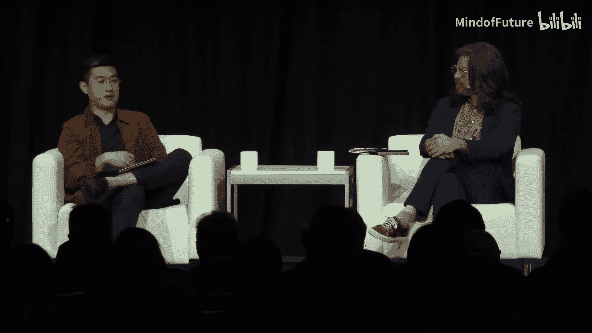

## 自我提升的循环

是的，我完全同意。我觉得这里有一种**自举**正在发生。你知道，这是我们正在经历的一个经典的技术发展周期。多年来，摩尔定律是由半导体驱动的。所以你需要有更好的半导体来制造机器，以构建下一代半导体。我认为我们在AI中看到了这一点，即用我们的基础模型来理解我们的数据、合成新的数据集、训练更聪明的下一代基础模型，这是我最兴奋的事情之一。因为我确实认为有一个循环正在发生。

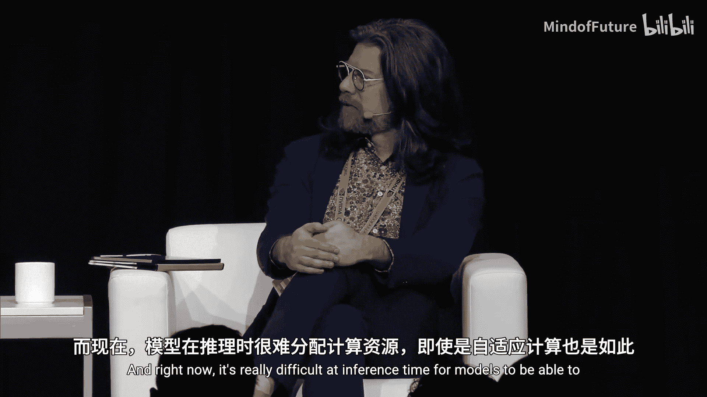

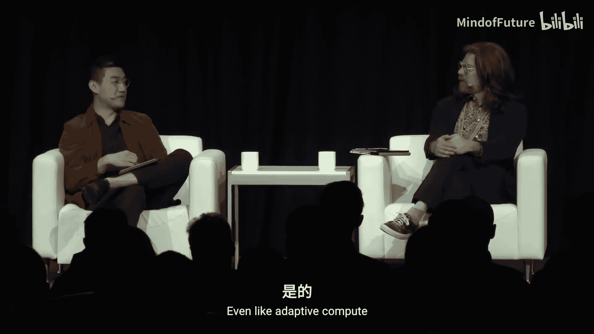

当然。我想我们可能通过使用模型作为数据过滤器或增强器之类的东西，看到了早期的阶段。非常酷。

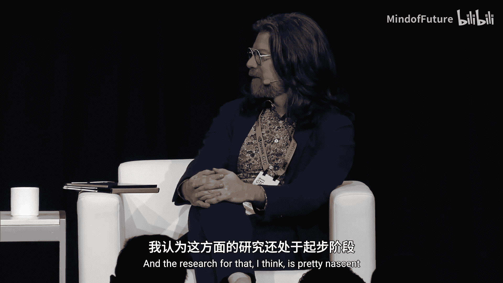

## 未被广泛关注的兴奋点

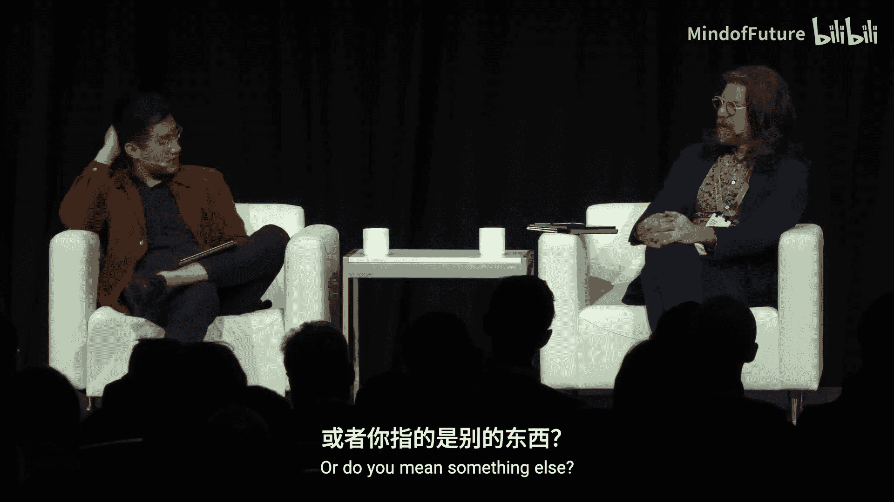

好的，我们时间不多了。我想也许再问一个问题。有什么让你兴奋但你认为其他人还没有兴奋起来的事情吗？

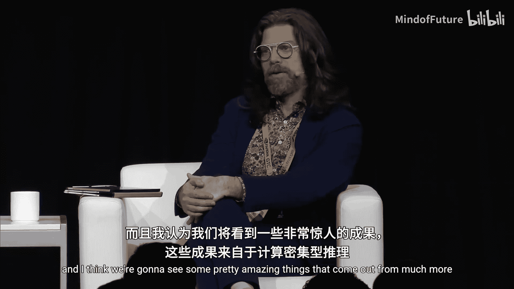

这是个好问题。让我想想。嗯，我想我提到了一点关于多模态基础建模的事情。我认为现在如此多的精力和努力都投入到了多模态基础建模中，这是应该的。因为很明显，多模态模型已经基本上成为默认的模型家族。我想过一段时间，人们会一直把所有东西都放进去。很快我们会加入音频，很快会加入视频，很快，就像所有其他东西一样，所有的token，所有的token都放进一个特定的模型里。我认为行为轨迹也会被加入进去。然后你就有了这个基础的东西，它可以自己决定如何分配其容量来学习建模所有这些事物。这一切都很棒。我对此感到非常非常兴奋。但我认为这实际上将是未来几年大部分新进展的来源。但也有一些我非常兴奋的**特定领域**的事情，尽管我不从事这些工作。我们刚刚谈到了机器人。我在Google资助的一个项目是由我的朋友No领导的，他们在阿姆斯特丹的欧洲团队。他们所做的是训练一个模型，基本上在天气预报方面超越了最好的科学模拟器。他们所做的只是将整个地球划分为这些小单元，每个单元由几个数字表示，比如当前的降水水平、湿度、温度等所有不同的东西。然后他们将其视为一个张量，只需要预测下一个时间步的张量。让我们忘记任何物理建模。事实证明，如果你这样做，你现在就有了一个这些变量的通用地球模型，它实际上在某种程度上超越了物理模拟器。这太酷了。还有许多其他领域，你可以直接说：“嘿，我有这个无限灵活的输入输出引擎。让我直接建模看看会发生什么。”但我很好奇你的想法。

太棒了。我想再次为虚拟世界和Omniverse打个广告。我认为我们将发现，一些最有趣的体验将来自人们与AI的互动。我最好奇的问题之一是：**AI将如何改变我们的文化？** 我认为它将创造一种新的媒体形式。就像电子游戏与电影不同一样，AI也将与电子游戏不同。它将更有用、更深刻、更有趣、更吸引人、更有帮助。我认为这将在虚拟世界中发生。我认为虚拟世界将使AI变得更聪明，使AI更能理解我们面临的问题。然后我们将在虚拟世界中与AI一起合作解决问题。对我来说，这是对过去20年来我一直在英伟达和其他地方观察到的许多研究的一种综合。我真的很兴奋它将走向何方。

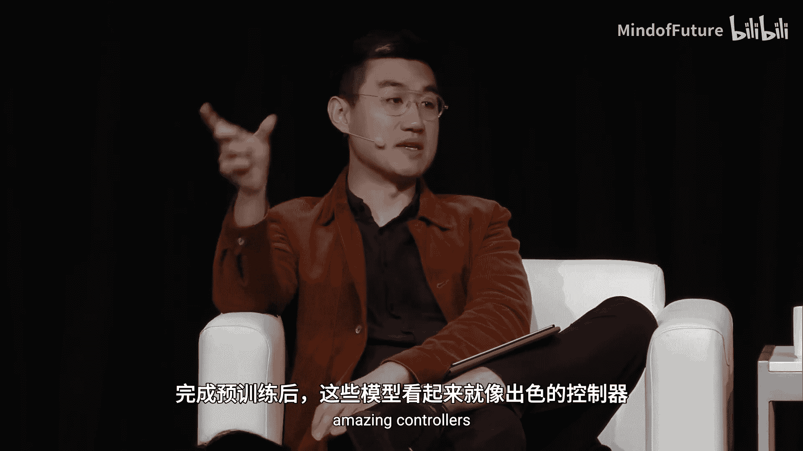

## 文化影响与总结

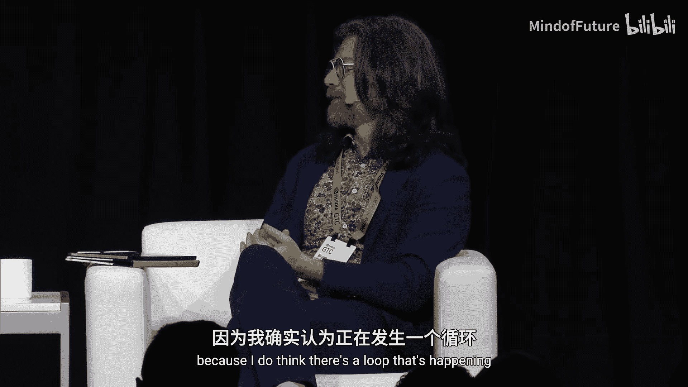

我真的很喜欢“AI将如何影响文化”这个框架。因为对我来说，这也是迄今为止最重要的事情之一。我觉得你正在研究的东西，在它开始影响文化之前，还没有真正达到真正的效用。我们已经开始看到这方面的早期迹象。但这是我喜欢Bryan的一点，你是一个非常全面的人。我们在台上谈论AI，但当我们不这样做时，我们会谈论各种各样不同的事情。这种博雅教育的方式真的很酷。

谢谢。我觉得做人挺好的。

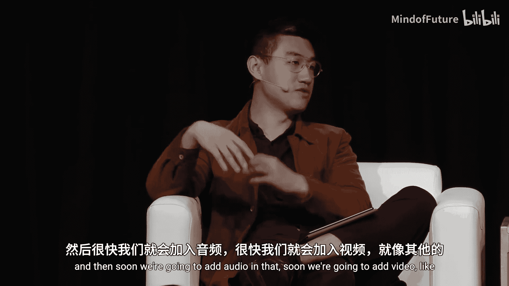

## 问答环节

我们还有几分钟时间提问。我想过道两边都有麦克风。

**提问者1：** 关于英伟达的最佳AI软件合作伙伴，你认为会是谁？

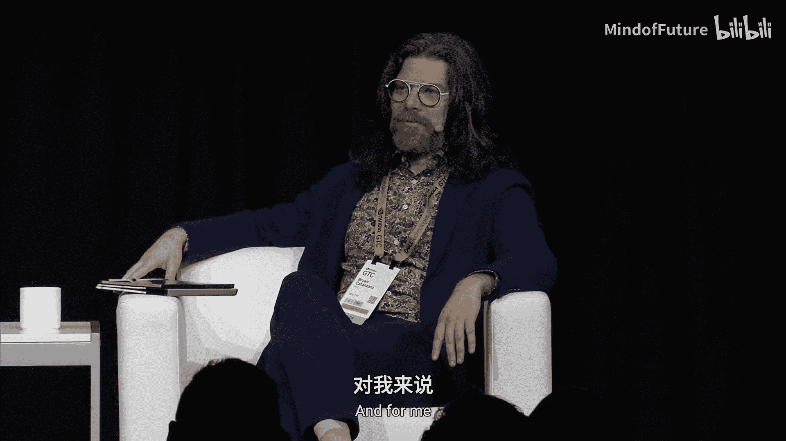

我认为英伟达与全球每一个软件实体合作。我们与所有公司合作。所以答案是，他们都会成功，我们都会支持他们。我也有私心。英伟达工作的巨大乐趣之一就是我们支持许多拥有不同观点的公司。这样，随着AI的繁荣，我们也能随之发展。所以我认为英伟达不想选择任何一家作为我们最重要的软件合作伙伴。但我们确实喜欢与他们合作。

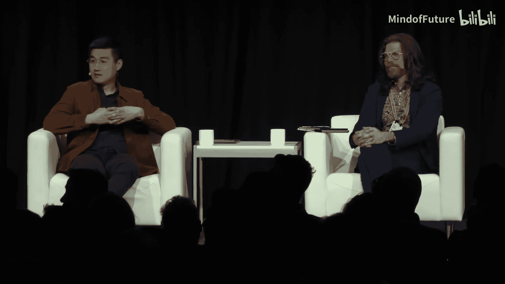

**提问者2：** 关于规模化定律，你提到过去几十年你一直成功押注于此。人脑估计有数百亿个突触。根据你过去20年的信念，你如何看待未来十年的规模化定律？数百亿个突触是否是这些模型最终可能达到的上限？模型过拟合的风险是什么？

我觉得整个参数数量的事情有点像相机的“像素大战”。我有1500万像素，但我有个烂镜头，我仍然是个烂相机。我认为最终一个更好的代理指标实际上是你通过模型推动的**浮点运算次数**。我认为在短期内，这是一个更好的衡量标准。但就像你知道的，每一个规模化定律最终都是S曲线。问题是我们处于S曲线的哪个位置。但我认为，不仅预训练的S曲线还有很长的路要走，我们甚至还没有真正开始我们之前粗略谈到的**后训练S曲线**。它正在等待权重接管，在未来一段时间内带来另一波巨大的进步。所以我个人相当乐观，我们将在未来10年继续看到由于计算和新想法带来的可预测的进步。

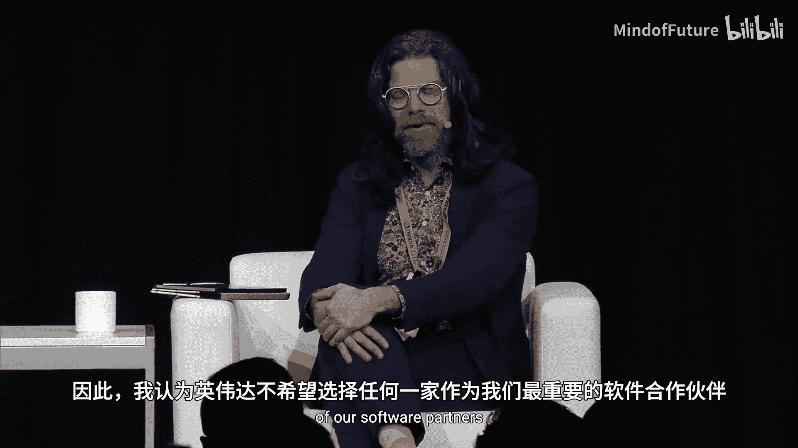

是的，我还想说，我们仍然不了解人脑的许多工作原理。它非常复杂，将其简化为一个数字可能过于简化了。我认为人脑结构中内置了很多专业化，这意味着我们不必像我们的模型那样学习，我们的模型是从随机数开始的，而我们每个人开始时大脑结构中就内置了更多的知识。我认为这很难量化和理解。我们用AI构建的东西是相当不同的，所以我不喜欢比较这些数字，因为我认为最终它并不能告诉我们太多。

**提问者3：** 关于未来的大赌注。你之前的大赌注是速度和架构更新。你未来10年的下一个大赌注是什么？例如，我最近对神经符号架构、世界模型等感兴趣。有什么是我可以大量买入的？

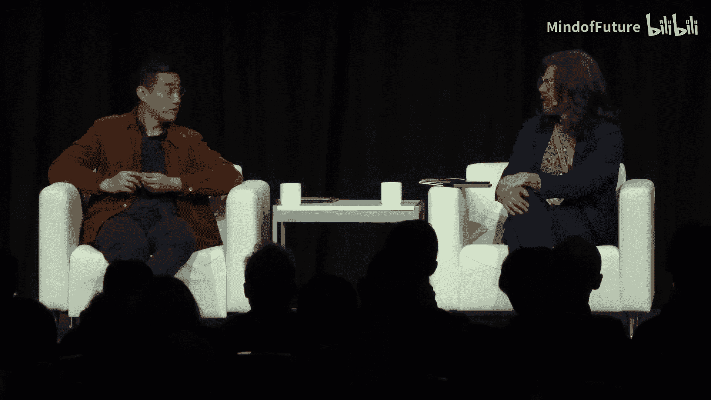

我热爱世界模型。我认为我们正在看到惊人的进步。我之前谈到虚拟世界就是因为这个。我还想大力推广**各种形式的稀疏性**。我认为我们差不多已经玩透了低精度算术，我们已经把它压缩得相当厉害了，快没比特可用了。所以，拥有少于1比特的方法就是走向稀疏。所以我认为我们会发现我们确实想走向稀疏。我们想要更多的结构。就像我之前谈到人脑时说的，我认为有很多知识是内置于结构中的。它不是一个全连接网络。那么，我们如何学会将稀疏性构建到我们的网络中，使它们能显著提高计算效率，从而增加每浮点运算的智能？我认为这将是我们的一大前沿。

我也支持世界模型。我认为如果你正确地构建预训练框架，世界模型基本上会免费出现。另一个是在架构方面，就是**任何能更好地映射到硬件的东西**。我认为这很大程度上是由硬件周期驱动的。你可以有一个非常聪明的架构，但如果它运行效率不高，你将永远无法像那些做更普通但能映射到硬件的事情的人那样扩展它。

又是“苦涩教训”。是的。

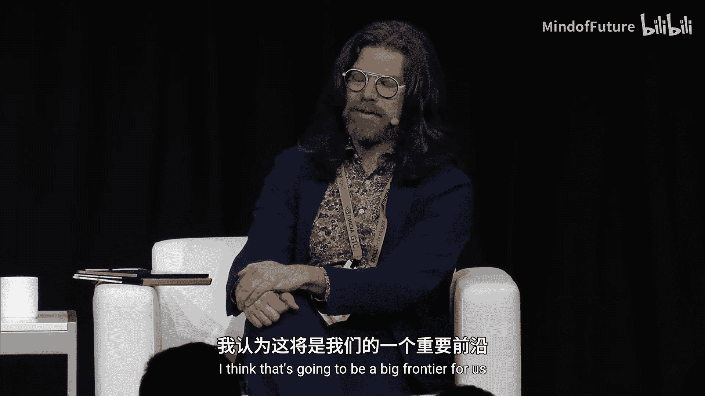

**提问者4：** 关于预训练数据集和质量。你谈到预训练数据集的质量对于知识非常重要，如果有大量噪声，可能会导致整个模型发散。但我们当前的方法已经非常嘈杂，比如“在下一个路口左转、右转或直行”。如果我们当前的下一个token预测预测了“左转”，但实际上是“右转”，它受到的惩罚和预测“香蕉”这样完全随机的东西一样大。你认为我们当前的下一个token预测能够实现AGI的下一阶段吗？还是你认为我们必须采用不同类型的优化？如果是，是什么类型？

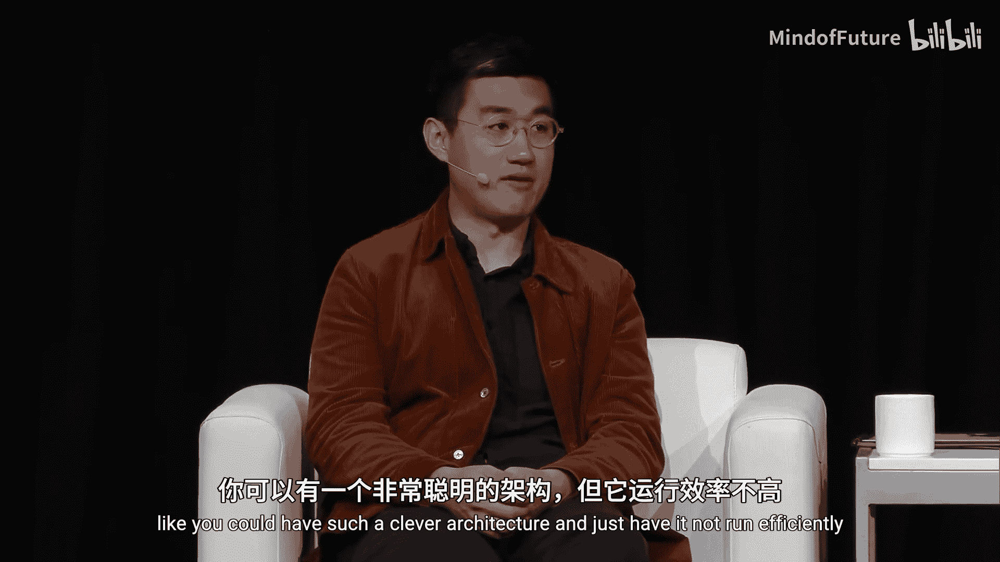

首先，就像David刚才说的，胜利的东西是那些易于扩展、你可以投入大量计算的东西，下一个词预测具有这个特性，这就是为什么我认为它如此成功。所以任何出现在下一个词预测之后的东西，我认为都会共享这个特性。但我想说的第二点是，很难知道在下一个词预测之后我们应该做什么，因为这些更智能的、更符号化的方法，比如在特定情况下惩罚模型，往往会遇到过去70年来AI其他方法遇到的同样问题：案例数量太庞大了，我们无法枚举。当我们尝试时，我们最终会搞砸。所以模型实际上学不到正确的东西。这就是下一个词预测的一个优势：我们无法用我们的聪明才智搞砸它。但我想说的关于下一个词预测的第三点是，将人工智能简化为损失函数等是很诱人的。但我们也可以从生物学上这样做，然后说：“智能来自氨基酸和脂质，这合理吗？”你知道，元素可以很简单，而这些元素的阐述可以非常复杂。所以，我并不真的觉得下一个词预测的简单性比生物化学的简单性更不合格。

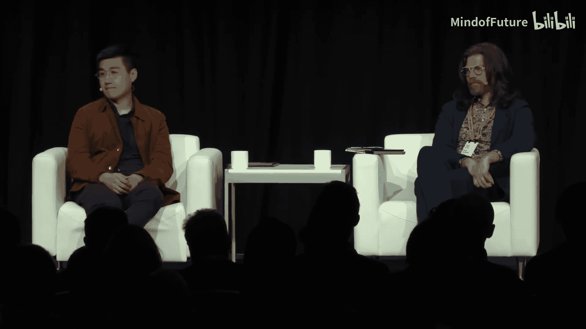

这是个很好的类比。我还想说，有时我听到人们思考架构如何工作，比如“架构X能做Y吗？”或者“训练决策X能做Y吗？”答案总是：只要你没搞砸，答案总是“是的”，只是需要多少计算量而已。所以，当我们评估一个想法是否好时，我们会看这个新想法是否改变了规模化定律的斜率或截距。通常答案从来不是“好吧，只有你尝试某个特定的架构想法时才会出现某种不连续性”。所以我认为，因此，我认为许多这些事情都有创新的空间。但我认为它们并不是严格必要的，实际上，即使是为了让我们达到下一个智能水平。

**提问者5：** 关于合成数据。随着文本资源耗尽，很多人跳上了合成数据这个热门词汇。我认为这既是机遇也是潜在的陷阱。从我在教育、心理测量学和神经科学背景的工作中，我知道你可能会陷入一种诡辩循环，创造出非常人工、无根基的系统，你得到了很好的结果，但就智能和问题解决而言，它们实际上没有任何意义。请谈谈这方面的机遇和危险。

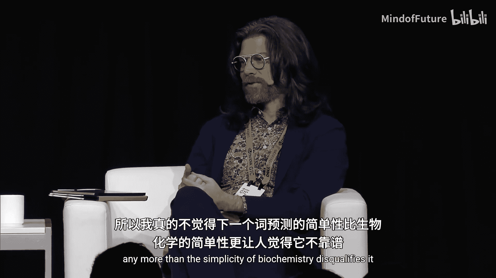

我觉得合成数据作为增强手段超级有用，但它是个拐杖，因为归根结底，合成数据生成器的底层复杂性通常（至少根据我的经验，也许有我未知的东西）在某种程度上受限于模型容量。你最终基本上是在建模生成器，然后你就到头了。所以拐杖用完了。我很好奇你的想法。

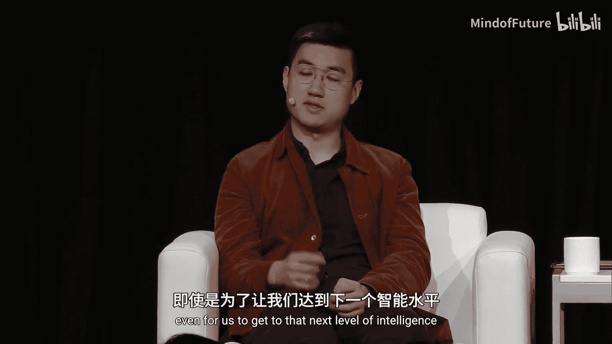

哦，当然。这很有趣。在图形学中，我们一直在做自底向上的事情，比如建模每一片草叶、每一个光源和每一个光子，然后让它们反弹。我们在那里已经遇到了极限。我认为图形学的未来必须是世界模型，因为我们已经用尽了枚举其他一切的方法。我认为合成数据是类似的东西，就像你说的，建模生成器最终变成了同样的问题。所以，我非常相信合成数据，我们也使用它。它很重要。然而，我不认为它……就它是一个陷阱而言，我认为我们都意识到了，并努力确保不掉进去。

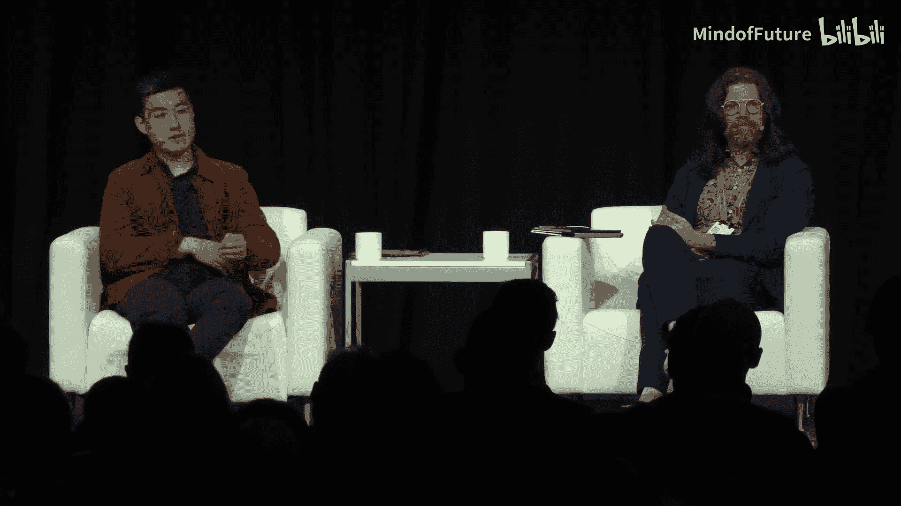

---

**总结**

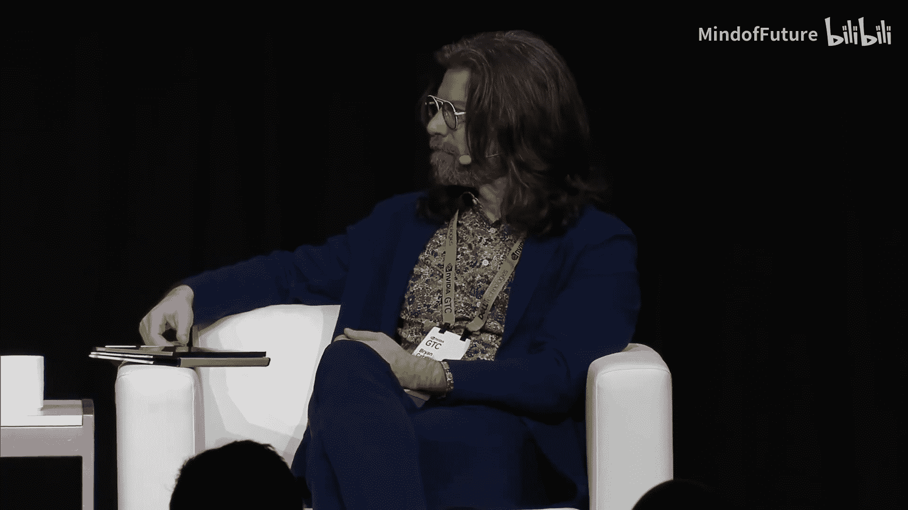

在本节课中，我们一起学习了David Luan和Bryan Catanzaro关于AI未来与通往AGI之路的深刻见解。我们探讨了英伟达构建自身AI的战略原因、规模化定律的持续影响、Adept公司致力于构建增强人类的AI智能体的使命，以及数据（尤其是私有数据）在未来AI发展中的关键作用。我们还讨论了通用智能与专业化的关系、AI作为认知工具的角色、未来研究在推理计算和世界模型等方向的挑战，以及AI对文化可能产生的深远影响。最后，通过问答环节，我们触及了合作伙伴、脑类比、未来赌注、训练目标优化和合成数据等具体问题。整体而言，对话描绘了一个AI通过增强人类、与人类协同进化，并在专业化与通用性结合中持续发展的未来图景。