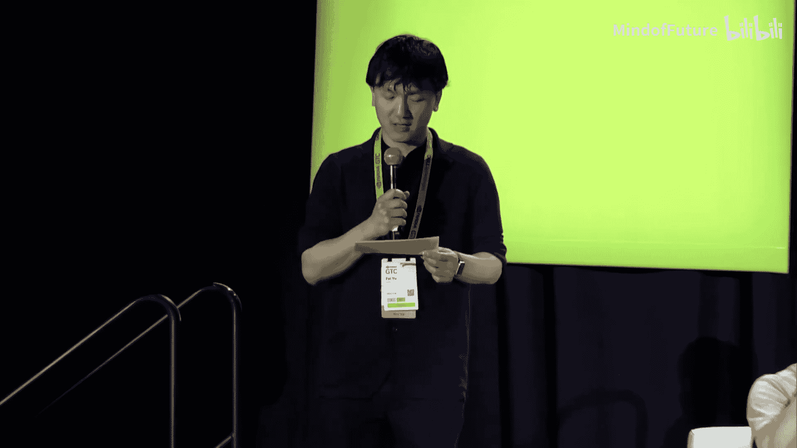

# 007：Kaggle大师与专家的见解

在本节课中，我们将学习来自Kaggle大师和专家们关于竞争性人工智能和大语言模型前沿的深刻见解。我们将探讨大语言模型的工作原理、应用场景，以及如何将最新的AI技术应用于解决实际问题。

---

大家好，我是主持人Fae。今天的会议主题是“来自Kaggle大师和专家关于竞争性AI和LLM前沿的见解”。请确保您参加的是正确的会议。会议最后将设有问答环节，欢迎您通过NVIDIA应用程序提交问题，或在现场麦克风处提问。

现在，让我们直接进入主题，有请演讲嘉宾。

感谢Fae。大家好，我是David Austin，一位Kaggle大师，目前在NVIDIA工作。我很幸运能在NVIDIA花一部分时间研究AI竞赛，并学习许多新技术和方法。今天，我们将与大家分享其中的很多内容。我们喜欢做的一件事是将所学知识应用到竞赛中，或者将研究成果应用到实际领域。今天我们将讨论围绕LLM、视觉、生成式AI和竞争性AI的许多不同主题，但今天的重点将是如何将当今世界上发生的这些酷炫技术应用到实际问题中。我们会在最后留出提问时间，如果您有我们未涉及的问题，请随时提问。下午两点还有一个“与专家会面”的环节，您可以与我们一对一交流。总之，今天您总有机会得到问题的解答。

首先，我想介绍一下我的同事们，让我们从Geway开始。

大家好，我是Du A Liu，来自大语言模型技术团队的数据科学家和软件开发人员。我主要研究代码生成和检索增强生成。我也是Kaggle大师。在接触所有LLM相关技术之前，我参与了很多竞赛。我现在也在研究RAPIDS，这是一个GPU加速的数据科学框架。很高兴认识大家。

接下来是Chris。

大家好，我是Chris Diat，NVIDIA的高级数据科学家。我拥有数学博士学位，专攻计算科学。我热爱数据科学竞赛，目前是Kaggle四重大师。

接下来是Laura。

大家好，我是Laura Eltehe，NVIDIA的研究经理。在此之前，我是德国慕尼黑工业大学的教授。我的研究小组对感知、动态和理解感兴趣。今天我将主要讨论LLM及其与视觉系统的交互。

最后是Kaazuki。

大家好，我是Kaazuki，也是一位Kaggle大师。我四年前加入这个团队。我的专长是推荐系统。

感谢Kaazuki，也感谢你从日本赶来参加这次演讲。

那么，让我们开始吧。本次大会上最热门的话题，也是我们在竞赛领域看到正在快速发展的，就是围绕LLM，特别是大型生成模型。Geway，也许你可以先为我们介绍一下这些生成模型，它们如何工作、如何训练以及我们如何使用它们。

当然。训练像GPT这样的大语言模型是一项计算密集型任务，它是一个多阶段的过程。第一阶段是预训练基础语言模型。基本上，我们从互联网收集海量文本数据，训练模型模仿人类语言，学习如何完成文档。

第二步是我们所说的监督微调。基本上，我们希望为特定用例（如聊天机器人、问答、创意或专业写作、编码）创建规模较小但高质量的数据，通常由人工标注。当我们有了这些较小的高质量数据后，我们应用相同的语言建模目标来持续训练模型。

第三步称为RLHF（基于人类反馈的强化学习）或DPO（直接偏好优化）。目标基本上与第二步相同，但它是基于更廉价、更容易的数据，例如用户反馈的偏好。这通常是一个二元信号，告诉我们聊天机器人生成的两个答案中，哪一个更有帮助、更有用或更好。这种偏好为我们提供了反馈，我们可以据此继续训练模型。

最后，我们可以为模型应用护栏，以防止其生成任何有毒或有害的信息。是的，这就是我们训练GPT的方式。

这其中涉及很多内容，我们能用它们做很多事情。我们看到如今在竞赛中它们被大量使用。但就在不久前，还有另一类模型可能是最普遍使用的，我不知道有谁比Chris在竞赛中更频繁地使用它们，那就是像BERT这样的编码器模型，我们需要额外的上下文。Chris，你能给我们讲讲BERT，以及它与我们今天使用的一些LLM相比如何吗？

当然。市面上有很多语言模型，甚至比聊天机器人模型还多，这确实让人困惑。它们基本上可以分为三类。有像GPT这样的模型，代表生成式预训练变换器。有像BERT这样的模型，代表双向编码表示变换器。还有像T5这样完整架构的变换器模型。

这些组之间的第一个主要区别在于它们如何预训练。在你针对特定任务微调模型之前，它已经在数十亿文本上进行了预训练，以获得对语言的通用理解。BERT的预训练方式是展示大量文本，然后随机隐藏一些单词，BERT需要使用隐藏单词前后的单词来尝试猜测隐藏的单词是什么。这是一个自动编码任务。因此，BERT非常擅长理解词汇、结构和语义。

而像GPT这样的模型，在预训练期间，它们看到大量文本，需要预测下一个单词。因此，它们非常擅长语言的流畅性和预测接下来会出现什么。

除了预训练的差异，架构上也有不同。一个完整的变换器有一个编码器和一个解码器，这是第三类模型，如T5。而BERT只是一个编码器。你输入文本，它经过一系列自注意力层，输出一个称为嵌入的数学向量。这个嵌入代表了文本。

GPT只是一个解码器。你输入一个嵌入，经过一系列层后，输出文本。

所以你可以看到有很多不同的LLM，有很多不同的差异。因此，它们各自擅长不同的任务。

确实，根据应用的不同，总是会有对编码器或解码器类型模型的不同需求。Kaazuki，你能谈谈在哪些应用中你会使用编码器模型，哪些会使用解码器模型吗？

说到BERT，有一些Kaggle竞赛使用了它。其中一个竞赛的目标是评估学生的摘要，另一个竞赛的目标是评估段落的复杂性。我认为这些都是BERT用例的好例子，因为BERT非常擅长分类任务。

与BERT不同，GPT用于生成句子，就像聊天机器人一样。对我来说，我用GPT来生成简单的代码。当我要求“给我展示一个PyTorch DDP的例子”时，GPT会返回示例。我经常听到人们说，没有GPT他们就不想写代码了。

所以我认为BERT和GPT非常不同。

是的，当然两者都有应用。很酷的一点是，这不仅仅局限于LLM和NLP领域。我的背景是视觉领域，我看到在视觉领域应用这些LLM时发生了一些非常酷的事情。Laura，你能谈谈你在视觉领域看到了什么吗？在使用语言模型方面，你看到了哪些趋势？

当然，LLM对视觉领域产生了巨大影响，特别是在我们与视觉系统交互的方式上。在LLM大放异彩之前，我们甚至没有考虑过使用自然语言与视觉系统交互。这首先是由CLIP实现的，它是最早提出将文本模态与图像模态对齐的算法之一。就像Chris之前解释的如何从文本获得嵌入，CLIP的想法是从图像获得嵌入，并将这两者放在同一个嵌入空间中。如果它们代表相同的对象，例如，你有文本“狗”和一张狗的图片，你希望将这两个嵌入放得更近。

那么，如何训练这样的系统呢？你需要一堆带有相应标题的图片，这些标题能解释图片的内容。然后你训练系统对齐这些嵌入。

现在很酷的是，你可以从一个模态转换到另一个模态，并可以做很多很棒的事情。你可以用自然语言与你的视觉系统对话，这确实让我们能够更广泛地思考如何将视觉系统应用到更多领域，例如，超越我们正在检测和分割的汽车和行人，真正从自然语言的角度进行大规模思考。所以我认为，随着LLM的出现，视角真的改变了。

将不同模态的嵌入带入一个共同的嵌入空间，这个想法开辟了许多可能性，非常强大。你看到了哪些由此开启的新能力？

对我们来说，如前所述，我们对感知感兴趣。LLM使我们能够进行我们现在所说的开放世界场景理解。以语义分割任务为例，以前我们做的是抓取一定数量的我们感兴趣的类别。如果你对自动驾驶汽车感兴趣，你想检测和分割行人、汽车、道路等，所以有一个固定的类别集合。我们训练系统对图像进行分割并分配标签，但标签是固定的。如今，随着LLM的出现，视角改变了。以前的问题是，如何将这样的系统扩展到世界上无限数量的物体？没有明确的路径。现在有了LLM，我们实际上看到了一条前进的道路。想法是，你实际上使用提示词，用你的自然语言来表达你想在图像中找到什么，视觉系统需要分割任何你提示的东西，比如消防栓、狗、牛等等，而不仅仅是一组预定义的类别。

所以我认为这是一种进行开放世界语义分割或场景理解的方式，与我们以前做的完全不同。

当然，LLM也改变了我们进行生成式AI的方式。现在我们有了像DALL-E或Midjourney这样的工具，它们利用了我之前提到的CLIP的对齐能力。例如，DALL-E获取这些文本嵌入，并使用扩散模型生成代表你文本描述的图像。你可能见过这些演示，你写下“一只在时代广场玩滑板的北极熊”，然后你得到一张完美生成的图像。所以我认为这为设计师、艺术家以及公众与视觉系统互动开辟了无限可能，因为现在一切都是通过自然语言进行的。我认为这开启了巨大的可能性。

对于我们这些从事竞赛工作的人来说，我们总是在寻找下一个新事物，以及我们能获得的下一个优势。你谈到的一些能力确实令人兴奋。你认为接下来会是什么？在视觉和LLM方面，我们正在谈论的下一个前沿是什么？

我们才刚刚开始探索文本和图像，但还有很多其他模态。在不走太远的情况下，我们有视频。我们现在看到了像Sora这样的东西，它可以从文本生成视频，但还有很多需要探索。例如，这些视频的时间连贯性问题，或者用于训练这些模型的标题问题，因为这与CLIP的想法相同，你想将视频与解释视频内容的标题对齐，但问题是这些标题是否只解释了视频中的物体，还是也描述了运动和动作。

所以我认为这是一个全新的研究领域，需要探索我们使用什么样的标题来训练这些系统，以及我们的视频将如何具有时间连贯性。我认为这个领域现在会出现很多工作。然后还有整个3D世界。我们有其他感官，例如激光雷达，我们也希望将几何特征与语言、图像对齐。所以我认为在不同的模态中确实有很多可以探索的。例如，我们一直在研究激光雷达，尝试使用几何特征、形状特征在激光雷达空间中提示物体。我认为这将非常令人兴奋，因为现在我们将能够使用文本提示生成完整的3D物体。我认为在未来几年里，将会有海量的新事物出现。

是的，确实令人兴奋。开始将其带入竞赛领域一点。不久前，让我们惊叹的东西还是像检索器这样的东西，你可以检索图像或检索文本并获得共性。但现在有了生成式AI，我们已经能够远远超越这一点，实际上我们可以将这两个概念结合起来。现在有一个叫做RAG的东西，每个人都在谈论RAG。Chris，你能稍微解释一下RAG吗？告诉我们什么是RAG以及如何使用它。

好的，RAG是一种非常酷的技术，它扩展了LLM的能力。它代表检索增强生成。

如果你问一个基本的聊天机器人一个问题，它会根据其记忆，即它已经知道的东西来回答。

当你使用RAG时，你有一个LLM和一组文档。然后你提出一个问题。第一步是，我们在所有文档中搜索与问题相关的文本块，然后我们将问题和所有这些有帮助的文本块一起提供给LLM。LLM查看所有内容，然后给出答案。这一切都在不知不觉中发生。因此，返回的答案要准确得多。

我有机会在最近一个名为“LLM科学考试”的Kaggle竞赛中体验了这一点。我们的挑战是构建一个能够回答多项选择科学考试问题的系统，但我们受到限制：语言模型的大小有限，还有时间和资源限制。因此，我们不能提交像ChatGPT那样大的模型，因为它可能已经在其记忆中拥有很多知识。我们必须提交较小的模型。

赢得这次比赛的解决方案就是RAG。具体来说，人们提交模型的同时，还提交了一组文档。具体来说，他们提交了所有六百万篇维基百科文章。然后，他们的代码在准备回答科学考试问题时，会首先扫描所有六百万篇文章，在眨眼之间找到任何与问题相关的文本，然后将这些有帮助的信息连同问题一起提供给LLM，LLM会返回答案。

我亲眼目睹了这一点，因为在我的电脑上，我会故意提出具有挑战性的问题。我会提出关于量子物理的特定细节或数字的问题，并认为它不可能找到。但果然，在眨眼之间，它就会带着答案回来。准确率大约是97%或98%。所以RAG系统能做的事情确实令人难以置信。

最令人印象深刻的是，这一切都发生在幕后。你只是问一个问题，答案就回来了。它进行检索和所有这类事情，都发生在眨眼之间。真的很神奇。

对于那些可能想了解更多或想看看实际操作的人，Chris发布了一些非常棒的笔记，在几个月前的Kaggle竞赛中是投票最高的笔记之一。你可以去查看那些笔记，看看他是如何训练RAG的，如何用RAG进行推理。确实是非常好的内容。

Kaazuki，Chris在那里谈到了几件事，他谈到了检索，谈到了LLM进行生成。你如何平衡这两者？哪一个更重要？你如何看待检索和LLM之间的权衡？

让我谈谈RAG和微调这个话题。有一些论文比较了RAG和微调，几乎所有论文都显示RAG比微调更好。因为微调是一种很难应用的方法，由于灾难性遗忘的问题。这意味着当你想训练新东西时，比如最新的新闻，当然你可以这样做。但模型经常会忘记所有东西。

除此之外，RAG与微调相比更具成本效益，因为微调需要大量的计算资源。

但是，我认为当你需要专门的理解时，值得尝试微调。我认为我们应该在节省成本和满足要求之间找到最佳平衡点。

所以，基本上RAG可以使LLM比LLM本身更好，根据你所说的，它可能更便宜，不需要微调模型和获取额外数据，而且效率更高。这显然非常强大，但我们当然也对其应用感兴趣。Geway，你现在看到了RAG有哪些不同的应用？

我认为使用RAG有两种有趣的应用。第一种是保护隐私。我们都有很多私人数据，无论是个人还是企业的，我们不想在线分享。我们能做的是将LLM带到本地控制的环境中，比如我们部署开源的LLM，并创建向量数据库，比如嵌入模型。具体来说，就像一个RAG系统，将我们的本地私有数据连接到这个本地部署的LLM。这就是“与你的数据对话”的体验。它利用了保护数据隐私的能力。

实际上，我们在二楼演示区有两个演示可以互动。我们有“与RTX聊天”的演示。基本上，它部署在Windows笔记本电脑上，所以你可以使用大语言模型与一些PDF文件或其他类型的文件对话。另一个演示是“使用Nemo Agent与你的数据对话”。每当你有一个问题时，会有一个代理将问题路由到非结构化文本代理或结构化SQL检索代理，然后获取答案并返回给你。我认为这些都是相当有趣的保护隐私类型的演示。

第二种应用，我认为是增强用例的时效性，例如新闻或金融代理，以及增强搜索和副驾驶。它可以处理实时流数据，帮助我们完成任务，如回复电子邮件、帮我写会议摘要或编写代码。

是的，应用几乎是无限的。我们一直在谈论LLM和RAG的应用，以及视觉和LLM之间的嵌入空间等热门领域。我知道我们都感兴趣的是，如何将这些技术实际应用到竞赛领域。随着这些新技术的出现，竞赛似乎开始发生一些变化。例如，我们看到一些竞赛不提供数据或只提供一个数据点，你必须自己生成数据。你在竞赛领域还看到了哪些其他变化？

就像你提到的，我认为Kaggle竞赛中一个非常有趣的趋势是，越来越多的竞赛根本不提供任何训练数据，或者只提供非常少的训练数据，不足以训练一个强大的预测模型。这里的挑战是要求所有参与者提出新颖的想法和解决方案来收集自己的数据，整理自己的训练数据。这实际上是任何机器学习任务中非常关键的一步，但之前在Kaggle上，训练数据是固定的，很难或不可能扩展训练数据。但现在我们看到越来越多的用例，参与者利用LLM生成训练数据，这实际上创造了巨大的竞争优势来赢得比赛。

是的，与人工标注相比，这也非常具有成本效益。所以我期待更多这样的竞赛。我认为这项技能对于竞赛之外的其他任务也相当有用。

完全同意。我们在竞赛中看到的另一个应用领域是推荐系统，这在以前并不常见。Chris，我知道你以前在推荐系统方面做了很多工作。你有机会将LLM用于推荐系统问题吗？

是的，我们有。随着LLM的发展，我们实际上看到它们正在改进AI的所有其他领域。Laura谈到了它如何帮助视觉，但另一个例子是推荐系统。推荐系统就是当你访问在线购物网站时，它会推荐你可能喜欢的东西，或者流媒体视频网站推荐电影。

推荐系统的工作方式是，有用户和物品。它试图推荐用户可能喜欢的物品。典型的解决方法是：你可以查看用户之前互动过的物品，然后找到与这些物品相似的物品；或者你可以查看一个用户，找到与该用户相似的其他用户，然后看看他们喜欢什么物品；最后，你可以找到用户与他们互动的物品之间的模式。

LLM的帮助方式在于，正如我们之前提到的，像BERT这样的模型可以编码一段文本。因此，物品可以通过其文本描述来表示，我们可以获取该描述，然后将其编码成嵌入。嵌入就像是空间中的一个点，一个小点。当你编码所有物品时，你就有了所有这些点。然后，我们可以通过找到哪些点最接近来找到相似的物品。

所以，它现在为我们提供了一种寻找相似物品的新方法。同样，我们可以将其应用于用户。最后，通过使用这些嵌入，这些点，我们实际上可以在这个嵌入空间中找到用户和物品之间的模式。

所以，使用LLM确实帮助我们构建了更准确的推荐系统。我想你实际上在最近的KDD杯竞赛中使用了这个，对吗？也许你可以告诉我们。

是的，我们做到了。最近，我和一群同事组队参加了2023年著名的年度KDD杯竞赛，该竞赛由亚马逊主办。任务是构建三个推荐系统。当你访问亚马逊在不同国家的网站时，这些网站使用不同的语言，任务是：我们必须为拥有大量数据的语言构建一个推荐系统；然后为数据不足的少数语言构建一个推荐系统；最后，构建一个推荐系统，用于推荐尚不存在的产品。

我们的解决方案使用了大型语言模型。具体来说，我们使用嵌入来寻找相似的物品。此外，嵌入还允许我们做其他事情：当我们通过迁移学习或翻译在拥有大量数据的语言中找到模式时，因为我们是在嵌入语言空间中工作，我们能够将这些模式迁移并应用到少数语言的推荐系统中。这给了我们巨大的优势。

在第三个任务中，我们使用了像BERT这样的模型作为编码器。对于第三个任务，即生成尚不存在的潜在物品，我们使用了像GPT这样的模型，基于用户喜欢的物品的嵌入开始，然后它会生成尚不存在的产品的文本描述。

因此，使用语言模型，并结合经典技术，使我们能够构建非常准确的模型。实际上，NVIDIA团队获得了第一名，而且是在三个不同的竞赛中都获得了第一名。我们对此感到非常兴奋，这很好地展示了LLM在帮助其他形式AI方面的力量。

这是一个很好的例子，说明这些新技术不仅可以应用到现实世界，也可以应用到竞赛中。所以很明显，这个领域正在发生变化。Kaazuki，你认为未来竞赛会走向何方？未来的竞赛会有什么不同？

我认为LLM将成为人类标注员更强大的工具。它们可以通过接管数据增强和提供建议来加速标注过程。换句话说，标注员可以更专注于更本质的任务。这正是竞赛组织者所期望的。

所以，我认为不仅如此，机器学习模型将使用这些高质量数据变得更加准确和鲁棒。此外，我认为它使CV和NLP更加可靠。

是的，这又回到了Geway谈到的关于数据的问题，现在我们可以使用LLM做更多与数据和标注以及生成相关的事情。所以，这肯定是我们应该关注的一个变化。

很好，今天我们涵盖了很多主题，一些最新的技术，我们如何使用它们，如何应用它们，以及它们如何在竞赛中使用。但我们很乐意听取您的意见，如果您有任何关于这些主题或更广泛领域的问题，我们很乐意回答。

---

**问答环节**

**问题1：** 首先，感谢这个精彩的讨论小组。我的问题是关于机器学习竞赛的未来。过去，如果你参加机器学习竞赛，你有可能为最先进的研究做出贡献，AlexNet就是一个完美的例子。要做到这一点，入门门槛相当低，你只需要一台带GPU的电脑，基本上还需要聪明才智。现在，最先进的研究需要你训练大型模型，这至少需要几百万美元和计算机集群，不是这个房间里的每个人都有机会获得这种资源。那么，您认为未来的机器学习竞赛是否仍将为发现尖端突破和最先进的发展提供场所？或者它会变得边缘化，主要成为招聘的场所和人们享受爱好的地方？

**回答（David）：** 当然，我先开始回答，也许其他人想补充。这里涉及一个自我调节的因素，即用于推理的计算量。你可以去训练这些先进的模型，但如今竞赛的运作方式主要是代码竞赛，你必须将代码提交到具有有限计算资源的推理服务器上。因此，我们看到很多关于如何压缩这些模型、如何量化它们、如何让它们在有限资源下运行的巧妙创新。我认为这个因素在一定程度上平衡了竞争环境，使其不仅仅是关于谁拥有最多计算资源。如果只是关于提交一个静态的CSV文件作为解决方案，那么你问题的前提就完全正确，那就是谁拥有最多计算资源谁就赢。但情况并非如此，我们实际上看到了一些非常创新的东西，甚至超出了实际竞赛的范围或意图，因为每个人都在试图利用最新、最先进的技术，但如何将其压缩到每个人都能访问的有限计算资源中，这本身几乎就成了一个挑战。

**回答（Geway）：** 我可以补充。我认为即使是现在，所有的机器学习竞赛仍然可以为最先进的研究做出贡献。我认为有两个例子：第一个是专家混合模型。如果你查看Hugging Face的Open LLM排行榜，许多顶级条目实际上是通过以创新方式混合几种语言模型创建的。所以它实际上并不像人们想象的那样计算密集。它可以在笔记本电脑甚至单个GPU上完成。这就像是LLM的集成。第二个例子是像QLoRA这样的方法，即量化低秩适配器。你只训练一个非常小的适配器。尽管LLM有数十亿参数，但适配器实际上只有几兆比特。在某些情况下，它可以以低成本极大地增强LLM的能力。

**问题2：** 很好的演讲。我有一个关于你们提到的赢得比赛的第三部分的问题。我觉得你们跳过了一步，你们谈到获取嵌入，然后使用嵌入进行推荐，但我不太理解从嵌入到推荐之间的跳跃。你能详细说明一下吗？

**回答（Chris）：** 假设一个用户之前浏览了一堆黑色衬衫。那么，对他们未来可能喜欢什么的一个很好的假设是，可能更多他们显然感兴趣的衬衫，也许他们喜欢黑色。所以你基本上挑选与他们历史物品相似的物品。嵌入的过程是，我们可以获取文本描述，比如颜色、材质。你获取文本描述，嵌入本质上是一个数学向量，一个点。然后我们可以获取网站上的所有其他物品，将它们嵌入成点。在这个嵌入空间中，所有靠近黑色衬衫的点很可能都是其他衬衫以及颜色相似的东西。所以所有的点都会聚集。我们查看之前的物品，它们是一堆点。然后我们推荐附近的点。

**追问：** 抱歉，我没描述清楚。我的意思是，如何基于此提出新产品的想法？

**回答（Chris）：** 哦，你是指第三个任务，生成式AI那个。好的，生成式AI的任务是，一旦你有了他们拥有的产品的嵌入，以一个例子来说，你可以取他们之前的五个产品，也许可以平均一下，得到一个平均嵌入，然后运行一个解码器。你输入那个嵌入，然后它基本上会尝试将该嵌入转换回它是什么产品，但由于你本质上生成了一个新的嵌入，所以它会写一个描述，但这个描述实际上并不存在。

**追问：** 当你平均嵌入后，下一步如何得到描述？我不太确定这一步。如何从嵌入到描述？

**回答（Chris）：** 我明白了。基本上，模型需要被微调。你需要大量数据，其中有嵌入和文本描述。然后你基本上训练模型为你进行转换，将嵌入转换为文本。你在所有数据上进行训练。然后模型泛化的方式是，你可以给它一个从未见过的新嵌入，并要求它转换为文本，它会尝试转换。但这次，它会想出一些它没见过的文本。你需要为这个任务专门训练一个模型。是的，没有现成的亚马逊推荐模型。

**问题3：** 我的问题更多是关于表示和生成，特别是问Laura。你提到了CLIP，还有CLAP、ImageBind。你看到这些表示模型是单独学习并带有某种基础，然后这些嵌入被固定并用于任何生成模型来生成图像吗？或者你看到未来是表示和生成发生在同一个模型中，就像Gemini那样，你输入所有内容作为令牌，然后生成？

**回答（Laura）：** 这实际上是一个很好的问题。目前对于研究来说，将问题分开处理要容易得多。我们通常使用预训练模型，甚至不碰它们。它们是冻结的，我们只是尝试从中提取知识。这也与第一个问题相关，这是你可以用少得多的资源完成的事情。所以我认为这是有道理的。但这样做还有另一个原因，那就是因为你用于训练CLIP的数据与你用于训练生成图像的稳定扩散模型的数据是不同的。我认为，如果每个系统都只针对其必须完成的任务进行优化，然后将它们连接在一起，会容易得多。所以我认为CLIP已经完美地达到了它的目的，然后你可以提取信息，你的生成任务、感知任务可以分开进行，你不需要一起重新训练两个模型。这将是一个巨大的负担。

**在线问题1：** 我们如何让社区更多地参与AI开源技术？最令人兴奋的部分是什么？我们如何能更多地向社区提供这些？

**回答（Geway）：** 是的，我能想到的一件事是降低LLM的硬件要求。实际上，我们正在开发的一个开源项目，虽然目前还不可用，但很快就会发布。我们试图重现Chris刚才提到的用例，即使用RAG的Kaggle科学考试，我们希望在单个GPU上重现该解决方案，具体来说，占用大约20或30GB的GPU内存，以便可以在单个GPU上运行。在这个过程中，我们做了一些改进，比如对语言模型进行FP8量化，我们使用IVFPQ算法创建向量数据库。我们有6500万个文本文档，这大约相当于110GB。使用IVFPQ，我们的向量数据库只有6GB。是的，我们应用了这些优化，希望能创建一个演示，让用户可以用入门级GPU体验，并可以在Kaggle内核或Google Colab上重现完全相同的解决方案。我认为这将使人们更容易开始使用大语言模型。

**在线问题2：** 与LLM相关的最重要的、尚未解决的数据科学挑战是什么？您认为哪些挑战将能够解决？

**回答（David）：** 我分享一下我的想法，也许其他小组成员也有他们的想法。这与Geway刚才谈到的可访问性有关。模型很大、很重，推理需要很长时间。过去六个月出现了很多创新，现在似乎每周都有关于如何压缩它们、让它们运行更快、让训练更容易的新技术出现。但为了获得更广泛的采用和应用，我们必须改进可访问性问题。从今天讨论的基调可以看出，我们对应用非常感兴趣，将这些技术应用到实际中。所以对我来说，这是最大的宏观挑战，但我们看到了很多微观解决方案，不过还有很长的路要走。

**回答（Chris）：** 我补充一下。我期待看到的事情之一是，目前LLM的一个弱点是数学推理和逻辑。它们非常擅长所有人文学科和社会科学。我期待在这个领域不断进行的研究。我认为最近发布了一个新模型，可能在某些数学任务上已经超过了ChatGPT。所以我期待在这方面的发展。

**问题4：** 你之前评论说，目前竞赛中想出创造性的方法来准备数据非常重要。你能分享一些经验吗？到目前为止，什么方法效果好，什么方法效果不好？

**回答（Geway）：** 当然。我认为最近有一个竞赛，是“LLM论文检测”。基本上，任务是检测哪些论文是高中生写的，哪些是由大语言模型生成的。在这个竞赛中，我认为提供的大多数训练数据都来自真实学生生成的数据。没有提供LLM生成的数据，只有三个例子。所以参与者必须尝试不同系列的LLM，比如Llama 2系列、Mistral等，以及其他开源模型生成的论文。他们必须以某种方式弄清楚，哪一个的分布最接近测试数据。这里进行了大量的分析，比如研究LLM生成文本的细微差别，试图弄清楚也许应该使用Mistral，也许那就是测试数据。Kaggle被用来进行评估，我认为这实际上是最终获胜解决方案中的一个重要因素。

**回答（David）：** 我想补充的是，在这种情况下，多样性是关键。你能用越多的模型生成数据，能做的参数调整或参数变化越多，比如改变温度，你基本上可以向问题投入尽可能多的生成数据，因为在一定程度上你是在猜测隐藏的测试集或应用集会是什么样子，而你并不知道。所以当你不知道时，对抗它的唯一方法就是用尽可能多样化的数据来“淹没”它。

**问题5：** 感谢这次演讲，非常有见地。我对你们谈到的多模态非常感兴趣。正如我们今天所见，文本似乎是黄金标准，你要么获取图像并从中创建文本，然后将其用作某种嵌入，要么每次都单独进行。每次从视频到图像或从图像到文本，你都会丢失大量信息。现在，文本真的是黄金标准吗？因为它是一种界面，人们在键盘上打字。你们是否看到了一个未来，标准可能是通过提交视频来提问并获得更好的回应？还是说在可预见的未来，真的只会是文本？

**回答（Laura）：** 也许我们可以回答这个问题。我认为有很多方式可以讨论，但我认为现在已经有这样的系统了。例如，你可以想象在RAG中，不仅可以查看文本，还可以查看一堆文档，你也可以查看一堆被检索的图像。所以你的系统并不局限于文本，只是与人类交互的第一步用文本要容易得多，所以你从那里开始。例如，我们一直在研究将大脑信号与图像和文本对齐，与图像对齐要容易得多。文本并不能真正描述大脑中代表的一切，也许是因为你实际上在看一部电影，你在记录大脑信号，所以大脑信号与图像的相关性要高得多。所以我认为，你的系统不一定需要通过文本，但人类的输入用文本要容易得多。我认为这可能会持续下去，但这并不意味着在中间，我们不能有其他类型的连接，比如图像和其他模态之间的连接。它不一定需要通过文本。

**追问：** 抱歉，快速跟进一下。你们有没有看到有效的方法，从低信息环境进入高信息模态，比如从文本到语音，而不是反过来？

**回答（主持人）：** 抱歉打断一下，我想我们的时间到了。再次提醒，今天下午还有“与专家会面”的环节。如果您有更多问题，请随时向小组成员提问。让我们感谢小组成员，也感谢大家的参与。

---

感谢您参加本次会议。请记得在GTC应用程序中填写会议调查，有机会赢得50美元礼品卡。如果您留在房间参加下一场会议，请留在座位上，并准备好您的徽章供我们的团队扫描。

---

**总结**

在本节课中，我们一起学习了来自Kaggle大师和专家们关于竞争性人工智能和大语言模型前沿的见解。我们探讨了大语言模型（如GPT）的训练过程，包括预训练、监督微调和基于人类反馈的强化学习。我们比较了编码器模型（如BERT）和解码器模型（如GPT）的不同架构和应用场景。我们还深入了解了LLM如何与视觉系统结合，实现开放世界场景理解和图像生成，以及检索增强生成技术如何通过结合外部知识库来显著提升LLM的准确性和实用性。最后，我们讨论了这些前沿技术如何改变数据科学竞赛的格局，并展望了未来的发展趋势。希望这些内容能帮助初学者更好地理解当前AI领域的热点技术和应用方向。