# 010：CERN openlab 视角下的科学数字孪生

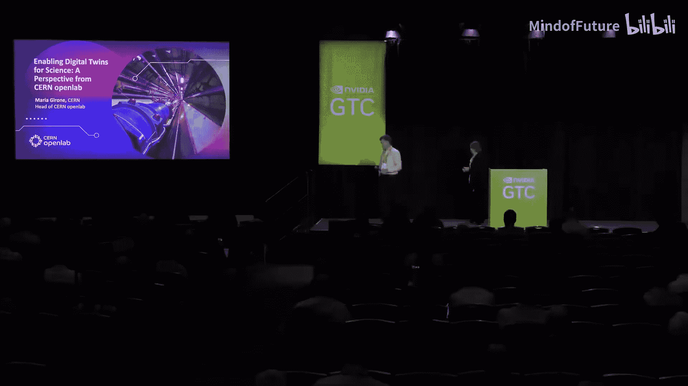

在本节课中，我们将学习数字孪生这一科学计算中的新兴概念，并了解欧洲核子研究中心如何通过其开放实验室，将这一技术应用于前沿物理研究及其他科学领域。

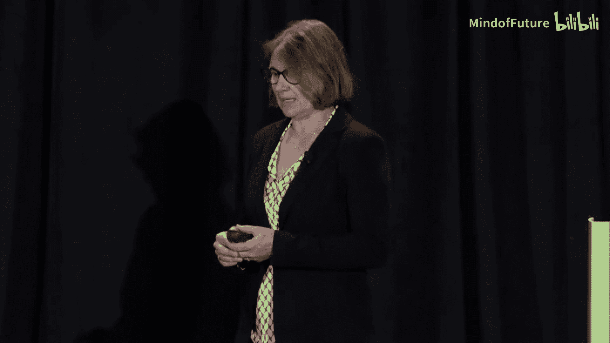

---

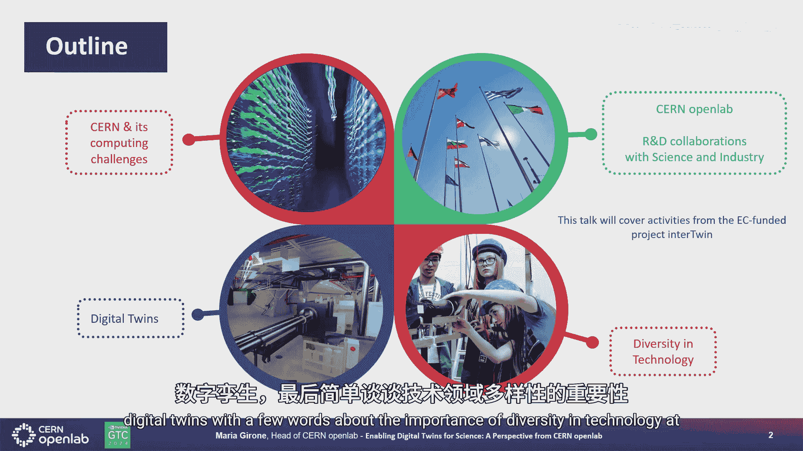

## P10.1：引言与概述 🎤

欢迎来到GTC大会。今天的演讲主题是数字孪生，这是科学计算中的一个新概念。

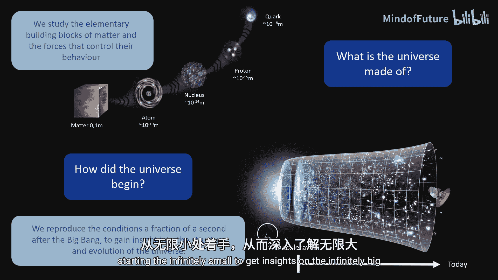

数字孪生概念起源于2002年的一次SME会议，由Michael Grieves提出，此后已发展成为变革科学研究的强大工具。今天，将由Maria Girone为我们介绍CERN如何应用数字孪生技术。

感谢Maria的参与。她目前是CERN开放实验室的主任，此前曾担任CTO，领导了高性能计算、人工智能和技术架构领域的变革性项目。

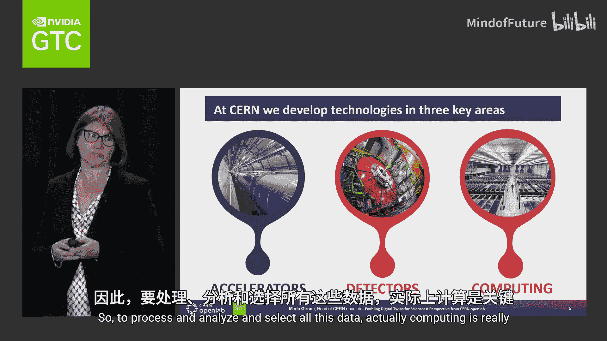

---

## P10.2：CERN及其计算挑战 🏛️

CERN是一个独特的工作场所，它是欧洲粒子物理实验室，也是当今世界上最大的实验室。

我们的目标是基础物理学研究，旨在理解宇宙的基本粒子和规律。我们通过研究物质的基本构成单元及其相互作用力，来回答诸如“宇宙由什么构成”、“生命如何起源”等根本性问题。

我们拥有一系列加速器，可以重现大爆炸后瞬间的条件。通过这种方式，我们从无限小的结构入手，获得对无限大宇宙的洞见。

进行基础物理研究需要在多个领域开发技术，主要集中在三个领域：加速器、探测器以及数据处理。高能物理是数据挖掘领域的领导者，我们目前已经是一个“极限规模”的科学项目。因此，计算对于处理、分析和筛选海量数据至关重要。

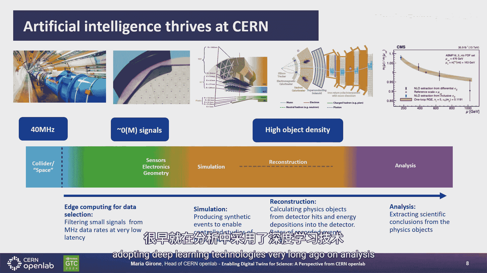

---

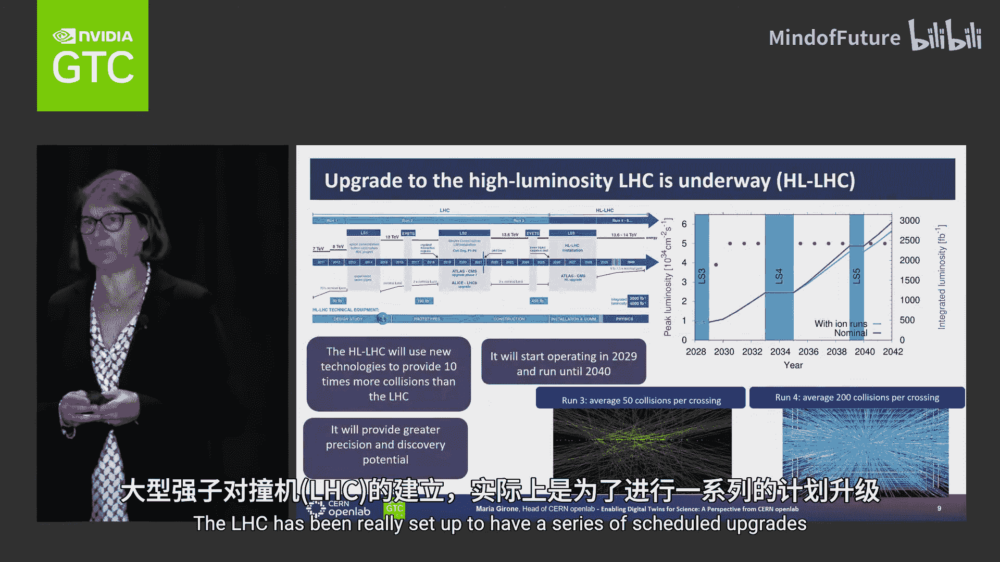

## P10.3：大型强子对撞机与数据处理链 ⚛️

CERN目前的旗舰项目无疑是大型强子对撞机。它位于地下100米深处，周长27公里，是一个规模巨大的基础设施。

LHC有四个巨型探测器，它们如同相机，用于观测粒子碰撞的结果。数据处理是一项极具挑战性的任务。我们从每秒4000万次的碰撞开始，从这些“巨型相机”中读取数百万个电子信号，经过一系列筛选和过滤，记录下最有趣的数据。

我们每秒记录数千个事件，然后需要对其进行分析和重建。重建是指从探测器热信号和能量沉积中计算出物理对象的过程。在分析步骤中，我们将数据与模拟事件的假设进行比较。

如今，人工智能已应用于数据处理链的每一步：从在低延迟环境中的边缘设备上进行数据采集和初步过滤，到模拟、重建和分析。CERN是这一领域的先驱，很早就开始在分析中采用深度学习技术。

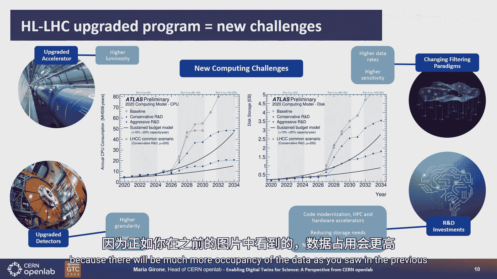

---

## P10.4：未来升级与计算挑战 🚀

LHC已规划了一系列升级。我们目前正处于“第三轮运行”的第二年。迄今为止，我们仅收集了LHC计划交付总数据集的10%，因此对这台机器的开发利用尚处于早期阶段。

到2030年左右，LHC将进入“高亮度LHC”运行模式，以收集剩余90%的数据。这对物理学意义重大，因为它能为科学家提供更庞大的数据集，以进行更高精度的研究，并提高发现新物理现象的潜力。

然而，进入高亮度LHC模式也意味着我们需要有能力解析比以往更复杂的事件。例如，平均每次束流对撞的碰撞次数将从5次增加到200次。要解析如此复杂的事件，我们必须彻底改变现有的数据处理和分析方式。

因此，LHC的升级也带来了一系列新的计算挑战：加速器本身需要升级，探测器需要更换部分组件以应对更高的数据占用率，实验将改变筛选范式，人工智能在边缘计算和低延迟环境中的应用变得至关重要。

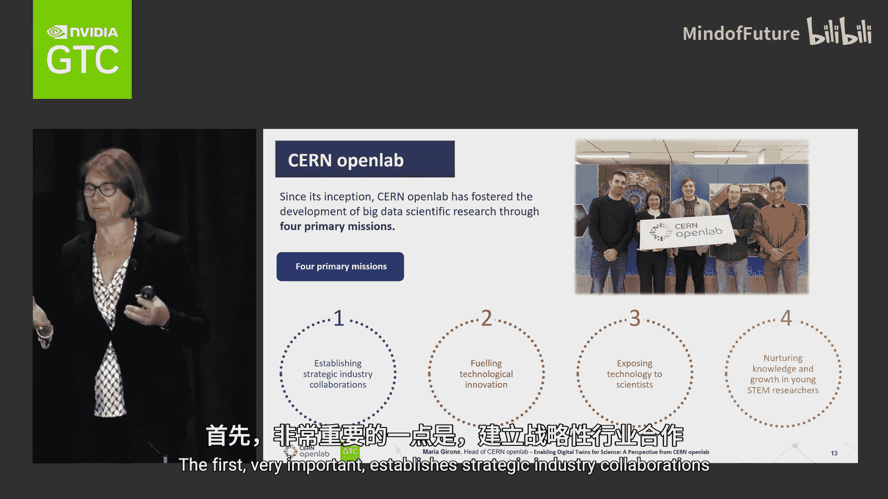

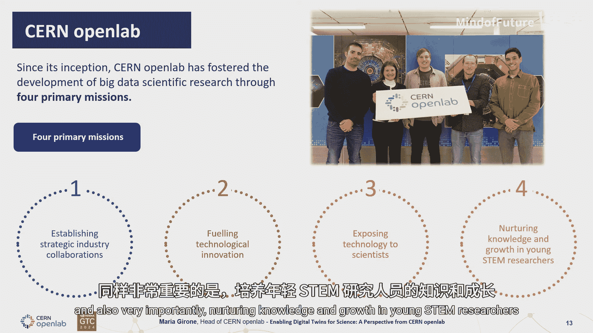

为了在有限的预算内满足资源需求，我们需要在代码现代化、采用高性能计算、使用硬件加速器、减少存储需求以及广泛应用人工智能等方面进行大量研发。

---

## P10.5：CERN开放实验室与产业合作 🤝

面对这些挑战，与科学界和工业界合作至关重要。CERN开放实验室正是为此而设立，旨在促进这种合作。

CERN开放实验室有四个主要使命：
1.  建立战略性的产业合作。
2.  推动技术创新。
3.  向科学家展示新技术。
4.  培养年轻的STEM研究人员。

我们以三年为一个阶段进行合作。目前正处于第八阶段，主要目标包括：为CERN的未来挑战开发可持续和新兴的计算存储解决方案；利用异构计算和人工智能打造更绿色的未来；以及促进科学与工业界之间的协同和技术交流。

我们通过两个主要研发方向实现这些目标：可持续基础设施和新兴技术。数字孪生正是新兴技术领域的关键部分。

---

## P10.6：InterTwin项目：统一的数字孪生引擎 🔬

我们在数字孪生领域的一个范例是欧盟委员会支持的InterTwin项目。该项目有三个主要目标：
1.  共同设计和实现一个统一的、跨学科的数字孪生引擎原型。
2.  使用开源平台和开放标准。
3.  使其能够服务于从物理学到地球观测等广泛多样的用例。

该项目拥有约30个参与者，包括科学界、技术界和资源提供方的领导者。项目围绕一个统一的核心引擎概念展开，该引擎支持来自不同科学领域的数字孪生用例，并提供对资源的访问。

CERN以其在关键领域的专业知识参与其中，例如：
*   大规模AI工作流的编排引擎。
*   我们主导的联邦数据湖基础设施。
*   一个来自粒子物理学的具体用例：粒子探测器的数字孪生。

这个探测器数字孪生模型使用生成对抗网络进行快速模拟，以模拟探测器对相互作用粒子的响应，并与Geant4等现有工具进行比较。它集成了运行条件设置，旨在针对不同的运行条件，在探测器数据采集和配置层面提供实时响应。

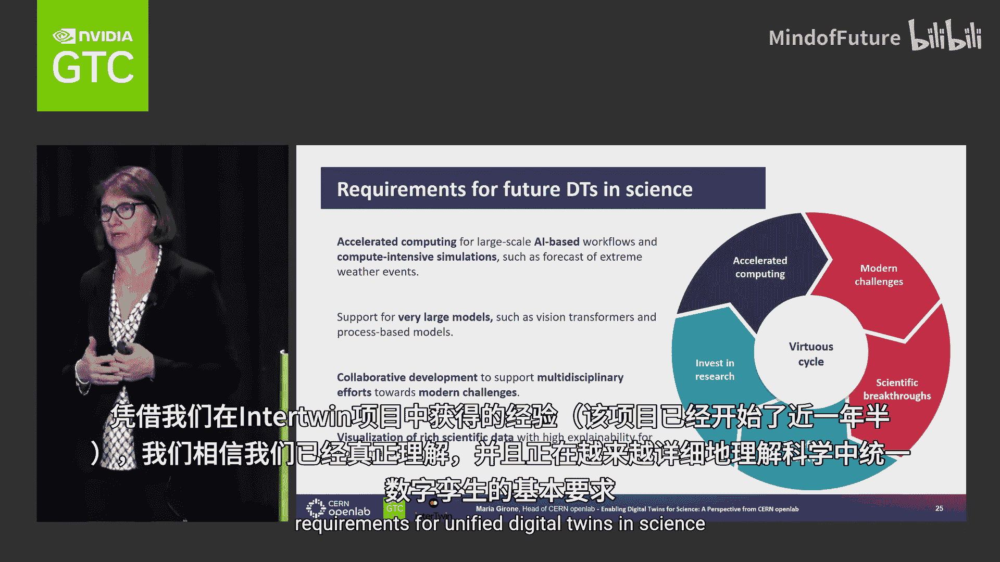

除了粒子物理，InterTwin项目还支持气候和环境科学领域的用例，例如预测火灾、风暴、洪水和干旱等极端事件。我们还在与欧洲中期天气预报中心等机构合作，构建用于大气建模的大型基础模型。

通过这些实践，我们正在深入理解科学领域统一数字孪生的基本要求。

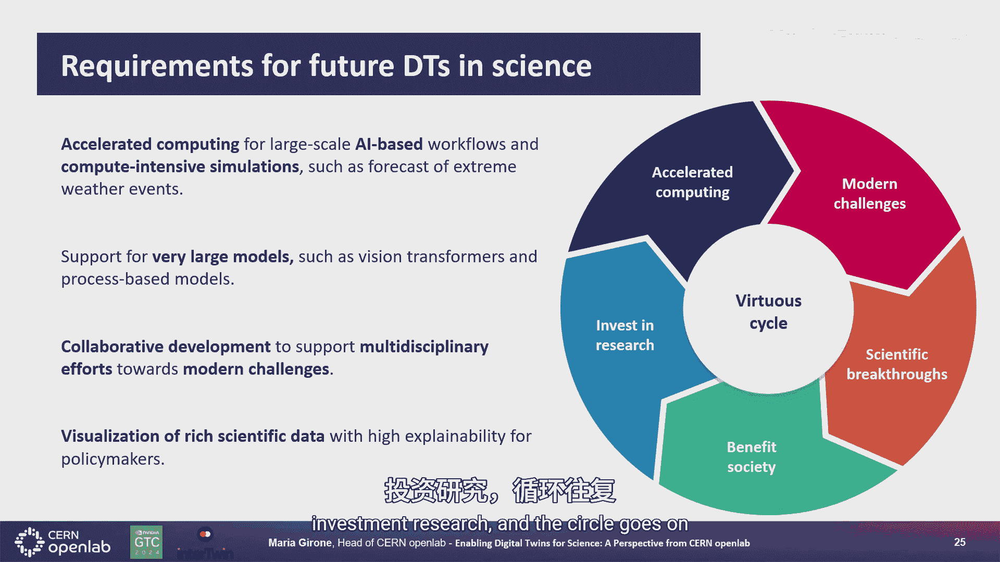

---

## P10.7：与NVIDIA Omniverse的集成概念验证 🖥️

最后，我想分享一个近期与NVIDIA进行的Omniverse集成概念验证。

我们拥有非常庞大的基础设施，并广泛使用CAD模型。在这个概念验证中，我们证明了可以使用NVIDIA Omniverse来导航和可视化我们的装置，例如光束线，效果非常出色。

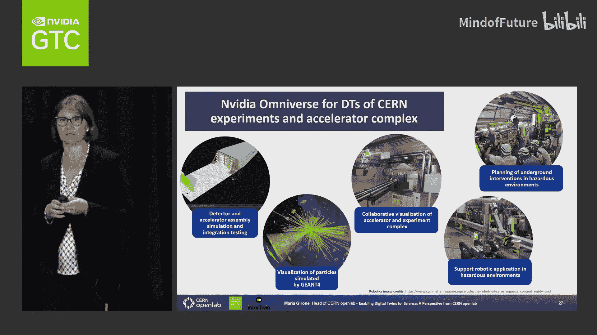

我们认为，这不仅可用于加速器和实验装置的协同可视化，还可用于探测器和加速器的组装模拟与集成测试、在狭窄或危险环境中的规划，以及机器人应用。我们也有兴趣探索将Omniverse作为模拟事件的可视化工具。

---

## P10.8：展望未来与总结 🌟

展望未来，我们希望：
*   通过CERN开放实验室与NVIDIA合作，扩大当前的努力规模。
*   考虑将Omniverse集成到InterTwin项目中，作为所有科学用例（特别是环境科学部分）的可视化工具。
*   针对高亮度LHC和未来环形对撞机等未来计划，探索更丰富的Omniverse用例。

最后，我想强调技术多样性非常重要，并感谢所有为此努力的人们。

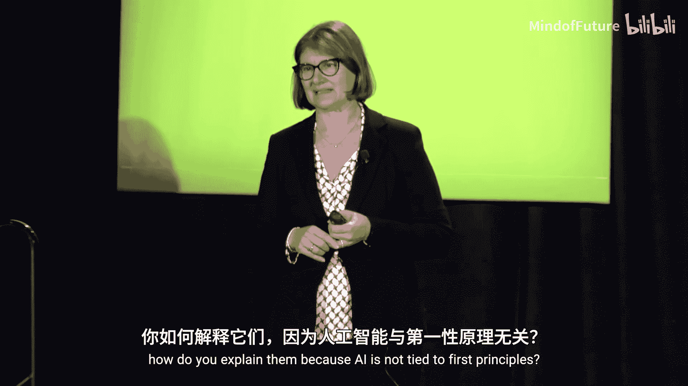

---

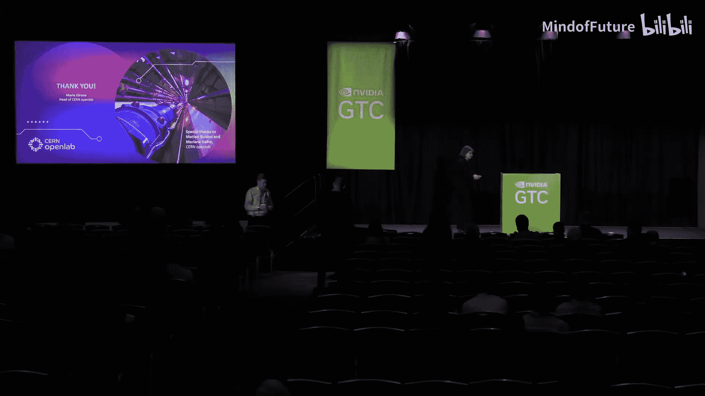

**本节课总结**：我们一起学习了数字孪生概念及其在CERN科学探索中的应用。从LHC的数据处理挑战，到CERN开放实验室的产业合作，再到InterTwin统一数字孪生引擎的具体实践以及与NVIDIA Omniverse的集成探索，我们看到了数字孪生技术如何帮助科学家更高效地理解复杂基础设施和科学过程，并为应对未来的科学挑战做好准备。