# 011：欧莱雅如何用生成式AI增强营销

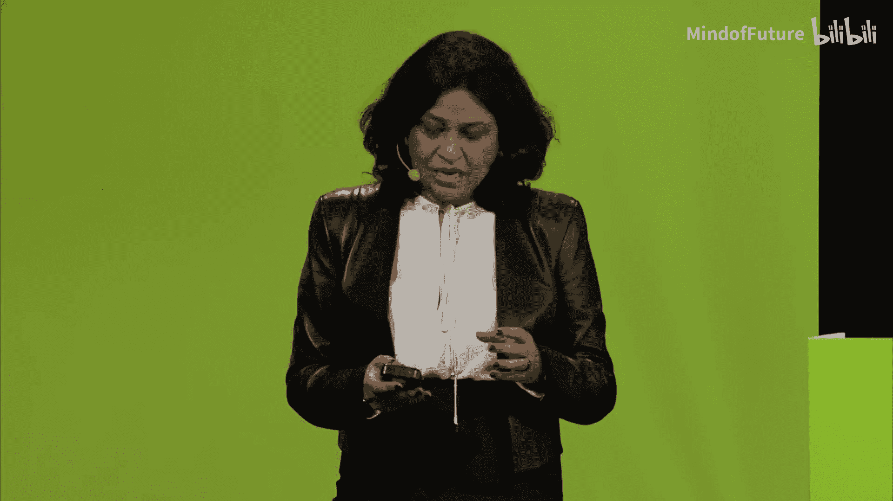

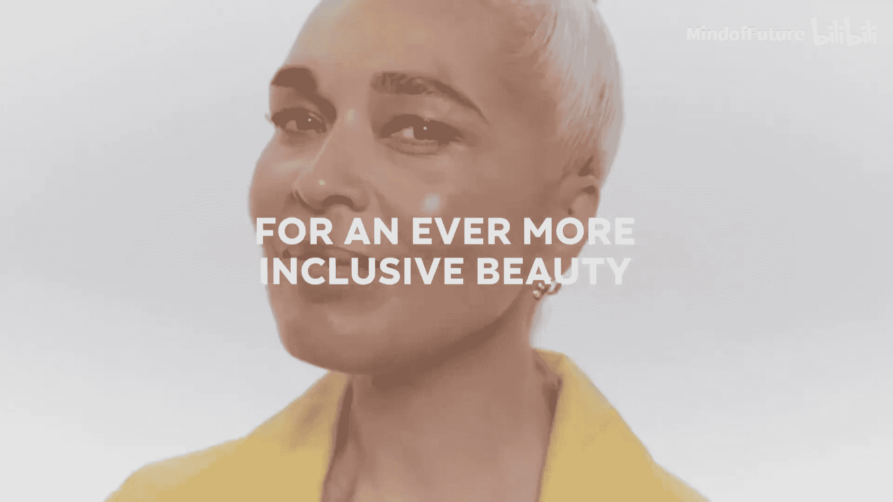

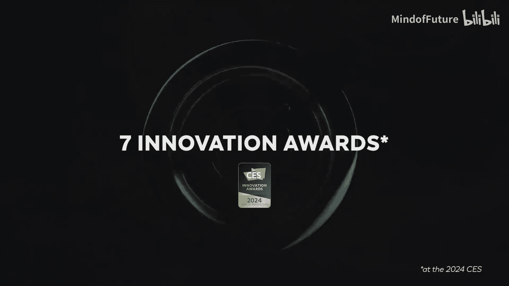

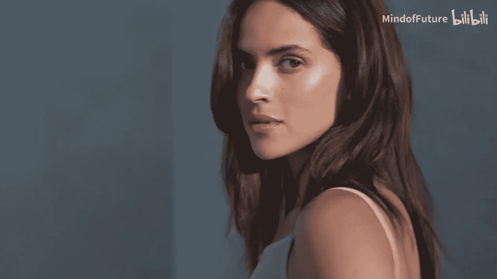

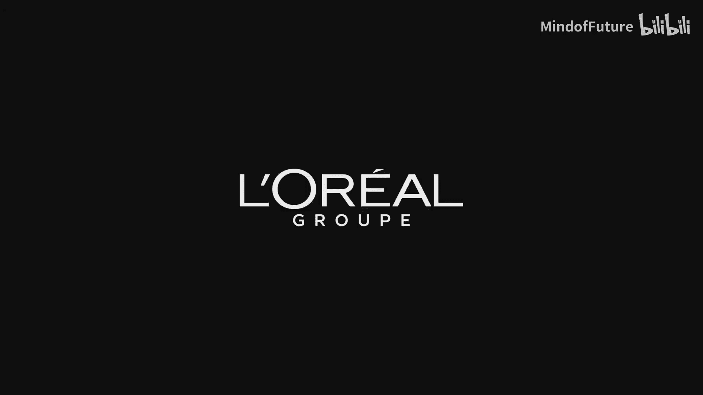

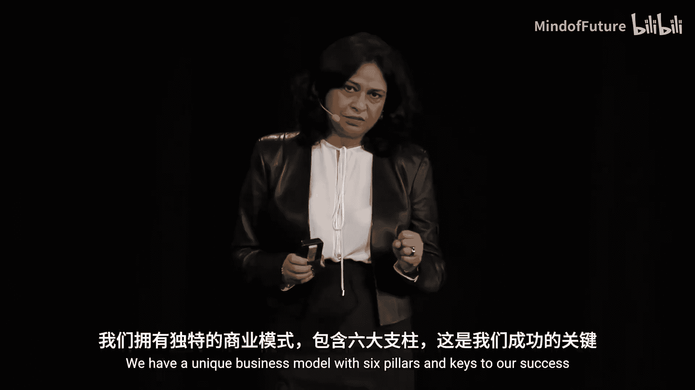

在本节课中，我们将学习欧莱雅集团首席数字与营销官艾斯米塔·杜贝在NVIDIA GTC 2024大会上的分享。我们将了解这家拥有115年历史的全球美妆领导者如何利用生成式AI技术来增强营销、激发创意，并塑造美妆行业的未来。

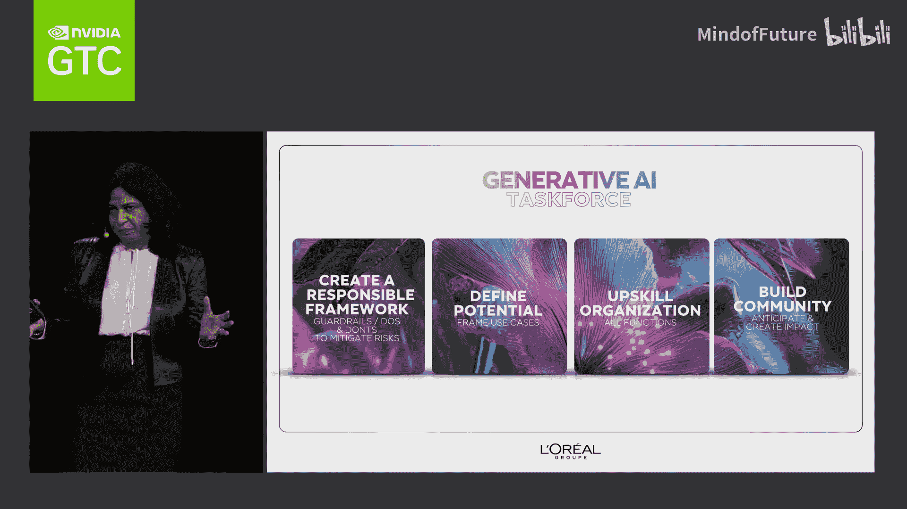

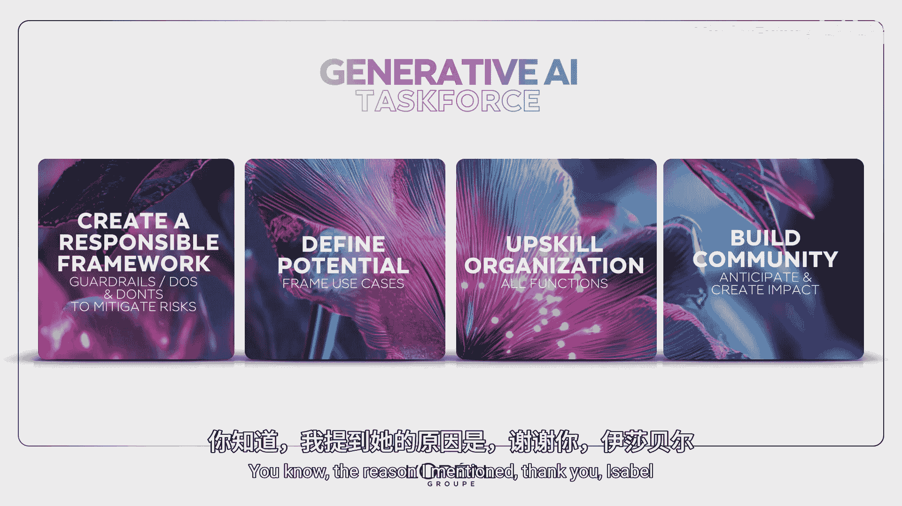

## 概述：欧莱雅与美妆科技

欧莱雅集团是全球美妆行业的领导者，其使命是“创造打动世界的美丽”。集团的成功建立在六大支柱之上：研发创新、37个全球品牌的力量、数字与技术领导力、制造能力、广告与推广的良性循环，以及独特的企业文化与价值观。

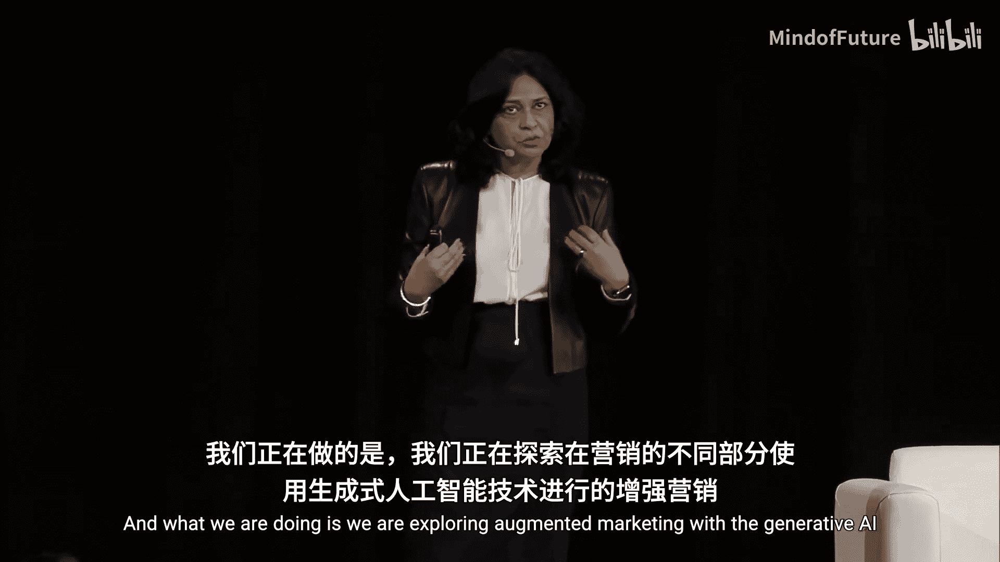

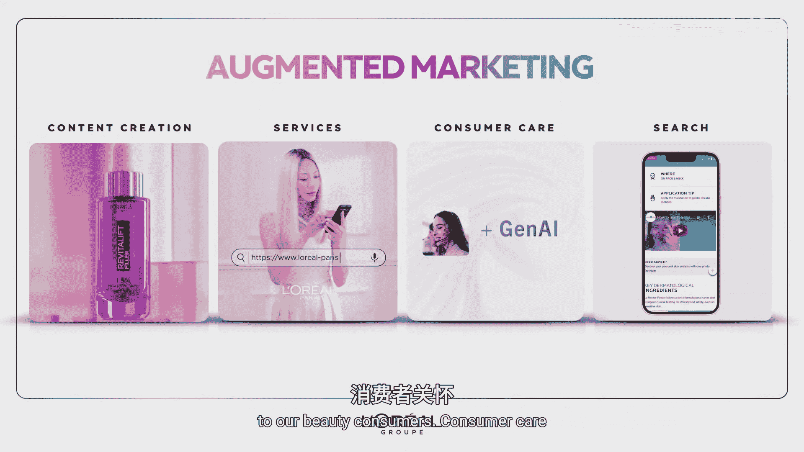

创新是欧莱雅的DNA。集团通过科学、技术和创意三大支柱，不断在实体、数字和虚拟世界中重塑美妆体验。如今，生成式AI技术为创意与技术的融合开辟了新的前沿。

## 构建生成式AI战略框架

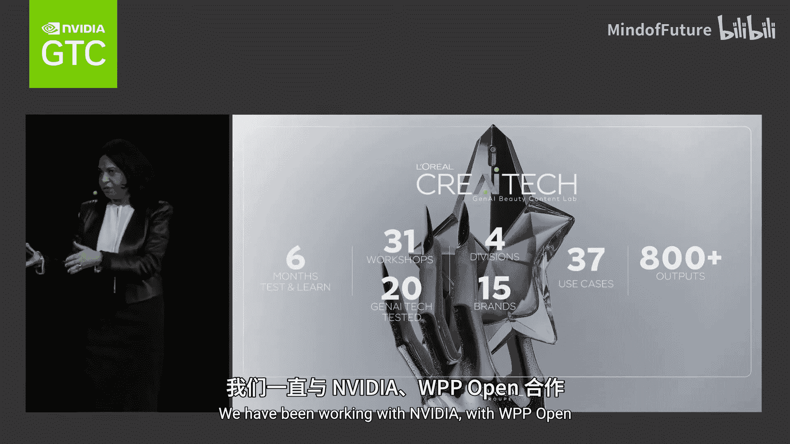

为了系统性地拥抱生成式AI技术，欧莱雅集团成立了专门的生成式AI工作组。这个工作组由伊莎贝尔·戈尼领导，其核心职责包括：
*   建立一个负责任的使用框架，制定明确的行为准则。
*   定义技术潜力并规划应用场景。
*   提升整个组织的相关技能。
*   建立一个能够预见并对整个组织产生更大影响的社区。

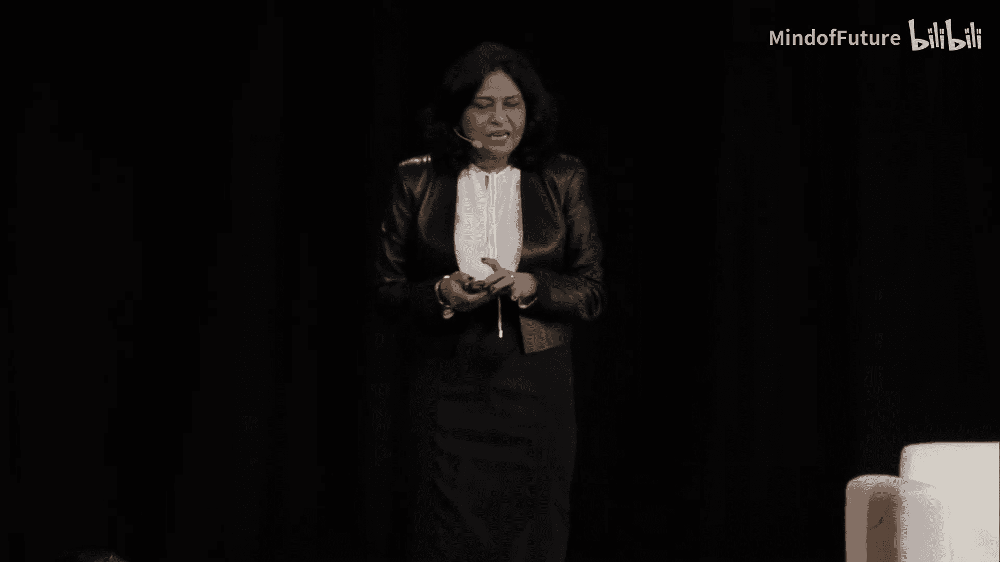

这个工作组与人力资源、研发、技术、数字和营销部门紧密合作，因为生成式AI的影响是多功能且触及组织各个部分的。

## 增强营销：四大应用领域

上一节我们介绍了欧莱雅的整体战略框架，本节中我们来看看生成式AI在营销领域的具体应用。欧莱雅正在探索“增强营销”，即利用生成式AI技术赋能营销的各个环节，主要集中在以下四个领域：

### 1. 内容创作
这是本次分享的重点。欧莱雅创建了名为“Cre.AI.Tech”的生成式AI美妆内容实验室，作为安全实验空间。在这里，他们为内容创作制定准则，汇聚技术和创意合作伙伴生态系统，并评估如何规模化地增强创意能力。

### 2. 服务
欧莱雅正在线上线下为美妆消费者带来新一代的美妆服务。

### 3. 客户关怀
通过利用意图检测和精准信息来增强客服人员的能力，从而提升客户满意度。欧莱雅正与Salesforce等合作伙伴在此领域进行试点。

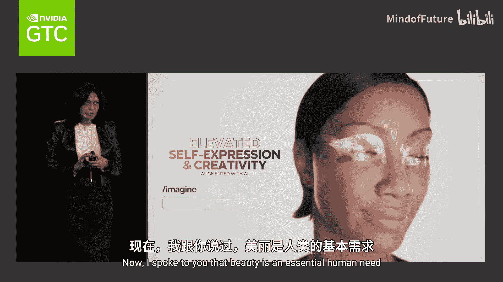

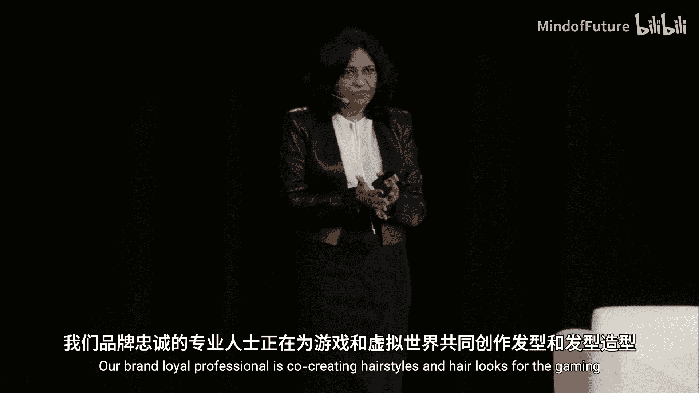

### 4. 搜索
全新的搜索体验正在形成，美妆搜索也正在经历革新。

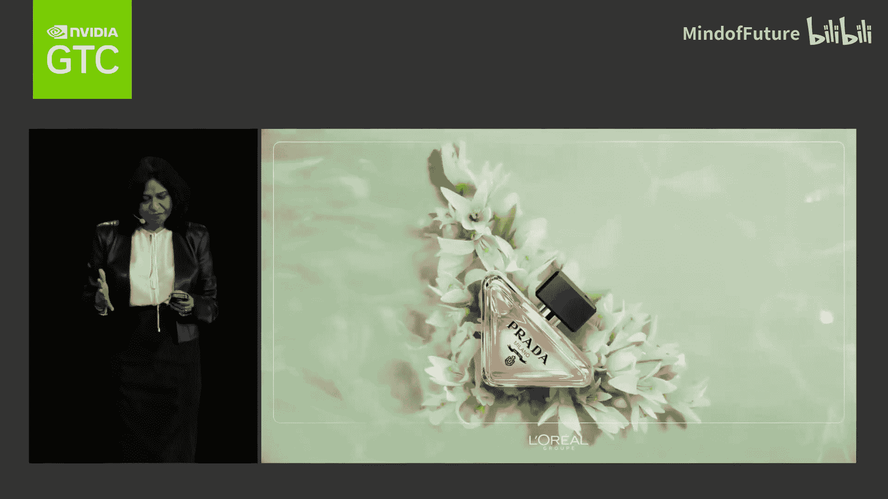

## 增强创意：Cre.AI.Tech实验室实践

在介绍了四大应用领域后，我们将深入探讨内容创作这一核心环节。欧莱雅认为，技术正在前所未有地激发创意，无论是文案、3D艺术家还是所有营销人员。因此，他们通过Cre.AI.Tech实验室来塑造美妆的未来。

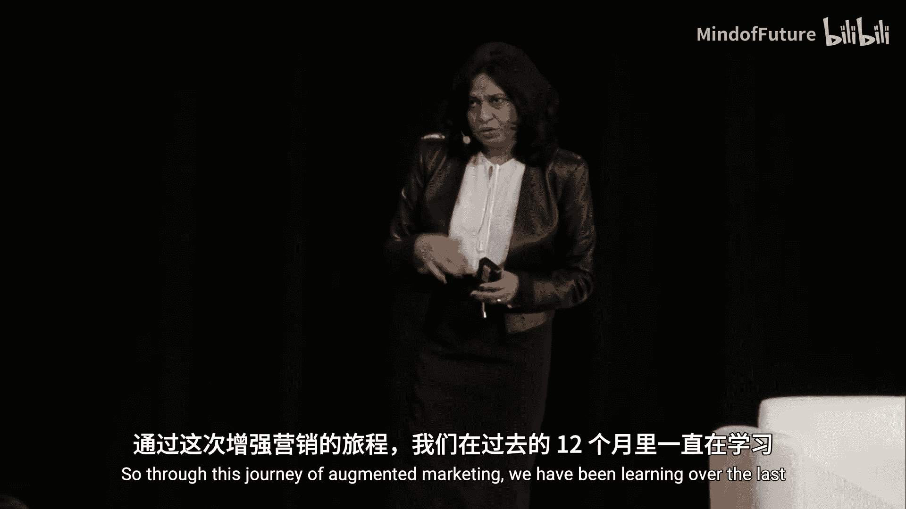

美妆是一种深刻个人化又高度社会化的需求。它关乎自我认同与表达。基于此，欧莱雅制定了一项重要原则：**不会使用AI生成的面孔、肌肤、身体或头发来增强其产品功效，或用于对外部呈现的美妆形象**。但会将这些AI生成形象用于激发对新美妆符号的灵感、内部故事板构思等场景。

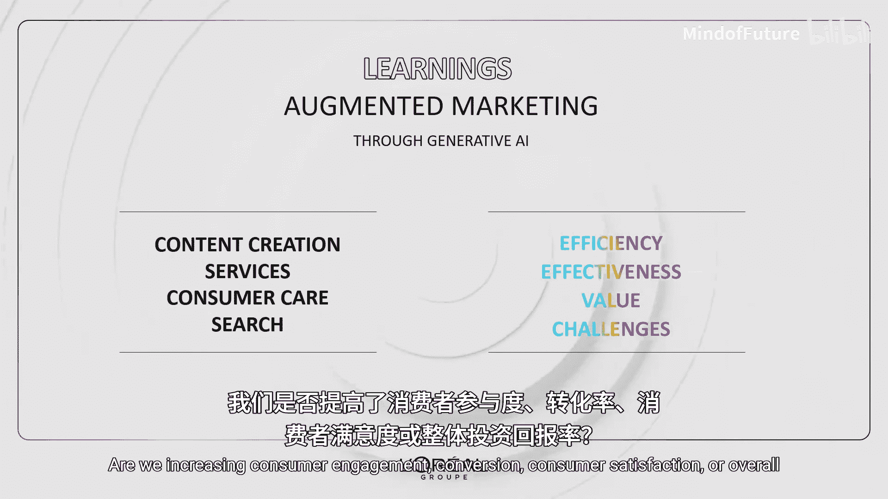

在过去的六个月中，欧莱雅与NVIDIA、WPP Open等合作伙伴合作，利用约20种不同的生成式AI技术，创建了超过800张美妆图像。以下是他们探索的一些方向：

*   **构想新美妆符号**：例如，通过提示词“未来主义浴室、智能镜子、AI界面、数据标签”生成连接智能镜子的体验图像；通过“护肤、网格图案、LED灯、时尚美妆”生成美妆科技图像。
*   **规模化产品图制作**：为旗下品牌生成数百张产品图。例如，为品牌“Carita”生成背景提示为“优雅的巴黎日落与埃菲尔铁塔背景、电影感灯光”的图片；为品牌“Biotherm”生成以“海洋蓝调、反射性水面、护肤之美、散落丝带”为提示的节日主题产品图。
*   **展示成分与产品宇宙**：例如，为活性成分“麦角硫因”生成以“紫色与蓝色灯光、抽象液体形态、黑色背景”为提示的图像；为“L‘Oréal Professionnel”发膜生成融合分子与产品宇宙的图像，提示词包括“金属液态球体、深棕色、金银色、优雅奢华氛围”。

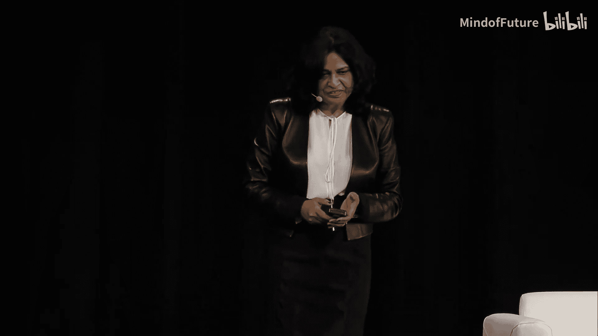

通过这些实践，欧莱雅学到：强大的创意指导和富有想象力、包含强烈品牌信号的提示词至关重要。他们证实，可以利用现有技术规模化生产产品图和背景。此外，他们还开始实验图像到视频的生成、翻译和配音，并与NVIDIA Omniverse和WPP Open合作创建产品的定制3D模型。**一旦拥有了产品多角度的3D模型，就可以轻松更换背景**，这节省了数天的拍摄时间和大量资源。

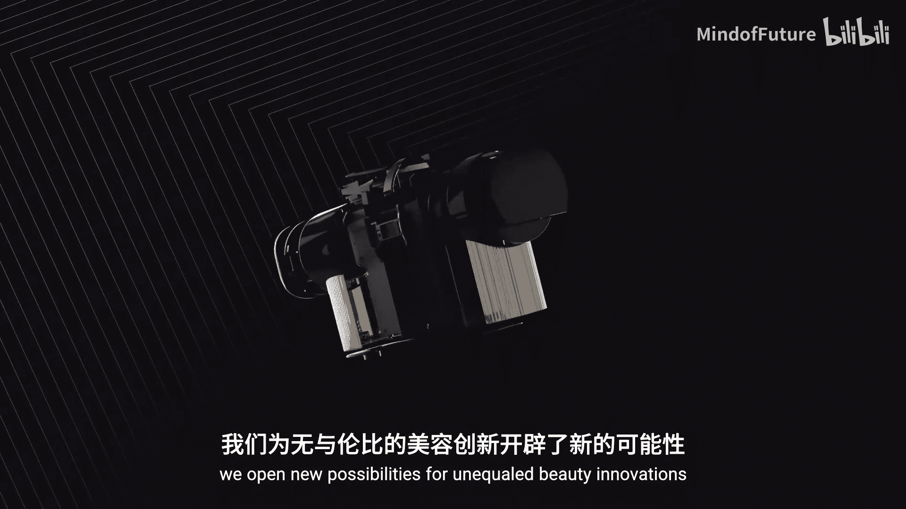

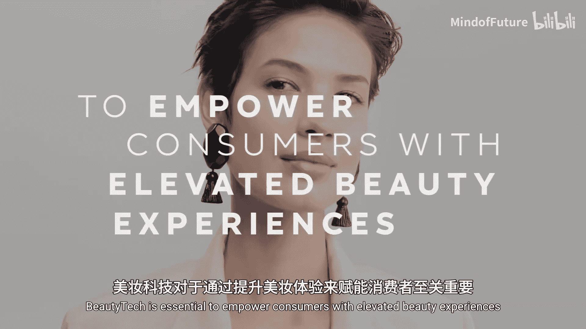

## 赋能虚拟世界与创作者经济

除了传统营销内容，欧莱雅也关注虚拟世界和新兴的创作者经济。

*   **虚拟形象造型**：针对习惯于在游戏世界中提升自我表达的Z世代，欧莱雅旗下品牌“L’Oréal Professionnel”正在为游戏和虚拟世界共同创作发型发色。生成式AI工具有助于将主打的3D发型从一个平台适配到另一个平台。
*   **携手新锐创作者**：欧莱雅与超过5万名影响者和创作者合作，并开始与新一代“创意科技艺术家”合作。这些艺术家利用AR、空间计算、AI和3D工具重新定义美妆图像和体验，合作跨越Meta、TikTok、Snapchat等平台及包括中国在内的多个市场。

## 提升消费者服务：L‘Oréal Paris Beauty Genius

欧莱雅相信，技术能够突破可能性的边界，满足美妆需求的无限多样性，即“科技赋能，美妆个性化”。因此，他们通过提升美妆服务来赋能消费者。了解到70%的消费者面对海量美妆选择感到无所适从，欧莱雅推出了“L’Oréal Paris Beauty Genius”个人美妆顾问服务。

该服务基于欧莱雅收购的AR/AI提供商“Modiface”的技术，具备三大功能：
1.  **个性化诊断**：提供皮肤个性化诊断或虚拟彩妆试妆。
2.  **个性化推荐**：基于品牌旗下超过750款护肤、彩妆和护发产品进行推荐。
3.  **个性化教育**：整合品牌官网和社交媒体内容进行知识普及。

这相当于为消费者提供了一个集服务、产品推荐和客户关怀于一体的美妆套件。

## 经验总结与未来展望

通过过去12个月在内容创作、服务、客户关怀和搜索等领域的“增强营销”实践，欧莱雅从效率（是否节省时间和资源）、有效性（是否改善上市速度、产量和质量）和价值（是否提升消费者互动、转化率和满意度）三个维度进行评估。

回顾增强创意之旅，欧莱雅于2023年4月启动，6月与WPP Open及NVIDIA Omniverse建立合作，7月建成Cre.AI.Tech实验室，随后进行了测试学习并产出了大量图像。展望未来，他们基于三大洞察规划下一步：
1.  **技术就绪度**：不同技术的输出和输入能力发展不均，且新能力不断涌现。
2.  **技术模块化**：构建多样化和模块化的生成式AI技术栈对大型企业有益，便于集成持续创新的技术。
3.  **数据价值**：需要对品牌数据集和训练数据进行有效管理，以确保输出质量并满足知识产权方面的合规要求。

## 总结：人机协同，创造未来

本节课中我们一起学习了欧莱雅如何利用生成式AI增强美妆营销。总结而言，欧莱雅正在通过**人机协同**的方式，利用生成式AI创造打动世界的美丽。

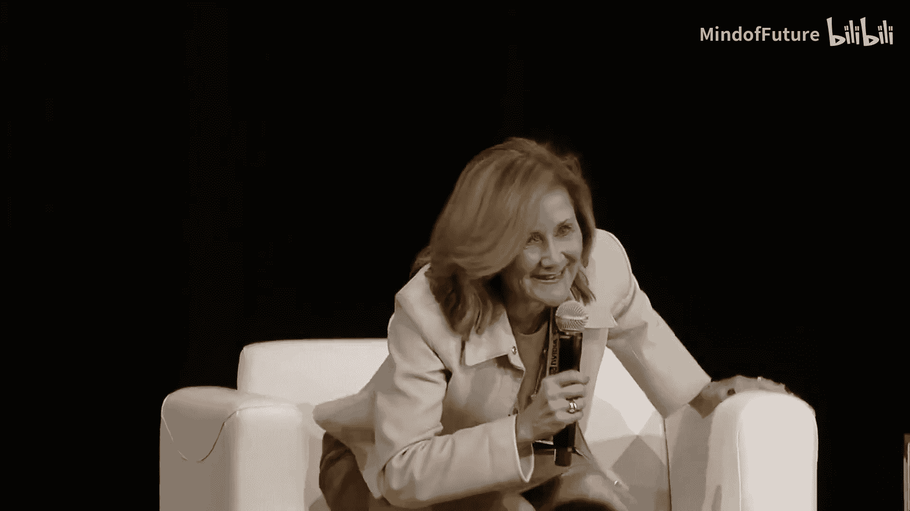

技术正以前所未有的方式激发创意。欧莱雅集团已做好准备，一方面拥抱创意增强，另一方面实现内容自动化。作为领先的美妆科技玩家，欧莱雅坚信“美妆科技”将助力其实现“科技赋能，美妆个性化”的愿景。他们将持续利用技术、数据、AI和生成式AI的力量，创造新的美妆符号，并构建品牌与消费者之间全新的关系。